# Windows 远程桌面服务 cve-2019-0708 漏洞分析 - 先知社区

Windows 远程桌面服务 cve-2019-0708 漏洞分析

- - -

## 漏洞说明

漏洞 cve-2019-0708 是一个 Windows 系统的远程桌面服务漏洞。从应用层面看，对应的是 rdp 服务的 3389 端口。再往深了了解，这个漏洞跟一个`termdd.sys`的内核文件有关，具体的漏洞点在`IcaBindVirtualChannels` 函数中。

本来想对比下补丁前后变化，无奈系统没有更新成功。把`cve-2019-0708`的补丁更新上了，漏洞仍然没有修补上，`termdd.sys`文件也没变化。只能借用一张网上的对比差异图片了

[](https://xzfile.aliyuncs.com/media/upload/picture/20240214172005-3d7d6082-cb1a-1.png)

先大致分析一下变化：在进行`_IcaBindChannel`前，先对比`v4+88`是否等于字符串`MS_T120`，然后再决定第三个参数为变量，还是固定值`31`。

## 漏洞触发过程

### 虚拟通道绑定

本地打开伪源码，直接定位到`IcaBindVirtualChannels`中调用`_IcaBindChannel`的位置。

[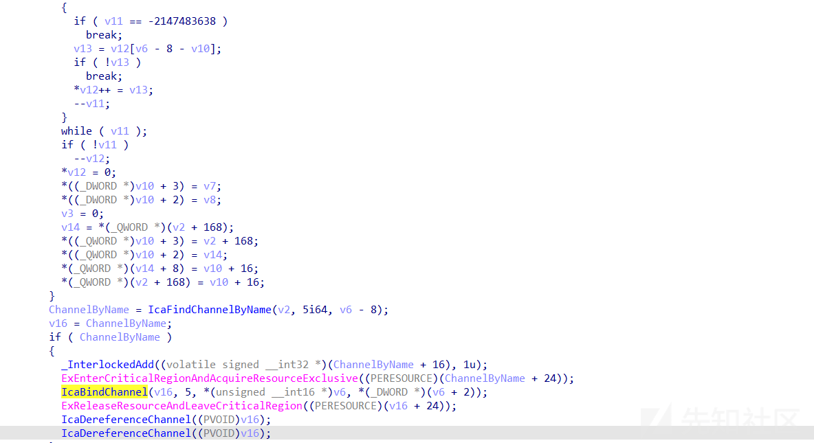](https://xzfile.aliyuncs.com/media/upload/picture/20240214172019-459e6798-cb1a-1.png)

要想给第三个、第四个参数指定值，首先要知道他们是干嘛的。往前分析，在一个`IcaFindChannelByName`的函数调用中用到了`v6`。根据这个函数名猜测，是用来根据名字找到通道，返回值大概率就是对应通道的结构体。

既然要根据通道名称找到通道结构体，肯定需要两个变量：1. 通道结构体链、2. 通道名称。第二个参数为固定值`5`，参数 1 和参数 3 就分别是其中之一了。

进入到函数内部，看看能不能找到线索。又碰到一个函数`IcaFindChannel`（找通道），用到了参数 a1、a2，已知参数 a2 是 int 型整数，那么 a1 就是通道结构体链了。a3 也就是通道名。

[](https://xzfile.aliyuncs.com/media/upload/picture/20240214172030-4c6a1e1e-cb1a-1.png)

接着往下看，在一个 while..do 循环中，用到了 a3，并且拿 a3 和一个循环体 V9 进行一定的偏移做对比。通过前边的分析，a3 为通道名字，这里的 v9 就是对应的通道结构体了。也可以在最后看到，如果相等，跳出循环，返回 v9。

[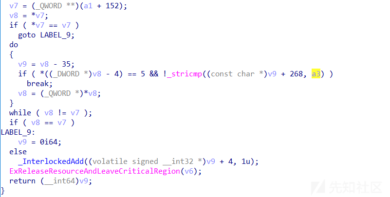](https://xzfile.aliyuncs.com/media/upload/picture/20240214172039-51aac126-cb1a-1.png)

下边调试看一下，是怎么个事。先设置断点在`termdd!IcaBindVirtualChannels`函数，用正常的 rdp 客户端去连接，成功触发断点。

从而找到调用`IcaFindChannelByName`函数的偏移量。

[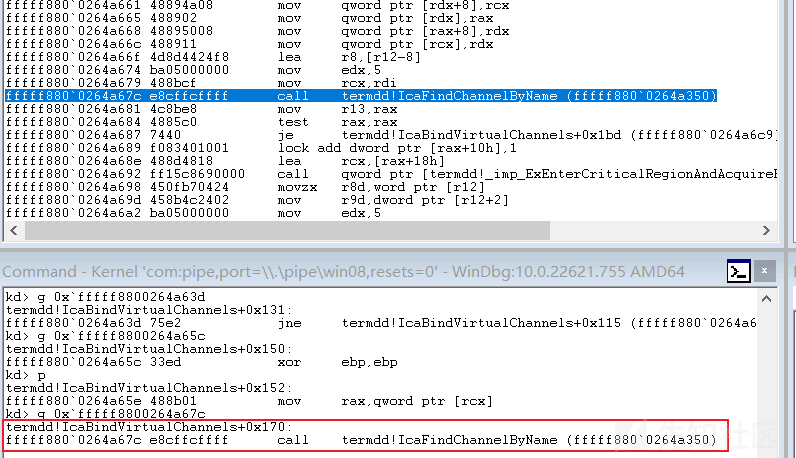](https://xzfile.aliyuncs.com/media/upload/picture/20240214172101-5e7f0c40-cb1a-1.png)

先来查看一下参数 3 是不是之前猜测的通道名。是一个字符串`MS_T120`

[](https://xzfile.aliyuncs.com/media/upload/picture/20240214172114-6663480e-cb1a-1.png)

下边在`IcaFindChannelByName`调用的位置设置断点，查看通道名，依次分别为：`MS_T120、CTXTW 、rdpdr、rdpsnd、cliprdr、drdynvc`共 6 个。

正常情况下，不会重复创建通道，也就不会运行到已存在通道下边的逻辑，触发不了`IcaBindChannel`。

下边就需要看看通道是怎么创建的。

通过前边的测试，这些通道都是在进行 RDP 连接请求时创建的。下边抓一下包，看看怎么个情况。

连接的过程产生了很多包，直接找到第一个 rdp 数据包。可以看到，客户端请求创建了 4 个通道，后边的数据包也没看到另外两个的身影。

[](https://xzfile.aliyuncs.com/media/upload/picture/20240214172126-6df47778-cb1a-1.png)

服务端返回的是通道对应的通道 ID

[](https://xzfile.aliyuncs.com/media/upload/picture/20240214172133-72111f32-cb1a-1.png)

但是在后边的通道调用中，却是 6 个通道 ID

[](https://xzfile.aliyuncs.com/media/upload/picture/20240214172142-7743d3e6-cb1a-1.png)

这里找不到更多信息了，思路回到前边猜测的可能的漏洞触发条件，把断点设到`IcaFindChannelByName`调用成功后才会运行的代码段。

[](https://xzfile.aliyuncs.com/media/upload/picture/20240214172152-7cfb3e78-cb1a-1.png)

通过正常的 RDP 客户端去连接，并不能触发这个断点。通过自己编写脚本，模拟 RDP 客户端，不同的是，向通道“MS\_T120”发送绑定请求，成功触发断点。

[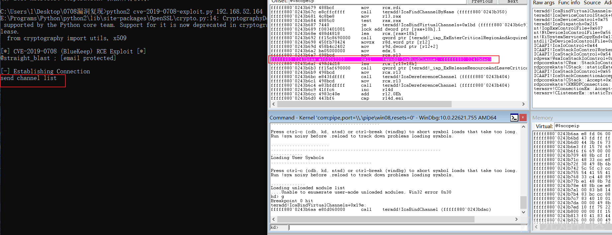](https://xzfile.aliyuncs.com/media/upload/picture/20240214172159-8145f086-cb1a-1.png)

现在成功触发了漏洞点，但是还不知道可以做什么。下边分析一下`MS_T120`通道的生命周期。

### 通道创建过程

在反编译的代码函数中，看到一个`IcaCreateChannel`的函数，可能跟创建通道有关系。

[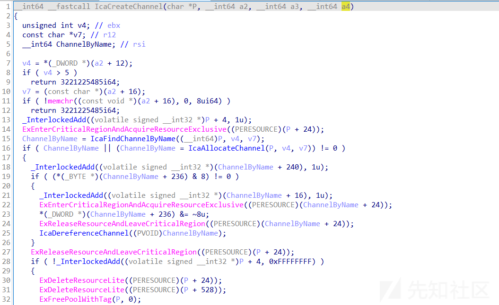](https://xzfile.aliyuncs.com/media/upload/picture/20240214172207-8635dd2c-cb1a-1.png)

设置一个断点，看看调用情况

[](https://xzfile.aliyuncs.com/media/upload/picture/20240214172216-8b749a9e-cb1a-1.png)

内核层面的看不到更多创建信息，找到用户层对应的代码，进一步分析。通过一步步分析，在 rdpwsx 中找到了有用的信息。在`rdpwsx!MCSCreateDomain`中，直接把`MS_T120`硬编码在代码中，用来调用`IcaChannelOpen`，如果打开成功，通过`CreateIoComptionPort()`函数把通道结构绑定到完成异步 IO 端口句柄上句柄`CompletionPort`。

[](https://xzfile.aliyuncs.com/media/upload/picture/20240214172232-94bc1f5a-cb1a-1.png)

下边再看看对`CompletionPort`的操作，通过交叉引用，找到这几个。前两个直接排除，第三个和后两个都是删除和清除，肯定也不是。

[](https://xzfile.aliyuncs.com/media/upload/picture/20240214172240-99b03230-cb1a-1.png)

打开`MCSInitialize`函数，看看怎么个情况。

先创建 I/O 完成端口，将创建的 I/O 完成端口句柄保存到全局变量 CompletionPort。如果创建失败，关闭之前创建的对象，然后返回错误码 11。

如果成功，创建线程，并将创建的 I/O 完成端口句柄传递给线程，线程主函数`IoThreadFunc`

[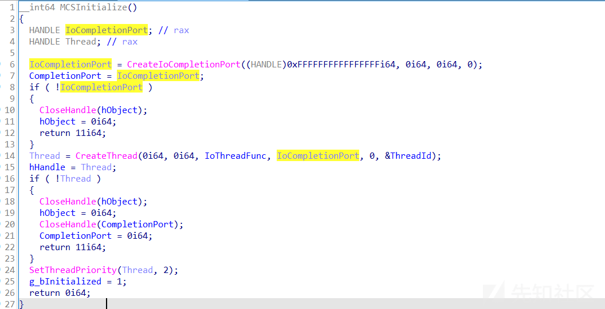](https://xzfile.aliyuncs.com/media/upload/picture/20240214172251-a07d7a00-cb1a-1.png)

接着跟进函数`IoThreadFunc`。调用 `GetQueuedCompletionStatus` 函数等待从 I/O 完成端口队列中取出已完成的异步 I/O 操作。如果成功获取完成状态，会得到相关的信息，包括完成键（`CompletionKey`）、传输字节数（`NumberOfBytesTransferred`）、重叠结构指针（`Overlapped`）等。

[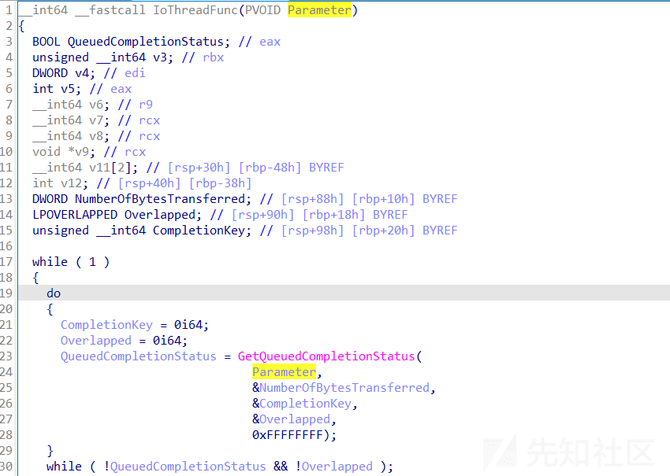](https://xzfile.aliyuncs.com/media/upload/picture/20240214172304-a82e3c44-cb1a-1.png)

指定临界区对象的所有权，也就是设置当前栈顶。这里设置为缓冲区偏移 8

[](https://xzfile.aliyuncs.com/media/upload/picture/20240214172321-b272d96c-cb1a-1.png)

可以看出，缓冲区偏移 64 为通道地址句柄，偏移 176 为数据的起始地址。

[](https://xzfile.aliyuncs.com/media/upload/picture/20240214172330-b7578752-cb1a-1.png)

如果缓冲区偏移 184 的值等于 2，就关闭通道。通过前边的分析知道 v4 是读取的数据量，如果读取了 32 个字节，进行其他操作。

```bash
184-176 = 8
32 / 2 = 16
```

也就是说，向通道发送的数据，第 9 位等于`2`，并且发送 16 个字符，就可以触发关闭通道流程。

[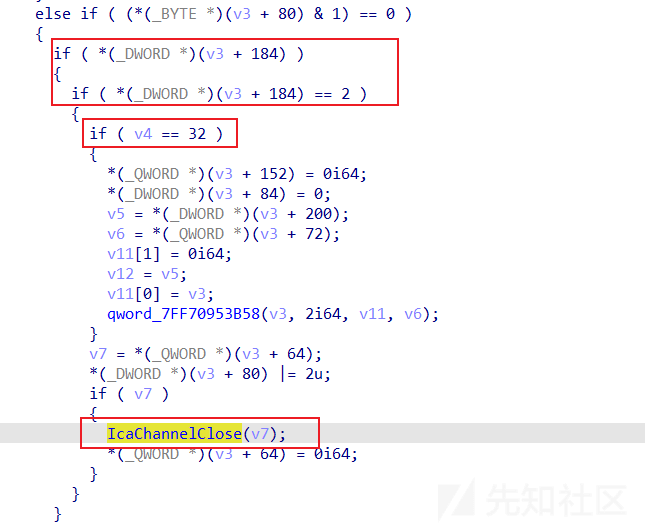](https://xzfile.aliyuncs.com/media/upload/picture/20240214172340-bd53a906-cb1a-1.png)

分析到这里，基本清楚了。下边编写代码证实一下，主要就是向`MS_T120`通道

### 漏洞点触发

发送数据，并且第 9 位为`2`

```bash
free_mst120_channel = 'A' * 8 + '\x02' + '\x00' * 7
```

[](https://xzfile.aliyuncs.com/media/upload/picture/20240214172351-c4674540-cb1a-1.png)

结果 win2008 蓝屏了，

[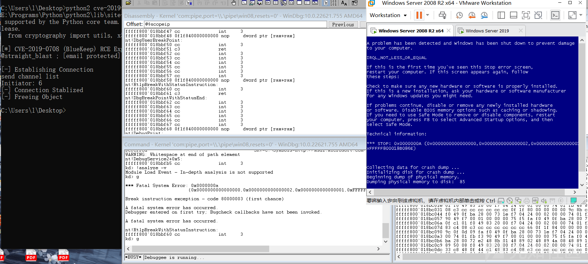](https://xzfile.aliyuncs.com/media/upload/picture/20240214172357-c7f818b0-cb1a-1.png)

从 debug 信息来看，崩溃原因是在`IcaDereferenceChannel`处。从函数名来看，这是一个解引用通道的函数。我们已经关闭了一次通道，系统再次关闭通道，导致报错。

[](https://xzfile.aliyuncs.com/media/upload/picture/20240214172407-cd67db46-cb1a-1.png)

至此，整个触发过程分析结束。

但是，现在只能进行 DOS 攻击，并不能 RCE。下边还需要分析 exp 构造

## 利用原理

通过参考文章[CVE-2019-0708：远程桌面服务漏洞综合分析](https://www.zerodayinitiative.com/blog/2019/5/27/cve-2019-0708-a-comprehensive-analysis-of-a-remote-desktop-services-vulnerability)，及 msf 文档，知道漏洞 rce 过程：

CVE-2019-0708 BlueKeep RDP 远程 Windows 内核释放后使用

RDP，我们能够释放与 MS\_T120 通道关联的数据结构。单独释放结构并没有多大用处，但控制其内容却很有用。使用 UAF（释放后使用），目标是释放一个对象，然后分配一个假对象代替它。通过用我们自己的数据替换真实对象的内容，我们可以对使用它的代码进行更广泛的控制。我们可以用我们的假通道结构做什么完全取决于该结构的用途。

能够替换的通道结构由函数 IcaFindChannel 和 IcaFindChannelByName 返回。为了找到通过操纵这个通道结构可以做什么，我需要找到它的使用位置。

## 虚拟通道分析

虚拟通道结构体：[https://learn.microsoft.com/en-us/previous-versions/windows/embedded/aa513856(v=msdn.10](https://learn.microsoft.com/en-us/previous-versions/windows/embedded/aa513856(v=msdn.10))

```bash
#define CHANNEL_NAME_LEN 7
typedef struct tagCHANNEL_DEF {
  char name[CHANNEL_NAME_LEN + 1];
  ULONG options;
} CHANNEL_DEF,*PCHANNEL_DEF,**PPCHANNEL_DEF;
```

-   **name**  
    包含虚拟通道名称的以 Null 结尾的字符串。虚拟频道名称可以包含 1 到 CHANNEL\_NAME\_LEN 个字符。
-   **options**  
    指定该虚拟通道的选项。下表显示了可以组合使用的可能值。

| Value | Description |     |
| --- | --- | --- |
| CHANNEL\_OPTION\_ENCRYPT\_CS | 加密客户端到服务器的数据。 | 0x10000000 |
| CHANNEL\_OPTION\_ENCRYPT\_RDP | 根据远程桌面协议 (RDP) 数据加密进行加密。也就是说，如果 RDP 数据已加密，则也对此通道进行加密。 | 0x40000000 |
| CHANNEL\_OPTION\_INITIALIZED | 通道已初始化。该值由 **VirtualChannelInit** 或 **VirtualChannelInitEx** 函数设置。 | 0x80000000 |
| CHANNEL\_OPTION\_REMOTE\_CONTROL\_PERSISTENT | 该通道被声明为远程控制持久通道。这意味着当启动一个会话来隐藏当前会话时，或者当远程控制连接或断开连接到客户端的会话时，服务器端不会关闭通道。有关详细信息，请参阅[远程控制持久虚拟通道](https://learn.microsoft.com/en-us/previous-versions/windows/embedded/ms861761(v=msdn.10))。 | 0x00100000 |
| CHANNEL\_OPTION\_SHOW\_PROTOCOL | 影响服务器端如何接收[VirtualChannelWrite](https://learn.microsoft.com/en-us/previous-versions/windows/embedded/ms879680(v=msdn.10))发送的数据。如果设置了该值，则每个数据块前面都有一个 CHANNEL\_PDU\_HEADER 结构。如果未设置此值，则数据块仅包含指定给 **VirtualChannelWrite** 的数据。 | 0x00200000 |
| CHANNEL\_OPTION\_COMPRESS | 保留以供将来使用。 | 0x00400000 |
| CHANNEL\_OPTION\_COMPRESS\_RDP | 保留以供将来使用。 | 0x00800000 |
| CHANNEL\_OPTION\_ENCRYPT\_SC | 保留以供将来使用。 | 0x20000000 |
| CHANNEL\_OPTION\_PRI\_HIGH | 保留以供将来使用。 | 0x08000000 |

参考[zero day initiative](https://www.zerodayinitiative.com/blog/2019/5/27/cve-2019-0708-a-comprehensive-analysis-of-a-remote-desktop-services-vulnerability) 对虚拟通道的分析，我们知道。客户端请求的所有虚拟通道都是使用 **termdd!IcaCreateChannel()**创建的。然后，指向这些通道结构的指针存储在一个表中，我们将其称为**ChannelPointerTable**。

当与 RDP 客户端建立连接时，包括 **MS\_T120** 在内的所有静态虚拟通道均由 Windows RDP 服务器在内部初始化，并由 **ChannelPointerTable** 指向。

**ChannelPointerTable** 上边的通道是由**IcaBindChannel**写上去的。

[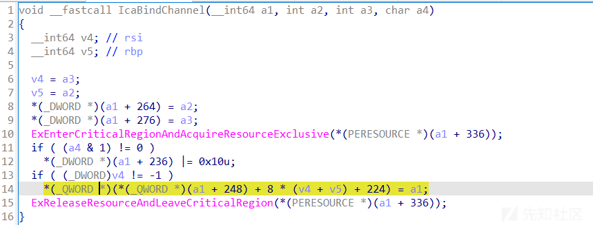](https://xzfile.aliyuncs.com/media/upload/picture/20240214172539-049642a6-cb1b-1.png)

设置断点：`termdd!IcaBindChannel`，看看怎么个事。从调用链可以看出来，此时是首次创建通道。

[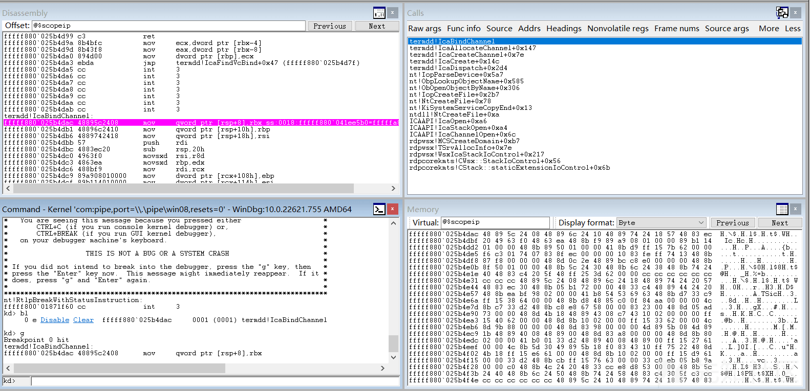](https://xzfile.aliyuncs.com/media/upload/picture/20240214172547-096284d4-cb1b-1.png)

通过上篇分析，我们知道第一个参数是通道结构指针，第三个参数是下标。

在**IcaFindChannelByName**中我们知道，虚拟通道指针偏移 268 为该虚拟通道名字

[](https://xzfile.aliyuncs.com/media/upload/picture/20240214172559-106dd530-cb1b-1.png)

十进制 268 转换为 16 进制为 0x10c。16 进制 1f 转换成 10 进制是 31，也就是说，虚拟通道**MS\_T120**默认在通道指针表中的下标为**1f**

[](https://xzfile.aliyuncs.com/media/upload/picture/20240214172611-1747e3e6-cb1b-1.png)

构造了一条 windbg 命令，`bp termdd!IcaBindChannel "da rcx + 0x10c; r r8"`来查看所有的虚拟通道，以及在通道地址表中的下标，

[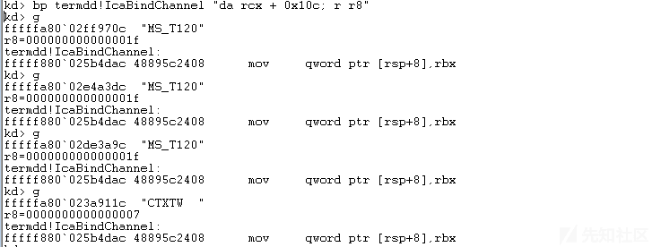](https://xzfile.aliyuncs.com/media/upload/picture/20240214172622-1e5777fa-cb1b-1.png)

整理如下

| Index Number | ChannelControlStructure Pointer |
| --- | --- |
| 0   | 指针指向 RDPDR |
| 1   | 指针指向 RDPSND |
| 2   | 指针指向 CLIPRDR |
| 3   | 指针指向 DRDYNVC |
| 4   |     |
| 5   |     |
| 6   |     |
| 7   | 指针指向 CTXTW |
| 8   |     |
| ······ |     |
| 1f  | 指针指向 MS\_T120 |
|     |

这是正常情况下的虚拟通道绑定情况，如果客户端用户单独制定某个通道，会是什么情况哪？我们利用脚本编写程序，向服务端发送 3 个通道绑定请求，三个通道分别是；\['rdpdr', 'MS\_T120', 'rdpsnd'\]。

可以看到两个 MS\_T120 虚拟通道的下标并不一样，我们发送的 MS\_T120 虚拟通道分配的下标是**1**。

[](https://xzfile.aliyuncs.com/media/upload/picture/20240214172644-2b262044-cb1b-1.png)

原本的**rdpsnd**从 1 变成了 2。

[](https://xzfile.aliyuncs.com/media/upload/picture/20240214172654-3112b418-cb1b-1.png)

也就是说，`"MS_T120"`和`"CTXTW "`是服务端默认绑定的。我们发起的虚拟通道其中重复的又绑定了一次。

当客户端在“MCS Connect 初始和 GCC 创建”期间指定名称为**MS\_T120\\x00**的通道时，*termdd!IcaCreateChannel()* 调用*termdd!IcaFindChannelByName()* 并返回下标 **0x1F** 中现有的 MS\_T120 通道结构。然后，该通道结构被视为新的虚拟通道条目，并在“MCS Attach User Request”期间存储在其他下标（在本例中为下标**1**）中。

| Index Number | ChannelControlStructure Pointer |
| --- | --- |
| 0   | 指针指向 RDPDR |
| 1   | 指针指向 MS\_T120 |
| 2   | 指针指向 RDPSND |
| 3   |     |
| 4   |     |
| 5   |     |
| 6   |     |
| 7   | 指针指向 CTXTW |
| 8   |     |
| ······ |     |
| 1f  | 指针指向 MS\_T120 |

随后将精心构造的数据发送到 MS\_T120 通道，termdd.sys 使用 termdd!IcaCloseChannel() 关闭通道，并清除插槽处的指针。（运行示例中的下标 **1**）但是，插槽 **0x1F** 中的同一指针并未被清除。随后，当连接终止时，将调用 **RDPWD!HandleDisconnectProviderUlt()**，进而调用 ***termdd!IcaChannelInputInternal( )*** 并尝试使用插槽 0x1F 处的指针再次销毁已释放的 MS\_T120 通道结构。销毁过程由通道结构中的指针指向的函数调用。这会导致释放后使用的情况。

[](https://xzfile.aliyuncs.com/media/upload/picture/20240214172704-376d9774-cb1b-1.png)

也就是说，如果我们可以伪造通道，就可以执行任意代码。那么，怎么伪造这个通道？

## 堆喷射

### 名词解释 - 维基百科

堆喷射实际上并不会利用任何安全问题，但它可以用来使漏洞更容易被利用。堆喷射本身不能用来打破任何安全边界：需要一个单独的安全问题。

利用安全问题通常很困难，因为各种因素都会影响这一过程。内存和时序的偶然对齐引入了很多随机性（从攻击者的角度来看）。堆喷射可用于引入大量订单来补偿这一点并增加成功利用的机会。堆喷射利用了这样一个事实：在大多数体系结构和操作系统上，大型堆分配的起始位置是可预测的，并且连续分配大致是连续的。这意味着每次运行堆喷射时，喷射的堆将大致位于相同的位置。

漏洞利用通常使用特定字节来喷射堆，因为存储在堆上的数据具有多种作用。在利用安全问题期间，通常可以使应用程序代码从内存中的任意位置读取地址。然后代码使用该地址作为要执行的函数的地址。如果漏洞利用可以强制应用程序从喷射堆中读取该地址，则当代码使用该地址作为函数指针并将其重定向到喷射堆时，它可以控制执行流程。如果漏洞利用成功将控制流重定向到喷射的堆，则那里的字节将被执行，从而允许漏洞利用执行攻击者想要的任何操作。因此，堆上的字节仅限于表示堆喷射本身内的有效地址，保存目标体系结构的有效指令，因此应用程序不会崩溃。因此，通常使用单个字节进行喷射，该字节可转换为目标体系结构上的有效地址和 [NOP](https://en.wikipedia.org/wiki/NOP_(code)) 或类似 NOP 的指令。这使得堆喷射可以充当非常大的 [NOP sled](https://en.wikipedia.org/wiki/NOP_sled)（例如，0x0c0c0c0c 通常用作非规范 NOP[\[2\]](https://en.wikipedia.org/wiki/Heap_spraying#cite_note-2))

### 非分页内存分配

看下这段代码，分配一块标记为**0x63695354u（ciST）**、大小为数据大小（v6）+0x38 的非分页内存块，然后把通道的数据从偏移 14 处开始写入这个内存块。

[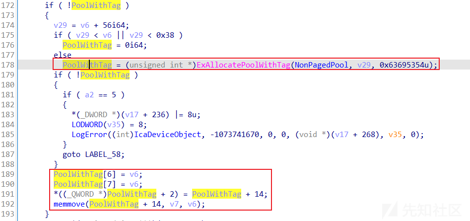](https://xzfile.aliyuncs.com/media/upload/picture/20240214172719-3fdcfef4-cb1b-1.png)

在 Windows 7 及更低版本上，非分页池从固定地址 (Nt!MmNonPagedPoolStart) 开始。

我们知道非分页池从哪里开始，但我们不知道我们的 shellcode 驻留在非分页池中的哪里……但我们可以在某种程度上控制这一点。

非分页内存的大小由于缺乏分页而受到限制。因此，内核通常会避免将其用于任何不需要的地方。也就是说，内存利用率相当低。

我们能做的就是选择一个地址（例如非分页池中的 500 MB），由于内存利用率较低，该地址不太可能被取消分配。接下来，我们喷射足够的 shellcode 副本来填充非分页池，超过我们选择的地址，从而导致 shellcode 的副本很可能驻留在此处。

由于大多数在非分页池上频繁分配的对象都非常小，因此我们可以创建许多小于我们的 shellcode 大小（在所选地址之前）的空洞，以确保其他分配被分配在那里。

然后，我们可以将假通道结构中的 调用函数 指针设置为我们选择的地址，从而每当通道接收到消息时就会执行 shellcode。

## EXP 执行过程

先等待 RDP 握手完成，注册**MS\_T120**通道，接着释放掉**MS\_T120**虚拟通道。构造内核和用户模式**shellcode**，通过**RDPSND**虚拟通道发送到服务端，写入内存。构造虚假虚拟通道结构，替换掉调用函数指针，写入内存。关闭连接，触发对函数的调用。

RDP 握手直接参照官网[\[MS-RDPBCGR\]：远程桌面协议：基本连接和图形远程处理](https://learn.microsoft.com/en-us/openspecs/windows_protocols/ms-rdpbcgr/5073f4ed-1e93-45e1-b039-6e30c385867c) 中规定的数据包格式，进行编写即可

[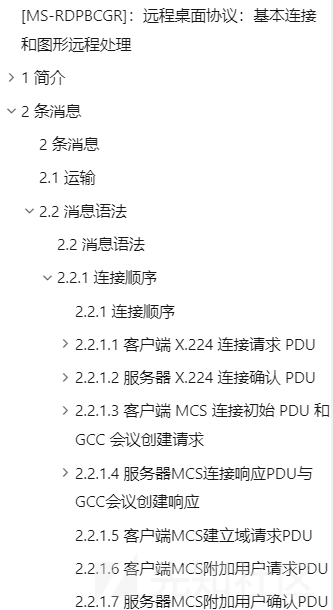](https://xzfile.aliyuncs.com/media/upload/picture/20240214172732-47b4a33e-cb1b-1.png)

注册**MS\_T120**通道，参照[服务器网络数据（TS\_UD\_SC\_NET）](https://learn.microsoft.com/en-us/openspecs/windows_protocols/ms-rdpbcgr/89fa11de-5275-4106-9cf1-e5aa7709436c)构造通道列表数据包，实际 exp 不单单要用到 MS\_T120 虚拟通道，还需要用到**RDPSND**虚拟通道。把构造好的数据包发送给服务端即可。

[](https://xzfile.aliyuncs.com/media/upload/picture/20240214172742-4d84c834-cb1b-1.png)

构造内核和用户模式**shellcode**，为什么要构造两个？首先漏洞触发点在内核模式，所以首先执行内核模式任意代码。内核模式任意代码不能满足我们的需求，比如要列目录，内核模式需要编写大量的代码才能实现，用户模式只需要执行**dir**命令即可。借助内核模式任意代码执行借助[**异步过程调用 (APC)**](https://docs.microsoft.com/en-us/windows/win32/sync/asynchronous-procedure-calls)执行用户模式 shellcode。最终返回一个用户模式的权限。

直接参照大佬写好的**shellcode**模板：[https://github.com/RICSecLab/CVE-2019-0708/blob/master/shellcode.s，需要自行替换其中的地址和端口等信息。](https://github.com/RICSecLab/CVE-2019-0708/blob/master/shellcode.s%EF%BC%8C%E9%9C%80%E8%A6%81%E8%87%AA%E8%A1%8C%E6%9B%BF%E6%8D%A2%E5%85%B6%E4%B8%AD%E7%9A%84%E5%9C%B0%E5%9D%80%E5%92%8C%E7%AB%AF%E5%8F%A3%E7%AD%89%E4%BF%A1%E6%81%AF%E3%80%82)

[](https://xzfile.aliyuncs.com/media/upload/picture/20240214172751-5349974a-cb1b-1.png)

shellcode 前边还要拼接函数调用地址，多次向内存写入。

[](https://xzfile.aliyuncs.com/media/upload/picture/20240214172759-58134924-cb1b-1.png)

通过**RDPSND**虚拟通道发送到服务端，写入内存。这里选用**RDPSND**通道是有原因的，每个通道每次可携带的数据量不一样，可发送的次数也不一样。最终通过对比，**RDPSND**效果最好。

释放掉**MS\_T120**虚拟通道，参照之前的分析，构造`0x00*8 + 0x02 +0x00*22`数据包，通过虚拟通道**MS\_T120**发送给服务端。

[](https://xzfile.aliyuncs.com/media/upload/picture/20240214172808-5d0c245a-cb1b-1.png)

[](https://xzfile.aliyuncs.com/media/upload/picture/20240214172814-60a91aaa-cb1b-1.png)

因为释放了一个 MS\_T120 通道，接着向非分页内存填充数据，

参照[http://www.tssc.de/winint/Win10\_17134\_ntoskrnl/\_ERESOURCE.htm结构体](http://www.tssc.de/winint/Win10_17134_ntoskrnl/_ERESOURCE.htm%E7%BB%93%E6%9E%84%E4%BD%93)

[](https://xzfile.aliyuncs.com/media/upload/picture/20240214172825-6783be52-cb1b-1.png)

关闭连接，触发对函数的调用。这一步断开 socket 连接即可。
