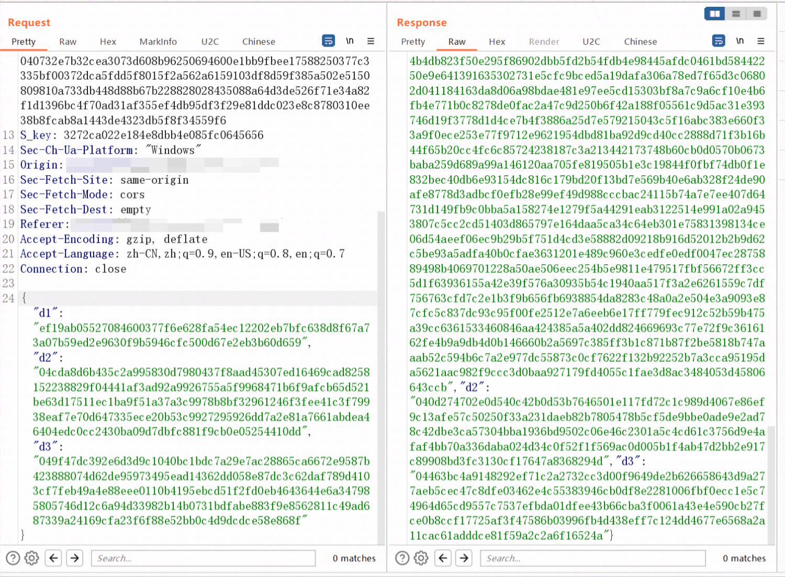
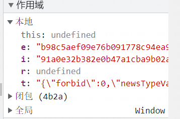
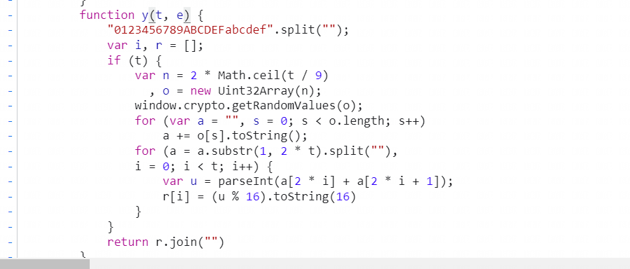
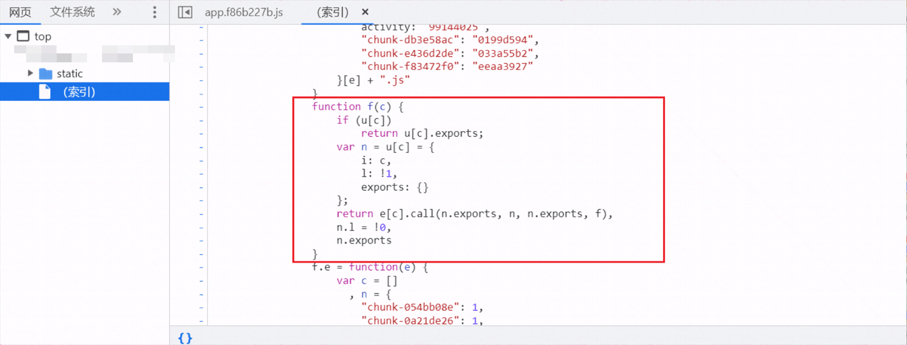
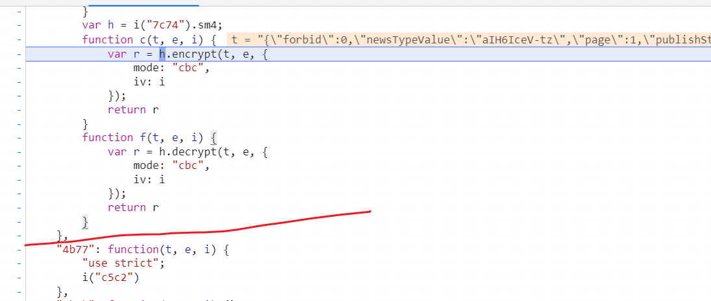
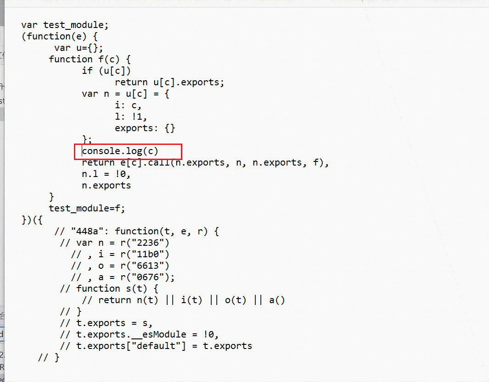
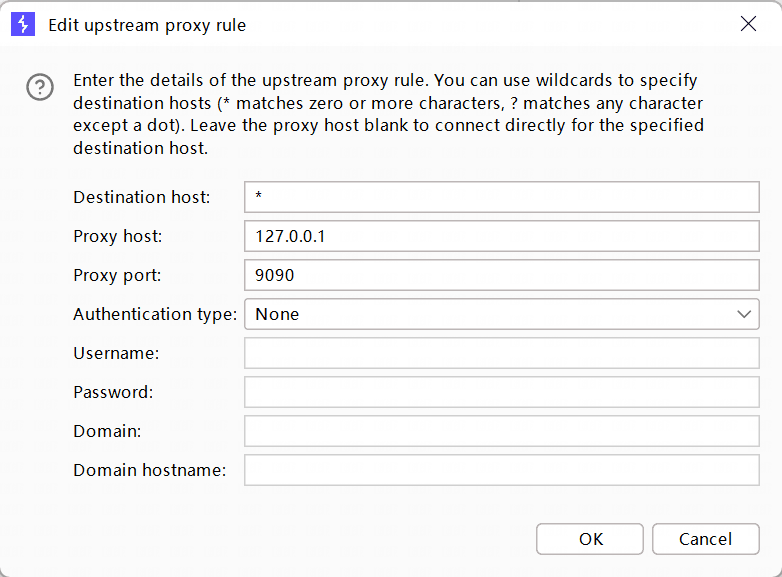

# 一次前端 RSA 加密之使用 Mitmdump 自动化加解密渗透测试 - 先知社区

一次前端 RSA 加密之使用 Mitmdump 自动化加解密渗透测试

- - -

### 简述

在一次实战渗透测试中，使用 burp 抓包遇到了 js 加密，通过 js 逆向找到了加密算法，最终利用 mitmdump 联动 burpsuite 实现了自动化加解密

### 遇到的问题

在得到授权的前提下，心情愉悦地打开 burp 抓包，进行日常地抓包改包测试，但是测试时发现请求体和响应体均被加密了，且密文都是 d1，d2，d3 格式，这就难受了≧ ﹏ ≦

[](https://testingcf.jsdelivr.net/gh/yunxiaoshu/images/image-20230319100926780.png)

### js 逆向

遇到上面地问题，首先当然是得定位加密函数了，F12 打开浏览器控制台，直接搜索："d1:"

[](https://testingcf.jsdelivr.net/gh/yunxiaoshu/images/image-20230308165347802.png)

可以看到此处可以获得 d1，d2，d3，其中 d1 是由 a 的值获取的，d2 是由 s 的值获取的，d3 是由 u 的值获取的，那么我们直接下断点在 a 的生成处，重新刷新网页，在 a 处断下，F9 单步步入

[](https://testingcf.jsdelivr.net/gh/yunxiaoshu/images/image-20230308165611084.png)

先是来到 v\["f"\]的生成处，再单步两次回到之前的界面，再单步一次即可进入 Object(v\["f"\]) 函数内

[](https://testingcf.jsdelivr.net/gh/yunxiaoshu/images/image-20230308165734530.png)

可以看出来是使用了 cbc 模式，猜测使用了 AES 加密，此时我们在右侧作用域查看一下变量值：

[](https://testingcf.jsdelivr.net/gh/yunxiaoshu/images/image-20230308165822099.png)

可以推测 e 为 key 值，i 为 iv 值（e 和 i 的值为前面 n 和 o 的值，后面会讲 n 和 o 怎么生成的），t 为加密前的请求体值，但是此处有一个问题：iv 值通常应该是 16 位才对啊，看来此处不能直接调用 aes 解密了（没学过密码学只能偷偷哭泣了/(ㄒo ㄒ)/），看来只能硬抠代码了

这里 d1 的值已经弄明白了，我们再去看看 d2 和 d3 的值是怎么生成的，此处还是刷新网页，重新断下：

[](https://testingcf.jsdelivr.net/gh/yunxiaoshu/images/image-20230308170156718.png)

可以看到 d2 也就是 s 的值是由 Object(v\["c"\]) 函数生成的，传入两个参数，生成 d2 时传入 n 和 r，生成 d3 时传入 o 和 r，而 r 的值在上面可以看出来是 rsa 值，此时看一下这个值是啥：

[](https://testingcf.jsdelivr.net/gh/yunxiaoshu/images/image-20230308170329231.png)

已经明确了 rsa 的值，此处推测是服务端的公钥，那么再来看 n 和 o 的值，可以看出来是调用 y(32) 函数生成的，跟进查看：

[](https://testingcf.jsdelivr.net/gh/yunxiaoshu/images/image-20230308170515117.png)

简简单单的根据"0123456789ABCDEFabcdef"生成的 32 位随机值，那么到这里，加密过程就已经弄清楚了：

d1 是由 n 和 o 作为 key 和 iv 值，对原始报文使用 aes 加密生成的，d2 由服务端的公钥和随机值 n 生成的，d3 由服务端的公钥和随机值 o 生成的

那么我们前面说到了响应体也是有 d1，d2，d3，那么再去看解密流程，同样的思路分析下来可以知道：

响应体中的 d2 可以使用客户端私钥解密出 n，d3 可以使用客户端私钥解密出 o，d1 可以使用 n 和 o 解密出原始报文（**而私钥的获取方式同上公钥获取一样，下断点即可查看，解密函数就在加密函数下方**）

咳咳，这个加解密，属实厉害，接下来就是抠 js 代码了

### 抠 js 代码

这个过程属实痛苦，js 挨个抠的话，还好，但是我们仔细观察一下这个网站，发现是 webpack 的，vue 开发的网站，硬抠肯定得掉不少头发，此处讲一个快捷的 webpack 通用抠代码的方法：

首先抠 webpack 入口，通常会在 html 主页面内嵌入，此处讲一个快速定位入口函数的方法，在索引页面内搜索 call，挨个查看一下，会有如下类似代码：

[](https://testingcf.jsdelivr.net/gh/yunxiaoshu/images/image-20230319102708001.png)

将函数抠下来，放在 js 文件里，定义成如下格式：

```bash
var test_module;
 (function(e) {
     var u={};
    function f(c) {
        if (u[c])
            return u[c].exports;
        var n = u[c] = {
            i: c,
            l: !1,
            exports: {}
        };
        // console.log(c)
        return e[c].call(n.exports, n, n.exports, f),
        n.l = !0,
        n.exports
    }
    test_module=f;
 })({
 //此处留下贴之后抠的代码
 }）
```

在开头写个 test\_module 是为了后面好调用，接下来就是抠加密和解密函数，先抠 aes 的加密函数，往上找找到 aes 加密函数的最前面

[](https://testingcf.jsdelivr.net/gh/yunxiaoshu/images/image-20230308192049978.png)

往上找到如图所示位置：

[](https://testingcf.jsdelivr.net/gh/yunxiaoshu/images/image-20230308192113699.png)

往下找到如图所示位置

[](https://testingcf.jsdelivr.net/gh/yunxiaoshu/images/image-20230308192151896.png)

```bash
"4b2a": function(t, e, i) {
        "use strict";
        i.d(e, "a", (function() {
            return n
        }
        )),
        i.d(e, "c", (function() {
            return o
        }
        )),
        i.d(e, "b", (function() {
            return a
        }
        )),
        i.d(e, "d", (function() {
            return u
        }
        )),
        i.d(e, "f", (function() {
            return c
        }
        )),
        i.d(e, "e", (function() {
            return f
        }
        ));
        i("d3b7");
        var r = i("7c74").sm2;
        function n() {
            var t = r.generateKeyPairHex();
            return new Promise((function(e) {
                t && e(t)
            }
            ))
        }
        function o(t, e) {
            var i = arguments.length > 2 && void 0 !== arguments[2] ? arguments[2] : 1
              , n = "04" + r.doEncrypt(t, e, i);
            return n
        }
        function a(t, e) {
            var i = arguments.length > 2 && void 0 !== arguments[2] ? arguments[2] : 1
              , n = r.doDecrypt(t.substring(2), e, i);
            return n
        }
        var s = i("7c74").sm3;
        function u(t) {
            var e = s(t);
            return e
        }
        var h = i("7c74").sm4;
        function c(t, e, i) {
            var r = h.encrypt(t, e, {
                mode: "cbc",
                iv: i
            });
            return r
        }
        function f(t, e, i) {
            var r = h.decrypt(t, e, {
                mode: "cbc",
                iv: i
            });
            return r
        }
    },
```

抠下来代码如上，放置在之前抠的入口函数下的后面的中括号里，接下来就是挨个抠，js 逆向俗称：缺啥补啥。为了方便，查看缺啥补啥，我们在入口处修改如下图所示：

[](https://testingcf.jsdelivr.net/gh/yunxiaoshu/images/image-20230308192404280.png)

这样做的好处是会提示我们缺啥函数，再去 js 文件里抠出来，抠的过程中会遇到：i("d3b7");如果是像上面这样调用函数且没有声明变量去获取返回值，可以把（i("d3b7")）注释掉，不然还得挨个抠下来，会很麻烦，而且也用不上，遇到后面这个情况得保留（例：h=i("d3b7")），接下来的过程便不多说了，漫长的抠代码过程

这部分算是讲完了，那么最后贴一个调用方法（var test=test\_module("7a74")；然后就可以用 test 去调用其方法了）：

```bash
function test_enc(t, e, i) {
    var test=test_module("7a74");
    var r = test.encrypt(t, e, {
        mode: "cbc",
        iv: i
    });
    return r
}
```

### mitmdump 中间人代理

抠完代码后，我们直接使用 mitmdump 对 burp 做上下游代理，这样我们可以在 mitmdump 代理层去修改数据包，然后在 burp 层看到的就是我们日常渗透未加密的数据，是真的很方便

该方法适用于如下三个场景（其中 app 和小程序需能看到加解密或防篡改的源代码）：

1.  web 网页端做了防篡改以及加解密
2.  app 端做了防篡改以及加解密
3.  小程序端做了防篡改以及加解密

这里往下叙述共分为三个模块：

> 第一个模块为编写使用 mitmdump 的脚本
> 
> 第二个模块为响应体解密，此处使用二级代理即可（即 burp 上游代理）
> 
> 第三个模块为请求体以及响应体加解密，此处需使用三级代理（即 burp 上下游代理）

#### 示例脚本

编写好 js 的加解密脚本后，使用如下模板（修改加解密函数以及 request 和 response 函数为适应自己的加解密代码，并命名为 test.py）：

```bash
import execjs
from mitmproxy import flowfilter
from mitmproxy.http import HTTPFlow

#解决 js 代码中中文编码错误
import subprocess
import json
from functools import partial
subprocess.Popen = partial(subprocess.Popen, encoding='utf-8')

with open("test.js","r",encoding="utf-8") as f:
    js_code=f.read()
    f.close()
ctx=execjs.compile(js_code)

#请先修改公钥
publickey=""
#请先修改私钥
privatekey=""
def enc(data):
    [d1,d2,d3]=ctx.call("req_enc",data,publickey)
    return [d1,d2,d3]
def dec(d1,d2,d3):
    result=ctx.call("res_dec",d1,d2,d3,privatekey)
    return result

class FilterFlow:

    def request(self, flow):
        if flow.request.url.startswith("https://x.x.x.x/"):
            req=flow.request.get_text()
            if '"d1":' in req:
                return
            print("加密数据前：".format(req))
            data=enc(req)
            d1=data[0]
            d2=data[1]
            d3=data[2]
            json_data={"d1":d1,"d2":d2,"d3":d3}
            result=json.dumps(json_data)
            print("加密数据后：".format(result))
            flow.request.set_text(result)

    def response(self, flow:HTTPFlow):
        # print(flow.response.get_text())
        if flow.request.url.startswith("https://x.x.x.x/"):
            resp=flow.response.get_text()
            data=json.loads(resp)
            d1=data["d1"]
            d2=data["d2"]
            d3=data["d3"]
            result=dec(d1,d2,d3)
            flow.response.set_text(result)


addons = [
    FilterFlow(),
]
```

#### 响应体解密

此处仅需设置 burp 上游代理，方法如下：

```bash
mitmdump -p 9090 -s .\test.py --ssl-insecure
```

burp 端设置：User Option => Upstream Proxy Servers => Add

[](https://testingcf.jsdelivr.net/gh/yunxiaoshu/images/image-20230308160158798.png)

#### 请求体响应体加解密

此处需设置 burp 上下游代理，burp 上游代理开启同上，此处只讲开启 burp 下游代理，即开启 mitmdump 的上游代理（需新开一个终端）浏览器挂代理为 mitm 的端口：

```bash
mitmdump -p 7070 -s .\test.py  --mode upstream:https://127.0.0.1:8080 --ssl-insecure
```

这样就算配置完成了，在 burp 中已经可以正常测试了，如果需要跑 sqlmap 等其它工具，请将流量代理至 burp 即可，如：

```bash
python sqlmap.py -u "https://x.x.x.x/?id=1" --batch --proxy=http://127.0.0.1:8080
```

最后贴图纪念一下成果，已经可以正常加解密进行渗透测试了：

[](https://testingcf.jsdelivr.net/gh/yunxiaoshu/images/image-20230308161345524.png)

### 参考文章

[利用 mitmproxy+burpsuite 实现请求和响应加解密](https://www.t00ls.com/viewthread.php?tid=59630)
