# 二进制漏洞入门基础原理分析 - 先知社区

二进制漏洞入门基础原理分析

- - -

要想杨帆于二进制的海洋中，除了需要水手一般的坚定意志之外，还需要能够乘风破浪的坚船利器，以及定位精准的指南针。没有工具的hacker就如同没有枪的子弹。

那么我们首先就需要掌握ollydbg简称OD的动态调试工具，通过OD解析内存中的每一个运行原理和过程，体会庖丁解牛一样的快感，在此之后，还需要掌握IDA这类静态反汇编工具，让你在迷宫一样的二进制文件中不会迷失方向。

那么本篇文章会介绍如上两款工具的简单使用以及二进制中的地址，内存等简单运行原理，最后通过一个小小的漏洞实验来让大家能够更直观的认识到二进制没有想象中的那么可怕。

## 漏洞概述

随着互联网行业的快速发展，各种软件的层出不穷，软件质量的参差不齐导致用户的体验性和各种用户信息泄露的安全性能等问题受到重视，所以在上述背景中，在产品发布之前公司都会进行测试环节(QA)，那么在这种情况下不论从理论还是工程开发上都没有人敢说彻底消除软件中的逻辑缺陷，俗称BUG。

那么在上述情况下做出一些软件超出设计范围的事情我们称之为BUG，也叫做漏洞。

1.功能性逻辑缺陷：影响软件正常运行，执行结果错误，图标显示错误等问题

2.安全性逻辑缺陷：通常情况为软件正常运行，功能正常，但是被攻击者成功利用从而通过软件去执行恶意的代码，那么常见的软件漏洞包括缓冲区溢出，XSS，SQL注入漏洞等。

## 二进制文件概述

### PE文件

PE文件是win32平台下可执行文件遵守的数据格式，常见的可执行文件如*.exe，*.dll文件都是典型的PE文件。

PE文件不仅包含二进制的机器码，还会自带许多如字符串，图标，字体等信息。在被执行时，操作系统会按照PE文件指定的格式去约定的地方寻找各种类型的资源并装入内存的不同区域内。内存区域十分复杂，如果不按照某种规范进行操作那么会变成多么困难的一件事情！

PE 文件格式把可执行文件分成若干个数据节（section），不同的资源被存放在不同的节中。 一个典型的 PE 文件中包含的节如下。

.text 由编译器产生，存放着二进制的机器代码，也是我们反汇编和调试的对象。 .data 初始化的数据块，如宏定义、全局变量、静态变量等。 .idata 可执行文件所使用的动态链接库等外来函数与文件的信息。 .rsrc 存放程序的资源，如图标、菜单等。

除此以外，还可能出现的节包括“.reloc”、“.edata”、“.tls”、“.rdata”等。

### 虚拟内存

通过上述我们知道当我们执行可执行文件时操作系统会根据PE文件来把不同的信息分配在不同的内存区域内，因此我们需要来分析一下内存区域。

Windows的内存区域可以分为两个层面：物理内存和虚拟内存，其中物理内存需要Ring0级别才能看到，所以需要进行内核调试才能看到。通常我们在用户模式下进行调试都只能够看到虚拟内存。

通过如下图，可知虚拟内存和物理内存的关系，windows中的所有进程都会给分配一个虚拟内存4GB，但是物理内存只有512MB，那么怎么能够为所有进程都分配4GB呢？这其中的一切都是通过虚拟内存管理器的映射做到的。

[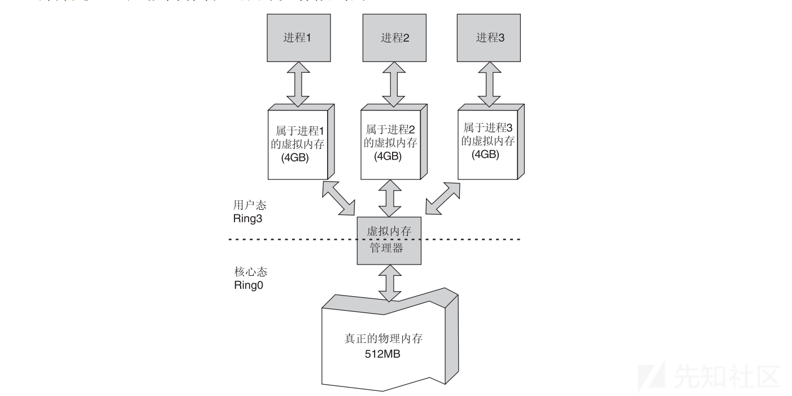](https://xzfile.aliyuncs.com/media/upload/picture/20240324191917-5a9598c2-e9d0-1.png)

### PE文件与虚拟内存之间的映射

1.静态反汇编工具看到的 PE 文件中某条指令的位置是相对于磁盘文件而言的，即所谓的文件偏移，我们可能还需要知道这条指令在内存中所处的位置，即虚拟内存地址（VA）。

2.在调试时看到的某条指令的地址是虚拟内存地址，我们也经常需要回到 PE 文 件中找到这条指令对应的机器码。

为此我们需要弄清PE文件与虚拟内存之间的映射关系。首先我们需要先了解几个重要的概念

（1）文件偏移地址（File Offset） 数据在 PE 文件中的地址叫文件偏移地址，个人认为叫做文件地址更加准确。这是文件在 磁盘上存放时相对于文件开头的偏移。

（2）装载基址（Image Base） PE 装入内存时的基地址。默认情况下，EXE 文件在内存中的基地址是 0x00400000，DLL 文件是 0x10000000。这些位置可以通过修改编译选项更改。

（3）虚拟内存地址（Virtual Address，VA） PE 文件中的指令被装入内存后的地址。

（4）相对虚拟地址（Relative Virtual Address，RVA） 相对虚拟地址是内存地址相对于映射基址的偏移量。 虚拟内存地址、映射基址、相对虚拟内存地址三者之间有如下关系。

VA= Image Base+ RVA

在默认情况下，一般 PE 文件的 0 字节将对映到虚拟内存的 0x00400000 位置，这个地址就是所谓的装载基址(Image Base)，如下图所示

[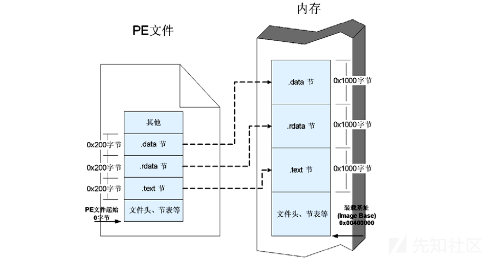](https://xzfile.aliyuncs.com/media/upload/picture/20240324191933-6407274a-e9d0-1.png)  
文件偏移是相对于文件开始处 0 字节的偏移，RVA（相对虚拟地址）则是相对于装载基址0x00400000 处的偏移。由于操作系统在进行装载时“基本”上保持 PE 中的各种数据结构，所 以文件偏移地址和 RVA 有很大的一致性。

之所以说“基本”上一致是因为还有一些细微的差异。这些差异是由于文件数据的存放单 位与内存数据存放单位不同而造成的。

（1）PE 文件中的数据按照磁盘数据标准存放，以 0x200 字节为基本单位进行组织。当一 个数据节（section）不足 0x200 字节时，不足的地方将被 0x00 填充；当一个数据节超过 0x200 字节时，下一个 0x200 块将分配给这个节使用。因此 PE 数据节的大小永远是 0x200 的整数倍。

（2）当代码装入内存后，将按照内存数据标准存放，并以 0x1000 字节为基本单位进行组 织。类似的，不足将被补全，若超出将分配下一个 0x1000 为其所用。因此，内存中的节总是 0x1000 的整数倍。

通过下图(文件偏移地址和 RVA 之间的对应关系)表所示可更细微的理解这种差异

| 节（section） | 相对虚拟偏移量 RVA | 文件偏移量 |
| --- | --- | --- |
| .text 0x00001000 |     | 0x0400 |
| .rdata 0x00007000 |     | 0x6200 |
| .data 0x00009000 |     | 0x7400 |
| rsrc 0x0002D | 000 | 0x7800 |

由于内存中数据节相对于装载基址的偏移量和文件中数据节的偏移量有上述差异，所以进 行文件偏移到虚拟内存地址之间的换算时，还要看所转换的地址位于第几个节内。

我们把这种由存储单位差异引起的节基址差称做节偏移，在上例中：

```plain
.text 节偏移=0x1000-0x400=0xc00
.rdata 节偏移=0x7000-0x6200=0xE00
.data 节偏移=0x9000-0x7400=0x1C00
.rsrc 节偏移=0x2D000-0x7800=0x25800
```

那么文件偏移地址与虚拟内存地址之间的换算关系可以用下面的公式来计算。 文件偏移地址 = 虚拟内存地址（VA）−装载基址（Image Base）−节偏移 = RVA -节偏移

每次换算都比较复杂，我们可以通过LordPE工具进行地址转换，如下图所示

[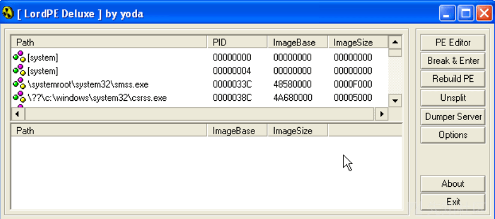](https://xzfile.aliyuncs.com/media/upload/picture/20240324192233-cf852bc0-e9d0-1.png)

[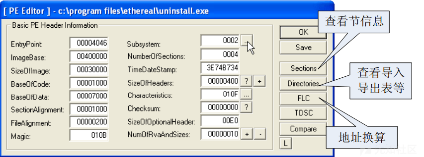](https://xzfile.aliyuncs.com/media/upload/picture/20240324192239-d323abd0-e9d0-1.png)  
用这个工具可以方便地查看 PE 文件中的节信息，对应于前面表格中的例子，如下图所示

[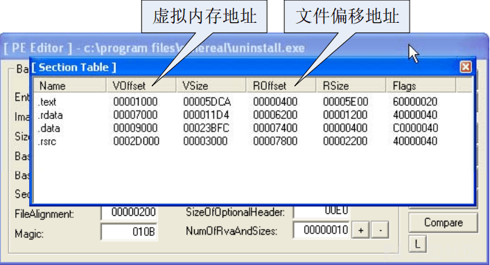](https://xzfile.aliyuncs.com/media/upload/picture/20240324192249-d8a9506e-e9d0-1.png)  
也可以方便地换算虚拟内存地址，文件偏移地址和 RVA，如下图所示

[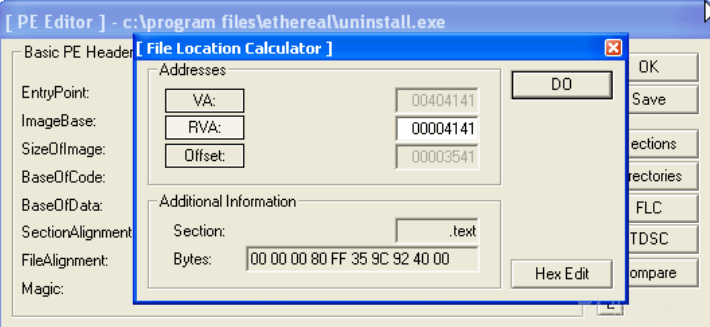](https://xzfile.aliyuncs.com/media/upload/picture/20240324192259-deafbbc4-e9d0-1.png)

## 必备工具

### OllyDbg 简介

Ollydbg 是一个集成了反汇编分析、十六进制编辑、动态调试等多种功能于一身的功能强 大的调试器。它安装简单，甚至不需要点击安装文件就能直接运行；它扩展性强，您甚至可以 为自己写出有特殊用途的插件；它简单易用，初学者只需要知道几个快捷键就能立刻上手…… Olldbg 的优点实在是数不胜数，现在已经成为主流调试器之一。

与 SoftICE 和 WinDbg 相比，Ollydbg 虽然无法调试内核，但其人性化的 GUI 界面省去了 初学者往往望而却步的调试命令，您需要的只是掌握五六个快捷键，然后用鼠标点点点就可以了

OllyDbg 并非浪得虚名，在用户态调试中，真的只要有它“only one”，就可以走遍天下都 不怕了。它的主功能界面在默认情况下分为 5 个部分，让您在调试过程中轻松掌握指令、内存、 栈、寄存器等重要信息。除此以外，如果您是习惯于在 SoftICE 和 WinDbg 上敲调试命令的程 序员，OllyDbg 也体贴地为您保留了调试命令的 debug 方式。

OD基本功能快捷键如下表

| 快捷键 | 功 能 | 说 明 |
| --- | --- | --- |
| F8  | 单步执行 | 遇到函数调用指令不跟入（Stepover） |
| F7  | 单步执行 | 遇到函数调用指令跟入（Step in） |
| F2  | 设置断点 | 在一条指令上按 F2 键将设置断点，再按一次将取消断点 |
| F4  | 执行到当前光标所选中的指令 | 在遇到循环时可以方便地用 F4 键执行到循环结束后的指令 |
| F9  | 运行程序 | 运行程序直到遇到断点 |
| Ctrl+G | 查看任意位置的数据 | 这个功能键非常有用，在指令区、栈区、内存区都可以使用， 能方便地查看任意位置的指令和数据 |

本书中绝大部分调试实验都将使用 OllyDbg，您会在后面章节中频繁见到这个调试器。相 信您在跟随我们完成几个调试实验之后，一定会对这款调试器有一个较深层次的掌握，甚至爱 不释手。调试界面如下图所示

[](https://xzfile.aliyuncs.com/media/upload/picture/20240324192324-ed6690a2-e9d0-1.png)

### IDA Pro 简介

IDA Pr o 无疑是当今最强大的反汇编软件，其工作界面如图 1.3.6 所示。虽然目前的 IDA 版本也可以做一些简单的动态调试工作，但大多数情况下我们主要使用它的静态反汇编功能。

很多工具都能把二进制的机器代码翻译成汇编指令，但为什么提起反汇编工具，IDA 永远 都是首屈一指的强者呢？这是因为 IDA 拥有强大的标注功能。

如下图IDA工作界面

[](https://xzfile.aliyuncs.com/media/upload/picture/20240324192335-f472ecba-e9d0-1.png)  
即使是对汇编语言非常精通的程序员，也无法直接阅读成千上万行汇编指令。我们需要把 庞大的汇编指令序列分割成不同层次的单元、模块、函数，对其逐个研究，最终摸清楚整个二 进制文件的功能。

所谓逆向的过程，在很大程度上就是对这些代码单元的标注。每当我们弄清楚一个函数的 功能时，我们就会给这个函数起一个名字。使用 IDA 对函数进行标注和注解可以做到全文交叉 引用，也就是说，标注一个常用函数后，整个程序对这个函数的调用都会被替换成我们所标注 的名字，这可比直接对内存地址的调用形式好理解多了（通常情况下，反汇编得到的函数调用 往往都是对内存地址的调用）。

对汇编代码的标注可以自上而下进行，也可以自下而上进行。自上而下是指从 main 函数 开始标注，相当于对函数调用图从树根开始遍历；自下而上逆向是指从比较底层的经常被调用 的子函数开始标注，每标注一个这样的底层函数，代码单元的可读性就会增加许多，当最终标 注到 main 函数时，整个程序的功能和流程就基本上可以掌握了。大多数情况下，我们会从两 个方向同时开始逆向。

除了在人工标注时 IDA 提供了交叉引用、快速链接等功能外，IDA 的自动识别和标注功能 也是最优秀的。目前的 IDA 版本能够自动标注 VC、Borland C 、Delphi、Turbo C 等常见编译 器中的标准库函数。试想一下，在反汇编的结果中发现所有的 memcpy、printf 函数都已经被自 动标注好的时候是什么感觉。

IDA 好像是一张二进制的地图，通过它的标注功能可以迅速掌握大量汇编代码的架构，不 至于在繁杂的二进制迷宫中迷失方向。目前版本的 IDA 甚至可以用图形方式显示出一个函数内 部的执行流程。在反汇编界面中按空格键就可以在汇编代码和图形显示间切换，如下图所示

[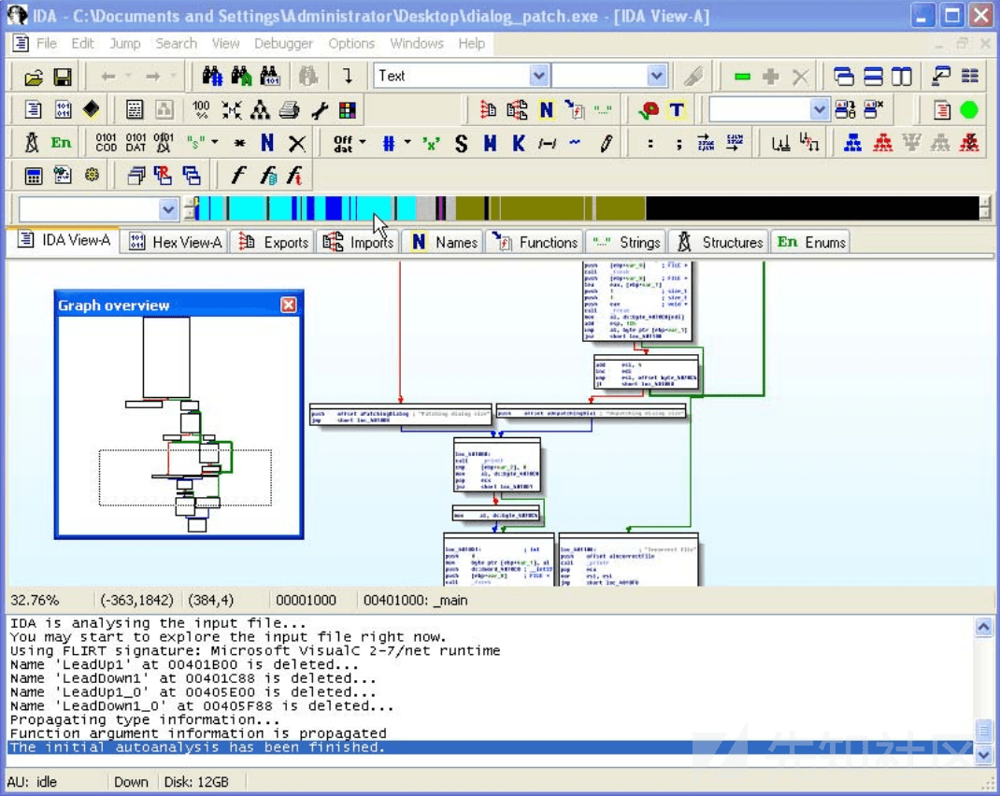](https://xzfile.aliyuncs.com/media/upload/picture/20240324192345-fa53b7ae-e9d0-1.png)  
给出IDA快捷指令，如下表

| 快捷键 | 功 能 |
| --- | --- |
| ;   | 为当前指令添加全文交叉引用的注释 |
| n   | 定义或修改名称，通常用来标注函数名 |
| g   | 跳转到任意地方观察代码 |
| Esc | 返回到跳转前的位置 |
| D   | 分别按字节、字（双字节）、双字（四字节）的形式显示数据 |
| A   | 按照 ASCII 形式显示数据 |

知道这几个快捷键，您就可以自行去标注汇编代码了。彻底掌握 IDA 不是一两天就能做到的.

### 总结

上述只介绍了两款工具，那么还有许多工具没有介绍，比如和OD一样的调试器SoftICE，还可以调试内核的windbg工具以及二进制编辑器UltraEdit、Hex Workshop 和 WinHex 和 010 editor，大家可以自行去了解或者使用

## 密码爆破小实验

通过上述情况大家应该对于工具和内存等方面的基础知识有一个大概的了解，那么我们通过一个简单的爆破试验来帮助大家使用工具和理解概念，消除对二进制的恐惧

下面是一段用于密码验证的 C 代码：

```plain
#include <stdio.h>
#define PASSWORD "1234567"
int verify_password (char *password)
{int authenticated;
 authenticated=strcmp(password,PASSWORD);
 return authenticated;}
main()
{int valid_flag=0;
 char password[1024];
 while(1)
 {printf("please input password: ");
 scanf("%s",password);
 valid_flag = verify_password(password);
 if(valid_flag)
 {printf("incorrect password!\n\n");}
 else
 {printf("Congratulation! You have passed the verification!\n");
 break;}}}
```

如图所示，我们必须输入正确的密码“1234567”才能得到密码验证的确认，跳出循 环。看到程序源码后不难发现，程序是提示密码错误请求再次输入，还是提示密码正确跳出循 环，完全取决于 main 函数中的 if 判断。

[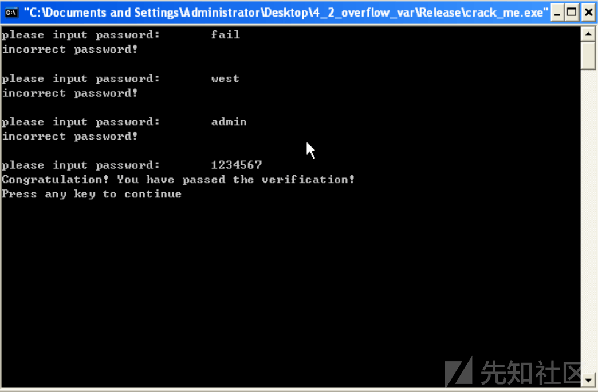](https://xzfile.aliyuncs.com/media/upload/picture/20240324192834-a65b47ec-e9d1-1.png)

如果我们能在.exe 文件中找到 if 判断对应的二进制机器代码，将其稍作修改，那么即使输 31 第 1 章基础知识 入错误的密码，也将通过验证！本节实验就带领大家来完成这样一件事情，这实际上是一种最 简单的软件破解，也被称为“爆破”。

实验环境如下表，实验环境的版本非常重要，应为地址内存等因素会根据环境的不同而又稍许改变，因此推荐大家使用下表环境

|     | 推荐使用的环境 | 备 注 |
| --- | --- | --- |
| 操作系统 | Windows XP Sp2 | 其他 Win32 操作系统也可进行本实验 |
| 编译器 | Visual C++ 6.0 | 其他编译器生成的 PE 文件也可用于实验，但细节会有差异 |

首先打开 IDA，并把由 VC 6 .0 得到的.exe 文件直接拖进 IDA，稍等片刻，IDA 就会把二 进制文件翻译成质量上乘的反汇编代码。

默认情况下，IDA 会自动识别出 main 函数，并用类似流程图的形式标注 出函数内部的跳转指令。如果按 F12 键，IDA 会自动绘制出更加专业和详细的函数流程图，如图所示

[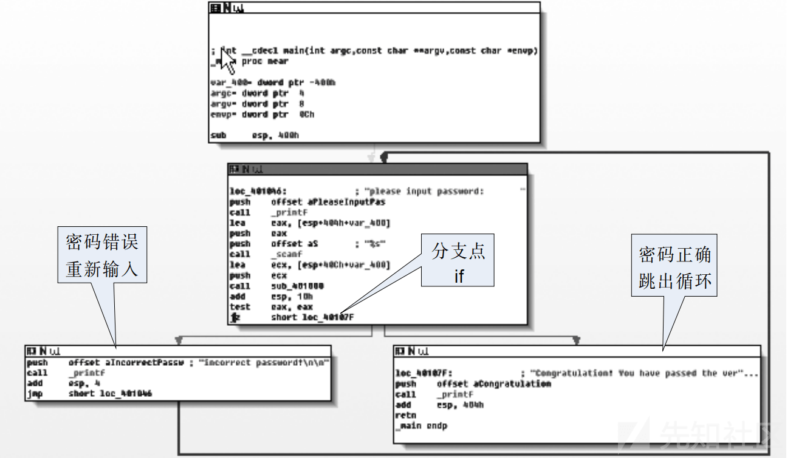](https://xzfile.aliyuncs.com/media/upload/picture/20240324192454-23330b8e-e9d1-1.png)

[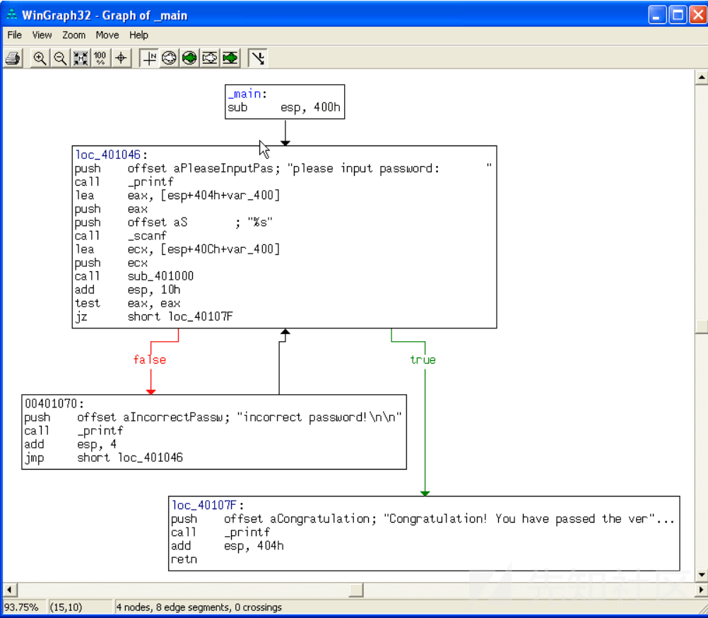](https://xzfile.aliyuncs.com/media/upload/picture/20240324192459-263e5aea-e9d1-1.png)  
在 IDA 的图形显示界面中，用鼠标选中程序分支点，也就是我们要找的对应于 C 代码中 的 if 分支点，按空格键切换到汇编指令界面

[](https://xzfile.aliyuncs.com/media/upload/picture/20240324192510-2cef1bb8-e9d1-1.png)  
光标仍然显示高亮的这条汇编指令就是刚才在流程图中看到的引起程序分支的指令。可以 看到这条指令位于 PE 文件的.text 节，并且 IDA 已经自动将该指令的地址换算成了运行时的内 存地址 VA：0040106E。

现在关闭 IDA，换用 OllyDbg 进行动态调试来看看程序到底是怎样分支的。用 OllyDbg 把 PE 文件打开，如图

[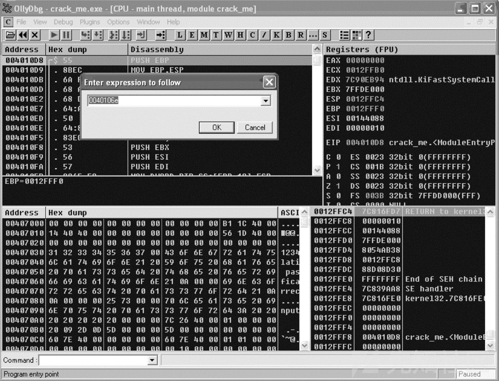](https://xzfile.aliyuncs.com/media/upload/picture/20240324192522-33f7b06e-e9d1-1.png)  
OllyDbg 在默认情况下将程序中断在 PE 装载器开始处，而不是 main 函数的开始。如果您 有兴趣，可以按 F8 键单步跟踪，看看在 main 函数被运行之前，装载器都做了哪些准备工作。 一般情况下，main 函数位于 GetCommandLineA 函数调用后不远处，并且有明显的特征：在调 用之前有 3 次连续的压栈操作，因为系统要给 main 传入默认的 argc、argv 等参数。找到 main 函数调用后，按 F7 键单步跟入就可以看到真正的代码了，如下图所示

[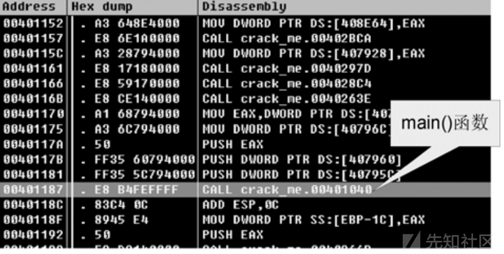](https://xzfile.aliyuncs.com/media/upload/picture/20240324192533-3aa17184-e9d1-1.png)  
我们也可以按快捷键 Ctrl+G 直接跳到由 IDA 得到的 VA：0x0040106E 处查看那条引起程 序分支的关键指令，如图所示

[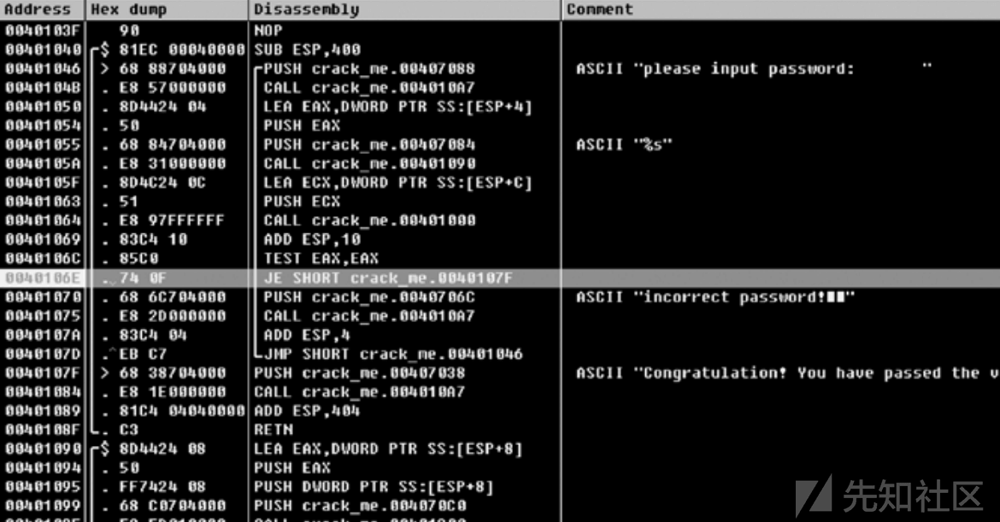](https://xzfile.aliyuncs.com/media/upload/picture/20240324192543-407f8456-e9d1-1.png)  
选中这条指令，按 F2 键下断点，成功后，指令的地址会被标记成不同颜色。 按 F9 键让程序运行起来，这时候控制权会回到程序，OllyDbg 暂时挂起。到程序提示输入 密码的 Console 界面随便输入一个错误的密码，回车确认后，OllyDbg 会重新中断程序，收回 控制权，如下图

[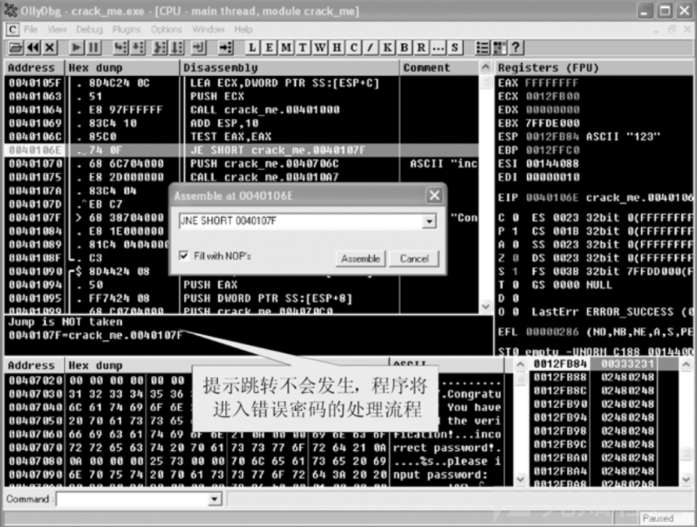](https://xzfile.aliyuncs.com/media/upload/picture/20240324192553-46688e62-e9d1-1.png)  
密码验证函数的返回值将存在 EAX 寄存器中，if（）语句通过以下两条指令实现。

```plain
TEST EAX,EAX
JE XXXXX
```

也就是说，EAX 中的值为 0 时，跳转将被执行，程序进入密码确认流程；否则跳转不执行， 程序进入密码重输的流程。由于现在输入的是错误密码，所以可以在预执行区看到提示：“Jump is not taken”。

如果我们把 JE 这条指令的机器代码修改成 JNE（非 0 则跳转），那么整个程序的逻辑就会 反过来：输入错误的密码会被确认，输入正确的密码反而要求重新输入！当然，把

```plain
TEST EAX, EAX
```

指令修改成

```plain
XOR EAX, EAX
```

也能达到改变程序流程的目的，这时不论正确与否，密码都将被接受。

双击 JE 这条指令，将其修改成 JNE，单击“Assemble”按钮将其写入内存，如下图

[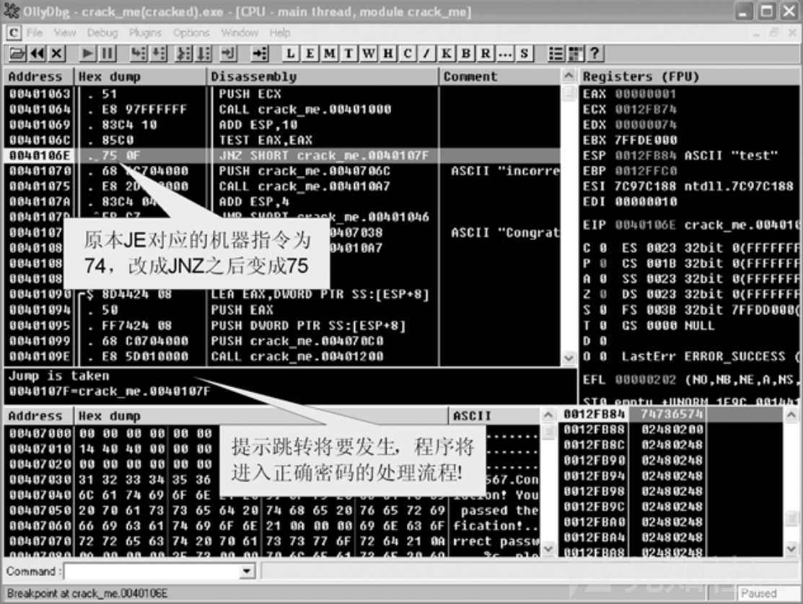](https://xzfile.aliyuncs.com/media/upload/picture/20240324192624-58b8f9bc-e9d1-1.png)  
OllyDbg 将汇编指令翻译成机器代码后写入内存。原来内存中的机器代码 74（JE）现在变 成了 75（JNE）。此外，在预执行区中的提示也发生了变化，提示跳转将要发生，也就是说， 在修改了一个字节的内存数据后，错误的密码也将跳入正确的执行流程！后面您可以单步执行， 看看程序是不是如我们所料执行了正确密码才应该执行的指令。

上面只是在内存中修改程序，我们还需要在二进制文件中也修改相应的字节。这就要用到 第 2 章讲到的内存地址 VA 与文件地址之间的对应关系了。 用 LordPE 打开.exe 文件，查看 PE 文件的节信息，如下图

[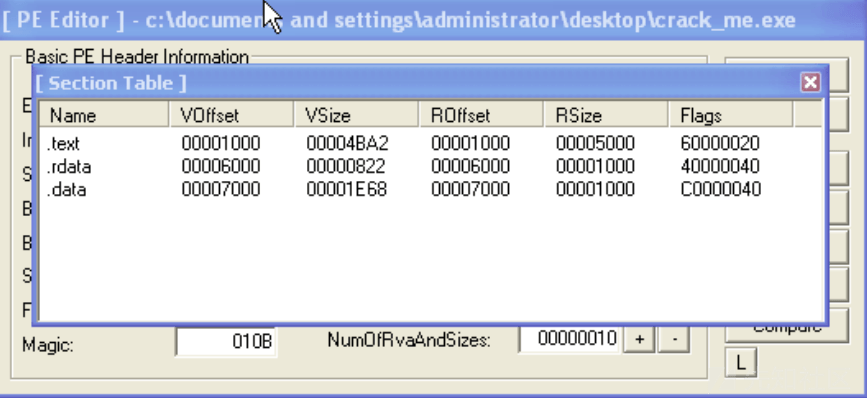](https://xzfile.aliyuncs.com/media/upload/picture/20240324192637-60e17ac4-e9d1-1.png)  
我们已经知道跳转指令在内存中的地址是 VA=0x0040106E，

按照 VA 与文件地址的换算公式：

```plain
文件偏移地址 = 虚拟内存地址（VA）- 装载基址（Image Base）- 节偏移
= 0x0040106E-0x00400000-(0x00001000-0x00001000)
= 0x106E
```

也就是说，这条指令在 PE 文件中位于距离文件开始处 106E 字节的地方。用 UltraEdit 按 照二进制方式打开 crack\_me.exe 文件，如下图

[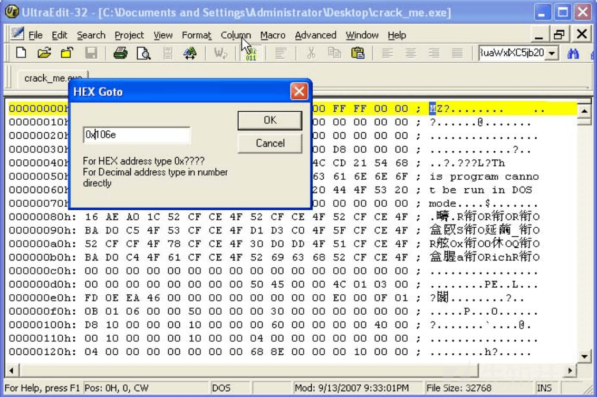](https://xzfile.aliyuncs.com/media/upload/picture/20240324192648-6723fd3a-e9d1-1.png)  
按快捷键 Ctrl+G，输入 0x106E 直接跳到 JE 指令的机器代码处，如图所示

[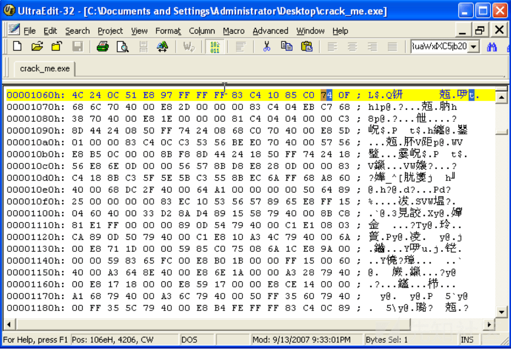](https://xzfile.aliyuncs.com/media/upload/picture/20240324192659-6dbfd416-e9d1-1.png)  
将这一个字节的 74（JE）修改成 75（JNE），保存后重新运行可执行文件，如下图所示，原本正确的密码“1234567”现在反而提示错误了。成功破解密码验证

[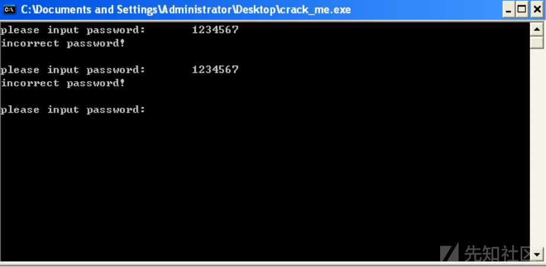](https://xzfile.aliyuncs.com/media/upload/picture/20240324192710-74a53528-e9d1-1.png)

## 总结

通过上述所有内容大家应该对基础的漏洞存在有一定的了解，用一句话总结漏洞出现成因就是通过让程序在处理一些列事务时出现错误，让我们知道程序去寻找我们shellcode的位置从而达到执行的目的而需要达到这种情况需要通过溢出，那么我们溢出的条件就是需要知道内存地址，缓冲区位置，函数返回地址问题解决等情况。