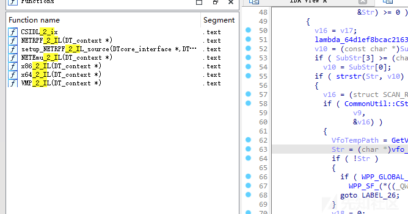
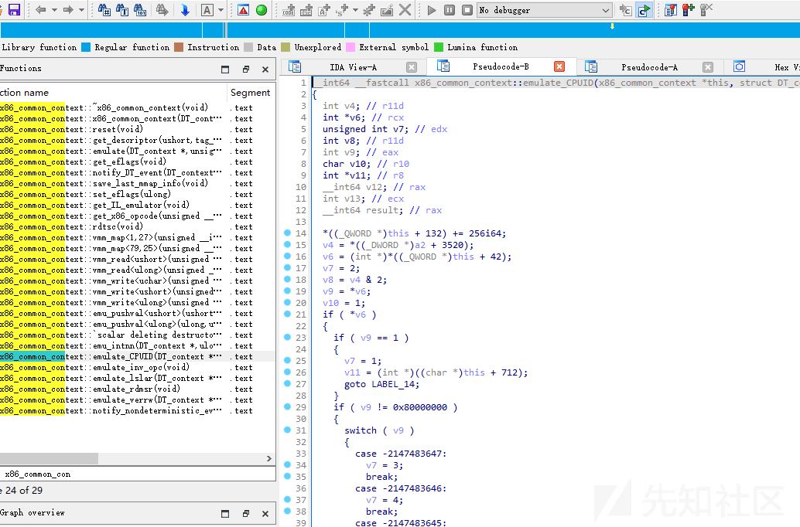
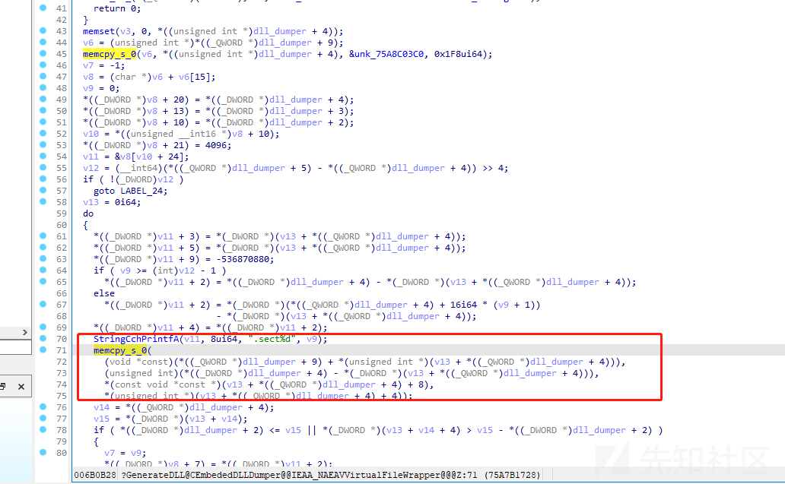
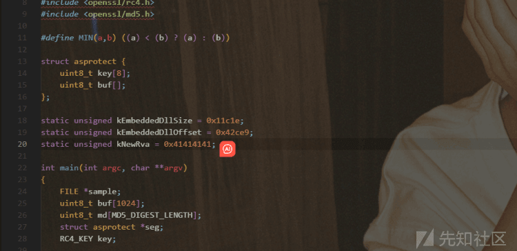

# 从 DefenderCVE 分析到对 Defender 学习 - 先知社区

从 DefenderCVE 分析到对 Defender 学习

- - -

## **前言铺垫**

Windows Defender 是微软为 Windows 操作系统提供的一款防病毒和恶意软件防护工具。其逆向过程极其复杂所以有了铺垫大致介绍一下其具备功能和一些主要核心处理逻辑方便后续漏洞理解。Windows Defender antivirus 还包含了解压缩和检查数千种不同文件格式的代码，在其中它们涵盖了从 ZIP 和 RAR 文件等常见格式，其中 Windows Defender 会去尝试解压缩可执行文件。  
传统的 AV 模型：扫描文件并寻找已知的恶意软件签名（文件散列，字节序列，文件特征，等等…）但是使用打包的代码、新颖的二进制文件等，很容易避免签名。所以在虚拟模拟环境中运行未知的二进制文件 - 查找运行时的恶意行为或已知的签名成为一种思路。于是 Defender 中便是设计了 JS 引擎，用于分析潜在的恶意代码。像其中的一些核心进程服务是以 NT AUTHORITY\\SYSTEM 权限运行

[](https://xzfile.aliyuncs.com/media/upload/picture/20240129134549-a807eef8-be69-1.png)  
回归正题其中要探讨的目标是 mpengine.dll（Microsoft Malware Protection Engine）--其提供了恶意软件扫描和检测功能能力 - 其他 AV 功能和操作系统集成在 Defender 的其他组件中处理。  
这个文化中含括了 3w+ 的函数非常大，在其中它会对恶意程序进行模拟执行  
最开始像其中\_\_rsignal 函数提供了一个入口点进入防御者的扫描 - 给它一个数据缓冲区，它返回一个恶意软件分类

[](https://xzfile.aliyuncs.com/media/upload/picture/20240129134603-b064c6fc-be69-1.png)

然后模拟器初始化：分配内存，初始化在模拟过程中使用的各种对象和子系统，加载要分析的二进制文件 - 重新定位、解析导入等，初始化进程内存空间中的虚拟 dll。在其中还会进行 CPU 的模拟 - 比如支持 x86 和 x64 结构

[](https://xzfile.aliyuncs.com/media/upload/picture/20240129134611-b54af164-be69-1.png)

而且支持很多体系架构这样特定于架构的软件模拟功能就可以去处理一些独特的指令，每个架构都有特定的模拟处理过程。列如针对 x86 CPUID 指令的特定于体系结构的软件仿真模拟--x86\_common\_context::emulate\_CPUID

[](https://xzfile.aliyuncs.com/media/upload/picture/20240129134623-bc8eebba-be69-1.png)

因为这个即使 system 也无法进行调试所以很少能看到覆盖的大情况，用断点的详细观察，但是 mpengine.dll 的函数可以在我们的恶意软件调用某些 Windowsapi 时被调用。  
可以简单了解一下 Defender-mpengine.dll 的一些内部功能函数的作用（除了模拟处理外）  
这里要说一下因为微软后期将 defender 单独发展成了一个独立化的产品，其中的很多函数名有了改变导致理解此内部功能便的负责了，还是建议从早起左右 mpengine.dll 进行逆向分析其中的函数其中的名字还是很方便理解其内部处理流程和作用。比如早期的命名处理 MpAddToScanQueue-构建队列一个文件进行扫描。MpCreateMemoryAliasing-模拟器中的别名内存。MpReportEvent-报告恶意软件的行为，以进行其他类型检测  
MpSelectorBase-获取/设置段寄存器（CS，DS，ES 等）。MpUfsMetadataop-获取/设置有关被扫描文件的元数据，再来看一下现在的不仅参数变多了其还加了很大不同功能的处理逻辑。

[](https://xzfile.aliyuncs.com/media/upload/picture/20240129134632-c1d42446-be69-1.png)  
这里建议对 Defender cve 分析时还是采用越早的版本越好，即使对于最新的内部逻辑变动较大但是对于其函数功能的基本定义并不很大的改变差别的

## **CVE-2021-1647**

Windows Defender 防病毒软件通过在其虚拟机 Defender Emulator 中模拟打包的二进制文件来扫描它们，并在检测到某些签名时接管解包工作其中之一是 AsProtect。  
当 Windows Defender (mpengine.dll) 在解压 ASProtect 打包的可执行文件时处理节表时，会出现堆缓冲区溢出。每个节条目都有两个值：虚拟地址和节的大小。  
漏洞点出现在 CAsprotectDLLAndVersion::RetrieveVersionInfoAndCreateObjects 函数上  
（下图左是漏洞点，右是补丁点）Asprotect 在代码处理压缩包的过程中定义了一个 section 数组的开始，该数组包含四个元素，每个 section 的大小 8 字节，前 4 字节代表 section 的虚拟地址后四个字节用于表示 section 的大小。在此函数中代码逻辑中遍历一个包含前 4 项的 section 的值，然后通过获取到的 sectionva 和 sectionsize，到代码下方则是为其申请了对应的内存用于存放解压后的 section 内容。但是代码的逻辑只是检查了下一个条目-next\_sect\_addr 的地址是不是小于上一部分条目-sect\_addr 的地址。没有考虑到这块是否相等的情况也就是 if next\_sect\_addr <= sect\_addr。那么如果我们传进来的是：\[(0,0), (0,0), (0x2000,0), (0x2000,0x3000)\]，那么此时就会为地址 0x2000 处的部分去分配了 0 个字节；但当它看到 0x2000 处的下一个条目时，它只是跳过它而不退出或更新该部分的大小。这样在解压缩的时候走到下边的代码逻辑时候，0x3000 字节将被复制到该部分，从而导致堆缓冲区溢出。

```bash
new_sect_alloc = malloc(sect_sz + sect_addr);
```

[](https://xzfile.aliyuncs.com/media/upload/picture/20240129134807-fa7e713e-be69-1.png)

对比补丁来看的话则是更明显，右边的补丁明显针对此计算增加了条件判断还有对值进行了计算处理，如果部分数组中任何条目的地址小于或等于前一个条目，则代码直接跳转并退出，而不是继续解压缩。

## **CVE-2021-31985**

我们 在 CVE-2021-1647 中介绍了 AsProtect 大致是什么然后是干什么用的，此漏洞也是出现其模块内，为了执行 AsProtect 加壳器字节码，它必须重建由这个外部加壳二进制文件提供的 VM DLL。相对虚拟地址 (RVA) 部分缺乏清理，会导致具有可控数据、大小和偏移量的 memcpy 堆溢出。这就导致以 NT Authority\\SYSTEM 权限远程执行代码（因为其本身运行的权限就是 NT Authority\\SYSTEM）。  
值得一提的是因为 Windows-Defender 类漏洞触发教容易，因为它是一个反病毒软件当电脑或是邮件接收到陌生的压缩文件其中的对应解压模块就会进行处理然后就会导致漏洞的触发，所以在后溪微软推出了沙盒也就是把其置于沙盒中运行所以如果要解决 Defender 还要想办法绕过沙盒但是沙盒选项并不是默认开启的。而且其中 Defender 中处理这些文件格式解析器、解包器、解释器和模拟器还是作为 SYSTEM 运行。  
漏洞出现在 CEmbededDLLDumper::GenerateDLL 函数中，此函数尝试去构建 IMAGE\_SECTION\_HEADER 结构  
；并为整个 PE 映像分配内存；复制嵌入在 mpengine.dll 中的固定 PE 头文件然后初始化 NtHdr->OptionalHeader 中的各个字段；创建节头项将切片原始数据复制到 PE 图像然后重新构造嵌入式 VM DLL。可以看到在 RVA 的偏移量用于计算 memcpy\_s\_0 的目标地址，但是传进去的值没有进行检查，所以通过将 RVA 设置为 0x41414141 从而触发函数导致崩溃，而且图像的缓冲区都是由我们传入的所有一切原始数据都是可控的。

[](https://xzfile.aliyuncs.com/media/upload/picture/20240129134904-1c8cbd08-be6a-1.png)

这里的代码对于 VM DLL 指定的 relativvirtualaddress，允许它从 ImageBase 读取和写入任意偏移量。  
section RVA 直接从运行时 DLL 中使用，不需要任何验证，并用作缓冲区中的偏移量。这将导致读取或写入任意偏移量。通过作者提供的 poc 我们可以看到其中的偏移量设置并且作者提供了设置好的 bin 用于触发崩溃。

[](https://xzfile.aliyuncs.com/media/upload/picture/20240129134930-2c083af0-be6a-1.png)

其实上述两个漏洞直接通过漏洞点并不能理解，但是 Defender 中含括了 3w+ 函数要了解大致一些函数的作用和流程都不是容易的，所以通过此对漏洞的分析和理解也是能了解 Defender 中对于扫描各类文件和处理不同架构的流程和内部的一些框架的设计。而且上述两个都是从 defender 模拟执行的过程出发包括 defender 对文件格式处理的探究来学习。

参考：  
[https://bugs.chromium.org/p/project-zero/issues/detail?id=2189](https://bugs.chromium.org/p/project-zero/issues/detail?id=2189)
