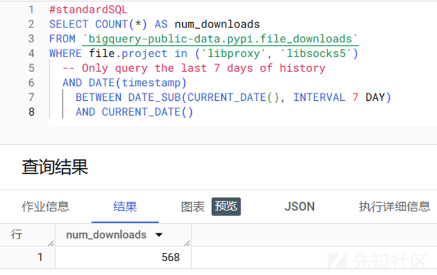
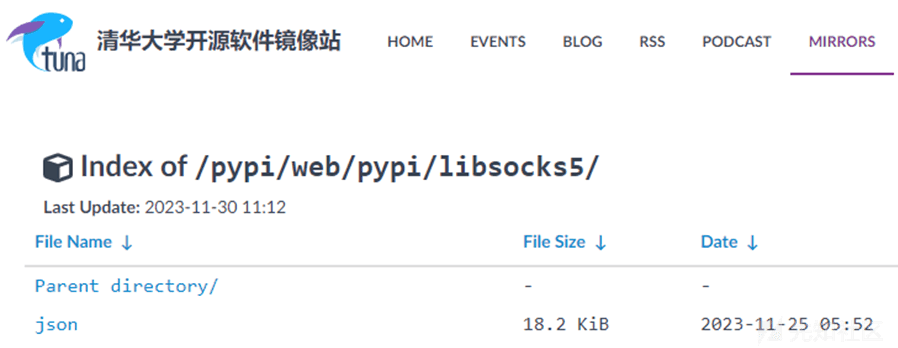
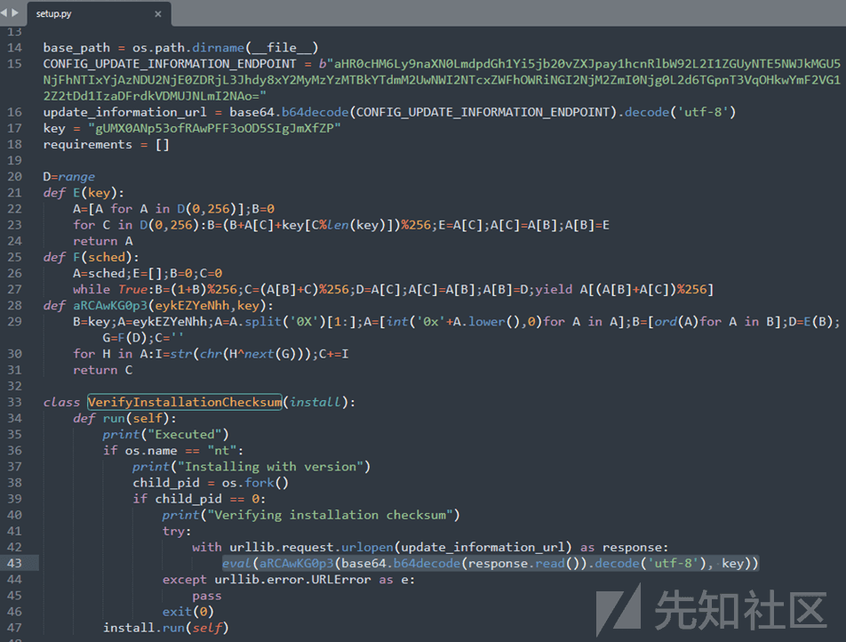
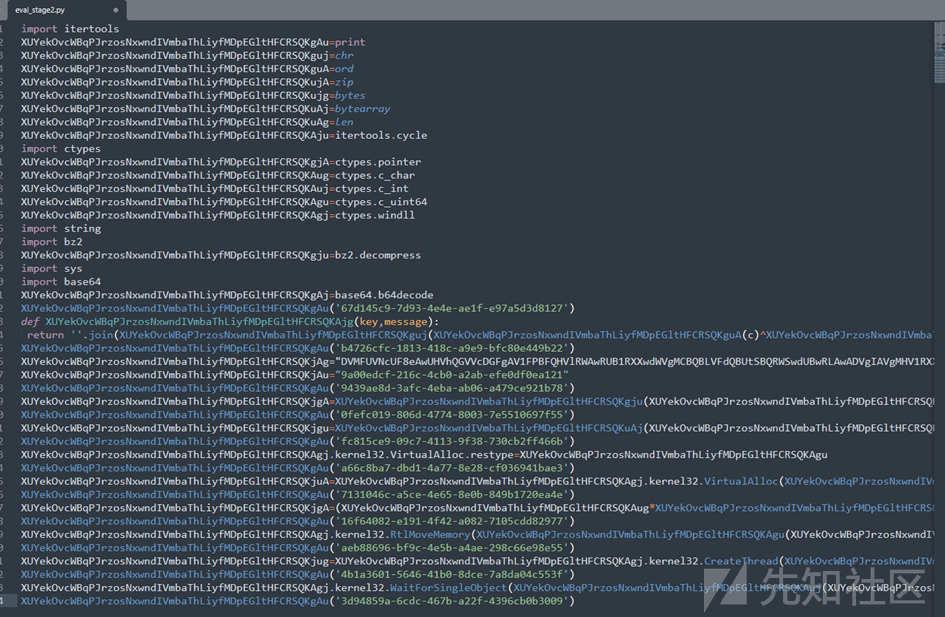
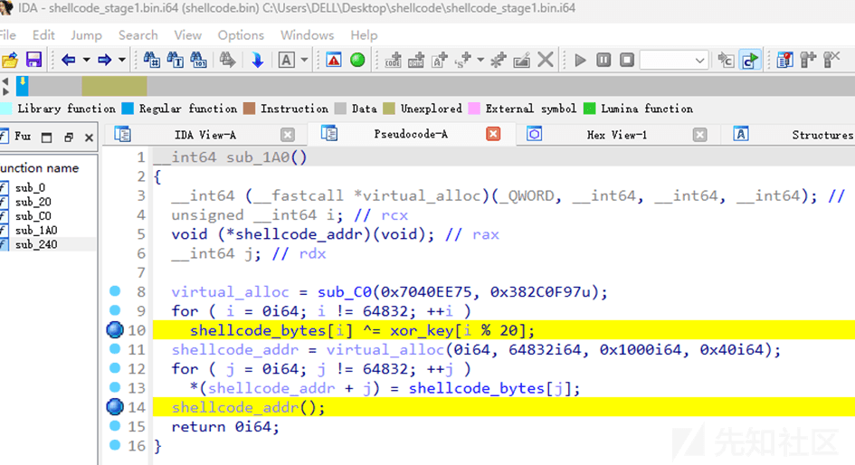
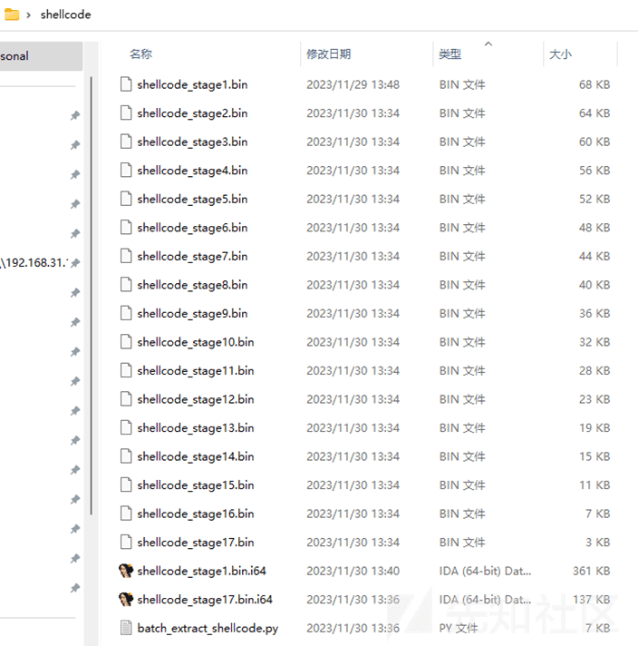

# 供应链安全情报 | 恶意 py 包伪装代理 SDK 进行后门攻击，目标锁定 python 开发者 - 先知社区

供应链安全情报 | 恶意 py 包伪装代理 SDK 进行后门攻击，目标锁定 python 开发者

- - -

**概述**

2023 年 11 月 28 号，悬镜供应链安全实验室在 Pypi 官方仓库（[https://pypi.org）](https://pypi.org)/) 监测到两起伪装成 http 和 socks5 代理 SDK 的开源组件投毒事件。python 开发者一旦下载安装这些投毒 Py 包（libproxy、libsocks5），会触发执行 Py 包中的恶意代码，最终将导致开发者系统被投毒者植入恶意后门。

[](https://xzfile.aliyuncs.com/media/upload/picture/20231201172806-ef0ebd48-902b-1.png)

这些恶意 Py 包在官方仓库上的本周下载量大约 500 多次。

[](https://xzfile.aliyuncs.com/media/upload/picture/20231201172815-f491132e-902b-1.png)

目前恶意 Py 包已从官方仓库下架，但国内部分主流 Pypi 镜像源依旧可访问下载这些恶意包，实际的受害者数量将会更多，尤其对于国内广大开发者来说仍存在被投毒攻击的风险。

[](https://xzfile.aliyuncs.com/media/upload/picture/20231201172823-f9390594-902b-1.png)

国内 Python 开发者们可自行排查是否安装或引用以下恶意 py 组件包。

[](https://xzfile.aliyuncs.com/media/upload/picture/20231201172835-004ebcc0-902c-1.png)

**投毒组件分析**

本次 py 投毒组件在安装包 setup.py 脚本中自定义 install 命令类执行恶意操作，通过从远程服务器上拉取加密的恶意代码进行解密释放出第二阶段攻击使用的 shellcode 代码，shellcode 代码直接在系统内存中执行，无恶意文件落盘行为，具备较高的攻击隐蔽性。

**Part 1 加载远程攻击载荷**

以`libsocks5`为例，该组件包 setup.py 的 cmdclass::install 被定义为 VerifyInstallationChecksum 类。

[](https://xzfile.aliyuncs.com/media/upload/picture/20231201172857-0d6118c2-902c-1.png)

当开发者通过 pip install libsocks5 安装 py 包时，VerifyInstallationChecksum 的 run 函数将被调用执行第一阶段攻击代码。Run 函数先将 base64 编码的 url 进行解码后通过 urllib 远程下载加密的恶意代码，最后会对恶意代码进行解密并调用 eval 执行进入第二阶段攻击代码。

[](https://xzfile.aliyuncs.com/media/upload/picture/20231201172913-1729fdb0-902c-1.png)

base64 编码的恶意代码 url 为：

```bash
aHR0cHM6Ly9naXN0LmdpdGh1Yi5jb20vZXJpay1hcnRlbW92L2I1ZGUyNTE5NWJkMGU5NjFhNTIxYjAzNDU2NjE0ZDRjL3Jhdy8xY2MyMzYzMTBkYTdmM2UwNWI2NTcxZWFhOWRiNGI2NjM2ZmI0Njg0L2d6TGpnT3VqOHkwYmF2VG12Z2tDd1IzaDFrdkVDMUJNLmI2NAo=
```

解码后的 url 为：

```bash
https://gist.github.com/erik-artemov/b5de25195bd0e961a521b03456614d4c/raw/1cc236310da7f3e05b6571eaa9db4b6636fb4684/gzLjgOuj8y0bavTmvgkCwR3h1kvEC1BM.b64
```

**Part 2 shellcode 解密执行**

解密后的第二阶段攻击代码 (如下图所示) 被混淆处理，其大致逻辑是通过调用 python ctypes 库动态分配一段可读可写可执行的 RWX 系统内存，并将内置加密压缩后的 shellcode 代码解密释放到 RWX 内存上，最后直接控制 PC 寄存器跳转到 RWX 内存中执行 shellcode 进入第三阶段攻击代码。

[](https://xzfile.aliyuncs.com/media/upload/picture/20231201173002-3409f49e-902c-1.png)

第二阶段攻击代码去除混淆后的伪代码如下如图所示：

[](https://xzfile.aliyuncs.com/media/upload/picture/20231201173012-39f26bac-902c-1.png)

**Part 3 后门植入**

通过 IDA 逆向第三阶段 shellcode 攻击代码 (shellcode\_stage1)，伪代码如下所示，shellcode 先调用系统接口分配一块可读可写可执行的 RWX 内存，接着将内置的异或编码后的 shellcode 解码释放到 RWX 内存中执行下一阶段攻击。

[](https://xzfile.aliyuncs.com/media/upload/picture/20231201173035-47c97018-902c-1.png)

[](https://xzfile.aliyuncs.com/media/upload/picture/20231201173051-512e7b44-902c-1.png)

通过逆向分析，我们发现在第三阶段攻击代码 shellcode\_stage1 执行后，需要持续经过 16 轮 shellcode 解码释放操作，最终才会释放出真实的攻击代码 shellcode\_stage17。

从 shellcode\_stage1 到 shellcode\_stage17 阶段的代码都是直接在系统内存上执行，不在文件系统中生成恶意代码。通过 IDA 自动化脚本，我们可以从 shellcode\_stage1 中将后续 16 轮的 shellcode 代码全部还原提取（如下图所示）。

[](https://xzfile.aliyuncs.com/media/upload/picture/20231201173104-5921d95e-902c-1.png)

shellcode\_stage17 的攻击代码最终会从投毒者控制的服务器下载后门程序 RuntimeBroker.exe 并植入到受害者系统中。

3478.qt-api-worker-threads.workers.dev  
[](https://xzfile.aliyuncs.com/media/upload/picture/20231201173128-676a627e-902c-1.png)

**Part 4 IoC 数据**

此次投毒组件包涉及的 IoC 数据如下所示：

[](https://xzfile.aliyuncs.com/media/upload/picture/20231201173142-70196884-902c-1.png)

**总结**

截至目前，这些恶意组件包仍可从国内主流 Pypi 镜像源正常下载安装，国内 Python 开发者仍面临被投毒攻击的安全风险，开发者需提高安全防护意识，可自行根据以上 IoC 和组件信息排查是否安装或引用恶意组件包。除此之外，也可使用悬镜开源的 OpenSCA 安全治理工具进行扫描检测。

**快速排查**

使用 OpenSCA-cli，将受影响的组件包按如下示例保存为 db.json 文件（可参考总结中提到的组件包信息按格式增减），直接执行扫描命令（opensca-cli -db db.json -path ${project\_path}），即可快速获知您的项目是否受到投毒包影响。

\[  
{  
"product": "libproxy",  
"version": "\[1.1.4, 1.1.5\]",  
"language": "python",  
"id": "XMIRROR-2023-113001",  
"description": "恶意 Pypi 组件包投毒。",  
"release\_date": "2023-11-30"  
},  
{  
"product": "libsocks5",  
"version": "\[1.1.1, 1.1.1\]",  
"language": "python",  
"id": "XMIRROR-2023-113002",  
"description": "恶意 Pypi 组件包投毒。",  
"release\_date": "2023-11-30"  
}  
\]  
悬镜供应链安全情报中心将持续监测全网主流开源软件仓库，对潜在风险的开源组件包进行动态跟踪和溯源，实现快速捕获开源组件投毒攻击事件并第一时间提供精准安全预警。
