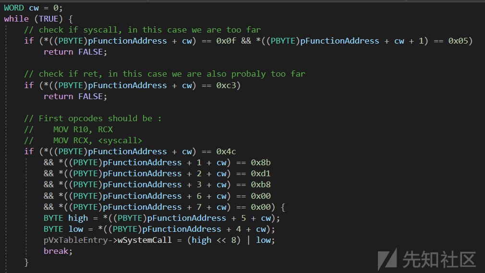
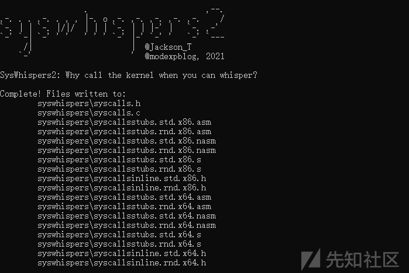
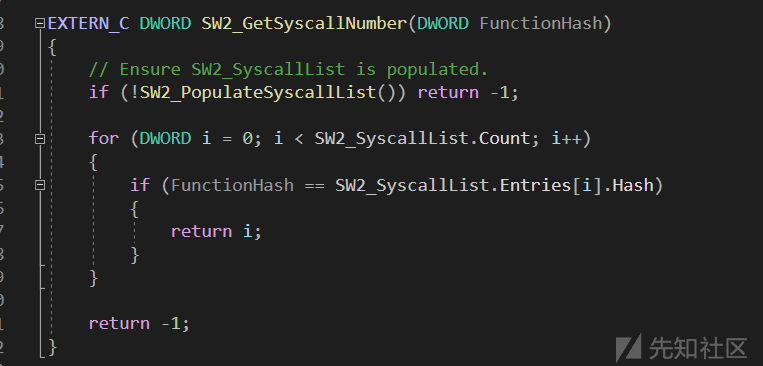
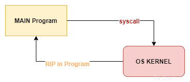
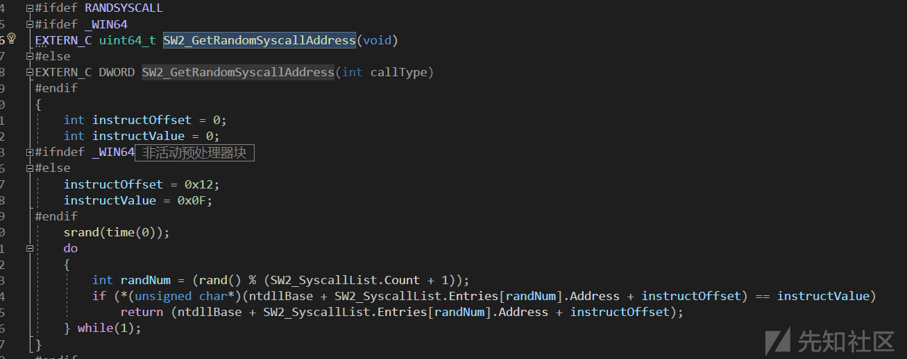
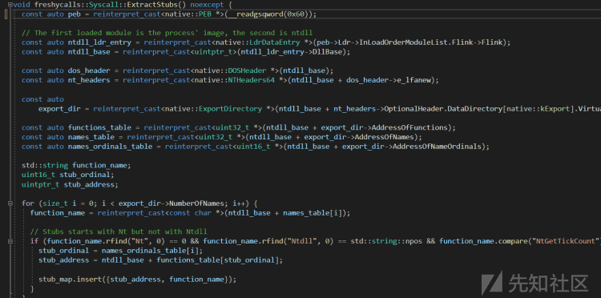
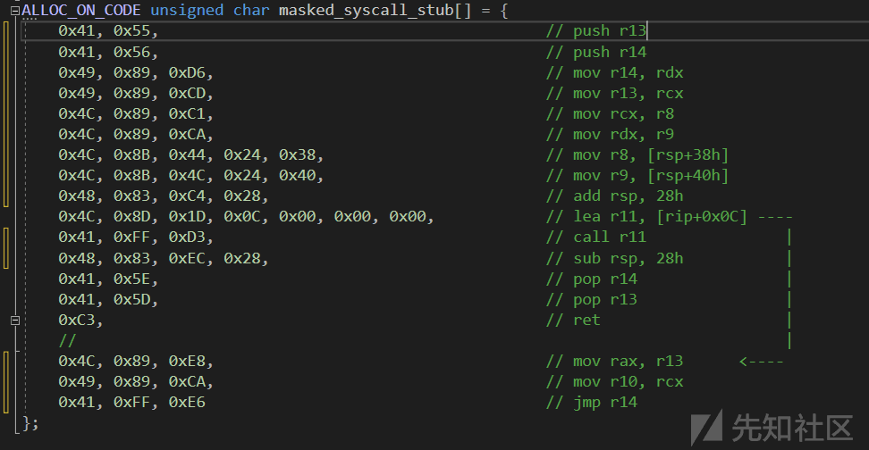
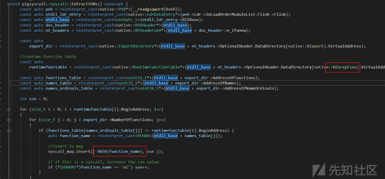
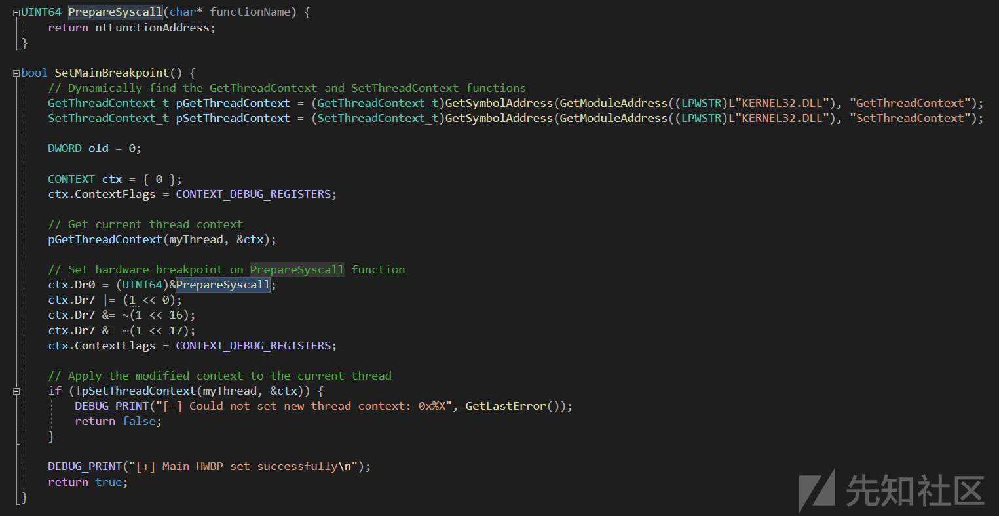
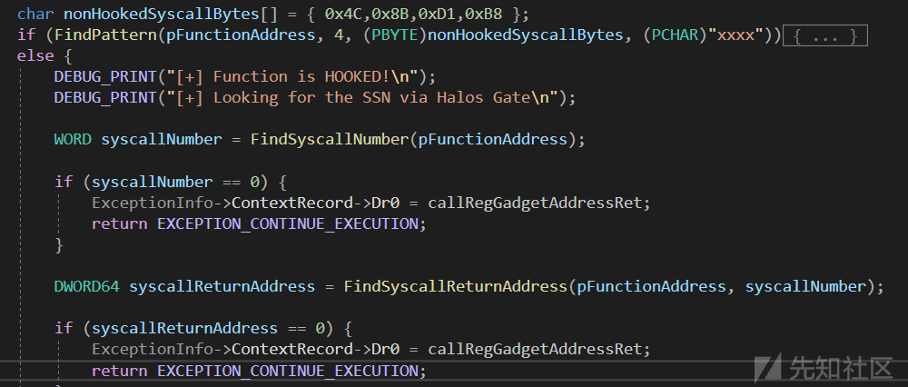

# 几个 Syscall 项目的学习记录 - 先知社区

几个 Syscall 项目的学习记录


# 前言

最近复习了下 syscall，关于 syscall 的原理这里不会做太多的叙述，有很多文章说得很清楚了，这里主要记录下对几个开源 syscall 项目的学习。

# 什么是 Syscall

简单来说，syscall 是一种绕过 EDR **用户态 hook** 的方式，它通过获取**系统调用号**，并构造 **syscall stub** 的汇编指令直接进入**内核态 API 调用**，从而避免了用户态 hook 的检测。在使用这种技术时，也不可避免地引入了一些新的检测特征，如 syscall stub 中引入的硬编码以及基于栈回溯的 syscall 的调用方的检测等等，不同的 syscall 项目也提供了针对这类检测的不同绕过方式。此外，各个项目也在获取系统调用号的方式上有一些区别。  
基本的 syscall stub 如下：

```bash
mov     r10,rcx
mov     eax,[系统调用号]
syscall
ret
```

下面对几个开源 syscall 项目做简单的介绍。

# HellsGate

项目地址：[https://github.com/am0nsec/HellsGate](https://github.com/am0nsec/HellsGate)

## 遍历 PEB 获取系统调用号

该项目通过遍历 PEB 找到 ntdll，之后遍历 ntdll 的导出表，在找到需要的导出函数后，通过匹配 syscall stub 中的特征字节码定位到该导出函数的系统调用号。  
（一）遍历 PEB 获取 ntdll 的导出表：  
[](https://xzfile.aliyuncs.com/media/upload/picture/20231003150915-c3074ccc-61bb-1.png)  
（二）获取导出函数的系统调用号：  
[](https://xzfile.aliyuncs.com/media/upload/picture/20231003150942-d3137ce4-61bb-1.png)  
通过代码可以发现，HellsGate 是通过匹配以下汇编指令定位系统调用号的：

```bash
MOV R10, RCX
MOV EAX, <系统调用号>
```

通过反汇编，可以发现，该汇编指令对应的机器码如下：  
[](https://xzfile.aliyuncs.com/media/upload/picture/20231003151006-e19bc870-61bb-1.png)  
HellsGate 正是通过查找这些机器码定位到系统调用号的：

```bash
if (*((PBYTE)pFunctionAddress + cw) == 0x4c
    && *((PBYTE)pFunctionAddress + 1 + cw) == 0x8b
    && *((PBYTE)pFunctionAddress + 2 + cw) == 0xd1
    && *((PBYTE)pFunctionAddress + 3 + cw) == 0xb8
    && *((PBYTE)pFunctionAddress + 6 + cw) == 0x00
    && *((PBYTE)pFunctionAddress + 7 + cw) == 0x00) {
    BYTE high = *((PBYTE)pFunctionAddress + 5 + cw);
    BYTE low = *((PBYTE)pFunctionAddress + 4 + cw);
    pVxTableEntry->wSystemCall = (high << 8) | low;
    break;
}
```

## 硬编码 syscall 直接系统调用

HellsGate 采用直接系统调用，直接构造 syscall stub。HellsGate（地狱之门）首先通过 HellsGate 函数获取当前使用函数的系统调用号，之后使用 HellDescent 函数直接通过 syscall 指令进行系统调用。  
[](https://xzfile.aliyuncs.com/media/upload/picture/20231003151032-f0dfb562-61bb-1.png)  
HellDescent 的汇编代码如下：

```bash
HellDescent PROC
    mov r10, rcx
    mov eax, wSystemCall
    syscall
    ret
HellDescent ENDP
```

可见，它是最基本的 syscall stub。

# SysWhispers2

项目地址：[https://github.com/jthuraisamy/SysWhispers2](https://github.com/jthuraisamy/SysWhispers2)  
SysWhispers2 是一个基于模板的项目，使用项目中 python 脚本可以生成多个函数的 syscall 模板，新版本还增加了 Random Syscall Jumps 的方式来规避一些特征，如下，std 是基础的 syscall 方法，rnd 则是使用了 Random Syscall Jumps 的方法，在下面会进行详细介绍。  
[](https://xzfile.aliyuncs.com/media/upload/picture/20231003151059-0145ca04-61bc-1.png)  
我们这里以 NtAllocateVirtualMemory 函数为例，先来看看 SysWhispers2 进行系统调用的基本流程。  
首先，主程序调用 NtAllocateVirtualMemory，该函数是头文件中的外部函数，如下：  
[](https://xzfile.aliyuncs.com/media/upload/picture/20231003151127-11ca601a-61bc-1.png)  
我们分析 SysWhispers2 提供的模板，发现该函数的实现是在 asm 文件中，它首先将该函数计算的哈希传递给 currentHash，之后调用 WhisperMain 函数：  
[](https://xzfile.aliyuncs.com/media/upload/picture/20231003151150-1f57f83c-61bc-1.png)  
WhisperMain 的汇编指令如下：

```bash
WhisperMain PROC
    pop rax
    mov [rsp+ 8], rcx                       ; Save registers.
    mov [rsp+16], rdx
    mov [rsp+24], r8
    mov [rsp+32], r9
    sub rsp, 28h
    mov ecx, currentHash
    call SW2_GetSyscallNumber
    mov dword ptr [syscallNumber], eax      ; Save the syscall number
    xor rcx, rcx
    call SW2_GetRandomSyscallAddress        ; Get a random syscall address
    mov qword ptr [syscallAddress], rax     ; Save the random syscall address
    xor rax, rax
    mov eax, syscallNumber
    add rsp, 28h
    mov rcx, [rsp+ 8]                       ; Restore registers.
    mov rdx, [rsp+16]
    mov r8, [rsp+24]
    mov r9, [rsp+32]
    mov r10, rcx
    pop qword ptr [returnAddress]           ; Save the original return address
    call qword ptr [syscallAddress]         ; Call the random syscall instruction
    push qword ptr [returnAddress]          ; Restore the original return address
    ret
WhisperMain ENDP
```

WhisperMain 首先调用 SW2\_GetSyscallNumber 来获取系统调用号，保存到 eax 寄存器中，之后调用 SW2\_GetRandomSyscallAddress 来随机获取一个 ntdll 导出函数中的一个 syscall 指令的地址。SysWhispers2 并没有直接在主程序中调用 syscall 指令，而是随机获取一个 syscall 指令的地址后，跳转到该地址执行 syscall 指令，这样就规避了在主程序中直接系统调用的特征。

## 地址排序获取系统调用号

我们先来分析下 SysWhipers2 项目获取系统调用号的方式，在前面的分析中，我们发现 SysWhispers2 是通过函数 SW2\_GetSyscallNumber 来获取系统调用号的，我们跟进一下：  
[](https://xzfile.aliyuncs.com/media/upload/picture/20231003151217-2f8ee968-61bc-1.png)  
可以看到，该函数调用了 SW2\_PopulateSyscallList，继续跟进，发现该函数解析 PEB 拿到了 ntdll：  
[](https://xzfile.aliyuncs.com/media/upload/picture/20231003151243-3f197268-61bc-1.png)  
之后获取 ntdll 中所有 Zw 开头的导出函数的地址：  
[](https://xzfile.aliyuncs.com/media/upload/picture/20231003151311-4fac4d6c-61bc-1.png)  
对地址进行排序，对应的序号就是该函数的系统调用号：  
[](https://xzfile.aliyuncs.com/media/upload/picture/20231003151331-5bb1c092-61bc-1.png)

## 获取 syscall 地址间接系统调用

在 HellsGate 项目中，我们看到它使用的是最基本的直接系统调用，但是这种方式会让主程序成为 syscall 指令的调用方，而 syscall 指令通常只会出现在 ntdll 中，这会存在非常明显的特征，杀软/EDR 可以通过栈回溯发现 syscall 的调用方，一旦发现 syscall 指令并不是由 ntdll 调用的，很容易判断该程序是恶意的：  
[](https://xzfile.aliyuncs.com/media/upload/picture/20231003151356-6a72a394-61bc-1.png)  
正常程序的调用流程如下：  
[](https://xzfile.aliyuncs.com/media/upload/picture/20231003151419-788ab28c-61bc-1.png)  
为了规避这种检测，SysWhispers2 通过随机获取 ntdll 中 syscall 指令的地址，并跳转到该地址执行 syscall 指令，从而使 syscall 指令的调用方变成了 ntdll：  
[](https://xzfile.aliyuncs.com/media/upload/picture/20231003151440-85053366-61bc-1.png)  
如上代码，Zw 函数起始偏移 0x12 的位置即是 syscall 指令，其对应的第一个字节是 0x0F。SysWhispers2 通过 SW2\_GetRandomSyscallAddress 函数来随机获取一个 syscall 指令的地址，之后通过 call 指令调用该地址（位于 ntdll）上的 syscall 指令。

# FreshyCalls

项目地址：[https://github.com/crummie5/FreshyCalls](https://github.com/crummie5/FreshyCalls)  
FreshyCalls 是使用 C++ 的一些新特性实现的 syscall 项目，它使用模板通过 CallSyscall 函数可以实现任意 Nt 函数的系统调用，这样就不需要像 SysWhispers2 项目通过 python 脚本来生成模板，只需要在项目中引入头文件，之后通过 CallSyscall 函数调用指定的函数即可。  
如下，调用 NtAllocateVirtualMemory 函数：  
[](https://xzfile.aliyuncs.com/media/upload/picture/20231003151507-94f7c0c2-61bc-1.png)  
我们跟进 CallSyscall 函数，该函数依次调用 GetStubAddr、GetSyscallNumber、FindSyscallInstruction 获取函数的 syscall stub、系统调用号和 syscall 指令地址，之后调用 InternalCaller 来完成函数的系统调用：  
[](https://xzfile.aliyuncs.com/media/upload/picture/20231003151528-a19a9606-61bc-1.png)

## 按地址顺序依次填充 map 结构

FreshyCalls 采用了和 SysWhispers2 相同的方法获取系统调用号，只是在实现上利用了 C++ 的一些特性。我们直接来看 GetSyscallNumber 函数，发现该函数在 syscall\_map 里查找对应函数的系统调用号：  
[](https://xzfile.aliyuncs.com/media/upload/picture/20231003151551-af124ffe-61bc-1.png)  
分析代码，发现 syscall\_map 是由 ExtractSyscallsNumbers 进行填充的：  
[](https://xzfile.aliyuncs.com/media/upload/picture/20231003151611-bae71f8a-61bc-1.png)  
而 ExtractSyscallsNumbers 提取的是 stub\_map 里的内容，stub\_map 由 ExtractStubs 函数填充，该函数通过导出表按照地址顺序依次填入 Nt 函数的地址和函数名。在 SysWhispers2 中，我们介绍过，导出表地址的按照顺序排列即是系统调用号，在 ExtractSyscallsNumbers 函数中，syscall\_map 按照地址顺序填入，syscall\_no 循环递增就是对应函数的系统调用号了：  
[](https://xzfile.aliyuncs.com/media/upload/picture/20231003151633-c8052720-61bc-1.png)

## 构造 trampoline 间接系统调用

FreshyCalls 也是通过 jmp 到 syscall 的地址进行间接系统调用，不同的是，SysWhispers2 使用的是随机的 syscall 地址，另外，FreshyCalls 通过 mini shellcode 的方式避免引入了汇编代码。  
FreshyCalls 通过 InternalCaller 函数传递系统调用号给构造好的的 mini shellcode stub，如果前面的流程中找到 syscall 指令的地址，也会将该指令地址传给 stub：  
[](https://xzfile.aliyuncs.com/media/upload/picture/20231003151657-d6a8545a-61bc-1.png)  
FreshyCalls 进行系统调用的关键函数是 stub，也就是作者构造的 mini shellcode，InternalCaller 将系统调用号和 syscall 指令地址传递给 stub 后，由 stub 处理最终的系统调用。  
[](https://xzfile.aliyuncs.com/media/upload/picture/20231003151723-e5b9cd20-61bc-1.png)  
在 stub 中首先做了一些参数处理，将原本保存在 rcx、rdx 中的系统调用号和 syscall 指令地址提取出来，分别保存在 r13、r14 两个寄存器中，然后将原本 r8、r9 中保存的参数存放到 rcx、rdx 中（因为 r8、r9 中保存的是 InternalCaller 中的第三、第四个参数，这两个参数刚好是我们要调用的系统函数的第一、第二个参数，根据 64 位调用约定，第一、第二个参数应存放在 rcx、rdx 寄存器中）：

```bash
0x41, 0x55,                                          // push r13  //入栈
0x41, 0x56,                                          // push r14  //入栈
0x49, 0x89, 0xD6,                                    // mov r14, rdx  //第二个参数也就是 syscall 指令地址
0x49, 0x89, 0xCD,                                    // mov r13, rcx  //第一个参数也就是 SSN
0x4C, 0x89, 0xC1,                                    // mov rcx, r8   //第三个参数 
0x4C, 0x89, 0xCA,                                    // mov rdx, r9   //第四个参数
0x4C, 0x8B, 0x44, 0x24, 0x38,                        // mov r8, [rsp+38h]   //
0x4C, 0x8B, 0x4C, 0x24, 0x40,                        // mov r9, [rsp+40h]   //
0x48, 0x83, 0xC4, 0x28,                              // add rsp, 28h        //栈顶指针向下移动
```

在处理好传参后，stub 将 rip 偏移 0x0C 的地址赋值给了 r11，也就是实现系统调用的部分，通过 call 指令执行，将 r13 中保存的系统调用号交给 rax，通过 jmp 指令跳转到 r14 中保存的 syscall 指令地址（该地址位于 ntdll 中），最终完成间接系统调用：

```bash
0x4C, 0x8D, 0x1D, 0x0C, 0x00, 0x00, 0x00,            // lea r11, [rip+0x0C] ----
0x41, 0xFF, 0xD3,                                    // call r11               |
0x48, 0x83, 0xEC, 0x28,                              // sub rsp, 28h           |
0x41, 0x5E,                                          // pop r14                |
0x41, 0x5D,                                          // pop r13                |
0xC3,                                                // ret                    |
//                                                                             |
0x4C, 0x89, 0xE8,                                    // mov rax, r13      <---- 
0x49, 0x89, 0xCA,                                    // mov r10, rcx
0x41, 0xFF, 0xE6                                     // jmp r14
```

# PIG-Syscall

项目地址：[https://github.com/evilashz/PigSyscall](https://github.com/evilashz/PigSyscall)  
该项目在 FreshyCalls 的基础上，增加了更多的规避策略，如使用哈希查找函数、对 syscall stub 进行加密等，其它流程基本与 FreshyCalls 相同。

## 异常目录表获取系统调用号

与 SysWhispers2、FreshyCalls 不同，PIG-Syscall 通过异常目录表获取系统调用号，除了使用的表不一样，其它流程与导出表基本相同，此外，PIG-Syscall 还将函数名称加密存储在 syscall\_map 中：  
[](https://xzfile.aliyuncs.com/media/upload/picture/20231003151749-f59b68fc-61bc-1.png)

## 对 syscall stub 解密后调用

PIG-Syscall 对 FreshyCalls 项目中的 mini shellcode 进行了加密，使用 InternalCaller 调用时再进行解密：  
[](https://xzfile.aliyuncs.com/media/upload/picture/20231003151821-089e0716-61bd-1.png)  
加密后的 stub：

```bash
ALLOC_ON_CODE unsigned char encrypted_masked_syscall_stub[] = {

    0xd3, 0xab, 0xd3, 0x89, 0xc9, 0xb0, 0x73, 0xc9, 0xb0, 0x6c, 0x85, 0xb0, 0xfc, 0x85, 0xb0, 0x33,
    0x85, 0xf5, 0x45, 0xdb, 0xb1, 0x85, 0xf5, 0x85, 0xdb, 0xaa, 0x07, 0x4f, 0x37, 0x48, 0x85, 0x6d,
    0x2d, 0x7f, 0x41, 0x41, 0x41, 0xd3, 0x3d, 0x6f, 0x07, 0x4f, 0xff, 0x48, 0xd3, 0x42, 0xd3, 0x66,
    0x1d, 0x85, 0xb0, 0x14, 0xc9, 0xb0, 0x33, 0xd3, 0x3d, 0x03
};
```

其中，加解密函数 CryptPermute 是从 Exchange 邮件编码中提取的，解密后的 stub 与 FreshyCalls 一样。

# HWSyscalls

项目地址：[https://github.com/ShorSec/HWSyscalls](https://github.com/ShorSec/HWSyscalls)  
HWSyscalls 利用硬件断点的方式进行间接系统调用，在调用堆栈的处理上更为彻底。  
一般的间接系统调用：  
[](https://xzfile.aliyuncs.com/media/upload/picture/20231003151909-24e435bc-61bd-1.png)  
HWSyscalls 的间接系统调用：  
[](https://xzfile.aliyuncs.com/media/upload/picture/20231003151931-3273a29e-61bd-1.png)  
在使用 HWSyscalls 前，首先要使用 InitHWSyscalls 函数进行初始化。初始化包括以下几个内容：

1.  获取当前线程句柄，用于获取线程上下文设置断点
2.  获取 ntdll 模块句柄
3.  在 kernel32 或 kernelbase 中寻找用于返回主程序的 Gadget
4.  注册异常处理程序，用于触发硬件断点时的处理流程
5.  设置硬件断点

[](https://xzfile.aliyuncs.com/media/upload/picture/20231003151955-405b5ba4-61bd-1.png)  
FindRetGadget 函数用来在 kernel32 和 kernelbase 两个模块中查找合适的用于返回主程序的 Gadget，在该项目中是 ADD RSP,68;RET，硬编码为 \\x48\\x83\\xC4\\x68\\xC3：  
[](https://xzfile.aliyuncs.com/media/upload/picture/20231003152014-4c1c60e6-61bd-1.png)  
SetMainBreakpoint 函数用于设置初始的硬件断点，该断点设置在函数 PrepareSyscall 上，该函数用于返回我们实际要调用的 Nt 函数的地址：  
[](https://xzfile.aliyuncs.com/media/upload/picture/20231003152036-58ef17aa-61bd-1.png)  
HWSyscallExceptionHandler 是注册的异常处理函数，也是这个项目中的核心功能函数，包括查找系统调用号以及间接系统调用，我们在这个项目的第二小节中分析该函数实现系统调用的过程。

## 匹配相邻函数的 stub

HWSyscalls 使用 HalosGate 相同的方法获取系统调用号，HalosGate 是 HellsGate 的变种，与 HellsGate 不同的是，HalosGate 并不是直接匹配所需函数的 stub，而是匹配所需函数相邻的系统函数以避免因为 hook 导致无法准确获取所需函数的系统调用号：  
[](https://xzfile.aliyuncs.com/media/upload/picture/20231003152058-65fa5af4-61bd-1.png)

## 利用硬件断点间接系统调用

由于 SetMainBreakpoint 将断点设置在 PrepareSyscall 上，当我们调用该函数寻找系统函数的地址时就会触发断点并进入异常处理函数 HWSyscallExceptionHandler。该函数首先判断当前 RIP 是否为 PrepareSyscall，如果是的话，就会提取当前 RCX 寄存器，即 PrepareSyscall 中的第一个参数，也就是我们要找的系统函数名称。GetSymbolAddress 获取该系统函数的地址，并将断点设置在此处：  
[](https://xzfile.aliyuncs.com/media/upload/picture/20231003152124-75a642c4-61bd-1.png)  
我们已经获取到了我们需要的系统函数的地址，调用该函数就会触发第二次的断点，RIP 指向我们调用的系统函数的地址。此时，创建一个新的堆栈并将前面 FindRetGadget 获取到的 Gadget 地址赋值给 RSP 作为返回地址：  
[](https://xzfile.aliyuncs.com/media/upload/picture/20231003152156-88b2a326-61bd-1.png)  
如果调用的系统函数被 hook 了，就会调用 FindSyscallNumber、FindSyscallReturnAddress 获取系统调用号和 syscall 指令地址：  
[](https://xzfile.aliyuncs.com/media/upload/picture/20231003152219-96985b8e-61bd-1.png)  
将 RIP 设置为 syscall 指令地址实现间接系统调用：  
[](https://xzfile.aliyuncs.com/media/upload/picture/20231003152247-a6ce2f06-61bd-1.png)

# 参考文章

[https://klezvirus.github.io/RedTeaming/AV\_Evasion/NoSysWhisper/](https://klezvirus.github.io/RedTeaming/AV_Evasion/NoSysWhisper/)  
[https://www.mdsec.co.uk/2022/04/resolving-system-service-numbers-using-the-exception-directory/](https://www.mdsec.co.uk/2022/04/resolving-system-service-numbers-using-the-exception-directory/)  
[https://blog.sektor7.net/#!res/2021/halosgate.md](https://blog.sektor7.net/#!res/2021/halosgate.md)
