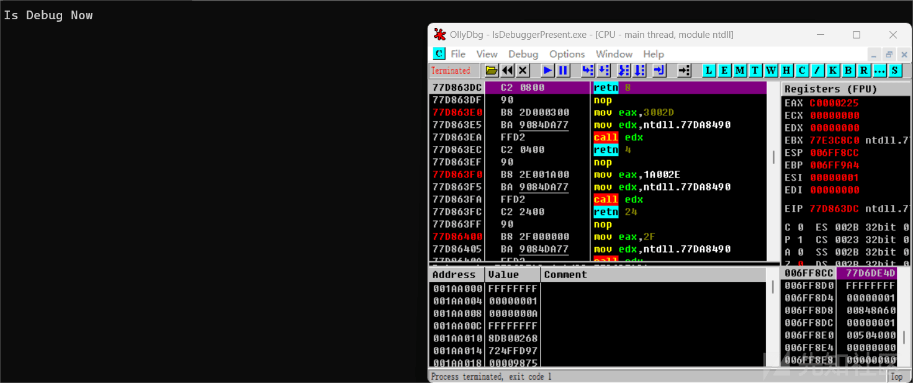
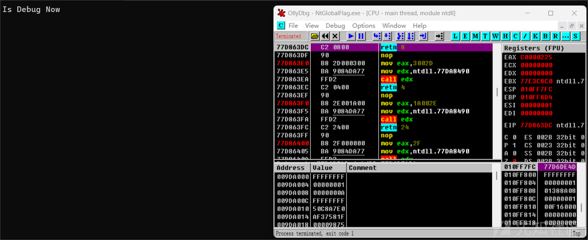
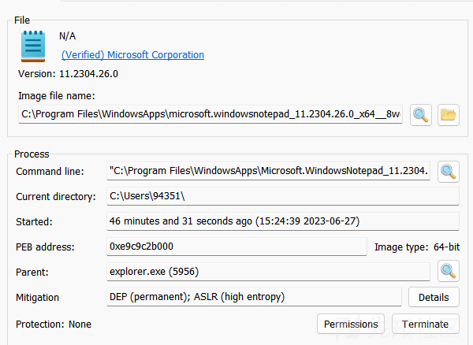
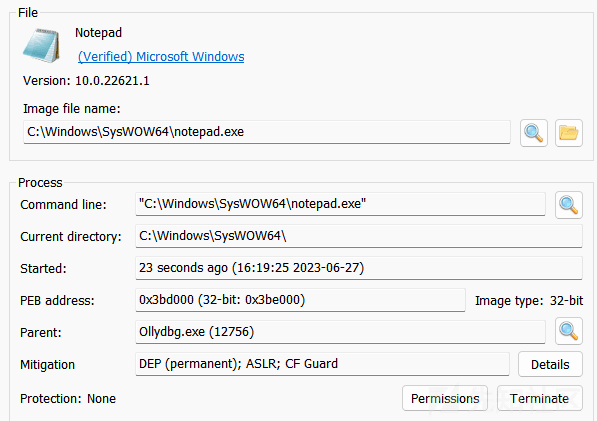
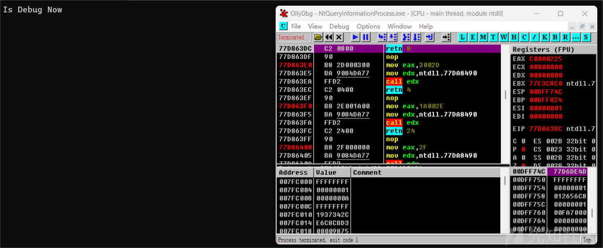
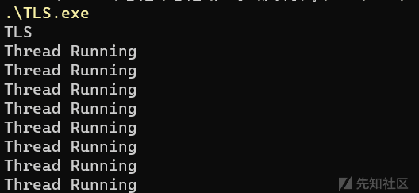
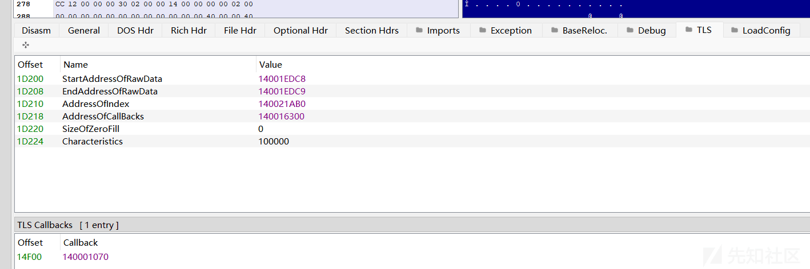
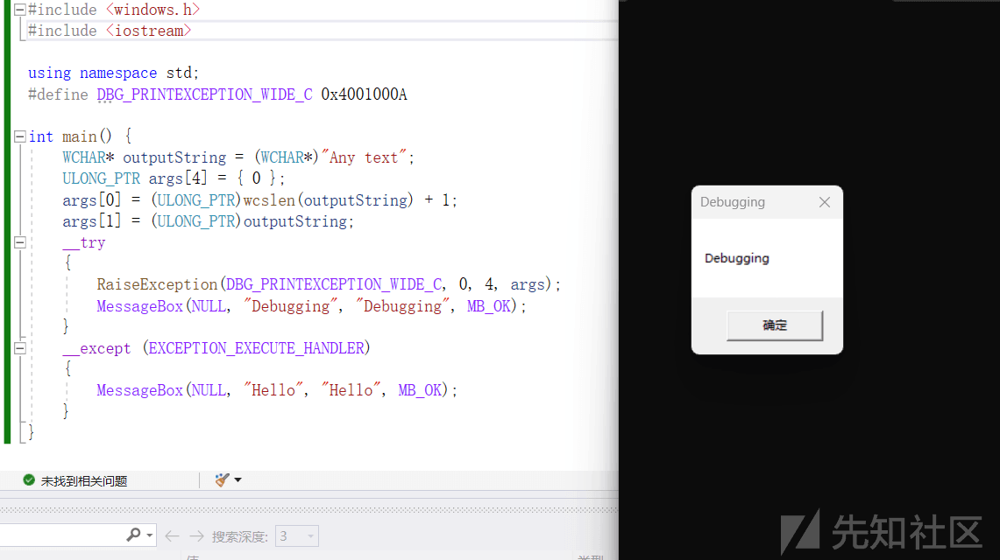

# 反调试浅析 - 先知社区

反调试浅析

- - -

由于传播、利用此文所提供的信息而造成的任何直接或者间接的后果及损失，均由使用者本人负责，文章作者不为此承担任何责任。（本文仅用于交流学习），本文仅作技术研究。  
**IsDebuggerPresent**  
具体链接：[https://learn.microsoft.com/zh-cn/windows/win32/api/debugapi/nf-debugapi-isdebuggerpresent](https://learn.microsoft.com/zh-cn/windows/win32/api/debugapi/nf-debugapi-isdebuggerpresent)  
该函数可以用于确定是否正在由用户模式调试器调试调用进程。

```bash
#include 

BOOL IsDebug() {

    return IsDebuggerPresent();
}

int main() {
    if (IsDebug()) {
        MessageBox(NULL, "Debug", "Debug", NULL);
        return 1;
    }
    else
    {
        MessageBox(NULL, "Not", "Not", NULL);
        MessageBox(NULL, "Hello", "Hello", NULL);
    }

}
```

[](https://xzfile.aliyuncs.com/media/upload/picture/20240203153704-066f50e8-c267-1.png)  
**NtCurrentPeb（）**  
IsDebuggerPresent 函数是调用 NtCurrentPeb（）返回当前线程的 Peb 的指针，然后调用 BeingDebugged 来判断，当前进程是否处于调式模式  
[](https://xzfile.aliyuncs.com/media/upload/picture/20240203153757-260143f8-c267-1.png)  
通过 windbg 也可以看到  
[](https://xzfile.aliyuncs.com/media/upload/picture/20240203153824-369687f0-c267-1.png)

```bash
#include <windows.h>
#include <iostream>
#include "ntdll.h"

using namespace std;

BOOL WINAPI lIsDebuggerPresent(VOID)
{
    return (BOOL)NtCurrentPeb()->BeingDebugged;
}

int main() {

    if (lIsDebuggerPresent()) {
        cout << "Is Debug Now" << endl;
        return 1;
    }
    else
    {
        cout << "Not Debug" << endl;
    }
}
```

除了使用 NtCurrentPeb() 去获取 Peb，我们也可以直接从寄存器去读取

```bash
#include <windows.h>
#include <iostream>
#include "ntdll.h"

using namespace std;

BOOL lBeingDebugged() {
    //获取 PEB 地址
#if defined(_WIN64)
    PEB* pPEB = (PEB*)__readgsqword(0x60);
#else
    PEB* pPEB = (PEB*)__readfsdword(0x30);
#endif

    BOOL Flag = pPEB->BeingDebugged;

    return Flag;
}

int main() {
    if (lBeingDebugged()) {
        cout << "Is Debug Now" << endl;
        return 1;
    }
    else
    {
        cout << "Not Debug" << endl;
    }
}
```

**CheckRemoteDebuggerPresent**  
CheckRemoteDebuggerPresent 函数可以判断指定的进程是否处于调试状态

```bash
#include <windows.h>
#include <iostream>

using namespace std;

int main() {
    BOOL pbDebuggerPresent;
    BOOL Check = CheckRemoteDebuggerPresent(GetCurrentProcess(), &pbDebuggerPresent);
    if (!Check) {
        cout << "CheckRemoteDebuggerPresent Error" << GetLastError() << endl;
        return 1;
    }

    cout << "CheckRemoteDebuggerPresent Success" << endl;
    if (pbDebuggerPresent) {
        cout << "Is Debug Now" << endl;
        return 1;
    }
    else
    {
        cout << "Not Debug" << endl;
        cout << "Hello" << endl;
    }

}
```

[](https://xzfile.aliyuncs.com/media/upload/picture/20240203153954-6beb3aae-c267-1.png)  
**NtQueryInformationProcess**  
通过在 reactos 查看，可以看到 CheckRemoteDebuggerPresent 函数的实现方式，  
[](https://xzfile.aliyuncs.com/media/upload/picture/20240203154030-81580a2a-c267-1.png)  
可以看到主要就是调用的 NtQueryInformationProcess 这个函数去实现，好的直接复制过来吧

```bash
#include <windows.h>
#include <iostream>
#include "ntdll.h"

#pragma comment(lib, "ntdll.lib")

using namespace std;

DWORD lBaseSetLastNTError(IN NTSTATUS   Status)
{
    DWORD dwErrCode;
    dwErrCode = RtlNtStatusToDosError(Status);
    SetLastError(dwErrCode);
    return dwErrCode;
}

BOOL WINAPI lCheckRemoteDebuggerPresent(IN HANDLE hProcess, OUT PBOOL pbDebuggerPresent)
{
    HANDLE DebugPort;
    NTSTATUS Status;

    /* Make sure we have an output and process*/
    if (!(pbDebuggerPresent) || !(hProcess))
    {
        /* Fail */
        SetLastError(ERROR_INVALID_PARAMETER);
        return FALSE;
    }

    /* Check if the process has a debug object/port */
    Status = NtQueryInformationProcess(hProcess,ProcessDebugPort,&DebugPort,sizeof(DebugPort),NULL);
    if (NT_SUCCESS(Status))
    {
        /* Return the current state */
        *pbDebuggerPresent = DebugPort != NULL;
        return TRUE;
    }

    lBaseSetLastNTError(Status);
    return FALSE;
}

int main() {
    BOOL pbDebuggerPresent;
    BOOL Check = lCheckRemoteDebuggerPresent(GetCurrentProcess(), &pbDebuggerPresent);
    if (!Check) {
        cout << "CheckRemoteDebuggerPresent Error" << GetLastError() << endl;
        return 1;
    }

    cout << "CheckRemoteDebuggerPresent Success" << endl;
    if (pbDebuggerPresent) {
        cout << "Is Debug Now" << endl;
        return 1;
    }
    else
    {
        cout << "Not Debug" << endl;
        cout << "Hello" << endl;
    }

}
```

**NtGlobalFlag**  
NtGlobalFlag 位于 PEB 中  
[](https://xzfile.aliyuncs.com/media/upload/picture/20240203154139-aa7511be-c267-1.png)

```bash
#include <windows.h>
#include <iostream>
#include "ntdll.h"

using namespace std;

BOOL lNtGlobalFlag() {
    //获取 PEB 地址
#if defined(_WIN64)
    PEB* pPEB = (PEB*)__readgsqword(0x60);
#else
    PEB* pPEB = (PEB*)__readfsdword(0x30);
#endif

    DWORD Flag = pPEB->NtGlobalFlag;
    if (Flag == 0x70) {
        return TRUE;
    }

    return FALSE;
}

int main() {
    if (lNtGlobalFlag()) {
        cout << "Is Debug Now" << endl;
        return 1;
    }
    else
    {
        cout << "Not Debug" << endl;
        cout << "Hello" << endl;
    }
}
```

当程序处于调试状态下的时候，其返回值是 0x70  
[](https://xzfile.aliyuncs.com/media/upload/picture/20240203154212-be2abd94-c267-1.png)  
**父进程检测**  
一般情况下，新建的进程（除开服务进程）其父进程基本都是 explorer.exe，这里以记事本为例子  
[](https://xzfile.aliyuncs.com/media/upload/picture/20240203154250-d51d5fc0-c267-1.png)  
当程序用调试器启动的时候，其父进程就是调试器的进程  
[](https://xzfile.aliyuncs.com/media/upload/picture/20240203154318-e5916c98-c267-1.png)  
我们可以利用 NtQueryInformationProcess 来判断当前进程的父进程是否是 explorer.exe，以此来判断是否在被调试状态

主要就是利用以下这个结构体

```bash
typedef struct _PROCESS_BASIC_INFORMATION
{
    NTSTATUS ExitStatus;
    PPEB PebBaseAddress;
    ULONG_PTR AffinityMask;
    KPRIORITY BasePriority;
    HANDLE UniqueProcessId;
    HANDLE InheritedFromUniqueProcessId;
} PROCESS_BASIC_INFORMATION, *PPROCESS_BASIC_INFORMATION;
```

-   UniqueProcessId：本进程 pid
-   InheritedFromUniqueProcessId：父进程 pid

拿到父进程的 pid，根据 pid 获得父进程的句柄，获得父进程的进程名，然后再判断是否为 explorer.exe 进程

```bash
#include <windows.h>
#include <iostream>
#include "ntdll.h"
#pragma comment(lib, "ntdll.lib")

using namespace std;

int main() {

    PROCESS_BASIC_INFORMATION Pro;
    NtQueryInformationProcess(GetCurrentProcess(), ProcessBasicInformation, &Pro, sizeof(Pro), NULL);

    HANDLE Handle = OpenProcess(PROCESS_ALL_ACCESS, FALSE, (DWORD)Pro.InheritedFromUniqueProcessId);

    wchar_t path[MAX_PATH];
    DWORD maxpath = MAX_PATH;
    QueryFullProcessImageNameW(Handle, 0, path, &maxpath);
    if (wcsstr(path, L"explorer.exe") != NULL) {
        cout << "Not Debug" << endl;
    }
    else
    {
        cout << "Is Debug Now" << endl;
        return 1;
    }
    system("pause");
}
```

[](https://xzfile.aliyuncs.com/media/upload/picture/20240203154423-0c1de13e-c268-1.png)  
**TLS 反调试**  
Thread Local Storage（TLS），即线程本地存储，是 Windows 为解决一个进程中多个线程同时访问全局变量而提供的机制。TLS 回调函数会在 main 函数之前执行，因此我们可以利用此来进行相关的反调试。

```bash
#include<Windows.h>
#include <stdio.h>

void NTAPI __stdcall TLS_CALLBACK(PVOID Dllhandle, DWORD Reason, PVOID Reserved);

//编译器声明使用 TLS
#ifdef _WIN64      
#pragma comment (linker, "/INCLUDE:_tls_used")  
#pragma comment (linker, "/INCLUDE:_tls_callback") 
#else               
#pragma comment (linker, "/INCLUDE:__tls_used") 
#pragma comment (linker, "/INCLUDE:__tls_callback")
#endif

//注册 TLS 回调函数
#ifdef _WIN64              
#pragma const_seg(".CRT$XLF")
EXTERN_C const
#else
#pragma data_seg(".CRT$XLF")   
EXTERN_C
#endif
PIMAGE_TLS_CALLBACK _tls_callback[] = { TLS_CALLBACK, 0 };
#ifdef _WIN64                       
#pragma const_seg()
#else
#pragma data_seg()              
#endif

//定义 TLS 回调函数
void NTAPI __stdcall TLS_CALLBACK(PVOID Dllhandle, DWORD Reason, PVOID Reserved) {
    printf("TLS\n");
}

DWORD WINAPI ThreadF(LPVOID param) {
    while (true) {
        printf("Thread Running\n");
        Sleep(200);
    }
    return 0;
}

int main() {
    CreateThread(0, 0, ThreadF, 0, 0, 0);
    while (true)
    {
        Sleep(-1);
    }
}
```

程序运行后如下，可以看见 TLS 回调函数在 main 函数之前就运行。  
[](https://xzfile.aliyuncs.com/media/upload/picture/20240203154517-2cc69246-c268-1.png)  
反调试实现，利用 IsDebuggerPresent() 检测是否正在调试程序，如果是则结束进程

```bash
#include<Windows.h>
#include <stdio.h>

void NTAPI __stdcall TLS_CALLBACK(PVOID Dllhandle, DWORD Reason, PVOID Reserved);

//编译器声明使用 TLS
#ifdef _WIN64       
#pragma comment (linker, "/INCLUDE:_tls_used")  
#pragma comment (linker, "/INCLUDE:_tls_callback") 
#else               
#pragma comment (linker, "/INCLUDE:__tls_used") 
#pragma comment (linker, "/INCLUDE:__tls_callback")
#endif

//注册 TLS 回调函数
#ifdef _WIN64              
#pragma const_seg(".CRT$XLF")
EXTERN_C const
#else
#pragma data_seg(".CRT$XLF")   
EXTERN_C
#endif
PIMAGE_TLS_CALLBACK _tls_callback[] = { TLS_CALLBACK, 0 };
#ifdef _WIN64                       
#pragma const_seg()
#else
#pragma data_seg()              
#endif 

//定义 TLS 回调函数
void NTAPI __stdcall TLS_CALLBACK(PVOID Dllhandle, DWORD Reason, PVOID Reserved) {
    if (IsDebuggerPresent()) {
        MessageBox(NULL, "Debug", "Debug", NULL);
        ExitProcess(0);
    }
    else
    {
        MessageBox(NULL, "No Debug", "No Debug", NULL);
    }
}

int main() {
    MessageBox(NULL, "Hello", "Hello", NULL);
}
```

[](https://xzfile.aliyuncs.com/media/upload/picture/20240203154559-45c9bb06-c268-1.png)  
但是使用 PE bear 查看时可以看见很明显的 TLS  
[](https://xzfile.aliyuncs.com/media/upload/picture/20240203154622-5334fe4a-c268-1.png)  
**NtSetInformationThread**  
如果程序正在被调试，则强制将自己从调试器里分离出来。其中的 ThreadHideFromDebugger 标志，如果为线程设置了此标志，则该线程将停止发送有关调试事件的通知。

```bash
#include <windows.h>
#include <iostream>
#include "ntdll.h"

using namespace std;


void main()
{
    NTSTATUS status = NtSetInformationThread(GetCurrentThread(), ThreadHideFromDebugger, NULL, 0);

    cout << "Hello" << endl;
}
```

**调试信息**  
有两种异常类型：DBG\_PRINTEXCEPTION\_C（0x40010006）和 DBG\_PRINTEXCEPTION\_W（0x4001000A）它们可用于程序是否处于调试状态。

```bash
#include <windows.h>
#include <iostream>

using namespace std;
#define DBG_PRINTEXCEPTION_WIDE_C 0x4001000A

int main() {
    WCHAR* outputString = (WCHAR*)"Any text";
    ULONG_PTR args[4] = { 0 };
    args[0] = (ULONG_PTR)wcslen(outputString) + 1;
    args[1] = (ULONG_PTR)outputString;
    __try
    {
        RaiseException(DBG_PRINTEXCEPTION_WIDE_C, 0, 4, args);
        MessageBox(NULL, "Debugging", "Debugging", MB_OK);
    }
    __except (EXCEPTION_EXECUTE_HANDLER)
    {
        MessageBox(NULL, "Hello", "Hello", MB_OK);
    }
}
```

[](https://xzfile.aliyuncs.com/media/upload/picture/20240203154746-85903fd0-c268-1.png)
