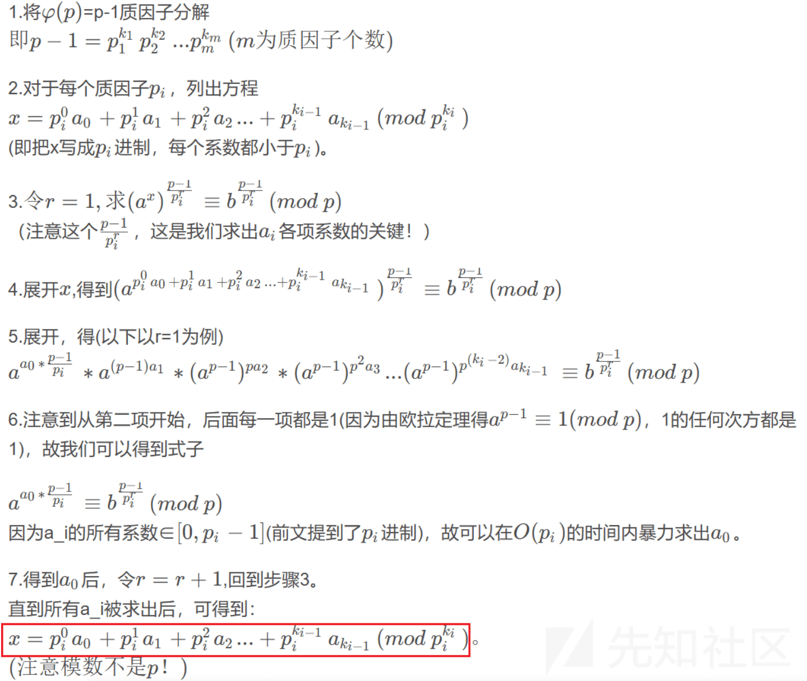
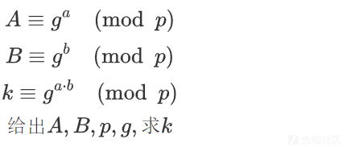
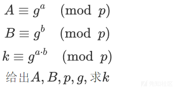
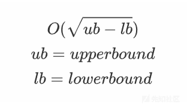

# 密码学——离散对数问题 (DLP) - 先知社区

密码学——离散对数问题 (DLP)

- - -

## DLP (Discrete Logarithm Problem)

在密码学中，离散对数问题是指在一个离散对数群中寻找指定的基值 g、模数 p 和给定结果 y 时，解方程  
[](https://xzfile.aliyuncs.com/media/upload/picture/20240228142250-cc29916a-d601-1.png)  
其中 x 为未知数，也是要求解的数。

### 生成元

生成元是数论中的一个概念，也被称为**本原元**。

给定一个正整数 m，如果存在一个整数 g，使得集合 {g^0, g^1, g^2, ..., g^(m-1)} 中的每个元素对模 m 都不相同，则 g 被称为模 m 的生成元。

设 G 是一个群，如果存在一个元素 g ∈ G，通过对 g 进行重复的群运算，可以得到 G 中的每个元素，那么 g 被称为 G 的**生成元**。这意味着对于任意元素 a ∈ G，存在整数 n，使得 g^n = a 在模 p 的剩余类中。

举个例子：若 p 是素数，计算  
[](https://xzfile.aliyuncs.com/media/upload/picture/20240228142437-0c40ea5a-d602-1.png)  
其中 x 取遍 1 到 p-1 的所有值时，都会得到不同的结果，那么 g 为 p 的生成元

**在一个循环群中，生成元的数量等于群中元素的数量**

### 阶

阶（Order）是指元素在某个运算下的最小重复次数  
对于群来说，阶指的是群中某个元素进行群运算后得到单位元所需的最小次数，也可以说是指数

### 指数，原根

设 m>1 是整数，a 是与 m 互素的正整数，则使得

[](https://xzfile.aliyuncs.com/media/upload/picture/20240228142744-7bac9862-d602-1.png)

成立的**最小正整数**e 叫做 a 对模 m 的**指数**，记作： 
[](https://xzfile.aliyuncs.com/media/upload/picture/20240228142701-61cbad34-d602-1.png)

如果 a 对模 m 的指数是**φ(m)**,则*a*叫做模 m 的**原根**

根据欧拉定理，当 a 和 m 互质时，有 a^φ(m) ≡ 1 (mod m)。这意味着 a 的阶（即最小的正整数 d，使得 a^d ≡ 1 (mod m)）必须是φ(m) 的因数。

[](https://xzfile.aliyuncs.com/media/upload/picture/20240228142826-94527170-d602-1.png)

### discrete\_log(y,g)

常用的求离散对数的方法（利用 Pohlig-Hellman--求解光滑阶循环群上的离散对数算法）

-   要求

[](https://xzfile.aliyuncs.com/media/upload/picture/20240228142953-c853974c-d602-1.png)

中 g 必须是原根

-   要求阶是光滑的（阶可拆成多个素数相乘，素数 p 的阶为 p-1）

**并没有范围要求**

### 题一：

#### NEEPUSec CTF 2023 easymath

[](https://xzfile.aliyuncs.com/media/upload/picture/20240228143101-f0c333cc-d602-1.png)

```bash
N = 7389313481223384214994762619823300589978423075857540712007981373887018860174846208000957230283669342186460652521580595183523706412588695116906905718440770776239313669678685198683933547601793742596023475603667
m = 1391372358062724416224243990838035874507346098208831800403257
c = 2275123956203765363233765961297507379124236980967603145079239177208264523438555378298177602517599708533004805369986246098127863480798528206818576888655427591685534478161571717613561380234338516607855593046949
fac = [2, 136327, 169937, 313351, 321427, 323377,356887, 413783, 519733,792413, 860077, 906289, 976501]
G=Zmod(N)
m1=G(m)
c1=G(c)
oo=[]
for i in fac:
    h=(N-1)//i 
    # 乘不乘次方没问题，毕竟最后都会被整除掉
    dlp1=discrete_log(c1**h,m1**h)
    # 换域了
    oo.append(int(dlp1))
sk=crt(oo,fac) 
mod = prod(fac) # 所有 fac 的乘积
for i in range(100):
    print(long_to_bytes(int(sk + i * mod)))
# Neepu{Nsmoothnumber}
```

其实，这题也可直接转：

```bash
m = 1391372358062724416224243990838035874507346098208831800403257
a=2275123956203765363233765961297507379124236980967603145079239177208264523438555378298177602517599708533004805369986246098127863480798528206818576888655427591685534478161571717613561380234338516607855593046949
G=Zmod(N) 
m1=G(m) 
c1=G(a) 
print(long_to_bytes(ZZ(discrete_log(c1,m1))))
# Neepu{Nsmoothnumber}
```

里面就是下面这个算法，最后就是自动换域了，换成了上面题目中的 i

[](https://xzfile.aliyuncs.com/media/upload/picture/20240228143317-422cb148-d603-1.png)

[](https://xzfile.aliyuncs.com/media/upload/picture/20240228143351-56307846-d603-1.png)

算出 m 个关于 x 的式子后，来一发 CRT 即可 (**不需要扩展 CRT**,因为**模数互质**)。

“注意！CRT 方程组必定有解，因此，如果原根变换后的最后的扩展 gcd 无解，也说明原方程无解！！！”

针对 Pohlig-Hellman，给出以下例题

### 题二

#### 题目描述：

```bash
import hashlib
from Crypto.Util.number import *
secret = getPrime(128)
m = getPrime(128)
n = getPrime(1024)
c = pow(m, secret, n)
flag = "flag{"+hashlib.md5(str(secret).encode()).hexdigest()+"}"
print("m = %d" % m)
print("n = %d" % n)
print("c = %d" % c)
# m = 211060723077960779250044744266141176829
# n = 89884656743115795386465259539451236680898848947115328636715040578866337902750481566354238661203768010560056939935696678829394884407208311246423715319737062188883946712432742638151109800623047059726541476042502884419075341171231440736956555270413618581675255342293149119974022969989259739901207135911877936187
# c = 32977205552939587326066964781587345932834856116807593874246357335611184723568494377764636367075033866504466671442418777279691941123340914970584204650416137940499348297233941269700668358058974528742129237158207741614517093787264725738282484698794547919205696467463725584733972956537910246421504887816202122161
```

#### 题目分析：

[](https://xzfile.aliyuncs.com/media/upload/picture/20240228143652-c21009a0-d603-1.png)

n 是 1024bits 的素数，过大而无法直接调用 sage 求离散对数

尝试分解 n-1 得到：

```bash
n = 89884656743115795386465259539451236680898848947115328636715040578866337902750481566354238661203768010560056939935696678829394884407208311246423715319737062188883946712432742638151109800623047059726541476042502884419075341171231440736956555270413618581675255342293149119974022969989259739901207135911877936187
factor(n-1)
# 2 * 659 * 144811523 * 158091863 * 167642023 * 194814973 * 198114301509256817 * 1524198318315919100927 * 302061228405984819868188635839278249994068296319393442016901959084878254985929326557136330675603997640265462782948042782543029960066166632904951616712643712462381886167331227465971149482608610738439655060064241698902750467248492676743
```

利用 Pohlig-Hellman 的思路，有以下：

```bash
import hashlib
"""
n = 89884656743115795386465259539451236680898848947115328636715040578866337902750481566354238661203768010560056939935696678829394884407208311246423715319737062188883946712432742638151109800623047059726541476042502884419075341171231440736956555270413618581675255342293149119974022969989259739901207135911877936187
factor(n-1)
# 2 * 659 * 144811523 * 158091863 * 167642023 * 194814973 * 198114301509256817 * 1524198318315919100927 * 302061228405984819868188635839278249994068296319393442016901959084878254985929326557136330675603997640265462782948042782543029960066166632904951616712643712462381886167331227465971149482608610738439655060064241698902750467248492676743
"""
# c = pow(m, secret, n)
# h = g^x mod p
def r(h, g, N, p, qi):
    """
    N : p-1
    qi: N中的素因子
    """

    Zp = Zmod(p)
    h = pow(h, N//qi, p)
    g = pow(g, N//qi, p)
    ri = discrete_log(Zp(h), Zp(g))
    return int(ri)
m = 211060723077960779250044744266141176829
n = 89884656743115795386465259539451236680898848947115328636715040578866337902750481566354238661203768010560056939935696678829394884407208311246423715319737062188883946712432742638151109800623047059726541476042502884419075341171231440736956555270413618581675255342293149119974022969989259739901207135911877936187
c = 32977205552939587326066964781587345932834856116807593874246357335611184723568494377764636367075033866504466671442418777279691941123340914970584204650416137940499348297233941269700668358058974528742129237158207741614517093787264725738282484698794547919205696467463725584733972956537910246421504887816202122161
tmp_list = [659, 144811523, 158091863, 167642023, 194814973]
r_list = []
for qi in tmp_list:
    tmp = r(c,m,n-1,n,qi)
    print(tmp)
    r_list.append(tmp)
x = crt(r_list, tmp_list)

module = 1
for i in tmp_list:
    module *= i  
while True:
    if int(x).bit_length()>128:
        print('fail')
        break
    if int(pow(m, x, n))==c:
        print('x =', x)
        flag = "flag{"+hashlib.md5(str(x).encode()).hexdigest()+"}"
        print(flag)
        break
    x += module
# crt 结果：425215994037823111210955984648839730 nbits() = 119
# x = 256148714020855512578941590011688772421
# flag{bbb04cf5180893e23e559c63ceae5b8f}
```

上面的知识理解了这题也就能理解了，照着解题思路求解下面一道类似的题：

### 题三

#### 题目描述：

```bash
from Crypto.Util.number import *
import hashlib


class D_H():
    def __init__(self):
        self.a = getPrime(128)
        self.b = getPrime(128)
        self.p = getPrime(1024)
        self.g = getPrime(128)
        print("p =", oct(self.p))
        print('g =', oct(self.g))

    def Alice(self):
        A = pow(self.g, self.a, self.p)
        print('A =', oct(A))

    def Bob(self):
        B = pow(self.g, self.b, self.p)
        print('B =', oct(B))

    def key_exchange(self):
        key = pow(self.g, self.a * self.b, self.p)
        return key


DH = D_H()
DH.Alice()
DH.Bob()
key = DH.key_exchange()
flag = "flag{" + hashlib.md5(str(key).encode()).hexdigest() + "}"

"""
p = 0o100000000000000000000000000000000000000000000000000000000000000000000000000000000000000000000000000000000000000000000000000000000000000000000000000000000000000000000000000000000000000000000000000000000000000000000000000000000000000000000000000000000000000000000000000000000000000000000000000000000000002320461720107654672567257101774542402073
g = 0o2065141432751712040220440246142105771015421
A = 0o43613040531475331260645277703363154024375552447624145423154467212453566671627031247565752140361214442354760036367561323225723114644705564775357161722423055427767542147531265612413043244400626062610066133355056455656354327315127131604056020315605217552254443755433425633455524145337447120342451441170743174123742307207301542043164563340422677
B = 0o60346662663461540211665020605034076206107430140346645020415164214412402345454104341770532135130621505726240703066624656170403450176106112505427262227076032102233051024443206700250621734407223434463067213634725130117240556410501066411312272344517322556714720077305705512606154144764640154454705523667767514601216365471777467432753500477011706
"""
```

#### 题目分析：

[](https://xzfile.aliyuncs.com/media/upload/picture/20240228143756-e85156d2-d603-1.png)

求解出 a,b，才能求出 k，那我们来求求 a,b  
a,b 就照上面的思路求解即可

```bash
import hashlib
p = 89884656743115795386465259539451236680898848947115328636715040578866337902750481566354238661203768010560056939935696678829394884407208311246423715319737062188883946712432742638151109800623047059726541476042502884419075341171231440736956555270413618581675255342293149119974022969989259739901207135911877936187
g = 178978976577444006672923576665226091281
A = 50239356217905865472590693130535124452580643255845661649114913837176616545680446441660877442220510431707262797664254080937029365543267241063727348540325656758225475328002443452916853398111285325871347982839528070974557886108688133202930757479488756682939702883037420270843439335589319393168138956304604603839
B = 68046726556991975149664595590016707595227397021142933235637385938062726185554085368749325804969213299585765894674681296185961941854759720420418514055458989818389672323352887448970349935846465613203461132495952672474425884078444741734977925886709761740257008768019155974481354455945984504687605522607787217862
tmp_list = [2 , 659 , 144811523 , 158091863 , 167642023 , 194814973]
# """
# factor(p-1)
# 2 * 659 * 144811523 * 158091863 * 167642023 * 194814973 * 198114301509256817 * 1524198318315919100927 * 302061228405984819868188635839278249994068296319393442016901959084878254985929326557136330675603997640265462782948042782543029960066166632904951616712643712462381886167331227465971149482608610738439655060064241698902750467248492676743
# """
# 发现了，一般因子大于 10 ** 9，就比较难 Pohlig_Hellman 出来
def r(h, g, N, p, qi):
    Zp = Zmod(p)
    h = pow(h, N//qi, p)
    g = pow(g, N//qi, p)
    ri = discrete_log(Zp(h), Zp(g)) # 只能说自动换域成了 qi
    return int(ri)
m = g
n = p
c = A # B
# 发现跑到 198114301509256817 sage 内核会挂掉，
# A 得到 crt() 的结果是 826486660946153390469647371238620201，nbits() = 120
# B 得到 crt() 的结果是 689331636356235454602319919260946857，nbits() = 120
def attack(A, g, p):
    r_list = []
    for qi in tmp_list:
        tmp = r(A,g,p-1,p,qi)
        r_list.append(tmp)
    x = crt(r_list, tmp_list)

    module = 1
    for i in tmp_list:
        module *= i
    while True:
        if int(x).bit_length()>128:
            print('fail')
            break
        if int(pow(g, x, p))==A:
            return x
        x += module

# 得到：
x = attack(A,g,p)
y = attack(B,g,p)
# x = 253100920167170926044570003097335817769
# y = 288439857354393866763185538169340562833
k = pow(g,x * y,p)
print('flag{' + hashlib.md5(str(k).encode()).hexdigest() + '}')
# flag{1515950b17d8b66efc6e47f812448721}
```

这个 crt 又让我想到了一题

### 题四 (2020-VNCTF-CryptoSe--CRT)

#### 题目描述：

```bash
Do you know the Chinese Remainder Theorem sometimes may not only have one solution?
```

```bash
import hashlib
from functools import reduce
from Crypto.Util.number import *

ms = [getRandomNBitInteger(128) for i in range(8)]
p = reduce(lambda x, y: x*y, ms)
x = getRandomRange(1, p)
cs = [x % m for m in ms]

flag = "flag{" + hashlib.sha256(str(x).encode()).hexdigest() + "}"
assert("4b93deeb" in flag)

# ms = [284461942441737992421992210219060544764, 218436209063777179204189567410606431578, 288673438109933649911276214358963643204, 239232622368515797881077917549177081575, 206264514127207567149705234795160750411, 338915547568169045185589241329271490503, 246545359356590592172327146579550739141, 219686182542160835171493232381209438048]
# cs = [273520784183505348818648859874365852523, 128223029008039086716133583343107528289, 5111091025406771271167772696866083419, 33462335595116820423587878784664448439, 145377705960376589843356778052388633917, 128158421725856807614557926615949143594, 230664008267846531848877293149791626711, 94549019966480959688919233343793910003]
```

### 题五（10DH&DLP）

#### 题目描述：

```bash
from Crypto.Util.number import *
import hashlib


class D_H():
    def __init__(self):
        self.a = getPrime(128)
        self.b = getPrime(128)
        self.p = getPrime(1024)
        self.g = getPrime(128)
        print("p =", oct(self.p))
        print('g =', oct(self.g))

    def Alice(self):
        A = pow(self.g, self.a, self.p)
        print('A =', oct(A))

    def Bob(self):
        B = pow(self.g, self.b, self.p)
        print('B =', oct(B))

    def key_exchange(self):
        key = pow(self.g, self.a * self.b, self.p)
        return key


DH = D_H()
DH.Alice()
DH.Bob()
key = DH.key_exchange()
flag = "flag{" + hashlib.md5(str(key).encode()).hexdigest() + "}"

"""
p = 0o100000000000000000000000000000000000000000000000000000000000000000000000000000000000000000000000000000000000000000000000000000000000000000000000000000000000000000000000000000000000000000000000000000000000000000000000000000000000000000000000000000000000000000000000000000000000000000000000000000000000002320461720107654672567257101774542402073
g = 0o2065141432751712040220440246142105771015421
A = 0o43613040531475331260645277703363154024375552447624145423154467212453566671627031247565752140361214442354760036367561323225723114644705564775357161722423055427767542147531265612413043244400626062610066133355056455656354327315127131604056020315605217552254443755433425633455524145337447120342451441170743174123742307207301542043164563340422677
B = 0o60346662663461540211665020605034076206107430140346645020415164214412402345454104341770532135130621505726240703066624656170403450176106112505427262227076032102233051024443206700250621734407223434463067213634725130117240556410501066411312272344517322556714720077305705512606154144764640154454705523667767514601216365471777467432753500477011706
"""
```

#### 题目分析：

[](https://xzfile.aliyuncs.com/media/upload/picture/20240228143855-0b47491c-d604-1.png)

求解出 a,b，才能求出 k。a, b 按照提示思路求解得到的

```bash
import hashlib
p = 89884656743115795386465259539451236680898848947115328636715040578866337902750481566354238661203768010560056939935696678829394884407208311246423715319737062188883946712432742638151109800623047059726541476042502884419075341171231440736956555270413618581675255342293149119974022969989259739901207135911877936187
g = 178978976577444006672923576665226091281
A = 50239356217905865472590693130535124452580643255845661649114913837176616545680446441660877442220510431707262797664254080937029365543267241063727348540325656758225475328002443452916853398111285325871347982839528070974557886108688133202930757479488756682939702883037420270843439335589319393168138956304604603839
B = 68046726556991975149664595590016707595227397021142933235637385938062726185554085368749325804969213299585765894674681296185961941854759720420418514055458989818389672323352887448970349935846465613203461132495952672474425884078444741734977925886709761740257008768019155974481354455945984504687605522607787217862
tmp_list = [2 , 659 , 144811523 , 158091863 , 167642023 , 194814973]
# """
# factor(p-1)
# 2 * 659 * 144811523 * 158091863 * 167642023 * 194814973 * 198114301509256817 * 1524198318315919100927 * 302061228405984819868188635839278249994068296319393442016901959084878254985929326557136330675603997640265462782948042782543029960066166632904951616712643712462381886167331227465971149482608610738439655060064241698902750467248492676743
# """
def r(h, g, N, p, qi):
    Zp = Zmod(p)
    h = pow(h, N//qi, p)
    g = pow(g, N//qi, p)
    ri = discrete_log(Zp(h), Zp(g))
    return int(ri)
m = g
n = p
c = A # B
# 发现跑到 198114301509256817 sage 内核会挂掉，
# A 得到 crt() 的结果是 826486660946153390469647371238620201，nbits() = 120
# B 得到 crt() 的结果是 689331636356235454602319919260946857，nbits() = 120
r_list = []
for qi in tmp_list:
    tmp = r(c,m,n-1,n,qi)
    print(tmp)
    r_list.append(tmp)
x = crt(r_list, tmp_list)
print(x)
module = 1
for i in tmp_list:
    module *= i
while True:
    if int(x).bit_length()>128:
        print('fail')
        break
    if int(pow(m, x, n))==c:
        print('x =', x)
        break
    x += module
# 得到：
x = 253100920167170926044570003097335817769
y = 288439857354393866763185538169340562833
k = pow(g,x * y,p)
print('flag{' + hashlib.md5(str(k).encode()).hexdigest() + '}')
# flag{1515950b17d8b66efc6e47f812448721}
```

**局限**：要知道 x 的位数，且一般位数**相对**较小，同时确定 p-1 光滑，但又不能太光滑（即因数太太太多，不然直接用 discrete\_log() 就能得出了，刚刚确实试了一下，太光滑不太行（因子多，重复因子也多），到时候 crt 出来的位数会过于小了，太小手动扩大也不太现实，毕竟手动扩大时所加的数的位数也相对较小，但重复因子很少的话另说）只能说越小越容易 crt 出来  
**以上均为个人理解，有错误，请指出**

### 题六（11DLP2）

#### 题目描述：

```bash
from secret import flag
from Crypto.Util.number import *

m = bytes_to_long(flag)
assert m.bit_length() == 47
data = [2, 3, 4, 5, 6]
cs = []
p = getPrime(512)
q = getPrime(512)
n = p*q
for i in data:
    cs.append(pow(i, m, n))
print(cs)
"""
[183098212086317720236828757315510192339273033804875740822801041376722387458993552796227899411901966324318366514880536763913315608412750265815750386810801443666072579873995967676472994916617708760086271155827496223499121301339946900578686321571238854410077055150282805741312173826325669295346629270100887114, 57033027040944100515577298747833062983449034346155581535109171399667991971614122726451624246276583123688811765412755210627513537740891720491136798691017567675611749056264437247135506921747135448387155606513983563110678466501221603978172670533058510913876368172674768929417846635764813733749021238273031358064, 44177513422937659688192503808032734159830361147993789424022745838993946766432456884886189398779755202878679629523667923807343226973440318127947558457476925179848208108399587026072741947465486816791306581859876197942191253278120326733144030253277598039138046967591357892542649422324554104602547660747339872074, 12631302718057472129138289484187738038805661685759196779990368768599115569927115234126312113575785471158626604808250556471019475882601443785660157133230999298014824293609691681149195181799904358979944719852988436666306120350671288382565369084160416022015445829639878167524217607450918100132212115997395372780, 42899381454706854217031716361682990989382003331688973566655317536112884234898037025883907894505663567670829738793956574655657437562098921910867502135260835097785409348930680677890714703165271668372795217905436049326872168290466249129739381681341323649536725632009485619857375114283009023943744880775769510652]
"""
```

#### 题目分析：

易知：

[](https://xzfile.aliyuncs.com/media/upload/picture/20240228143946-29bb51c2-d604-1.png)

```bash
from Crypto.Util.number import *
from gmpy2 import gcd
out = [183098212086317720236828757315510192339273033804875740822801041376722387458993552796227899411901966324318366514880536763913315608412750265815750386810801443666072579873995967676472994916617708760086271155827496223499121301339946900578686321571238854410077055150282805741312173826325669295346629270100887114, 57033027040944100515577298747833062983449034346155581535109171399667991971614122726451624246276583123688811765412755210627513537740891720491136798691017567675611749056264437247135506921747135448387155606513983563110678466501221603978172670533058510913876368172674768929417846635764813733749021238273031358064, 44177513422937659688192503808032734159830361147993789424022745838993946766432456884886189398779755202878679629523667923807343226973440318127947558457476925179848208108399587026072741947465486816791306581859876197942191253278120326733144030253277598039138046967591357892542649422324554104602547660747339872074, 12631302718057472129138289484187738038805661685759196779990368768599115569927115234126312113575785471158626604808250556471019475882601443785660157133230999298014824293609691681149195181799904358979944719852988436666306120350671288382565369084160416022015445829639878167524217607450918100132212115997395372780, 42899381454706854217031716361682990989382003331688973566655317536112884234898037025883907894505663567670829738793956574655657437562098921910867502135260835097785409348930680677890714703165271668372795217905436049326872168290466249129739381681341323649536725632009485619857375114283009023943744880775769510652]
n = gcd(out[0]*out[1]-out[4],out[0]**2-out[2])//2
x = discrete_log_lambda(mod(out[0],n),mod(2,n),(ZZ(10**14),ZZ(10**15))) # 随便用哪对数据都行
print(long_to_bytes(x))
# flag{tql!!!}
```

**discrete\_log\_lambda():**  
官方文档中介绍了时间复杂度：

[](https://xzfile.aliyuncs.com/media/upload/picture/20240228145518-5570dbd2-d606-1.png)

[](https://xzfile.aliyuncs.com/media/upload/picture/20240228145537-60ab66f2-d606-1.png)  
级数可有以下对应：  
2^{46} --> 10^{13}  
2^{48} --> 10^{15}  
时间复杂度差不多 10^{7},可以爆破出来

emmm 只能说 真的是 只有到了报错这一步，才会去搞懂啊，当时不太理解这个函数，用它去爆了个范围为 10^{309}~10^{310}的数，我说为什么总报错，超范围了，爆到地球毁灭都爆不出
