# 探究 SpringWeb 对于请求的处理过程 - 先知社区

探究 SpringWeb 对于请求的处理过程


## 探究目的

在路径归一化被提出后，越来越多的未授权漏洞被爆出，而这些未授权多半跟 spring 自身对路由分发的处理机制有关。今天就来探究一下到底 spring 处理了什么导致了才导致鉴权被绕过这样严重的问题。

## DispatcherServlet 介绍

首先在分析 spring 对请求处理之前之前，首先需要了解 DispatcherServlet，它是 Spring MVC 的核心，负责接收 HTTP 请求，并根据请求信息分发到相应的 Controller 进行处理。DispatcherServlet 重要特性如下：

*   前端控制器模式：在 Spring MVC 框架中，DispatcherServlet 实现了前端控制器设计模式。这个模式的主要思想是提供一个中心点，所有的请求将先到达这个中心点，然后由它进行分发。这样可以帮助我们将请求处理流程中的公共逻辑集中处理，从而提高了代码的可维护性。
*   请求分发：当 DispatcherServlet 接收到一个 HTTP 请求后，它会把请求分发给相应的处理器。这个分发的过程主要依赖 HandlerMapping 组件。HandlerMapping 根据请求的 URL 找到对应的 Controller。
*   处理器适配：找到了正确的处理器之后，DispatcherServlet 需要调用这个处理器的方法来处理请求。这个过程由 HandlerAdapter 负责。HandlerAdapter 会调用处理器的适当方法，并将返回值包装成 ModelAndView 对象。
*   视图解析：DispatcherServlet 还负责将处理器返回的 ModelAndView 对象解析为实际的视图。这个过程由 ViewResolver 完成。视图解析器根据 ModelAndView 中的视图名和已配置的视图解析器来选择一个合适的视图。

## Spring 对于请求的处理顺序

在具体了解 DispatcherServlet 如何工作之前需要先了解 java 项目中各个组件对于 url 的处理顺序。  
[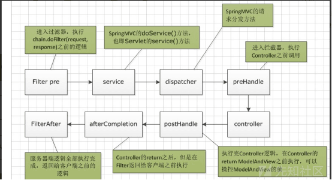](https://xzfile.aliyuncs.com/media/upload/picture/20230705113721-3ff08ad2-1ae5-1.png)  
看懂该图后，可以清晰地知道大多的路径归一化问题是因为鉴权的过滤器或者拦截器对于 url 的处理与 spring 最后对路由分发时的处理不一致，导致鉴权失败，从而可以未授权访问系统。  
下面就来看看 springweb 对 url 究竟是如何解析的

## SpringWeb 对于请求的处理过程

以 springboot2.2x 为例自己搭建一个 springboot 环境，创建好 controller 后在 controller 内部打断点。在调用链中可以清晰地看到，spring 对于 url 的分发确实是在 filter 之后，接下来  
[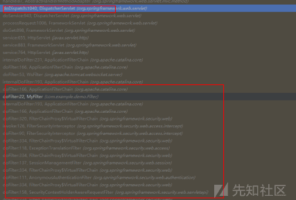](https://xzfile.aliyuncs.com/media/upload/picture/20230705113807-5b5de170-1ae5-1.png)  
从调用链可以看出在过完 Filterchain 链上所有的 Filter 后最后调用了 DispatcherServlet 的 servlet 方法。  
这里牵扯到一个 java 的机制，（不想深入了解 java 的可以略过这段）首先 servlet 在 ApplicationFilterChain.java 的 225 行被反射赋值为 DispatcherServlet 对象。所以 231 行调用的是 DispatcherServlet 的 service 方法且传入的参数是 ServletRequest，ServletResponse 类型。但是在 DispatcherServlet 中并没有 service 方法，在 DispatcherServlet 的父类 FrameworkServlet 中也没有重写接收 ServletRequest 和 ServletResponse 的对象 service 方法，所以调用链到了上一级父类 Httpservlet 这个抽象类的 service 方法。Httpservlet 中的 service 方法又调用了接收 HttpServletRequest 对象的 service 方法，该方法又被 FrameworkServlet 重写。故最后调用了 FrameworkServlet 中的 service。完全符合上面的调用链顺序。这里比较绕，大家可以自己跟一下就明白了。网上有很多对于这里的介绍都是错误的，学安全嘛还是要刨根问底一下。源码如下  
[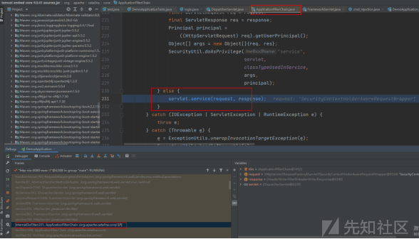](https://xzfile.aliyuncs.com/media/upload/picture/20230705113901-7b911138-1ae5-1.png)  
[](https://xzfile.aliyuncs.com/media/upload/picture/20230705114052-bd52c51c-1ae5-1.png)  
[](https://xzfile.aliyuncs.com/media/upload/picture/20230705114059-c17252c0-1ae5-1.png)  
[](https://xzfile.aliyuncs.com/media/upload/picture/20230705114107-c69137a8-1ae5-1.png)  
接着可以看到 FrameworkServlet 的 service 方法中 super 调用了 Httpservlet 的 service 方法，值得注意的是在该方法中调用的 doGet 方法并不是 Httpservlet 的 doGet 方法，而是 FrameworkServlet 的 doGet 方法。  
[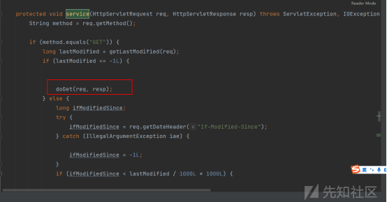](https://xzfile.aliyuncs.com/media/upload/picture/20230705114136-d7e179b4-1ae5-1.png)  
[](https://xzfile.aliyuncs.com/media/upload/picture/20230705114145-dd1b2d1c-1ae5-1.png)  
后面一直跟着调用链走，一直跟进到 doDispatch 方法。  
在该方法中做了很多比较关键的处理。  
首先处理了 content-type 为 multipart 的请求，后根据 mappedHandler = getHandler(processedRequest);这行代码获取了已注册的 handlerMappings。  
[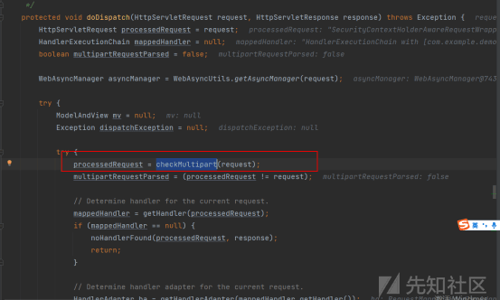](https://xzfile.aliyuncs.com/media/upload/picture/20230705114232-f9553054-1ae5-1.png)  
HandlerMapping 是一个接口，负责将客户端的 HTTP 请求映射到对应的 Controller。具体来说，它决定哪个 Controller 应该处理一个给定的请求。其中 RequestMappingHandlerMapping 用的最多，它支持@RequestMapping 注解，并且通常与@Controller 注解一起使用。  
[](https://xzfile.aliyuncs.com/media/upload/picture/20230705114334-1e0f6810-1ae6-1.png)  
所以具体处理的逻辑也就在 getHandler 方法中  
[](https://xzfile.aliyuncs.com/media/upload/picture/20230705114347-25d20aa8-1ae6-1.png)  
这段代码是从已注册的 handlerMappings 中获取一个 HandlerExecutionChain 对象，这个对象是对请求要执行的处理器以及其所有相关的拦截器的封装。跟进循环中的 getHandler  
[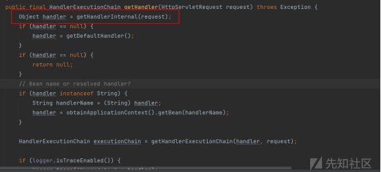](https://xzfile.aliyuncs.com/media/upload/picture/20230705114738-afa9128a-1ae6-1.png)  
getHandlerInternal 方法是将 HTTP 请求找到处理这个请求的 Handler，然后将其包装到 HandlerExecutionChain 对象中，以便后续的处理流程。  
到了这一步可以确定了，springweb 对 url 的匹配是在 getHandlerInternal 之中，跟进 getHandlerInternal 看看其具体实现。  
[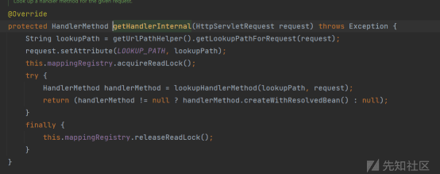](https://xzfile.aliyuncs.com/media/upload/picture/20230705114804-bf05048c-1ae6-1.png)  
看过路径归一化的师傅们应该到这里就很熟悉了，这个版本的函数叫 getLookupPathForRequest，新版本叫 initLookupPath。而这行代码也就是为了获得请求路径（通俗说就是我们请求的 url）。看看他是怎么处理的  
[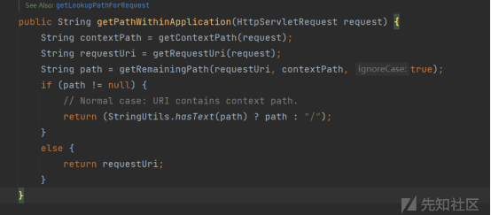](https://xzfile.aliyuncs.com/media/upload/picture/20230705114817-c707b22e-1ae6-1.png)  
很明显获取 url 的是 getRequestUri(request)  
[](https://xzfile.aliyuncs.com/media/upload/picture/20230705114837-d2a02648-1ae6-1.png)  
跟入  
[](https://xzfile.aliyuncs.com/media/upload/picture/20230705114851-db17ccd6-1ae6-1.png)  
decodeAndCleanUriString 这个函数可以说是大部分路径归一化问题的罪魁祸首，包括 shiro 2020-1937 也是因此而起。这三个函数我们挨个看看他到底干了什么  
[](https://xzfile.aliyuncs.com/media/upload/picture/20230705114923-edfafbac-1ae6-1.png)  
removeSemicolonContentInternal 主要做了两件事  
**1、移除所有的分号  
2、移除分号后面直到下一个斜杠”/”之间的所有字符**  
[](https://xzfile.aliyuncs.com/media/upload/picture/20230705114946-fbc8d9c0-1ae6-1.png)  
**decodeRequestString 函数是对 url 进行 url 解码**，在这里也要强调一下，经常会看到有师傅用 url 编码进行鉴权绕过的情况也是由于此处的原因，在过滤器中其实并没有对编码过 url 进行处理，而到了 spring 分发路由的时候，却对他进行了解码从而绕过了认证。  
顺便提一句，实战过程中可能会碰到 Nginx 的情况，Nginx 也会对 url 进行一层解码。  
[](https://xzfile.aliyuncs.com/media/upload/picture/20230705143837-92a8ded2-1afe-1.png)  
[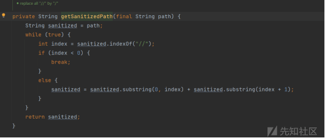](https://xzfile.aliyuncs.com/media/upload/picture/20230705114959-039a4d32-1ae7-1.png)  
getSanitizedPath 把双/替换成单/  
在此之中 removeSemicolonContentInternal 问题最大，由于前文处理的模型可以看到 url 先经过过滤器，如果过滤器中逻辑稍有不当，便有可能存在绕过鉴权的情况。  
举个简单的例子

```bash
String requestUri =  request.getRequestURI();
If(requestUri.endsWith(“js”)){
   filterChain.doFilter(servletRequest, servletResponse);
}else{
return ;
}
```

这是一个常见的对静态文件不进行鉴权的过滤器，然而此时则可以通过**/api/xxxxxx;js\*\***对该鉴权进行绕过。因为 filter 处理 url 时 if 是通过了 if 的逻辑，而到了 spring 的 doDispatch 中则由刚刚所述的处理，将其分发到了/api/xxxxxx 正确对应的接口。\*\*  
由此产生了很多鉴权问题，在 filter 之中对 url 处理稍有不慎变会导致该问题的产生。  
再回到 springweb 对请求的处理，除了刚刚介绍的三个函数对请求的处理之外，还有个地方需要注意，在 getLookupPathForRequest 之中可以看到 this.alwayUseFullPath。这个地方也是一个出现漏洞的点，在 springboot2.3.0RELEASE 之前 spring 是可以解析/api/a/../xxxx 为/api/xxxx 的，是因为 this.alwayUseFullPath 默认为 false，而在 springboot2.3.0RELEASE 之后，this.alwayUseFullPath 默认为 true。将无法再解析/api/a/../xxxx，会直接认为该 url 是个路径，去匹配相应的 controller。

[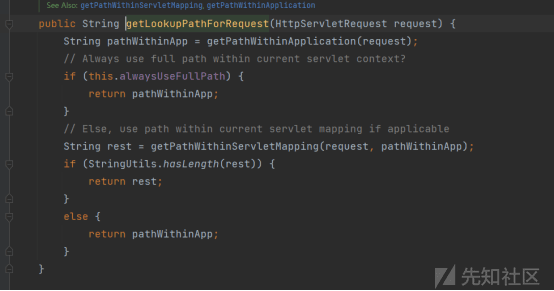](https://xzfile.aliyuncs.com/media/upload/picture/20230705115203-4d8708b8-1ae7-1.png)  
有始有终，刚刚只是解析获得了 lookuppath 也就是请求中的路径，之后再通过前文提到过的 getHandlerInternal 函数的 lookupHandlerMethod 对 spring 获取的 url 与 controller 中的 url 进行匹配。  
放几张跟踪的图  
[](https://xzfile.aliyuncs.com/media/upload/picture/20230705115225-5a704d00-1ae7-1.png)  
[](https://xzfile.aliyuncs.com/media/upload/picture/20230705115228-5c358c9a-1ae7-1.png)  
[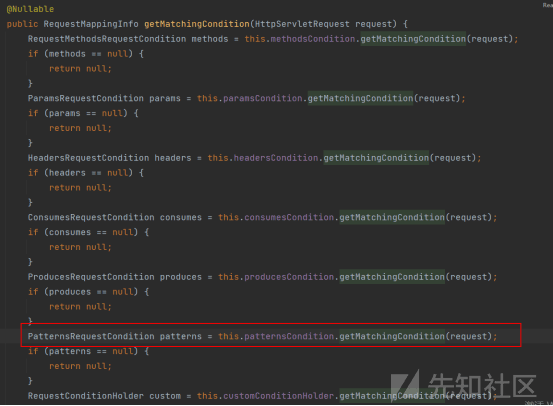](https://xzfile.aliyuncs.com/media/upload/picture/20230705115234-5fc09b84-1ae7-1.png)  
[](https://xzfile.aliyuncs.com/media/upload/picture/20230705115238-62681394-1ae7-1.png)  
[](https://xzfile.aliyuncs.com/media/upload/picture/20230705115244-65a33ba6-1ae7-1.png)  
跟踪到最后还有个要注意的点，是关于后缀的匹配模式  
[](https://xzfile.aliyuncs.com/media/upload/picture/20230705115259-6e994bba-1ae7-1.png)  
如果 useSuffixPatternMatch 为 true，且 spring 配置文件中 spring.mvc.pathmatch.use-suffix-pattern 的值也为 true（我的环境是 springweb5.2 图中为 false）  
[](https://xzfile.aliyuncs.com/media/upload/picture/20230705115344-89f24920-1ae7-1.png)  
环境版本高，但是想实验的师傅可以自己配置一下  
[](https://xzfile.aliyuncs.com/media/upload/picture/20230705115401-939c64b0-1ae7-1.png)  
Spring 这时能解析/path/path.js  
[](https://xzfile.aliyuncs.com/media/upload/picture/20230705115409-98cb5b6c-1ae7-1.png)  
在 1.x 版本的 springboot 和 4.x 版本的 springweb 中存在该情况。  
该情况也会绕过很多鉴权过滤器，使过滤器误以为用户请求的是静态资源。

## 总结

常出现漏洞的点  
1、removeSemicolonContentInternal 函数对分号进行了相关处理导致绕过过滤器鉴权  
2、decodeRequestString 对 url 进行解码，此处也可能存在问题  
3、在 springboot2.3.0RELEASE 之前 alwayUseFullPath 默认值为 false，所以可能会导致"../","..;/"绕过鉴权的情况  
4、springboot 1.x 版本可以解析/path/path.js 这类带有后缀的请求，可能造成鉴权绕过

第一次写文章，可能条理有点混乱。希望大家多多包涵，有问题可以评论区跟我讨论，也可以直接加我好友跟我一起探讨，共同维护国家网络安全！

## 参考连接

[https://github.com/spring-projects/spring-framework/](https://github.com/spring-projects/spring-framework/)  
[https://forum.butian.net/share/2214](https://forum.butian.net/share/2214)
