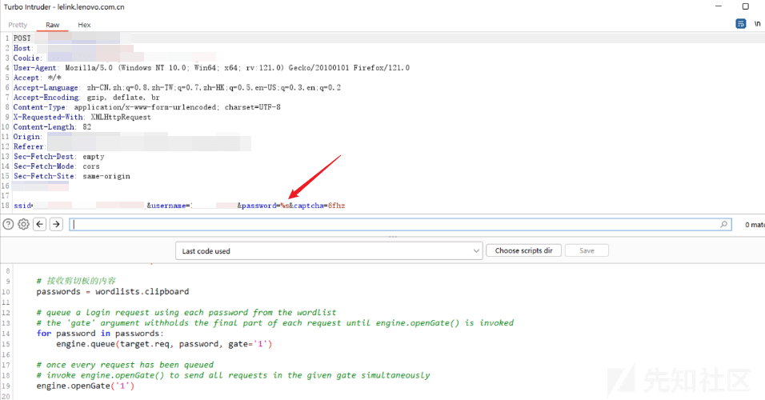
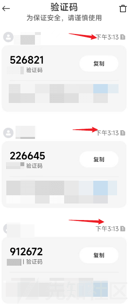
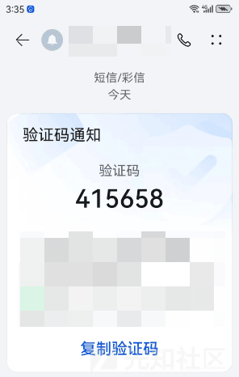
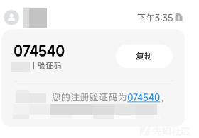
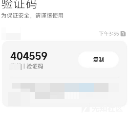
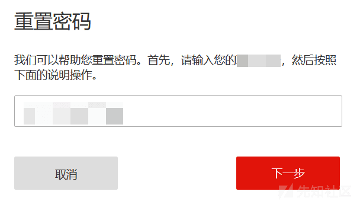
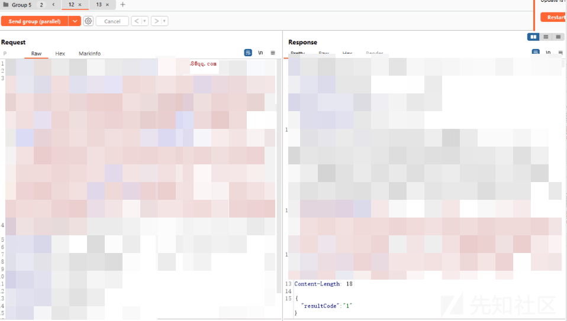
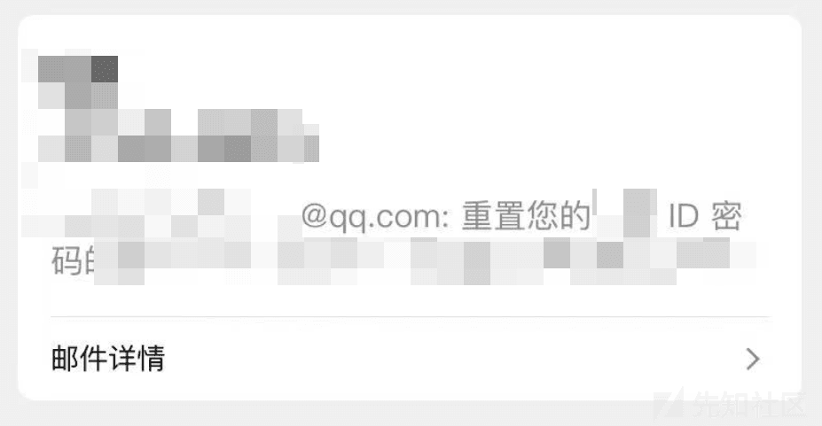

# 条件竞争的骚操作 (三) 案例分享 - 先知社区

条件竞争的骚操作 (三) 案例分享

- - -

前言：基于条件竞争的骚操作 (一) 和 (二) 下面我将分享几个“新鲜出产”的某大厂（下文简称 DC）src 关于条件竞争的漏洞

# 案例演示

## 案例一：在 DC 某资产下有个摄像机管理的登录页面存在可利用条件竞争实现密码爆破（验证码一码多用）

[](https://xzfile.aliyuncs.com/media/upload/picture/20240121173808-c8ca6424-b840-1.png)  
一般我们挖 src 弱口令的时候是不是遇到验证码就准备跑路放弃了，因为一旦密码输入错误验证码就会发生变化，当然也可以使用工具 NEW\_xp\_CAPTCHA 来识别验证码，但是一般来说成功几率不大，刚好最近在总结了条件竞争这方面的知识于是我便测试了一番，发现是可行的，基本步骤与“条件竞争的骚操作 (一)”中的操作差不多，下面为思路和操作。

首先启动 bp 挂好代理，提前把账号和密码以及正确的验证码填充上去，然后 bp 开始抓包，点击登录  
（在此之前我提前利用自己的手机号码进行了注册，一方面可以对该站点的其他功能点进行测试，另一方面得知了密码我们便可以用于密码爆破的测试）

[](https://xzfile.aliyuncs.com/media/upload/picture/20240121174515-c7d06fcc-b841-1.png)  
双击密码把密码发送到 turbo intruder 然后确保密码那块数值是%s 这样才可以遍历密码

[](https://xzfile.aliyuncs.com/media/upload/picture/20240121174831-3c24ca08-b842-1.png)

接下来再将 turbo intruder 下方的 python 脚本替换成以下脚本

```bash
def queueRequests(target, wordlists):

    # as the target supports HTTP/2, use engine=Engine.BURP2 and concurrentConnections=1 for a single-packet attack
    engine = RequestEngine(endpoint=target.endpoint,
                           concurrentConnections=1,
                           engine=Engine.BURP2
                           )

    # 接收剪切板的内容
    passwords = wordlists.clipboard

    # queue a login request using each password from the wordlist
    # the 'gate' argument withholds the final part of each request until engine.openGate() is invoked
    for password in passwords:
        engine.queue(target.req, password, gate='1')

    # once every request has been queued
    # invoke engine.openGate() to send all requests in the given gate simultaneously
    engine.openGate('1')


def handleResponse(req, interesting):
    table.add(req)
```

复制密码本到剪切板当中，点击 attack 开始尝试，事实证明还是可行的，不会出现验证码错误的情况

[](https://xzfile.aliyuncs.com/media/upload/picture/20240121175750-896c9326-b843-1.png)

## 案例二：同样是同一个网站我对其注册页面也进行了尝试

[](https://xzfile.aliyuncs.com/media/upload/picture/20240121180032-ea4c2b8e-b843-1.png)  
同样是提前输入手机号码和图形验证码，它这个图形验证码还有点坑，就是你第一次输入手机号码要注册的时候尽管你的图形验证码输入正确，它也是提示你是错误，很明显它就是会不断刷新的，这里我的想法再试试条件竞争咯，看能不能实现短信轰炸，大概思路也是跟第一个案例类似，我同样先抓包后发送到 turbo intruder，不过这次脚本选择的是↓

[](https://xzfile.aliyuncs.com/media/upload/picture/20240121180620-b9bf1804-b844-1.png)

[](https://xzfile.aliyuncs.com/media/upload/picture/20240121180538-a0a81758-b844-1.png)

通过观察返回数据包以及正常注册发送验证码返回的数据包对比发现 这里已经成功发送出了几十个短信了，至于数据包信息这里忘记截图了....随后立马查看自己的手机却发现并没有那么多验证码（只有 4 条短信），但是从下图中我们可以清晰的看得到发送的时间是一致，看似好像是成功了，但是也并没有完全成功，因为一般提交 src 的话每次至少需要发送 10+ 条短信到同一个手机号码一般才会收，此刻我怀疑是不是手机号码的问题，于是我找了 4 个手机号码来测试，发现要么 3 条短信要么 4 条短信就是不会超过 10 条于是我猜测应该是限制了手机号码的收取次数了，也就是每个手机号码在同一时间间隔内只能收到 n 条短信，那么看来没有其他办法了..

[](https://xzfile.aliyuncs.com/media/upload/picture/20240121181144-7aa69af6-b845-1.png)

不过！！！！还有一种测试的方向，这里特别分享一下，感觉还是比较容易出货的，但是厂商收不收那就看运气了：）  
短信轰炸其实可以分会"纵向轰炸"和"横向轰炸",上面验证的即为纵向轰炸

纵向短信轰炸和横向短信轰炸都是短信轰炸的两种不同变种，它们主要区别在于攻击的方向和目标

-   横向短信轰炸：这种类型的短信轰炸是指攻击者使用多个手机号码，分别发送大量短信给不同的目标。攻击者的目的是通过同时攻击多个目标来实现更广泛的影响。横向短信轰炸可能导致多个用户同时受到大量短信的骚扰。
    
-   纵向短信轰炸：相反，纵向短信轰炸是指攻击者使用一个或少数几个手机号码，但对同一目标连续发送大量短信。攻击者的目标是通过对单个目标的持续轰炸来实现更大的干扰和骚扰效果。纵向短信轰炸可能会对个别用户产生更强烈的影响
    

下面我们来尝试横向轰炸： 
由于条件有限我只找来了 4 个手机号码，然后开始抓包，同样是刚刚发送验证码的那个数据包将其发送到 repeater 上复制 4 个数据包然后合成一个 group 并替换手机号码之后选择 send group 一并发送，这里就利用到了条件竞争的骚操作 (一) 中的第二种方法，看不懂的话可以回看（一）

[](https://xzfile.aliyuncs.com/media/upload/picture/20240121182702-9e1b7040-b847-1.png)

请看下图：

[](https://xzfile.aliyuncs.com/media/upload/picture/20240121190033-4c40e246-b84c-1.png)

[](https://xzfile.aliyuncs.com/media/upload/picture/20240121184748-8444a06c-b84a-1.png)

[](https://xzfile.aliyuncs.com/media/upload/picture/20240121184816-94f72ccc-b84a-1.png)

[](https://xzfile.aliyuncs.com/media/upload/picture/20240121184841-a4085164-b84a-1.png)

可以看到时间均为 15:35 分，那么说明我们的横向短信轰炸也是非常成功的，每一个号码几乎在同一时间都收到了短信，但是由于条件有限我们也只能尝试 4 个手机号码，就看厂商收不收了....

案例三：这次是在另一个站点但同样是登录页面，测试的是“忘记密码”功能点\*\*

[](https://xzfile.aliyuncs.com/media/upload/picture/20240122100037-09508a26-b8ca-1.png)

[](https://xzfile.aliyuncs.com/media/upload/picture/20240122091649-eac75216-b8c3-1.png)  
同样是抓包后发送到 repeater，注意分清楚哪个是发送验证码的数据包，此处当你输入完想要更改的邮箱账号后它会自动发送验证码，也就是这个地方会有两个连续的数据包，所以测试要分清楚，然后还是老套路把其中一个数据包的邮箱地址改一下，改成咱自己能收到的邮箱地址，并发数据包，然后就分别去两个邮箱看验证码咯  
[](https://xzfile.aliyuncs.com/media/upload/picture/20240122091754-1183ed4c-b8c4-1.png)

[](https://xzfile.aliyuncs.com/media/upload/picture/20240122091840-2cf1fd4e-b8c4-1.png)

如下图↓

[](https://xzfile.aliyuncs.com/media/upload/picture/20240122092353-e7b4d02a-b8c4-1.png)

[](https://xzfile.aliyuncs.com/media/upload/picture/20240122092523-1d476400-b8c5-1.png)  
然后就可以把验证码输入进去之后修改密码啦，这里要注意如果 bp 的 proxy-intercept 那边一直抓着包要把它 Drop 掉，然后点成 off，再输入验证码，不然可能导致重新发送新的验证码而导致上一个验证码无效。

# 总结：

到此条件竞争相关的内容到此完结，其实做到底方法都是那几步，思路也比较固定，关键在于如何抓住竞争窗口，以及判断哪些功能点会出现条件竞争的情况，另外在案例三中，该网站重置密码时并没有要求需要旧密码，最终也导致漏洞成立，所以建议测试之前还是要把正常流程走一遍不要上来就一顿乱测，把数据包观察一波再开始耐心测试，总可以出货的。
