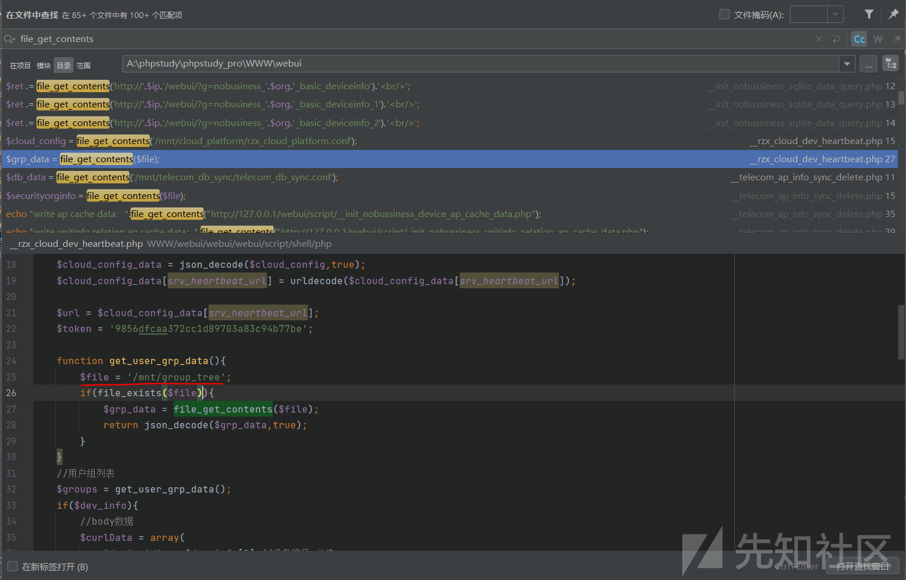
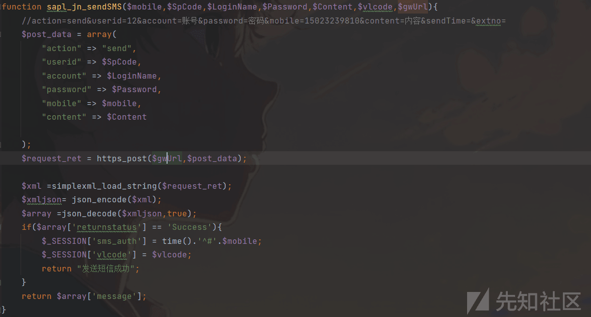
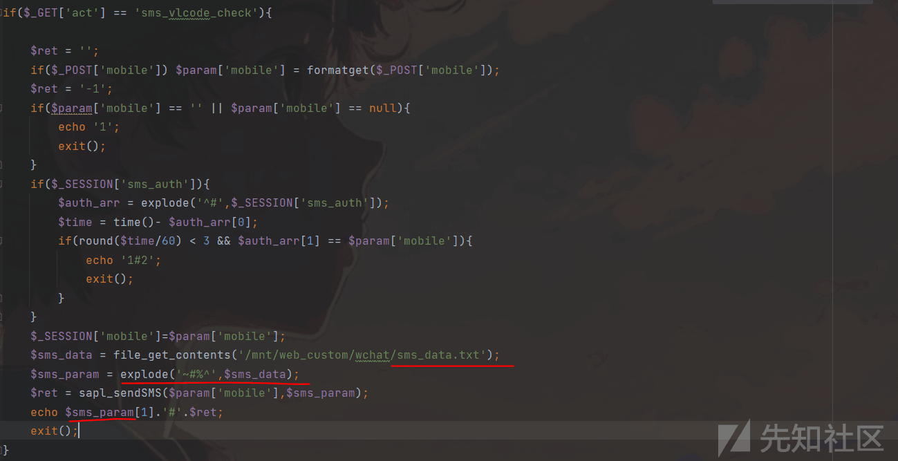
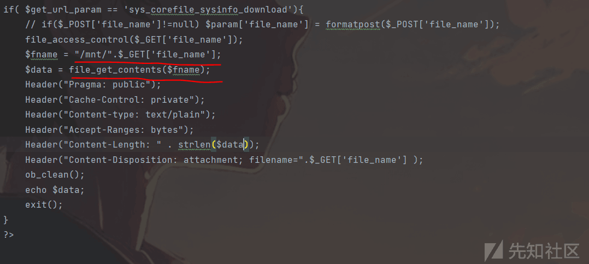
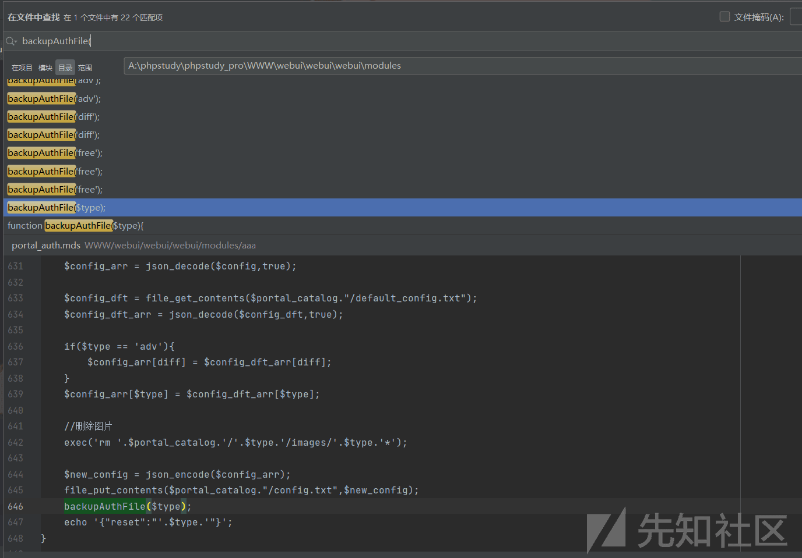
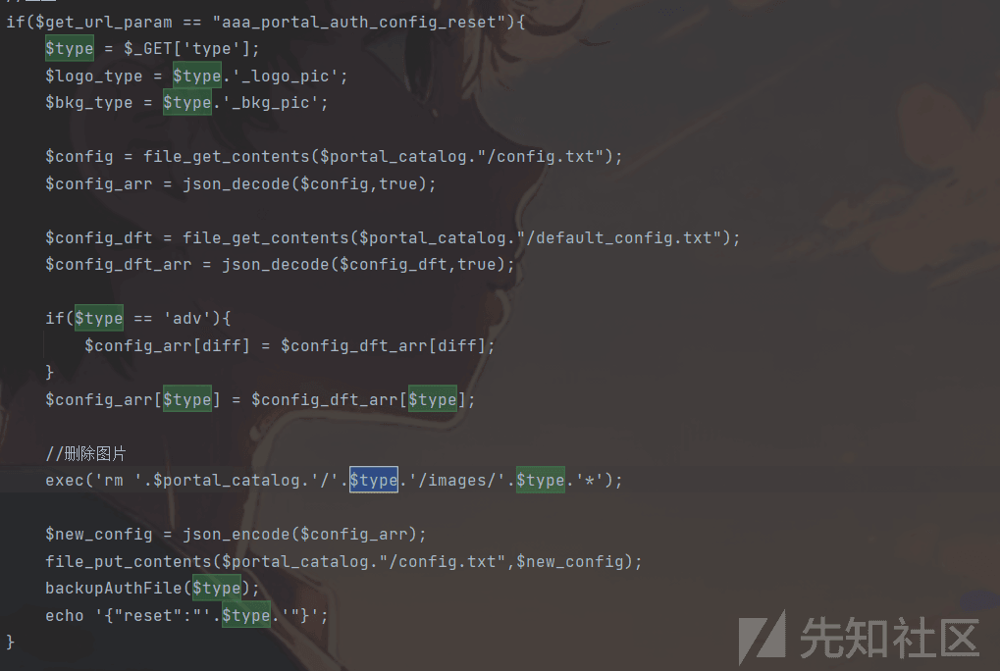
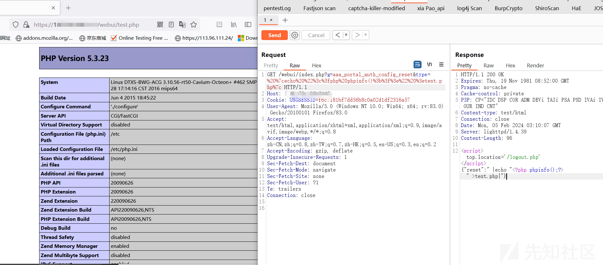
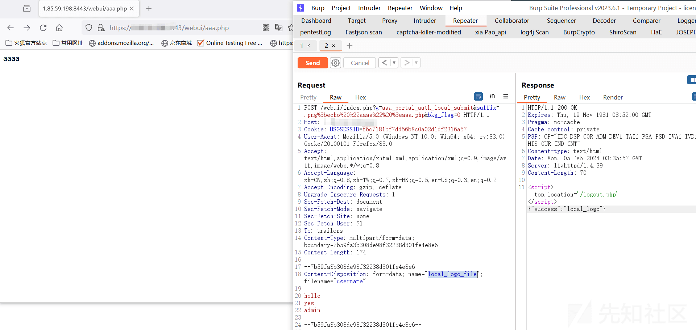

# 某网络管理系统代码审计 - 先知社区

某网络管理系统代码审计

- - -

# H3c 网管系统代码审计

系统里面除了`.php`文件，还有很多的`.mds` 文件，路由的处理逻辑大部分都在`.mds`文件中，但是要注意的是`Phpstorm`这类开发者工具在外面进行全局搜索的时候，不会对`mds`中的文件进行匹配，导致了开始审计的时候压根就找不到漏洞。

# 任意文件读取

一般`php` 类型的任意文件读取，都是通过`fopen()`以及`file_get_contents()`这些文件读取函数中的参数被用户恶意控制造成的，所以在看的时候直接全局搜这些可利用函数看上下文代码是否参数可被控制。

直接搜`file_get_contents()`会发现有大量的这种函数，但是大量类似的函数参数都是直接或间接被写死的。

直接静态变量的形式写死：

[](https://xzfile.aliyuncs.com/media/upload/picture/20240208180925-2317dccc-c66a-1.png)

看了很多函数，发现唯一好像有机会的地方是某个模拟`http`请求的函数：

[](https://xzfile.aliyuncs.com/media/upload/picture/20240208180933-27d56612-c66a-1.png)

> 通过`http_build_query()`创建一个`http`的查询，通过`stream_context_create()`来用于创建并返回一个新的上下文资源，以便在流操作函数中使用，一般参数都说以数组的形式定义请求头的各种参数等，随后进行`file_get_contents()`，`false`表示不会 在`include path`下寻找文件。

往上寻找能够发现是一个短信功能调用了这个函数，它通过发送一个`http`的请求去第三方的短信接口来获取短信的内容并返回给用户，直接看`$gwUrl` 是否可控。

[](https://xzfile.aliyuncs.com/media/upload/picture/20240208180940-2c5f80dc-c66a-1.png)

上方`$gwUrl`是通过传入了`sms_param[6]`，而`sms_param`参数通过不断的网上寻找看到了它通过直接从`sms_data.txt`中获取出来，以`~#%^`分割成数组，也还是间接通过静态变量控制了参数，除非这个`sms_data.txt` 我们可写，控制内容 (暂时没找到，告一段落)。所以所有的`.php`文件都没有找到有任意文件读取的情况。

[](https://xzfile.aliyuncs.com/media/upload/picture/20240208180949-31415800-c66a-1.png)

最终漏洞是在`modules/*.mds`类似的文件中，并且多个处理函数都存在这种情况：

[](https://xzfile.aliyuncs.com/media/upload/picture/20240208180955-352769a0-c66a-1.png)

[](https://xzfile.aliyuncs.com/media/upload/picture/20240208181002-3922d86e-c66a-1.png)

> 从`GET`请求的参数`g`中接受一个变量，通过这个变量可控制对应的处理路由，通过控制`g=sys_corefile_sysinfo_download`可来到上图的处理函数，直接传一个`file_name`为`../../../`的情况，在直接拼接字符串的时候就会造成目录穿越。

[](https://xzfile.aliyuncs.com/media/upload/picture/20240208181010-3dd203e4-c66a-1.png)

# 命令执行漏洞

对于`php`的命令执行，包括`thinkphp`等多种框架和代码，大部分都是通过`system、exec、call_user_func`等造成的，全局搜索的地方可以放在这些地方。

在`portal_auth.mds`中，看到`backupAuthFile和checkFileSize`两个函数在调用`exec()`的时候都拼接了变量，都是存在`命令执行的可能性`。

[](https://xzfile.aliyuncs.com/media/upload/picture/20240208181017-4264d896-c66a-1.png)

先看`backupFile`，查找有没有能够控制`$type`变量的函数，只找到了一个，其它都是静态的函数。

[](https://xzfile.aliyuncs.com/media/upload/picture/20240208181024-4622d848-c66a-1.png)

这里是`g=aaa_portal_auth_config_reset`的逻辑，直接接受一个参数`type`，传入到了`backupAuthFile`中，所以我们把`type`的值通过管道符控制就可以达到命令执行的效果，但事实上，这里`exec('rm '.$portal_catalog.'/'.$type.'/images/'.$type.'*');`就已经能够进行命令执行，分别就不需要进入`backUpAuthFile`中。

[](https://xzfile.aliyuncs.com/media/upload/picture/20240208181029-49775032-c66a-1.png)

[](https://xzfile.aliyuncs.com/media/upload/picture/20240208181034-4c4e62d2-c66a-1.png)

在上面可以看到通过`file_put_contents()`控制`config.txt`的内容，在`success.html`中，这里直接重加载的时候通过`get()`获取到了`config.txt`文件的内容，将获取到的内容直接执行了`eval()`，也是可以进行命令执行的。

[](https://xzfile.aliyuncs.com/media/upload/picture/20240208181039-4f8bc624-c66a-1.png)

再看`checkFileSize`的情况，随便找一个调用这个的函数看一下，首先是需要`checkFileSize`进入 else 的处理，需要传入的文件小于`$uploadFileSize`，`$uploadFileSize = 2097152;`大概是`2MB`。

[](https://xzfile.aliyuncs.com/media/upload/picture/20240208181047-53e4a10a-c66a-1.png)

[](https://xzfile.aliyuncs.com/media/upload/picture/20240208181050-55cf1d4c-c66a-1.png)

> 这里的`suffix`是传参可控的，所以文件名是可被控制的，剩下要满足的条件就是在基础配置`baseFlag`的时候需要是被定义的，在执行`checkFileSize`前不被终止返回。

[](https://xzfile.aliyuncs.com/media/upload/picture/20240208181054-586d7d8c-c66a-1.png)

> 只需要传入`suffix`参数控制后缀，`bkg_flag=0`控制进入 if 里面即可。

# sql 注入

在`monitor_users_trend_show` 的处理路由中，通过`get_db_connection()`来连接`postgresql`数据库，接收`$name、$timescope`参数，通过`$timescope`参数生成`$data_table_name`和`$query_codiction`，但是`$name`是直接传入的，看`replace_str_symbol`处理，`replace_str_symbol`对`括号`进行了处理，但是似乎不影响`$name`的值，因为这里是直接拼接的。

[](https://xzfile.aliyuncs.com/media/upload/picture/20240208181058-5a96aef8-c66a-1.png)

[](https://xzfile.aliyuncs.com/media/upload/picture/20240208181112-62bbf962-c66a-1.png)

```bash
function replace_str_symbol($value,$symbol = array('[',']'),$repace_symbol = array('(',')')){
    return str_replace($symbol,$repace_symbol,$value);
}

$data_table_name='admin';
$name="admin' and union select datname from pg_database#";
$query_condition=111;
$name=replace_str_symbol($name);
$query = 'select first_name,up_byte,down_byte,create_time from '.$data_table_name.' where first_name=\''.$name.'\' '.$query_condition.' order by create_time asc;';

echo $query;
```

> 可以传入`$name`为类似的形式，直接将后面的注释掉，使它联合查询进行注入，可惜的是这里并没有成功验证，找的很多资产都连接`pg`的时候出现问题，并且因为进不去里面不知道`timescope`等具体是什么，这里是否存在留疑！

# 总结

整个`CMS`框架的路由都是以参数`g`控制，所有的处理逻辑文件都在`.mds`后缀文件里面，通过`include template()`的形式来对模板进行渲染，从而到达前端，安全防御也不多，审计起来相对来说挺简单的。
