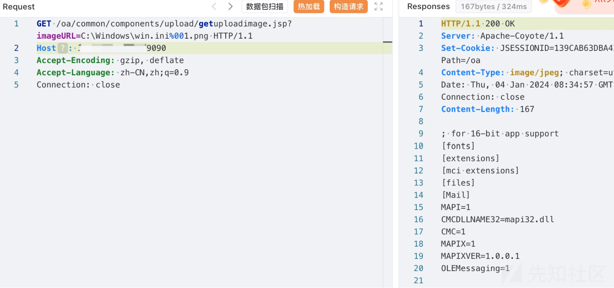

# 由 00 截断造成的文件读取 (CVE-2023-47473 分析) - 先知社区

由 00 截断造成的文件读取 (CVE-2023-47473 分析)

- - -

# 鉴权分析

通过 web.xml 配置文件查看过滤器，所以路由都会经过 SessionControl\_UserLogin 过滤器，  
[](https://xzfile.aliyuncs.com/media/upload/picture/20240108144040-d71c2bac-adf0-1.png)  
进入 SessionControl\_UserLogin 过滤器，查看 doFilter 方法  
[](https://xzfile.aliyuncs.com/media/upload/picture/20240108144027-cf105e10-adf0-1.png)  
其中有这么一段代码，这里的逻辑是创建一个迭代器，如果当前请求 URI 不在其中，会从会话中获取用户认证信息进行校验。如果当前请求 URI 在其中，则跳过校验。

在前面有定义默认的列表

[](https://xzfile.aliyuncs.com/media/upload/picture/20240108144054-df674abc-adf0-1.png)

也就是后缀为以上的 url，将不会需要校验 session。

# 漏洞点分析

那么我们可以把目标放在后缀为以上的代码中，我们可以发现 getuploadimage.jsp 代码其中包含 image.jsp 可以绕过 SessionControl\_UserLogin 过滤器的校验。

查看其中代码，发现这是通过传入的图片 URL，从文件中读取图片数据，并通过响应输出流返回给客户端的代码。

```bash
String imageURL = request.getParameter("imageURL");
    System.out.println(imageURL);
    if (!ValidateUtil.isNull(imageURL)) {
        try {
            String fileName = StringUtil.getFileName(imageURL);
            String fileType = StringUtil.getFileType(fileName, "unkown");
            if ("gif".equals(fileType) || "png".equals(fileType) || "bmp".equals(fileType) || "jpg".equals(fileType) || "jpeg".equals(fileType)) {

            } else {
                return;
            }
            response.setCharacterEncoding("UTF-8");
            response.resetBuffer();
            response.setContentType("image/jpeg");
            File uploadedFile = new File(imageURL);
            DataInputStream is = new DataInputStream(new FileInputStream(uploadedFile));
            DataOutputStream os = new DataOutputStream(response.getOutputStream());
            byte[] readBytes = new byte[128];
            int buffflag = -1;
            while ((buffflag = is.read(readBytes)) > -1) {
                os.write(readBytes, 0, buffflag);
            }
            os.close();
            is.close();
            os = null;
            response.flushBuffer();
            out.clear();
            out = pageContext.pushBody();
        } catch (UnsupportedEncodingException e) {
            e.printStackTrace();
        } catch (FileNotFoundException e) {
            e.printStackTrace();
        } catch (IOException e) {
        }
    }
```

通过分析代码，我们可以发现，`String imageURL = request.getParameter("imageURL");`imageURL 是用户的请求，也就是我们可以控制。然后通过`String fileName = StringUtil.getFileName(imageURL);`

方法成为文件名。其中`getFileName`从\\后获取文件名，然后将文件名丢进`getFileType`方法，进行文件类型的获取与校验。

```bash
public static String getFileName(String fileName) {
        int pos = fileName.lastIndexOf("\\");
        return pos > 0 ? fileName.substring(pos + 1) : fileName;
    }

    public static String getFileType(String fileName, String defaultType) {
        String fileType = "";
        if (fileName != null && fileName.length() > 0) {
            int i = fileName.lastIndexOf(46);
            if (i > -1 && i < fileName.length() - 1) {
                fileType = fileName.substring(i + 1).toLowerCase();
            }
        }

        if (!"pdf".equals(fileType) && !"doc".equals(fileType) && !"bmp".equals(fileType) && !"xls".equals(fileType) && !"exe".equals(fileType) && !"ppt".equals(fileType) && !"gif".equals(fileType) && !"html".equals(fileType) && !"xls".equals(fileType) && !"jpg".equals(fileType) && !"png".equals(fileType) && !"jpeg".equals(fileType) && !"xml".equals(fileType) && !"wav".equals(fileType) && !"wma".equals(fileType) && !"mp3".equals(fileType) && !"rar".equals(fileType) && !"txt".equals(fileType) && !"htm".equals(fileType) && !"zip".equals(fileType) && !"rm".equals(fileType) && !"swf".equals(fileType) && !"flv".equals(fileType) && !"docx".equals(fileType) && !"pptx".equals(fileType) && !"xlsx".equals(fileType)) {
            fileType = defaultType;
        }

        return fileType;
    }
```

这里我们可以发现对文件类型的判断十分严格，代码中会获取最后一个。的位置，然后进行转小写（防止大写绕过），然后进行判断，只要文件类型不在规定类型中就会被设置为 defaultType 也就是 unkown 类型。在前面的 getuploadimage.jsp 代码中存在判断语句。

```bash
if ("gif".equals(fileType) || "png".equals(fileType) || "bmp".equals(fileType) || "jpg".equals(fileType) || "jpeg".equals(fileType)) {

            } else {
                return;
            }
```

如果得到 fileType 不为其中的类型将无法执行后面的`File uploadedFile = new File(imageURL)`代码

，进行读文件的操作。那么这里是否存在方法使我们可以绕过对文件后缀名的判断，还不会影响到我们后续读文件的操作呢。在当前安装包中的 jdk 版本为 1.7.0（最新版中已经变为 jdk8 并且没有 Windows 版本）。

[](https://xzfile.aliyuncs.com/media/upload/picture/20240108144115-ebac86e8-adf0-1.png)

而在 JDK1.7.0\_40 之前的版本中是没有进行对\\00 进行检查，所以会造成 00 截断绕过。（也就是%00 最终被解析 cha(0),而在 ASCII 码 0 对应的为空字符，当在字符串中有空字符时会导致后面的字符被丢弃。）JDK1.7.0\_40 后新增检查

```bash
final boolean isInvalid(){
    if(status == null){
        status=(this.path.indexOf('\u0000')<0)?PathStatus.CHECKED:PathStatus.INVALID;
    }
    return status == PathStatus.INVALID;
}
```

从而达到 getFileType 文件后缀为图片，File(imageURL) 读文件时图片后缀被丢弃。

我们便可以构造 poc，只需要在想要读取的文件的后面加上%00 图片文件名，就可以

[](https://xzfile.aliyuncs.com/media/upload/picture/20240108144140-fad7b78c-adf0-1.png)

# 修复建议

更换 JDK 版本为 JDK1.7.0\_40 之后版本。
