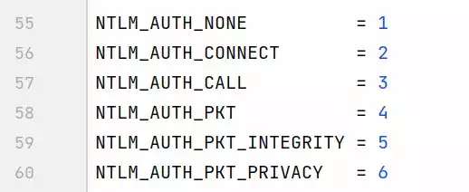
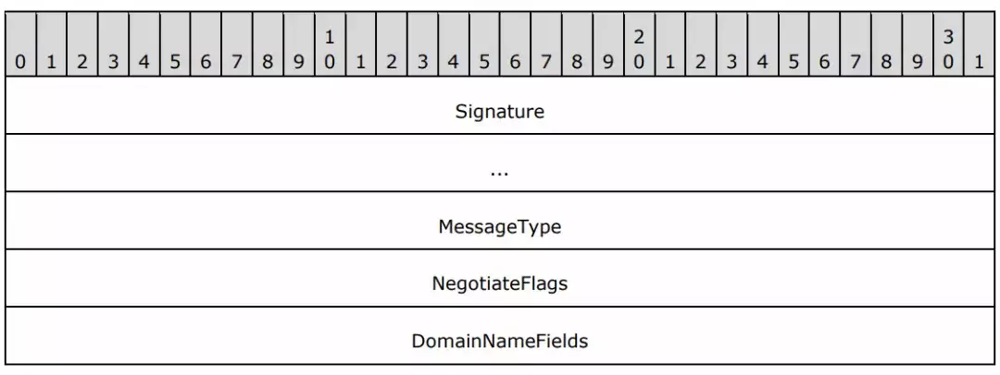
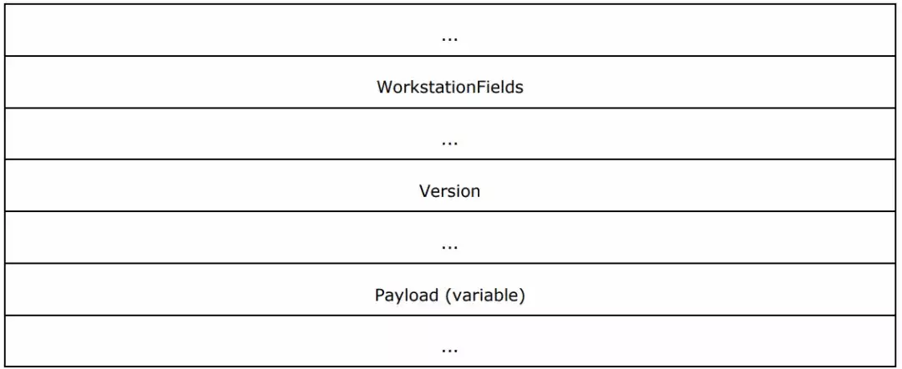

# 内网渗透瑞士军刀-impacket工具解析（一）

  

  

  

**impacket工具解析之NTLM协议实现**

preface

      impacket是一系列网络协议的python实现，实现包括IP、TCP、ICMP等基础的网络协议，更重要的是其实现了大量的Windows通信协议，包含Windows认证使用的ntlm和kerberos协议、用于活动目录数据存储的ldap及大量的msrpc协议。利用impacket既可以通过一系列的python类和方法构造协议对应的数据包，也可以将服务器返回的原始数据包“反序列化”为对应的python类，通过 Impacket，开发人员可以编写 Python 脚本来构建自定义的网络安全工具，进行网络协议分析、渗透测试、漏洞利用等任务。它在渗透测试、红队行动和网络安全研究中得到了广泛的应用。

    **impacket工具解析系列文章将以协议为切入点，针对不同的协议实现进行详细解析，由于impacket中实现的协议众多，我们将着重于内网渗透中常用的ntlm、kerberos、ldap、smb、rpc等协议分析，通过代码解读及示例帮助大家了解这款工具的原理和使用。作为系列文章的第一篇，我们首先介绍ntlm协议的实现。**

    我们使用impacket0.11.0版本为例，impacket中对ntlm的实现在ntlm.py一个文件中，文件位于impacket-ntlm.py

  

01

  

  

NTLM常量

**NTLM常量**

 USE\_NTLMv2


      在35-36行，作者在ntlm中首先定义了两个全局变量USE\_NTLMv2、TEST\_CASE分别代表使用NTLMv2和测试用例，在大部分的网络环境中NTLMv1已经非常少见了，所以这里默认是使用NTLMv1。

  

 **Auth Level**



      55-60行定义了6个常量，分别表示6个认证级别在dcerpc中会使用到这些参数，但是在ntlm并没有使用。


  

NEGOTIATE FLAGS


        62-191行是ntlm消息中FLAG字段的各个比特位的含义，NEGOTIATE FLAGS是ntlm消息中的一个字段，长度固定为4字节（32bit）每个字段及其含义如下

  

|     |     |     |
| --- | --- | --- |
| **标识位** | **名称** | **描述** |
| 0x00000001 | Negotiate Unicode | 表示支持在安全缓冲区数据中使用 Unicode 字符串。 |
| 0x00000002 | Negotiate OEM | 表示支持在安全缓冲区数据中使用 OEM 字符串。 |
| 0x00000004 | Request Target | 要求服务端在Type2消息中包含目标服务器的域名 |
| 0x00000008 | *unknown* | *保留字段（未使用）* |
| 0x00000010 | Negotiate Sign | 指定客户端和服务器之间经过身份验证的通信应携带数字签名（消息完整性） |
| 0x00000020 | Negotiate Seal | 指定客户端和服务器之间经过身份验证的通信应加密（消息机密性）。 |
| 0x00000040 | Negotiate Datagram Style | 表明正在使用数据报验证。 |
| 0x00000080 | Negotiate Lan Manager Key | 指示将lm Session Key应用于签名和密封经过身份验证的通信。 |
| 0x00000100 | Negotiate Netware | *保留字段（未使用）* |
| 0x00000200 | Negotiate NTLM | 指示正在使用 NTLM 身份验证。 |
| 0x00000400 | *unknown* | *保留字段（未使用）* |
| 0x00000800 | Negotiate Anonymous | 由客户端在 Type 3 消息中发送，表明匿名上下文已建立。这也会影响响应字段（如“匿名响应”部分中详述）。 |
| 0x00001000 | Negotiate Domain Supplied | 由客户端在Type 1 消息中发送，指示消息中包含客户端所在的域名，服务器使用它来确定客户端是否有资格进行本地身份验证。 |
| 0x00002000 | Negotiate Workstation Supplied | 由客户端在Type 1消息中发送，指示消息中包含客户端工作站的名称，服务器使用它来确定客户端是否有资格进行本地身份验证。 |
| 0x00004000 | Negotiate Local Call | *保留字段（未使用）* |
| 0x00008000 | Negotiate Always Sign | 设置此字段后，无论Negotiate Sign或Negotiate Seal是否设置都会生成session key |
| 0x00010000 | Target Type Domain | 表示在Type 2消息中Target字段的类型是域名 |
| 0x00020000 | Target Type Server | 表示在Type 2消息中Target字段的类型是服务器名 |
| 0x00040000 | Target Type Share | *保留字段（未使用）* |
| 0x00080000 | Negotiate NTLM2 Key | 指示应使用 NTLM2 签名和密封方案来保护经过身份验证的通信。请注意，这是指特定的会话安全方案，与 NTLMv2 身份验证的使用无关。 |
| 0x00100000 | Request Init Response | *保留字段（未使用）* |
| 0x00200000 | Request Accept Response | *保留字段（未使用）* |
| 0x00400000 | Request Non-NT Session Key | *保留字段（未使用）* |
| 0x00800000 | Negotiate Target Info | 由服务器在Type 2 消息中发送，以指示它在消息中包含目TargetInfo字段，TargetInfo用于计算 NTLMv2 响应。 |
| 0x01000000 | *unknown* | *保留字段（未使用）* |
| 0x02000000 | *unknown* | *保留字段（未使用）* |
| 0x04000000 | *unknown* | *保留字段（未使用）* |
| 0x08000000 | *unknown* | *保留字段（未使用）* |
| 0x10000000 | *unknown* | *保留字段（未使用）* |
| 0x20000000 | Negotiate 128 | 表示支持128位加密。 |
| 0x40000000 | Negotiate Key Exchange | 指示客户端将在Type 3 消息的“session key”字段中提供加密的主密钥。 |
| 0x80000000 | Negotiate 56 | 表示支持56位加密。 |

  

  

02

  

  

  NTLM消息结构

 NTLM消息结构

AVPAIRS

      AVPAIRS是一个在Challenge和ChallengeResponse都使用到的结构，由一系列的AV\_PAIR组成，并且以AvId为MsvAvEOL的AV\_PAIR结构结束，AV\_PAIR的结构如下。


      其中AvId表示AV\_PAIR的类型，AvLen表示值的长度，紧跟着的是值的内容，在impacket中定义了一个类AV\_PAIRS来表示这个结构

```plain
class AV_PAIRS:
    def __init__(self, data = None):
        self.fields = {}
        if data is not None:
            self.fromString(data)

    def __setitem__(self,key,value):
        self.fields[key] = (len(value),value)

    def __getitem__(self, key):
        if key in self.fields:
           return self.fields[key]
        return None

    def __delitem__(self, key):
        del self.fields[key]

    def __len__(self):
        return len(self.getData())

    def __str__(self):
        return len(self.getData())

    def fromString(self, data):
        tInfo = data
        fType = 0xff
        while fType is not NTLMSSP_AV_EOL:
            fType = struct.unpack('<H',tInfo[:struct.calcsize('<H')])[0]
            tInfo = tInfo[struct.calcsize('<H'):]
            length = struct.unpack('<H',tInfo[:struct.calcsize('<H')])[0]
            tInfo = tInfo[struct.calcsize('<H'):]
            content = tInfo[:length]
            self.fields[fType]=(length,content)
            tInfo = tInfo[length:]

    def dump(self):
        for i in list(self.fields.keys()):
            print("%s: {%r}" % (i,self[i]))

    def getData(self):
        if NTLMSSP_AV_EOL in self.fields:
            del self.fields[NTLMSSP_AV_EOL]
        ans = b''
        for i in list(self.fields.keys()):
            ans+= struct.pack('<HH', i, self[i][0])
            ans+= self[i][1]

        # end with a NTLMSSP_AV_EOL
        ans += struct.pack('<HH', NTLMSSP_AV_EOL, 0)

        return ans
```

  

    AV\_PAIRS类中使用了字典fields来存储AV\_PAIR，getData和fromString分别用于序列化和反序列化AV\_PAIRS数据类型。

  

Version

    impacket中ntlm定义的第二个类是Version，这个类的主要作用是用于反序列化NTLM消息中的version字段，我们可以看一下协议中对version字段的定义

  


    前8个字节表示的是操作系统信息，后1字节表示NTLMSSP的版本，固定为常量NTLMSSP\_REVISION\_W2K3(0x0F)，再来看一下impacket里的表示方式

  

```plain
class VERSION(Structure):
    NTLMSSP_REVISION_W2K3 = 0x0F

    structure = (
        ('ProductMajorVersion', '<B=0'),
        ('ProductMinorVersion', '<B=0'),
        ('ProductBuild', '<H=0'),
        ('Reserved', '3s=""'),
        ('NTLMRevisionCurrent', '<B=self.NTLMSSP_REVISION_W2K3'),
    )
```

    可以看到，VERSION类继承了Structure类，Structure类是impacket中一个非常核心的类，impacket中基本上所有的数据结构都是通过继承该类来实现，在Structure类的说明文档中可以看到这个类的使用方法。

  

```plain
sublcasses can define commonHdr and/or structure.
    each of them is an tuple of either two: (fieldName, format) or three: (fieldName, ':', class) fields.
    [it can't be a dictionary, because order is important]

    where format specifies how the data in the field will be converted to/from bytes (string)
    class is the class to use when unpacking ':' fields.

    each field can only contain one value (or an array of values for *)
       i.e. struct.pack('Hl',1,2) is valid, but format specifier 'Hl' is not (you must use 2 dfferent fields)

    format specifiers:
      specifiers from module pack can be used with the same format
      see struct.__doc__ (pack/unpack is finally called)
        x       [padding byte]
        c       [character]
        b       [signed byte]
        B       [unsigned byte]
        h       [signed short]
        H       [unsigned short]
        l       [signed long]
        L       [unsigned long]
        i       [signed integer]
        I       [unsigned integer]
        q       [signed long long (quad)]
        Q       [unsigned long long (quad)]
        s       [string (array of chars), must be preceded with length in format specifier, padded with zeros]
        p       [pascal string (includes byte count), must be preceded with length in format specifier, padded with zeros]
        f       [float]
        d       [double]
        =       [native byte ordering, size and alignment]
        @       [native byte ordering, standard size and alignment]
        !       [network byte ordering]
        <       [little endian]
        >       [big endian]

      usual printf like specifiers can be used (if started with %)
      [not recommended, there is no way to unpack this]

        %08x    will output an 8 bytes hex
        %s      will output a string
        %s\\x00  will output a NUL terminated string
        %d%d    will output 2 decimal digits (against the very same specification of Structure)
        ...

      some additional format specifiers:
        :       just copy the bytes from the field into the output string (input may be string, other structure, or anything responding to __str__()) (for unpacking, all what's left is returned)
        z       same as :, but adds a NUL byte at the end (asciiz) (for unpacking the first NUL byte is used as terminator)  [asciiz string]
        u       same as z, but adds two NUL bytes at the end (after padding to an even size with NULs). (same for unpacking) [unicode string]
        w       DCE-RPC/NDR string (it's a macro for [  '<L=(len(field)+1)/2','"\\x00\\x00\\x00\\x00','<L=(len(field)+1)/2',':' ]
        ?-field length of field named 'field', formatted as specified with ? ('?' may be '!H' for example). The input value overrides the real length
        ?1*?2   array of elements. Each formatted as '?2', the number of elements in the array is stored as specified by '?1' (?1 is optional, or can also be a constant (number), for unpacking)
        'xxxx   literal xxxx (field's value doesn't change the output. quotes must not be closed or escaped)
        "xxxx   literal xxxx (field's value doesn't change the output. quotes must not be closed or escaped)
        _       will not pack the field. Accepts a third argument, which is an unpack code. See _Test_UnpackCode for an example
        ?=packcode  will evaluate packcode in the context of the structure, and pack the result as specified by ?. Unpacking is made plain
        ?&fieldname "Address of field fieldname".
                    For packing it will simply pack the id() of fieldname. Or use 0 if fieldname doesn't exists.
                    For unpacking, it's used to know weather fieldname has to be unpacked or not, i.e. by adding a & field you turn another field (fieldname) in an optional field.
```

  

    从文档可以看到，structure字段为一个含有2个或者3个元素的元组列表，用于定义各个字段的名称以及结构，比如('ProductMajorVersion', '<B=0')这一个字段表示，字段名为ProductMajorVersion，格式为<B=0，从文档可以看到?=packcode这种格式，首先会计算出packcode的值，然后再按照？指定的方式进行打包也就是占用一个字节小端序的方式打包值0，对于python中的打包及解包不熟悉的可以参考一下python内置的struct包的使用方法，所以这里表示ProductMajorVersion字段占用1个字节，默认值为0，这是一个反序列化的过程。序列化则比较简单，就是按照<B来计算占用的字节数，并对对应的字节进行解包，然后赋值给ProductMajorVersion字段。

  

Negotiate

    Negotiate是ntlm认证使用的3大数据包结构之一，通常被称作Type1。消息结构如下





    这里出现了一个两个新字段格式DomainNameFields和WorkstationFields，我们可以看一下这两个字段的定义


    DomainNameLen表示字段的长度，DomainNameMaxLen和DomainNameLen相同，DomainNameBufferOffset表示这个字段的值偏移，通过DomainNameBufferOffset和DomainNameLen也就可以存储字段的值内容。来看一下impacket的类设计。

```plain
class NTLMAuthNegotiate(Structure):

    structure = (
        ('','"NTLMSSP\x00'),
        ('message_type','<L=1'),
        ('flags','<L'),
        ('domain_len','<H-domain_name'),
        ('domain_max_len','<H-domain_name'),
        ('domain_offset','<L=0'),
        ('host_len','<H-host_name'),
        ('host_maxlen','<H-host_name'),
        ('host_offset','<L=0'),
        ('os_version',':'),
        ('host_name',':'),
        ('domain_name',':'))

    def __init__(self):
        Structure.__init__(self)
        self['flags']= (
               NTLMSSP_NEGOTIATE_128     |
               NTLMSSP_NEGOTIATE_KEY_EXCH|
               # NTLMSSP_LM_KEY      |
               NTLMSSP_NEGOTIATE_NTLM    |
               NTLMSSP_NEGOTIATE_UNICODE     |
               # NTLMSSP_ALWAYS_SIGN |
               NTLMSSP_NEGOTIATE_SIGN        |
               NTLMSSP_NEGOTIATE_SEAL        |
               # NTLMSSP_TARGET      |
               0)
        self['host_name']=''
        self['domain_name']=''
        self['os_version']= ''
        self._workstation = ''

    def setWorkstation(self, workstation):
        self._workstation = workstation

    def getWorkstation(self):
        return self._workstation

    def __hasNegotiateVersion(self):
        return (self['flags'] & NTLMSSP_NEGOTIATE_VERSION) == NTLMSSP_NEGOTIATE_VERSION

    def getData(self):
        if len(self.fields['host_name']) > 0:
            self['flags'] |= NTLMSSP_NEGOTIATE_OEM_WORKSTATION_SUPPLIED
        if len(self.fields['domain_name']) > 0:
            self['flags'] |= NTLMSSP_NEGOTIATE_OEM_DOMAIN_SUPPLIED
        version_len = len(self.fields['os_version'])
        if version_len > 0:
            self['flags'] |= NTLMSSP_NEGOTIATE_VERSION
        elif self.__hasNegotiateVersion():
            raise Exception('Must provide the os_version field if the NTLMSSP_NEGOTIATE_VERSION flag is set')
        if (self['flags'] & NTLMSSP_NEGOTIATE_OEM_WORKSTATION_SUPPLIED) == NTLMSSP_NEGOTIATE_OEM_WORKSTATION_SUPPLIED:
            self['host_offset']=32 + version_len
        if (self['flags'] & NTLMSSP_NEGOTIATE_OEM_DOMAIN_SUPPLIED) == NTLMSSP_NEGOTIATE_OEM_DOMAIN_SUPPLIED:
            self['domain_offset']=32+len(self['host_name']) + version_len
        return Structure.getData(self)

    def fromString(self,data):
        Structure.fromString(self,data)

        domain_offset = self['domain_offset']
        domain_end    = self['domain_len'] + domain_offset
        self['domain_name'] = data[ domain_offset : domain_end ]

        host_offset = self['host_offset']
        host_end    = self['host_len'] + host_offset
        self['host_name'] = data[ host_offset : host_end ]

        if len(data) >= 36 and self.__hasNegotiateVersion():
            self['os_version'] = VERSION(data[32:])
        else:
            self['os_version'] = ''
```

    这里也出现了一种针对Field字段的表示方式?-field，表示该字段打包field的长度，在这个类里面还重写了Structure类的fromString方法，fromString方法是用于反序列也就是解包的方法，可以通过一个简单的实验来测试一下反序列化。

```plain
from impacket.ntlm import NTLMAuthNegotiate

if __name__ == '__main__':
    nego_data = bytes.fromhex('4e544c4d5353500001000000978208e2000000000000000000000000000000000a00614a0000000f')
    nego = NTLMAuthNegotiate()
    nego.fromString(nego_data)
    nego.dump()
```

  

结果如下

```plain
NTLMAuthNegotiate
: {'NTLMSSP\x00'}
message_type: {1}
flags: {3792208535}
domain_len: {0}
domain_max_len: {0}
domain_offset: {0}
host_len: {0}
host_maxlen: {0}
host_offset: {0}

os_version:{
    ProductMajorVersion: {10}
    ProductMinorVersion: {0}
    ProductBuild: {19041}
    Reserved: {b'\x00\x00\x00'}
    NTLMRevisionCurrent: {15}
}
host_name: {b''}
domain_name: {b''}
```

  

Challenge

```plain
class NTLMAuthChallenge(Structure):

    structure = (
        ('','"NTLMSSP\x00'),
        ('message_type','<L=2'),
        ('domain_len','<H-domain_name'),
        ('domain_max_len','<H-domain_name'),
        ('domain_offset','<L=40'),
        ('flags','<L=0'),
        ('challenge','8s'),
        ('reserved','8s=""'),
        ('TargetInfoFields_len','<H-TargetInfoFields'),
        ('TargetInfoFields_max_len','<H-TargetInfoFields'),
        ('TargetInfoFields_offset','<L'),
        ('VersionLen','_-Version','self.checkVersion(self["flags"])'),
        ('Version',':'),
        ('domain_name',':'),
        ('TargetInfoFields',':'))

    @staticmethod
    def checkVersion(flags):
        if flags is not None:
           if flags & NTLMSSP_NEGOTIATE_VERSION == 0:
              return 0
        return 8

    def getData(self):
        if self['TargetInfoFields'] is not None and type(self['TargetInfoFields']) is not bytes:
            raw_av_fields = self['TargetInfoFields'].getData()
            self['TargetInfoFields'] = raw_av_fields
        return Structure.getData(self)

    def fromString(self,data):
        Structure.fromString(self,data)
        self['domain_name'] = data[self['domain_offset']:][:self['domain_len']]
        self['TargetInfoFields'] = data[self['TargetInfoFields_offset']:][:self['TargetInfoFields_len']]
        return self
```

  

    Challenge消息也叫Type2，在Type2的定义中又出现了一个新的字段格式('VersionLen','\_-Version','self.checkVersion(self\["flags"\])')，这里表示的含义是VersionLen字段为Version的长度，在序列化时不会将这个字段加入数据中，并且这个值可以被self.checkVersion(self\["flags"\])计算的结果覆盖，作者重写了fromString方法用来反序列化domain\_name和TargetInfoFields字段，实际上并不需要这一段，在Structure的findLengthFieldFor实现中就已经对Field字段对应的值的判断，也就是说domain\_name和TargetInfoFields的值在domain\_field和TargetInfo\_Fields确定的情况下，长度也是确定的。  

  


将这段代码注释也是可以正常序列化的。


示例

```plain
if __name__ == '__main__':
    challenge_data = bytes.fromhex('4e544c4d53535000020000000400040038000000158289e267bf6a81e0c5dcd300000000000000006a006a003c0000000a0063450000000f4a004400020004004a004400010008004400430030003100040010006a0064002e006c006f00630061006c0003001a0044004300300031002e006a0064002e006c006f00630061006c00050010006a0064002e006c006f00630061006c00070008004e3a1907b2dbd90100000000')
    challenge = NTLMAuthChallenge()
    challenge.fromString(nego_data)
    challenge.dump()
```

```plain
NTLMAuthChallenge
: {'NTLMSSP\x00'}
message_type: {2}
domain_len: {4}
domain_max_len: {4}
domain_offset: {56}
flags: {3800662549}
challenge: {b'g\xbfj\x81\xe0\xc5\xdc\xd3'}
reserved: {b'\x00\x00\x00\x00\x00\x00\x00\x00'}
TargetInfoFields_len: {106}
TargetInfoFields_max_len: {106}
TargetInfoFields_offset: {60}
VersionLen: {8}
Version: {b'\n\x00cE\x00\x00\x00\x0f'}
domain_name: {b'J\x00D\x00'}
TargetInfoFields: {b'\x02\x00\x04\x00J\x00D\x00\x01\x00\x08\x00D\x00C\x000\x001\x00\x04\x00\x10\x00j\x00d\x00.\x00l\x00o\x00c\x00a\x00l\x00\x03\x00\x1a\x00D\x00C\x000\x001\x00.\x00j\x00d\x00.\x00l\x00o\x00c\x00a\x00l\x00\x05\x00\x10\x00j\x00d\x00.\x00l\x00o\x00c\x00a\x00l\x00\x07\x00\x08\x00N:\x19\x07\xb2\xdb\xd9\x01\x00\x00\x00\x00'}
```

  

ChallengeResponse

     ChallengeResponse也就是Type3，Type3的字段相对来说要更多一点，其中重要的字段有lanman，ntlm，session\_key，MIC。

```plain
class NTLMAuthChallengeResponse(Structure):

    structure = (
        ('','"NTLMSSP\x00'),
        ('message_type','<L=3'),
        ('lanman_len','<H-lanman'),
        ('lanman_max_len','<H-lanman'),
        ('lanman_offset','<L'),
        ('ntlm_len','<H-ntlm'),
        ('ntlm_max_len','<H-ntlm'),
        ('ntlm_offset','<L'),
        ('domain_len','<H-domain_name'),
        ('domain_max_len','<H-domain_name'),
        ('domain_offset','<L'),
        ('user_len','<H-user_name'),
        ('user_max_len','<H-user_name'),
        ('user_offset','<L'),
        ('host_len','<H-host_name'),
        ('host_max_len','<H-host_name'),
        ('host_offset','<L'),
        ('session_key_len','<H-session_key'),
        ('session_key_max_len','<H-session_key'),
        ('session_key_offset','<L'),
        ('flags','<L'),
        ('VersionLen','_-Version','self.checkVersion(self["flags"])'),
        ('Version',':=""'),
        ('MICLen','_-MIC','self.checkMIC(self["flags"])'),
        ('MIC',':=""'),
        ('domain_name',':'),
        ('user_name',':'),
        ('host_name',':'),
        ('lanman',':'),
        ('ntlm',':'),
        ('session_key',':'))
        ...
```

  

  lanman，表示的是LMChallengeResponse，由lm计算得到，现代网络环境中这个字段的值基本都是为空。  

    ntlm，表示NTChallengeResponse，在ntlm v1和v2中都存在这个字段，计算方式有所不同。

    session\_key，用于使用ntlm协议的通信协议加密密钥的协商。

    MIC， 用于保证ChallengeResponse的消息完整性，防止其被篡改。

  

03

  

  

NTLMSSP

**NTLMSSP**

      除了定义了基本的数据结构，在ntlm实现里还存在两个常用的高层函数，由于在impacket中ntlm基本上是作为客户端，而在ntlm认证中客户端需要构造Type1和Type3，所以在这里分别定义了getNTLMSSPType1和getNTLMSSPType3函数，用于构造数据包。

  

getNTLMSSPType1

      getNTLMSSPType1用于构造Type1数据包，虽然函数接收了4个参数，但是workstation和domain参数并没有使用，主要还是用于协商的Flag的初始化。

```plain
def getNTLMSSPType1(workstation='', domain='', signingRequired = False, use_ntlmv2 = USE_NTLMv2):
    # Let's do some encoding checks before moving on. Kind of dirty, but found effective when dealing with
    # international characters.
    import sys
    encoding = sys.getfilesystemencoding()
    if encoding is not None:
        try:
            workstation.encode('utf-16le')
        except:
            workstation = workstation.decode(encoding)
        try:
            domain.encode('utf-16le')
        except:
            domain = domain.decode(encoding)

    # Let's prepare a Type 1 NTLMSSP Message
    auth = NTLMAuthNegotiate()
    # auth['os_version'] = bytes.fromhex('0a00614a0000000f')
    auth['flags']=0
    if signingRequired:
       auth['flags'] = NTLMSSP_NEGOTIATE_KEY_EXCH | NTLMSSP_NEGOTIATE_SIGN | NTLMSSP_NEGOTIATE_ALWAYS_SIGN | \
                       NTLMSSP_NEGOTIATE_SEAL
    if use_ntlmv2:
       auth['flags'] |= NTLMSSP_NEGOTIATE_TARGET_INFO
    auth['flags'] |= NTLMSSP_NEGOTIATE_NTLM | NTLMSSP_NEGOTIATE_EXTENDED_SESSIONSECURITY | NTLMSSP_NEGOTIATE_UNICODE | \
                     NTLMSSP_REQUEST_TARGET |  NTLMSSP_NEGOTIATE_128 | NTLMSSP_NEGOTIATE_56

    # We're not adding workstation / domain fields this time. Normally Windows clients don't add such information but,
    # we will save the workstation name to be used later.
    auth.setWorkstation(workstation)

    return auth
```

  

getNTLMSSPType3

      Type 3 消息是 NTLMSSP 握手过程的最后一步，用于向服务器发送身份验证凭据以进行身份验证，这也是ntlm认证最核心的部分。

```plain
def getNTLMSSPType3(type1, type2, user, password, domain, lmhash = '', nthash = '', use_ntlmv2 = USE_NTLMv2):

    # Safety check in case somebody sent password = None.. That's not allowed. Setting it to '' and hope for the best.
    if password is None:
        password = ''

    # Let's do some encoding checks before moving on. Kind of dirty, but found effective when dealing with
    # international characters.
    import sys
    encoding = sys.getfilesystemencoding()
    if encoding is not None:
        try:
            user.encode('utf-16le')
        except:
            user = user.decode(encoding)
        try:
            password.encode('utf-16le')
        except:
            password = password.decode(encoding)
        try:
            domain.encode('utf-16le')
        except:
            domain = user.decode(encoding)

    ntlmChallenge = NTLMAuthChallenge(type2)

    # Let's start with the original flags sent in the type1 message
    responseFlags = type1['flags']
    # responseFlags = 3767042613
    # Token received and parsed. Depending on the authentication
    # method we will create a valid ChallengeResponse
    ntlmChallengeResponse = NTLMAuthChallengeResponse(user, password, ntlmChallenge['challenge'])

    clientChallenge = b("".join([random.choice(string.digits+string.ascii_letters) for _ in range(8)]))

    serverName = ntlmChallenge['TargetInfoFields']

    ntResponse, lmResponse, sessionBaseKey = computeResponse(ntlmChallenge['flags'], ntlmChallenge['challenge'],
                                                         clientChallenge, serverName, domain, user, password,
                                                         lmhash, nthash, use_ntlmv2)
```

  

    由于需要通过Type2中的信息来计算response，可以看到函数以type1，type2作为输入参数，在25行，利用type2来初始化NTLMAuthChallenge类，在这个过程会自动进行反序列化，32和36行分别获取了Type2的challenge和TargetInfoFields字段，第34行生成了8字节的client challenge，注意这里的client challenge是由数字和字母组成，但是正常的client challenge基本不可能全部是可见字符，所以这里也可以作为特征来识别impacket的ntlm实现。第38行是最为重要的计算ntResponse和lmResponse的步骤，很多人可能会将ntlmv1、ntlmv2、nthash及lmhash等概念搞混淆，我们可以通过computeResponse发现ntlmv1和ntlmv2的基本结构都是也一样的，唯一的区别就在于ntResponse和lmResponse的计算方式。

  

**computeResponseNTLMv1**  

    computeResponseNTLMv1用于计算ntlmv1中的ntResponse和lmResponse

```plain
def computeResponseNTLMv1(flags, serverChallenge, clientChallenge, serverName, domain, user, password, lmhash='',
                          nthash='', use_ntlmv2=USE_NTLMv2):
    if user == '' and password == '':
        # Special case for anonymous authentication
        lmResponse = ''
        ntResponse = ''
    else:
        lmhash = LMOWFv1(password, lmhash, nthash)
        nthash = NTOWFv1(password, lmhash, nthash)
        if flags & NTLMSSP_NEGOTIATE_LM_KEY:
           ntResponse = ''
           lmResponse = get_ntlmv1_response(lmhash, serverChallenge)
        elif flags & NTLMSSP_NEGOTIATE_EXTENDED_SESSIONSECURITY:
           md5 = hashlib.new('md5')
           chall = (serverChallenge + clientChallenge)
           md5.update(chall)
           ntResponse = ntlmssp_DES_encrypt(nthash, md5.digest()[:8])
           lmResponse = clientChallenge + b'\x00'*16
        else:
           ntResponse = get_ntlmv1_response(nthash,serverChallenge)
           lmResponse = get_ntlmv1_response(lmhash, serverChallenge)

    sessionBaseKey = generateSessionKeyV1(password, lmhash, nthash)
    return ntResponse, lmResponse, sessionBaseKey
```

  

      ntlmv1计算ntResponse和lmResponse分为3种情况，如果在Type中flag设置了NTLMSSP\_NEGOTIATE\_LM\_KEY，那么就只有lmResponse，lmResponse由lmhash加密serverChallenge得到，如果在Type中flag设置了NTLMSSP\_NEGOTIATE\_EXTENDED\_SESSIONSECURITY，lmResponse部分填充clientChallenge和16个0，ntResponse使用nthash加密，加密的内容为serverChallenge + clientChallenge进行md5后的前8字节，其他的情况下ntResponse和lmResponse分别由nthash和lmhash加密serverChallenge得到，可以发现三种情况下计算的到的ntResponse和lmResponse都是24字节。

  

  

**computeResponseNTLMv2**  

      ntlmv2中ntResponse和lmResponse的计算发生了比较大的变化，首先是加密key不再使用lmhash，并且没有直接将nthash作为key，而是由nthash派生出来的一个responseKeyNT，加密方式也由des变成了hmac\_md5

```plain
def computeResponseNTLMv2(flags, serverChallenge, clientChallenge, serverName, domain, user, password, lmhash='',
                          nthash='', use_ntlmv2=USE_NTLMv2):

    responseServerVersion = b'\x01'
    hiResponseServerVersion = b'\x01'
    responseKeyNT = NTOWFv2(user, password, domain, nthash)

    av_pairs = AV_PAIRS(serverName)
    # In order to support SPN target name validation, we have to add this to the serverName av_pairs. Otherwise we will
    # get access denied
    # This is set at Local Security Policy -> Local Policies -> Security Options -> Server SPN target name validation
    # level
    if TEST_CASE is False:
        av_pairs[NTLMSSP_AV_TARGET_NAME] = 'cifs/'.encode('utf-16le') + av_pairs[NTLMSSP_AV_HOSTNAME][1]
        if av_pairs[NTLMSSP_AV_TIME] is not None:
           aTime = av_pairs[NTLMSSP_AV_TIME][1]
        else:
           aTime = struct.pack('<q', (116444736000000000 + calendar.timegm(time.gmtime()) * 10000000) )
           av_pairs[NTLMSSP_AV_TIME] = aTime
        serverName = av_pairs.getData()
    else:
        aTime = b'\x00'*8

    temp = responseServerVersion + hiResponseServerVersion + b'\x00' * 6 + aTime + clientChallenge + b'\x00' * 4 + \
           serverName + b'\x00' * 4

    ntProofStr = hmac_md5(responseKeyNT, serverChallenge + temp)

    ntChallengeResponse = ntProofStr + temp
    lmChallengeResponse = hmac_md5(responseKeyNT, serverChallenge + clientChallenge) + clientChallenge
    sessionBaseKey = hmac_md5(responseKeyNT, ntProofStr)

    if user == '' and password == '':
        # Special case for anonymous authentication
        ntChallengeResponse = ''
        lmChallengeResponse = ''

    return ntChallengeResponse, lmChallengeResponse, sessionBaseKey
```

  

    ntChallengeResponse由两个部分组成，16字节的Response和一个NTLMv2\_CLIENT\_CHALLENGE结构体，NTLMv2\_CLIENT\_CHALLENGE包含了当前时间、client challenge、及Type2中的TargetInfo信息，Response由responseKeyNT加密（serverChallenge+NTLMv2\_CLIENT\_CHALLENGE）得到，lmChallengeResponse包含16字节的Response和ChallengeFromClient，Response计算比较简单，由responseKeyNT加密serverChallenge + clientChallenge，ChallengeFromClient字段填充clientChallenge。

  

      从这里可以看到不管是ntlmv1还是ntlmv2都是通过OWF（one way function）将密码转换成hash后再作为加密的key使用，这也是我们可以通过nthash进行pth的原因。

    本篇文章大致介绍了impacket库中对ntlm的实现，包括了一些底层数据结构设计，加密流程以及两个辅助构造数据包的函数，由于ntlm是一个嵌入式协议，我们将在后续的应用层协议中再详细介绍应用层与ntlm之间的交互。