# 内网渗透瑞士军刀-impacket工具解析（三）

  

  

  

**前言**

preface

前两篇我们介绍了impacket中对Windows认证的两种协议ntlm及Kerberos的实现细节，今天我们开始Windows网络中应用层协议的介绍，众所周知impacket是一个实现了一系列网络协议的套件，而其受到黑客们的青睐一方面是因为其实现了Windows的认证协议，并且通过暴露不同参数实现了PTH、PTT等功能，另一方面则是因为其中包含了大量的Windows RPC的实现，利用RPC，黑客们可以非常方便的实现远程调用计划任务，查询注册表、操作DCOM等等功能。从本章开始，我们正式开始对impacket中RPC的实现细节进行介绍。

  

**什么是Windows RPC**

  

  在 Windows 操作系统中，DCERPC（Distributed Computing Environment Remote Procedure Call）是一种基于 DCE（Distributed Computing Environment）标准的远程过程调用机制。它是用于在分布式环境中进行进程间通信的一种协议。

  DCERPC 在 Windows 中被广泛用于实现远程管理和协议交互，特别是在 Windows 网络环境中。它提供了一种标准化的方式，使得不同计算机间的进程可以通过网络进行通信和调用远程过程。

  

  

**impacket中的RPC**

  

我们查看impacket的源码结构会发现impacket下面有一个文件夹dcerpc，在子文件夹v5中包含了非常多的文件，在这些文件中除了rpc使用的一些通用数据类型或者是rpc运行时的实现代码外，其他的每一个文件都代表不同服务的rpc实现，例如atsvc.py是\[MS-TSCH\] 计划任务服务的实现，epm.py则是\[MS-RPCE\]端点映射服务的实现。

  

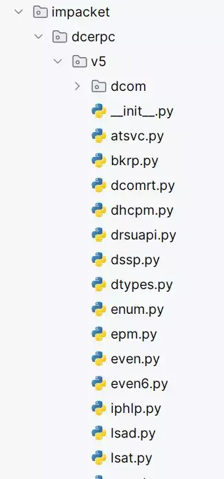

  

rpcrt.py可以通过文件名来判断其为rpc运行时的代码，其中就包含了rpc最核心的会话建立，认证，数据包构建及收发等逻辑。

  

  

**RPC数据传输**

  

RPC的数据传是将请求和响应数据在客户端和服务器之间进行传输，RPC支持使用不同的传输协议和机制来实现数据的传输和通信。比如在Windows中最常用的就是TCP/IP和SMB。

  

  

**01**

**DCERPCTransport**

    在transport.py中我们可以看到首先定义了一个基类DCERPCTransport，在这个基类中包含5个虚函数需要实现，connect、send、recv、disconnect、get\_socket。

  

  

通过这五个函数可以实现RPC底层的网络连接和数据收发、断连等功能。

    在这个基类中还有一个非常重要的函数DCERPCTransport.get\_dce\_rpc

  

  

    这个方法将当前transport的实例作为DCERPC\_V5类的参数，实例化后返回，DCERPC\_V5包含了dcerpc的运行时实现，是一个非常关键的类，功能我们后面再说，在impacket中没有直接实例化DCERPC\_V5来对RPC进行调用，都是首先实例化一个Transport或者利用Transport工厂生成一个Transport实例，再通过这个Transport实例调用get\_dce\_rpc来获取DCERPC实例来进行操作。

  

我们首先可以看一下最常用的两个传输协议TCPTransport和SMBTransport。

**TCPTransport**

顾名思义TCPTransport就是利用TCP来进行数据传输，这也是最简单的一种传输方式。

  

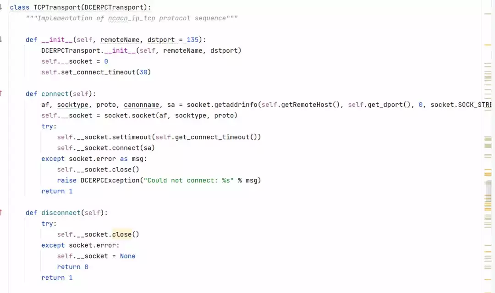

  

可以看到网络连接就是建立了一个简单的tcp连接，rpc断开就是socket断开连接。

  

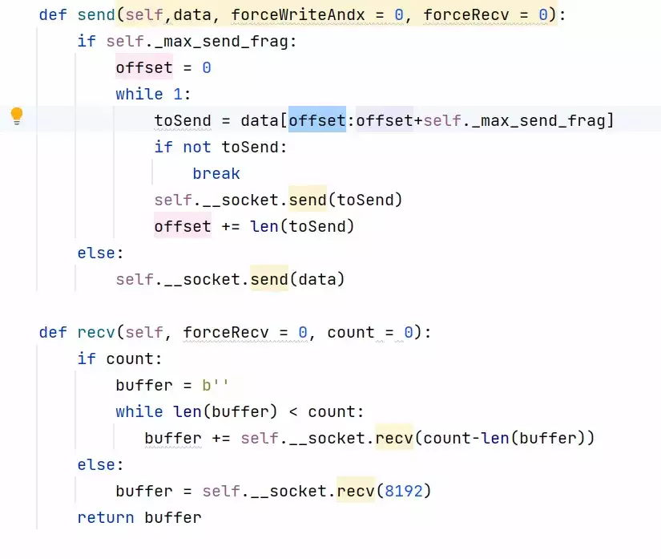

  

    数据发送和接收实际上也就是socket的发送和接收，不同的是数据发送时会根据\_max\_send\_frag参数来进行分批发送，数据包接收则默认是接收8192字节。

**SMBTransport**

  与TCPTransport不同，SMBTransport传输方式以SMB为基础。

  

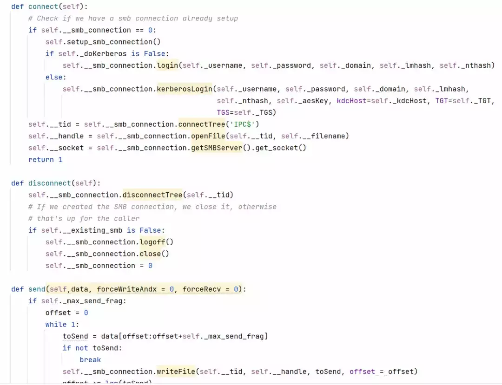

  

  

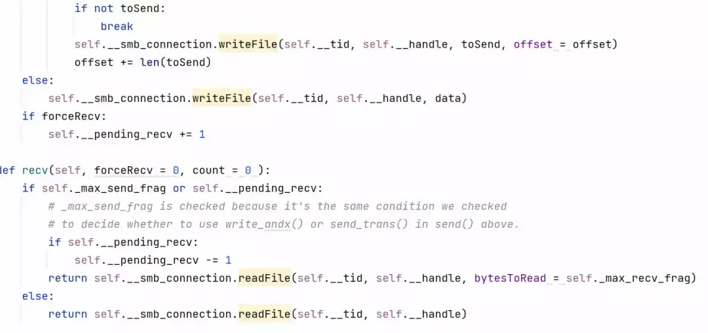

  

  SMB传输中数据连接实际上有以下几个步骤，首先建立SMB连接，然后连接到IPC$共享，这个共享是Windows服务器专门用于进程间通讯使用的共享，最后打开一个文件，这个文件代表提供服务的端点，而数据的发送和接收实际上就是对共享文件的写入和读取。

  

  

**02**

**stringBinding**

  stringBinding是rpc中定义的一个概念，和url比较类似，是一种标识远程对象的位置和通信细节的字符串格式，我们在阅读impacket源码时经常能看到这种数据格式，比如在横向移动工具atexec.py中

  

  

r'ncacn\_np:%s\[\\pipe\\atsvc\]' % addr，将这个字符串解析之后就是ncacn\_np:192.168.31.110\[\\pipe\\atsvc\]

这里就包含了以下几个信息

  

1.  协议标识符（Protocol Identifier）：指定用于通信的协议，如 TCP/IP、HTTP、HTTPS 等，这里ncacn\_np表示smb。
    
2.  网络地址（Network Address）：指定远程对象所在的网络地址，可以是 IP 地址或主机名，在这里是192.168.31.110。
    
3.  附加信息，这里由于是smb协议，所以后面的附加信息就表示命名管道的路径。
    

  

    stringBinding不仅是我们在初始化RPC时会使用到，通过epm定位rpc服务端点也会返回stringBinding格式的数据。

  

  

**03**

**DCERPCTransportFactory**

  这是使用impacket中的RPC中最常用的一个函数，从函数名可以知道这是一个DCERPCTransport工厂，使用工厂模式生产DCERPCTransport实例，这个函数的参数就是我们上面介绍的stringBinding。

  

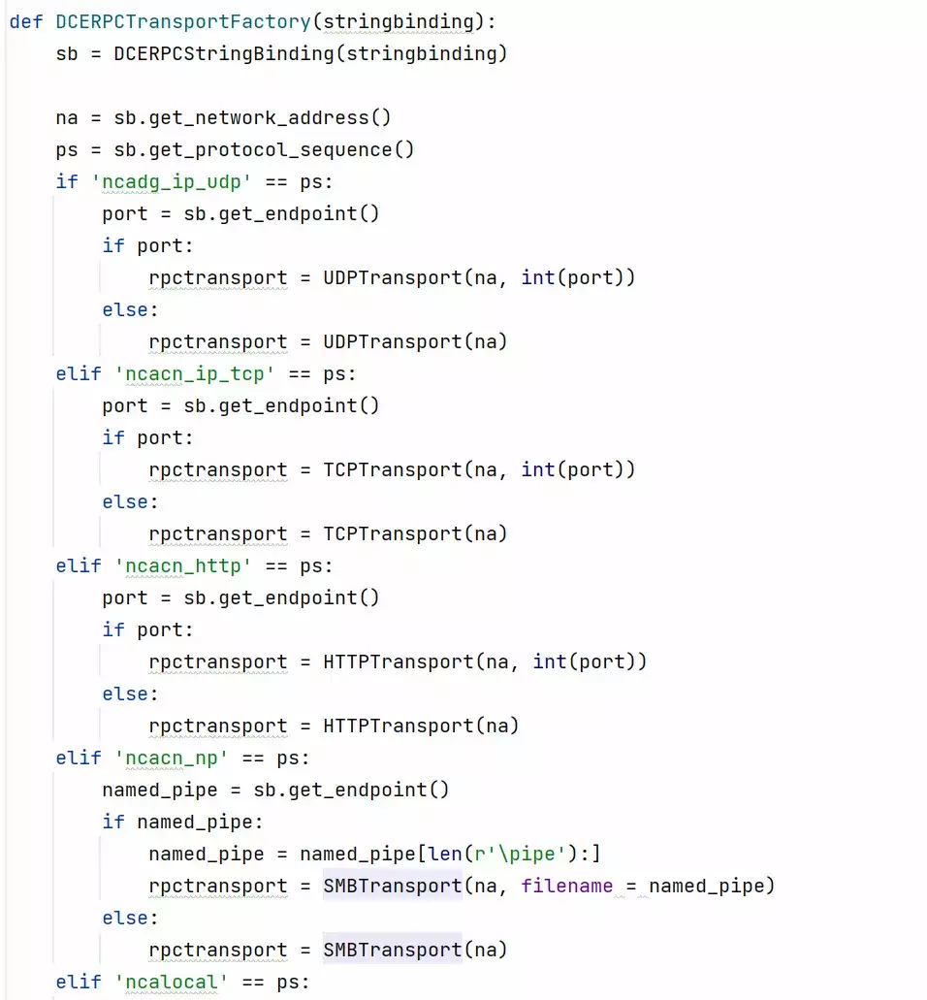

  

    在这个函数中，首先对stringbinding进行解析，这里使用的是DCERPCStringBinding类进行解析，这个类使用了一个正则来匹配stringbinding字符串中的各个部分的信息。

  

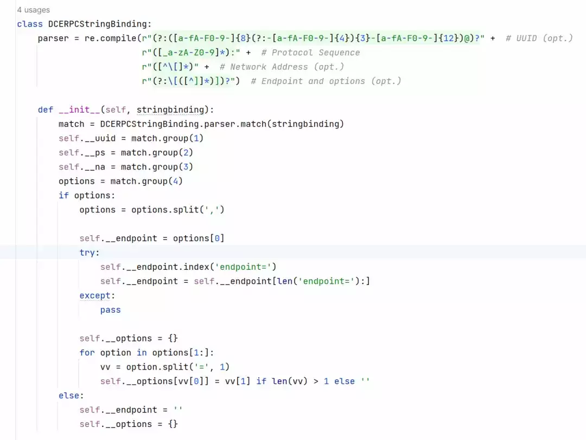

  

    包含协议\_\_ps、网络地址\_\_na、以及两个可选的部分 UUID和options，回到DCERPCTransportFactory中，解析完stringBinding后，通过协议来确定返回的DCERPCTransport类实例。

  

  

**DCERPC数据结构**  

  

  DCERPC协议中定义了一系列的协议数据单元（PDU），这些PDU具有一些固定的数据结构，我们在rpcrt.py中可以找到DCERPC PDU通用结构的定义。

  

  

**01**

**通用PDU结构**

  所有DCERPC PDU都由以下三部分组成

  

1.  PDU Header，包含协议版本、标志位等控制信息，所有DCERPC PDU都包含这个部分
    
2.  PDU body，包含RPC传输的数据内容，例如在REQUEST和RESPONSE中，body分别代表RPC调用的输入和输出。
    
3.  Auth Info，包含了用于认证的数据结构，其具体内容取决于使用的认证协议。
    

  

  impacket中使用MSRPCHeader类来表示 通用的PDU Header，我们可以看到这个类也是继承了Structure类

  

  

RPC Header中包含了8个字段，具体的头部字段和其含义如下

  

-   Version (ver\_major, ver\_minor)：指定使用的RPC协议的主版本号和次版本号,  目前版本为5.0。  
    
-   type：指示消息的类型，如Request（请求）、Response（响应）、Bind（绑定）、Fault（错误）等。
    
-   flags：包含一组标志位，用于指示消息的各种特性和选项。例如，标志位可以指示消息的重要性、同步或异步调用、身份验证要求等。
    
-   representation：指定数据的表示方式，用于解析和序列化数据。它包括数据编码方式（如大端字节序或小端字节序）和数据类型（如整数、浮点数的表示方法）。
    
-   frag\_len(Total Length, Offset)：如果消息被分片传输，这些字段用于指示分片的总长度和当前分片的偏移量。
    
-   auth\_len：指示身份验证数据的长度。
    
-   call\_id：用于标识特定的RPC调用。在请求和响应之间进行匹配，以确保正确的请求和响应之间的关联。
    

  

**02**

**PDU类型**

  DCERPC中有不同的消息类型也就是PDU类型，这些类型的定义都在rpcrt.py文件中

  

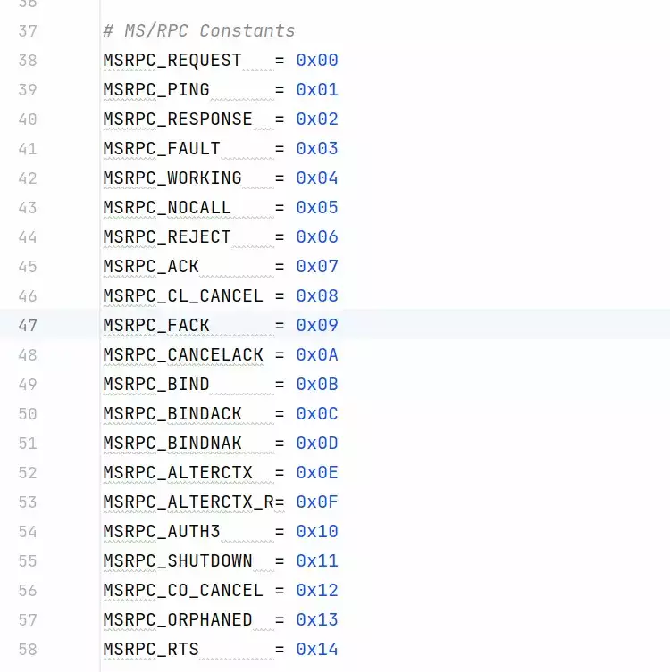

  

  常用的PDU类型有BIND、BIND\_ACK、REQUEST、RESPONSE等，常见的PDU类型及其作用如下：

  

-   Request PDU（请求PDU）：客户端使用请求PDU向服务器发送远程过程调用请求。它包含有关要调用的远程过程、参数和其他相关信息。请求PDU触发服务器执行相应的远程过程，并返回执行结果。  
    
-   Response PDU（响应PDU）：服务器使用响应PDU向客户端发送远程过程调用的执行结果。它包含有关执行结果、返回值和其他相关信息。响应PDU将执行结果传递给客户端，以便客户端继续处理。  
    
-   Fault PDU（错误PDU）：如果在远程过程调用期间发生错误或异常，服务器可以使用错误PDU向客户端发送错误信息。错误PDU包含有关错误类型、错误代码和错误描述的信息。客户端可以根据错误PDU中的信息采取适当的错误处理措施。  
    
-   Bind PDU（绑定PDU）：在RPC中，客户端和服务器之间需要建立连接和协商通信参数。绑定PDU用于在客户端和服务器之间交换连接和协商信息，以确保双方能够正确地通信。  
    
-   Bind Ack PDU（绑定确认PDU）：绑定确认PDU是服务器对绑定PDU的响应。它确认绑定请求并指示连接和协商参数的成功建立。  
    
-   Bind Nack PDU（绑定拒绝PDU）：绑定拒绝PDU是服务器对绑定PDU的拒绝响应。它指示连接和协商参数的失败或拒绝。
    

  

**03**

**BIND**

  BIND操作用于建立客户端和服务器之间的连接，并协商通信参数，以进行后续的远程过程调用，具体的作用有以下几个部分：

  连接建立：使客户端和服务端建立一个逻辑上的连。

  身份验证：在BIND消息中可以携带身份认证数据，用于客户端的身份验证。

  错误处理：在BIND阶段，如果服务端拒绝接口绑定，会返回BIND\_NAK类型的PDU，在这种类型的PDU中包含服务端返回的一些错误信息。

  

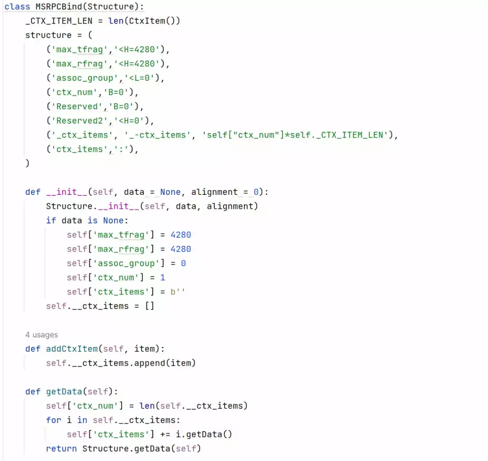

  

  impacket中BIND PDU的实现如上图所示，注意这里的MSRPCBind其实只是除了Header部分的字段，其中最重要的是ctx\_items字段，该字段中可以携带客户端希望绑定的服务接口信息。另外在这里的BIND PDU中max\_tfrag和max\_rfrag默认都是4280，在新版本的Windows中默认的值并不是4280，大家可以通过抓包观察一下。

  

**04**

**REQUEST**

  

  

  

  

    REQUEST PDU用于向服务端发起函数调用，下面是impacket中REQUEST PDU Header部分的定义。

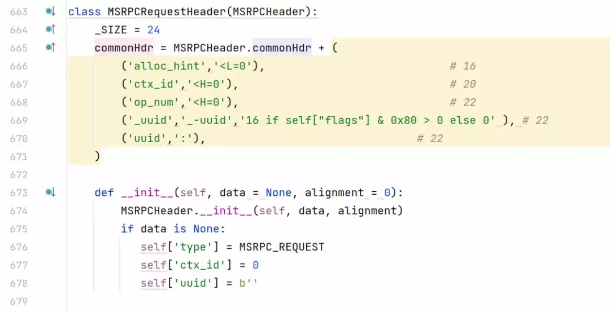

    REQUEST PDU头部比通用PDU头部多出来4个字段, alloc\_hint、ctx\_id、op\_num、uuid,alloc\_hint用于向服务器指示需要分配的内存大小，ctx\_id用于维护上下文状态，op\_num表示具体的RPC函数，uuid是一个可选字段，表示一个对象句柄，当uuid存在时，需要将PDU的flag字段最高位置为1。

  

**RPC运行时**

  

    整个rpcrt.py中最为核心的rpc执行逻辑的部分位于DCERPC\_V5中，我们来看一下这个类的结构，在rpc数据传输部分我们知道这个类的初始化是在Transport的get\_dce\_rpc中，来看一下类的初始化方法。

  

  

调用的是父类的初始化方法

  

  

父类初始化方法中对一些成员变量进行了初始化，并且将传入的transport传到自己的私有变量中。

再来看一下这个类中一些重要的方法。

  

  

首先是connect和disconnect，这两个方法都是继承于父类DCERPC，实际上是调用transport的connect和disconnect方法，作用是建立数据连接。

  

其次是bind方法，bind也是DCERPC运行时中的一个重要方法，在DCERPC协议中BIND的作用就是与对应的RPC服务创建一个逻辑上的绑定，创建绑定之后再进行对应的RPC函数调用

  

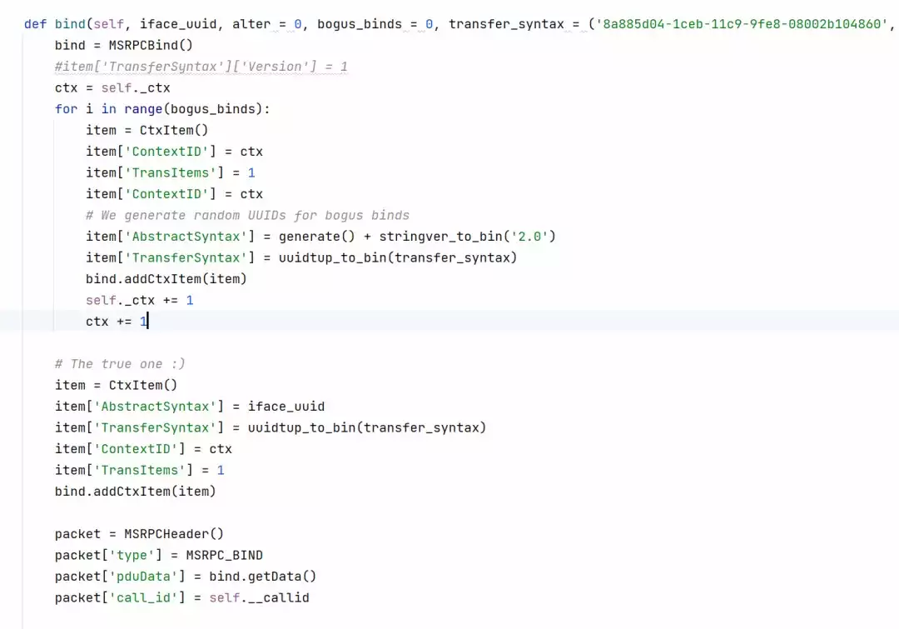

  

我们可以发现函数的参数中包含iface\_uuid、alter、bogus\_binds、transfer\_syntax五个参数，其中iface\_uuid是一个必要参数，其表示希望绑定的服务接口的uuid。

  

  

1077-1090行、根据初始化时选择的认证类型来生成对应的sessonKey和response，例如RPC\_C\_AUTHN\_WINNT代表使用ntlm认证协议、RPC\_C\_AUTHN\_NETLOGON代表NETLOGON认证协议、RPC\_C\_AUTHN\_GSS\_NEGOTIATE则是代表Kerberos协议。

  

  

1120-1123行，初始化了一个SEC\_TRAILER结构体，也就是PDU中的AUTH INFO部分，注意这里的auth\_ctx\_id是从79231这个数字起步。

  

request方法，这个方法是用于发送和接收MSRPC Request PDU，在这里有一个很巧妙的设计，通过获取输入的请求类名去查找对应的响应类名并且在内部进行反序列化，隐藏了网络通信的细节，我们只需要实现Request和Request+Response两个类的结构就可以，不需要单独实现序列化和反序列化逻辑。

  

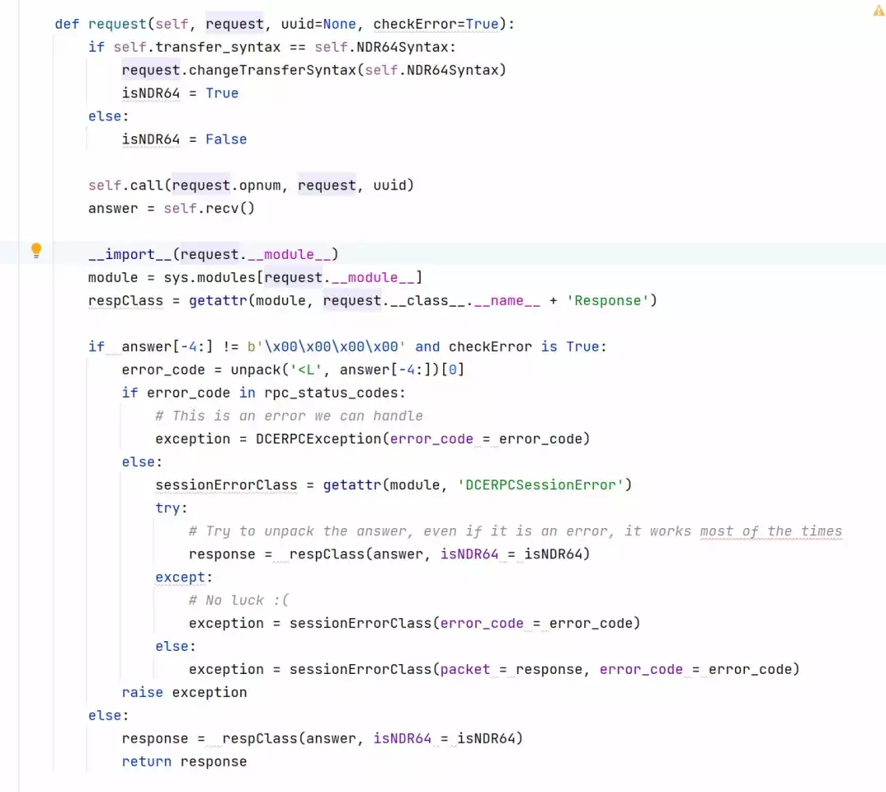

  

本篇对impacket的RPC进行了一个大致的介绍、并且重点介绍了rpc运行时的介绍，在Windows服务中，有大量不同的rpc服务，我们从impacket中的dcerpc文件夹也可以看出来，我们在后续的文章中也会通过具体的工具分析中引用的服务类型来进行对应RPC的介绍。

  

