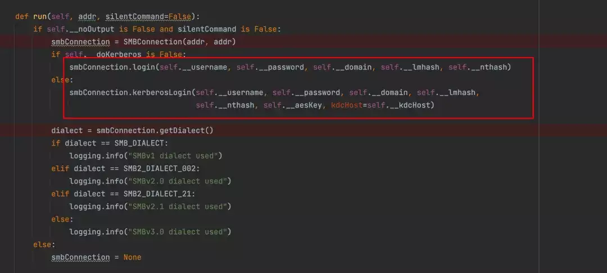
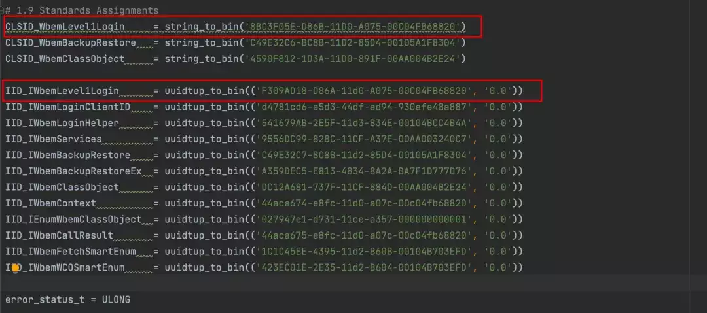
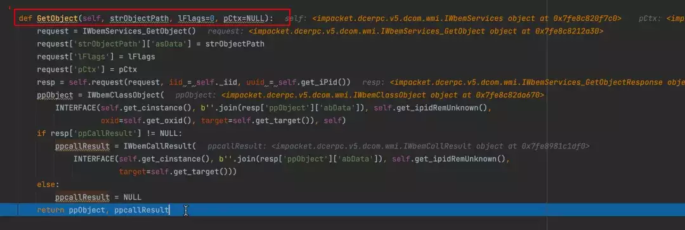
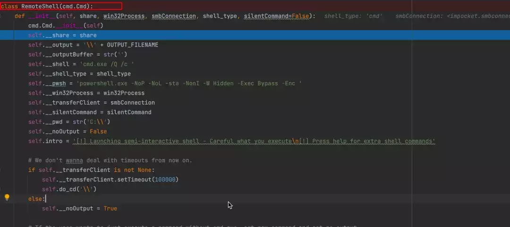
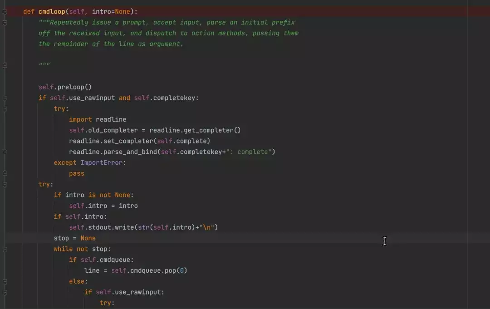
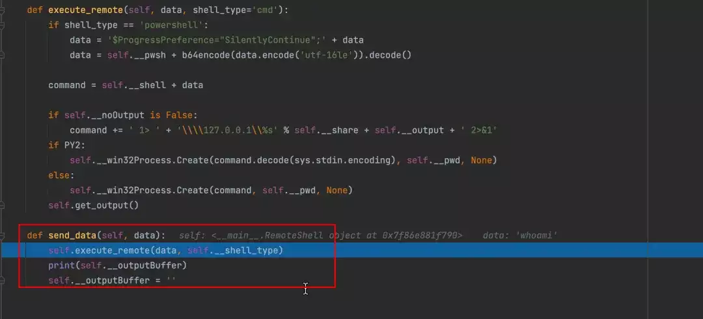
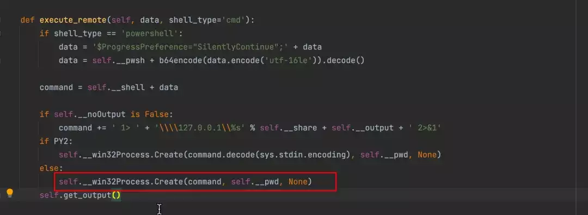
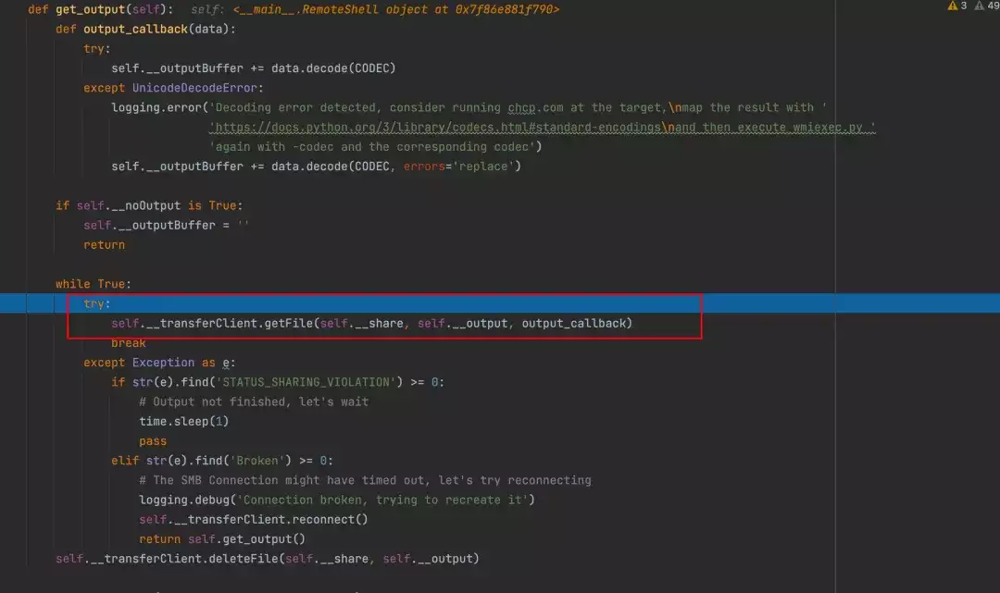

# 内网渗透瑞士军刀-impacket 工具解析（八）

  

**WMI 介绍**  

WMI（Windows Management Instrumentation）Windows 管理工具，是微软提供的一种用于管理和监控 Windows 操作系统的框架，它允许系统管理员，开发人员通过编程的方式来获取有关计算机系统，应用程序和服务的信息，以及执行相关的管理任务。WMI 也支持远程管理，允许在网络上的远程计算机上执行管理任务，查询信息，以及接收事件通知等。

  

下图是 WMI 的结构图，其有三部分内容，WMI Consumers（WMI 使用者），WMI Infrastructure（WMI 基础结构），WMI  providers and managed objects（WMI 提供者和托管对象）。

  


**WMI Consumers（WMI 使用者）**  

位于 WMI 架构的最顶层，是指使用 WMI 服务提供的信息的应用程序，脚本或工具。如果是 C++ 程序则直接通过 COM 技术与下层通信，而一些脚本则需要一些 WMI Scripting API 来与下层通信，而.NET 则将使用 System.Management 命名空间与下层通信。

**WMI Infrastructure（WMI 基础架构）**  

WMI 基础架构有两个核心模块 WMI Core 与 WMI repository （WMI 存储库）。WMI 存储库是通过 WMI Namepace （WMI 命名空间）组织起来的。在系统启动时，WMI 服务会自动创建诸如 root\\default , root\\cimv2 和 root\\subscription 等 WMI 命名空间，同时会预安装一部分 WMI 类的定义信息到这些命名空间中。其他命名空间是在操作系统或者产品调用有关 WMI 提供者 (WMI Provider) 时才被创建出来的，总之，WMI 存储库是用于存储 WMI 静态数据的存储空间。WMI Core 也可以叫做 WMI Service，其服务名叫做 Winmgmt，WMI Service 扮演着 WMI 提供者，管理应用和 WMI 存储库之间的协调者角色，WMI Service 通过一个共享的服务进程 Svchost 来实施工作，当一个管理应用向 WMI 命名空间发起连接的时候，WMI 服务将会启动，当管理应用不调用时，WMI 将会关闭或者进入一个低内存状态。

  

当一个应用通过接口向 WMI 发起请求时，WMI 服务将会判断请求的是静态数据还是动态数据，如果是静态数据则 WMI 将从 WMI 存储库中查找数据并返回，如果是一个动态数据，WMI 服务将请求传递给已经在 WMI 服务中注册的相应的 WMI providers，WMI 提供者将数据返回给 WMI 服务，WMI 服务再将结果返回给请求的应用。

  

**WMI providers and managed objects（WMI 提供者和托管对象）**  

托管对象是通过 WMI 表示的系统资源或配置的实例，例如硬盘驱动器，网络适配器，数据库系统，进程或服务。WMI 提供者是一组用于将托管对象暴露给 WMI 的组件。这些提供者负责实现 WMI 接口，使得 WMI 可以与不同的系统组件、硬件和软件进行交互。

  

前面我们已经说了 WMI 可以进行远程管理。其主要使用 DCOM 或 WinRM 进行远程访问，DCOM 是 WMI 较早的实现先方式，通过使用 DCOM，WMI 可以在网络上远程执行查询，获取信息，执行管理任务等操作。而 WinRM 则提供了一种更现代，更灵活的远程管理协议。

  

**impacket 中实现**  

在 impacket 中也实现了 WMI 的远程命令执行。实现时，先实现构造方法，然后进入到 run 方法中执行我们的主要实现逻辑。

  


  

先建立 SMB 连接，可以是密码，hash，也可以是 kerberos 票据，来建立 SMB 连接。

  



  

建立连接之后，然后建立 DCOM 连接，在前面我们已经说过 WMI 通过 DCOM 或者 WinRm 来进行访问。在 impacket 中使用 DCOM 来进行远程访问，首先使用 CoCreateInstanceEx(wmi.CLSID\_WbemLevel1Login, wmi.IID\_IWbemLevel1Login) 来创建一个 COM 对象实例，其中 CLSID\_WbemLevel1Login 为 WMI 中 IWbemLevel1Login 接口的类标识符（CLSID），IID\_IWbemLevel1Login 代表 IWbemLevel1Login 接口的接口标识符。

  


  



  

可以在注册表中找到 WMI 得 CLSID

  


  

通过 DCOM 拿到 WMI 的接口对象实例之后，接着通过 iWbemLevel1Login = wmi.IWbemLevel1Login(iInterface)  来封装已经创建的 iInterface 接口实例，并将其赋值给 iWbemLevel1Login 变量。在封装的时候 IRemUnknown 是用于处理远程过程调用（RPC）的接口。

  


  

接着我们用拿到的实例进行 WMI 访问权限，impacket 实现了 NTLMLogin() 的认证方式，其中 //./root/cimv2 为 WMI 的命名空间，在 //./root/cimv2 命名空间中存在我们要调用的类 Win32\_Process 的实例，在 powershell 下我们可以使用命令查看 Win32\_process 实例：

  

```plain
Get-WmiObject -Namespace root/cimv2 -Class Win32_Process
```

  


  


  


  

接着就是获取我们的 Win32\_Process 实例，通过方法 GetObject 来进行获取，并返回对象实例，赋值给 win32Process，具体里面的实现细节，我们不必太多关注，我们只要一个对象实例就行，这个对象实例来执行一个 create() 创建进程的操作。

  


  



  

拿到对象实例后，我们就需要进行执行命令，impacket 使用 Remoteshell 来执行命令，其中我们可以选择 cmd 或者 powershell 来执行命令。

  



  

在初始化的时候会先进入到 c:\\\\ ，然后终端通过 cmdloop() 函数一直监听我们输入的命令，然后此时我们进行命令执行 whoami 

  



  

接着调用 send\_data 函数中 execute\_remote 函数来执行命令

  



  

最终执行是由 win32\_process 的 Create 方法来执行命令，其会创建一个新的进程，并且可以指定文件路径，并且将执行的命令存放到共享文件中，其中里面的具体执行漏洞涉及到一些 wmi 底层实现，无需特别关注。

  



  


  

执行完之后，通过 SMB 来进行共享文件的读取，读取完之后删除共享文件，这就用到 SMB 的 445 端口。还有别的师傅写过通过 135 端口来进行文件的读取。

  



  

  

**总结**  

impacket 实现了通过 DCOM 协议来远程进行 WMI 命令执行，并且在 windows 默认日志中是不记录 wmi 执行的命令，不过可以检测到读取共享文件的日志，如果不使用共享读取文件那么常规检测是检测不到，不过从流量层面，在流量中会有 18 ad 09 f3 6a d8 d0 11 a0 75 00 c0 4f b6 88 20 (IWbemLevel1Login ) 关键字，可以通过此来进行检测。

  

  

[](http://mp.weixin.qq.com/s?__biz=MzkxNTEzMTA0Mw==&mid=2247494429&idx=1&sn=9f2bca983297a5fc968547f4663d2ac7&chksm=c16174d1f616fdc77bc935ac63229ac7f49ffd27686736755e989fdcc28764daa9bb548813ec&scene=21#wechat_redirect)

  

[](http://mp.weixin.qq.com/s?__biz=MzkxNTEzMTA0Mw==&mid=2247494508&idx=1&sn=f9e58ae8f443688da2ca34d7c0bccf60&chksm=c16174a0f616fdb63dd79b34dc047b0f4fbaf6a88c02f3789a7ad9df54709096b7a98fd9806b&scene=21#wechat_redirect)

  

[](http://mp.weixin.qq.com/s?__biz=MzkxNTEzMTA0Mw==&mid=2247494536&idx=1&sn=71a81e364162b2dc77247d363730274e&chksm=c1617444f616fd528b64c8bf4c6c675a3da6f3bd92280d709ced88effeb4cf13e3c522c465c8&scene=21#wechat_redirect)