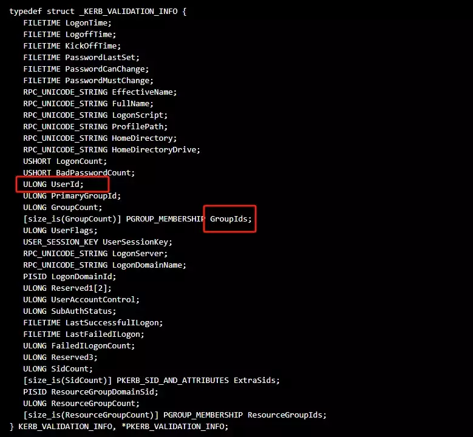
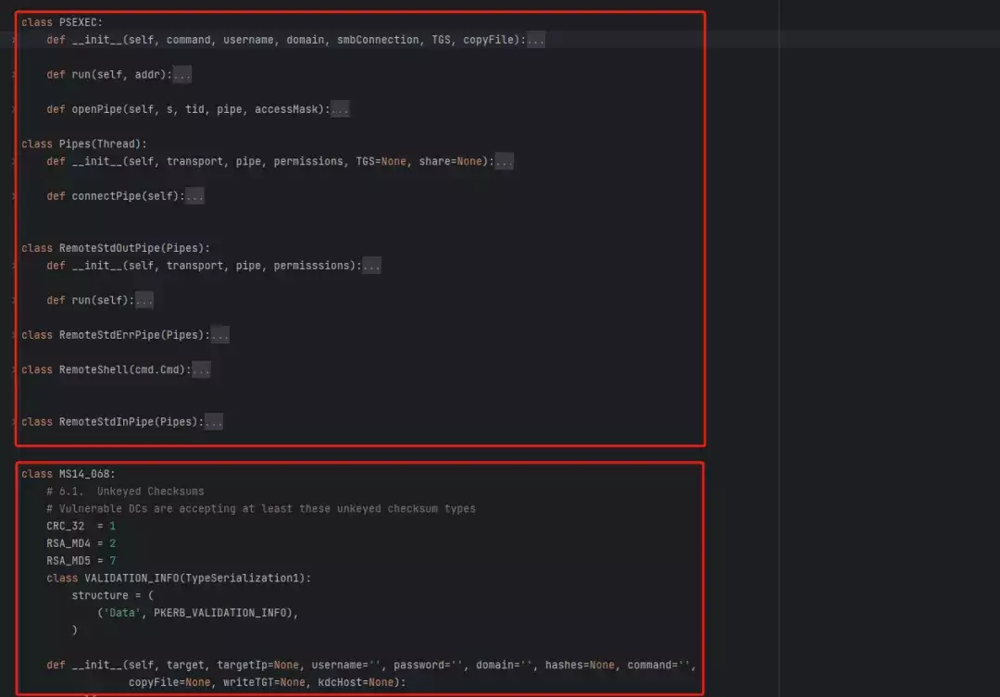
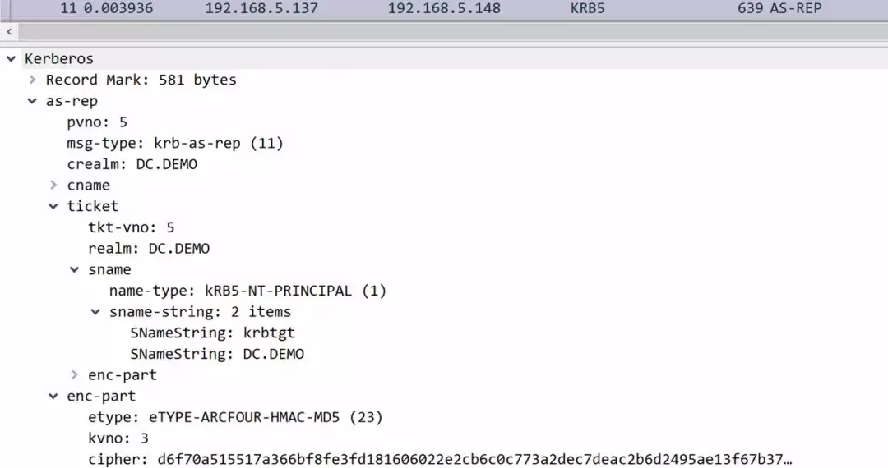
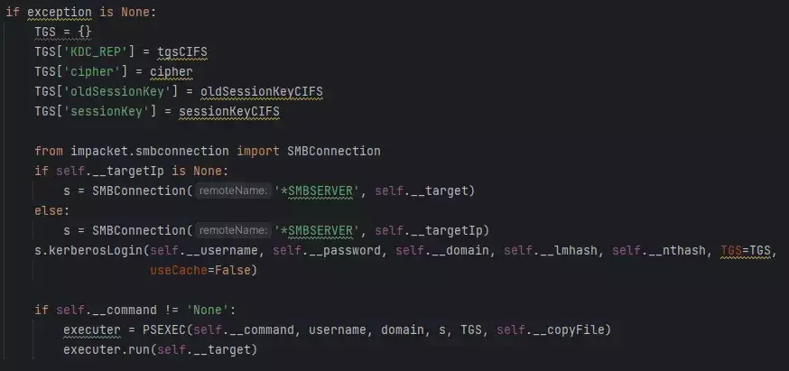

# 内网渗透瑞士军刀-impacket 工具解析（十）

  

**PAC 和 MS14-068**  

 在 kerberos 协议中，域中不同权限的用户能够访问的资源是不同的，因此微软使用 PAC (Privilege Attribute Certificate，特权属性证书) 用于辨别用户身份和权限，其中所包含的是各种授权信息、附加凭据信息、配置文件和策略信息等。例如用户所属的用户组，用户所具有的权限等。

  

       在一个正常的 Kerberos 认证流程中，KDC 返回的 TGT 和 ST 中都是带有 PAC 的。这样在以后对资源的访问中，服务端再接收到客户请求的时候不再需要借助 KDC 的帮助提供完整的授权信息来完成对用户权限的判断，而只需要根据请求中所包含的 PAC 信息直接与本地资源的 ACL 比较即可。PAC 中包含了用户的 SID、用户所在的组等，下图为 PAC 的 KERB\_VALIDATION\_INFO 结构，在下图结构中可以看到有这两个字段，通过对 Userid 和 groupid 的值对用户权限进行区分。

  



  

在进行 kerberos 认证时，用户向 KDC 发起 AS\_REQ，请求凭据是用户 hash 加密的时间戳，KDC 使用用户 hash 进行解密，如果结果正确返回用 krbtgt hash 加密的 TGT 票据，TGT 里面包含 PAC，而 PAC 尾部会有两个数字签名，分别由 KDC 密码和 server 密码加密，防止数字签名内容被篡改。

  


  

在 MS14068 中，KDC 没有正确检查 PAC 中的有效签名，签名原本的设计是要用到 HMAC 系列的 checksum 算法，需要用到 server 端密码和 KDC 的密码进行签名，攻击者并没有 krbtgt 的 hash 以及服务的 hash，所以正常情况下无法伪造 PAC，但是微软在实现上却允许任意签名算法，所以客户端可以指定任意签名算法，KDC 就会使用客户端指定的算法进行签名验证。例如只需要把 PAC 进行 md5，就生成新的校验和。这也就意味着可以随意更改 PAC 的内容，完了之后再用 md5 生成一个服务检验和以及 KDC 校验和。在 MS14-068 修补程序之后，Microsoft 添加了一个附加的验证步骤，以确保校验和类型为 KRB\_CHECKSUM\_HMAC\_MD5。

  

GroupId 是用户所在的组，在伪造 PAC 的实话将高权限组 (比如域管组) 的 sid 加进 GroupId，当包含伪造 PAC 的 TGS 被服务向 KDC 询问此用户是否有访问服务权限的时候，KDC 解密 PAC 并提取里面用户的 SID 以及所在的组 (GroupId)，因为我们将域管组的 GroupId 添加进去了，所以 KDC 把这个用户当做域管组里面的成员。从而达到提升为域管的效果。

  

**工具分析**

**Pykek**  

对于 MS14-068 漏洞最经典的攻击脚本是 Pykek 工具，此工具代码和功能较为简单，仅实现将伪造的 PAC 注入到 TGT 中，利用者还需要使用其他工具将伪造的 TGT 导入用户会话并连接到域控制器的 admin$ 共享，实现权限提升。

  

在使用 pykek 工具之前，进行攻击前需知道用户名、密码、SID、域控主机地址来伪造 TGT，其中可以通过 whoami /user 和 wmic 命令获取 sid。

  

```plain
Whoami /user
```

```plain
Wmic useraccount get name,sid
```

  

在 pykek 的文件夹下生成了 ccache 票据，需借助 mimikatz 将票据写入内存中，创建缓存证书。之后系统会从使用此 TGT 发送给 KDC 申请 ServiceTicket。

  


**goldenpac**

而 impacket 工具包中的 goldenpac.py 脚本是针对 MS14-068 漏洞进行了更加方便的实现，其添加了请求 TGS 和 PSEXEC 相关代码，在 PAC 伪造成功后直接请求 TGS 票据，并开启一个交互式 shell。同时相对于 Pykek，goldenpac 还添加了 getUserSID 函数，省略了输入 SID 的流程。

  


  

从代码上来看，goldenpac 脚本主要分为两个部分，即 ms14-068 exp 实现和 psexec 实现。

  

其中 PSEXEC 部分我们已经在之前的文章中进行了详细的分析，这里不再赘述，直接看 MS14-068 的功能实现部分。

  



  

**AS-REQ**  

GoldenPac 代码中实现了 kerberos 认证的全部过程，在构建 AS-REQ 请求中，调用了 getKerberosTGT 函数来请求 TGT，通过普通域用户的用户名和 HASH 加密时间戳，完成 AS\_REQ 请求的构建并发送，通过身份认证过程。在源码中可以明显看到把 requestPAC 设置为 False，这代表了要将 include\_pac 的值设置为 false，这样在向 KDC 申请的 TGT 票据就不会带有 PAC。

  


  

如果指定为 True，由于不知道 krbtgt 的 Hash，所以客户端无法解密提取 PAC 进行篡改。

  


  

通过分析 AS-REQ 数据包也可以看到 include-pac:False  字段。

  


  

**AS-REP**  

KDC 收到 AS\_REQ 请求之后并做出 AS-REP 响应，在返回的内容中包含请求用户 hash 加密的 session\_key 和 TGT 票据，TGT 不包含 PAC 部分，即 cipher 字段。

  



  

在 TGT 中提取 ticket 部分，ticket 被 KDC 进行加密，作为域内普通用户是无法解密的。

  


  

在以下代码中，通过用户密码 hash 作为解密 key，并使用 key 去解密密文返回的请求，解密后获取时间戳和 session\_key 等信息，用于之后 TGS 通信中。

  


  

**TGS-REQ**  

在处理完 TGT 之后，在 TGS-REQ 阶段中通过伪造 PAC 进行权限提升，Goldenpac 使用了 getGoldenPAC 函数和 getKerberosTGS 函数来构造 PAC 和请求 TGS。

  


  


  

首先要解决的就是伪造校验和问题，前面说到在攻击实现的时候允许所有的 checksum 算法包括 MD5，所以这里构造 PAC 中的两个尾部签名，即服务器检验 serverChecksum 和私有服务器检验 privSvrChecksum，在如下 PAC 构造代码中可以发现，签名类型 SignatureType 被设置为 RSA\_MD5，签名 Signature 在初始化后进行了组合操作。

  


  

在前面我们看到，在构建 PAC 时，GoldenPac 无需输入 user SID，这是为 GoldenPac 通过调用 getusersid 函数，通过 MS-SAMR 协议获取指定用户名的 SID，MS-SAMR 用于管理 Windows 用户和组的安全标识符等信息。

  

首先，构造了一个 RPC 绑定字符串 stringBinding，使用 ncacn\_np 协议（Named Pipe）连接到指定主机的 SAMR 管道。然后，创建了一个 RPC 传输对象，并通过 set\_credentials 方法设置身份验证所需的凭据（用户名、密码、域名、LM 哈希、NT 哈希）。之后便通过 RPC 服务连接到 SAMR 服务器，查找指定用户名的 SID。

  


  

在 sid 中，最后的数字则代表了不同权限的用户组。其中 513、512、520、518、519 分别为不同的组的 sid 号，通过这种方式构造了包含高权限组 SID 的 PAC。

  


  

```plain
域用户（513）
域管理员（512）
架构管理员（518）
企业管理员（519）
组策略创建者所有者（520）
```

  

构造了高权限的 pac，同时可以通过检验和校验，但是 PAC 时包含在 TGT 中，没有 krbtgt hash 无法将伪造的 pac 传输给 KDC。这里代码中将 PAC 放在 enc-authorization-data 里面，enc-authorization-data 的结构如下：

  

```plain
 AuthorizationData::= SEQUENCE OF SEQUENCE {
    ad-type[0] Int32,
    ad-data[1] OCTET STRING
 }
```

代码中可以看到，将 'enc-authorization-data' 设置为 noValue。接着，设置了加密类型 ( etype ) 和相应的加密数据 ( cipher )，而 encryptedEncodedIfRelevant 中则是已经加密并编码的 PAC，通过这种方式将 PAC 传输给 KDC。

  


  

**TGS\_REP**  

当 KDC 对 krbtgt 服务的 TGS-REQ 后。对攻击者伪造的 PAC 进行权限验证，通过之后返回高权限的、使用 MD5 校验的 TGS，因为服务为 krbtgt，因此可以作为一个新的 TGT 使用去请求任何服务，在下面的代码中可以看到，获得 krbtgt 服务的 TGS 后再次调用了 getKerberosTGS 函数来获取 CIFS 服务的 TGS 票据，

  


  

在下面的代码中，通过 SMBConnection 对象创建一个 SMB 连接，并使用 Kerberos 票据进行身份验证，同时使用 PSEXEC 代码执行命令或创建一个交互式 shell，极大的简化了攻击流程。

  



  

**检测防御**  

关于利用 GoldenPac 进行权限提升，由于利用了典型的 MS14-068 漏洞，微软也对漏洞发布了对应的补丁，如果要防御攻击可参考以下几点：

1.安装 KB3011780 补丁

2.监测 include-pac 字段为 False 的特征，如果出现了 False 则可能出现了异常

  

  

[](http://mp.weixin.qq.com/s?__biz=MzkxNTEzMTA0Mw==&mid=2247494536&idx=1&sn=71a81e364162b2dc77247d363730274e&chksm=c1617444f616fd528b64c8bf4c6c675a3da6f3bd92280d709ced88effeb4cf13e3c522c465c8&scene=21#wechat_redirect)

  

[](http://mp.weixin.qq.com/s?__biz=MzkxNTEzMTA0Mw==&mid=2247494737&idx=1&sn=c95529f2518ed06ddbbd2b59ec90b9f7&chksm=c161739df616fa8b7b6983113819e54c93b2da7ce246ec63dcfdbdd6aea6df485e849336e460&scene=21#wechat_redirect)

  

[](http://mp.weixin.qq.com/s?__biz=MzkxNTEzMTA0Mw==&mid=2247494969&idx=1&sn=213bbb5d3f100d9d8cda153823cdb7a8&chksm=c16172f5f616fbe31b939b525963be95606e9865b99f00298e0334ebf216822e9e6bf3c815a1&scene=21#wechat_redirect)