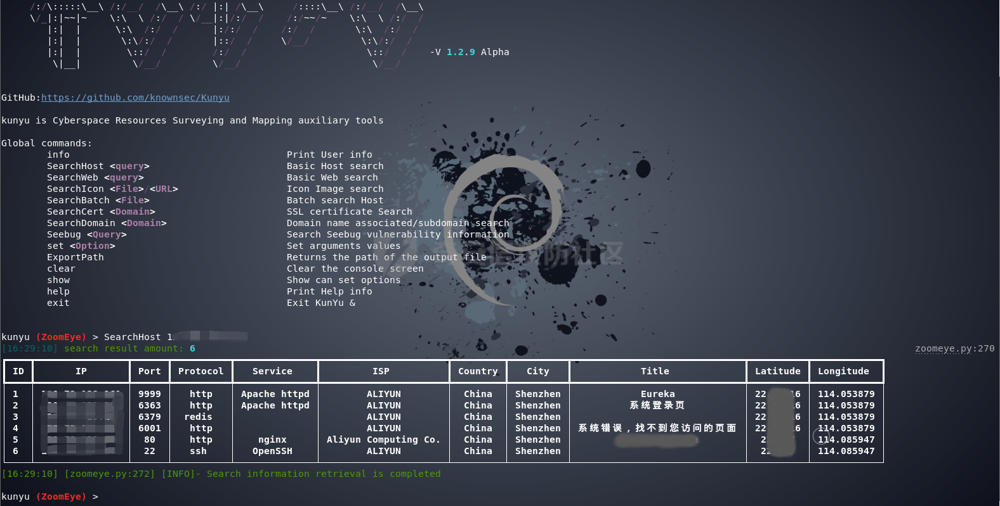
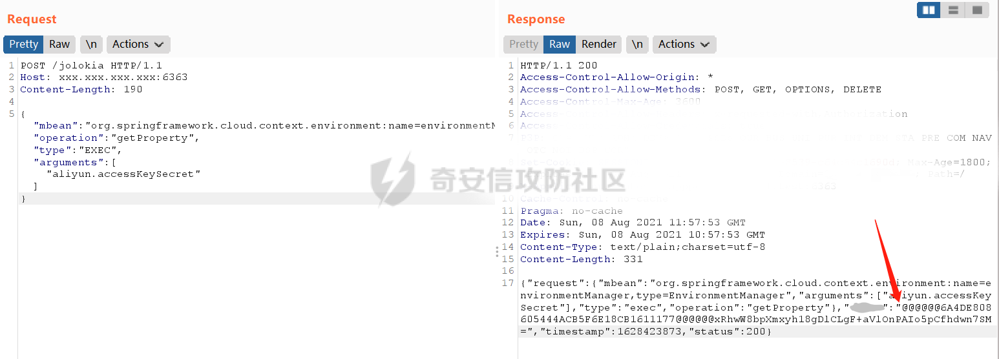
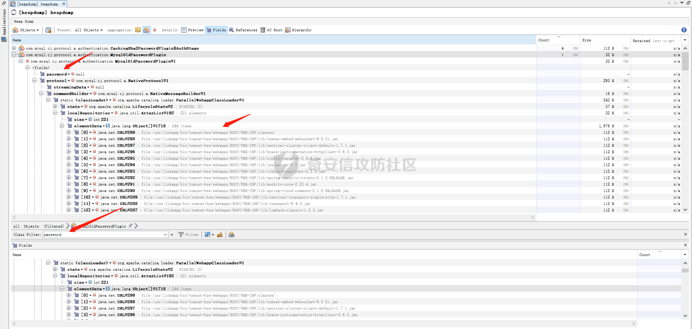
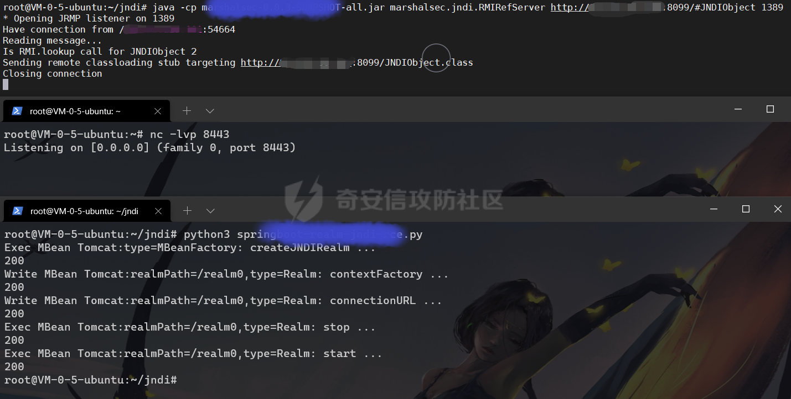
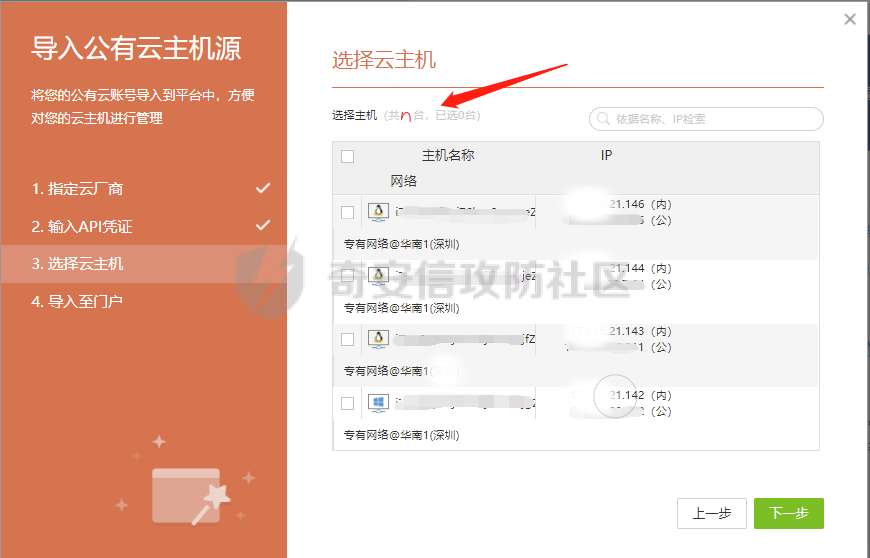

# 奇安信攻防社区-红队实战攻防技术（一）

### 红队实战攻防技术（一）

大家好，我是风起，最近一直在做安全研究及Kunyu的开发维护，已经好久没有写红队攻防相关的文章了，那么近期将带来 “红队实战攻防技术” 系列的文章。

# 前言

大家好，我是风起，最近一直在做安全研究及Kunyu的开发维护，已经好久没有写红队攻防相关的文章了，那么近期将带来 “红队实战攻防技术” 系列的文章。

当前行业内组织的 “红蓝对抗演习” 在检验企业安全的同时也在磨练技术人员的技术水平，在近几年的演习中可以发现攻防双方的水准都有了极大的提升，本文将以红队的视角去阐述技术思想。与常规的渗透测试相比，红队攻防更多的是渗透思想上的差异，而我个人的理解认为 “隐蔽”、“持久化”是最重要的思想，如何做到快速、高效的拿下目标，隐蔽、持久的进一步操作，也正是核心的差异所在。熟悉我的读者，一定看过之前 “红队攻防基础建设” 相关的文章，本文也会串联之前知识点灵活的运用到实战场景下。

作为本系列的第一篇文章，将以一次公司红蓝对抗实战演练平台的渗透，引出一系列的知识点及渗透时的一些小Tips，希望能够对您有所帮助。

**本文仅做安全研究作用，切勿违法乱纪**。

# 快速打点

拿到一个目标，我们首先要做的就是快速的对目标进行信息收集。对相关的功能点进行测试、熟悉网站的业务流程，这是非常重要的一个环节。应对不同的渗透场景，可以将这个环节仔细或简略去做。

**这里建议在打点的时候下挂代理，选择SSR的负载均衡模式，防止被封禁IP、IP定位到真实位置，尤其是企业专线，例如埃文科技、IPIP对于企业专线的定位非常准确。**

使用Kunyu快速对该站点进行信息收集，可能大家会想空间测绘去做信息收集是否会有一定的不准确性？是的，对于一些新增的资产可能未必会及时更新上去。但是通常对于一些成熟的业务站点，并不会去频繁的对站点进行变动端口服务等操作，所以在快速打点时这样的方式无疑大大提高了效率，同时也避免了主动扫描可能造成的影响。

如上图，通过 Title 不难判断出不同端口相关的业务，首先来看第一个。

Eureka 是 Netflix 开源的一款提供服务注册和发现的产品，可以与*Spring*boot构建的微服务很容易的整合起来。这里我们发现该服务直接暴露在公网中可未授权访问，于是我们快速对其进行信息收集分析。

但是很遗憾，这些实例所指向的是内网地址且端口不对外开放，但是我们得到了本服务器的内网IP，并且得知是一台Aliyun IDC服务器。**这里读者们可以留意一下，我们下面会再次迂回到这里。**

继续看一下6363端口的服务，推荐大家使用Wappalyzer对站点框架信息快速收集，下图中可以直接通过 Wappalyzer 得知目标环境，当然上面 “小绿叶” 的 ICO 图标也可以看出是SpringBoot的框架。

对于SpringBoot框架的站点，我们可以快速FUZZ下未授权端点。

这里有一个Tips，Spring Boot Actuator 1.x版本默认路由的起始路径为/，2.x版本则统一以/actuator为其实路径。通过上图不难看出目标站点是Spring Boot Actuator 1.x版本。这里造成信息泄露的原因是相关人员没有更改配置文件，忘记切换环境配置。

这里我们重点关注env、jolokia、heapdump、trace四个端点即可。

**env 获取全部环境属性**  
**jolokia 获取全部环境属性**  
\*\*heapdump 返回一个GZip压缩的hprof堆转储文件\*  
trace 提供基本的 HTTP 请求跟踪信息\*\*

当我们访问未授权的/env端点的时候，Spring Actuator将会返回一些配置信息，其中不乏一些用户凭证，但是会将一些含关键字(如 password、secret)的属性用 \* 替换以达到脱敏的效果，如下图。同时也会有一些未进行脱敏的属性，像本次的目标比较有趣的是它使用了二层加密，致使我们得到这些属性信息也无法进行直接利用。这个加密以 @ 分隔前面一段像是hash，后面像是base64加密，有熟悉的同学可以留言交流一下。

前面FUZZ我们得知目标开放了/jolokia端点，我们可以据此进行读取脱敏数据或GETSHELL获取权限。

通过调用 org.springframework.cloud.context.environment.EnvironmentManager 类实例的 getProperty 方法获取脱敏后的数据，得到的属性值在返回JSON的value中。如上所说，也是二层加密后的数据。

可能小伙伴会问，如果恰好没有开放/jolokia这个端点呢？确实在很多情况下，并不一定都会开放这个端点。所以此时可以关注一下/heapdump，通过下载本端点的文件可获取到服务器相关堆信息，通过对该文件进行审计也可能获取到经过脱敏处理的数据，可以使用MemoryAnalyzer或者VisualVM打开该文件，这里经过测试发现我们想获取到的属性值都经过了二层加密，所以就不进行审计了，下面贴一张图。

根据关键字匹配找相关的值就行，考验眼功的时候到了。

最后是/trace端点，可以获取到一些 http 请求包访问跟踪信息，有可能在其中发现内网应用系统的一些请求信息详情；以及有效用户或管理员的 cookie、jwt token 等信息。

主要的作用还是帮助我们得到一些用户的登录cookie信息，从而登录到后台。但是值得注意的是，并不是其中记录的所有Cookie都可以使用并登录，因为有一些未经过鉴权之前的请求也会记录在里头，这时我们可以通过判断请求的资源来确认哪些是登陆后进行的。当然如果距离该请求的时间过久，Cookie失效了同样也不行。

# 漏洞利用

那么上面说到通过/jolokia端点可以进行RCE，现在我们转变战略，先拿SHELL再进行审计。

这里我们利用的是jolokia Realm JNDI RCE漏洞，基础理论知识这里不再赘述，感兴趣的同学可以看下面的文章，很详细的把Spring Boot的各类安全问题都进行了梳理，但是我们这里的利用会有点不同寻常。

[https://github.com/LandGrey/SpringBootVulExploit](https://github.com/LandGrey/SpringBootVulExploit)

利用条件：

-   目标网站存在 `/jolokia` 或 `/actuator/jolokia` 接口
-   目标使用了 `jolokia-core` 依赖（版本要求暂未知）并且环境中存在相关 MBean
-   目标可以请求攻击者的服务器（请求可出外网）
-   普通 JNDI 注入受目标 JDK 版本影响，jdk < 6u141/7u131/8u121(RMI)，但相关环境可绕过

这里如何判断什么时候用哪一种利用方式其实很简单，访问 `/jolokia/list` 接口，查看是否存在 `type=MBeanFactory` 和 `createJNDIRealm` 关键词。其他的利用方式也是同理，去查看相匹配的关键字，如果有那么基本就是可用的。

首先我们跟着上面链接所指出的利用方式走一遍，但是出现了一个很有意思的问题：**marshalsec 接收到了目标请求，并且请求到了 JNDIObject.class，但是没有正常反弹回来shell，如下图**：

根据经验，我首先意识到这种情况下只能是目标主机执行了命令请求到了架设的RMI服务，但是命令执行了却未成功。那么调转枪头，在Github上找另一份可以执行指定命令的EXP，进行高版本JDK的JNDI注入。

通过which python命令发现目标主机有python2环境，可以提升至完全交互式Shell，防止意外掉线，当然这里一定要注意，像这一类的反弹shell我们一定要用反向代理之类的手段隐匿真实VPS IP，并对Netcat进行流量加密，隐匿效果如下：

可以看到显示的仅是我们的代理地址，并且网络连接为代理服务器的IP及端口，与实际本地监听端口不同，而流量加密可以帮助我们执行的命令不会被态感设备捕获到，这也是红队攻防基础建设的一环，非常重要。

目标JAVA版本为1.8.0\_241，是高于上面所述的普通JNDI注入要求的利用条件，这也解释了我们刚开始利用失败的原因。

这里发现目标主机开放了大量的Web服务以及redis数据库服务，并且都是以jar包的形式启动Web服务的，这也就是说，除非我们把jar包下载回来进行反编译修改添加WebShell并替换重启原有的Web服务才可以添加WebShell，通常来讲为了不破坏原有业务正常运转，我们是不能进行这种操作的。

很遗憾redis服务并没有未授权漏洞，所以我们继续对jar包下载回来进行反编译，对源码进行审计，看一下有没有一些用户凭证或者服务配置信息等。

这里配置的IP均为内网地址，这也对应了我们最开始获取到的内网IP为当前主机。其中包含了不少内网其他主机的登录凭证接口管理平台、消息推送平台等服务的Toekn，这里发现redis的密码为**XXRedis639020XX** 这时，机智的风起哥立马发现了他的命名规则是根据redis的端口来设置的，其中前后缀不变，仅改变中间的端口号，这里我们直接拿下了当前服务器多个redis数据库。

继续审计，发现了Aliyun的AK/SK。

至此控制目标多台云服务器，并且发现均为同一内网下，这时根据之前获得的其他凭证即可进一步横向移动，不乏例如：mongodb、Mysql等搭建在其他服务器的数据库服务凭证。

这时在当前目标上起一个反向代理，因为实际测试过程中发现，目标SSH服务并不能通过外网直接连接，所以利用这样的方式进行连接，当然也有一个好处，就是目标上记录日志的登录IP为内网本地的，也达到了一些隐匿的效果。

当然，查看日志也发现了， 另一个登录的IP为企业专线，这也解释了，目标服务器的登录应该是做了安全组限制了登录SSH服务的网段仅能从其企业内网连接。

**至此，演示结束。**

# 权限维持

这里因为不准备进一步横向，所以仅以本地环境讲解思路。对于Linux的主机我们在外部打点之后，首先需要做的就是权限维持，其实红队演练与APT相似的是核心同样在于 “持久化” ，我通常习惯留私钥登录以及创建高权限用户，一般创建的用户名以服务命名非常迷惑，但是通过这么不寻常的权限也一定能看出来端倪。这时不要为了方便而这么做，非常容易暴露，这时可以做一些sudo提权或者SUID文件等操作间接的使用root权限，如下图(反面例子)：

当然，红队攻防不仅仅是一个人战斗，所以在拿到shell后可以上线到自己C2上，Linux上线CobaltStrike的方式可以使用CrossC2插件进行，这里仅作安全研究，所以不做此操作。而使用nohup的方式留以持续性的代理的方式也比较容易被发现，所以建议使用frp进行代理，也因为它的可拓展性非常高，通过免杀或修改配置文件等方式可以进行躲避流量监测。

需要注意的是，一定要对痕迹进行清理。在蓝队处置的过程中，重点关注的对象就是一些登录、服务日志、进程、端口，新建文件，这也是雷区所在，一定要在这些方面下功夫。尤其是历史命令，不清理被还原出攻击路径的概率非常大，这也会被一步步揪出来。如果能够顺利通过处置人员的排查，那么恭喜你可以安心继续了，因为在非必要或确认失陷的情况，没有甲方愿意去隔离当前业务，尤其是对外服务、内部OA、工控系统等，停止业务系统都可能造成不可估量的损失。当然要是一些不重要的业务，也可能直接就给关掉了，虽然不符合规定。

在进入内网环境下，每一步操作都需要非常的慎重，尤其是涉及端口、进程的操作。因为稍有不慎，被捕获到异常操作，会引起防守方极大的重视。尤其是多次异常告警的情况下，通常在第一次告警的情况下，蓝队成员未排查出异常操作后会对该主机进行重点关注，如果继续出现告警，那么极有可能直接进行单机隔离。那么此时在权限掉线又没有办法清理痕迹的情况下，不要慌张，去泡杯花茶，这样凉凉后会比较香。

对于一些新晋红队的同学，风起哥建议首先做好基础建设，比如免杀、隐匿、工具特征改造、匿名VPS、邮箱、手机号、身份信息等，最好在纯净的虚拟机中进行渗透操作（别搁虚拟机里看什么腾讯视频）。如果被蜜罐抓到ID，那么基本上被溯源出来的概率就很高了，你可能还在愉快的渗透着，突然告诉你出局了。别惊讶，多看看群，是不是有蓝队兄弟问到你的ID了哈哈哈（除非你叫什么张三、李四、王二麻子这种迷惑的ID）。

**就先讲到这里，上面一段全是文字了，想必在读的同学也懒得看了，这里系列后面的文章再讲**

# 后记

感谢各位读者的支持，在前一阵发布了Kunyu(坤舆)，也是文章开始时使用的信息收集工具，感兴趣的小伙伴可以自行下载使用，是一款非常不错的被动信息收集工具，风起强烈推荐哦~

本篇文章，从红队的视角剖析了渗透的思路，对一些需要注意的细节进行了着重讲解。渗透的过程不是关键，重要的是其中的思路，所以本文有一些利用细节都给省略了，仅以辅助去讲解，我认为这种结合实际的讲解是非常必要的，如果仅仅只去讲思路，谁会去听？嘿嘿，除非特别棒，要不我是不看的。我觉得自己是一个比较实在的人，有一说一的那种，所以也很喜欢去做一些分享，或许也是希望更多的同学能够去做我想做的，间接的弥补我的遗憾吧。

最后，祝各位心想事成，美梦成真！

# 参考链接

[https://github.com/knownsec/Kunyu/](https://github.com/knownsec/Kunyu/)  
[https://blog.csdn.net/weixin\_40418457/article/details/116424252](https://blog.csdn.net/weixin_40418457/article/details/116424252)  
[https://github.com/LandGrey/SpringBootVulExploit#0x05jolokia-realm-jndi-rce](https://github.com/LandGrey/SpringBootVulExploit#0x05jolokia-realm-jndi-rce)
