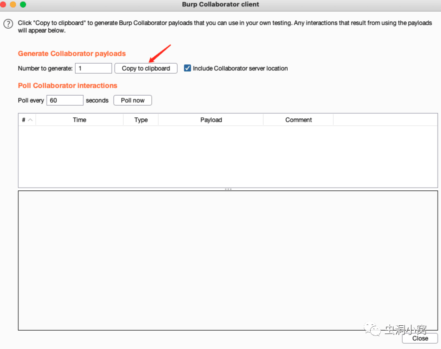
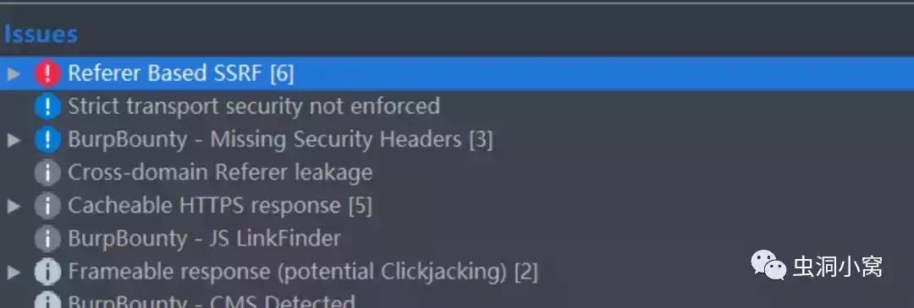
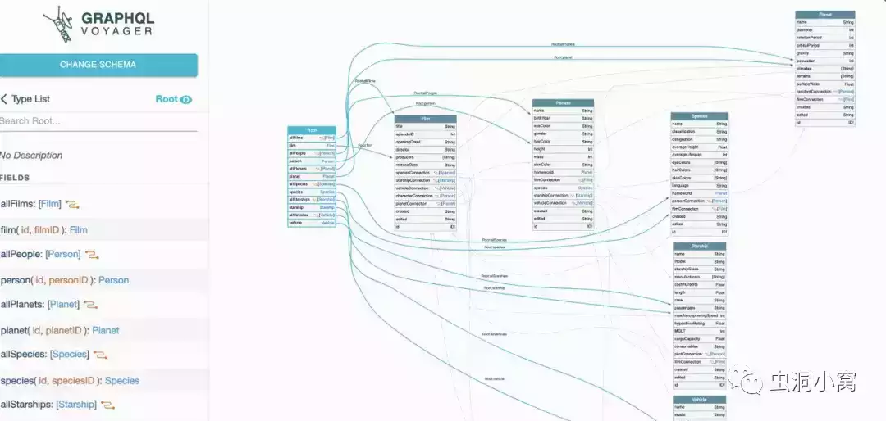
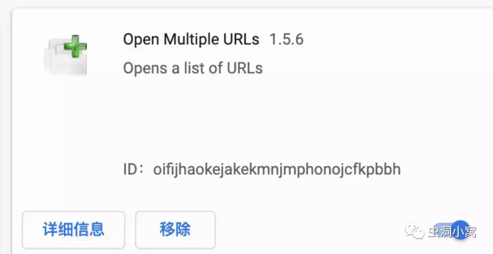

# 如何利用好BurpSuite在企业src中捡洞

**01**

**前言  
今天分享一些实用的BurpSuite插件实用技巧，帮助白帽子如何在竞争激烈的src挖掘中吃上一块肉。  
**

**02**

 **ssrf-King在BurpSuite中实现自动化SSRF检测**

推荐插件：ssrfking     支持扫描和自动发现SSRF漏洞

https://github.com/ethicalhackingplayground/ssrf-king/

首先使用bp中自带的类似于dnslog的工具Burp Collaborator生成地址

加载功能插件SSRF-King，把我们的地址填入即可

在测试过程中就会被动检测，我们不用去管他，正常点击测试功能点即可。

**03**

**inql****极其便捷测试****GraphQL****漏洞**

  

## 这里先来简单了解一下什么是GraphQL，简单的说，GraphQL是由Facebook创造并开源的一种用于API的查询语言。

## GraphQL核心组成部分

### ****1.Type****

用于描述接口的抽象数据模型，有Scalar（标量）和Object（对象）两种，Object由Field组成，同时Field也有自己的Type。

### ****2.Schema****

用于描述接口获取数据的逻辑，类比RESTful中的每个独立资源URI。

### ****3.Query****

用于描述接口的查询类型，有Query（查询）、Mutation（更改）和Subscription（订阅）三种。

### ****4.Resolver****

用于描述接口中每个Query的解析逻辑，部分GraphQL引擎还提供Field细粒度的Resolver（想要详细了解的同学请阅读GraphQL官方文档）。

我们通常在实战中遇到graphql，GraphQL内置了接口文档，你可以通过内省的方法获得这些信息，如对象定义、接口参数等信息。

通常我们会借助在线工具来构造请求包

但是inql插件就极其方便了， GraphQL 端点粘贴到此处并点击加载

等待片刻，去使用attacker功能，便可以生成请求包，我们就可以愉快的测越权，注入等漏洞了，无需去了解复杂的 GraphQL 请求构造语法。

**04**

**Autorepeater发现越权，未授权，甚至ssrf漏洞**

  

Autorepeater可以说是复杂版本的Autorize，它可以针对细化参数实现更加准确的测试，如通常涉及到的uuid,、suid、uid等用户参数。但是，它的设置有些麻烦，比如下面这种uuid的替换测试，需要手动设置：

使用时候打开开关即可

可以看到，该工具会自动替换你填入规则的token，ssrf测试的dnslog地址去测试，然后返回包比对包的大小，结果一目了然，若发现包大小差距过分的大可留意是否是测到了未授权或越权等漏洞，还是非常实用的。

  

  

**05**

**routevulscan结合插件快速获取大批量资产敏感目录**

Burpsuite - Route Vulnerable Scanning 递归式被动检测脆弱路径的burp插件

是github上一位师傅开发的一个插件，我个人非常喜欢用，捡洞神器，在实战中我认为他的亮点是递归式，并且在发现一些未授权的漏洞时候相当好用，如果我们面对大批量资产，想快速捡洞，可以结合chrame插件Open Multiple urls

  

这个插件可以批量打开大量的url地址，当然功能不止这些，不过我们结合routevulscan可快速发现大量资产中未授权的漏洞

使用时候打开开关，在routevulscan配置好常见的未授权漏洞规则或者常见的，通常具有“一打一个准”的后台，如nacos的后台登录口，druid未授权，swagger文档等，捡洞速度极快。

