实践网络空间搜索引擎应用&信息收集

- - -

# 实践网络空间搜索引擎应用&信息收集

## 0x0 前言

  网上很少有人去以白帽子的角度去比较众多的网络空间搜索引擎的优劣，多个搜索引擎肯定是有数据重叠的部分，那么到底有没有整合起来的必要呢？希望这篇文章能给出这个问题一些解答。同时，下面笔者从自己平时的信息收集流程出发，与大家分享一下自己信息收集思路和一些自动化想法。

## 0x1 主流搜索引擎

  笔者最常使用的是 FoFa、Shodan、ZoomEye，所以下面将会以这几个为基础来进行讲解和比较。

## 0x2 信息收集思路

  很多时候我们能获取到信息比较少，比如只有一个主域名->"douyu.com",那么最朴素无华的思路的第一步肯定是爆破子域名，然后就对子域名进行安全性的检测，到这里基本就完成了一个很简单的信息收集流程。

[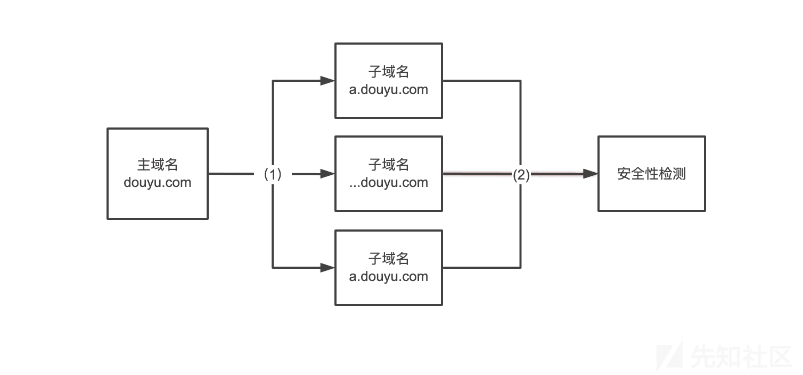](https://xzfile.aliyuncs.com/media/upload/picture/20210427192637-6dc42e24-a74b-1.png)

上图我标注了两个过程 (1)、(2),我们可以在这两个过程里面将流程复杂化 (横向和纵向都可以),从而提高我们目标资产的覆盖度。

第一步比较简单，这里简单说下我的思路。

第一步可以理解为横向挖掘资产吧，目的是找到更多相关的主域名，比如子公司的，内网互通的公司等

介绍下我最常用的思路

**(1) 天眼查的股权结构，可以获取到相关的子公司。**

[](https://xzfile.aliyuncs.com/media/upload/picture/20210427192731-8e3cd980-a74b-1.png)

**(2) 备案信息的查询，可以获取到相同单位的备案信息**

[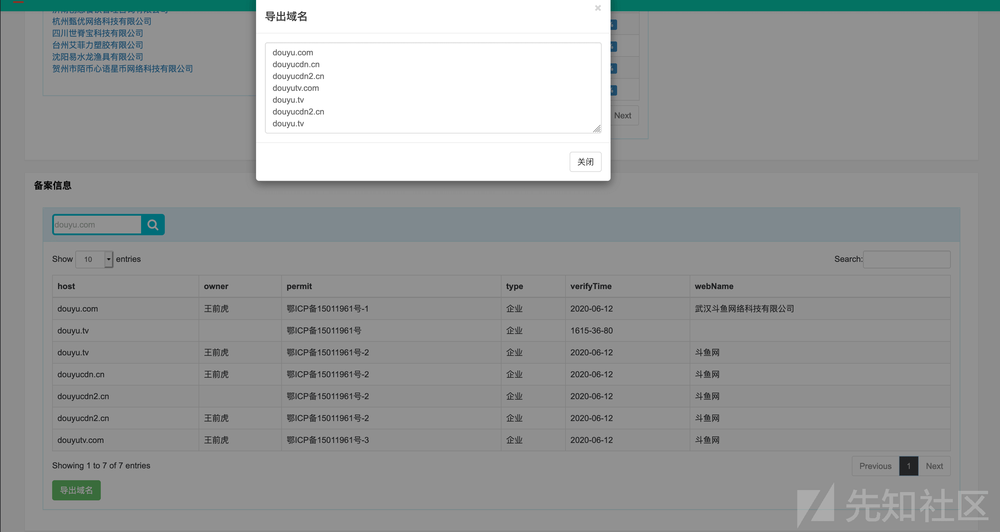](https://xzfile.aliyuncs.com/media/upload/picture/20210427192745-968ee40c-a74b-1.png)

**(3) 域名 whois 反查**

[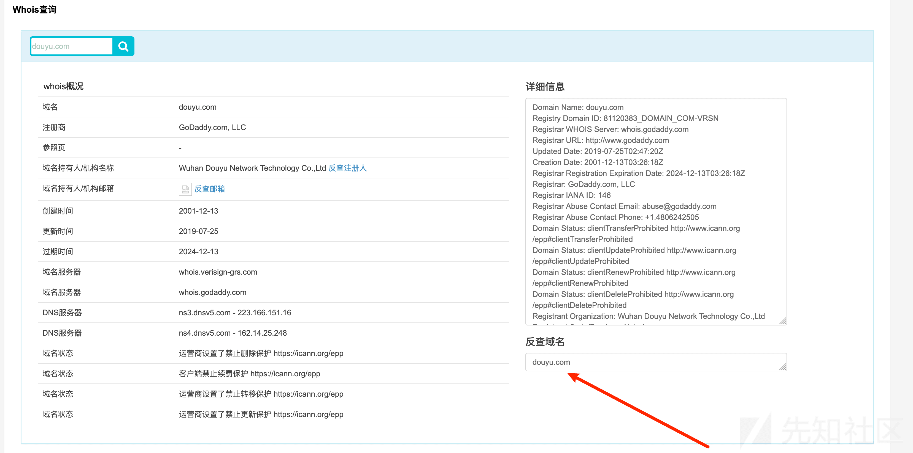](https://xzfile.aliyuncs.com/media/upload/picture/20210427192757-9dc2664a-a74b-1.png)

**(4)IP 反查，获取到真实 IP 的时候可以考虑这个**

[](https://xzfile.aliyuncs.com/media/upload/picture/20210427192807-a3658a32-a74b-1.png)

**(5) 移动端信息**

...这个自动化的思路有点难实现，需要手工参与，不过其实也很简单。

这里有两个常用的查找 APP 的平台：**七麦数据**、**APP Store**

最专业的分析平台就是[七麦数据](https://www.qimai.cn/s)

我们可以获取同开发商的应用和同公司的应用，还有微信公众号和微信小程序。

[](https://xzfile.aliyuncs.com/media/upload/picture/20210427192824-adb199fe-a74b-1.png)

[](https://xzfile.aliyuncs.com/media/upload/picture/20210427192831-b1ecb274-a74b-1.png)

[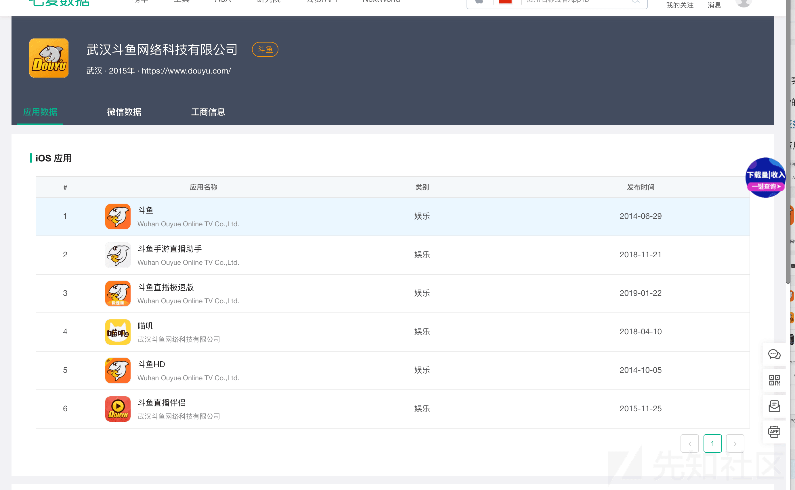](https://xzfile.aliyuncs.com/media/upload/picture/20210427192845-ba16f27a-a74b-1.png)

[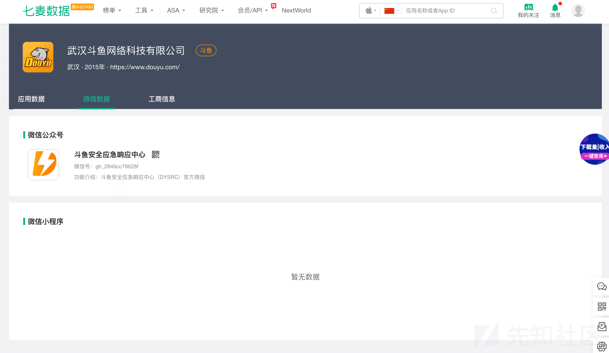](https://xzfile.aliyuncs.com/media/upload/picture/20210427192852-beb5b0a0-a74b-1.png)

后面直接调用 apk 的 url 提取工具就行了。

[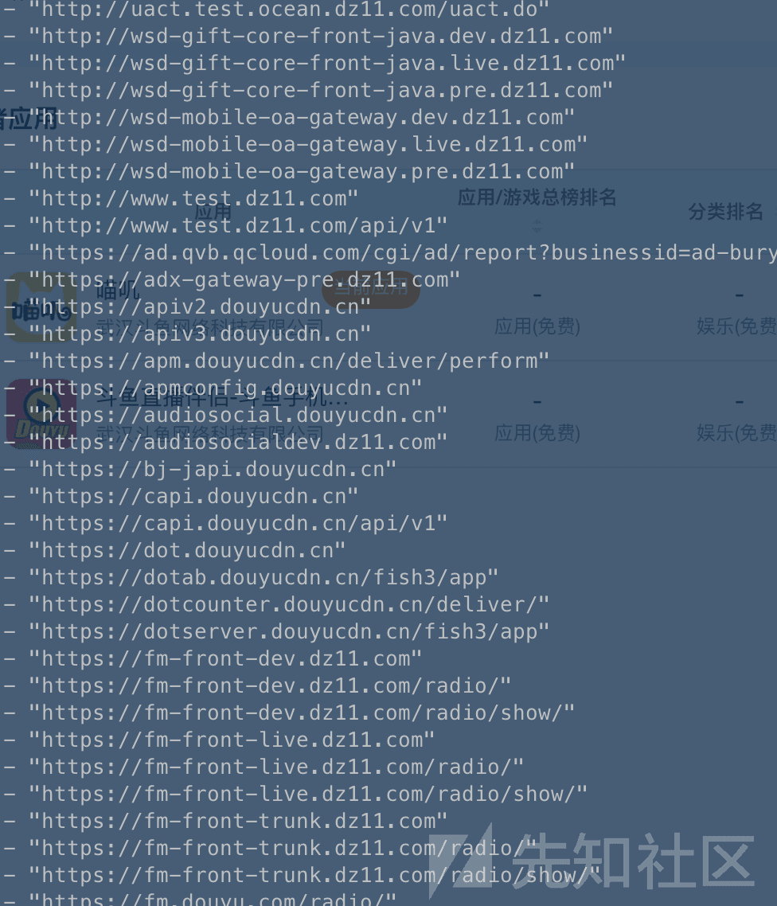](https://xzfile.aliyuncs.com/media/upload/picture/20210427192904-c57f5210-a74b-1.png)

本文重点其实在第二步，就是如何挖掘已有的资产数据的归属特征和分布规律，从而发现更隐蔽、更边界的资产。

流程思路大概如下：

[](https://xzfile.aliyuncs.com/media/upload/picture/20210427192914-cb9a7ab2-a74b-1.png)

## 0x3 归属特征

这里归属特征我暂且定义了三个，分别是 SSL 信息、title 信息、favicon 信息。

其实这里的归属特征我一直最想处理的是网站底部的一些信息，直接进行区域相似度比较感觉就蛮不错的，但是这个误报会很大，觉得还是需要大量的项目经验积累才能去完成这个，所以我没考虑这个。

然后，

网络空间搜索引擎比较好用和准确的搜索是基于 SSL 信息和 favicon 的搜索。

关于批量处理数据得到 SSL 信息和 favicon 信息的代码很简单。

[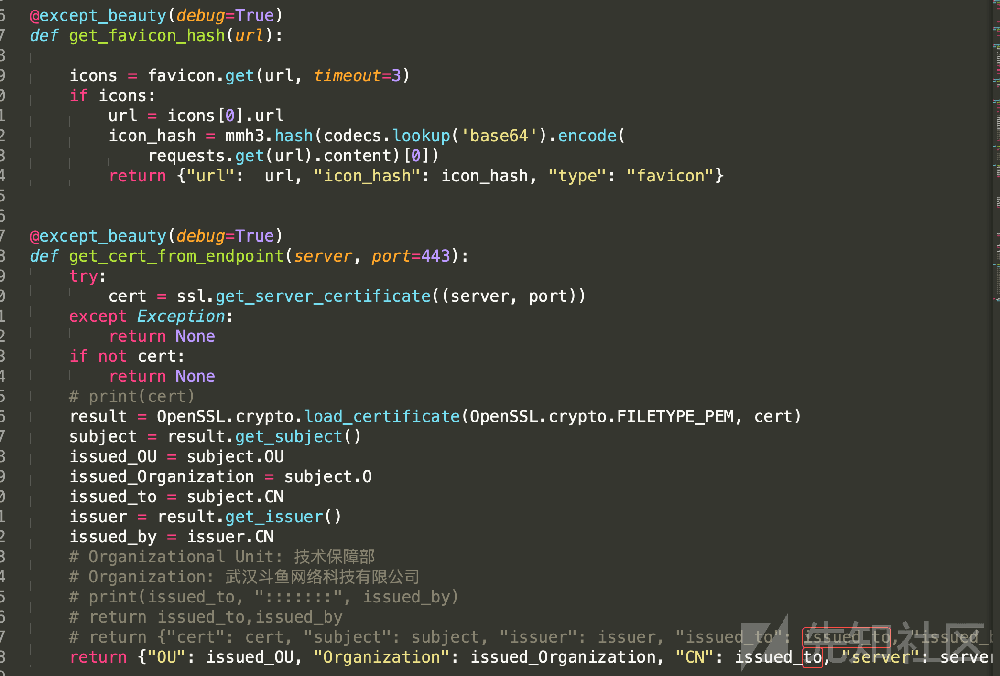](https://xzfile.aliyuncs.com/media/upload/picture/20210427192928-d3fe0e4e-a74b-1.png)

但是比如 douyu.com，我就发现了基于子域名得到的 SSL 信息基本全是 CDN 的 SSL 信息，作用并不是很大，然后得到的也是 CDN 的 C 段，所以如果存在 CDN 的话，那么就会出现很多无效的结果。

所以这里的归属特征，为了在一定程度下得到比较准确的结果，简单处理如下：

1.SSL 我会写死成包含目标中文名称的关键词\\主域\\组织名称。

2.favicon hash 直接进行查询即可。

## 0x4 整合搜索引擎

### 0x4.1 搜索语法

**SSL 信息搜索：**

Shodan: `ssl:"ximalaya.com"`

ZoomEye: `ssl:"ximalaya.com"`

FoFa: `cert="ximalaya.com"`

**Favicon 搜索：**

Shodan: `http.favicon.hash:214897281`

ZoomEye: `iconhash: "214897281"`

FoFa: `icon_hash="214897281"`

### 0x4.2 自动化导出结果

上面的搜索引擎都有比较完备的 API 和 SDK，这里我们直接写个脚本进行调用就可以。

[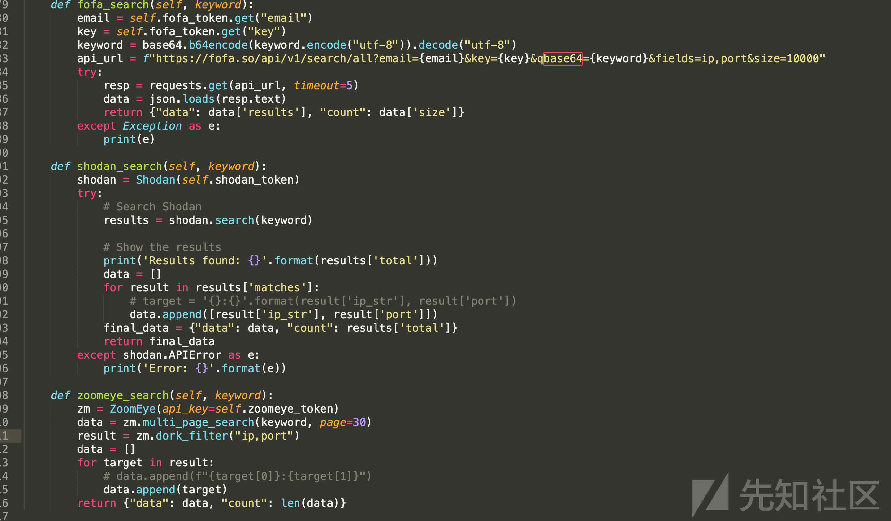](https://xzfile.aliyuncs.com/media/upload/picture/20210427192948-e006ead0-a74b-1.png)

上面代码写的比较粗糙，是 Demo 的代码，能跑起来就行，线上的代码的话需要根据设计来整合统一处理异常、config、重试等。

### 0x4.3 结果比较

以 ximalaya.com 作为查询关键字进行 SSL 查询

以`214897281`作为 icon\_hash 来进行 favicon 的查询

**(1)SSL 信息搜索**

[](https://xzfile.aliyuncs.com/media/upload/picture/20210427193013-eeb7cd9c-a74b-1.png)

[](https://xzfile.aliyuncs.com/media/upload/picture/20210427193023-f49712d6-a74b-1.png)

[](https://xzfile.aliyuncs.com/media/upload/picture/20210427193032-fa1e39f0-a74b-1.png)

[](https://xzfile.aliyuncs.com/media/upload/picture/20210427193057-09358d30-a74c-1.png)

然后可以看一下三者的重合程度。

[](https://xzfile.aliyuncs.com/media/upload/picture/20210427193111-11909eac-a74c-1.png)

可以看到确实有一部分重叠，但是每个引擎的数据确实是不太一样的，重合度并没有很高，三者之间是可以互补的。

[](https://xzfile.aliyuncs.com/media/upload/picture/20210427193124-18d21b28-a74c-1.png)

如果合并的话，那么将会多出 147 个结果，所以整合多个搜索引擎的意义还是存在的。

**(2) Favicon 信息搜索**

[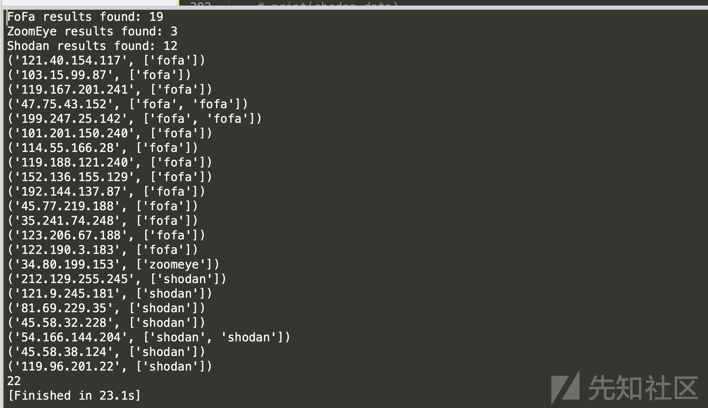](https://xzfile.aliyuncs.com/media/upload/picture/20210427193135-1f5f47ae-a74c-1.png)

在这方面 ZoomEye 确实逊色了一点。

- - -

在这个方面我只获取到 IP，而在 FoFa 是可以搜索到 hostname 的，而且 hostname 的基本数据是三家引擎中最全的，当然这里我只是采用了一个个例进行比较分析，是缺乏权威性的，但是从一个白帽子角度出发，我觉得基于上面的结果，如果能整合 3 个引擎的结果的话，那么资产的覆盖度是可以显著提高的，而这个整合模块也是我正在做的。

## 0x5 分布规律

这里我先说明下我对分布规律 (主要是指目标资产的 IP 的分布) 的理解，这里我觉得可以从几个点来交叉谈谈

**1.ASN**

**2.地域**

**3.C 段**

### 0x5.1 IP 的来源

**(1) 最直接的来源是通过解析子域名得到 IP**

[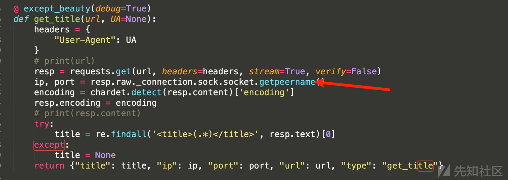](https://xzfile.aliyuncs.com/media/upload/picture/20210427193147-2707ec18-a74c-1.png)

但是经过我对 SSL 信息的提取，可以发现其实很多挂上 CDN 的证书的，说明是使用了 CDN 的服务

[](https://xzfile.aliyuncs.com/media/upload/picture/20210427193159-2e1bfe0e-a74c-1.png)

但是在测试 douyu 的一些站点的时候，发现[多地 ping](https://ping.chinaz.com/)并没有获得多个 IP，而是单一的一个阿里云 BGP 数据中心 IP。

```bash
{'OU': None, 'Organization': None, 'CN': '*.douyucdn.cn', 'server': 'security.douyu.com', 'port': 443, 'type': 'ssl'}
```

[](https://xzfile.aliyuncs.com/media/upload/picture/20210427193213-368827ac-a74c-1.png)

尝试在网络空间搜索引擎去寻找该 IP 的 c 段

[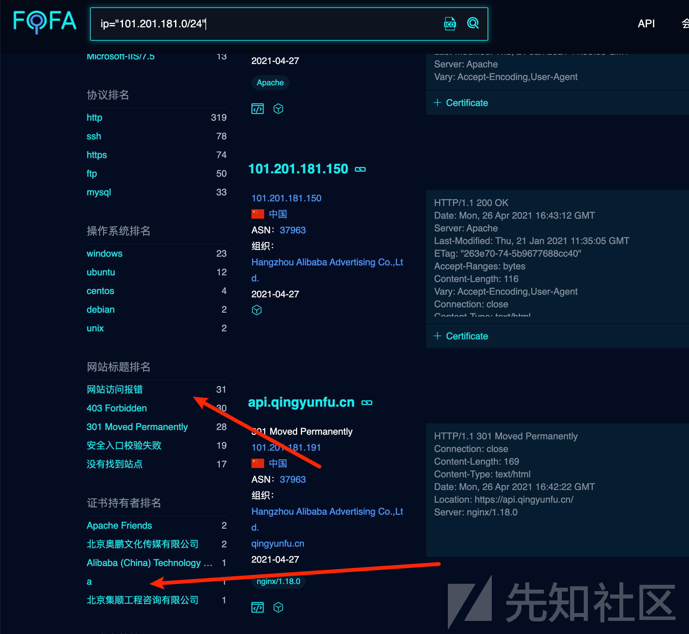](https://xzfile.aliyuncs.com/media/upload/picture/20210427193227-3ed32a2e-a74c-1.png)

基于这些信息，我基本可以判断这个 IP 购买的阿里云，然后拿来当自身 CDN 的服务器来使用的，这些 C 段的资产关联目标的可能性非常低。

**(2)C 段聚合的 IP**

首先需要明白一个基础事实，ASN 聚合>C 段聚合，所以可以直接从 ASN 开始分析然后回到 C 段分析

得到 ASN 基础信息的函数如下：

[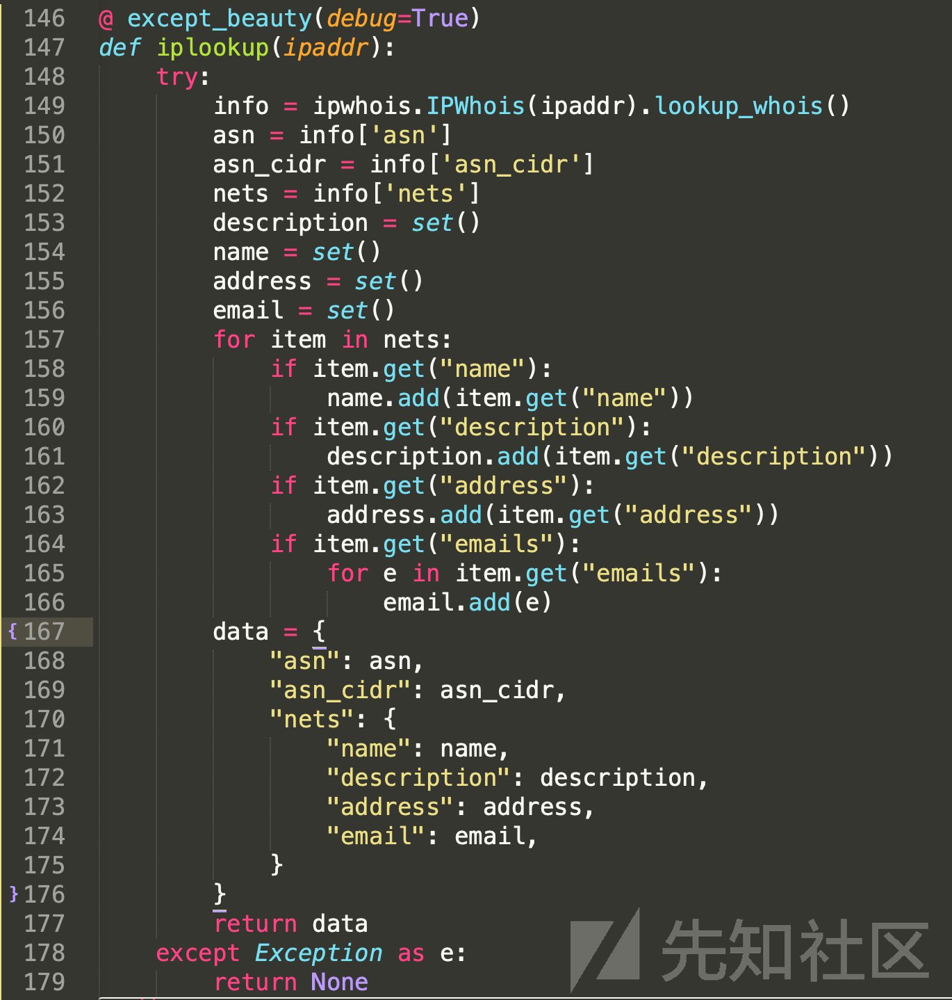](https://xzfile.aliyuncs.com/media/upload/picture/20210427193242-47a5ba2c-a74c-1.png)

分析子域名基础数据得到的结果如下：

[](https://xzfile.aliyuncs.com/media/upload/picture/20210427193256-4fa584b4-a74c-1.png)

ASN 及其 CIDR:

```bash
{'58466', '13335', '37963', '38365', '56040', '56046', '24547', '58543'}
{'111.62.0.0/16', '120.237.0.0/16', '121.201.0.0/18', '183.232.0.0/16', '180.76.124.0/23', '120.238.0.0/16', '36.155.0.0/18', '104.17.192.0/20', '120.232.0.0/16', '39.100.0.0/14', '120.241.0.0/16', '183.239.0.0/16', '14.18.192.0/20', '183.240.0.0/16', '101.201.0.0/16'}
```

如果遍历 CIDR 来确定资产的话，基本扫描数量就是几十 W 了，而且根据描述来看，很多都是公共的 ASN，或者第三方云服务或者运营商的 ASN，所以这个时候获取的 CIDR 范围其实没必要去进行批量扫描，但是可以去调用网络空间搜索引擎，来获取信息，这里获取的信息很多时候需要手工去过滤一下。

[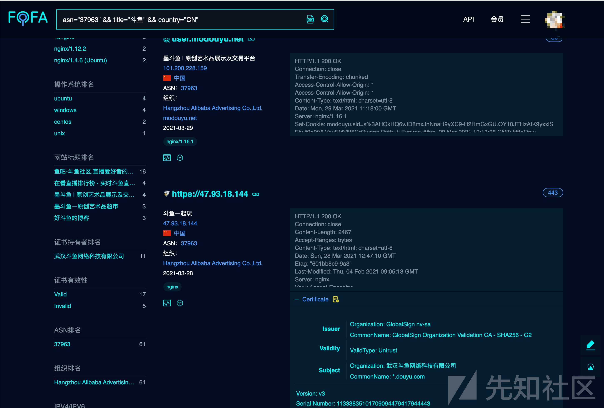](https://xzfile.aliyuncs.com/media/upload/picture/20210427193315-5b7fb958-a74c-1.png)

这里就发现了一个 Ucenter 的目录的网站-----斗鱼一起玩

**(3) 基于 SSL+ 地域高精度定位目标**

首先目标的基本信息，可以确定斗鱼的总部是在武汉的，那么在总部城市肯定会有自己的数据中心，或者出口服务器。

经过测试第三方引擎的搜索引擎其实算法是做了一定优化的，不是进行全量搜索的，要不然搜索速度不可能那么快，所以结合 SSL 信息 + 地域信息搜索，是我自己比较常用的方式，也是结果比较多的方式。

```bash
cert="douyu.com" && city="Wuhan"
cert="斗鱼" && city="Wuhan"
```

得到的结果全是交换机，我们直接导出其 C 段。

```bash
FoFa results found: 13
['58.19.41.0/24', '119.36.49.0/24', '122.190.236.0/24', '119.96.196.0/24']
```

[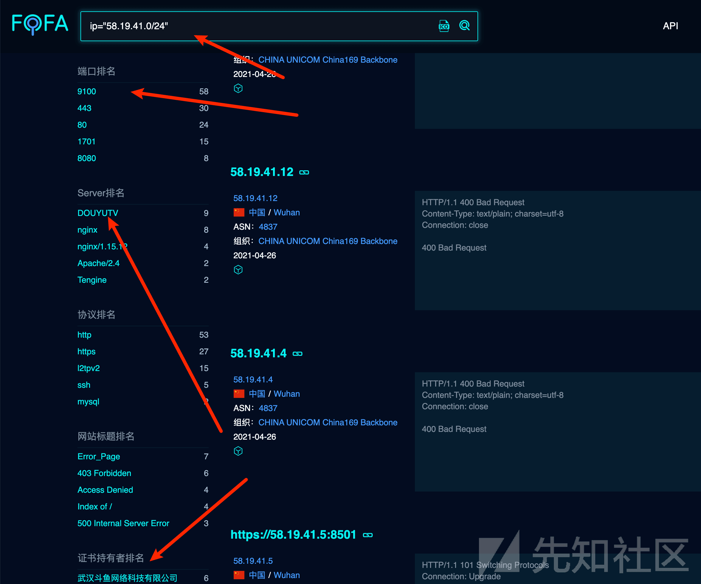](https://xzfile.aliyuncs.com/media/upload/picture/20210427193333-65d00d22-a74c-1.png)

至于是不是与目标具有高关联度，你去访问这些 C 段 IP 的时候，会发现很多有意思的东西....

至于这个来源的 C 段的 IP 资产，我推荐的处理方式是：

**全量端口扫描->定时监控->定时扫描**

## 0x6 WEB 服务发现

发现更多的相关 WEB 服务，那么突破点就变得更多，目标也就更脆弱。

### 0x6.1 WEB 服务划分

这里因为存在一些差异，所以我划分了两种 WEB 服务。

(1) 基于 IP 的 WEB 服务

(2) 基于 IP+ 域名的 WEB 服务

怎么理解呢？

基于 IP 的服务，指的就是说服务器并没有绑定域名，可以直接显示出来 WEB 服务

基于 IP+ 域名的服务，就是要 host 指定为域名，才会显示出相应 host 对应的服务，这个在虚拟主机和 CDN 上都是非常常见的。

### 0x6.2 扫描思路

**(1) 基于 IP 的话**

Masscan->port->requests->info

**(2) 基于 IP+Domain**

Masscan->Port+Host->requests->info

### 0x6.3 代码实现

Masscan 扫描

[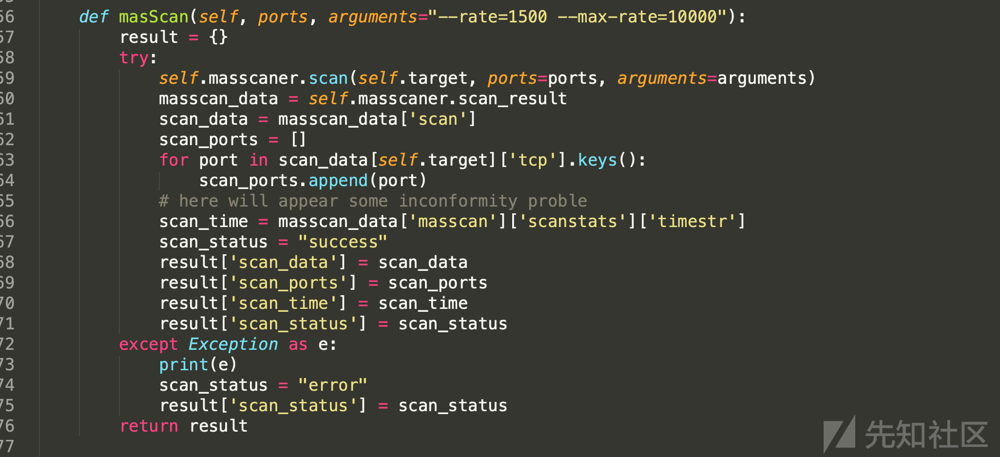](https://xzfile.aliyuncs.com/media/upload/picture/20210427193350-70522abe-a74c-1.png)

WEB 服务发现

[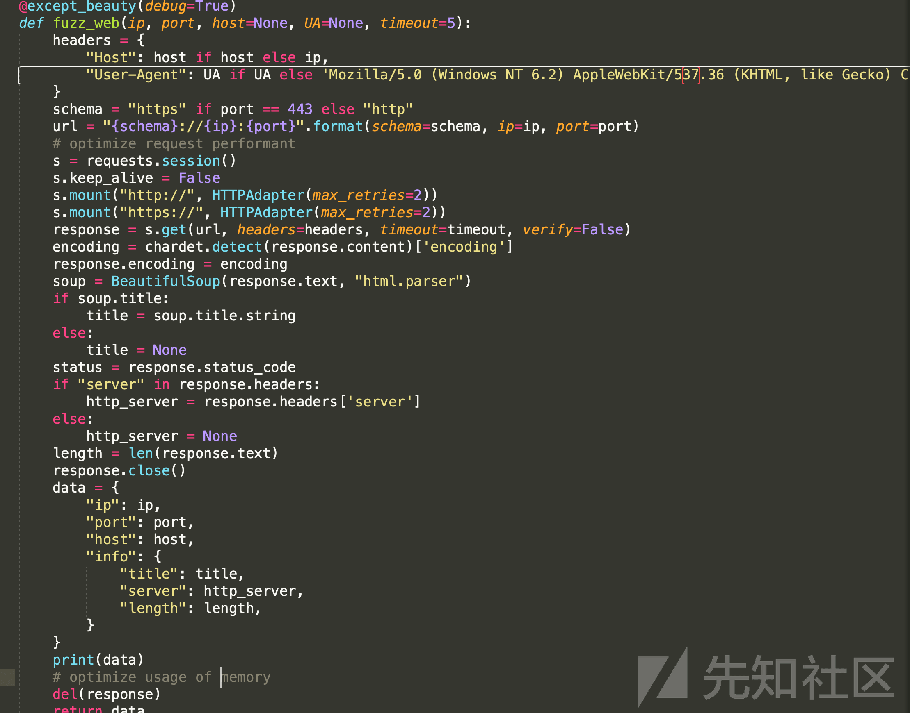](https://xzfile.aliyuncs.com/media/upload/picture/20210427193403-77dbfd64-a74c-1.png)

进程池 + 线程池加速

[](https://xzfile.aliyuncs.com/media/upload/picture/20210427193414-7e2dfc6c-a74c-1.png)

结果：

[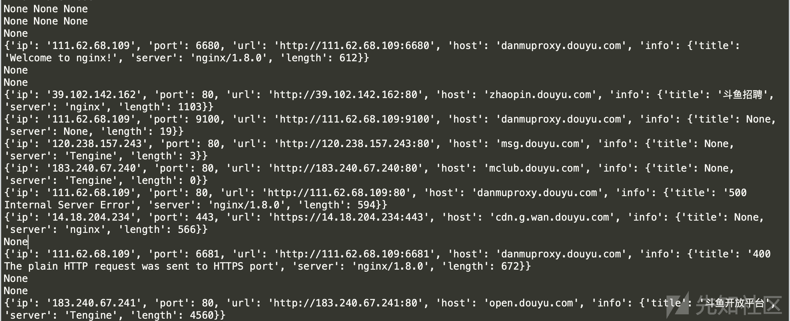](https://xzfile.aliyuncs.com/media/upload/picture/20210427193426-858b3bdc-a74c-1.png)

## 0x7 思考的问题

  上面我的这些思路，为什么网络空间搜索引擎没有这个模块来进行数据关联呢？不过 FoFa 倒是在一定程度上考虑 hostname，就是不清楚他是怎么收集的域名。还有就是我为什么对目标高关联性的网段会考虑进行实时端口扫描，然后去发现 web 服务呢？

问题 (1) 解答：

网络空间搜索引擎起到的是数据收集与分类的作用，至于关联，是用户来组合的事情，但是由于"组合"是可以进行数据分析来得到比较有效的组合的，这个就是我想要自动化的其中一部分，这个部分想要自动化，我个人觉得并不容易。

简单来说，该问题答案就是：搜索引擎目前的定位并不在此。

问题 (2) 解答：

搜索引擎的数据滞后性还是比较严重的，而且处理如此恐怖量级的数据，漏报是不可避免的，而我这种小范围的实时扫描，是可以取得一定优于搜索引擎结果的效果的。

## 0x8 开发思路

  其实我现在在做的事情，可以简单理解为：获取更多的数据->更精确的关联目标->更大程度发现 WEB 服务。这三个步骤细分下来其实还是非常繁琐的，本文只是围绕了大体的思路，给出了极其粗糙的 Demo 代码，实际上这样的代码是根本不会去使用的。

目前的开发思路，还是分模块进行开发，最大程度解耦，然后开发出一个 filter 的可选引擎，来方便组合各个模块，然后每个模块会前置一个处理输入的模块，让输入符合模块的参数格式。同样输出也有一个统一的模块。

其实还有很多问题啦，怎么让自动化选择最优呢？如何应用到分布式上呢？如何可视化呢？如何构建来源链呢？

还有就是最关键就是提高速度，关于这个我倒是有了一些解决的方案，(少输入、避免重复扫描、合理分配资源、结果复用),不过有趣的是，当去应用方案的时候，如果没做好很详细的规划，那么不可避免就会出现新的问题。

> PS: 其实我中间还去尝试过构造一个判断关联度的模块，后来我发现，这个实现挺难的，目前这个模块还是由人工来决定，只支持简单的 filter 字符串，来优先显示，就没做关联度的了，有一说一，关联度确实没啥用。

## 0x9 总结

  其实我还是非常渴望那些拥有丰富的实践经验的师傅，能给我一些补充和优化的思路，这也是我想要发这篇文章一个主要的目的，同时，如果有小伙伴对这个也有想法的话，可以找我一起交流呀，一起开发呀，带带弟弟吧。

> 这个系统慢慢会以单一模块逐步开源出来吧，毕竟我现在的开发思路，就是每一个步骤就是一个独立的工具来开发的。

## 0xA 参考链接

[SRC 漏洞挖掘 - 前期资产收集](https://www.yuque.com/broken5/blog/hoa8if)

[Python Requests 小技巧总结](https://blog.csdn.net/xie_0723/article/details/52790786)
