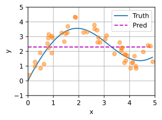

# 注意力机制介绍

## 教材

[10.1. 注意力提示 — 动手学深度学习 2.0.0 documentation](https://zh.d2l.ai/chapter_attention-mechanisms/attention-cues.html)

## QKV

在注意力机制的背景下，自主性提示被称为 *查询*（query）。 给定任何查询，注意力机制通过 *注意力汇聚*（attention pooling） 将选择引导至 *感官输入*（sensory inputs，例如中间特征表示）。 在注意力机制中，这些感官输入被称为 *值*（value）。 更通俗的解释，每个值都与一个 *键*（key）配对， 这可以想象为感官输入的非自主提示。 如 [图10.1.3](https://zh.d2l.ai/chapter_attention-mechanisms/attention-cues.html#fig-qkv)所示，可以通过设计注意力汇聚的方式， 便于给定的查询（自主性提示）与键（非自主性提示）进行匹配， 这将引导得出最匹配的值（感官输入）。


也就是说对 key 按照规则加权求和，然后拟合一个最合适的值，作为输出。这种拟合是一种选择倾向。

## 非参数汇聚

简单起见, 考虑下面这个回归问题：给定的成对的“输入一输出”数据集 `` Missing or unrecognized delimiter for \left$\text{Missing or unrecognized delimiter for \left}$ ``, 如何学习 `` $f$ `` 来预测任意新输入 `` $x$ `` 的输出 `` $y\limits^{^} = f(x)$ `` ?

下面的黄色点是数据集，我们用平均值预测，效果不佳。原因在于 y 实际上和 x 相关。



于是有两个人想到可以用这个公式来估计 `` $f(x)$ ``，它用现有的所有数据，来拟合：

```

LATEX_BLOCK___f(x) = \sum \limits_{i = 1}^{n}\frac{K(x−x_{i})}{\sum \limits_{j = 1}^{n}K(x−x_{j})}y_{i},___LATEX_BLOCK
```

这个估计器叫做 *Nadaraya-Watson核回归*（Nadaraya-Watson kernel regression）。来看看：

-   `` $K$ `` 叫做核函数。
    
-   我们认为，对于其它已知点，它的 `` $x$ `` 越接近要估计的数据点，那么它的 `` $y$ `` 就越接近要估计的点的 `` $y$ ``.
    
-   那么这个接近，或者说相似，就用核 `` $K(x−x_{i})$ `` 来刻画。这种估计可以看作是 `` $k$ `` 近邻算法的一种推广。
    
-   这样来看，其实 `` $f(x)$ `` 就是基于核函数的相似度的加求和，越接近被估计点的，对权重的贡献就越大。
    

抽象为一个注意力汇聚公式：

```

LATEX_BLOCK___f(x) = \sum \limits_{i = 1}^{n}\alpha (x,x_{i})y_{i},___LATEX_BLOCK
```

其中 `` $x$ `` 是查询 Q，`` $(x_{i},y_{i})$ `` 都是已知的数据集。`` $\alpha (x,x_{i})$ `` 是注意力权重。

对于高斯核 `` $K(u) = \frac{1}{\sqrt{2\pi }}\exp ⁡(−\frac{u^{2}}{2}).$ ``：

```plain

f(x)=∑i=1nα(x,xi)yi=∑i=1nexp⁡(−12(x−xi)2)∑j=1nexp⁡(−12(x−xj)2)yi=∑i=1nsoftmax(−12(x−xi)2)yi.Nadaraya-Watson核回归是一种非参数模型，这意味着把训练数据看作模型参数,训练数据集就代表了模型本身。新样本的预测是通过训练数据的加权平均等方式得到的。 

**注意力机制的 Q, K, V 中，K, V 就是数据集的 x, y 吗？**

不完全是。在注意力机制中:

- Q (Query) 代表查询向量,通常是当前正在处理的输入。
- K (Key) 代表关键向量,是从整个输入序列中提取的表示。
- V (Value) 代表值向量,与 Key 相关联,包含 Key 所指向的信息。

K 和 V 通常来源于同一个输入序列,但并不直接对应数据集的 x 和 y。它们更多地起到一种检索和聚合信息的作用,协助 Q 从整个序列中找到最相关的信息。注意力机制通过 Q 和 K 的相似度来确定应该重点关注 V 的哪些部分。
## 带参数汇聚

考虑到如果增加一个可学习参数 w：

$$
```


$$ \begin{matrix} \begin{matrix} f(x) & = \sum \limits_{i = 1}^{n}\alpha (x,x_{i})y_{i}\& = \sum \limits_{i = 1}^{n}\frac{\exp ⁡\left(−\frac{1}{2}((x−x_{i})w2^{undefined}\right)\right.}{\sum \limits_{j = 1}^{n}\exp ⁡\left(−\frac{1}{2}((x−x_{j})w2^{undefined}\right)\right.}y_{i}\& = \sum \limits_{i = 1}^{n}soft\max \left(−\frac{1}{2}((x−x_{i})w2^{undefined}\right)\right.y_{i}. \\ \end{matrix} \\ \end{matrix} $$


```

You can't use 'macro parameter character #' in math modeLATEX_BLOCK___\text{You can't use 'macro parameter character \#' in math mode}___LATEX_BLOCK
```

f(\\mathbf{q}, (\\mathbf{k}\_1, \\mathbf{v}\_1), \\ldots, (\\mathbf{k}\_m, \\mathbf{v}*m)) = \\sum*{i=1}^m \\alpha(\\mathbf{q}, \\mathbf{k}\_i) \\mathbf{v}\_i \\in \\mathbb{R}^v,

```

其中的权重是标量：LATEX_BLOCK___其中的权重是标量：___LATEX_BLOCK
```

\\alpha(\\mathbf{q}, \\mathbf{k}\_i) = \\mathrm{softmax}(a(\\mathbf{q}, \\mathbf{k}\_i)) = \\frac{\\exp(a(\\mathbf{q}, \\mathbf{k}*i))}{\\sum*{j=1}^m \\exp(a(\\mathbf{q}, \\mathbf{k}\_j))} \\in \\mathbb{R}.

```

You can't use 'macro parameter character #' in math modeLATEX_BLOCK___\text{You can't use 'macro parameter character \#' in math mode}___LATEX_BLOCK
```