# 用好 GitHub 开源项目，让你也能训练自己的「AI 孙燕姿」

**▍****前言**

Stable Diffusion 比较火的时候玩过一阵子 AI 绘图，那个时候就感受到了人工智能的巨大潜力。后来刷 B 站的时候一直刷到各种 AI 模型的视频，其中就有许多 AI 翻唱歌曲的内容。


出于好奇，我去 Github 上搜了一下，发现了不少开源的 AI 语音模型项目，训练门槛也不高，就入坑玩了一阵子。初时只是出于好奇，实际体验过后却被其逼真的效果所震撼，于是把以前训练时的一些笔记整理了一下，和大家分享一下训练的心得体会。  

**▍****应用场景**

### **个人应用**

先简单谈谈我自己的训练成果和应用场景。

训练过一个自己音色的唱歌模型，虽然高音还是唱不上去，但是起码在调上了，也算圆了自己的一个唱歌梦，不跑调就是胜利。还训练了几个女声模型，最后挑了两个融了个略带烟嗓的女声模型，效果相当的不错，一篇几千字的文章，最多出现一两处电音或变调，我个人完全可以接受。

目前比较喜欢用这个混合模型来生成一些近现代文学作品的音频，就是那种直接看可能看不下去，但是听的话还能投入进去的文章。以前上学的时候还挺喜欢看看出版书籍的，各种散文、名著都能耐下性子研读，现在变得比较浮躁，沉不下心，但是又想接受一下文学的熏陶，这种矛盾的心情不知道各位能不能理解。

如果是普通 TTS 转换出来的朗读效果我个人不太能接受，完全不会有想听下去的欲望，所以特地花了一个礼拜调出了目前使用的音色，等哪一天听腻了就准备再花点时间换个口味，反正成本也不高，几晚上的电费而已。

为了用起来更方便一点，我特地看了一下音色推理部分的源码，临时写了一个脚本，可以一键把指定文件夹中的 txt 文件转为音频文件，还会同时生成 vtt 格式的字幕文件。因为我特意把微软 TTS 的语速调慢了 20%，所以一般 3000 字的文章转成音频后会有 15 分钟左右，对我来说刚刚好。

电脑上听的话我一般是用 PotPlayer，这个播放器可以自动加载同文件夹下的同名字幕文件，比较省心，播放的显示效果如下：


除此之外还训练过几个用来实时转换音色的模型，说简单点就是 AI 版的变声器。以男声变女声为例，以往的变声器除了需要打开变声功能外，还需要说话人用尖细的音调说话才能达到以假乱真的程度，但是 AI 变声器完全不需要，普通语气讲话即可。

目前的 AI 变声器还存在两个不大的缺陷，第一是如果显卡不行的话延迟会比较高；第二是类似鼓掌、敲桌子之类行为发出的非人声也会被转换。游戏里用 AI 变声器开麦说话效果非常炸裂，偶尔玩玩还挺有意思。

**▍****更多应用**

其实这些模型也可以接入我家的智能家居系统 HomeAssistant 里面，但是比较麻烦，因为我不想在 HomeAssistant 的虚拟机里安装过多的依赖，所以如果要接进去的话最好的办法就是封装一个 API 接口的 docker 容器，想想还是算了，等什么时候训练出来一个熟人的音色想整活的时候可以考虑写一个玩玩。

思维如果发散一下，应用场景其实非常丰富，如果稍微懂点编程就能玩出花来。简单点的，根据类似「甲：…… 乙：…… 旁白：……」这样格式的文本，写个脚本自动识别角色匹配不同的语音模型来批量化自制广播剧。复杂点的，搭配 Stable Diffusion 这样的 AI 绘图软件批量制作有声书短视频。难度再高点的话，可以配合 Ren'Py 这种简单的视觉小说引擎自制一个文字游戏，亦或是将跑团群中的文字跑团游戏可视化为影音游戏的形式留念。

当然，虽然我在这里列举了这么多的应用方式，但是并不建议大家轻易尝试，训练出来自己玩玩就好。如果你真的想**发布分享**的话，那么建议在行动之前看一下国家今年 7 月份开始公布施行的**《生成式人工智能服务管理暂行办法》**以及其他的一些相关法律，包括但不限于《中华人民共和国宪法》《刑法》《民法典》《合同法》。

> 《民法典》
> 
> 第一千零一十九条
> 
> 任何组织或者个人不得以丑化、污损，或者利用信息技术手段伪造等方式侵害他人的肖像权。未经肖像权人同意，不得制作、使用、公开肖像权人的肖像，但是法律另有规定的除外。未经肖像权人同意，肖像作品权利人不得以发表、复制、发行、出租、展览等方式使用或者公开肖像权人的肖像。对自然人声音的保护，参照适用肖像权保护的有关规定。
> 
> 第一千零二十四条
> 
> 【名誉权】民事主体享有名誉权。任何组织或者个人不得以侮辱、诽谤等方式侵害他人的名誉权。
> 
> 第一千零二十七条
> 
> 【作品侵害名誉权】行为人发表的文学、艺术作品以真人真事或者特定人为描述对象，含有侮辱、诽谤内容，侵害他人名誉权的，受害人有权依法请求该行为人承担民事责任。行为人发表的文学、艺术作品不以特定人为描述对象，仅其中的情节与该特定人的情况相似的，不承担民事责任。

**▍****语音模型分类**

这里我就不说什么非常专业的名词了，我自己也不是专门做这个的，理解也算不上深刻。就我目前能找到的开源项目而言，主要分为两类。一是文字转语音，类似常见的 TTS 功能；一是语音转语音，就是进行音色上的转换。许多这类开源项目的初衷是希望让自己喜爱的虚拟角色唱自己喜欢的歌，所以一般主要功能都是唱歌，顺带也可以支持正常说话。

文字转语音的模型想要自己训练一般会比较困难，困难的点主要是数据集，因为要实现文字与语音之间的一一对应，数据集制作时不仅需要大量干声素材，还需要对每一条干声素材进行文本标注。虽然标注的过程可以借用别的 AI 模型进行简化，但是一条条地人工校验 AI 标注的结果也是一种折磨。当然，也可以选择不校验，但是最后训练出来的模型质量就无法保证了。

语音转语音的模型则要亲民许多，一般只要保证有足够时长的高质量干声素材即可，我个人主要训练的就是这种模型。想用这种模型实现 TTS 功能也是可以的，就是需要多一步转化。可以先使用微软免费的在线 TTS 服务将文本转换为语音，然后再通过训练出来的音色模型将其转化为目标音色。听上去比较复杂，其实上写个 Python 脚本调用 edge-tts 库即可轻松完成。

单从 TTS 的效果而言，效果比直接自己训练的文本转语音模型还要好。因为微软的 TTS 模型真的很强大，相信大家都在电影解说视频中听到过「这个男人叫小帅」的开场白，这个配音用的就是微软 TTS 服务中的「云希」。虽然现在「云希」各种泛滥，导致大家听到之后都有点厌烦，但不可否认，语音效果确实算是最强的一档。

**▍****开源项目推荐**

AI 语音类的开源项目非常多，这里只推荐两个我自己用下来觉得训练方便、效果显著的。

**▍****so-vits-svc**

🔗 https://github.com/svc-develop-team/so-vits-svc/

SoftVC VITS Singing Voice Conversion 是一个音色转换项目，之前网上比较流行的 AI 孙燕姿模型很多都是用这个项目训练出来的。除了唱歌，也可以用在正常说话的语音上，音色还原度以及咬字清晰度都是开源项目中的佼佼者。


唯一不好的地方是因为一些法律原因，之前这个项目删库重建过一次，之后项目组就不再发布官方训练底模了，想找个合适的底模比较麻烦。

**▍****Retrieval-based-Voice-Conversion-WebUI**

🔗 https://github.com/RVC-Project/Retrieval-based-Voice-Conversion-WebUI

RVC-Project 项目可以用更少的素材和训练步数达到一个不错的音色还原度，而且实时转换的效率也比较高，如果是想要作为变声器使用的话，更推荐使用这个项目。


**▍****开源模型社区**

大家如果没法自己训练模型但是又想体验的话，其实有一个最简单的办法，就是部署好环境之后直接去开源模型社区下载现成的模型，这里推荐使用 Hugging Face，基本所有的开源项目都能在这里找到相关模型，有些项目的底模找不到也可以在这里碰碰运气。

**▍****本地训练门槛**

这里讲的是本地训练的门槛，对于租借云端显卡进行训练的方案就不讨论了。

### **6GB 显存的英伟达显卡**

训练大部分 AI 模型都需要用到高显存的 N 卡，语音模型算是里面比较亲民的，最低显存要求不算太高，一般的游戏显卡都能满足。

### **充足且清晰的单人音频素材**

这里充足的概念是指符合目标项目中提到的最低音频时长要求，不同的 AI 项目想要达到目标效果所需的素材时长是不同的。相较于音频时长，其实更关键的是音频的质量，低质量的素材最后训练出来的模型也必然不会完美。我这里没有强调必须是干声素材，因为背景音大部分情况下都可以通过人声分离软件进行剔除，后面会有更详细的讲解。

### **基础的 Python 编程知识**

并不是说不会 Python 就没法自己训练 AI 模型，毕竟网上有一大堆所谓的整合包，下载解压后一键就可以开始训练。但是没有这部分基础知识，训练过程中碰到问题就很被动。更关键的是，训练出来也无法自如应用到更多的场景。

举个稍微复杂点的例子，让服务器每天爬取当天的天气预报，如果出现下雨或极端天气就自动生成一段提醒文本，然后自动调用语音模型将其转换为音频，最后通过 DLNA 传输的方式让房间中的音箱播报这段音频。这种场景很美好，就是得靠一定编程知识才好搞定。

🤖

**语音模型项目本地部署**

我并不想针对单一的 AI 语音项目来出一个具体的教程，如今 AI 发展呈井喷之势，可能过一阵子就会因为一篇新算法的发表而出现更加优秀的训练项目。「授人以鱼不如授人以渔」，所以下面的内容更多的是分享一些解决问题的思路。

这里仅考虑使用 Windows 的情况。当然，如果实在不想折腾，也可以直接去 B 站上搜对应项目的整合包，一般都能找到，开箱即用。

**▍****前期准备**

相比直接安装 Python，其实我个人更推荐使用集成工具 Anaconda。它的优势是方便部署虚拟环境，可以很方便地为每个项目配置单独的运行环境，配置好环境后只需要将整个项目文件打包就可以放在任何其他电脑上运行，自己创建所谓的整合包。

Anaconda 安装起来非常简单，去官网下载最新的安装包，然后按照指引完成安装即可。如果对于安装过程存在疑惑的话，网上随便搜一个教程即可，我就不讲了。因为这些开源项目一般都是发布在 Github，下载太慢可以用 Watt Toolkit 试试，或者用 Doget 对下载链接转换后再下载。也可以在 Gitee 上新建仓库从 Github 上导入。

### ****▍**项目部署**

#### **查看文档**

想要部署一个项目，最先要做的就是看一下项目根目录下的 readme.md。这个文件会默认显示在 Github 中该仓库的主页。

主要看哪些东西呢？

-   项目实现的功能。确定项目符合自己的需求。
    
-   训练模型需要的硬件配置。如果文档中没有特别强调，一般 6 GB 显存的 N 卡也就够用了；如果电脑配置不满足却还是想要尝试，可以使用类似谷歌 Colab、百度飞桨等云计算平台。
    
-   支持的 Python 版本。目前开源的 AI 模型基本都是依托于 PyTorch 这一机器学习库编写的，如果文档中没有提及版本问题，可以使用较为稳妥的 3.8 版本。
    
-   训练用音频素材的要求。首先是音频格式及其采样率，大部分情况下是单声道 44K 采样率的 WAV 格式文件，虽然项目中可能有重采样的预处理程序，但是最好初始输入的音频就符合项目要求。另一个是音频素材的单个时长及总时长，单个时长一般 3~20 秒都是可以的，最好是控制在 5~15 秒，具体以项目文档为准；总时长个人经验并不是越长越好，正常两个小时左右就能达到不错的效果，部分特化的项目甚至只需要几分钟，不要太长的另一个原因主要是考虑到训练速度，如果素材总大小超过电脑内存上限的话，就无法一次将数据读取到内存中，训练速度会受到硬盘读取速度的限制，GPU 占用率会因为读盘的操作而经常下降。
    
-   训练的命令。大项目都会有比较详细的训练步骤介绍。
    

#### **拉取项目**

接着自然是把项目文件拉取到本地，不管是用上面提到的哪种办法，只要能下载到本地即可。

#### **搭建环境**

进入项目根目录，在此处打开 CMD 窗口，确保 CMD 窗口中显示的路径为当前项目根目录，如果不是就用 cd 命令切换过来。注意这里**一定不要用 PowerShell**，不然会无法激活下面创建的虚拟环境。

然后使用 Anaconda 在当前目录创建虚拟环境：

```plain
conda create -p .\env python=3.8
```

命令中 Python 的版本可以根据需要自行更改。我比较喜欢指定环境安装位置在项目根目录，方便后期打包备份。如果不准备在其他电脑上运行也可以用 -n 参数创建一个命名环境，这个环境一般会保存在当前电脑用户的文件夹下。

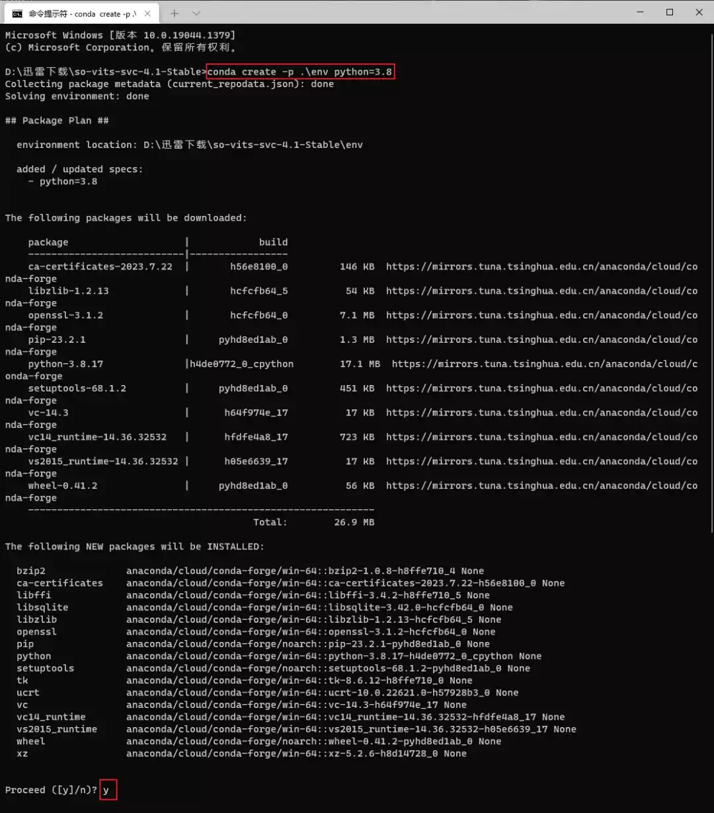

创建好 Python 虚拟环境后需要在命令行中激活：

```plain
conda activate .\env
```

激活后命令行前面会有一个小括号包裹的环境路径，一定要确保激活环境后再进行后面的操作。


接下来输入下面的命令查看自己电脑的 CUDA 版本：

```plain
nvidia-smi
```

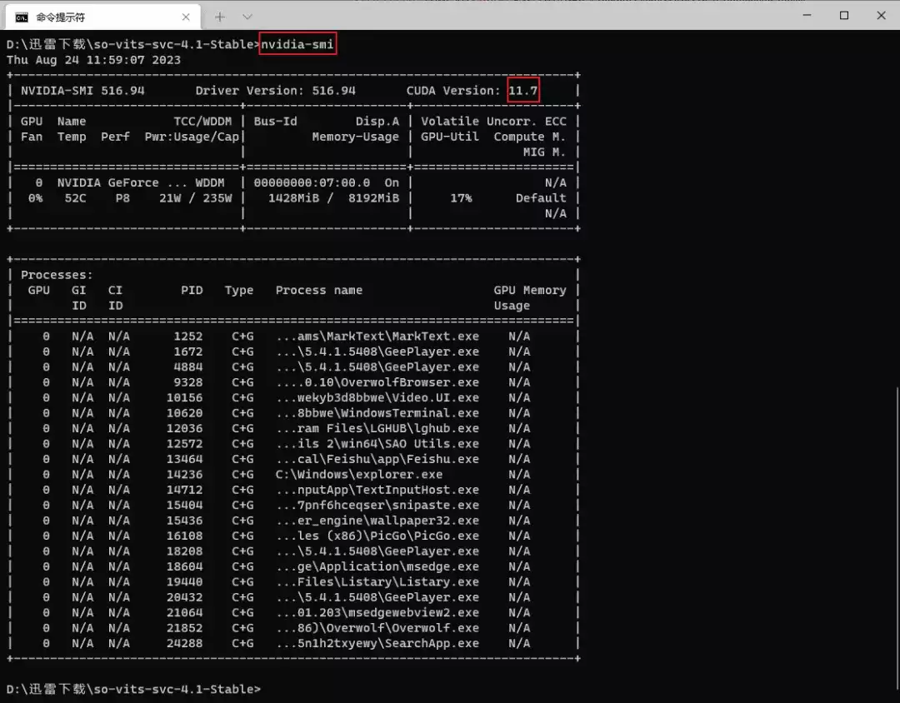

之后登录 PyTorch 的官网，官网上可以直接查看符合自己系统的安装命令，我一般直接选择 Pip 安装方式。在之前的命令窗中输入网页上的安装命令，等待下载安装完成。第一次安装可能会比较慢，后面如果创建别的虚拟环境就可以直接用系统内的缓存，安装速度会快很多。

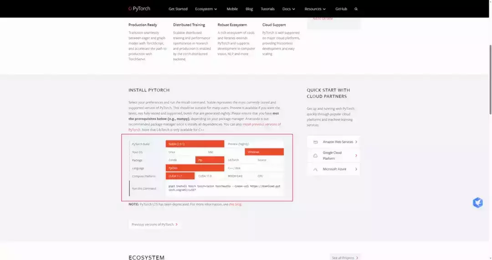

这里可以看一下安装命令，不难发现安装了 torch、torchvision、torchaudio 这三个包，把它们的名字记一下，后面可能用到。


除了安装 PyTorch 外，想要让项目正常运行，还需要安装 requirements.txt 文件中规定的所以库才行。正常支持 Windows 的项目会有一个额外的 requirements\_win.txt 文件，有的话就用这个文件，没有就用 requirements.txt。在安装之前最好先打开这个文件，看看里面的库名是否包含之前安装过的那三个包，如果包含的话就先手动删去，避免重新安装到错误的版本。准备工作完成后运行如下命令：

```plain
pip install -r requirements_win.txt -i https://mirrors.aliyun.com/pypi/simple/
```

如果安装过程不报错那就皆大欢喜，但是报错了也不用慌，大部分都是包的版本问题，解决起来不算难，下面举几个例子作为参考。

#### **常见错误 1**


这个错误是因为 gradio 没有符合要求的版本号，解决办法很简单，把 txt 文件中这个包的版本号删去，让包管理器自动寻找最新版本即可。


#### **常见错误 2**


这个错误是因为多个不同的包对 numpy 版本的要求不同，包管理器无法找到符合所有包需求的 numpy 版本。解决方法其实报的错误信息里已经写了，就是删去这些库的版本号，可以逐个删除尝试，尽可能少的修改 txt 文件。

#### **常见错误 3**

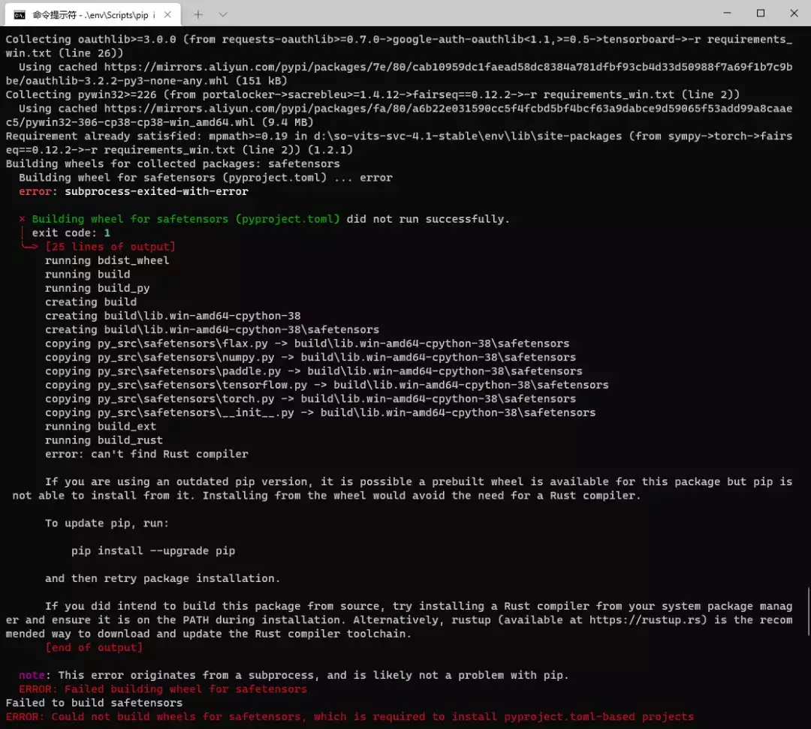

这个错误发生的原因很多，解决办法也相应比较多，可以按照错误提示中说的，试试看升级 Pip，或者是安装 Rust 编译器。除此之外还有一种解决办法就是限制一下对应包的版本号，比如我碰到的这个问题只需要将 transformers 的版本号限定在 3.4 即可。

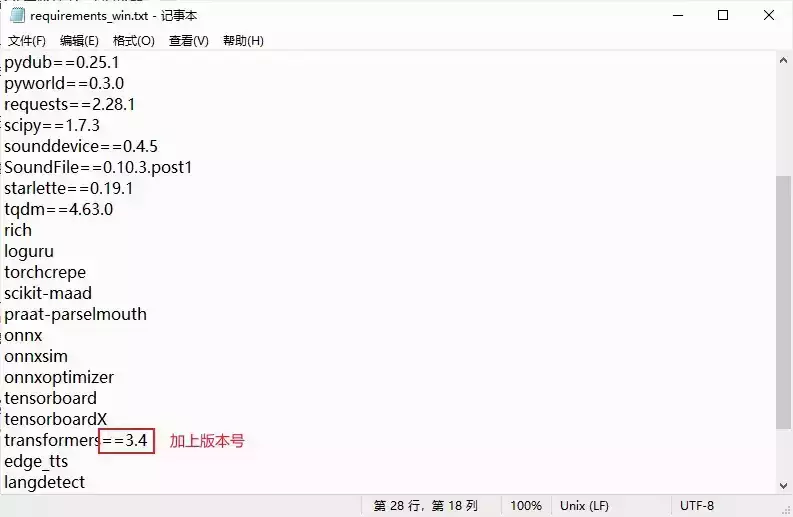

下面放一张**安装成功**的截图，希望各位都能一次成功。

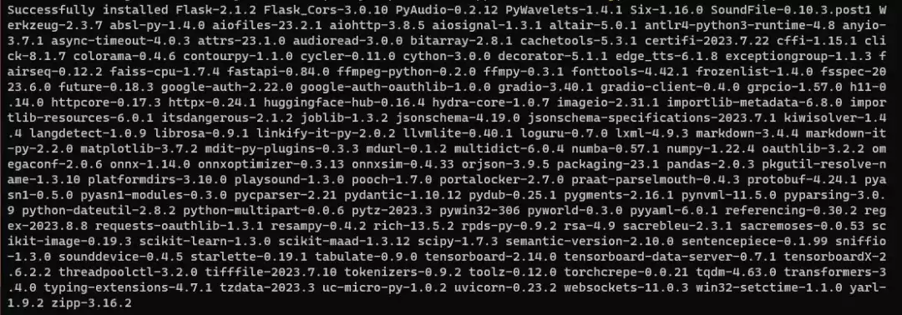

**▍****运行命令**

之前项目部署那里提到过部分内容，比方说激活虚拟环境的命令：

```plain
conda activate .\env
```

激活环境后就可以按照项目文档中写的训练命令来依次执行了，不过如果是简单的 Python 命令的话也可以不激活环境，直接写出解释器的路径也可以调用，比如：

```plain
.\env\python webUI.py
效果等同于
conda activate .\env

python webUI.py
```

有时候部分命令需要频繁使用，每次都打开 CMD 窗口输入命令未免过于麻烦，这时候我们可以编写一个 bat 后缀的文件来简化操作。

创建的方法也很简单，右击新建一个文本文档，也就是 txt 文件，然后将其重命名为 bat 拓展名的文件即可。双击这个文件就会自动在当前路径执行其中的命令。如果是想要修改其中的命令，右击文件后点击编辑即可。下面给出一个通用的模板：

```plain
@echo off
call conda activate .\env
python webUI.pypy

pause
```

简单解释一下各个语句的意思，第一行表示关闭命令行输出，第二行表示激活当前环境，第三行写上任意想要运行的命令，第四行表示运行完成后等待用户确认再关闭命令行窗口。

## **🤖**

## **数据集准备**

学会上面这一套基本所有的开源 AI 项目就都可以自行部署到本地了，可以说是实现了整合包自由，看上哪个项目直接上手玩就是了。本节则是分享一下我个人处理语音数据集的经验。

**▍****基础知识**

整理数据集之前，请**务必先搞清楚**自己训练语音模型的用途，明确是唱歌用还是说话用，一个人唱歌和说话时的音色是有很大差别的。

唱歌用数据集的要求一般更高一些，除了时长的要求，音域也需要尽可能全覆盖，说简单点就是高音、低音最好都有，不然最后出来的模型就会在数据集缺失的音域产生哑音或音色失真之类的缺陷。

我本人五音不全，也曾经训练过自己音色的唱歌模型，结果只能说惨不忍睹，事实证明你本来唱不上去的调，换成 AI 还是唱不上去。唱歌数据集如果时长实在有限，可以适当添加一些音色相近的说话素材，但不能太多，质量大部分时候都比数量更重要。说话数据集就简单许多，尽量选用音色相近的正常语音素材即可。

**▍****获取音频素材**

这里其实分几种情况，主要是根据训练模型的目的来划分。

第一种是只想要一个听着舒服的音色来进行 TTS 文本转语音，第二种是想先随便找点素材练练手看看效果。这两种需求最简单的素材获取方式就是去类似喜马拉雅、蜻蜓 FM 的音频网站上找一个主播，直接把他所有的音频下载下来，简单处理之后就可以开始训练。

第三种是想要训练自己或朋友的 AI 语音模型，这个有两种常见的处理手法，一种是用 Au 之类的录音软件专门录制干声，一种是使用 Voicemeeter 之类的虚拟声卡软件将平常微信或 QQ 电话的音频录制下来。当然，如果是训练朋友的模型，请务必取得他的同意。如果是想要训练唱歌用的模型，可以安装一些 K 歌类的软件，大多都可以将音频保存下来，平常没事的时候唱几首，时长够了也就可以开始动手训练了。

第四种是想训练某个明星或主播的模型，歌星的话直接用他歌曲的人声部分即可；主播的话麻烦一点，得找直播切片提取出音轨；影视明星更加麻烦，得慢慢找视频素材单独切出角色语音，不是真爱或者闲得蛋疼不推荐尝试。

**▍****处理素材**

这里讲一些常用的素材处理技巧，可以极大地提高处理效率。

#### **人声分离**

很多素材都会有背景音乐，人工去除难度太大，此时需要借助一些专用软件。我这里只推荐使用 UVR5，目前市面上最强的免费声音分离软件。使用起来也非常简单，直接去官网下载安装好之后打开保持默认，勾选上 Vocals Only 选项，点击开始转换即可。

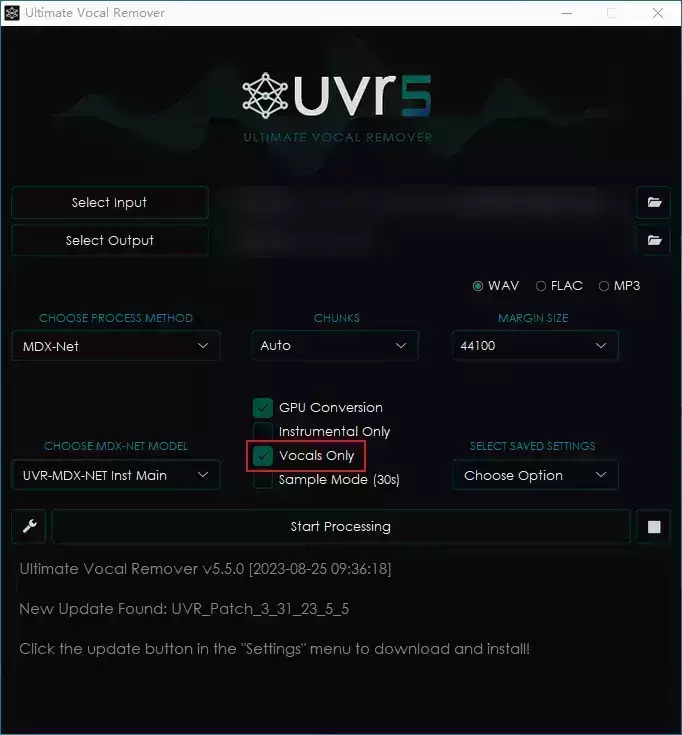

Vocals Only 选项就是只输出人声音轨，不输出伴奏音轨。图中的这套配置可以轻松去除纯音乐的背景音，不过如果 BGM 是带有人声的歌曲就无能为力了，歌曲中的人声也会被保留。我本人对这个软件也没啥深入的研究，更多需求大家自行研究一下。

#### **文件重命名**

这个步骤非常关键，主要是很多项目都不支持中文文件名，所以素材在切片之前最好先重命名一下。文件数量少的话手工改一下问题不大，数量太多的话就比较头疼了。目前市面上批量重命名的工具不少，大家各显神通即可。我本人比较习惯用 Python 脚本，这里简单分享一个，大家会用就用。

```plain
import glob
import os

if __name__ == '__main__':
    index = 1
    for file in glob.glob("*.wav"):
        os.rename(file, "{:04d}.wav".format(index))

        index += 1
```

#### **批量切除部分片段**

有时候一些音频会有一个统一时长的开场白或结束语，手动切除就会很麻烦，这里同样给出一个 Python 脚本。

```plain
import glob
import os

from pydub import AudioSegment


def cut_one(input, output):
    audio = AudioSegment.from_file(input, format="mp3")
    # 切除开头 8 秒
    audio = audio[8000:]
    audio.export(output, format="mp3")


if __name__ == '__main__':
    for file in glob.glob("*.mp3"):
        out = os.path.join("cutted", os.path.split(file)[-1])

        cut_one(file, out)
```

#### **合并短音频**

这个需求比较少见——比如有时候会用到一些游戏的角色语音来作为训练素材，但是这些素材可能单条都只有几秒钟时间，不太符合训练切片的时长要求。这时候可以使用 Au 这样的图形化软件手动拼接，也可以借用脚本，同样给出一个示例。

```plain
import glob

from pydub import AudioSegment


if __name__ == '__main__':
    index = 1
    for file in glob.glob("dirname/*.ogg"):
        if index == 1:
            audio = AudioSegment.from_ogg(file)
        else:
            audio += AudioSegment.from_ogg(file)
        print(index)
        index += 1

    audio.export("merged.wav", format="wav")
```

#### **音量统一**

很多项目会有内置的脚本进行音量处理，如果没有就只能自己动手了，因为这个步骤是**必不可少**的，不然最终训练出来的模型也会出现类似的问题。想要达到最好的效果肯定是使用 Au 这样的专业软件进行调整，但是如果怕麻烦的话也可以使用脚本解决。

```plain
import glob
import os

from pydub import AudioSegment

if __name__ == '__main__':
    # 统一化的音量大小，单位 dB
    target_db = -10
    os.makedirs("normalized", exist_ok=True)
    for file in glob.glob("dirpath/*.wav"):
        basename = os.path.basename(file)
        audio = AudioSegment.from_file(file)
        current_db = audio.dBFS
        db_diff = target_db - current_db
        normalized_audio = audio + db_diff
        normalized_audio.export(
            os.path.join("normalized", basename),
            format="wav"

        )
```

#### **批量切片**

切片是准备数据集必不可少的步骤，大部分项目对单条音频的时长都有限制，大多为 5~15 秒，手工切是肯定不可能的，毕竟几千条能把人累死，目前用的最多的是 audio-slicer，有带图形化界面的版本，使用的时候保持默认设置即可。

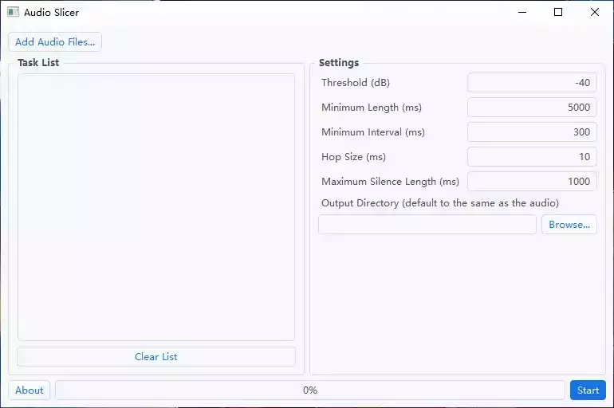

#### **删去过长过短音频**

这个操作非常简单，为了处理过程的完整性简单提一下。将切片好的文件夹属性设置为常规文件，然后根据数据大小排序，依照顺序删去过长或过短的音频即可。

#### **需要标注文本的音频**

之前提过，训练文本转语音模型需要对音频进行文本标注。因为不同的项目对文本的标注格式会有些许差别，仔细看项目文档就是了，大部分项目会给出标注建议和相关工具，依照指示操作即可。

**▍****训练进度查看**

对于很多新手朋友来说，训练模型时最大的疑惑可能就是怎么样算是训练完成了？如何判定训练进度是一件非常重要的事，不然闷头训练很容易浪费时间。要知道，**模型并不是训练的时间越长效果越好**。训练步数过多很有可能出现过拟合的情况，纸面参数好看结果却完全不如低步数时的效果。

目前大部分模型的训练代码中都会添加 tensorboard 的相关支持，借由 tensorboard 我们就可以在训练的过程中实时跟踪关键训练参数。判断一个项目是否支持 tensorboard 很简单，直接看之前搭建环境时提到的 requirements.txt 文件即可，里面如果有这个包的名称就是支持的。

怎么打开参数面板也很简单，首先找到模型训练时保存 checkpoints 和日志的文件夹，一般就叫 logs，在里面找到带有 **events** 打头文件的文件夹，这里要注意，这种文件只有在开始训练模型并在命令行产生输出后才会生成。

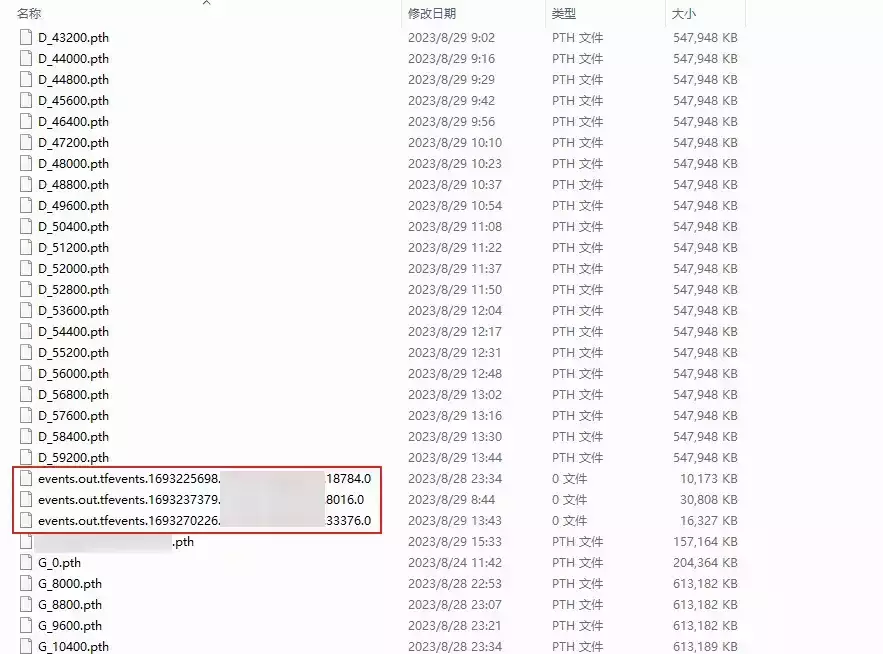

找到后记下其所在文件夹的路径，无论是绝对路径还是相对路径皆可，然后再开一个命令行窗口激活虚拟环境后输入下面的命令：

```plain
tensorboard --logdir dirname
```

命令中的 dirname 自行替换，如果出现如下输出则代表运行成功：

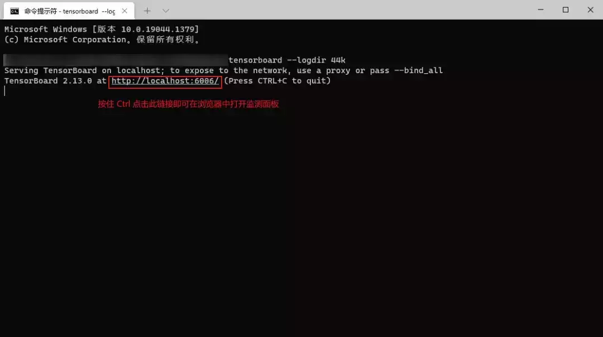

打开命令行中的本地链接后就可以看到监测面板：

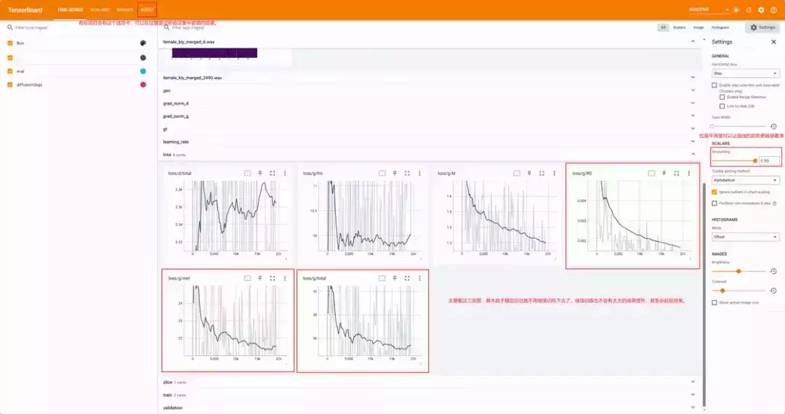

里面的数据根据不同的项目会有差别，有的详细，有的可能只有 loss 这一部分。看不懂没有关系，会看曲线就行。其实大部分情况只看一张 loss 的图就够用了，有些叫 total，有些叫 reference loss，简单理解就是总偏差，一般这张图的曲线趋于平稳之后就可以结束训练了。

训练结束后就是纯主观的听音环节了，如果面板上有 AUDIO 选项卡的话可以进入其中试听不同步数下的转换效果，框定一个大致的步数范围，然后可以挑选几个听下来不错的模型，找一些音频素材让其实际转换一下，再细品一下到底把哪个模型文件作为最终成品。很多时候并不是步数最高的模型效果最好，我就碰到过一个好玩的例子，特地训练了一个烟嗓的女声模型，结果训练到后面把烟嗓给训练没了，反倒是步数少的模型更加原汁原味。

**▍****训练参数设置**

最后再提两个训练的小技巧，如果你的硬盘空间足够大的话，建议把训练参数中保留的 checkpoints 数量调大一点，像我一般直接调成 100，这样挂一晚上之后所有的记录点模型都在，不会出现训练过头导致真正效果好的模型被删除而只能从头再来的折磨。另一个技巧就是如果参数中支持将训练数据一次性全部加载到内存中的话，在内存容量足够的情况下请务必开启这一功能，可以大大提高训练速度。

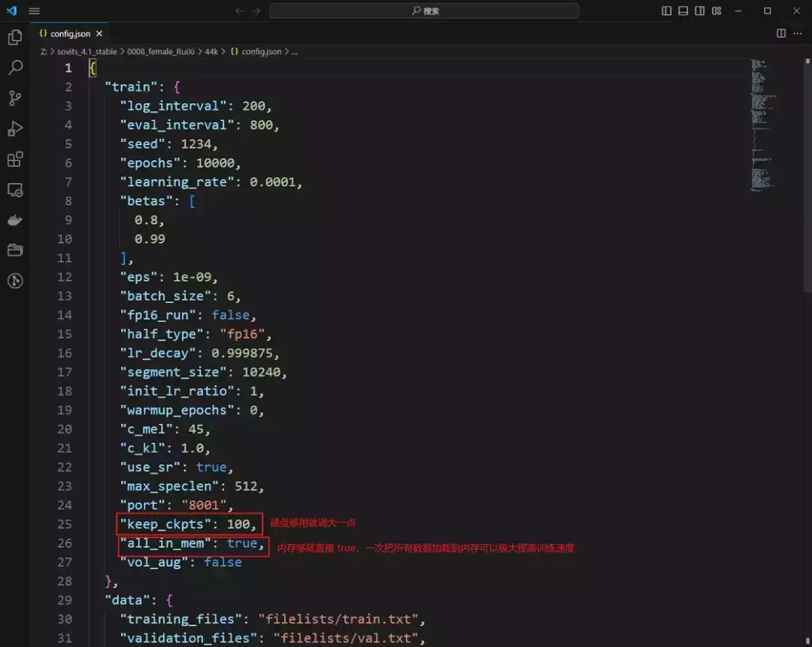

还有一个注意点，如果不是特殊需求的话，最好训练单人模型，因为单人模型后期进行音色融合的话更加简单灵活。我自己现在常用的就是两个音色融合之后的模型。

**▍****批量转换脚本**

我本人现在用的是 so-vits-svc-4.1-Stable，最开始的个人应用中提到的批量转换脚本如下，放在项目根目录就可以运行。因为是临时写的，也没有仔细优化过，代码写的比较乱，看不懂就只改最前面几个大写的参数。实在不会用就算了，用项目自带的网页工具手动转换也一样。

```plain
import asyncio
import edge_tts
import glob
import librosa
import numpy as np
import os
import re
import soundfile

from inference import infer_tool
from inference.infer_tool import Svc

# 微软 TTS 参数
# 音色，云希虽然是男声，但是说话节奏是最好的，不建议修改
VOICE = "zh-CN-YunxiNeural"
# 说话速率，根据喜好来
RATE = "-20%"
# 音量增强，根据喜好来
VOLUME = "+50%"

# 模型参数
# 模型文件路径
MODEL = "trained/female_RuiQian/female_RuiQian.pth"
# 模型对应配置文件路径
CONFIG = "trained/female_RuiQian/config.json"
# 说话人名称
SPEAKER = "female_RuiQian"


async def generate_one(filepath) -> None:
    # 读取 txt 文件内容
    with open(filepath, "r", encoding="utf-8") as f:
        text = f.read().replace("　", "").replace(" ", "").replace("\n", "").replace("\t", "").replace("\a", "")
    # 微软 TTS 生成语音和字幕的保存路径
    base_name = os.path.basename(filepath)
    name = os.path.splitext(base_name)[0]
    media = os.path.join("results", "raw_{}.mp3".format(name))
    subtitle = os.path.join("results", "{}.vtt".format(name))
    # 创建并保存微软 TTS 语音和字幕文件，需要联网，速度较慢
    communicate = edge_tts.Communicate(text=text, voice=VOICE, rate=RATE, volume=VOLUME)
    submaker = edge_tts.SubMaker()
    with open(media, "wb") as file:
        async for chunk in communicate.stream():
            if chunk["type"] == "audio":
                file.write(chunk["data"])
            elif chunk["type"] == "WordBoundary":
                # 向字幕文件中加入标点符号
                chunk_text = chunk["text"].replace(" ", "")
                pattern = "^" + chunk_text.replace("", ".*?").rstrip(".*?") + r"""[，。”：；、？）》}】！,.'";:?)>}\]]*"""
                chunk_text = re.match(pattern, text).group()
                print(chunk_text)
                text = text[len(chunk_text):]
                submaker.create_sub((chunk["offset"], chunk["duration"]), chunk_text)

    with open(subtitle, "w", encoding="utf-8") as file:
        file.write(submaker.generate_subs())

    # 音频数据预处理，将 TTS 生成的 mp3 文件转为 wav
    target_sr = 44100
    y, sr = librosa.load(media)
    resampled_y = librosa.resample(y, orig_sr=sr, target_sr=target_sr)
    processed_audio = os.path.join("results", f"processed_{name}.wav")
    soundfile.write(processed_audio, resampled_y, target_sr, subtype="PCM_16")

    # 加载语音模型
    model = Svc(MODEL,
                CONFIG,
                device=None,
                cluster_model_path="",
                nsf_hifigan_enhance=False,
                diffusion_model_path="",
                diffusion_config_path="",
                shallow_diffusion=False,
                only_diffusion=False,
                spk_mix_enable=False,
                feature_retrieval=""
                )
    # 模型推理参数
    kwarg = {
        "raw_audio_path": processed_audio,
        "spk": SPEAKER,
        "tran": 0,
        "slice_db": -40,
        "cluster_infer_ratio": 0,
        "auto_predict_f0": True,
        "noice_scale": 0.4,
        "pad_seconds": 0.5,
        "clip_seconds": 0,
        "lg_num": 0,
        "lgr_num": 0.75,
        "f0_predictor": "rmvpe",
        "enhancer_adaptive_key": 0,
        "cr_threshold": 0.05,
        "k_step": 100,
        "use_spk_mix": False,
        "second_encoding": False,
        "loudness_envelope_adjustment": 1
    }
    # 音色转换推理
    audio = model.slice_inference(**kwarg)
    model.clear_empty()
    res_path = os.path.join("results", "{}.wav".format(name))
    # 保存最终音频
    soundfile.write(res_path, audio, model.target_sample)


async def generate():
    # 提前在根目录创建一个 text 文件夹，把要转换的 txt 文件放在里面
    for file in glob.glob("text/*.txt"):
        await generate_one(file)


if __name__ == "__main__":
    loop = asyncio.get_event_loop_policy().get_event_loop()
    try:
        loop.run_until_complete(generate())
    finally:

        loop.close()
```

**▍****后记**

目前 AI 发展的势头非常迅猛，说是日新月异也不为过。之前就看到过有人被 AI 工具换脸变声后的视频通话骗取大量财物的新闻，有人可能觉得这样的诈骗成本很高，自己一个普通人不可能碰到，但是事实上，这样的诈骗效果使用目前市面上那些开源的项目就能基本实现。

别的不说，单就声音而言，如果你依照文中的内容实际体验过训练过程的话就会知道，克隆一个人的声音并不困难。如果你看了本篇文章但是并不想训练语音模型，也请更加注重自身隐私数据的保护，提高防范意识。

原文链接：

https://sspai.com/post/83487?utm\_source=wechat&utm\_medium=social

作者：炜智能

责编：北鸮