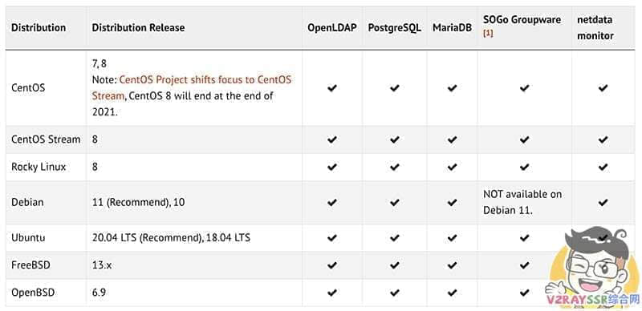
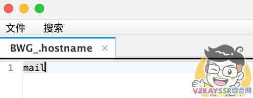
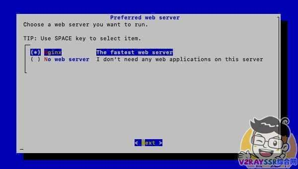
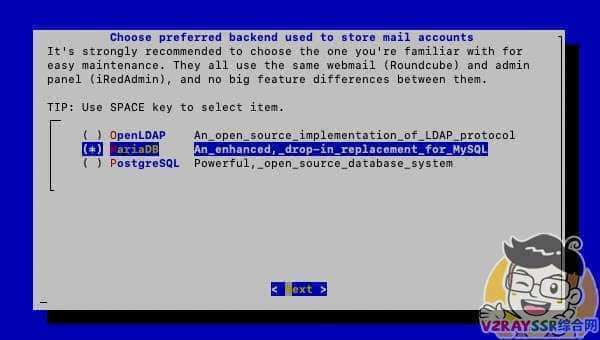
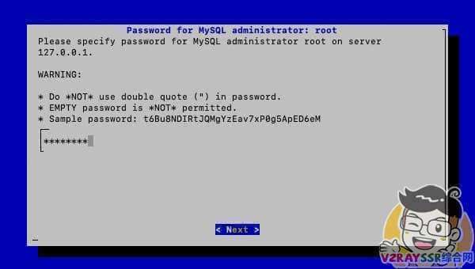
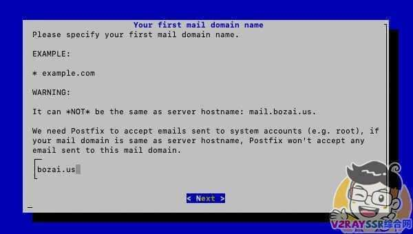
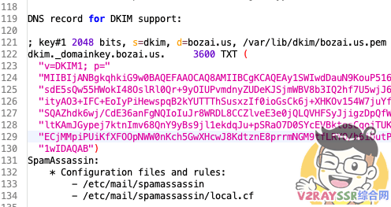
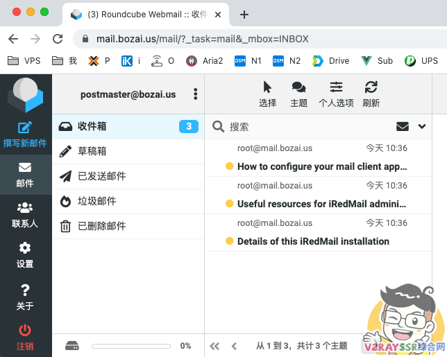

# 自建企业级邮件服务器、域名邮箱！iRedMail 企业级邮件系统搭建、配置、优化教程！

文章导读目录

[](#)

-   [前言](#%E5%89%8D%E8%A8%80 "前言")
-   [演示视频](#%E6%BC%94%E7%A4%BA%E8%A7%86%E9%A2%91 "演示视频")
-   [iRedMail 支持的系统](#iRedMail_%E6%94%AF%E6%8C%81%E7%9A%84%E7%B3%BB%E7%BB%9F "iRedMail 支持的系统")
-   [准备工具](#%E5%87%86%E5%A4%87%E5%B7%A5%E5%85%B7 "准备工具")
-   [搭建 iRedMail 邮件服务器](#%E6%90%AD%E5%BB%BA_iRedMail_%E9%82%AE%E4%BB%B6%E6%9C%8D%E5%8A%A1%E5%99%A8 "搭建 iRedMail 邮件服务器")
    -   [设置 VPS 以及系统](#%E8%AE%BE%E7%BD%AE_VPS_%E4%BB%A5%E5%8F%8A%E7%B3%BB%E7%BB%9F "设置 VPS 以及系统")
        -   [更新系统、安装组件](#%E6%9B%B4%E6%96%B0%E7%B3%BB%E7%BB%9F%E3%80%81%E5%AE%89%E8%A3%85%E7%BB%84%E4%BB%B6 "更新系统、安装组件")
        -   [设置 VPS 主机名](#%E8%AE%BE%E7%BD%AE_VPS_%E4%B8%BB%E6%9C%BA%E5%90%8D "设置 VPS 主机名")
    -   [下载并安装 iRedMail](#%E4%B8%8B%E8%BD%BD%E5%B9%B6%E5%AE%89%E8%A3%85_iRedMail "下载并安装 iRedMail")
-   [配置 iRedMail 邮件服务器](#%E9%85%8D%E7%BD%AE_iRedMail_%E9%82%AE%E4%BB%B6%E6%9C%8D%E5%8A%A1%E5%99%A8 "配置 iRedMail 邮件服务器")
    -   [申请证书](#%E7%94%B3%E8%AF%B7%E8%AF%81%E4%B9%A6 "申请证书")
    -   [重载服务](#%E9%87%8D%E8%BD%BD%E6%9C%8D%E5%8A%A1 "重载服务")
    -   [禁用 iRedMail 灰名单](#%E7%A6%81%E7%94%A8_iRedMail_%E7%81%B0%E5%90%8D%E5%8D%95 "禁用 iRedMail 灰名单")
-   [配置域名 DNS 及解析](#%E9%85%8D%E7%BD%AE%E5%9F%9F%E5%90%8D_DNS_%E5%8F%8A%E8%A7%A3%E6%9E%90 "配置域名 DNS 及解析")
    -   [设置 PTR 反向解析](#%E8%AE%BE%E7%BD%AE_PTR_%E5%8F%8D%E5%90%91%E8%A7%A3%E6%9E%90 "设置 PTR 反向解析")
    -   [设置 A 记录](#%E8%AE%BE%E7%BD%AE_A_%E8%AE%B0%E5%BD%95 "设置 A 记录")
    -   [设置 MX 记录](#%E8%AE%BE%E7%BD%AE_MX_%E8%AE%B0%E5%BD%95 "设置 MX 记录")
    -   [设置 SPF 记录](#%E8%AE%BE%E7%BD%AE_SPF_%E8%AE%B0%E5%BD%95 "设置 SPF 记录")
    -   [设置 DKIM 记录](#%E8%AE%BE%E7%BD%AE_DKIM%E8%AE%B0%E5%BD%95 "设置 DKIM记录")
    -   [设置 DMARC 记录](#%E8%AE%BE%E7%BD%AE_DMARC_%E8%AE%B0%E5%BD%95 "设置 DMARC 记录")
-   [添加 iRedMail 用户](#%E6%B7%BB%E5%8A%A0_iRedMail_%E7%94%A8%E6%88%B7 "添加 iRedMail 用户")
-   [测试 iRedMail 邮件服务器](#%E6%B5%8B%E8%AF%95_iRedMail_%E9%82%AE%E4%BB%B6%E6%9C%8D%E5%8A%A1%E5%99%A8 "测试 iRedMail 邮件服务器")
-   [后记](#%E5%90%8E%E8%AE%B0 "后记")

## 前言

用自己的域名作为邮箱的后缀，好看、有面子！只要域名不过期，那么，你的邮箱就永远存在！

免费的企业邮局，以前也是为大家介绍过 ZOHO（[点击观看视频](https://v2rayssr.com/go?url=https://youtu.be/cKa4gPFB6QA)），但是 ZOHO 广告多、邮件账户限制等，很是烦躁。经常会用到邮箱来获取很多服务，所以就想着自行搭建一个邮局了，首选，当然是免费、开源的 iRedMail。

邮件系统很多，宝塔自带的邮局更是简单，但是若想邮箱可靠（丢邮件、发送邮件进入对方垃圾箱等），还是需要花费一点功夫。

首先 VPS 支持 PTR 反向解析，尤为重要，当然，也不是必须的，看你自己的取舍，若是没有 PTR，会存在丢失邮件的情况。

> 相关知识普及：
> 
> 在邮件的交换记录中，有 A 记录 和 PTR 记录 两种，A 记录大家应该是耳熟能详了，我们每天搭建服务、解析域名到 IP，用的就是 A 记录，我们称为正向解析，用来映射域名到 IP
> 
> 而 PTR 记录，则是相反的，所以也被我们成为反向解析，他是用来把一个 IP 映射到域名。

接下来，我们一起配置这款得分满分的邮件服务器。

## 演示视频

[](https://v2rayssr.com/go?url=https://youtu.be/pwgU4FRck98)

## iRedMail 支持的系统



## 准备工具

1、干净的 VPS 一台，内存最好大于 1 GB，推荐 CentOS、Ubuntu，以下教程用 CentOS 演示，Ubuntu 请自行更换 yum 命令即可。

（CentOS 项目将重点转移到 CentOS Stream，CentOS 8 将在 2021 年底结束）

2、VPS 最好支持 PTR Records，演示用的 VPS 来自 [搬瓦工](https://v2rayssr.com/bwg.html)

3、域名一个，推荐托管 cloudflare（解析生效快）

（若是没有域名，或是不会注册，或是不会托管到 cloudflare，[请点击这里](https://v2rayssr.com/yumingreg.html)）

4、规划好作为邮件服务器的域名，演示用 `mail.bozai.us`，把该域名解析到 VPS IP。

## 搭建 iRedMail 邮件服务器

### 设置 VPS 以及系统

#### 更新系统、安装组件

1.  yum update \-y
2.  yum install wget curl sudo tar socat bind\-utils \-y

#### 设置 VPS 主机名

我们规划邮局的域名为 `mail.bozai.us` ，所以，我们需要对 VPS 的主机名进行设置。

首先，需要编辑 `/etc/hosts` 文件，找到含有你的 VPS IP 地址的那一行；如果没有，则添加一行。内容如下：

```bash
127.0.0.1 mail.bozai.us mail
```

其中，127.0.0.1 可换为你的服务器 IP 地址，后面依次填入长主机名和短主机名，切记不可填反。


然后，我们找到 VPS 的 `/etc/hostname` 文件，编辑里面的内容为 `mail` （域名的前缀）



这样，就设置好了主机名。***重启 VPS***（ [搬瓦工](https://v2rayssr.com/bwg.html) 用户进行到这步，第一次重启请去后台强制重启）。

此时我们检查一下是否设置正确：

执行：`hostname`

此时我们应该只能看到短主机名 `mail`. 如果你看到了长主机名 `mail.bozai.us` , 说明之前设置错误，请重新检查上述步骤。

执行：`hostname -f`

此时，我们应该只能看到长主机名 `mail.bozai.us`

这样，我们就全部设置好了主机名（hostname）, 可以进行接下来的其他操作了

### 下载并安装 iRedMail

作者写这篇博文的时候，iRedMail 的最新版为 1.4.2，若是版本进行了更新，请大家自行修改下面命令中的版本号。

iRedMail 最新版下载：[点击查看最新版](https://v2rayssr.com/go?url=https://www.iredmail.org/download.html)

1.  wget https://github.com/iredmail/iRedMail/archive/1.4.2.tar.gz -O /root/iRedMail.tar.gz
2.  tar \-xf iRedMail.tar.gz
3.  cd iRedMail\-1.4.2
4.  bash iRedMail.sh

按照以下图片的提示进行安装


不安装，请按 Ctrl-C


设置安装目录



选择 web 服务器



选择数据库类型



设置数据库密码



设置域，不可与 hostname 相同


设置管理员账号、密码


选择需要安装的组件


根据系统提示，一路输入 `y` 回车


**重启服务器，让邮件服务器生效！** 至此，邮件服务器搭建完毕，以下开始设置邮件服务器。

1.  可以通过访问（当然，我们目前还没有解析域名，后面一起解析）
2.  https://你的域名/mail        ——邮件登录地址
3.  https://你的域名/netdata     ——服务器状态监控
4.  https://你的域名/iredadmin   ——邮件服务器后台管理
6.  管理员账号：postmaster@你的域  例如 postmaster@163.com
7.  管理员密码：安装时候设置的密码
8.  以上信息，可以在 /root/iRedMail\-1.4.2/iRedMail.tips 文件中查看

## 配置 iRedMail 邮件服务器

在申请证书之前，请完成 邮件服务器域名 的相关解析，我们规划的邮件服务器地址为 `mail.bozai.us` ，所以，申请证书之前，需要对把该域名指向 VPS IP。

### 申请证书

以下是 ACME 脚本申请证书，比较方便，若是证书申请上面有问题，请 [访问这里](https://v2rayssr.com/ssl.html)

（后续自己把证书移动、覆盖到 `/etc/pki/tls/private/iRedMail.key` 以及 `/etc/pki/tls/certs/iRedMail.crt` ）

为我们计划的邮件服务器域名 `mail.bozai.us` 申请证书，请自行替换命令行中的域名

1.  curl https://get.acme.sh | sh
2.  ~/.acme.sh/acme.sh \--register\-account \-m xxxx@xxxx.com
3.  ~/.acme.sh/acme.sh  \--issue  \-d mail.bozai.us  \--webroot  /var/www/html
4.  ~/.acme.sh/acme.sh \--installcert \-d mail.bozai.us \--key\-file /etc/pki/tls/private/iRedMail.key \--fullchain\-file /etc/pki/tls/certs/iRedMail.crt

### 重载服务

```bash
service postfix reload;service dovecot reload;service nginx reload
```

### 禁用 iRedMail 灰名单

找到 VPS 文件，`/opt/iredapd/settings.py`

```bash
plugins = ["reject_null_sender", "wblist_rdns", "reject_sender_login_mismatch", "greylisting", "throttle", "amavisd_wblist", "sql_alias_access_policy"]
```

将其中的”`greylisting` ”这项删去即可（注意对齐格式，不会请看 演示视频）

然后，重启 iredapd

```bash
service iredapd restart
```

## 配置域名 DNS 及解析

***以下内容，推荐观看 [演示视频](https://v2rayssr.com/go?url=https://youtu.be/pwgU4FRck98)，然后根据需要，替换以下命令行中的相关命令。***

### 设置 PTR 反向解析

其他 VPS 商家，请自行查阅，[搬瓦工 VPS](https://v2rayssr.com/bwg.html) 打开后台管理，在左边选项 `Mail contrlos` 里面，找到右边的 `PTR Records (Reverse DNS)`，点击 `set new record` 设置即可。


检测方式：`nslookup 8.8.8.8（服务器IP）`

### 设置 A 记录

将 `mail.bozai.us` 的 A 记录指向你的 VPS 服务器（邮件服务器）

检测方式：`nslookup mail.bozai.us`

### 设置 MX 记录

MX 记录就是邮件的解析记录，非常重要的一条记录，配置根域名的 MX 记录为自己的邮件域名地址，优先级为 10

检测方式：`nslookup -type=mx bozai.me`

### 设置 SPF 记录

SPF 记录是为了防止垃圾邮件而设定的，告知收件方，从设置的允许列表中发出的邮件都是合法的，设置方式为添加一条根域名的 TXT 解析记录

内容为 `v=spf1 mx ~all`

检测方式：`nslookup -type=txt bozai.us`

### 设置 DKIM 记录

DKIM 可说是避免被判定为垃圾邮件的一大利器，DKIM 属于一种类似加密签名的解析记录，只有包含此加密数据，且公钥与密钥相匹配才属于合法邮件，要设置 DKIM 记录，首先要查询 DKIM 信息。

查询 DKIM 信息有两种方式：

**第一种：**在系统中执行命令查看：`amavisd showkeys`

若是出现报错：`Config file "/etc/amavisd.conf" does not exist, at /usr/sbin/amavisd line`


修改 `/usr/sbin/amavisd` 文件

搜索 `config_files = ( '`

把括号里面的路径改为 `‘/etc/amavisd/amavisd.conf’`

**第二种：**直接查看 `/root/iRedMail-1.4.2/iRedMail.tips` 文件，里面有相应的 DKIM



将括号内的文本 ***去除引号以及空格并相连*** 就是咱们的 DKIM 数据，在解析中添加一条 `dkim._domainkey` 的 TXT 解析，内容就是咱们组合出的文本

测试方式：`nslookup -type=txt dkim._domainkey.bozai.us`


### 设置 DMARC 记录

DMARC 记录是当收件方检测到伪造邮件等行为时，将根据您的配置进行操作的一个记录，比如拒绝邮件或放入垃圾邮件以及不做处理等，同时会反馈一份检测报告到配置的邮箱地址内。

添加方法就是增加一条 `_dmarc` 的 TXT 解析，内容为配置选项，`v=DMARC1; p=none; pct=100; rua=mailto:dmarc@bozai.us`

检测方式：`nslookup -type=txt _dmarc.bozai.us`

## 添加 iRedMail 用户

当然，你可以直接使用刚才系统创建的系统管理员邮箱，我们另外也可以增加邮箱用户

登录前，选择你的网页语言，其他就很简单了，如下图


## 测试 iRedMail 邮件服务器

登录你的邮件服务器，里面的三封邮件是系统发过来的。



尝试用该邮件发送以及接收其他邮件的邮件，若是严格按照上面来配置，应该是一点问题都没有。

最后，我们访问 [https://www.mail-tester.com/](https://v2rayssr.com/go?url=https://www.mail-tester.com/)

按照网页上面给出的邮箱地址，我们用刚才搭建好的邮件服务器给这个地址发送一封邮件，然后点击测试。

***记住，该测试，每 24 小时，只允许同个域测试三次，所以需要测试还是需要谨慎发邮件，别发垃圾！***


用刚才创建的用户，给 GMAIL 发一封邮件试试。


如果你是需要用其他客户端软件来收取或是发送邮件，端口列表在这里：

|     |     |     |     |     |     |     |
| --- | --- | --- | --- | --- | --- | --- |
| 协议  | 地址  | 端口&加密端口 |
| IAMP | 邮箱域名 | 143,993 |
| POP3 | 邮箱域名 | 110,995 |
| SMTP | 邮箱域名 | 25,587 |

我这边用的“网易邮件大师”，可以完美的收发邮件，客户端如下配置：


收发邮件完美！


## 后记

Perfect！`mail-tester` 测试 10 分！满分 10！多棒的企业/个人邮件服务器，还担心会丢邮件吗？

其实有些人，觉得免费邮箱已经够用了，所以，此教程送给爱折腾、希望邮件自由的小伙伴们。
